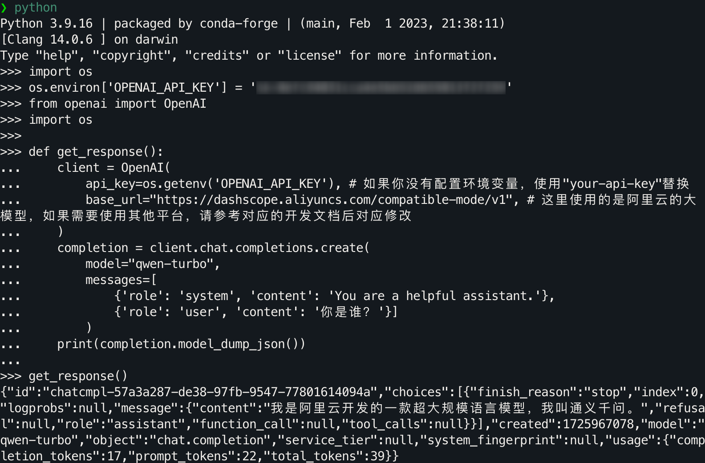
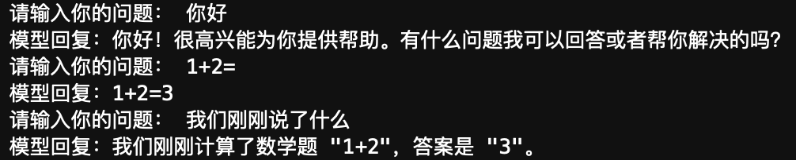
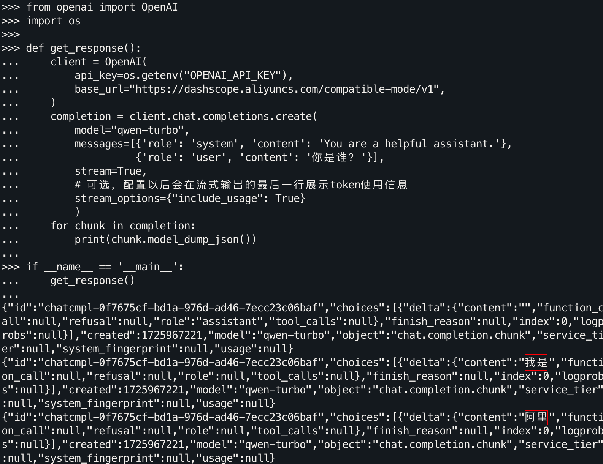

> 其实AI应用并不是一个什么很高大上的东西，你可以将它当作一个文字的“调库”行为，“调库”只需要知道库名就行了，这里实际也是如此。甚至你只需要知道你想问什么，将你的消息作为输入，就能从大模型得到输出。而这个“库”本身，是已经部署好了的，对于这样的一个黑盒的使用并没有太多的技术要求，不用担心自己的知识储备不够，因为这里并不需要你对AI本身有了解，也不需要你去训练一个AI，只是使用它。
>
> 毕竟在ChatGPT发布（*2022.11.30*）之前，AI应用并不广泛被需要，这是大模型兴起之后的自然产物。
>
> 使用国内大模型API是为了降低获取门槛。（不过获取步骤确实稍微复杂点，有种国内外教科书风格的差异感） 
>

这里假设你已经获取到了`API KEY`，阿里云将这个 API 命名为`DASHSCOPE_API_KEY`（**灵积**是阿里云推出的模型服务平台，**DashScope** 是灵积的英文名），不过为了更加通用，我们还是将其命名为`OPENAI_API_KEY`

# 环境变量配置

环境变量是操作系统中以键值对形式存储的配置项，常用于保存敏感信息（如 API 密钥、数据库连接地址等），这样可以避免将这些私密的信息直接写在代码中。

你可以通过操作系统设置环境变量，或者直接在 Python 脚本中设置，二选一。

**在终端 (Linux/Mac) 设置：**

```bash
export OPENAI_API_KEY="your-api-key"
```

**在命令提示符 (Windows) 中设置：**

```cmd
set OPENAI_API_KEY=your-api-key
```

**通过 Python 程序设置环境变量：**

```python
import os
os.environ['OPENAI_API_KEY'] = 'your-api-key'
```

## os.getenv()

`os.getenv()` 是 Python 中 `os` 模块的一个函数，用于获取系统环境变量的值，语法：

```python
os.getenv('VARIABLE_NAME', default_value)
```

- `'VARIABLE_NAME'`: 要获取的环境变量的名称。
- `default_value` (可选): 如果环境变量不存在，可以指定一个默认值，当环境变量未设置时将返回该默认值。

**示例：**

假设你已经配置好了 `DASHSCOPE_API_KEY` 的环境变量，并且你想在 Python 脚本中访问它：

```python
import os

api_key = os.getenv('OPENAI_API_KEY')
print(api_key)  # 如果环境变量已设置，它将输出对应的值。
```

如果该环境变量没有设置，并且你希望提供一个默认值：

```python
api_key = os.getenv('OPENAI_API_KEY', 'default_key')
print(api_key)  # 如果环境变量没有设置，它将输出 'default_key'。
```

# 演示

我们选择使用OpenAI库进行演示，首先命令行安装。

```bash
pip3 install -U openai
```

在安装完成后，用 Python 进行访问尝试，在这里我们使用通义千问-Turbo进行演示。

```python
from openai import OpenAI
import os

def get_response():
    client = OpenAI(
        api_key=os.getenv('OPENAI_API_KEY'), # 如果你没有配置环境变量，使用"your-api-key"替换
        base_url="https://dashscope.aliyuncs.com/compatible-mode/v1", # 这里使用的是阿里云的大模型，如果需要使用其他平台，请参考对应的开发文档后对应修改
    )
    completion = client.chat.completions.create(
        model="qwen-turbo",
        messages=[
            {'role': 'system', 'content': 'You are a helpful assistant.'},
            {'role': 'user', 'content': '你是谁？'}]
        )
    print(completion.model_dump_json())

get_response()
```

完整的运行流程和结果如下：




>注意，不要误用成`api_key=os.getenv("your-api-key")`，`os.getenv()`用于获取对应系统环境变量的值，API本身并不是这个环境变量。
>
>否则你就会遇到一个对于新手来讲不够直接的报错：`OpenAIError: The api_key client option must be set either by passing api_key to the client or by setting the OPENAI_API_KEY environment variable`。

## 多轮对话

之前的代码只提供了单轮的对话，没有历史记录，没有上下文，只是一个简单的临时对话，你可以将其理解为无痕浏览，关了就没了。

接下来，我们介绍多轮的对话，这里的轮指的是一次问答。模型本身并不会因为你的问题即时得到训练，所以也不会保留你之前的对话，那我们怎么去让模型知道呢？

答：朴素的手动保存上传。

```python
from openai import OpenAI
import os

def get_response(messages):
    client = OpenAI(
        api_key=os.getenv('OPENAI_API_KEY'), 
        base_url="https://dashscope.aliyuncs.com/compatible-mode/v1",
    )
    completion = client.chat.completions.create(
        model="qwen-turbo",
        messages=messages
        )
    return completion

messages = [{'role': 'system', 'content': 'You are a helpful assistant.'}]
# 您可以自定义设置对话轮数，当前为3
for i in range(3):
    user_input = input("请输入：")
    
    # 将用户问题信息添加到messages列表中，这部分等价于之前的单轮对话
    messages.append({'role': 'user', 'content': user_input})
    assistant_output = get_response(messages).choices[0].message.content
    
    # 将大模型的回复信息添加到messages列表中，这里是历史记录，保存上下文
    messages.append({'role': 'assistant', 'content': assistant_output})
    print(f'用户输入：{user_input}')
    print(f'模型输出：{assistant_output}')
    print('\n')
```



## 流式输出

语言模型并不是直接得出完整的一句话，而是一个字一个字（其实是token，为了更大白话一点这里用字帮助理解）去生成的。前面的对话都是直接获取到了最终的生成结果，我们怎么得知它具体是怎么来的呢？

下面这部分相当于之前的单轮对话，只是改变了输出方式。

```python
from openai import OpenAI
import os

def get_response():
    client = OpenAI(
        api_key=os.getenv("OPENAI_API_KEY"),
        base_url="https://dashscope.aliyuncs.com/compatible-mode/v1",
    )
    completion = client.chat.completions.create(
        model="qwen-turbo",
        messages=[{'role': 'system', 'content': 'You are a helpful assistant.'},
                  {'role': 'user', 'content': '你是谁？'}],
        stream=True,
        # 可选，配置以后会在流式输出的最后一行展示token使用信息
        stream_options={"include_usage": True}
        )
    for chunk in completion:
        print(chunk.model_dump_json())

if __name__ == '__main__':
    get_response()
```



我们为什么要获取流式输出？因为使用直接的对话模式需要等待大模型生成结束后，才传回每个部分拼接后的结果，而流式输出可以让你实时了解到生成的信息，在模型生成的时候进行阅读，从而利用上中间的等待时间，这是一个可以同步进行的事情，异步浪费了我们的时间。毕竟，有些回答刚一开口就可以否决掉。

> 常见问题：
>
> 1. 通义千问、灵积、DashScope、百炼是什么关系？
>
>    **通义千问**是阿里云研发的大语言模型；**灵积**是阿里云推出的模型服务平台，提供了包括通义千问在内的多种模型的服务接口，**DashScope**是灵积的英文名，两者指的是同一平台；**百炼**是阿里云推出的一站式大模型应用开发平台，同时也提供模型调用服务。
>
> 2. 我如果想调用通义千问模型，是要通过灵积平台还是百炼平台？
>
>    对于需要调用通义千问模型的开发者而言，通过灵积平台与百炼平台调用通义千问模型**都是**通过dashscope SDK或OpenAI兼容或HTTP方式实现。两个平台都可以获取到API-KEY，且是同步的。因此您只需准备好计算环境，并在两个平台任选其一创建API-KEY，即可发起通义千问模型的调用。

# 进一步

当前文章所有的代码已经整理为了notebook文件：[LLM API 使用演示——从环境配置到多轮对话.ipynb 下载](https://github.com/Hoper-J/LLM-API-Guide-and-Demos/blob/master/1.%20LLM%20API%20使用演示——从环境配置到多轮对话.ipynb)

阿里大模型平台同样支持很多其他的模型，比如Llama3.1，ChatGLM3，StableDiffusion等，感兴趣的话详细可见[模型列表](https://help.aliyun.com/zh/model-studio/getting-started/models?spm=a2c4g.11186623.0.0.5f7c65c7eVBHMa)。

下一篇文章：[2. 使用API快速搭建你的第一个AI应用]()。

# 参考链接

- [Chat - OpenAI Docs](https://platform.openai.com/docs/api-reference/chat/create)
- [Completions - OpenAI Docs](https://platform.openai.com/docs/guides/completions)
- [通过API使用通义千问-阿里云官方文档，GIF来源](https://help.aliyun.com/zh/model-studio/developer-reference/use-qwen-by-calling-api)
- [其中作业3相关的PDF文件和Colab](https://speech.ee.ntu.edu.tw/~hylee/genai/2024-spring.php)
