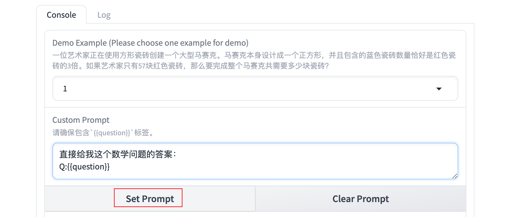
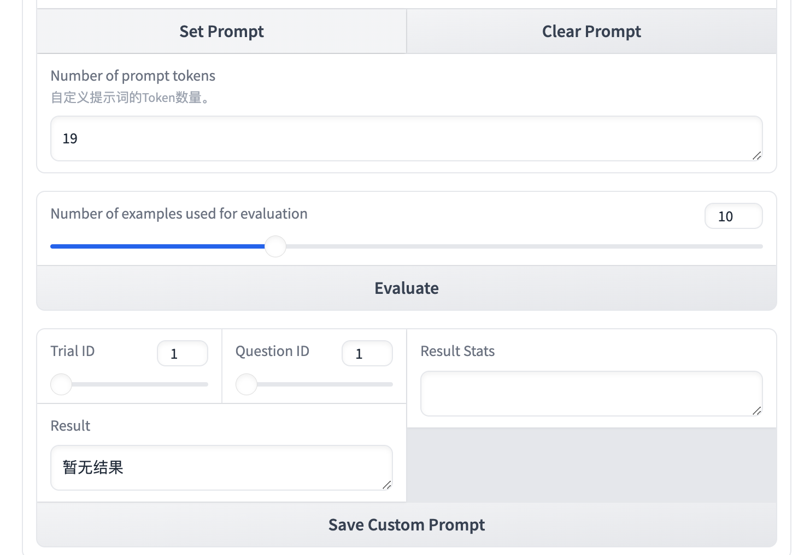
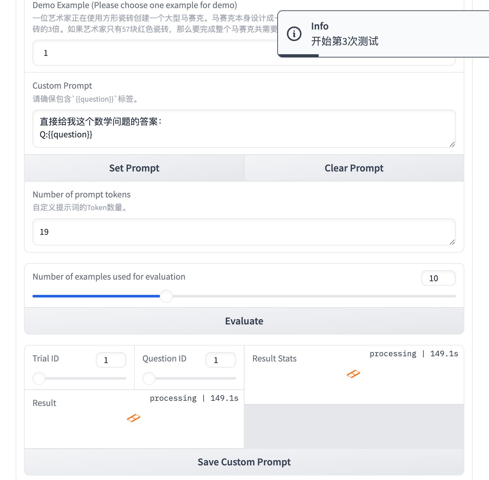
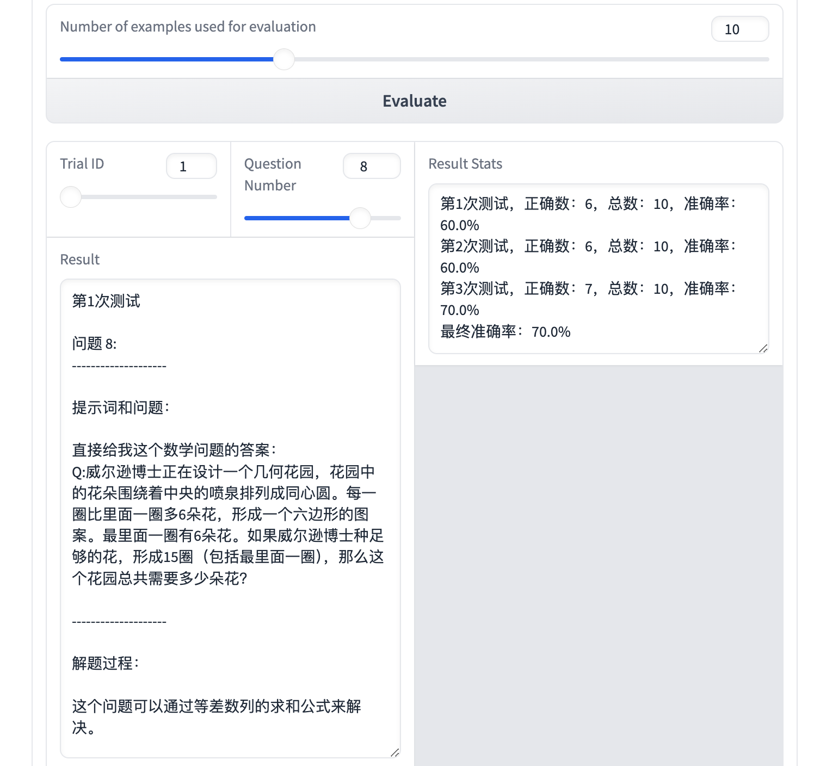
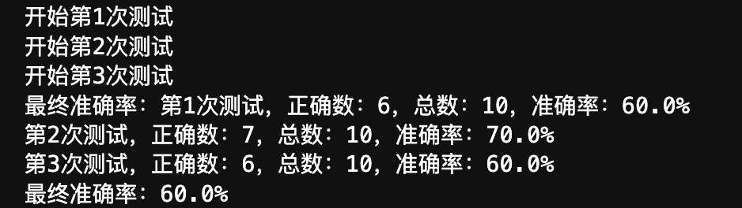

> 怎么判断 Prompt 的好坏，有什么问题有着标准答案么？
>
> 答：让大模型求解数学问题。
>
> 李宏毅老师的 [HW4](https://www.bilibili.com/video/BV1BJ4m1e7g8?p=15&vd_source=436107f586d66ab4fcf756c76eb96c35) 正好提到了有关数学问题的 Prompt，所以我决定中间插一篇这样的文章。通过本文你将：
>
> 1. 了解各种 Prompt 如何影响大型语言模型的性能。
> 2. 设计 Prompt 提高大模型解决数学问题的正确性。
> 3. 了解占位符的使用 
> 4. 了解如何使用 ipywidgets 创建交互模块。
>
> 如果你可以访问 Gemini，可以在 [Google AI Studio](https://aistudio.google.com/app/apikey?hl=zh-cn) 中非常快速的获取 Gemini API，从而在 Colab 上进行学习：[HW4 - Colab](https://colab.research.google.com/drive/16JzVN_Mu4mJfyHQpQEuDx1q6jI-cAnEl?hl=zh-tw#scrollTo=ZvU3-01m3wmy&uniqifier=1)。
>
> 因为国家政策原因，这里不会提供🪜的教程，但本文会根据 HW4 的完整内容进行组织，并将 Colab 中的 @param 使用 ipywidgets 进行替代，提供一个大陆版本的中文作业镜像。
>
> 注意，尽管我提到的是**作业**，但并不意味着你需要视频基础，其实你也可以直接进行学习，这没有门槛。
>
> [代码文件下载](https://github.com/Hoper-J/LLM-Guide-and-Demos/blob/master/Demos/3.%20自定义%20Prompt%20提升大模型解题能力——Gradio%20与%20ipywidgets版.ipynb)

[TOC]

# 下载，导入和配置

```bash
pip install tqdm jinja2 gradio tiktoken openai
```

```python
import os
import time
import re
import pickle
import json
import traceback

import openai
import tiktoken  # 用于 prompt_token_num()
import jinja2
from tqdm import tqdm
```

填充你的`API`并运行代码：


## 初始化 OpenAI 模型

实际上如果专注于 Prompt，可以暂时跳过这部分。

```python
class OpenAIModel():
    def __init__(self, cache_file="openai_cache"):
        # 初始化 OpenAI 模型对象，并设置缓存文件
        self.cache_file = cache_file
        self.cache_dict = self.load_cache()  # 加载缓存

    def save_cache(self):
        # 将当前缓存保存到文件
        with open(self.cache_file, "wb") as f:
            pickle.dump(self.cache_dict, f)

    def load_cache(self, allow_retry=True):
        # 从文件加载缓存，带有重试机制
        if os.path.exists(self.cache_file):
            while True:
                try:
                    with open(self.cache_file, "rb") as f:
                        cache = pickle.load(f)
                    break
                except Exception:
                    if not allow_retry:
                        assert False
                    print("Pickle Error: 5秒后重试...")
                    time.sleep(5)
        else:
            # 如果文件不存在则初始化缓存
            cache = {}
        return cache

    def set_cache_file(self, file_name):
        # 设置缓存文件名并加载缓存
        self.cache_file = file_name
        self.cache_dict = self.load_cache()

    def get_completion(self, content):
        # 获取模型完成的文本，先检查缓存，若无则请求生成
        # 如果选择检查缓存，则会导致同问题不同trial的结果相同，这与实际想表达的内容不符，故注释
        # if content in self.cache_dict:
        #     return self.cache_dict[content]
        for _ in range(3):
            try:
                # 调用模型生成内容
                response = client.chat.completions.create(
                    model="qwen-turbo",
                    messages=[{'role': 'user', 'content': content}],
                    temperature=1.0,
                )
                completion = response.choices[0].message.content
                self.cache_dict[content] = completion
                return completion
            except Exception as e:
                print(e, "\n")
                time.sleep(1)
        return None

    def is_valid_key(self):
        # 检查 API 密钥是否有效
        for _ in range(4):
            try:
                response = client.chat.completions.create(
                    model="qwen-turbo",
                    messages=[{'role': 'user', 'content': "hi there"}],
                    temperature=1.0,
                    max_tokens=1
                )
                return True
            except Exception as e:
                traceback.print_exc()
                time.sleep(1)
        return False

    def prompt_token_num(self, prompt):
        # 使用 tiktoken 来计算 token 数量
        try:
            # 使用 gpt-3.5-turbo 的编码器，因为 tiktoken 库不支持自动识别 qwen-turbo 模型
            encoding = tiktoken.get_encoding("cl100k_base")  # 这是 GPT-3.5-turbo 所使用的编码器
            # 将 prompt 编码成 token，并返回 token 数量
            tokens = encoding.encode(prompt)
            return len(tokens)
        except Exception as e:
            print(f"计算 token 数量时出错: {e}")
            return 0

    def two_stage_completion(self, question, content):
        # 两阶段完成：首先获取推理，再获取最终答案
        rationale = self.get_completion(content)
        if not rationale:
            return {
                'prompt': content,
                'rationale': None,
                'answer': None
            }

        ans = self.get_completion(content=f"Q:{question}\nA:{rationale}\nThe answer to the original question is (a number only): ")
        return {
            'prompt': content,
            'rationale': rationale,
            'answer': ans
        }

# 初始化模型
my_model = OpenAIModel()
```

# 🧙 创建你的自定义 Prompt（Gradio 版本）

以下完全基于你下载了代码文件或者使用了Colab进行。你需要暂时忽略代码细节，专注于 Prompt 设计。

你需要一直运行提供的代码：


直到看到一个这样的交互界面：


## 设计Prompt解决数学问题

现在需要设计你自己的  Prompt，填写在 `Custom Prompt` 中，注意，你的 Prompt 中需要包含 `{{question}}`，这将作为一个占位符，后续被 `Demo Example` 显示的问题替换。


使用 `Shift+Enter` 可以在文本框中换行。在设计完成之后，点击 `Set Prompt`设置当前 Prompt。



设置的结果可以点击 `Log` 查看：


回到 `Console` 界面，如果想重新设置 Prompt，点击 `Clear Prompt` 清除已输入的任何自定义提示词：



在点击 `Evalute` 进行评估之前，你需要了解对应的概念：

- `Number of prompt tokens`
  显示当前 Prompt 的 Token 数量，作业会限制最大长度为 1024。

- `Number of examples used for evaluation` 
  意味着我们将去评估多少个问题的答案。

- `Trail ID`
  对指定评估的问题，将进行三次测试。

- `Question ID`

  受 `Number of examples used for evaluation `限制，为问题数量。

假设我们仅评估前10个问题，设置`Number of examples used for evaluation` 为10，点击 `Evaluate`。



你可以改变`Trail ID`和`Question ID`来查看某次测试下对应问题的结果，并可以得到 3 次测试下 Prompt 的准确率。



你还可以点击 `Log` 进一步查看细节：


# 🧙 创建你的自定义 Prompt（非 Gradio 版本）

这个版本将不涉及 Gradio，使用 ipywidgets 来创建交互界面。

实际上这里只是一个拓展，如果只是想练习 Prompt 的使用，查看 Gradio 版本即可。

## 导入

```python
import ipywidgets as widgets
from IPython.display import display
```

## 自定义 Prompt

```python
import ipywidgets as widgets
from IPython.display import display

# 创建文本区域、按钮和输出区域
prompt_area = widgets.Textarea(placeholder="在此输入你的自定义提示词")
prompt_area_desc = widgets.HTML(value="<p><b>Custom Prompt:</b></p>")
setprompt_btn = widgets.Button(description="Set Prompt")
resetprompt_btn = widgets.Button(description="Clear Prompt")
display_output = widgets.Output()

# 初始化自定义提示词变量
custom_prompt = ""

# 定义“Assign Prompt”按钮点击事件
def set_prompt_clk(b):
    global custom_prompt
    custom_prompt = prompt_area.value  # 获取输入框中的提示词
    prompt_area.disabled = True  # 禁用输入框
    with display_output:
        display_output.clear_output()  # 清除之前的输出
        print("Prompt 已分配：", custom_prompt)  # 打印已分配的提示词

# 定义“Clear Prompt”按钮点击事件
def reset_prompt_clk(b):
    prompt_area.disabled = False  # 重新启用输入框
    prompt_area.value = ""  # 清空输入框
    with display_output:
        display_output.clear_output()  # 清除之前的输出
        print("提示词已重置")  # 提示已重置

# 绑定按钮点击事件
setprompt_btn.on_click(set_prompt_clk)
resetprompt_btn.on_click(reset_prompt_clk)

# 显示组件
display(prompt_area_desc, prompt_area, setprompt_btn, resetprompt_btn, display_output)
```

在文本框中填写你的 Prompt：


### 创建下拉选项选择问题

这部分实现Colab中的 `Demo_Example = "7" # @param [1,2,3,4,5,6,7,8,9,10,11,12,13,14,15,16,17,18,19,20,21,22,23,24,25,26,27,28,29,30] {type:"string"}`

```python
# 创建下拉菜单，允许用户选择 1 到 30 之间的数字
demo_example_dropdown = widgets.Dropdown(
    options=[str(i) for i in range(1, 31)],  # 选项为字符串
    value="7",  # 默认值
    description='示例编号:',
)

# 创建输出区域
output_demo_example = widgets.Output()

# 定义一个回调函数，当用户选择新值时触发
def on_dropdown_change(change):
    global Demo_Example  # 使用全局变量
    Demo_Example = change['new']  # 获取下拉菜单的新值
    with output_demo_example:
        output_demo_example.clear_output()  # 清除之前的输出
        print(f"已选择的示例编号是: {Demo_Example}")

# 监听下拉菜单的变化
demo_example_dropdown.observe(on_dropdown_change, names='value')

# 显示下拉菜单和输出区域
display(demo_example_dropdown, output_demo_example)
```

默认选择示例7:


查看占位符的作用：

```python
# 从文本框获取用户输入的自定义提示词
custom_prompt = prompt_area.value
assert "{{question}}" in custom_prompt, "提示词中必须包含 '{{question}}' 占位符！"

# 通过上面的下拉选项选择一个示例，你可以选择1到30之间的编号 
demo_index = eval(Demo_Example)  # 将字符串形式的数字转为整数

# 初始化 jinja2 环境并渲染模板
environment = jinja2.Environment()
template = environment.from_string(custom_prompt)

# 输出生成的自定义提示词示例
print(f"自定义提示词示例：\n\n{template.render(question=questions[demo_index-1])}")
```

可以看到原来占位符的位置被替换为了第7个问题。


## 评估

### 创建滑块选择评估的数量

这部分用于实现Colab中的 `eval_num = 5 # @param {type:"slider", min:1, max:30, step:1}`

```python
# 创建滑块，范围为 1 到 30，步长为 1，默认值为 5
eval_slider = widgets.IntSlider(
    value=5,
    min=1,
    max=30,
    step=1,
    description='选择评估数:', 
    continuous_update=False  # 滑块放开后才更新
)

# 创建输出区域
output = widgets.Output()

# 初始化为滑块的默认值
eval_num = eval_slider.value  

# 定义一个回调函数，滑块变化时会触发
def on_slider_change(change):
    global eval_num
    eval_num = change['new']  # 获取滑块的新值
    with output:
        output.clear_output()  # 清除之前的输出
        print(f"已选择的评估数是: {eval_num}")

# 监听滑块的变化
eval_slider.observe(on_slider_change, names='value')

# 显示滑块和输出区域
display(eval_slider, output)
```

这里的演示选择10。


开始评估前10个问题下 Prompt 的正确率：

```python
assert 1 <= eval_num <= 30

# 定义显示结果的模板
ans_template = """Prompt with Question:\n\n{{question}}\n\n--------------------\n\nProblem-solving Process:\n\n{{rationale}}\n\n--------------------\n\nFinal Answer\n\n{{answer}}"""

res_list = []
test_num = eval_num  # 要评估的问题数量
total_count = test_num

# 将 ans_template 字符串转换为 jinja2 模板对象
environment = jinja2.Environment()
ans_template = environment.from_string(ans_template)

# 初始化计数器以跟踪准确回答的次数
trial_num = 3  # 进行三次试验
trials = [[] for _ in range(trial_num)]
res_stats_str = ""


def clean_commas(text):
    # 该函数用于清理数字中的逗号，并保留浮点数中的逗号
    def process_match(match):
        number = match.group(0)
        if '.' in number:
            return number  # 保留浮点数
        else:
            # 去掉数字中的逗号
            number_list = number.split(",")
            new_string = number_list[0]
            for i in range(1, len(number_list)):
                if len(number_list[i]) == 3:  # 这是千位分隔符
                    new_string += number_list[i]
                else:
                    new_string += f",{number_list[i]}"
            return new_string

    pattern = r'\d+(?:,\d+)*(?:\.\d+)?'
    return re.sub(pattern, process_match, text)


def find_and_match_floats(input_string, ground_truth):
    # 匹配输入字符串中的所有浮点数和整数
    pattern = re.compile(r"[-+]?\d*\.\d+|[-+]?\d+")
    found_numbers = pattern.findall(input_string)
    found_floats = [float(num) for num in found_numbers]
    return ground_truth in found_floats


for i in range(trial_num):

    print(f"Start trial {i+1}")
    my_model.set_cache_file(f"gemini_cache_trial_{i+1}")
    accurate_count = 0

    # 遍历每个要评估的示例
    for idx, example in enumerate(questions[:test_num]):
        test_res = ""

        result = my_model.two_stage_completion(example, template.render(question=example))

        # 检查模型是否返回了有效答案
        if not result["answer"]:
            trials[i].append(0)
            test_res += f"Trial {i+1}\n\n Skip question {idx + 1}."
            test_res += "\n" + "<"*6 + "="*30 + ">"*6 + "\n\n"
            res_list.append(f"Trial {i+1}\n\n Skip question {idx + 1}.")
            continue

        # 清理答案中的逗号并与地面真值进行比较
        cleaned_result = clean_commas(result["answer"])
        if find_and_match_floats(cleaned_result, answers[idx]) or idx in [0, 26]:
            accurate_count += 1
            trials[i].append(1)
        else:
            trials[i].append(0)

        # 保存模型的缓存
        my_model.save_cache()

        test_res += f"Trial {i + 1}\n\n"
        test_res += f"Question {idx + 1}:\n" + '-'*20
        test_res += f'''\n\n{ans_template.render(question=result['prompt'], rationale=result['rationale'], answer=result['answer'])}\n'''
        test_res += "\n" + "<"*6 + "="*30 + ">"*6 + "\n\n"
        res_list.append(test_res)

        time.sleep(1)

    # 打印准确率统计
    res_stats_str += f"Trial {i + 1}, accurate_count: {accurate_count}, total_count: {total_count}, accuracy: {accurate_count / total_count * 100}%\n"
    my_model.save_cache()

## 多数投票计算最终准确率
voting_acc = 0
for i in range(total_count):
    count = 0
    for j in range(trial_num):
        if trials[j][i] == 1:
            count += 1
    if count >= 2:
        voting_acc += 1

res_stats_str += f"Final Accuracy: {voting_acc / total_count * 100}%"

print(f"Final accuracy: {res_stats_str}")
```

用多数投票来计算最终准确率：



## 打印指定的评估结果

```python
# 定义 trial_id 和 question_id 的输入框
trial_id_input = widgets.IntText(
    value=3,  # 默认值
    description='Trial ID:',
)

question_id_input = widgets.IntText(
    value=1,  # 默认值
    description='Question ID:',
)

# 如果你想定义 trial_id 和 question_id 的滑块的话使用下面的代码
"""
trial_id_input = widgets.IntSlider(
    value=3,  # 默认值
    min=1,    # 最小值
    max=3,    # 最大值
    step=1,   # 步长
    description='Trial ID:',
    continuous_update=False  # 滑块放开后才更新
)

question_id_input = widgets.IntSlider(
    value=1,  # 默认值
    min=1,    # 最小值
    max=eval_num,   # 最大值（根据实际 eval_num 的范围调整）
    step=1,   # 步长
    description='Question ID:',
    continuous_update=False  # 滑块放开后才更新
)
"""

# 显示输出
output_result = widgets.Output()

# 定义回调函数，用于评估用户选择的值
def on_evaluate(change):
    with output_result:
        output_result.clear_output()  # 清除之前的输出
        trial_id = trial_id_input.value
        question_id = question_id_input.value
        
        if trial_id not in [1, 2, 3]:
            print("trial_id 只能是 1, 2 或 3。")
        elif question_id not in [i for i in range(1, eval_num + 1)]:
            print(f"question_id 只能在 1 到 {eval_num} 之间。")
        else:
            result_index = (trial_id - 1) * eval_num + question_id - 1
            print(f"第 {trial_id} 次试验中，第 {question_id} 个问题的评估结果是:\n{res_list[result_index]}")

# 监听值变化并执行评估逻辑
trial_id_input.observe(on_evaluate, names='value')
question_id_input.observe(on_evaluate, names='value')

# 显示滑块和输出
display(trial_id_input, question_id_input, output_result)
```

可以看到实际上 ipywidget 也可以提供一个非常直观的界面（虽然不够美观）：


## 保存你的 Propmt

如果你需要的话。

```python
prompt_dict = {
    'prompt': custom_prompt
}

with open('prompt.json', 'w') as f:
    json.dump(prompt_dict, f)

print("Prompt 已保存为 prompt.json 文件")
```


# 参考链接

[HW4 视频](https://www.bilibili.com/video/BV1BJ4m1e7g8?p=15&vd_source=436107f586d66ab4fcf756c76eb96c35) 

[HW4 - Colab](https://colab.research.google.com/drive/16JzVN_Mu4mJfyHQpQEuDx1q6jI-cAnEl?hl=zh-tw#scrollTo=ZvU3-01m3wmy&uniqifier=1)

