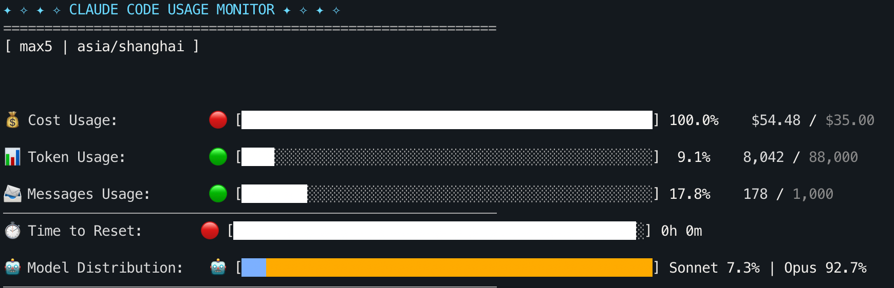
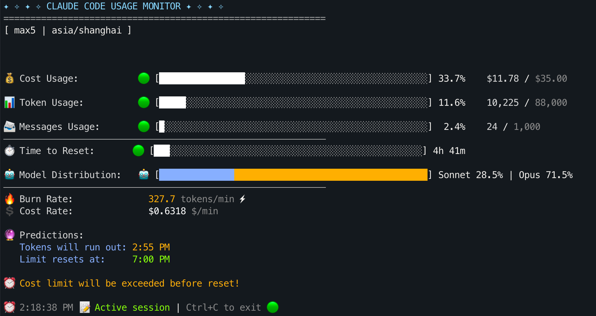
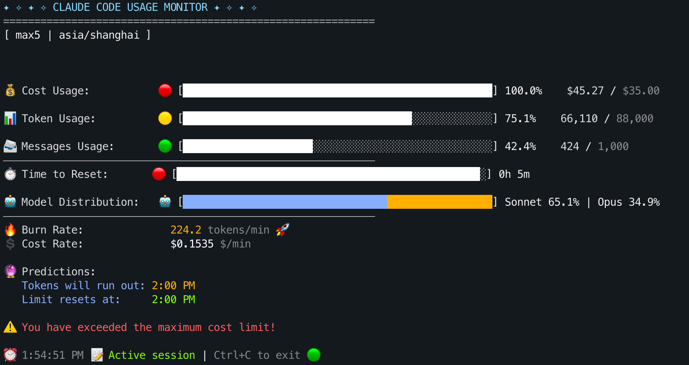
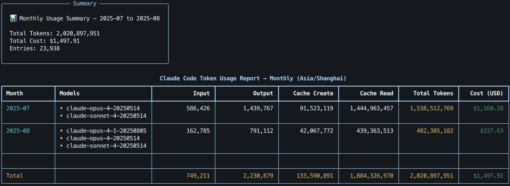
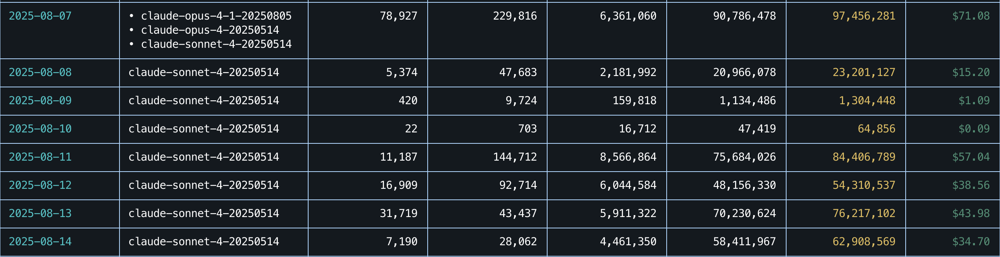

# \$125 订阅撬动 \$2000 API 额度：这是我最终选择 Claude Code Max 5x 的理由

> 一篇关于 Cursor 与 Claude Code Max 5x 体验的分享以及订阅建议。
>
> 测试基于上下文超过 1,500,000 字符（约 480,000 tokens）的项目进行。
>
> **相关文章**：
>
> - [Claude Code 使用指南：安装与进阶技巧](./Claude%20Code%20使用指南：安装与进阶技巧.md)
> - [Claude Code 必备的用量监控工具：claude-monitor 实践指南](./Claude%20Code%20必备的用量监控工具：claude-monitor%20实践指南.md)
>
> **写在前面**：实测 Claude Max 5x 在订阅期间（一个月）开启的会话数量为 86，40% 的会话额度用到上限，包括缓存在内，共计使用 20 亿 tokens，消耗 \$2000 API，订阅花费 \$125。

## 目录

- [Cursor](#cursor)
  - [2025-07-12 记录](#2025-07-12-记录)
    - [之后的付费和计划](#之后的付费和计划)
  - [2025-08-08 记录](#2025-08-08-记录)
- [Claude Code](#claude-code)
  - [Max 5x 会话测试](#max-5x-会话测试)
  - [用量与观察](#用量与观察)
- [订阅历程](#订阅历程)
- [订阅建议](#订阅建议)

## Cursor

> 无可否认的是它就是现在最好的 AI IDE 之一，多模型集成切换以及 Checkpoint 回滚等功能都非常适合开发。
>

### 2025-07-12 记录

**Cursor 变得逐渐“抠搜”。**

不谈早期的计划，在最近大约 21 天内，我连续开通了三个 Cursor Pro 账户：

- **第一个 Pro 账户**（2025-06-20 开通）：触发用量限制时，显示节省了 \$180+（2025-07-04）的 API。
- **第二个 Pro 账户**（2025-07-04 开通）：在 \$140+ 时（2025-07-09）触发用量限制，隔天发现超限后还可以少量使用（猜测官方每天会进行小额度重置）。
- **第三个 Pro 账户**（2025-07-09 开通）：仅在 \$80+ 时（2025-07-11）就被限制，且系统明确告知"用量限制将在 2025-08-09 重置"。刚好弹出限制的时候已经凌晨了，计划隔天切回之前的账号简单使用后再开新账户。
  然而到了第二天，我发现之前的账户全部明确增加了一条说明 "our usage limits will reset when your monthly cycle ends on ..."，至此，每日自动刷新额度似乎被取消了。
  - *注：在有刷新机制时，前两个账户的 API 使用量最终分别达到了 \$210+ 和 \$180+*

#### 之后的付费和计划

"You've saved `\$89` on API model usage this month with Pro."，意味着 20 美元的 Pro 计划节省了 89 美元的 API 额度。表面上看似乎占了便宜，但作为用户，无需与商家"共情"——如果没有利润就不会有相应的服务计划。

单从体感来说，Cursor 明显在把人“逼”去更高的计划（Pro+ 或者 Ultra）。我并不排斥为更好的计划付费，但目前的使用体验确实在逐渐变差，以第三次开通为例，如果 Cursor 认为我的 Pro 计划节省了 89 美元的 API 用量，那么：

- 60 美元的 Pro+ 计划能否为我节省 3 倍（267 美元）API 用量？
- 还是说仅仅超出一部分就罢工呢？

如果是后者，还不如继续开新账户订阅 20 美元的 Pro 计划。

考虑到 Pro+ 可能并不如预期（官方只标明了 3x 用量），我决定尝试拥抱 Claude Code Max 而非试水 Pro+。

> [!note]
>
> 早期网上关于 Cursor 的对比文章会提到 Claude Code 拥有“独特”的 Todo 列表功能，但其实 Cursor 在 7 月也已跟进，更新一下即可。
>
> 必须指出的是 Cursor 会存在一些小 Bug，比如突然自动回退部分文件（过去基本每月遇到一次）。第一次遇到时差点让我直接卸载——它回退了十几个分散在不同文件夹的文件。自那以后，我在开发小特性时都会提前用 Git 手动 commit 一次（这同样也是一个建议）。

### 2025-08-08 记录

> 2025-08-07 GPT-5 发布，Cursor 开始提供 GPT-5 模型的免费试用。

- **早上**
  - “抱歉了 CC，原以为我喜欢的是你的编程体验，才发现我喜欢的是最好的模型”
  - “我回来了 Cursor”
- **下午**
  - “这模型怎么丢三落四的”
  - “Claude 太好用了你知道吗”

## Claude Code

> 各家平台都在以 200 美元为一个顶端标准来给出“可怜”的优惠，可以看到 Claude Code 也是在这个档位才有 20x 的 Pro 用量。

### Max 5x 会话测试

- **第一次会话测试**：重复执行 3 次 `/init` 后，达到 Default 模式（模式可通过 `/model` 切换）的 Opus 会话上限（也就是用了 20% 的额度）。

  

- **第二次会话测试**：20% 的额度只支持一个小模块的提问和修改（约 16 分钟），自动切换到 Sonnet 后，双开使用 90 分钟达到会话上限。

- **第三次会话测试**：只使用 Sonnet，体验非常不错，可以全程高频率使用。未来可能不再续费 Cursor，直接转向 Claude Code。毕竟在 Cursor 中想使用 200K 上下文版本的 Sonnet 还需要调用昂贵的 API，而 Claude Code 没什么限制。

- **第四次会话测试**：如果需要多开终端协同工作，建议订阅 Max 20x，5x 无法支持多开高强度编码，最好的方案就是和身边的人一起买 Max 20x。

- **第五次会话测试**：全程 Opus，大概使用 2 小时达到上限：

  

  需要注意，这次测试是一个意外。一般而言，Cost Usage 在 \$35-\$45 就会实际限制使用，也就是约一个半小时的时间。

  如果想全程使用 Opus，建议订阅 Max 20x，实测是够用的。

**2025-08-13 订阅过期：期间开启会话数量：86，天数：30，40% 的会话额度用到上限，包括缓存在内，共计 20 亿 tokens 的使用。**

> [!tip]
>
> Max 5x 如果不多开进行编码，可以起手使用 Opus 获取项目/Bug 的背景信息，再换 Sonnet 继续。
>
> **2025-08-14 更新**：目前可以通过 `/model` 选择 `Opus plan` 自动完成这一过程。

### 用量与观察

> 推荐一个非常好用的 Claude Code Token 监控软件：[claude-monitor](./Claude%20Code%20必备的用量监控工具：claude-monitor%20实践指南.md)。

> [!note]
>
> 注意，每次会话的上限并非为固定值，只是一个参考，比如下图的窗口：
>
> 
>
> 在超出 \$10 后依旧可以正常进行对话。

月用量（记录从 2025-07-15 至 2025-08-14）：

仅在 Claude Code 就产生了约 \$1500 的 API 用量，网页端对话预计还有 \$500（因为月初使用 Opus + Research 较多），合计约 \$2000。

另外，7 月的实际用量是 8 月的 3 倍，这是因为 8 月主要在了解新的业务，用量有所下降，如果你也处于这种情况，不太建议订阅 Max 计划。

> [!tip]
>
> 再次强烈建议安装 [claude-monitor](./Claude%20Code%20必备的用量监控工具：claude-monitor%20实践指南.md)，通过它我才发现之前因为一个报错而修改了配置，结果在 Claude Code 连续 7 天使用了 Sonnet 4 :( 而非 Opus4.1：
>
> 

## 订阅历程

- **2024-01 - 2024-12** 一整年以月付（\$20/月）的形式订阅了 ChatGPT Plus。当时选择月付是为了能够在好的 AI 服务商之间选择，但这一年甚至后半年，GPT 带来的体验都非常不错，也导致我没有更改订阅。
- **2024-12 - 2025-02** 开始体验 Claude，GPT 照常续费（\$40/月）。
- **2025-03 - 2025-05** 增加了 Cursor 的订阅（\$60/月）。即便这段时间开了 Cursor，我也会更倾向于在 OpenAI 和 Claude 官网进行提问然后手动修改，因为同等价格的情况下，Cursor 的用量少得可怜。
  - 不过在 Cursor 提供的优秀编程服务下，温水煮青蛙，到 **2025-06** 我最终放弃了其他两家持续的官方订阅，全面转向了 Cursor（\$20/月）。
- 转折点在 **2025-07**（是的，只是过了一个月），这时候 Cursor 刚对 Pro 画饼“无限制调用”，导致我在三个星期内连续三次开通 Pro 来保持正常的使用（每一次开通后的可用时间都在变短）。
  - **2025-07-12** 我转向了 Claude Code Max 5x，开销因此达到了 \$165（\$125 + \$40），个人感觉 Claude Code 的编程体验极佳。
- **2025-08-13**，用脚投票，我再次续费了 Claude Code Max 5x（依旧是 \$125，因为 iOS 25% 的税率）。

不得不说 Claude Opus 4.1 的推出一定程度上影响了我的订阅倾向 :)

前几天 GPT-5 刚出的时候 Cursor 久违地大方了一回，让 Pro 用户在用量限制后也能进行体验，但一天的使用下来，实际编程体验并非如同官方的测试结果，我对 GPT-5 的代码接受率可能只有 20%，每次的更改都需要花费比 Claude Sonnet 4 更多的时间去校验，甚至是修正一些“丢三落四”“顾头不顾尾”的行为，所以它无法成为我的主力 AI。但必须承认的是，GPT-5 在文档处理方面更符合我的偏好，所以我会继续为下个月的 Pro 计划买单。

## 订阅建议

- **用量不大/预算有限**：可以尝试 Claude Code Pro，偶尔在官网使用 Opus。
  - 个人感觉：Claude Code + Git 的组合在使用体验和额度方面都优于 Cursor。
- **用 Claude 做大规模开发**：Claude Code Max + Git。单终端高频编码以 Sonnet 为主，起手用 Opus 拉背景。多终端协作或高并发任务，可能需要开 Max 20x。
  - Max 计划一定要安装 `claude-monitor` 实时观测消耗，这会大幅增加你的开发速度和使用量（每一次会话的进度条都会提醒你“浪费”了多少额度）。
  - 其实最划算的使用方法是开两个 Pro，或者和朋友一起开 Max 20x。
- **更喜欢多模型 + IDE 集成**：Cursor Pro + Claude，Claude 负责长上下文/重构与代码质量，Cursor 负责文档浏览/多模型。

如果你是一个“新手”，那么我完全**不建议**订阅 Claude Code Max，甚至可以说 **Cursor Pro 会更好**。只有当你真正知道自己的开发需求，能够看懂生成的代码，明白 AI 只是工具而非权威的时候，Max 的高额度才会成为助力。记住，掌控方向的始终需要是你自己。

**End**：AI 订阅确实非常贵，这是事实。但它为我省下的时间更加珍贵，这才是我选择订阅的真正原因。
