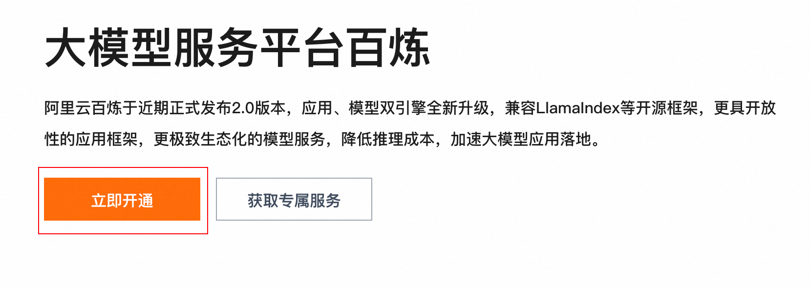
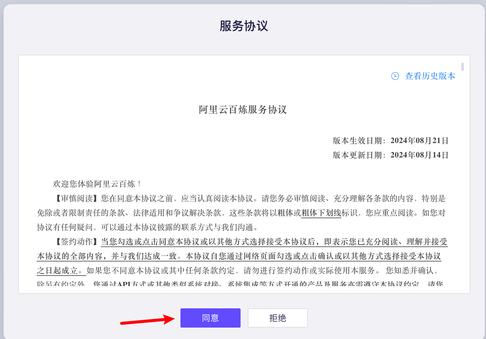
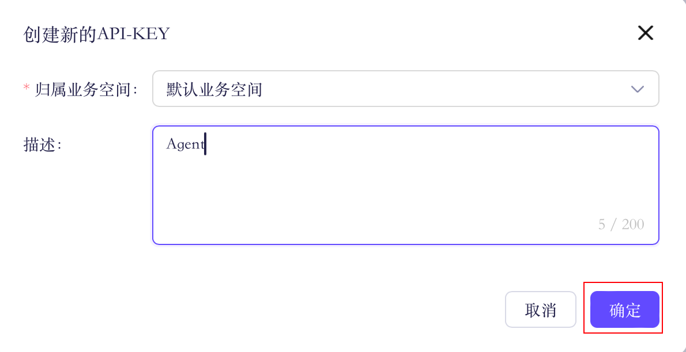
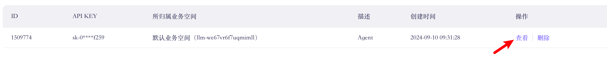
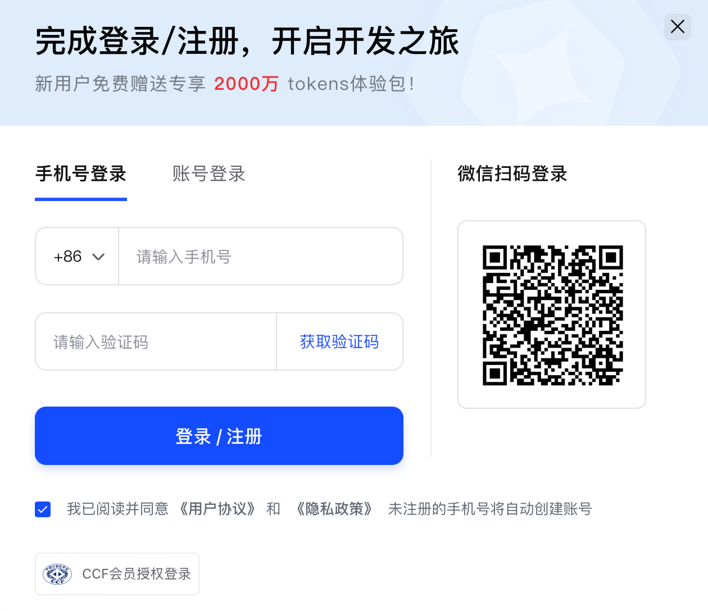
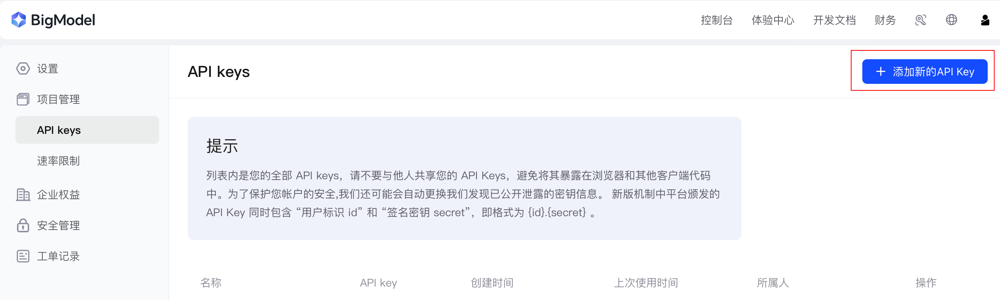
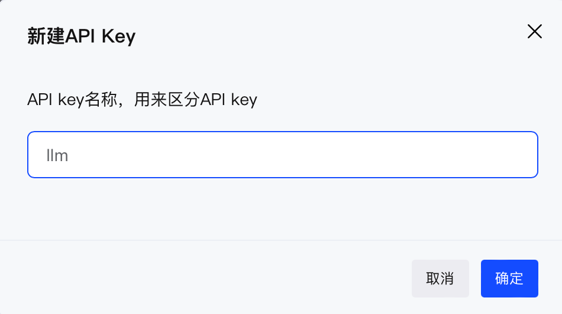

# 大模型 API 获取步骤

> 随着时间的推移，操作步骤可能会因为界面更新存在差异，但具体流程不会有大的变化。

## 目录

- [阿里 API](#阿里-api)
- [智谱 API](#智谱-api)
- [DeepSeek API](#deepseek-api)

## 阿里 API

通过阿里云百炼平台获取大模型的 API，实际上，支持 openai 库的 API 都可以作为学习的开始。

如果在进行之前想了解 AI 能做什么，你可以访问[通义千问](https://tongyi.aliyun.com/qianwen/)，在“玩”够了之后，点击右上角的 API 服务。

点击 `立即开通`：

> 入口界面常发生变动，可以直接访问[阿里云百炼控制台](https://bailian.console.aliyun.com)，登录后跳转到 `模型广场` 部分进行阅读。
>
> 第一次注册使用阿里的模型服务可能需要进行一次身份验证（人脸识别，[阿里云实名入口](https://myaccount.console.aliyun.com/certificate?spm=a2c4g.11186623.0.0.27695bbfNxX04T)，进入后点击 `个人支付宝认证` / `个人扫脸认证`）。

然后过一些简单的服务协议，点击 `同意`：

点开左侧的 `模型广场`，点击 `开通模型服务`：

打勾，并点击 `确认开通`：

在[控制台](https://bailian.console.aliyun.com/)点击右上角的 `用户图标` - `API-KEY`：

点击`创建`

选择 `默认业务空间`，点击 `确定` 创建 `API-KEY`：

点击 `查看` 并复制 `API KEY`：

可以看到业务空间的开头是 llm，全称：Large Language Model，大型语言模型。

## 智谱 API

> 新用户总是会有着赠送的额度，所以当阿里 API 的额度过期或者用完之后，可以选择“折腾”一下更换平台（不过日常学习使用的话，其实开销并不大，这里“折腾”只是为了引出后续通用的代码修改）。
>
> 下方智谱 AI 的注册链接附带邀请码，因邀请所产生**所有** tokens 将被用于学习共享（[Discussions](https://github.com/Hoper-J/AI-Guide-and-Demos-zh_CN/discussions/6)）。
>
> **感谢注册，因为你才有了该分享的诞生**。

访问 [https://bigmodel.cn/login](https://www.bigmodel.cn/invite?icode=5IbjQViWfqMfQXa92CrdbkjPr3uHog9F4g5tjuOUqno%3D) 进行注册并登录：

对于新用户：

访问 `项目管理` 中的 [API keys](https://www.bigmodel.cn/usercenter/proj-mgmt/apikeys)，点击右上角 `添加新的 API Key`。

命名，然后点击 `确定`：

点击以复制属于你的 `API key`：

> [!note]
>
> 后续用到 API 的代码大多以阿里 API 为例，如果想修改为智谱 API，可以参考文章《[01. 初识 LLM API：环境配置与多轮对话演示](./01.%20初识%20LLM%20API：环境配置与多轮对话演示.md#智谱-api)》中的修改：
>
> 1. api_key。
> 2. base_url：智谱当前的 `base_url` 为 `https://open.bigmodel.cn/api/paas/v4`。
> 3. model：以 `glm-4-plus` 为例。

## DeepSeek API

> 阅读《[DeepSeek API 的获取与对话示例](./DeepSeek%20API%20的获取与对话示例.md)》。

> [!note]
>
> **后续代码修改**
>
> 参考文章《[01. 初识 LLM API：环境配置与多轮对话演示](./01.%20初识%20LLM%20API：环境配置与多轮对话演示.md#deepseek-api)》。
>
> 1. api_key。
>
> 2. base_url：`https://api.deepseek.com`。
>
> 3. model：`deepseek-chat` 或 `deepseek-reasoner`。
>
>    DeepSeek 并没有提供“繁杂”的版本给用户选择，比如 v2 / v3，默认将使用最新的模型。

---

万事开头难，恭喜你！完成了最难的一步，接下来进入下一节：[01. 初识 LLM API：环境配置与多轮对话演示](.01.%20初识%20LLM%20API：环境配置与多轮对话演示.md)，步入代码部分。
