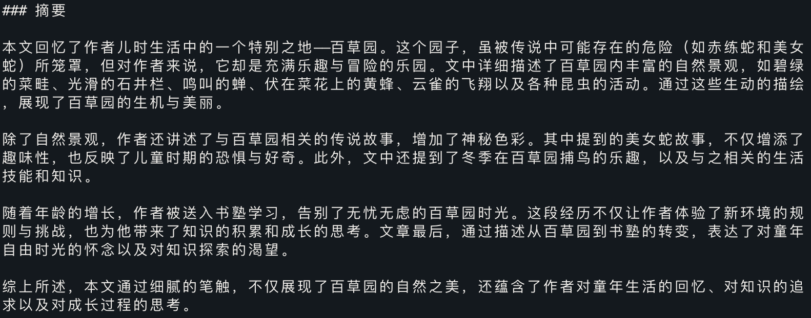
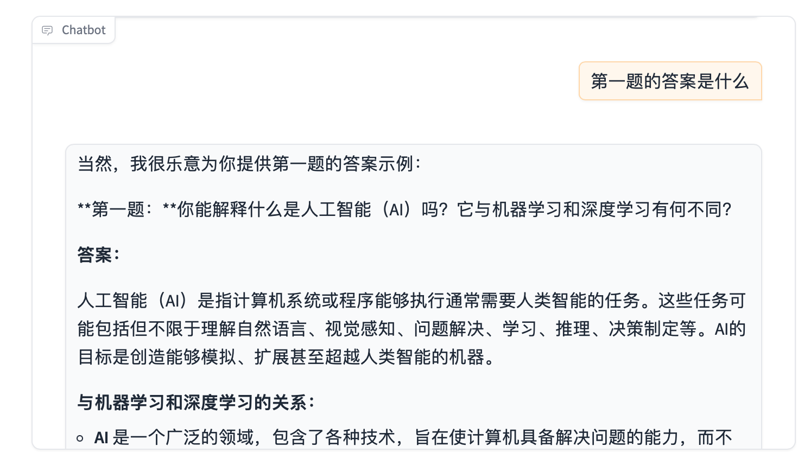
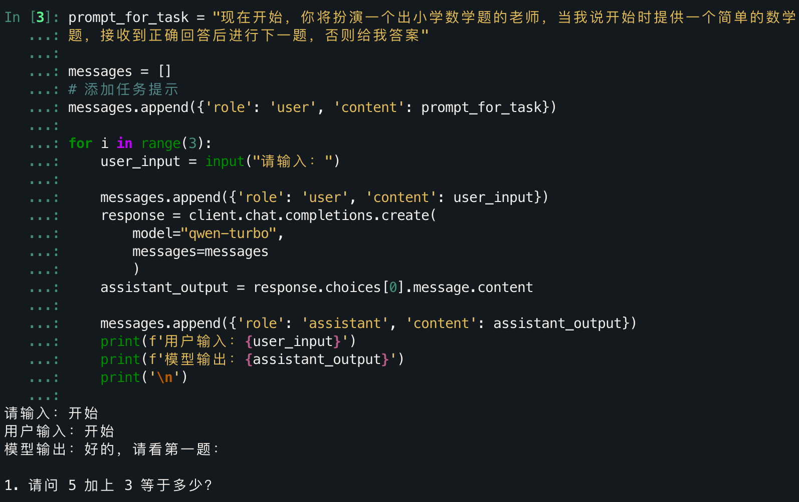
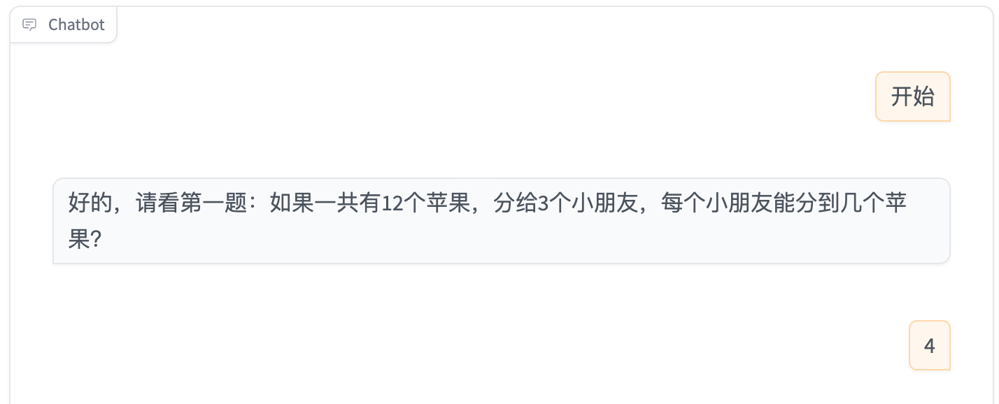

# 简单入门：通过 API 与 Gradio 构建 AI 应用

> 通过之前的两篇文章，你应该拥有了一个自己的 API，并对如何使用有了初步的理解。
> 接下来，你将通过调用 API 并输入提示词（Prompt），学习如何构建自己的语言模型应用。
>
> 如果想进一步深入这个领域，非常建议观看李宏毅老师 2024 年的教学视频同步学习。
>
> - [生成式人工智能导论-视频](https://www.bilibili.com/video/BV1BJ4m1e7g8)
> - [课程主页](https://speech.ee.ntu.edu.tw/~hylee/genai/2024-spring.php)
>
> 得益于阿里对 openai 的适配，当前展示的代码可以完全对标于李宏毅老师的视频课程作业，目前对应于**作业3**，方便大家在更普遍的环境下学到这个作业所想表达的内容。
>
> [代码文件下载](../Demos/02.%20使用%20API%20快速搭建你的第一个%20AI%20应用.ipynb)
>
> 在线链接：[Colab](https://colab.research.google.com/drive/1nz89ATcl5l900bso6-xErEo1laT-rmPE?usp=share_link)

## 目录

- [安装，导入与设置](#安装导入与设置)
- [第一部分：文章摘要（单轮对话应用）](#第一部分文章摘要单轮对话应用)
  - [从 API 调用到可视化：引入 Gradio](#从-api-调用到可视化引入-gradio)
- [第二部分：角色扮演（多轮对话应用）](#第二部分角色扮演多轮对话应用)
  - [1. 预设 prompt，定义模型的角色](#1-预设-prompt定义模型的角色)
  - [2. 记录对话，开始交流](#2-记录对话开始交流)
  - [Gradio 可视化](#gradio-可视化)
- [第三部分：定制化任务（多轮对话应用）](#第三部分定制化任务多轮对话应用)
  - [Gradio 可视化](#gradio-可视化-2)
- [参考链接](#参考链接)

---

## 安装，导入与设置

我们需要安装和导入一些必要的库，并进行配置。

```bash
pip install openai
pip install gradio
pip install 'numpy<2.0'
```

```python
import os
import json
from typing import List, Dict, Tuple

import openai
import gradio as gr

# TODO: 设置你的 OPENAI API 密钥，这里假设 DashScope API 被配置在了 OPENAI_API_KEY 环境变量中
OPENAI_API_KEY = ""
# 不填写则默认使用环境变量
if not OPENAI_API_KEY:
    OPENAI_API_KEY = os.getenv('OPENAI_API_KEY')

# 初始化 OpenAI 客户端，使用阿里云 DashScope API
client = openai.OpenAI(
    api_key=OPENAI_API_KEY,
    base_url="https://dashscope.aliyuncs.com/compatible-mode/v1",  # 阿里云的 API 地址
)

# 检查 API 设置是否正确
try:
    response = client.chat.completions.create(
        model="qwen-turbo",  # 使用通义千问-Turbo 大模型，可以替换为 Deepseek 系列：deepseek-v3 / deepseek-r1
        messages=[{'role': 'user', 'content': "测试"}],
        max_tokens=1,
    )
    print("API 设置成功！！")
except Exception as e:
    print(f"API 可能有问题，请检查：{e}")
```

## 第一部分：文章摘要（单轮对话应用）

这个的实现方式非常简单，假想一下，我们有一篇文章需要别人帮忙写个摘要：“请你帮我写一下文章的摘要【文章.txt】。”接下来，只要对方答应就可以等待结果。如果这个“对方”本身是一个有求必应的大模型，一切会更加简单——只需要将“请你帮我写一下文章的摘要”（prompt）和【文章】（article）拼接后传给它。

```python
prompt = "请你帮我写一下文章的摘要"
article = "填写你的文章内容"
input_text = f"{prompt}\n{article}"  # 拼接成一个 prompt

response = client.chat.completions.create(
    model="qwen-turbo",  # 使用通义千问-Turbo 大模型，可以替换为 Deepseek 系列：deepseek-v3/ deepseek-r1
    messages=[{'role': 'user', 'content': input_text}],  # 把拼接后的 prompt 传递给大模型
)

print(response.choices[0].message.content)
```

我们这里以《从百草园到三味书屋》为例。



### 从 API 调用到可视化：引入 Gradio

使用 Gradio 可以将复杂的 API 调用封装在一个简单的交互界面中，用户可以通过文本框、按钮、滑块等 UI 元素与大模型进行交互。

下面是摘要器的完整示例：

```python
# TODO: 修改提示词以满足你的摘要需求
PROMPT_FOR_SUMMARIZATION = "请将以下文章概括成几句话。"

def reset():
    """
    清空对话记录

    返回:
        List: 空的对话记录列表
    """
    return []

def interact_summarization(prompt, article, temp=1.0):
    """
    调用模型生成摘要。

    参数:
        prompt (str): 用于摘要的提示词
        article (str): 需要摘要的文章内容
        temp (float): 模型温度，控制输出创造性（默认 1.0）

    返回:
        List[Tuple[str, str]]: 对话记录，包含输入文本与模型输出
    """
    # 合成请求文本
    input_text = f"{prompt}\n{article}"
    
    response = client.chat.completions.create(
        model="qwen-turbo",  # 使用通义千问-Turbo大模型
        messages=[{'role': 'user', 'content': input_text}],
        temperature=temp,
    )
    return [(input_text, response.choices[0].message.content)]

def export_summarization(chatbot, article):
    """
    导出摘要任务的对话记录和文章内容到 JSON 文件。

    参数:
        chatbot (List[Tuple[str, str]]): 模型对话记录
        article (str): 文章内容
    """
    target = {"chatbot": chatbot, "article": article}
    with open("files/part1.json", "w", encoding="utf-8") as file:
        json.dump(target, file, ensure_ascii=False, indent=4)

# 构建 Gradio UI 界面
with gr.Blocks() as demo:
    gr.Markdown("# 第1部分：摘要\n填写任何你喜欢的文章，让聊天机器人为你总结！")
    chatbot = gr.Chatbot()
    prompt_textbox = gr.Textbox(label="提示词", value=PROMPT_FOR_SUMMARIZATION, visible=False)
    article_textbox = gr.Textbox(label="文章", interactive=True, value="填充")
    
    with gr.Column():
        gr.Markdown("# 温度调节\n温度用于控制聊天机器人的输出，温度越高，响应越具创造性。")
        temperature_slider = gr.Slider(0.0, 2.0, 1.0, step=0.1, label="温度")
    
    with gr.Row():
        send_button = gr.Button(value="发送")
        reset_button = gr.Button(value="重置")
    
    with gr.Column():
        gr.Markdown("# 保存结果\n当你对结果满意后，点击导出按钮保存结果。")
        export_button = gr.Button(value="导出")
    
    # 绑定按钮与回调函数
    send_button.click(interact_summarization,
                      inputs=[prompt_textbox, article_textbox, temperature_slider],
                      outputs=[chatbot])
    reset_button.click(reset, outputs=[chatbot])
    export_button.click(export_summarization, inputs=[chatbot, article_textbox])

# 启动 Gradio 应用
demo.launch(debug=True)
```

**最终效果：**


## 第二部分：角色扮演（多轮对话应用）

多轮对话应用的区别就是拥有上下文，也就是历史记录。要实现它其实就是简单的使用一个列表保存每一次的 prompt 和模型返回的输出，对于用户和 AI 返回的输出，分别使用`user`和`assistant`进行标识。

实际上，整个流程拆解后只有2步。

### 1. 预设 prompt，定义模型的角色

编写好一个 prompt 用于指导模型，可以是面试官，可以是某个领域的专家，好吧，也可以是猫娘（还记得 ChatGPT 刚发布的时候，有非常多的仓库专门写了角色 prompt）。

```python
PROMPT_FOR_ROLEPLAY = "我需要你面试我有关AI的知识，仅提出问题"
```

在编写好之后，使用类似于第一部分的操作，然后先进行一次提交。

```python
response = client.chat.completions.create(
    model="qwen-turbo",
    messages=[{'role': 'user', 'content': PROMPT_FOR_ROLEPLAY}],
)

print(response.choices[0].message.content)
```


### 2. 记录对话，开始交流

这是一个持续的重复操作，这里我们使用上一节的简单代码来演示：

```python
assistant_reply = response.choices[0].message.content

# 将第一次的预设和回复进行保存
messages = []
messages.append({'role': 'user', 'content': PROMPT_FOR_ROLEPLAY})
messages.append({'role': 'assistant', 'content': assistant_reply})

# 开始多轮对话
for _ in range(3):
    user_input = input("请输入：")
    messages.append({'role': 'user', 'content': user_input})
    
    response = client.chat.completions.create(
        model="qwen-turbo",
        messages=messages
    )
    
    assistant_reply = response.choices[0].message.content
    messages.append({'role': 'assistant', 'content': assistant_reply})
    
    print(f'用户输入：{user_input}')
    print(f'模型回复：{assistant_reply}\n')
```


### Gradio 可视化

```python
# TODO: 修改以下变量以定义角色和角色提示词
CHARACTER_FOR_CHATBOT = "面试官"  # 机器人扮演的角色，注意，真正起作用的实际是提示词，因为并没有预设 system 角色
PROMPT_FOR_ROLEPLAY = "我需要你面试我有关AI的知识，仅提出问题"  # 指定角色提示词

# 清除对话的函数
def reset():
    """
    清空对话记录。

    返回:
        List: 空的对话记录列表
    """
    return []

# 调用模型生成对话的函数
def interact_roleplay(chatbot, user_input, temp=1.0):
    """
    处理角色扮演多轮对话，调用模型生成回复。

    参数:
        chatbot (List[Tuple[str, str]]): 对话历史记录（用户与模型回复）
        user_input (str): 当前用户输入
        temp (float): 模型温度参数（默认 1.0）

    返回:
        List[Tuple[str, str]]: 更新后的对话记录
    """
    try:
        # 构建包含历史对话的消息列表
        messages = []
        for input_text, response_text in chatbot:
            messages.append({'role': 'user', 'content': input_text})
            messages.append({'role': 'assistant', 'content': response_text})
        
        # 添加当前用户输入
        messages.append({'role': 'user', 'content': user_input})
        
        # 调用 API 获取回复
        response = client.chat.completions.create(
            model="qwen-turbo",
            messages=messages,
            temperature=temp,
        )
        chatbot.append((user_input, response.choices[0].message.content))

    except Exception as e:
        print(f"发生错误：{e}")
        chatbot.append((user_input, f"抱歉，发生了错误：{e}"))
        
    return chatbot

def export_roleplay(chatbot, description):
    """
    导出角色扮演对话记录及任务描述到 JSON 文件。

    参数:
        chatbot (List[Tuple[str, str]]): 对话记录
        description (str): 任务描述
    """
    target = {"chatbot": chatbot, "description": description}
    with open("files/part2.json", "w", encoding="utf-8") as file:
        json.dump(target, file, ensure_ascii=False, indent=4)

# 进行第一次对话：设定角色提示
first_dialogue = interact_roleplay([], PROMPT_FOR_ROLEPLAY)

# 构建 Gradio UI 界面
with gr.Blocks() as demo:
    gr.Markdown("# 第2部分：角色扮演\n与聊天机器人进行角色扮演互动！")
    chatbot = gr.Chatbot(value=first_dialogue)
    description_textbox = gr.Textbox(label="机器人扮演的角色", interactive=False, value=CHARACTER_FOR_CHATBOT)
    input_textbox = gr.Textbox(label="输入", value="")
    
    with gr.Column():
        gr.Markdown("# 温度调节\n温度控制聊天机器人的响应创造性。")
        temperature_slider = gr.Slider(0.0, 2.0, 1.0, step=0.1, label="温度")
    
    with gr.Row():
        send_button = gr.Button(value="发送")
        reset_button = gr.Button(value="重置")
    
    with gr.Column():
        gr.Markdown("# 保存结果\n点击导出按钮保存对话记录。")
        export_button = gr.Button(value="导出")
        
    # 绑定按钮与回调函数
    send_button.click(interact_roleplay, inputs=[chatbot, input_textbox, temperature_slider], outputs=[chatbot])
    reset_button.click(reset, outputs=[chatbot])
    export_button.click(export_roleplay, inputs=[chatbot, description_textbox])
    
# 启动 Gradio 应用
demo.launch(debug=True)
```

1. **预设 prompt，定义模型的角色**
   
2. **记录对话，开始交流**
   
   

## 第三部分：定制化任务（多轮对话应用）

经过前两个任务的学习，相信你已经有了很多自己的想法。不同的 prompt 会带来截然不同的效果，而这些 prompt，实际上都是在让模型去做一个隐性的角色扮演，无论是作为某个领域的专家还是一个文字游戏。如果需求比较复杂，那么在方向上的引导对于大模型来说是非常必要的。

这一部分将角色扮演需求包含在第一次的输入中，整合了角色扮演阶段的代码：

```python
# 定制任务提示词：小学数学老师出题
PROMPT_FOR_TASK = "现在开始，你将扮演一个出小学数学题的老师，当我说开始时提供一个简单的数学题，接收到正确回答后进行下一题，否则给我答案"

# 初始化对话记录并添加任务提示
messages = []
messages.append({'role': 'user', 'content': PROMPT_FOR_TASK})

# 进行多轮对话
for _ in range(3):
    user_input = input("请输入：")
    messages.append({'role': 'user', 'content': user_input})
    
    response = client.chat.completions.create(
        model="qwen-turbo",
        messages=messages,
    )
    assistant_reply = response.choices[0].message.content
    messages.append({'role': 'assistant', 'content': assistant_reply})
    
    print(f"用户输入：{user_input}")
    print(f"模型回复：{assistant_reply}\n")
```



### Gradio 可视化

```python
# TODO: 修改以下变量以定义任务描述与任务提示词
CHATBOT_TASK = "小学数学老师（输入“开始”）"  # 用于告诉用户聊天机器人可以执行的任务
PROMPT_FOR_TASK = "现在开始，你将扮演一个出小学数学题的老师，当我说开始时提供一个简单的数学题，接收到正确回答后进行下一题，否则给我答案"

def reset():
    """
    清空对话记录。

    返回:
        List: 空的对话记录列表
    """
    return []

def interact_customize(chatbot, prompt, user_input, temp=1.0):
    """
    调用模型处理定制化任务对话。

    参数:
        chatbot (List[Tuple[str, str]]): 历史对话记录
        prompt (str): 指定任务的提示词
        user_input (str): 当前用户输入
        temp (float): 模型温度参数（默认 1.0）

    返回:
        List[Tuple[str, str]]: 更新后的对话记录
    """
    try:
        messages = []
        # 添加任务提示
        messages.append({'role': 'user', 'content': prompt})
        
        # 构建历史对话记录
        for input_text, response_text in chatbot:
            messages.append({'role': 'user', 'content': input_text})
            messages.append({'role': 'assistant', 'content': response_text})

        # 添加当前用户输入
        messages.append({'role': 'user', 'content': user_input})

        response = client.chat.completions.create(
            model="qwen-turbo",
            messages=messages,
            temperature=temp,
            max_tokens=200,  # 修改这个看看
        )

        chatbot.append((user_input, response.choices[0].message.content))

    except Exception as e:
        print(f"发生错误：{e}")
        chatbot.append((user_input, f"抱歉，发生了错误：{e}"))
    
    return chatbot

def export_customized(chatbot, description):
    """
    导出定制化任务对话记录及任务描述到 JSON 文件。

    参数:
        chatbot (List[Tuple[str, str]]): 对话记录
        description (str): 任务描述
    """
    target = {"chatbot": chatbot, "description": description}
    with open("files/part3.json", "w", encoding="utf-8") as file:
        json.dump(target, file, ensure_ascii=False, indent=4)

# 构建 Gradio UI 界面
with gr.Blocks() as demo:
    gr.Markdown("# 第3部分：定制化任务\n聊天机器人可以执行某项任务，试着与它互动吧！")
    chatbot = gr.Chatbot()
    desc_textbox = gr.Textbox(label="任务描述", value=CHATBOT_TASK, interactive=False)
    prompt_textbox = gr.Textbox(label="提示词", value=PROMPT_FOR_TASK, visible=False)
    input_textbox = gr.Textbox(label="输入", value="")
    
    with gr.Column():
        gr.Markdown("# 温度调节\n温度用于控制聊天机器人的输出，温度越高响应越具创造性。")
        temperature_slider = gr.Slider(0.0, 2.0, 1.0, step=0.1, label="温度")
    
    with gr.Row():
        send_button = gr.Button(value="发送")
        reset_button = gr.Button(value="重置")
    
    with gr.Column():
        gr.Markdown("# 保存结果\n当你对结果满意后，点击导出按钮保存结果。")
        export_button = gr.Button(value="导出")
    
    # 绑定按钮与回调函数
    send_button.click(interact_customize, inputs=[chatbot, prompt_textbox, input_textbox, temperature_slider], outputs=[chatbot])
    reset_button.click(reset, outputs=[chatbot])
    export_button.click(export_customized, inputs=[chatbot, desc_textbox])
    
# 启动 Gradio 应用
demo.launch(debug=True)
```

**最终效果：**




**注意，大模型并不等于正确，特别是数学推理逻辑一般的模型。无论是什么大模型，都一定要对它的输出保持怀疑，除非他能从数学逻辑上说服你，并且在你严谨的逻辑推理中自洽。**

## 参考链接

[其中作业 3 相关的 PDF 文件和 Colab](https://speech.ee.ntu.edu.tw/~hylee/genai/2024-spring.php)
