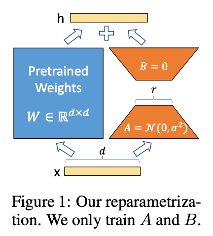

# 认识 LoRA：从线性层到注意力机制


> 如果你曾使用过 AI 生图，那么一定对 LoRA 有印象，下图来自 [Civitai LoRA](https://civitai.com/tag/lora)，上面有很多可供下载的 LoRA 模型。
>
> 
>
> 你可能也曾疑惑于**为什么只导入 LoRA 模型不能生图**？读下去，你会解决它。

## 目录

- [为什么需要 LoRA？](#为什么需要-lora)
- [LoRA 的核心思想](#lora-的核心思想)
  - [低秩分解](#低秩分解)
  - [应用到神经网络中的线性层](#应用到神经网络中的线性层)
    - [参数量对比](#参数量对比)
    - [举例说明](#举例说明)
    - [直观示意图](#直观示意图)
  - [代码实现：线性层的 LoRA](#代码实现线性层的-lora)
- [LoRA 在注意力机制中的应用](#lora-在注意力机制中的应用)
  - [代码实现：带 LoRA 的注意力](#代码实现带-lora-的注意力)
- [回到最初的问题：为什么只导入 LoRA 模型不能生图？](#回到最初的问题为什么只导入-lora-模型不能生图)
- [总结](#总结)

---

这篇文章将从基础的线性层开始，带你一步步了解 LoRA 的核心思想，并深入探索它在注意力机制中的应用。

LoRA，全称 **Low-Rank Adaptation**，是一种用于微调大型预训练模型的技术。它的核心思想是通过**低秩分解**减少微调时的参数量，而不牺牲模型的性能。

论文原文：[LoRA: Low-Rank Adaptation of Large Language Models](https://arxiv.org/abs/2106.09685)

## 为什么需要 LoRA？

大型预训练模型的出现，为我们带来了强大的自然语言处理和计算机视觉能力，这是一个推动时代的成功。**但大模型的“大”，不仅体现在其参数量上，更体现在我们无法轻松进行微调 :)**，全量微调一个预训练大模型的代价非常高，而且一般的设备根本训练不动。而 **LoRA** 提供了一种高效的微调方法，使得在小型设备上微调大模型成为可能。

> 根据论文中的描述：
>
> - *「Compared to GPT-3 175B fine-tuned with Adam, LoRA can reduce the number of trainable parameters by 10,000 times and the GPU memory requirement by 3 times. 」*
>
> **相比于对 GPT-3 175B 模型使用全量参数的微调，LoRA 减少了训练参数量的 10,000 倍，GPU 显存需求的 3 倍。**
>
> - *「LoRA performs on-par or better than fine-tuning in model quality on RoBERTa, DeBERTa, GPT-2, and GPT-3, despite having fewer trainable parameters, a higher training throughput, and, unlike adapters, no additional inference latency. 」*
>
> **LoRA 的可训练参数更少，但在 RoBERTa、DeBERTa、GPT-2 和 GPT-3 上的模型质量与全量微调相当甚至更好，而且不会增加推理延迟。**

## LoRA 的核心思想

> *「We take inspiration from Li et al. (2018a)[^1]; Aghajanyan et al. (2020)[^2] which show that the learned over-parametrized models in fact reside on a low intrinsic dimension. 」*

LoRA 的核心在于**利用低秩分解来近似模型权重的更新**，这一思想源自之前的研究[^1][^2]。这些研究表明：**过参数化（over-parametrized）模型的学习特征位于一个低维的内在子空间中**。

[^1]: [Measuring the Intrinsic Dimension of Objective Landscapes](http://arxiv.org/abs/1804.08838).
[^2]: [Intrinsic Dimensionality Explains the Effectiveness of Language Model Fine-Tuning](https://arxiv.org/abs/2012.13255).

### 低秩分解

> *「We hypothesize that the change in weights during model adaptation also has a low “intrinsic rank”, leading to our proposed **L**ow-**R**ank **A**daptation (LoRA) approach. 」*

在 LoRA 中，作者提出了一个重要的假设：**在模型适配（adaptation）或者说微调的过程中，权重的变化（即 ∆W）同样是“低秩”的**。基于这个假设，权重矩阵 $W$ 的更新 $\Delta W$ 可以近似表示为两个小矩阵 $B$ 和 $A$ 的乘积：

$$
\Delta W = BA
$$

其中：

- $A \in \mathbb{R}^{r \times d}$, $r$ 是低秩值, $d$ 是输入特征维度。
- $B \in \mathbb{R}^{k \times r}$, $k$ 是输出特征维度。

通过训练这两个小矩阵，我们可以**近似**地更新原始权重矩阵 $W$，而无需训练整个大的 $W$。

> [!note]
>
> 阅读原论文的同学可能会注意到，论文中关于 $A$ 和 $B$ 维度的公式描述和图 1 的表示是不同的。**为了消除歧义，本文以图 1 的描述为准**。不过实际上，这种描述上的不同仅涉及符号差异，二者在数学上完全等价。
>
> 这个 [issue 下的回答](https://github.com/huggingface/peft/issues/983#issuecomment-1741835472)同样说明了这一点。

### 应用到神经网络中的线性层

在线性层中，前向传播的计算为：

$$
y = Wx + b
$$

其中：

- $x \in \mathbb{R}^{d}$ 是输入向量。
- $W \in \mathbb{R}^{k \times d}$ 是权重矩阵。
- $b \in \mathbb{R}^{k}$ 是偏置向量。
- $y \in \mathbb{R}^{k}$ 是输出向量。

在微调过程中，通常需要更新 $W$ 和 $b$。但在 LoRA 中，我们可以冻结原始的 $W$，仅仅在其基础上添加一个可训练的增量 $\Delta W$：


$$
y = (W + \Delta W)x + b
$$

其中：

$$
\Delta W = BA
$$

通过训练 $A$ 和 $B$，我们大大减少了需要更新的参数数量。

> [!note]
>
> 前文提到的“**不增加推理延迟**”，只有在**推理前**将训练好的增量权重 $\Delta W$ **合并**回原始权重 $W$ 后才能实现。

#### 参数量对比

假设：

- 输入特征维度为 $d$
- 输出特征维度为 $k$
- 低秩值为 $r$（通常 $r \ll \min(d, k)$）

**全量微调：**

- 需要训练的参数数量为 **$k \times d + k$**，其中：
  - $k \times d$ 是权重矩阵 $W$ 的参数数量。
  - $k$ 是偏置向量 $b$ 的参数数量。

**使用 LoRA 微调：**

- 需要训练的参数数量为 $r \times d + k \times r + k$，其中：
  - $r \times d$ 是矩阵 $A$ 的参数数量。
  - $k \times r$ 是矩阵 $B$ 的参数数量。
  - $k$ 是偏置向量 $b$ 的参数数量。

**参数量减少的比例：**

- 计算减少比例：

  $\frac{r d + k r + k}{k d + k}$

  为了简化，我们可以将偏置参数忽略（因为它们相对于权重参数来说数量很小），得到：

  $\approx \frac{r(d + k)}{k d}$

  如果假设 $k \approx d$，则有：

  $\approx \frac{r(2d)}{d^2} = \frac{2r}{d}$

  所以，当 $k \approx d$ 时，参数减少比例近似为 **$\frac{2r}{d}$**。

- 由于 $r \ll d$，所以参数量大幅减少。

**举例说明：**

假设：

- 输入特征维度 $d = 1024$
- 输出特征维度 $k = 1024$
- 低秩值 $r = 4$

**全量微调参数量：**

- 权重参数: $1024 \times 1024 = 1,048,576$
- 偏置参数: $1024$
- **总参数量: $1,048,576 + 1024 = 1,049,600$**

**使用 LoRA 微调参数量：**

- 矩阵 $A$ 参数: $4 \times 1024 = 4,096$
- 矩阵 $B$ 参数: $1024 \times 4 = 4,096$
- 偏置参数: $1024$
- **总参数量: $4,096 + 4,096 + 1024 = 9,216$**

**参数量对比：**

- 全量微调: $1,049,600$ 参数
- LoRA 微调: $9,216$ 参数
- **参数减少比例: $\frac{9,216}{1,049,600} \approx 0.0088$**

也就是说，使用 LoRA 后，参数量减少了约 **$114$ 倍**，即参数量仅为原来的 **$0.88\%$**。

#### 直观示意图

论文中的这张图直观地展示了这一点：



### 代码实现：线性层的 LoRA

下面我们来实现一个带有 LoRA 的线性层[^3]。

```python
import torch
import torch.nn as nn

class LoRALinear(nn.Module):
    def __init__(self, in_features, out_features, r):
        super(LoRALinear, self).__init__()
        self.in_features = in_features  # 对应 d
        self.out_features = out_features  # 对应 k
        self.r = r  # 低秩值

        # 原始权重矩阵，冻结
        self.weight = nn.Parameter(torch.randn(out_features, in_features))
        self.weight.requires_grad = False  # 冻结

        # LoRA 部分的参数，初始化 A 从均值为 0 的正态分布中采样，B 为全零
        self.A = nn.Parameter(torch.empty(r, in_features))  # 形状为 (r, d)
        self.B = nn.Parameter(torch.zeros.(out_features, r))  # 形状为 (k, r)
        nn.init.normal_(self.A, mean=0.0, std=0.02)  # 初始化 A

        # 偏置项，可选
        self.bias = nn.Parameter(torch.zeros(out_features))

    def forward(self, x):
        # 原始部分
        original_output = torch.nn.functional.linear(x, self.weight, self.bias)
        # LoRA 增量部分
        delta_W = torch.matmul(self.B, self.A)  # 形状为 (k, d)
        lora_output = torch.nn.functional.linear(x, delta_W)
        # 总输出
        return original_output + lora_output
```

在这个实现中，`self.weight` 是原始的权重矩阵，被冻结不参与训练。`self.A` 和 `self.B` 是可训练的低秩矩阵。

[^3]: [LoRA 源码的初始化部分](https://github.com/microsoft/LoRA/blob/3f5c193f431c8a09448f0184f6f883ad393f22d0/loralib/layers.py#L123).

## LoRA 在注意力机制中的应用

Transformer 模型的核心是注意力机制，其中涉及到 Query, Key, Value 的计算，这些都是线性变换。

在标准的注意力机制中，计算公式为：

$$
\text{Attention}(Q, K, V) = \text{softmax}\left(\frac{QK^T}{\sqrt{d_k}}\right)V
$$

其中 $Q$, $K$, $V$ 的计算为：

$$
Q = X_Q W_Q, \quad K = X_K W_K, \quad V = X_V W_V
$$

 $X_Q$, $X_K$, $X_V$ 的输入可以相同，也可以不同。例如，在 Cross-Attention 中，解码器的隐藏状态作为 $X_Q$，编码器的输出作为 $X_K$ 和 $X_V$。

LoRA 可以应用到 $W_Q$, $W_K$, $W_V$ 上，采用与线性层类似的方式。

### 代码实现：带 LoRA 的注意力

下面我们实现一个带有 LoRA 的**单头注意力**层。

```python
import torch
import torch.nn as nn

class LoRAAttention(nn.Module):
    def __init__(self, embed_dim, r):
        super(LoRAAttention, self).__init__()
        self.embed_dim = embed_dim  # 对应 d_model
        self.r = r  # 低秩值

        # 原始的 QKV 权重，冻结
        self.W_Q = nn.Linear(embed_dim, embed_dim)
        self.W_K = nn.Linear(embed_dim, embed_dim)
        self.W_V = nn.Linear(embed_dim, embed_dim)
        self.W_O = nn.Linear(embed_dim, embed_dim)

        for param in self.W_Q.parameters():
            param.requires_grad = False
        for param in self.W_K.parameters():
            param.requires_grad = False
        for param in self.W_V.parameters():
            param.requires_grad = False

        # LoRA 的 Q 部分
        self.A_Q = nn.Parameter(torch.empty(r, embed_dim))
        self.B_Q = nn.Parameter(torch.zeros(embed_dim, r))
        nn.init.normal_(self.A_Q, mean=0.0, std=0.02)

        # LoRA 的 K 部分
        self.A_K = nn.Parameter(torch.empty(r, embed_dim))
        self.B_K = nn.Parameter(torch.zeros(embed_dim, r))
        nn.init.normal_(self.A_K, mean=0.0, std=0.02)

        # LoRA 的 V 部分
        self.A_V = nn.Parameter(torch.empty(r, embed_dim))
        self.B_V = nn.Parameter(torch.zeros(embed_dim, r))
        nn.init.normal_(self.A_V, mean=0.0, std=0.02)

    def forward(self, query, key, value):
        """
        query, key, value: 形状为 (batch_size, seq_length, embed_dim)
        """
        # 计算原始的 Q、K、V
        Q = self.W_Q(query)  # (batch_size, seq_length, embed_dim)
        K = self.W_K(key)
        V = self.W_V(value)

        # 计算 LoRA 增量部分
        delta_Q = torch.matmul(query, self.A_Q.t())  # (batch_size, seq_length, r)
        delta_Q = torch.matmul(delta_Q, self.B_Q.t())  # (batch_size, seq_length, embed_dim)
        delta_K = torch.matmul(key, self.A_K.t())
        delta_K = torch.matmul(delta_K, self.B_K.t())
        delta_V = torch.matmul(value, self.A_V.t())
        delta_V = torch.matmul(delta_V, self.B_V.t())

        # 更新后的 Q、K、V
        Q = Q + delta_Q
        K = K + delta_K
        V = V + delta_V

        # 计算注意力得分
        scores = torch.matmul(Q, K.transpose(-2, -1)) / (self.embed_dim ** 0.5)
        attn_weights = torch.nn.functional.softmax(scores, dim=-1)
        context = torch.matmul(attn_weights, V)

        # 输出层
        output = self.W_O(context)

        return output
```

**代码解释：**

- **原始权重**：`W_Q`、`W_K`、`W_V` 被冻结，不参与训练。
- **LoRA 参数**：`A_Q`、`B_Q`、`A_K`、`B_K`、`A_V`、`B_V` 是可训练的低秩矩阵。
- **前向传播**：
  - 首先计算原始的 Q、K、V。
  - 然后计算 LoRA 的增量部分，并添加到原始的 Q、K、V 上。
  - 接着按照注意力机制进行计算。

## 回到最初的问题：为什么只导入 LoRA 模型不能生图？

在理解了 LoRA 的核心思想后，相信你已经可以回答。

**原因是：LoRA 模型只是对原始模型的权重更新进行了低秩近似，存储了权重的增量部分 $\Delta W$，而不是完整的模型权重 $W$。**

- **LoRA 模型本身不包含原始模型的权重参数，只包含微调时训练的增量参数 $A$ 和 $B$。**
- **在推理（如生成图像）时，必须将 LoRA 的增量参数与原始预训练模型的权重相加，才能得到完整的模型权重。**
- **因此，仅仅加载 LoRA 模型是无法进行推理的，必须结合原始的预训练模型一起使用。**

打个比方，LoRA 模型就像是给一幅画添加的“修改指令”，但这些指令需要在原始画作的基础上才能生效。如果你只有修改指令（LoRA 模型），却没有原始的画作（预训练模型），那么你就无法得到最终的作品。

**所以，要使用 LoRA 模型生成图像，必须同时加载预训练的基础模型和对应的 LoRA 模型。**

## 总结

LoRA 通过将权重更新分解为两个低秩矩阵 $A$ 和 $B$ 的乘积，极大地减少了微调过程中需要训练的参数量。在性能几乎不受影响的情况下，显著降低了计算资源的需求，使得在资源受限的环境中微调大型预训练模型成为可能。

这真的是一个很理所当然的想法，不由得感叹数学的重要性。

顺便说一句，这并非一个新的 idea，在更早的工作中就已经使用了低秩的思想，但它们都没有考虑冻结原始模型参数，而是直接对其施加低秩约束（见[论文](https://arxiv.org/pdf/2106.09685)第 6 部分相关工作的 **Low-Rank Structures in Deep Learning**）。

**题外话**：LoRA 的灵感其实涉及到了线性代数的知识，对于想深入学习线性代数的同学们，推荐一本很好的自学教材：《线性代数及其应用》，作者是 David C. Lay、Steven R. Lay 和 Judi J. McDonald，英文名为：《Linear Algebra and Its Applications》。

