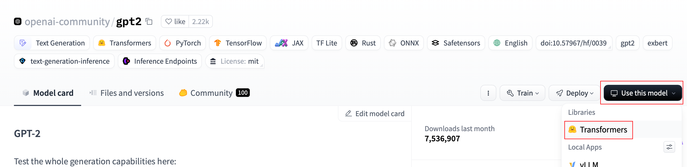
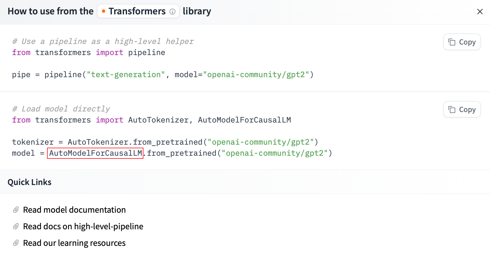
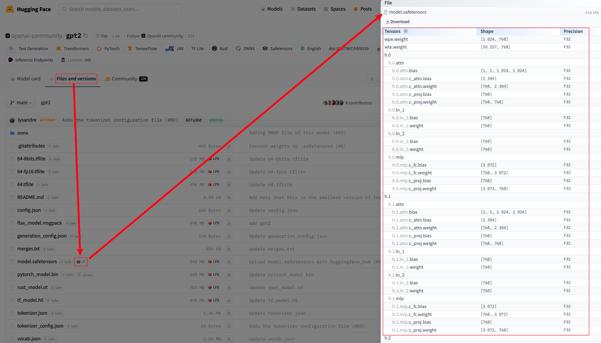
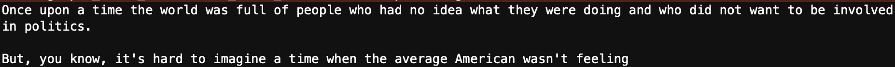

# 理解 Hugging Face 的 `AutoModel` 系列：不同任务的自动模型加载类

> 在正式进入大模型的部署之前，我们需要补充一些必需的知识，减少之后可能遇到的磕绊。
>
> 有过一些基础的同学可能对曾经代码中的 **AutoModel 和 AutoModelForXXX** 产生过疑惑。
> 如果你做过图像分类任务的话，你应该注意到分类模型实际上由 **backbone** 和 **classifier** 组成，前者用于特征提取，后者用于分类。`AutoModel` 和 `AutoModelForXXX` 之间也存在类似的关系，可以理解为 `AutoModel` 对应于 backbone，而 `AutoModelForXXX` 则是 backbone + classifier，也就是完整的模型。
>
> 选择合适的模型类对于正确部署大型语言模型非常重要。`AutoModel` 系列提供了多种自动化工具，使得加载预训练模型变得非常简单。本文将详细介绍 `AutoModel` 及其衍生类（如 `AutoModelForCausalLM`、`AutoModelForMaskedLM`、`AutoModelForSeq2SeqLM` 等）的区别。
>
> 实际上，你只需要理解其中一个类的用途，就足以举一反三。
>
> 本文还将演示如何快速查看模型的参数和配置信息，以及如何使用 `inspect` 库进一步查看对应的源码。
>
> 推荐访问：[AutoModel 类](https://huggingface.co/docs/transformers/main/en/model_doc/auto#transformers.AutoModel) ｜ [Hugging Face 模型库](https://huggingface.co/models)
>
> [代码文件下载](../Demos/04.%20Hugging%20Face%20AutoModel%20示例合集.ipynb)
>
> 在线链接：[Kaggle](https://www.kaggle.com/code/aidemos/04-hugging-face-automodel) | [Colab](https://colab.research.google.com/drive/1gLTXcvG-tEDOqnR7qM-3-S812qnBUGlh?usp=sharing)

## 目录

- [主要的 AutoModel 类及其用途](#主要的-automodel-类及其用途)
   - [详细说明](#详细说明)
- [选择合适的 AutoModel 类](#选择合适的-automodel-类)
   - [查看模型的参数信息](#查看模型的参数信息)
      - [config.json](#configjson)
- [实际代码示例](#实际代码示例)
   - [示例 1：文本生成 (AutoModelForCausalLM)](#示例-1文本生成-automodelforcausallm)
   - [示例 2：填空任务 (AutoModelForMaskedLM)](#示例-2填空任务-automodelformaskedlm)
   - [示例 3：序列到序列任务 (AutoModelForSeq2SeqLM)](#示例-3序列到序列任务-automodelforseq2seqlm)
   - [示例 4：问答系统 (AutoModelForQuestionAnswering)](#示例-4问答系统-automodelforquestionanswering)
   - [示例 5：命名实体识别 (AutoModelForTokenClassification)](#示例-5命名实体识别-automodelfortokenclassification)
   - [示例 6：文本分类 (AutoModelForSequenceClassification)](#示例-6文本分类-automodelforsequenceclassification)
   - [示例 7：特征提取 (AutoModel)](#示例-7特征提取-automodel)
- [查看源码](#查看源码)
   - [查看 __init__ 方法](#查看-__init__-方法)
   - [查看 forward 方法](#查看-forward-方法)
   - [使用 help 快速查看](#使用-help-快速查看)
- [参考资料](#参考资料)

---

## `AutoModel` 系列概述

[Hugging Face](https://huggingface.co) 为开发者提供了丰富的预训练模型，覆盖各种自然语言处理任务，是一个非常棒的开源社区。为了简化模型的加载和使用，Hugging Face 中的 Transformers 库提供了一系列 `AutoModel` 类，这些类能够根据模型名称自动选择适当的模型架构和预训练权重。

`AutoModel` 系列包括多个自动化加载类，每个类对应不同的任务和模型类型。

## 主要的 `AutoModel` 类及其用途

以下是一些常见的 `AutoModel` 类及其主要用途，更多的内容可以参考官方文档 [AutoModel 类](https://huggingface.co/docs/transformers/main/en/model_doc/auto#transformers.AutoModel)的右边栏：

| **类名**                             | **描述**                                                     | **适用任务**                     |
| ------------------------------------ | ------------------------------------------------------------ | -------------------------------- |
| `AutoModel`                          | 加载预训练的基础模型，不包含任何任务特定的头部。             | 特征提取、嵌入生成、自定义任务等 |
| `AutoModelForCausalLM`               | 加载带有因果语言建模头部的模型，适用于生成任务。             | 文本生成、对话系统、自动补全等   |
| `AutoModelForMaskedLM`               | 加载带有掩码语言建模头部的模型，适用于填空任务。             | 填空任务、句子补全、文本理解等   |
| `AutoModelForSeq2SeqLM`              | 加载适用于序列到序列任务的模型，带有编码器-解码器架构。      | 机器翻译、文本摘要、问答系统等   |
| `AutoModelForQuestionAnswering`      | 加载适用于问答任务的模型，带有专门的头部用于预测答案的起始和结束位置。 | 问答系统、信息检索等             |
| `AutoModelForTokenClassification`    | 加载用于标注任务（如命名实体识别）的模型。                   | 命名实体识别、词性标注等         |
| `AutoModelForSequenceClassification` | 加载用于序列分类任务的模型，带有分类头部。                   | 文本分类、情感分析等             |

### 详细说明

1. **`AutoModel`**
   - **描述**：通用的模型加载类，仅加载模型的**主体部分**，不附带任何特定任务的输出头，适用于需要自定义任务头的情况。
   - **适用场景**：
     - **特征提取**：从文本中提取嵌入或特征，用于下游任务。
     - **自定义任务**：为特定任务设计专属的输出层，如自定义的分类器或回归器。
2. **`AutoModelForCausalLM`**
   - **描述**：用于因果语言建模（Causal Language Modeling）任务，包含适用于生成任务的输出头。
   - **适用场景**：
     - **文本生成**：如对话系统、内容创作、自动补全等。
     - **因果语言建模**：根据上下文生成后续文本的任务。
     - **快速部署**：无需额外添加任务头，适合快速搭建对话系统。
3. **`AutoModelForMaskedLM`**
   - **描述**：用于掩码语言建模（Masked Language Modeling）任务，包含适用于填空任务的输出头。
   - **适用场景**：
     - **填空任务**：如句子补全、文本理解等。
     - **预训练模型微调**：进一步训练模型以增强其理解能力。
4. **`AutoModelForSeq2SeqLM`**
   - **描述**：用于序列到序列（Sequence-to-Sequence）任务，包含编码器-解码器架构的输出头。
   - **适用场景**：
     - **机器翻译**：将一种语言翻译成另一种语言。
     - **文本摘要**：生成文本的简短摘要。
5. **`AutoModelForQuestionAnswering`**
   - **描述**：用于问答任务，包含用于预测答案起始和结束位置的输出头。
   - **适用场景**：
     - **抽取式问答**：从文本中提取并生成问题的答案。
6. **`AutoModelForTokenClassification`**
   - **描述**：用于标注任务，如命名实体识别，包含专门的输出头。
   - **适用场景**：
     - **命名实体识别（NER）**：识别文本中的实体，如人名、地名等。
     - **词性标注**：为每个词分配词性标签。
7. **`AutoModelForSequenceClassification`**
   - **描述**：用于序列分类任务，包含分类头部。
   - **适用场景**：
     - **文本分类**：如情感分析、主题分类等。
     - **语音识别后处理**：对转录的文本进行分类。

> **作业**：根据[文末](#查看源码)的代码，尝试打印三种 `AutoModelForxxx` 类 `__init__`，对比它们之间的差异。

## 选择合适的 `AutoModel` 类

以下是一个简单的指导原则：

- **文本生成**：使用 `AutoModelForCausalLM`。
- **填空任务**：使用 `AutoModelForMaskedLM`。
- **机器翻译、文本摘要**：使用 `AutoModelForSeq2SeqLM`。
- **抽取式问答**：使用 `AutoModelForQuestionAnswering`（详见：《[22a. 微调 LLM：实现抽取式问答](./22a.%20微调%20LLM：实现抽取式问答.md#前言)》）
- **命名实体识别**：使用 `AutoModelForTokenClassification`。
- **文本分类**：使用 `AutoModelForSequenceClassification`。
- **特征提取或自定义任务**：使用 `AutoModel`。

实际上，Hugging Face 中本就有一个快捷的方式查看这个模型的作用：

1. 点击模型页面右侧的 `Use this model` 按钮。
2. 对于语言模型，通常你会看到 `Transformers`，点击它。



例如，[GPT-2](https://huggingface.co/openai-community/gpt2) 对应的是`AutoModelForCausalLM`：



这意味着官方建议使用 `AutoModelForCausalLM` 来加载 GPT-2 模型，用于文本生成任务。当然，你也可以选择其他 `AutoModel` 类，但可能需要根据具体任务对模型进行微调。

### 查看模型的参数信息

如下图所示：

1. 切换到 `Files and versions` 页面。
2. 点击模型文件名后的小图标。



在打开的界面中，你可以查看模型的参数形状和精度信息。

#### config.json

另外，`config.json` 也非常值得关注，它描述了模型的架构和超参数，也同样决定了 `AutoModel` 应该如何加载这个模型。

以 [GPT-2](https://huggingface.co/openai-community/gpt2/blob/main/config.json) 为例：

```json
{
  "activation_function": "gelu_new",
  "architectures": [
    "GPT2LMHeadModel"
  ],
  "attn_pdrop": 0.1,
  "bos_token_id": 50256,
  "embd_pdrop": 0.1,
  "eos_token_id": 50256,
  "initializer_range": 0.02,
  "layer_norm_epsilon": 1e-05,
  "model_type": "gpt2",
  "n_ctx": 1024,
  "n_embd": 768,
  "n_head": 12,
  "n_layer": 12,
  "n_positions": 1024,
  "resid_pdrop": 0.1,
  "summary_activation": null,
  "summary_first_dropout": 0.1,
  "summary_proj_to_labels": true,
  "summary_type": "cls_index",
  "summary_use_proj": true,
  "task_specific_params": {
    "text-generation": {
      "do_sample": true,
      "max_length": 50
    }
  },
  "vocab_size": 50257
}
```

解读一些常见参数：

- **模型类型**：`"model_type": "gpt2"`

  指明了这是一个 GPT-2 模型。

- **架构**：`"architectures": ["GPT2LMHeadModel"]`

  该模型基于 `GPT2LMHeadModel` 构建。

- **模型维度**:

  - 嵌入维度：`"n_embd": 768`

    每个标记的嵌入向量大小为 768。

  - 注意力头数：`"n_head": 12`
    
    多头注意力机制中包含 12 个注意力头。
    
  - 层数：`"n_layer": 12`
    
    堆叠了 12 层注意力模块。

- **序列相关**：

  - 最大上下文长度: `"n_ctx": 1024`
  - 位置编码范围: `"n_positions": 1024`
  - 起始标记 ID：`"bos_token_id": 50256`
  - 结束标记 ID：`"eos_token_id": 50256`
    -  `bos_token_id == eos_token_id`
  - 词汇表大小：`"vocab_size": 50257`

- **其他超参数**：

  - 激活函数：`"activation_function": "gelu_new"`
  
  - 初始化范围：`"initializer_range": 0.02`
  
  - Dropout 的参数 p：
    - 注意力模块：`"attn_pdrop": 0.1`
    - 嵌入模块：`"embd_pdrop": 0.1`
    - 残差模块：`"resid_pdrop": 0.1`
  
  - 生成任务参数：
     `"task_specific_params": {"text-generation": {"do_sample": true, "max_length": 50}}`
     
     指定默认的生成任务超参数：启用随机采样 (`do_sample: true`)，并将最大生成长度设为 50 (`max_length: 50`)。
     
  - ...


> 如果对这些参数感到困惑，可以在闲暇时阅读《[Transformer 论文精读](../PaperNotes/Transformer%20论文精读.md)》。

## 实际代码示例

下面是使用不同 `AutoModel` 类的实际代码示例，展示它们在不同任务中的应用。其中的 Prompt 将使用英文，因为这些模型基本是训练在英文数据集上的。

### 示例 1：文本生成 (`AutoModelForCausalLM`)

```python
from transformers import AutoTokenizer, AutoModelForCausalLM

# 指定模型名称
model_name = "gpt2"

# 加载 Tokenizer
tokenizer = AutoTokenizer.from_pretrained(model_name)

# 加载预训练模型
model = AutoModelForCausalLM.from_pretrained(model_name)

# 输入文本
input_text = "Once upon a time"

# 编码输入
inputs = tokenizer(input_text, return_tensors="pt")

# 生成文本
outputs = model.generate(**inputs, max_length=50, do_sample=True, top_p=0.95, temperature=0.7)

# 解码生成的文本
generated_text = tokenizer.decode(outputs[0], skip_special_tokens=True)
print(generated_text)
```



### 示例 2：填空任务 (`AutoModelForMaskedLM`)

```python
import torch
from transformers import AutoTokenizer, AutoModelForMaskedLM

# 指定模型名称
model_name = "bert-base-uncased"

# 加载 Tokenizer
tokenizer = AutoTokenizer.from_pretrained(model_name)

# 加载预训练模型
model = AutoModelForMaskedLM.from_pretrained(model_name)

# 输入文本，包含 [MASK] 标记
input_text = "The capital of France is [MASK]."

# 编码输入
inputs = tokenizer(input_text, return_tensors="pt")

# 获取预测
with torch.no_grad():
    outputs = model(**inputs)
    predictions = outputs.logits

# 获取最高得分的预测词
masked_index = (inputs.input_ids == tokenizer.mask_token_id)[0].nonzero(as_tuple=True)[0]
predicted_token_id = predictions[0, masked_index].argmax(dim=-1).item()
predicted_token = tokenizer.decode([predicted_token_id])

print(f"预测结果: {predicted_token}")
```


### 示例 3：序列到序列任务 (`AutoModelForSeq2SeqLM`)

```python
from transformers import AutoTokenizer, AutoModelForSeq2SeqLM

# 指定模型名称
model_name = "Helsinki-NLP/opus-mt-en-de"

# 加载 Tokenizer
tokenizer = AutoTokenizer.from_pretrained(model_name)

# 加载预训练模型
model = AutoModelForSeq2SeqLM.from_pretrained(model_name)

# 输入文本
input_text = "Hello, how are you?"

# 编码输入
inputs = tokenizer(input_text, return_tensors="pt")

# 生成翻译
outputs = model.generate(**inputs, max_length=40, num_beams=4, early_stopping=True)

# 解码生成的文本
translated_text = tokenizer.decode(outputs[0], skip_special_tokens=True)
print(f"翻译结果: {translated_text}")
```


### 示例 4：问答系统 (`AutoModelForQuestionAnswering`)

```python
from transformers import AutoTokenizer, AutoModelForQuestionAnswering
import torch

# 指定模型名称
model_name = "distilbert-base-uncased-distilled-squad"

# 加载 Tokenizer
tokenizer = AutoTokenizer.from_pretrained(model_name)

# 加载预训练模型
model = AutoModelForQuestionAnswering.from_pretrained(model_name)

# 输入上下文和问题
context = "Hugging Face is creating a tool that democratizes AI."
question = "What is Hugging Face creating?"

# 编码输入
inputs = tokenizer.encode_plus(question, context, return_tensors="pt")

# 获取预测
with torch.no_grad():
    outputs = model(**inputs)

# 获取答案的起始和结束位置
answer_start = torch.argmax(outputs.start_logits)
answer_end = torch.argmax(outputs.end_logits) + 1

# 解码答案
answer = tokenizer.convert_tokens_to_string(tokenizer.convert_ids_to_tokens(inputs["input_ids"][0][answer_start:answer_end]))
print(f"答案: {answer}")
```


### 示例 5：命名实体识别 (`AutoModelForTokenClassification`)

```python
from transformers import AutoTokenizer, AutoModelForTokenClassification
import torch
import numpy as np

# 指定模型名称
model_name = "dbmdz/bert-large-cased-finetuned-conll03-english"

# 加载 Tokenizer
tokenizer = AutoTokenizer.from_pretrained(model_name)

# 加载预训练模型
model = AutoModelForTokenClassification.from_pretrained(model_name)

# 标签列表
label_list = model.config.id2label

# 输入文本
input_text = "Hugging Face Inc. is a company based in New York City. Its headquarters are in DUMBO, therefore very close to the Manhattan Bridge."

# 编码输入
inputs = tokenizer(input_text, return_tensors="pt")

# 获取模型输出
with torch.no_grad():
    outputs = model(**inputs)

# 获取预测分数
logits = outputs.logits
predictions = torch.argmax(logits, dim=2)

# 将预测结果映射到标签
tokens = tokenizer.convert_ids_to_tokens(inputs["input_ids"][0])
pred_labels = [label_list[prediction.item()] for prediction in predictions[0]]

# 打印结果
for token, label in zip(tokens, pred_labels):
    print(f"{token}: {label}")
```


### 示例 6：文本分类 (`AutoModelForSequenceClassification`)

```python
from transformers import AutoTokenizer, AutoModelForSequenceClassification
import torch
import torch.nn.functional as F

# 指定模型名称
model_name = "distilbert-base-uncased-finetuned-sst-2-english"

# 加载 Tokenizer
tokenizer = AutoTokenizer.from_pretrained(model_name)

# 加载预训练模型
model = AutoModelForSequenceClassification.from_pretrained(model_name)

# 输入文本
input_text = "I love using transformers library!"

# 编码输入
inputs = tokenizer(input_text, return_tensors="pt")

# 获取模型输出
with torch.no_grad():
    outputs = model(**inputs)

# 获取预测分数
logits = outputs.logits
probabilities = F.softmax(logits, dim=1)

# 获取标签
labels = ['Negative', 'Positive']
prediction = torch.argmax(probabilities, dim=1)
predicted_label = labels[prediction]

# 打印结果
print(f"文本: {input_text}")
print(f"情感预测: {predicted_label}")
```


### 示例 7：特征提取 (`AutoModel`)

```python
from transformers import AutoTokenizer, AutoModel
import torch

# 指定模型名称
model_name = "bert-base-uncased"

# 加载 Tokenizer 和模型
tokenizer = AutoTokenizer.from_pretrained(model_name)
model = AutoModel.from_pretrained(model_name)

# 输入文本
input_text = "This is a sample sentence."

# 编码输入
inputs = tokenizer(input_text, return_tensors="pt")

# 获取模型输出
with torch.no_grad():
    outputs = model(**inputs)

# 获取最后一层隐藏状态
last_hidden_states = outputs.last_hidden_state

# 输出维度
print(f"Last hidden state shape: {last_hidden_states.shape}")
```

在这个示例中，我们使用 `AutoModel` 提取输入文本的特征表示（即最后一层的隐藏状态），这些特征可以用于计算文本之间的相似度、输入到自定义的分类器等。


AutoModel 实际上并不直观，如果你完全不知道输出这个的含义，没有关系，去多学习一些深度学习的知识，很快就会有自己的想法。

磨刀不误砍柴工，与君共勉。

## 查看源码

以 `AutoModelForQuestionAnswering` 为例，使用 `inspect` 库查看对应源码：

### 查看 `__init__` 方法

`__init__` 方法是模型的初始化函数，定义了模型的基本架构，包括预训练权重的加载和任务特定层的添加。

```python
import inspect
from transformers import AutoModelForQuestionAnswering

# 加载预训练模型
model = AutoModelForQuestionAnswering.from_pretrained("distilbert-base-uncased-distilled-squad")

# 获取并打印 __init__ 方法的源码
init_code = inspect.getsource(model.__init__)
print(init_code)
```

**输出**：

```python
    def __init__(self, config: PretrainedConfig):
        super().__init__(config)

        self.distilbert = DistilBertModel(config)
        self.qa_outputs = nn.Linear(config.dim, config.num_labels)
        if config.num_labels != 2:
            raise ValueError(f"config.num_labels should be 2, but it is {config.num_labels}")

        self.dropout = nn.Dropout(config.qa_dropout)

        # Initialize weights and apply final processing
        self.post_init()
```

### 查看 `forward` 方法

`forward` 方法定义了模型的前向传播逻辑，负责处理输入并生成输出。通常对应于 `model(x)` 的调用。

```python
import inspect
from transformers import AutoModelForQuestionAnswering

# 加载预训练模型
model = AutoModelForQuestionAnswering.from_pretrained("bert-base-chinese")

# 获取并打印 forward 方法的源码
forward_code = inspect.getsource(model.forward)
print(forward_code)
```

**输出**：

```python
	@add_start_docstrings_to_model_forward(DISTILBERT_INPUTS_DOCSTRING.format("batch_size, num_choices"))
    @add_code_sample_docstrings(
        checkpoint=_CHECKPOINT_FOR_DOC,
        output_type=QuestionAnsweringModelOutput,
        config_class=_CONFIG_FOR_DOC,
    )
    def forward(
        self,
        input_ids: Optional[torch.Tensor] = None,
        attention_mask: Optional[torch.Tensor] = None,
        head_mask: Optional[torch.Tensor] = None,
        inputs_embeds: Optional[torch.Tensor] = None,
        start_positions: Optional[torch.Tensor] = None,
        end_positions: Optional[torch.Tensor] = None,
        output_attentions: Optional[bool] = None,
        output_hidden_states: Optional[bool] = None,
        return_dict: Optional[bool] = None,
    ) -> Union[QuestionAnsweringModelOutput, Tuple[torch.Tensor, ...]]:
        r"""
        start_positions (`torch.LongTensor` of shape `(batch_size,)`, *optional*):
            Labels for position (index) of the start of the labelled span for computing the token classification loss.
            Positions are clamped to the length of the sequence (`sequence_length`). Position outside of the sequence
            are not taken into account for computing the loss.
        end_positions (`torch.LongTensor` of shape `(batch_size,)`, *optional*):
            Labels for position (index) of the end of the labelled span for computing the token classification loss.
            Positions are clamped to the length of the sequence (`sequence_length`). Position outside of the sequence
            are not taken into account for computing the loss.
        """
        return_dict = return_dict if return_dict is not None else self.config.use_return_dict

        distilbert_output = self.distilbert(
            input_ids=input_ids,
            attention_mask=attention_mask,
            head_mask=head_mask,
            inputs_embeds=inputs_embeds,
            output_attentions=output_attentions,
            output_hidden_states=output_hidden_states,
            return_dict=return_dict,
        )
        hidden_states = distilbert_output[0]  # (bs, max_query_len, dim)

        hidden_states = self.dropout(hidden_states)  # (bs, max_query_len, dim)
        logits = self.qa_outputs(hidden_states)  # (bs, max_query_len, 2)
        start_logits, end_logits = logits.split(1, dim=-1)
        start_logits = start_logits.squeeze(-1).contiguous()  # (bs, max_query_len)
        end_logits = end_logits.squeeze(-1).contiguous()  # (bs, max_query_len)

        total_loss = None
        if start_positions is not None and end_positions is not None:
            # If we are on multi-GPU, split add a dimension
            if len(start_positions.size()) > 1:
                start_positions = start_positions.squeeze(-1)
            if len(end_positions.size()) > 1:
                end_positions = end_positions.squeeze(-1)
            # sometimes the start/end positions are outside our model inputs, we ignore these terms
            ignored_index = start_logits.size(1)
            start_positions = start_positions.clamp(0, ignored_index)
            end_positions = end_positions.clamp(0, ignored_index)

            loss_fct = nn.CrossEntropyLoss(ignore_index=ignored_index)
            start_loss = loss_fct(start_logits, start_positions)
            end_loss = loss_fct(end_logits, end_positions)
            total_loss = (start_loss + end_loss) / 2

        if not return_dict:
            output = (start_logits, end_logits) + distilbert_output[1:]
            return ((total_loss,) + output) if total_loss is not None else output

        return QuestionAnsweringModelOutput(
            loss=total_loss,
            start_logits=start_logits,
            end_logits=end_logits,
            hidden_states=distilbert_output.hidden_states,
            attentions=distilbert_output.attentions,
        )

```

### 使用 `help` 快速查看

除了 `inspect`，我们还可以使用 Python 内置的 `help` 函数查看模型的文档和方法。

```python
help(AutoModelForQuestionAnswering)
```

**输出**：

```python
Help on class AutoModelForQuestionAnswering in module transformers.models.auto.modeling_auto:

class AutoModelForQuestionAnswering(transformers.models.auto.auto_factory._BaseAutoModelClass)
 |  AutoModelForQuestionAnswering(*args, **kwargs)
 |  
 |  This is a generic model class that will be instantiated as one of the model classes of the library (with a question answering head) when created
 |  with the [`~AutoModelForQuestionAnswering.from_pretrained`] class method or the [`~AutoModelForQuestionAnswering.from_config`] class
 |  method.
 |  
 |  This class cannot be instantiated directly using `__init__()` (throws an error).
    ...
```

## 参考资料

- [AutoModel 类](https://huggingface.co/docs/transformers/main/en/model_doc/auto#transformers.AutoModel)
- [Hugging Face 模型库](https://huggingface.co/models)
- [what is the difference between AutoModelForCausalLM and AutoModel?](https://www.reddit.com/r/huggingface/comments/1bv1kfk/comment/l1dzdz1/?utm_source=share&utm_medium=web3x&utm_name=web3xcss&utm_term=1&utm_content=share_button)