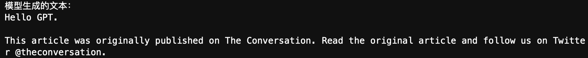
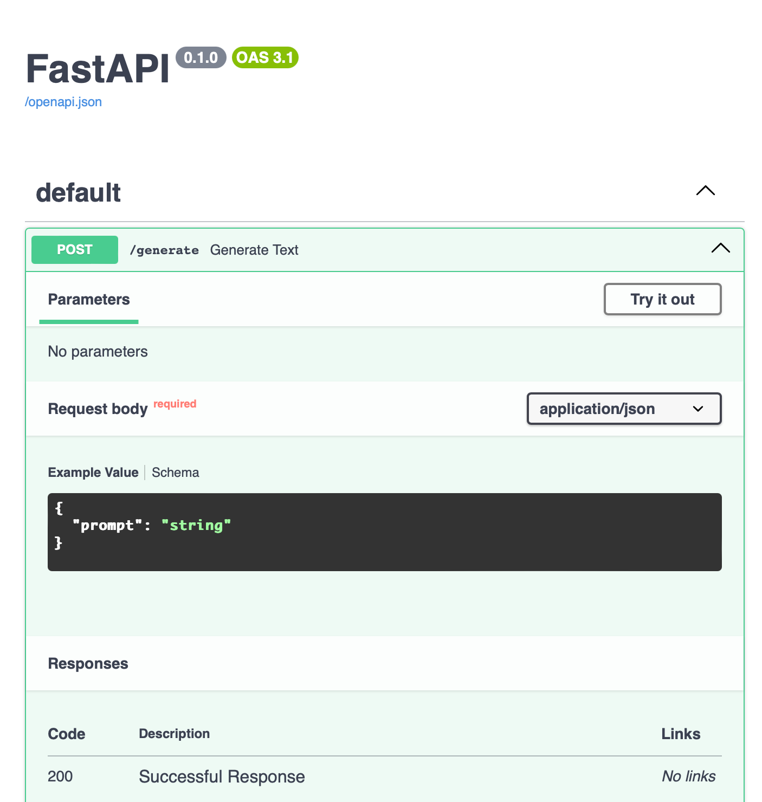
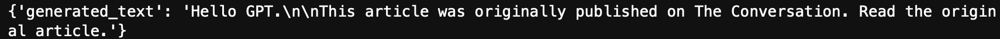

# 部署你的第一个语言模型

> **目标**：指导你在本地或云端部署一个（小型）语言模型，并将其封装为 API 服务。
>
> 代码文件下载：[Code](../Demos/05.%20尝试部署你的第一个语言模型.ipynb), [app_fastapi.py](../Demos/app_fastapi.py), [app_flask.py](../Demos/app_flask.py)

在之前的章节中，我们已经了解了 Hugging Face 中 `AutoModel` 系列的不同类。现在，我们将使用一个参数量较小的模型进行演示，并展示如何使用 FastAPI 和 Flask 将模型部署为 API 服务。

## 目录

- [为什么选择较小的模型？](#为什么选择较小的模型)
- [环境准备](#环境准备)
- [安装库](#安装库)
- [选择并加载模型](#选择并加载模型)
   - [加载 Tokenizer 和模型](#加载-tokenizer-和模型)
   - [将模型移动到设备](#将模型移动到设备)
- [进行推理](#进行推理)
- [部署模型为 API 服务（可选）](#部署模型为-api-服务可选)
   - [选择 FastAPI 还是 Flask？](#选择-fastapi-还是-flask)
   - [使用 FastAPI 部署模型](#使用-fastapi-部署模型)
      - [安装 FastAPI 和 Uvicorn](#安装-fastapi-和-uvicorn)
      - [创建 API 服务](#创建-api-服务)
      - [运行服务](#运行服务)
      - [交互界面](#交互界面)
      - [通过 API 调用模型](#通过-api-调用模型)
   - [使用 Flask 部署模型](#使用-flask-部署模型)
      - [安装 Flask](#安装-flask)
      - [创建 API 服务](#创建-api-服务-1)
      - [运行服务](#运行服务-1)
      - [通过 API 调用模型](#通过-api-调用模型-1)
- [总结](#总结)
- [参考链接](#参考链接)
- [进一步](#进一步)

---

## 为什么选择较小的模型？

大型语言模型（LLMs）通常拥有数十亿甚至上千亿的参数，除了对显存要求很高以外，还会占用大量的磁盘空间，下载费时，为了方便学习和复现，本文选择参数量较小的模型（如小型 GPT、BERT 等）进行演示，你应该可以在任何机器上完成学习。

## 环境准备

- **硬件要求**：建议有 GPU，但本章内容对硬件要求不高，没有 GPU 也可以完成。
- **操作系统**：Windows、macOS 或 Linux 均可。

## 安装库

首先，我们需要安装必要的库，默认已正确安装 PyTorch。

```bash
pip install transformers
```

- `transformers`：Hugging Face 的 Transformers 库，用于加载预训练模型和 Tokenizer。

## 选择并加载模型

我们选择一个参数量较小的模型，如 `distilgpt2`，这是 GPT-2 的精简版本（或者说蒸馏），只有约 8820 万参数。

### 加载 Tokenizer 和模型

```python
import torch
from transformers import AutoTokenizer, AutoModelForCausalLM

# 指定模型名称
model_name = "distilgpt2"

# 加载 Tokenizer
tokenizer = AutoTokenizer.from_pretrained(model_name)

# 加载预训练模型
model = AutoModelForCausalLM.from_pretrained(model_name)
```

### 将模型移动到设备

如果你的计算机有 GPU，可将模型移动到 GPU，加快推理速度。如果你使用的是 Apple 芯片的 Mac，可以移动到 `mps` 上。

```python
device = torch.device("cuda" if torch.cuda.is_available() 
                      else "mps" if torch.backends.mps.is_available() 
                      else "cpu")
model.to(device)
```

## 进行推理

现在，我们可以使用模型进行文本生成。

```python
# 设置模型为评估模式
model.eval()

# 输入文本
input_text = "Hello GPT"

# 编码输入文本
inputs = tokenizer(input_text, return_tensors="pt")
inputs = {key: value.to(device) for key, value in inputs.items()}

# 生成文本
with torch.no_grad():
    outputs = model.generate(
        **inputs,
        max_length=200,
        num_beams=5,
        no_repeat_ngram_size=2,
        early_stopping=True
    )

# 解码生成的文本
generated_text = tokenizer.decode(outputs[0], skip_special_tokens=True)
print("模型生成的文本：")
print(generated_text)
```

**参数说明**：

- `max_length`：生成文本的最大长度。
- `num_beams`：Beam Search 的数量，提高生成文本的质量。
- `no_repeat_ngram_size`：防止生成重复的 n-gram。
- `early_stopping`：当使用 Beam Search 时，若所有候选序列都生成了结束标记（如 `<eos>`），则提前停止生成，这有助于生成更自然和适当长度的文本。

**输出：**


下面是 `early_stopping` 设置为 False 时的输出：



## 部署模型为 API 服务（可选）

如果你希望将模型部署为一个 API 服务，供其他应用调用，可以使用 **FastAPI** 或 **Flask** 框架。

### 选择 FastAPI 还是 Flask？

- **Flask**：
  - 优点：简单易用，适合小型项目和快速原型开发。
  - 缺点：性能相对较低，异步支持较弱。
- **FastAPI**：
  - 优点：高性能，基于 ASGI，原生支持异步编程，自动生成交互式文档（Swagger UI），方便测试和调试。
  - 缺点：相对于 Flask，学习曲线稍陡一些。

如果追求高性能和现代特性，建议使用 **FastAPI**。如果只是简单的演示或对性能要求不高，可以选择 **Flask**。

接下来将分别介绍如何使用 FastAPI 和 Flask 部署模型。

### 使用 FastAPI 部署模型

#### 安装 FastAPI 和 Uvicorn

```bash
pip install fastapi
pip install uvicorn[standard]
```

- `fastapi`：用于创建高性能的 API 服务。
- `uvicorn`：ASGI 服务器，用于运行 FastAPI 应用。

#### 创建 API 服务

创建一个名为 `app_fastapi.py` 的文件，写入以下代码：

```python
from fastapi import FastAPI, HTTPException
from pydantic import BaseModel
from transformers import AutoTokenizer, AutoModelForCausalLM
import torch

# 定义请求体的数据模型
class PromptRequest(BaseModel):
    prompt: str

app = FastAPI()

# 加载模型和分词器
model_name = "distilgpt2"
tokenizer = AutoTokenizer.from_pretrained(model_name)
model = AutoModelForCausalLM.from_pretrained(model_name)
device = torch.device("cuda" if torch.cuda.is_available() else "cpu")
model.to(device)

@app.post("/generate")
def generate_text(request: PromptRequest):
    prompt = request.prompt
    if not prompt:
        raise HTTPException(status_code=400, detail="No prompt provided")

    inputs = tokenizer(prompt, return_tensors="pt").to(device)
    with torch.no_grad():
        outputs = model.generate(
            **inputs,
            max_length=200,
            num_beams=5,
            no_repeat_ngram_size=2,
            early_stopping=True
        )
    generated_text = tokenizer.decode(outputs[0], skip_special_tokens=True)
    return {"generated_text": generated_text}
```

#### 运行服务

在终端中运行以下命令启动服务：

```bash
uvicorn app_fastapi:app --host 0.0.0.0 --port 8000
```

- `app:app`：第一个 `app` 是文件名，第二个 `app` 是 FastAPI 实例的名称。
- `--host` 和 `--port`：指定主机和端口。

**启动成功后，终端输出示例**：


#### 交互界面

打开浏览器，访问 [http://localhost:8000/docs](http://localhost:8000/docs)，你将看到自动生成的交互式 API 文档：



你可以点击 `POST /generate`，然后点击 `Try it out` 直接测试 API：


在 `Request body` 部分修改你的 `prompt`，然后点击 `Execute`：


你将在下方看到具体的生成文本。


#### 通过 API 调用模型

使用以下代码发送请求（在 notebook 运行或者创建一个新的 Python 脚本，例如 `client.py`）：

```python
import requests

response = requests.post(
    "http://localhost:8000/generate",
    json={"prompt": "Hello GPT"}
)
print(response.json())
```

**输出示例**：



### 使用 Flask 部署模型

#### 安装 Flask

```bash
pip install flask
```

#### 创建 API 服务

创建一个名为 `app_flask.py` 的文件，写入以下代码：

```python
from flask import Flask, request, jsonify
from transformers import AutoTokenizer, AutoModelForCausalLM
import torch

app = Flask(__name__)

# 加载模型和分词器
model_name = "distilgpt2"
tokenizer = AutoTokenizer.from_pretrained(model_name)
model = AutoModelForCausalLM.from_pretrained(model_name)
device = torch.device("cuda" if torch.cuda.is_available() else "cpu")
model.to(device)

@app.route('/generate', methods=['POST'])
def generate():
    prompt = request.json.get('prompt')
    if not prompt:
        return jsonify({'error': 'No prompt provided'}), 400

    inputs = tokenizer(prompt, return_tensors="pt").to(device)
    with torch.no_grad():
        outputs = model.generate(
            **inputs,
            max_length=200,
            num_beams=5,
            no_repeat_ngram_size=2,
            early_stopping=True
        )
    generated_text = tokenizer.decode(outputs[0], skip_special_tokens=True)
    return jsonify({'generated_text': generated_text})

if __name__ == '__main__':
    app.run(host='0.0.0.0', port=8000)
```

#### 运行服务

```bash
python app_flask.py
```


#### 通过 API 调用模型

使用以下代码发送请求：

```python
import requests

response = requests.post(
    "http://localhost:8000/generate",
    json={"prompt": "Hello GPT"}
)
print(response.json())
```

**输出：**


## 总结

通过以上步骤，我们成功地部署了一个参数量较小的语言模型 `distilgpt2`，并将其封装为 API 服务，你可以根据实际需求决定使用 **FastAPI** 还是 **Flask**。

你也可以在 [Hugging Face 模型库](https://huggingface.co/models) 选择其他模型进行尝试，如 `distilbert-base-uncased`（使用 AutoModelForMaskedLM，用于填空任务）。

## 参考链接

- [Hugging Face Transformers 文档](https://huggingface.co/docs/transformers/index)
- [Hugging Face 模型库](https://huggingface.co/models)
- [PyTorch 官方文档](https://pytorch.org/docs/stable/index.html)
- [FastAPI 官方文档](https://fastapi.tiangolo.com/)
- [Flask 官方文档](https://flask.palletsprojects.com/)
- [如何生成文本: 通过 Transformers 用不同的解码方法生成文本](https://huggingface.co/blog/zh/how-to-generate)

## 进一步

之后的文章将讲解更大模型的使用，如果你感兴趣可以跳转查看：

- [19a. 从加载到对话：使用 Transformers 本地运行量化 LLM 大模型（GPTQ & AWQ）](./19a.%20从加载到对话：使用%20Transformers%20本地运行量化%20LLM%20大模型（GPTQ%20%26%20AWQ）.md)
- [19b. 从加载到对话：使用 Llama-cpp-python 本地运行量化 LLM 大模型（GGUF）](./19b.%20从加载到对话：使用%20Llama-cpp-python%20本地运行量化%20LLM%20大模型（GGUF）.md)

不过在项目的开始，更建议遵循顺序进行学习（到文章 16 之前，因为可以和李宏毅老师的在线课程：[2024春《生成式人工智能导论》](https://www.bilibili.com/video/BV1BJ4m1e7g8/?share_source=copy_web&vd_source=e46571d631061853c8f9eead71bdb390)同步进行，学习曲线不会太过陡峭）。
