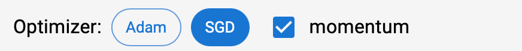
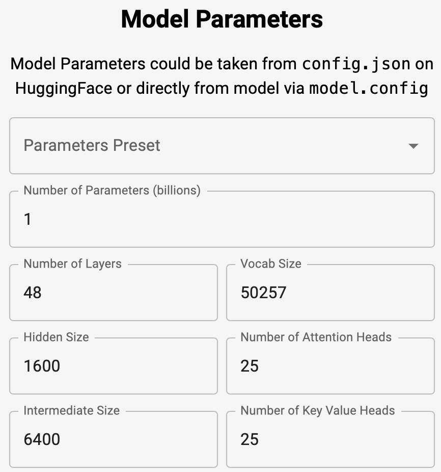
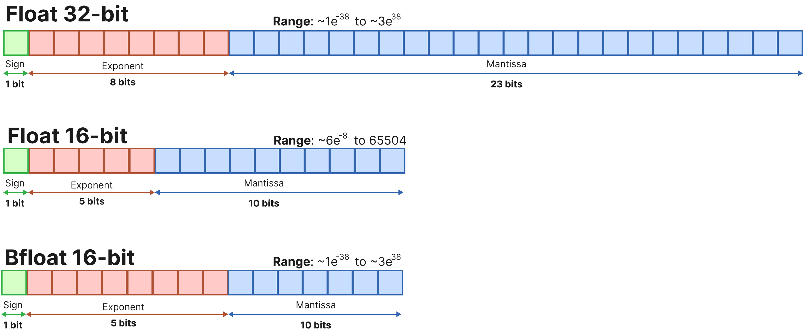
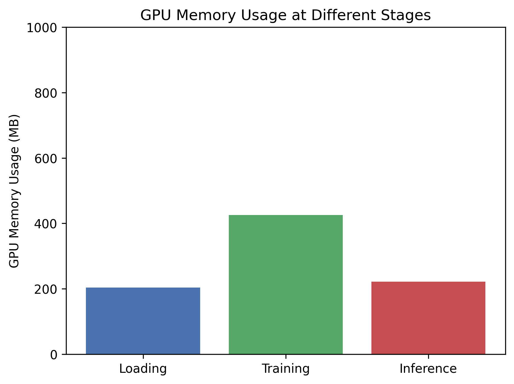

# 模型参数与显存的关系，以及不同精度的影响

> 这篇文章将探讨两个重点：
> - **模型参数与显存（GPU 内存）之间的关系**
> - **不同精度的导入方式，以及它们对显存和性能的影响**
>
> 理解这些概念会让你在模型的选择上更加游刃有余。
>
> **强烈建议访问：**
>
> - [VRAM Estimator](https://vram.asmirnov.xyz/?ref=blog.runpod.io)，交互式直观感受显存的组成
> - [Model Memory Usage](https://huggingface.co/spaces/hf-accelerate/model-memory-usage)，选择模型查看显存使用

## 目录

- [模型参数与显存的关系](#模型参数与显存的关系)
  - [理论计算](#理论计算)
  - [GPU 显存需求](#gpu-显存需求)
    - [训练时的显存占用](#训练时的显存占用)
    - [推理时的显存占用](#推理时的显存占用)
- [不同精度的导入方式及其影响](#不同精度的导入方式及其影响)
  - [常见的数值精度格式](#常见的数值精度格式)
  - [对显存占用的影响](#对显存占用的影响)
  - [精度的权衡与选择](#精度的权衡与选择)
    - [准确性 vs. 性能](#准确性-vs-性能)
    - [何时选择何种精度](#何时选择何种精度)
  - [硬件兼容性](#硬件兼容性)
- [实际应用](#实际应用)
  - [使用 FP16 精度](#使用-fp16-精度)
  - [使用 BF16 精度](#使用-bf16-精度)
  - [使用 INT8 量化](#使用-int8-量化)
  - [实践示例](#实践示例)
    - [对比不同精度下的显存占用](#对比不同精度下的显存占用)
- [常见问题及解决方案](#常见问题及解决方案)
  - [问题一：RuntimeError 解决方法](#问题一runtimeerror-解决方法)
  - [问题二：TypeError 解决方法](#问题二typeerror-解决方法)
- [总结](#总结)
- [附录](#附录)
- [参考链接](#参考链接)

---

## 模型参数与显存的关系

### 理论计算

神经网络模型由多个层组成，每一层都包含权重（weight）和偏置（bias），这些统称为**模型参数**。而模型的参数量一般直接影响它的学习和表示能力。

**模型大小计算公式**:

$$
\text{模型大小（字节）} = \text{参数数量} \times \text{每个参数的字节数}
$$

**示例：**

对于一个拥有 **10 亿（1B / 1,000,000,000）** 参数的模型，使用 **32 位浮点数（`float32`, 简称 FP32）** 表示，每个参数占用 $32 \div 8 = 4$ 字节，即:

$$
\text{模型大小} = 1,000,000,000 \times 4 \text{字节} = 4 \text{GB}
$$

由此可得，**1B (十亿) FP32 参数约等于 4 GB 显存**。

以`meta-llama/Meta-Llama-3.1-70B-Instruct` 这个拥有 **700 亿（70B）** 参数的大模型为例，仅考虑模型参数，它的显存需求就已经超过了大多数消费级 GPU（如 RTX 4090 最高 48G）:

$$
70 \times 10^9 \times 4 \text{字节} = 280 \text{GB}
$$

### GPU 显存需求

而在实际部署模型时，GPU 不仅需要容纳模型参数，还需要处理其他数据，这意味着更大的显存占用量。

#### 训练时的显存占用

主要由以下部分组成：

- **模型参数**：模型的权重和偏置。
- **优化器状态**：如动量和二阶矩估计等，取决于优化器的类型，单纯的 SGD 不占显存。
  - **Adam 优化器**：需要存储一阶和二阶动量，各自占用模型参数大小的空间。
- **梯度**：每个参数对应一个梯度，数据类型与模型参数相同。
- **中间激活值**：前向传播过程中产生的激活值，需要在反向传播中使用，其显存占用与 Batch Size、序列长度以及模型架构相关。
- **批量大小（Batch Size）**：一次处理的数据样本数量。
- **其他开销**：CUDA 上下文、显存碎片等。

#### 推理时的显存占用

推理时的显存占用主要包括：

- **模型参数**：同训练阶段一致。
- **中间激活值**：仅保留当前步的激活值，相较于训练阶段，小非常多。
- **批量大小（Batch Size）**：一次处理的数据样本数量。

**训练阶段**

以 $1B$ 参数的模型为例，假设训练时使用 Adam，精度使用 FP32，**仅**考虑与模型参数挂钩的显存计算：

- **模型参数**：4 GB
- **梯度**：4 GB
- **优化器状态（Adam：一阶和二阶动量）**：8 GB（2 × 4 GB）

$$
\text{总显存} = 4 \text{GB（参数）} + 4 \text{GB（梯度）} + 8 \text{GB（优化器状态）}  = 16 \text{GB}
$$


**测试阶段**

- **模型参数**：4 GB

$$
\text{总显存} = 4 \text{GB（参数）}
$$


[附录](#附录)部分定义了简单的线性层用来展示，可以跳转查看。

现在是你访问它的最佳时机：[VRAM Estimator](https://vram.asmirnov.xyz/?ref=blog.runpod.io)，你需要：

1. 对比 Training 和 Inference。

   

2. 查看 fp16 和 fp32 下哪部分的显存会减小。

   

3. 对比 Adam，SGD (Momentum) 以及 SGD。

   

4. 逐一修改模型参数。

   

通过交互，你会印证一些想法，但可能会产生关于 **Activations** 激活值的疑惑。这篇文章讲述的是参数与显存的关系，所以 Activations 部分留待日后进行解释。

## 不同精度的导入方式及其影响

为了降低显存占用，我们可以使用不同的数值精度格式来存储模型参数，这些精度格式在内存使用和计算性能上各有优劣。

### 常见的数值精度格式

- **FP32（32 位浮点数）**：标准精度，每个参数占用 **4 字节**。

- **FP16（16 位浮点数）**：半精度浮点数，每个参数占用 **2 字节**。

- **BF16（16 位脑浮点数）**：与 FP16 类似，但具有更大的指数范围。

  

- **INT8（8 位整数）**：低精度整数，每个参数占用 **1 字节**。

- **量化格式**：**4 位**或更低，用于特殊的量化算法，进一步减少显存占用。

### 对显存占用的影响

使用更低的精度可以显著减少模型的显存占用：

- **FP16/BF16 相对于 FP32**：显存占用减半。
- **INT8 相对于 FP32**：显存占用减少到原来的四分之一。

**示例**：

对于一个 **1B** 参数的模型：

- **FP32 精度**：4 GB 显存。
- **FP16/BF16 精度**：2 GB 显存。
- **INT8 精度**：1 GB 显存。

**注意**：实际显存占用还受到其他因素影响，如 CUDA 上下文、中间激活值和显存碎片等，因此不会严格按照理论值减半或减少四分之一。对于较小的模型，差距可能不会那么显著。

## 精度的权衡与选择

### 准确性 vs. 性能

- **高精度（FP32）**：
  - **优点**：更高的数值稳定性和模型准确性。
  - **缺点**：占用**更多**显存，计算速度**较慢**。

- **低精度（FP16/INT8）**：
  - **优点**：占用**更少**的显存，计算速度**更快**。
  - **缺点**：可能**引入**数值误差，影响模型性能。

### 何时选择何种精度

- **FP32**：
  - 适用于训练**小型模型**或对数值精度要求**较高**的任务。

- **FP16/BF16**：
  - 适用于训练**大型模型**，利用混合精度（Mixed Precision）来节省显存并加速计算。

- **INT8**：
  - 主要用于**推理阶段**，尤其是在显存资源**有限**的情况下部署**超大模型**。

### 硬件兼容性

- **FP16 支持**：
  - 大多数现代 NVIDIA GPU（RTX 20 系列及以上）支持 FP16。

- **BF16 支持**：
  - BF16 支持在 NVIDIA Ampere 架构及以上的 GPU 上提供，包括 RTX 30 系列、RTX 40 系列以及 A100、H100 等数据中心级 GPU。

- **INT8 支持**：
  - 使用 `bitsandbytes` 库，可以在大多数消费级 GPU 上实现 INT8 量化，无需特殊的硬件支持。

## 实际应用

### 使用 FP16 精度

1. **PyTorch**

    PyTorch 提供了 `torch.cuda.amp` 模块，可以方便地实现混合精度训练，加速计算并降低显存占用。

    ```python
    import torch
    from torch import nn, optim
    from torch.cuda.amp import GradScaler, autocast
    
    device = torch.device("cuda" if torch.cuda.is_available() else "cpu")
    
    model = nn.Sequential(...)  # 定义模型
    model.to(device)
    optimizer = optim.Adam(model.parameters(), lr=1e-3)
    scaler = GradScaler()  # 初始化梯度缩放器
    
    for data, labels in dataloader:
        data = data.to(device)
        labels = labels.to(device)
        optimizer.zero_grad()
        with autocast():  # 启用混合精度，默认 FP16
            outputs = model(data)
            loss = criterion(outputs, labels)
        # 使用梯度缩放器进行反向传播
        scaler.scale(loss).backward()
        scaler.step(optimizer)
        scaler.update()
    ```
    
    **推理**
    
    ```python
    model.half()  # 将模型转换为 FP16
    model.to(device)
    inputs = inputs.half().to('cuda')
    outputs = model(inputs)
    ```
    
2. **Hugging Face Accelerate**

    如果你使用 Hugging Face 的模型，可以直接使用 `Accelerate` 库。

    ```python
    from accelerate import Accelerator
    
    # 初始化 Accelerator，开启混合精度
    accelerator = Accelerator(fp16=True)
    model = ...  # 定义模型
    optimizer = ...  # 定义优化器
    dataloader = ...  # 定义数据加载器
    
    # 使用 accelerator.prepare() 函数包装模型、优化器和数据加载器
    model, optimizer, dataloader = accelerator.prepare(model, optimizer, dataloader)
    
    for data, labels in dataloader:
        outputs = model(data)
        loss = loss_fn(outputs, labels)
    
        # 使用 accelerator 进行反向传播和优化步骤
        accelerator.backward(loss)
        optimizer.step()
        optimizer.zero_grad()
    ```

### 使用 BF16 精度

1. **PyTorch**

   ```python
   with autocast(dtype=torch.bfloat16):  # 手动启用 BF16
       outputs = model(data)
       loss = criterion(outputs, labels)
   ...
   ```

   **推理**

   ```python
   model = model.to(torch.bfloat16).to(device)
   inputs = inputs.to(torch.bfloat16).to(device)
   outputs = model(inputs)
   ```

2. **Hugging Face Accelerate**

   ```python
   from accelerate import Accelerator
   
   # 初始化 Accelerator，开启 BF16 混合精度
   accelerator = Accelerator(mixed_precision="bf16")  # 启用 BF16 精度
   model = ...  # 定义模型
   optimizer = ...  # 定义优化器
   dataloader = ...  # 定义数据加载器
   
   # 使用 accelerator.prepare() 函数包装模型、优化器和数据加载器
   model, optimizer, dataloader = accelerator.prepare(model, optimizer, dataloader)
   
   for data, labels in dataloader:
       outputs = model(data)
       loss = loss_fn(outputs, labels)
   
       # 使用 accelerator 进行反向传播和优化步骤
       accelerator.backward(loss)
       optimizer.step()
       optimizer.zero_grad()
   ```

### 使用 INT8 量化

**安装 `bitsandbytes`**

```bash
pip install bitsandbytes
```

**使用 `bitsandbytes` 库实现 INT8 量化**

```python
from transformers import AutoModelForCausalLM
import bitsandbytes as bnb

model_name = 'gpt2-large'

model = AutoModelForCausalLM.from_pretrained(
    model_name,
    load_in_8bit=True,
    device_map='auto'
)

```

### 消除警告

在加载模型时，可能会遇到以下警告：

> The `load_in_4bit` and `load_in_8bit` arguments are deprecated and will be removed in the future versions. Please, pass a `BitsAndBytesConfig` object in `quantization_config` argument instead.

**解决方法：**

使用 `BitsAndBytesConfig` 对象来配置量化参数。

```python
from transformers import AutoModelForCausalLM, BitsAndBytesConfig

bnb_config = BitsAndBytesConfig(load_in_8bit=True)

model = AutoModelForCausalLM.from_pretrained(
    model_name,
    quantization_config=bnb_config,
    device_map='auto'
)
```

## 实践示例

### 对比不同精度下的显存占用

**加载模型并查看显存占用**

以下代码示例展示了在不同精度下加载 `gpt2-large` 模型时的显存占用情况。`gpt2-large` 大约有 **812M（8.12 亿）= 0.812B** 个参数。

```python
import os
import gc
import torch
from transformers import AutoModelForCausalLM, BitsAndBytesConfig
import bitsandbytes as bnb

def load_model_and_measure_memory(precision, model_name, device):
    if precision == 'fp32':
        model = AutoModelForCausalLM.from_pretrained(model_name).to(device)
    elif precision == 'fp16':
        model = AutoModelForCausalLM.from_pretrained(
            model_name,
            torch_dtype=torch.float16,
            low_cpu_mem_usage=True
        ).to(device)
    elif precision == 'int8':
        bnb_config = BitsAndBytesConfig(load_in_8bit=True)
        model = AutoModelForCausalLM.from_pretrained(
            model_name,
            quantization_config=bnb_config,
            device_map='auto'
        )
    else:
        raise ValueError("Unsupported precision")
    
    # 确保所有 CUDA 操作完成
    torch.cuda.synchronize()
    
    mem_allocated = torch.cuda.memory_allocated(device) / 1e9
    print(f"Precision: {precision}, Memory Allocated after loading model: {mem_allocated:.2f} GB")
    
    # 删除模型并清理缓存
    del model
    gc.collect()
    torch.cuda.empty_cache()

device = torch.device("cuda" if torch.cuda.is_available() else "cpu")
model_name = 'gpt2-large'

for precision in ['fp32', 'fp16', 'int8']:
    print(f"\n--- Loading model with precision: {precision} ---")
    load_model_and_measure_memory(precision, model_name, device)
```

**示例输出**：

```
--- Loading model with precision: fp32 ---
Precision: fp32, Memory Allocated after loading model: 3.21 GB

--- Loading model with precision: fp16 ---
Precision: fp16, Memory Allocated after loading model: 1.60 GB

--- Loading model with precision: int8 ---
Precision: int8, Memory Allocated after loading model: 0.89 GB
```

**额外说明**：

- **`torch.cuda.memory_allocated`** 仅测量由 PyTorch 当前进程分配的显存，不包括其他进程或系统预留的显存。

### 常见问题及解决方案

#### 问题一：`RuntimeError:  Failed to import transformers.models.gpt2.modeling_gpt2 because of the following error`

> RuntimeError: Failed to import transformers.models.gpt2.modeling_gpt2 because of the following error (look up to see its traceback): 
> module 'wandb.proto.wandb_internal_pb2' has no attribute 'Result'

**解决方法**：

- 卸载并重新安装 `wandb`：

  ```bash
  pip uninstall wandb
  pip install wandb
  ```

- 如果问题仍然存在，禁用 `wandb`：

  ```python
  import os
  os.environ["WANDB_DISABLED"] = "true"

#### 问题二：`TypeError: dispatch_model() got an unexpected keyword argument 'offload_index'`

**解决方法：**

- 检查 `transformers` 和 `accelerate` 库的版本：

  ```python
  import transformers
  import accelerate

  print(f"Transformers version: {transformers.__version__}")
  print(f"Accelerate version: {accelerate.__version__}")
  ```

- 更新库：

  ```bash
  pip install --upgrade transformers accelerate
  ```
  

## 总结

现在你应该理解了**模型参数与显存的关系**，以及**不同数值精度**对显存和性能的影响，这不仅在实际应用中具有重要意义，也是面试中的常见考点，而且对于后续的学习同样很重要。毕竟看得懂代码在说什么，比当作黑箱要好得多，知道精度的概念会让你在模型的选择上更加游刃有余。

**最后的思考：**

精度的降低意味着性能的妥协，在我过去的一些小型试验中（非 LLM），低精度下训练的性能还是一般都不如高精度。但，跑不跑的好是一回事，能不能跑又是另一回事，如果低显存能跑大模型，性能上的妥协也是完全可以接受的。

> 而且实际上，“妥协”造成的性能损失并不是断崖式的，提前引用 [18. 模型量化技术概述及 GGUF:GGML 文件格式解析](../Guide/18.%20模型量化技术概述及%20GGUF%3AGGML%20文件格式解析.md#为什么需要新的量化方法)中的讲述：
>
> 
>
> 该图展示了在 `wikitext` 数据集上，不同模型大小（以 GiB 为单位）与其 PPL （Perplexity，PPL）之间的关系。横轴为模型大小（对数尺度），纵轴为 PPL 。图中的不同颜色代表不同大小的 LLaMA 模型（黑色 7B、红色 13B、蓝色 30B、品红 65B），相应颜色的正方形表示原始的`FP16`模型。
>
> 从图中可以看出， PPL 基本上是模型大小的平滑函数。也就是说，通过调整量化策略，我们可以在模型大小和性能之间找到一个平衡点。在计算资源有限的情况下（例如内存或显存限制），新的量化方法允许我们选择最适合的模型（这个工作做得真好）。
>
> **值得注意的是，6-bit 量化模型的 PPL 与原始 `fp16` 模型的差异在 0.1% 以内或者更好，性能几乎没有损失。**

## 附录

这里定义一个简单的线性层进行模拟，展示导入，训练和推理阶段显存的变化：

```python
import torch
import torch.nn as nn
import torch.optim as optim
from torchvision import datasets, transforms
import gc
import matplotlib.pyplot as plt


device = torch.device('cuda' if torch.cuda.is_available() else 'cpu')

# 定义一个简单的多层感知机（MLP）
class SimpleMLP(nn.Module):
    def __init__(self):
        super(SimpleMLP, self).__init__()
        self.layers = nn.Sequential(
            nn.Linear(28 * 28, 8192),
            nn.ReLU(),
            nn.Linear(8192, 4096),
            nn.ReLU(),
            nn.Linear(4096, 2048),
            nn.ReLU(),
            nn.Linear(2048, 1024),
            nn.ReLU(),
            nn.Linear(1024, 512),
            nn.ReLU(),
            nn.Linear(512, 10)
        )
        
    def forward(self, x):
        x = x.view(x.size(0), -1)  # 展平输入
        x = self.layers(x)
        return x

# 准备数据集（使用 MNIST）
transform = transforms.Compose([
    transforms.ToTensor(),
    transforms.Normalize((0.1307,), (0.3081,))
])

batch_size = 128

train_dataset = datasets.MNIST('./data', train=True, download=True, transform=transform)
train_loader = torch.utils.data.DataLoader(train_dataset, batch_size=batch_size, shuffle=True)

test_dataset = datasets.MNIST('./data', train=False, download=True, transform=transform)
test_loader = torch.utils.data.DataLoader(test_dataset, batch_size=batch_size, shuffle=False)

# 函数：仅测量已分配的显存
def print_gpu_memory(stage):
    torch.cuda.empty_cache()
    allocated = torch.cuda.memory_allocated(device) / 1e6  # 已分配显存
    print(f'[{stage}] Allocated: {allocated:.2f} MB')

# 清理缓存，确保测量准确
torch.cuda.empty_cache()
gc.collect()

# ---------------------------
# 1. 测量导入模型时的显存占用
# ---------------------------
print('Measuring memory usage during model loading...')
print_gpu_memory('Before loading model')

model = SimpleMLP().to(device)

print_gpu_memory('After loading model')

# 保存导入阶段的显存占用
memory_loading = torch.cuda.memory_allocated(device) / 1e6

# ---------------------------
# 2. 测量训练过程中的显存占用，并计算数据占用的显存
# ---------------------------
print('\nMeasuring memory usage during training...')

criterion = nn.CrossEntropyLoss()
optimizer = optim.Adam(model.parameters(), lr=0.001)  # 你可以切换成 SGD 查看区别

num_epochs = 1  # 为了快速演示，只训练一个 epoch

print_gpu_memory('Before training')

model.train()
for epoch in range(num_epochs):
    for batch_idx, (data, target) in enumerate(train_loader):
        # 记录数据加载到 GPU 前的显存使用情况
        memory_before_data = torch.cuda.memory_allocated(device) / 1e6
        
        data, target = data.to(device), target.to(device)
        
        # 记录数据加载到 GPU 后的显存使用情况
        memory_after_data = torch.cuda.memory_allocated(device) / 1e6
        data_memory_usage = memory_after_data - memory_before_data
        print(f'Data memory usage for batch {batch_idx + 1}: {data_memory_usage:.2f} MB')

        # 记录训练开始前的显存
        memory_before_training_step = torch.cuda.memory_allocated(device) / 1e6

        optimizer.zero_grad()
        output = model(data)
        loss = criterion(output, target)
        loss.backward()
        optimizer.step()
        
        # 训练结束后的显存
        memory_after_training_step = torch.cuda.memory_allocated(device) / 1e6

        # 计算训练步骤中的额外显存占用（激活值、梯度、优化器状态等）
        training_step_memory_usage = memory_after_training_step - memory_before_training_step
        print(f'Training step memory usage: {training_step_memory_usage:.2f} MB')

        # 只测量一次
        if batch_idx == 0:
            print_gpu_memory(f'Training Epoch {epoch+1}, Batch {batch_idx+1}')
            # 保存训练阶段的显存占用
            memory_training = torch.cuda.memory_allocated(device) / 1e6
            break

# ---------------------------
# 3. 测量推理过程中的显存占用，并计算数据占用的显存
# ---------------------------
print('\nMeasuring memory usage during inference...')

# 在推理前清理训练相关的变量和缓存
del optimizer
del criterion

# 清理所有模型参数的梯度
for param in model.parameters():
    param.grad = None  
    
torch.cuda.empty_cache()
gc.collect()

model.eval()
with torch.no_grad():
    for batch_idx, (data, target) in enumerate(test_loader):
        # 记录数据加载到 GPU 前的显存使用情况
        memory_before_data = torch.cuda.memory_allocated(device) / 1e6
        
        data = data.to(device)
        
        # 记录数据加载到 GPU 后的显存使用情况
        memory_after_data = torch.cuda.memory_allocated(device) / 1e6
        data_memory_usage = memory_after_data - memory_before_data
        print(f'Data memory usage for inference batch {batch_idx + 1}: {data_memory_usage:.2f} MB')
        
        output = model(data)
        
        # 只测量一次
        if batch_idx == 0:
            print_gpu_memory(f'Inference Batch {batch_idx+1}')
            # 保存推理阶段的显存占用
            memory_inference = torch.cuda.memory_allocated(device) / 1e6
            break

# ---------------------------
# 4. 整理并展示结果
# ---------------------------
print('\nSummary of GPU Memory Usage:')
print(f'Memory during model loading: {memory_loading:.2f} MB')
print(f'Memory during training: {memory_training:.2f} MB')
print(f'Memory during inference: {memory_inference:.2f} MB')

# 可视化
stages = ['Loading', 'Training', 'Inference']
memories = [memory_loading, memory_training, memory_inference]

plt.bar(stages, memories, color=['blue', 'green', 'red'])
plt.ylabel('GPU Memory Usage (MB)')
plt.title('GPU Memory Usage at Different Stages')
plt.show()
```

输出：

```text
Measuring memory usage during model loading...
[Before loading model] Allocated: 0.00 MB
[After loading model] Allocated: 204.03 MB

Measuring memory usage during training...
[Before training] Allocated: 204.03 MB
Data memory usage for batch 1: 0.40 MB
Training step memory usage: 425.11 MB
[Training Epoch 1, Batch 1] Allocated: 629.54 MB

Measuring memory usage during inference...
Data memory usage for inference batch 1: 0.40 MB
[Inference Batch 1] Allocated: 221.48 MB

Summary of GPU Memory Usage:
Memory during model loading: 204.03 MB
Memory during training: 629.54 MB
Memory during inference: 221.48 MB
```


可以看到=显存占比（加载：训练：推理）约为 1 : 4 : 1。

因为训练时，Adam 占了 2 倍大小的模型参数显存，梯度占了 1 倍。你可以修改代码中的 Adam 为 SGD，此时的输出如下：

```text
Measuring memory usage during model loading...
[Before loading model] Allocated: 0.00 MB
[After loading model] Allocated: 204.03 MB

Measuring memory usage during training...
[Before training] Allocated: 204.03 MB
Data memory usage for batch 1: 0.40 MB
Training step memory usage: 221.08 MB
[Training Epoch 1, Batch 1] Allocated: 425.51 MB

Measuring memory usage during inference...
Data memory usage for inference batch 1: 0.40 MB
[Inference Batch 1] Allocated: 221.48 MB

Summary of GPU Memory Usage:
Memory during model loading: 204.03 MB
Memory during training: 425.51 MB
Memory during inference: 221.48 MB
```



在不存储动量信息后，占比变为了 1 : 2 : 1。

## 参考链接

- [PyTorch Mixed Precision Training](https://pytorch.org/docs/stable/amp.html)
- [Transformers Documentation](https://huggingface.co/docs/transformers/index)
- [bitsandbytes - Github](https://github.com/bitsandbytes-foundation/bitsandbytes)

