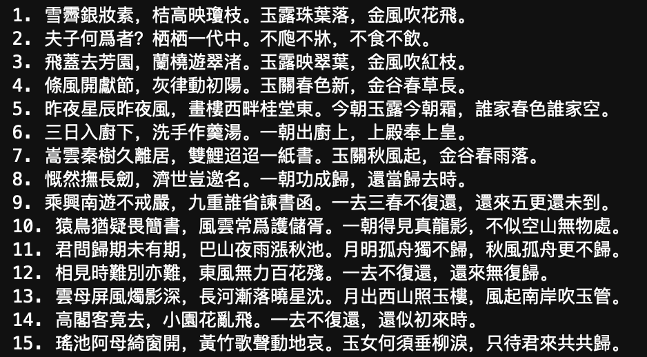
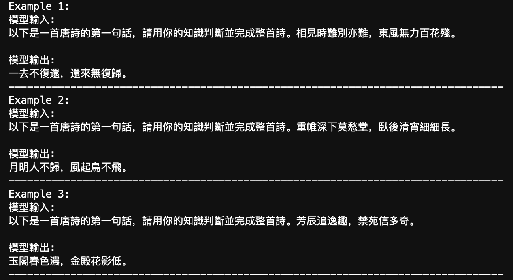

# 尝试微调 LLM：让它会写唐诗

> 这篇文章与 [03. 进阶指南：自定义 Prompt 提升大模型解题能力](../Guide/03.%20进阶指南：自定义%20Prompt%20提升大模型解题能力.md)一样，本质上是专注于“用”而非“写”，你可以像之前一样，仅了解整体的流程，并尝试调整超参数部分来查看对微调的影响。
>
> 这里同样是[生成式人工智能导论](https://speech.ee.ntu.edu.tw/~hylee/genai/2024-spring.php)：[HW5 Fine-tuning](https://colab.research.google.com/drive/1nB3jwRJVKXSDDNO-pbURrao0N2MpqHl8?usp=sharing#scrollTo=uh5rwbr4q5Nw) 的中文镜像。
>
> [代码文件下载](../Demos/06.%20尝试微调%20LLM：让它会写唐诗.ipynb)
>
> 在线链接：[Kaggle](https://www.kaggle.com/code/aidemos/06-llm) | [Colab](https://colab.research.google.com/drive/1u2xgN5gWnZCwPlH2R-0gz_CpI9gzLdiy?usp=sharing)

## 目录

- [环境配置与库安装](#环境配置与库安装)
- [导入库](#导入库)
- [下载微调所需的数据集](#下载微调所需的数据集)
- [定义辅助函数](#定义辅助函数)
  - [数据预处理函数](#数据预处理函数)
  - [模型评估函数](#模型评估函数)
- [下载模型并在微调前进行推理](#下载模型并在微调前进行推理)
  - [选择预训练模型](#选择预训练模型)
  - [微调前的推理](#微调前的推理)
  - [初始表现](#初始表现)
- [设置用于微调的超参数](#设置用于微调的超参数)
- [开始微调](#开始微调)
- [测试微调后的模型](#测试微调后的模型)
  - [选取要加载的微调后的模型](#选取要加载的微调后的模型)
  - [释放显存](#释放显存)
  - [加载模型和分词器](#加载模型和分词器)
  - [生成测试结果](#生成测试结果)
- [微调前后的对比](#微调前后的对比)

# 环境配置与库安装

首先，我们需要安装一些必要的库，以便简化微调过程。

```bash
pip install bitsandbytes
pip install datasets
pip install transformers
pip install peft
pip install sentencepiece
pip install accelerate
pip install colorama
pip install fsspec
```

**库说明（实际上在这里不需要深究）**：

- `bitsandbytes`：用于低精度计算，加速训练过程。
- `datasets`：用于加载和处理数据集。
- `transformers`：Hugging Face 提供的库，包含预训练的模型和 Tokenizer。
- `peft`：Parameter-Efficient Fine-Tuning，参数高效微调库。
- `sentencepiece`：用于处理分词。
- `accelerate`：用于加速训练过程。
- `colorama`：用于在终端中打印彩色文本。
- `fsspec`：文件系统规范库。

# 导入库

安装完库后，导入我们需要的模块。

```python
import os
import sys
import argparse
import json
import warnings
import logging
warnings.filterwarnings("ignore")

import torch
import torch.nn as nn
import bitsandbytes as bnb
from datasets import load_dataset, load_from_disk
import transformers
from peft import PeftModel
from colorama import Fore, Style

from tqdm import tqdm
from transformers import (
    AutoTokenizer,
    AutoConfig,
    AutoModelForCausalLM,
    BitsAndBytesConfig,
    GenerationConfig
)
from peft import (
    LoraConfig,
    get_peft_model,
    get_peft_model_state_dict,
    prepare_model_for_kbit_training
)
```

# 下载微调所需的数据集

我们将使用一个唐诗的数据集来微调模型，这个数据集来自于[全唐诗 - Github](https://github.com/chinese-poetry/chinese-poetry/tree/master/全唐诗?fbclid=IwAR2bM14S42T-VtrvMi3wywCqKfYJraBtMl7QVTo0qyPMjX9jj9Vj3JepFBA)。

```bash
git clone https://github.com/CheeEn-Yu/GenAI-Hw5.git
```

克隆完成后，数据集会存储在 `GenAI-Hw5` 目录下。

# 定义辅助函数

在微调过程中，我们需要一些辅助函数来处理数据和评估模型。

## 数据预处理函数

```python
def generate_training_data(data_point):
    """
    将输入和输出文本转换为模型可读取的 tokens。

    参数：
    - data_point: 包含 "instruction"、"input" 和 "output" 字段的字典。

    返回：
    - 包含模型输入 IDs、标签和注意力掩码的字典。
    
    示例:
    - 如果你构建了一个字典 data_point_1，并包含字段 "instruction"、"input" 和 "output"，你可以像这样使用函数：
        generate_training_data(data_point_1)
    """
    # 构建完整的输入提示词
    prompt = f"""\
[INST] <<SYS>>
You are a helpful assistant and good at writing Tang poem. 你是一個樂於助人的助手且擅長寫唐詩。
<</SYS>>

{data_point["instruction"]}
{data_point["input"]}
[/INST]"""

    # 计算用户提示词的 token 数量
    len_user_prompt_tokens = (
        len(
            tokenizer(
                prompt,
                truncation=True,
                max_length=CUTOFF_LEN + 1,
                padding="max_length",
            )["input_ids"]
        ) - 1
    )

    # 将完整的输入和输出转换为 tokens
    full_tokens = tokenizer(
        prompt + " " + data_point["output"] + "</s>",
        truncation=True,
        max_length=CUTOFF_LEN + 1,
        padding="max_length",
    )["input_ids"][:-1]

    return {
        "input_ids": full_tokens,
        "labels": [-100] * len_user_prompt_tokens + full_tokens[len_user_prompt_tokens:],
        "attention_mask": [1] * len(full_tokens),
    }
```

**函数解释**：

- **目的**：将原始数据转换为模型可以处理的输入格式。
- **处理步骤**：
  - 构建提示词 `prompt`，包括系统信息和用户的指令。
  - 使用 `tokenizer` 将 `prompt` 转换为 token，并计算其长度。
  - 将完整的输入（提示词和输出）转换为 tokens。
  - 构建 `labels`，对于提示词部分的 tokens，使用 `-100`（在计算损失时会被忽略），对于输出部分的 tokens，保留实际的 token ID。

## 模型评估函数

```python
def evaluate(instruction, generation_config, max_len, input_text="", verbose=True):
    """
    获取模型在给定输入下的生成结果。

    参数：
    - instruction: 描述任务的字符串。
    - generation_config: 模型生成配置。
    - max_len: 最大生成长度。
    - input_text: 输入文本，默认为空字符串。
    - verbose: 是否打印生成结果。

    返回：
    - output: 模型生成的文本。
    """
    # 构建完整的输入提示词
    prompt = f"""\
[INST] <<SYS>>
You are a helpful assistant and good at writing Tang poem. 你是一個樂於助人的助手且擅長寫唐詩。
<</SYS>>

{instruction}
{input_text}
[/INST]"""

    # 将提示词转换为模型所需的 token 格式
    inputs = tokenizer(prompt, return_tensors="pt")
    input_ids = inputs["input_ids"].cuda()
    
    # 使用模型生成回复
    generation_output = model.generate(
        input_ids=input_ids,
        generation_config=generation_config,
        return_dict_in_generate=True,
        output_scores=True,
        max_new_tokens=max_len,
    )
    
    # 解码并打印生成的回复
    for s in generation_output.sequences:
        output = tokenizer.decode(s)
        output = output.split("[/INST]")[1].replace("</s>", "").replace("<s>", "").replace("Assistant:", "").replace("Assistant", "").strip()
        if verbose:
            print(output)
    
    return output
```

**函数解释**：

- **目的**：给定一个指令，使用模型生成对应的回复。
- **处理步骤**：
  - 构建提示词 `prompt`，包括系统信息和用户的指令。
  - 使用 `tokenizer` 将 `prompt` 转换为模型的输入格式。
  - 调用 `model.generate` 生成文本。
  - 对生成的序列进行解码，提取模型的输出部分。

# 下载模型并在微调前进行推理

## 选择预训练模型

我们将默认选择 MediaTek Breeze 7B 模型，因为 TAIDE 模型可能遇到下载次数过多无法访问。实际上换其他的开源大模型一样可以，并不影响学习。

```python
""" 你可以（但不一定需要）更改 LLM 模型 """

model_name = "MediaTek-Research/Breeze-7B-Instruct-v0_1"

# model_name = "/content/TAIDE-LX-7B-Chat"
# 如果你想使用 TAIDE 模型，请先查看 TAIDE L Models Community License Agreement (https://drive.google.com/file/d/1FcUZjbUH6jr4xoCyAronN_slLgcdhEUd/view)。
# 一旦使用，即表示你同意协议条款。
# !wget -O taide_7b.zip "https://www.dropbox.com/scl/fi/harnetdwx2ttq1xt94rin/TAIDE-LX-7B-Chat.zip?rlkey=yzyf5nxztw6farpwyyildx5s3&st=s22mz5ao&dl=0"
# !unzip taide_7b.zip
```

## 微调前的推理

先看看在未进行微调的情况下，模型的表现如何。

### 加载模型

会占用大概 5.2G 的显存。

```python
cache_dir = "./cache"

nf4_config = BitsAndBytesConfig(
   load_in_4bit=True,
   bnb_4bit_quant_type="nf4",
   bnb_4bit_use_double_quant=True,
   bnb_4bit_compute_dtype=torch.bfloat16
)

# 从指定模型名称或路径加载预训练语言模型
model = AutoModelForCausalLM.from_pretrained(
    model_name,
    cache_dir=cache_dir,
    quantization_config=nf4_config,
    low_cpu_mem_usage=True
)

# 创建 tokenizer 并设置结束符号 (eos_token)
logging.getLogger('transformers').setLevel(logging.ERROR)
tokenizer = AutoTokenizer.from_pretrained(
    model_name,
    add_eos_token=True,
    cache_dir=cache_dir,
    quantization_config=nf4_config
)
tokenizer.pad_token = tokenizer.eos_token

# 设置模型推理时的解码参数
max_len = 128
generation_config = GenerationConfig(
    do_sample=True,
    temperature=0.1,
    num_beams=1,
    top_p=0.3,
    no_repeat_ngram_size=3,
    pad_token_id=2,
)
```

**主要函数解释**：

- **BitsAndBytesConfig**：配置模型的量化设置，使用 4 位精度以节省显存。
- **AutoModelForCausalLM**：加载预训练的语言模型。
- **AutoTokenizer**：加载对应的分词器。
- **GenerationConfig**：设置文本生成时的参数，如温度、采样策略等。

这个代码块会下载对应的预训练模型。


### 初始表现

```python
""" 样例和 Prompt 都保持繁体 """

# 测试样例
test_tang_list = [
    '相見時難別亦難，東風無力百花殘。',
    '重帷深下莫愁堂，臥後清宵細細長。',
    '芳辰追逸趣，禁苑信多奇。'
]

# 获取每个样例的模型输出
demo_before_finetune = []
for tang in test_tang_list:
    demo_before_finetune.append(
        f'模型輸入:\n以下是一首唐詩的第一句話，請用你的知識判斷並完成整首詩。{tang}\n\n模型輸出:\n' +
        evaluate('以下是一首唐詩的第一句話，請用你的知識判斷並完成整首詩。', generation_config, max_len, tang, verbose=False)
    )

# 打印并将输出存储到文本文件
for idx in range(len(demo_before_finetune)):
    print(f"Example {idx + 1}:")
    print(demo_before_finetune[idx])
    print("-" * 80)
```

可以看到回答多数是在重复输入的第一句话。


# 设置用于微调的超参数

```python
""" 强烈建议你尝试调整这个参数 """

num_train_data = 1040  # 设置用于训练的数据量，最大值为5000。通常，训练数据越多越好，模型会见到更多样化的诗句，从而提高生成质量，但也会增加训练时间。
                      # 使用默认参数(1040)：微调大约需要25分钟，完整运行所有单元大约需要50分钟。
                      # 使用最大值(5000)：微调大约需要100分钟，完整运行所有单元大约需要120分钟。
        
""" 你可以（但不一定需要）更改这些超参数 """

output_dir = "./output"  # 设置作业结果输出目录。
ckpt_dir = "./exp1"  # 设置 model checkpoint 保存目录（如果想将 model checkpoints 保存到其他目录下，可以修改这里）。
num_epoch = 1  # 设置训练的总 Epoch 数（数值越高，训练时间越长，若使用免费版的 Colab 需要注意时间太长可能会断线，本地运行不需要担心）。
LEARNING_RATE = 3e-4  # 设置学习率

""" 建议不要更改此单元格中的代码 """

cache_dir = "./cache"  # 设置缓存目录路径
from_ckpt = False  # 是否从 checkpoint 加载模型权重，默认值为否
ckpt_name = None  # 加载特定 checkpoint 时使用的文件名，默认值为无
dataset_dir = "./GenAI-Hw5/Tang_training_data.json"  # 设置数据集目录或文件路径
logging_steps = 20  # 定义训练过程中每隔多少步骤输出一次日志
save_steps = 65  # 定义训练过程中每隔多少步骤保存一次模型
save_total_limit = 3  # 控制最多保留多少个模型 checkpoint
report_to = "none"  # 设置不上报实验指标，也可以设置为 "wandb"，此时需要获取对应的 API，见：https://github.com/Hoper-J/AI-Guide-and-Demos-zh_CN/pull/5
MICRO_BATCH_SIZE = 4  # 定义微批次大小
BATCH_SIZE = 16  # 定义一个批次的大小
GRADIENT_ACCUMULATION_STEPS = BATCH_SIZE // MICRO_BATCH_SIZE  # 计算每个微批次累积的梯度步骤
CUTOFF_LEN = 256  # 设置文本截断的最大长度
LORA_R = 8  # 设置 LORA（Layer-wise Random Attention）的 R 值
LORA_ALPHA = 16  # 设置 LORA 的 Alpha 值
LORA_DROPOUT = 0.05  # 设置 LORA 的 Dropout 率
VAL_SET_SIZE = 0  # 设置验证集的大小，默认值为无
TARGET_MODULES = ["q_proj", "up_proj", "o_proj", "k_proj", "down_proj", "gate_proj", "v_proj"]  # 设置目标模块，这些模块的权重将被保存为 checkpoint。
device_map = "auto"  # 设置设备映射，默认值为 "auto"
world_size = int(os.environ.get("WORLD_SIZE", 1))  # 获取环境变量 "WORLD_SIZE" 的值，若未设置则默认为 1
ddp = world_size != 1  # 根据 world_size 判断是否使用分布式数据处理(DDP)，若 world_size 为 1 则不使用 DDP
if ddp:
    device_map = {"": int(os.environ.get("LOCAL_RANK") or 0)}
    GRADIENT_ACCUMULATION_STEPS = GRADIENT_ACCUMULATION_STEPS // world_size
```

> [!note]
>
> 参数 `report_to` 设置为 `None` 是无效的，正确的做法是设置为 `"none"`[^1]。

[^1]: [[How to turn WanDB off in trainer?](https://discuss.huggingface.co/t/how-to-turn-wandb-off-in-trainer/6237)](https://discuss.huggingface.co/t/how-to-turn-wandb-off-in-trainer/6237/4).

# 开始微调

```python
# 设置TOKENIZERS_PARALLELISM为false，这里简单禁用并行性以避免报错
os.environ["TOKENIZERS_PARALLELISM"] = "false"

# 创建指定的输出目录
os.makedirs(output_dir, exist_ok=True)
os.makedirs(ckpt_dir, exist_ok=True)

# 根据 from_ckpt 标志，从 checkpoint 加载模型权重
if from_ckpt:
    model = PeftModel.from_pretrained(model, ckpt_name)

# 对量化模型进行预处理以进行训练
model = prepare_model_for_kbit_training(model)

# 使用 LoraConfig 配置 LORA 模型
config = LoraConfig(
    r=LORA_R,
    lora_alpha=LORA_ALPHA,
    target_modules=TARGET_MODULES,
    lora_dropout=LORA_DROPOUT,
    bias="none",
    task_type="CAUSAL_LM",
)
model = get_peft_model(model, config)

# 将 tokenizer 的填充 token 设置为 0
tokenizer.pad_token_id = 0

# 加载并处理训练数据
with open(dataset_dir, "r", encoding="utf-8") as f:
    data_json = json.load(f)
with open("tmp_dataset.json", "w", encoding="utf-8") as f:
    json.dump(data_json[:num_train_data], f, indent=2, ensure_ascii=False)

data = load_dataset('json', data_files="tmp_dataset.json", download_mode="force_redownload")

# 将训练数据分为训练集和验证集（若 VAL_SET_SIZE 大于 0）
if VAL_SET_SIZE > 0:
    train_val = data["train"].train_test_split(
        test_size=VAL_SET_SIZE, shuffle=True, seed=42
    )
    train_data = train_val["train"].shuffle().map(generate_training_data)
    val_data = train_val["test"].shuffle().map(generate_training_data)
else:
    train_data = data['train'].shuffle().map(generate_training_data)
    val_data = None

# 使用 Transformers Trainer 进行模型训练
trainer = transformers.Trainer(
    model=model,
    train_dataset=train_data,
    eval_dataset=val_data,
    args=transformers.TrainingArguments(
        per_device_train_batch_size=MICRO_BATCH_SIZE,
        gradient_accumulation_steps=GRADIENT_ACCUMULATION_STEPS,
        warmup_steps=50,
        num_train_epochs=num_epoch,
        learning_rate=LEARNING_RATE,
        fp16=True,  # 使用混合精度训练
        logging_steps=logging_steps,
        save_strategy="steps",
        save_steps=save_steps,
        output_dir=ckpt_dir,
        save_total_limit=save_total_limit,
        ddp_find_unused_parameters=False if ddp else None,  # 是否使用 DDP，控制梯度更新策略
        report_to=report_to,
    ),
    data_collator=transformers.DataCollatorForLanguageModeling(tokenizer, mlm=False),
)

# 禁用模型的缓存功能
model.config.use_cache = False

# 若使用 PyTorch 2.0 以上版本且非 Windows 系统，编译模型
if torch.__version__ >= "2" and sys.platform != 'win32':
    model = torch.compile(model)

# 开始模型训练
trainer.train()

# 将训练好的模型保存到指定目录
model.save_pretrained(ckpt_dir)

# 打印训练过程中可能出现的缺失权重警告信息
print("\n 如果上方有关于缺少键的警告，请忽略 :)")

```

输出：


# 测试微调后的模型

## 选取要加载的微调后的模型

```python
# 查找所有可用的 checkpoints
ckpts = []
for ckpt in os.listdir(ckpt_dir):
    if ckpt.startswith("checkpoint-"):
        ckpts.append(ckpt)

# 列出所有的 checkpoints
ckpts = sorted(ckpts, key=lambda ckpt: int(ckpt.split("-")[-1]))
print("所有可用的 checkpoints：")
print(" id: checkpoint 名称")
for (i, ckpt) in enumerate(ckpts):
    print(f"{i:>3}: {ckpt}")

```

```python
""" 你可以（但不一定需要）更改 checkpoint """

id_of_ckpt_to_use = -1  # 要用于推理的 checkpoint 的 id（对应上一单元格的输出结果）。
                        # 默认值 -1 表示使用列出的最后一个 checkpoint。
                        # 如果你想选择其他 checkpoint，可以将 -1 更改为列出的 checkpoint id 中的某一个。

ckpt_name = os.path.join(ckpt_dir, ckpts[id_of_ckpt_to_use])

""" 你可以（但不一定需要）更改解码参数 """
# 你可以在此处调整解码参数，解码参数的详细解释请见作业幻灯片。
max_len = 128  # 生成回复的最大长度
temperature = 0.1  # 设置生成回复的随机度，值越小生成的回复越稳定。
top_p = 0.3  # Top-p (nucleus) 采样的概率阈值，用于控制生成回复的多样性。
# top_k = 5  # 调整 Top-k 值，以增加生成回复的多样性并避免生成重复的词汇。

```


## 释放显存

为防止显存不足，我们先释放之前占用的显存。

```python
import gc

# 删除模型和 tokenizer 对象
del model
del tokenizer

# 调用垃圾回收机制，强制释放未使用的内存
gc.collect()

# 清理 GPU 缓存
torch.cuda.empty_cache()
```

## 加载模型和分词器

```python
test_data_path = "GenAI-Hw5/Tang_testing_data.json"  # 测试数据集的路径
output_path = os.path.join(output_dir, "results.txt")  # 生成结果的输出路径

cache_dir = "./cache"
seed = 42
no_repeat_ngram_size = 3

# 配置模型的量化设置
nf4_config = BitsAndBytesConfig(
   load_in_4bit=True,
   bnb_4bit_quant_type="nf4",
   bnb_4bit_use_double_quant=True,
   bnb_4bit_compute_dtype=torch.bfloat16
)

# 加载 tokenizer
tokenizer = AutoTokenizer.from_pretrained(
    model_name,
    cache_dir=cache_dir,
    quantization_config=nf4_config
)

# 加载模型
model = AutoModelForCausalLM.from_pretrained(
    model_name,
    quantization_config=nf4_config,
    device_map={'': 0},
    cache_dir=cache_dir
)

# 加载微调后的权重
model = PeftModel.from_pretrained(model, ckpt_name, device_map={'': 0})
```

## 生成测试结果

```python
""" 建议不要更改此单元格中的代码 """

results = []

# 设置生成配置，包括随机度、束搜索等参数
generation_config = GenerationConfig(
    do_sample=True,
    temperature=temperature,
    num_beams=1,
    top_p=top_p,
    # top_k=top_k,  # 如果需要使用 top-k，可以在此设置
    no_repeat_ngram_size=no_repeat_ngram_size,
    pad_token_id=2
)

# 读取测试数据集
with open(test_data_path, "r", encoding="utf-8") as f:
    test_datas = json.load(f)

# 对每个测试样例生成预测，并保存结果
with open(output_path, "w", encoding="utf-8") as f:
    for (i, test_data) in enumerate(test_datas):
        predict = evaluate(test_data["instruction"], generation_config, max_len, test_data["input"], verbose=False)
        f.write(f"{i+1}. " + test_data["input"] + predict + "\n")
        print(f"{i+1}. " + test_data["input"] + predict)
      
```

输出：



# 微调前后的对比

```python
# 使用之前的测试例子
test_tang_list = [
    '相見時難別亦難，東風無力百花殘。',
    '重帷深下莫愁堂，臥後清宵細細長。',
    '芳辰追逸趣，禁苑信多奇。'
]

# 使用微调后的模型进行推理
demo_after_finetune = []
for tang in test_tang_list:
    demo_after_finetune.append(
        f'模型輸入:\n以下是一首唐詩的第一句話，請用你的知識判斷並完成整首詩。{tang}\n\n模型輸出:\n' +
        evaluate('以下是一首唐詩的第一句話，請用你的知識判斷並完成整首詩。', generation_config, max_len, tang, verbose=False)
    )

# 打印输出结果
for idx in range(len(demo_after_finetune)):
    print(f"Example {idx + 1}:")
    print(demo_after_finetune[idx])
    print("-" * 80)
```

输出：



 “月明人不归，风起鸟不飞。”

可以看到和最开始有着很大的差别，最起码不是复读机了。

