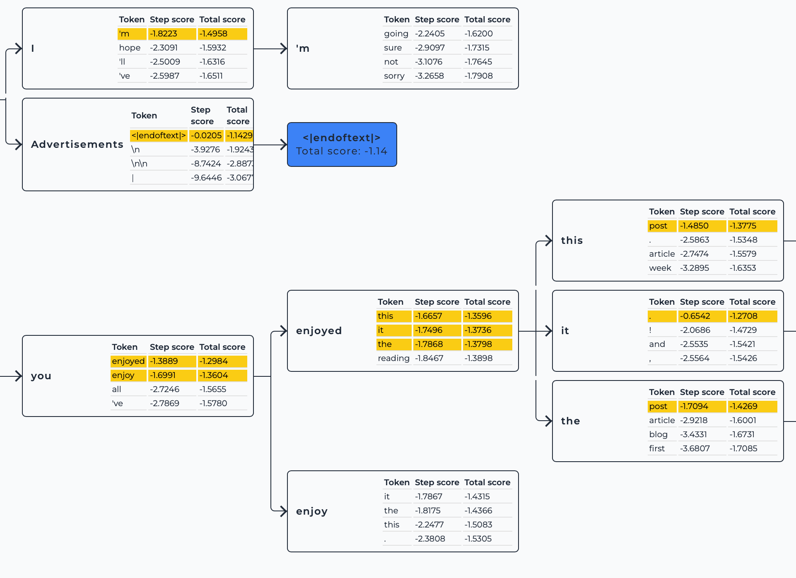

# 深入理解 Beam Search：原理, 示例与代码实现

> 是不是感觉很熟悉？Beam Search 是生成任务中常用的一种方法。在之前的文章 [05](../Guide/06.%20开始实践：部署你的第一个语言模型.md)，[07](../Guide/07.%20探究模型参数与显存的关系以及不同精度造成的影响.md)，[08](../Guide/08.%20尝试微调%20LLM：让它会写唐诗.md) 中，我们都曾经用到过与它相关的参数，而对于早就有着实操经验的同学们，想必见到的更多。这篇文章将从示例到数学原理和代码带你进行理解。
> 
>Beam Search 对应的中文翻译为“集束搜索”或“束搜索”。你可以将其当作是贪心算法的拓展，其实是很简单的概念：贪心算法每次只选择最好的，而 Beam Search 会在多个候选中进行选择。通过这篇文章，你将了解到：
> 
>- **Beam Width（束宽）** 的实际作用，常对应于参数名 `num_beams`。
> - **所有候选序列生成结束标记**的含义，常对应于参数名 `early_stopping`。
> - **Beam Search 的基本原理和工作机制**。
> 
>强烈建议访问：[Beam Search Visualizer](https://huggingface.co/spaces/m-ric/beam_search_visualizer)，这是一个非常 Amazing 的交互式项目，在即将完成这个文章撰写的时候我通过[官方文档](https://huggingface.co/docs/transformers/main/en/generation_strategies#beam-search-decoding)发现了它，让理论与实际搭上了桥，相见恨晚。
> 
>[代码文件下载](../Demos/07.%20Beam%20Search%20示例代码.ipynb)
> 
>在线链接：[Kaggle](https://www.kaggle.com/code/aidemos/07-beam-search) | [Colab](https://colab.research.google.com/drive/1apYBAQ6HNlo4xJDBT0RtUCgmNo_mQVXF?usp=sharing)

## 目录

- [Beam Search 的工作原理](#beam-search-的工作原理)
- [生成示例](#生成示例)
- [怎么处理 `<eos>` ？](#怎么处理-eos-)
- [处理示例图（k=3）](#处理示例图k3)
- [进一步深入 Beam Search](#进一步深入-beam-search)

  - [使用对数概率](#使用对数概率)

  - [参数解释](#参数解释)
- [代码演示](#代码演示)
- [数学描述](#数学描述)
  - [序列概率](#序列概率)
  - [评分函数](#评分函数)
  - [Beam Search 的更新步骤](#beam-search-的更新步骤)
  - [最终选择](#最终选择)
- [实际应用](#实际应用)
  - [代码示例](#代码示例-1)
  - [对比不同束宽的输出](#对比不同束宽的输出-1)
- [推荐阅读](#推荐阅读)

## Beam Search 的工作原理

Beam Search 是一种宽度优先搜索算法，通过保留多个候选序列来探索可能的输出空间，这与贪心算法每次只选择一个当前最优序列不同，可以将贪心算法当成 1 个候选序列下的 Beam Search。

具体来讲，每一步生成时，Beam Search 会保留束宽 $k$ 个最有可能的候选序列（k=1 即贪心），并为每个候选序列计算它们的累积概率或对数概率。在每一步搜索时，Beam Search 会生成所有可能的下一个词汇，并从中选择得分最高的 $k$ 个序列继续下一步。所以，束宽越大，搜索空间越广，计算成本越高。

以下是 Beam Search 的基本步骤：

1. **初始化**：从一个初始序列（通常为空或特殊起始标记）开始，设定束宽 $k$，初始化候选序列集 $B_0 = \{ \text{start} \}$。
2. **迭代生成**：对于当前所有候选序列 $B_{t-1}$，扩展一个新的词汇或符号，生成所有可能的下一个词汇组合，并计算每个**序列**的概率。
3. **选择顶束**：从所有扩展的候选序列中，选择得分最高的 $k$ 个序列，作为下一步的候选序列 $B_t$。
4. **终止条件**：当所有候选序列都生成了结束标记（如 `<eos>`）或达到设定的最大长度 $T$ 时，停止生成。
5. **选择最终序列**：从最终的候选序列集中，选择得分最高的序列作为输出。

**注**：以 GPT 为例，扩展实际对应于去获取 tokens 的概率。

## 生成示例

为了清晰，这里使用累积概率进行得分的计算。

1. **初始化**

    - **束宽** ($k$): 2

    - **当前候选集** ($B_0$): $\{\text{（空）}\}$

    - **词汇表** $\{A, B, C, \text{&lt;eos&gt;}\}$

    - **扩展**（生成所有可能的下一个词汇）：

      | 扩展结果             | 概率           |
      | -------------------- | -------------- |
      | $A$                  | $\textbf{0.4}$ |
      | $B$                  | $\textbf{0.3}$ |
      | $C$                  | $0.2$          |
      | $\text{&lt;eos&gt;}$ | $0.1$          |

    - **选择顶束** ($k=2$):
      
      - $A$ ($0.4$)
      - $B$ ($0.3$)
      
    - **新的候选集** ($B_1$): $\{A (0.4), B (0.3)\}$

2. **扩展 $A$ 和 $B$**

    - **扩展 $A$**：

      - **生成概率**: $\{A: 0.3, B: 0.1, C: 0.4, \text{&lt;eos&gt;}: 0.2\}$

      | 扩展结果              | 概率计算         | 概率            |
      | --------------------- | ---------------- | --------------- |
      | $AA$                  | $0.4 \times 0.3$ | $\textbf{0.12}$ |
      | $AB$                  | $0.4 \times 0.1$ | $0.04$          |
      | $AC$                  | $0.4 \times 0.4$ | $\textbf{0.16}$ |
      | $A\text{&lt;eos&gt;}$ | $0.4 \times 0.2$ | $0.08$          |

    - **扩展 $B$**：

      - **生成概率**: $\{A: 0.1, B: 0.1, C: 0.3, \text{&lt;eos&gt;}: 0.5\}$

      | 扩展结果              | 概率计算         | 概率            |
      | --------------------- | ---------------- | --------------- |
      | $BA$                  | $0.3 \times 0.1$ | $0.03$          |
      | $BB$                  | $0.3 \times 0.1$ | $0.03$          |
      | $BC$                  | $0.3 \times 0.3$ | $\textbf{0.09}$ |
      | $B\text{&lt;eos&gt;}$ | $0.3 \times 0.5$ | $\textbf{0.15}$ |

    - **所有扩展序列及其概率**：

      | 序列                  | 概率            |
      | --------------------- | --------------- |
      | $AC$                  | $\textbf{0.16}$ |
      | $AA$                  | $0.12$          |
      | $B\text{&lt;eos&gt;}$ | $\textbf{0.15}$ |
      | $BC$                  | $0.09$          |
      | $A\text{&lt;eos&gt;}$ | $0.08$          |
      | $AB$                  | $0.04$          |
      | $BA$                  | $0.03$          |
      | $BB$                  | $0.03$          |

    - **选择顶束** ($k=2$):

      - $AC$ ($0.16$)
      - $B\text{&lt;eos&gt;}$ ($0.15$)

    - **新的候选集** ($B_2$): $\{AC (0.16)\}$

    - **完成集合**: ${B\text{&lt;eos&gt;}}$ ($0.15$)

3. **仅扩展 $AC$**

    - **生成概率**: $\{A: 0.1, B: 0.2, C: 0.5, \text{&lt;eos&gt;}: 0.2\}$

    | 扩展结果               | 概率计算          | 概率             |
    | ---------------------- | ----------------- | ---------------- |
    | $ACA$                  | $0.16 \times 0.1$ | $0.016$          |
    | $ACB$                  | $0.16 \times 0.2$ | $\textbf{0.032}$ |
    | $ACC$                  | $0.16 \times 0.5$ | $\textbf{0.080}$ |
    | $AC\text{&lt;eos&gt;}$ | $0.16 \times 0.2$ | $\textbf{0.032}$ |

    - **由于 $B\text{&lt;eos&gt;}$ 已完成**，我们选择扩展结果中的顶束：
      - $ACC$ ($0.080$)
      - 以某种规则选择 $ACB$ 或 $AC\text{&lt;eos&gt;}$ ($0.032$)
    - **新的候选集** ($B_3$): $\{ACC (0.080), ACB (0.032)\}$
    - **完成集合**: ${B\text{&lt;eos&gt;} (0.15)}$

4. 后续步骤

    - **继续扩展**：重复上述过程，直到**所有候选序列**都生成了 `<eos>` 或达到设定的最大长度。


现在是你访问它的最好时机：[Beam Search Visualizer](https://huggingface.co/spaces/m-ric/beam_search_visualizer)

## 怎么处理 `<eos>` ？

在每一步生成过程中，如果某个序列生成了 `<eos>`，则将其标记为完成，不再进行扩展。以下是处理 `<eos>` 的举例：

- **假设在某一步**，序列 $ACB$ 扩展出 $ACB\text{&lt;eos&gt;}$ ($0.032 \times 1 = 0.032$)，则：
  - $ACB\text{&lt;eos&gt;}$ 保留在最终候选集，并不再扩展。
  - Beam Search 继续扩展其他未完成的序列，直到所有序列完成或达到最大长度。

**问题**：**如果有一个序列被标记为完成（生成了 `<eos>`），在下一个扩展步骤中，Beam Search 应该扩展多少个候选序列？**

答：束宽 ($k$) 个，如果被标记完成的序列还保留在候选集中不移出，就是 $k-1$ 个。

### 处理示例图（k=3）

你可以在下图中看到，即便有一个序列生成了 `<eos>`，下一个扩展步骤中还是会扩展 k=3 个候选序列。



## 进一步深入 Beam Search

### 使用对数概率

在实际应用中，尤其是在处理长序列时，直接相乘概率会导致数值下溢问题。为了避免这种情况，通常会使用对数概率来累加评分。

**示例说明**：

假设使用对数概率，序列的评分计算如下：

- 序列 $A$ 的概率为 $0.4$，其对数概率为 $\log(0.4) \approx -0.916$。
- 序列 $AC$ 的概率为 $0.16$，其对数概率为 $\log(0.16) \approx -1.833$。

在 Beam Search 中，我们会选择对数概率较高（即绝对值较小）的序列作为顶束。

### 参数解释

除了 `num_beams` 和 `early_stopping`，Beam Search 通常还涉及其他参数，以下是常见参数的简要解释：

- **`max_length`（最大生成长度）**：限制生成序列的最大长度。
- **`length_penalty`（长度惩罚）**：用于调整生成序列的长度偏好，通常用于平衡生成序列的长度与概率评分。值大于 1 时，会惩罚过长的序列，值小于 1 时，会鼓励生成较长的序列。
- **`no_repeat_ngram_size`**：防止生成序列中出现重复的 n-gram，提高生成内容的多样性。
- **`num_return_sequences`**：指定生成的序列数量，允许一次生成多个不同的候选序列，<= num_beams。

## 代码演示

下面是一个 beam search 演示代码，结果完全对应于之前讨论的示例。为了简单起见，我们进一步假设在序列 `ACB` 和 `ACC` 之后一定是 `<eos>`

```python
import math

def beam_search(initial_sequence, beam_width, max_length, vocab, get_next_probs):
    beam = [(initial_sequence, 0.0)]  # (sequence, log_prob)
    completed = []

    for step in range(max_length):
        print(f"\n第 {step + 1} 步:")
        all_candidates = []
        for seq, score in beam:
            if seq.endswith('<eos>'):
                completed.append((seq, score))
                print(f"已完成序列: {seq}，得分为 {score}")
                continue
            next_probs = get_next_probs(seq)
            print(f"扩展序列: {seq}，当前得分为 {score}")
            for token, prob in next_probs.items():
                new_seq = seq + token
                new_score = score + math.log(prob)
                all_candidates.append((new_seq, new_score))
                print(f"  候选序列: {new_seq}，得分为 {new_score}")
        
        # 对所有候选序列按得分降序排列，选择得分最高的 beam_width 个序列
        all_candidates.sort(key=lambda x: x[1], reverse=True)
        beam = all_candidates[:beam_width]

        # 打印选出的顶束序列
        print(f"\n选择的 {beam_width} 个顶束序列:")
        for seq, score in beam:
            print(f"  {seq}，得分为 {score}")
        
        # 如果没有更多序列可以扩展，则退出循环
        if not beam:
            break

    # 将当前 beam 中剩下的序列加入完成序列中
    completed += beam

    # 对完成的序列按得分降序排列，选择得分最高的序列
    completed.sort(key=lambda x: x[1], reverse=True)
    
    print("\n已完成的所有序列:")
    for seq, score in completed:
        print(f"  {seq}，得分为 {score}")
    
    return completed[0][0]

# 我们之前示例中设置的概率
def get_next_probs(seq):
    probs = {
        "": {"A": 0.4, "B": 0.3, "C": 0.2, "<eos>": 0.1},
        "A": {"A": 0.3, "B": 0.1, "C": 0.4, "<eos>": 0.2},
        "B": {"A": 0.1, "B": 0.1, "C": 0.3, "<eos>": 0.5},
        "AC": {"A": 0.1, "B": 0.2, "C": 0.5, "<eos>": 0.2},
    }
    return probs.get(seq, {"<eos>": 1.0})

initial_sequence = ""
beam_width = 2 # 你可以修改这个参数来感受区别
max_length = 5
vocab = {"A", "B", "C", "<eos>"}

best_sequence = beam_search(initial_sequence, beam_width, max_length, vocab, get_next_probs)
print("\n最佳序列:", best_sequence)
```

输出：

```bash
第 1 步:
扩展序列: ，当前得分为 0.0
  候选序列: A，得分为 -0.916290731874155
  候选序列: B，得分为 -1.2039728043259361
  候选序列: C，得分为 -1.6094379124341003
  候选序列: <eos>，得分为 -2.3025850929940455

选择的 2 个顶束序列:
  A，得分为 -0.916290731874155
  B，得分为 -1.2039728043259361

第 2 步:
扩展序列: A，当前得分为 -0.916290731874155
  候选序列: AA，得分为 -2.120263536200091
  候选序列: AB，得分为 -3.2188758248682006
  候选序列: AC，得分为 -1.83258146374831
  候选序列: A<eos>，得分为 -2.525728644308255
扩展序列: B，当前得分为 -1.2039728043259361
  候选序列: BA，得分为 -3.506557897319982
  候选序列: BB，得分为 -3.506557897319982
  候选序列: BC，得分为 -2.4079456086518722
  候选序列: B<eos>，得分为 -1.8971199848858813

选择的 2 个顶束序列:
  AC，得分为 -1.83258146374831
  B<eos>，得分为 -1.8971199848858813

第 3 步:
扩展序列: AC，当前得分为 -1.83258146374831
  候选序列: ACA，得分为 -4.135166556742355
  候选序列: ACB，得分为 -3.4420193761824103
  候选序列: ACC，得分为 -2.525728644308255
  候选序列: AC<eos>，得分为 -3.4420193761824103
已完成序列: B<eos>，得分为 -1.8971199848858813

选择的 2 个顶束序列:
  ACC，得分为 -2.525728644308255
  ACB，得分为 -3.4420193761824103

第 4 步:
扩展序列: ACC，当前得分为 -2.525728644308255
  候选序列: ACC<eos>，得分为 -2.525728644308255
扩展序列: ACB，当前得分为 -3.4420193761824103
  候选序列: ACB<eos>，得分为 -3.4420193761824103

选择的 2 个顶束序列:
  ACC<eos>，得分为 -2.525728644308255
  ACB<eos>，得分为 -3.4420193761824103

第 5 步:
已完成序列: ACC<eos>，得分为 -2.525728644308255
已完成序列: ACB<eos>，得分为 -3.4420193761824103

选择的 2 个顶束序列:

已完成的所有序列:
  B<eos>，得分为 -1.8971199848858813
  ACC<eos>，得分为 -2.525728644308255
  ACB<eos>，得分为 -3.4420193761824103

最佳序列: B<eos>
```

## 数学描述

### 序列概率

假设我们要生成一个长度为 $T$ 的序列 $Y = (y_1, y_2, \dots, y_T)$，该序列的生成是逐步进行的，即每个词汇 $y_t$ 的生成依赖于前面已经生成的词汇 $y_1, y_2, \dots, y_{t-1}$。因此，序列 $Y$ 的联合概率为：

$$
P(Y) = \prod_{t=1}^{T} P(y_t | y_1, y_2, \dots, y_{t-1})
$$

### 评分函数

由于直接计算概率乘积在处理长序列时容易导致**数值下溢**问题，所以通过取对数来稳定数值并简化计算。取对数后的评分函数（log likelihood）为：

$$
S(Y) = \log P(Y) = \sum_{t=1}^{T} \log P(y_t | y_1, y_2, \dots, y_{t-1})
$$

模型的目标是最大化序列的概率：

$$
Y^* = \arg\max_Y P(Y)
$$

### Beam Search 的更新步骤

在每一步 $t$，Beam Search 保留束宽 $k$ 个最有可能的部分序列。设候选序列集为 $B_{t-1} = \{Y_1, Y_2, \dots, Y_k\}$，每个部分序列 $Y_i$ 的概率为 $P(Y_i)$。

1. **扩展**：对于每个候选序列 $Y_i \in B_{t-1}$，从词汇表 $V$ 中扩展所有可能的下一个词汇 $y$，生成新的序列 $Y_i y$（即在 $Y_i$ 的末尾添加词汇 $y$），并计算其概率:

$$
P(Y_i y) = P(Y_i) \times P(y | Y_i)
$$

同时取对数后得到评分函数的更新:

$$
S(Y_i y) = \log P(Y_i y) =  S(Y_i) + \log P(y | Y_i)
$$

2. **选择顶束**：在每一步中，我们从所有扩展后的候选序列 $\{Y_i y \mid Y_i \in B_{t-1}, y \in V\}$ 中选择得分最高的 $k$ 个序列，组成新的候选集 $B_t$:

$$
B_t = \arg\max_{B' \subseteq \{Y_i y \mid Y_i \in B_{t-1}, y \in V\}, |B'| = k} \sum_{Y' \in B'} S(Y')
$$

### 最终选择

当生成过程结束时，从最终的候选集 $B_T$ 中，选择得分最高的序列作为最终输出:

$$
Y^* = \arg\max_{Y \in B_T} S(Y)
$$

## 实际应用

先安装一些演示用到的库：

```bash
pip install transformers
#pip install torch torchvision torchaudio --index-url https://download.pytorch.org/whl/cu118
```

### 代码示例

使用 Hugging Face Transformers 库的简单示例：

```python
from transformers import AutoTokenizer, AutoModelForCausalLM
import torch

# 指定模型名称
model_name = "distilgpt2"

# 加载分词器和模型
tokenizer = AutoTokenizer.from_pretrained(model_name)
model = AutoModelForCausalLM.from_pretrained(model_name)

# 设置 pad_token 为 eos_token
tokenizer.pad_token = tokenizer.eos_token

# 移动模型到设备
device = torch.device("cuda" if torch.cuda.is_available() else "cpu")
model.to(device)

# 设置模型为评估模式
model.eval()

# 输入文本
input_text = "Hello GPT"

# 编码输入文本，同时返回 attention_mask
inputs = tokenizer.encode_plus(input_text, return_tensors="pt", padding=True).to(device)

# 生成文本，使用 Beam Search
beam_width = 5
with torch.no_grad():
    outputs = model.generate(
        inputs["input_ids"],
        attention_mask=inputs["attention_mask"],
        max_length=50,
        num_beams=beam_width,  # 你可以看到 beam_width 对应的参数名为 num_beams
        no_repeat_ngram_size=2,
        early_stopping=True,  # 当所有候选序列生成<eos>停止
        pad_token_id=tokenizer.eos_token_id
    )

# 解码生成的文本
generated_text = tokenizer.decode(outputs[0], skip_special_tokens=True)
print("生成的文本：")
print(generated_text)

```

**输出**：

```
生成的文本：
Hello GPT.

This article was originally published on The Conversation. Read the original article.
```

### 对比不同束宽的输出

```python
# 输入文本
input_text = "Hello GPT"

# 编码输入文本，同时返回 attention_mask
inputs = tokenizer.encode_plus(input_text, return_tensors="pt", padding=True).to(device)

# 设置束宽不同的生成策略
beam_widths = [1, 3, 5]  # 使用不同的束宽

# 生成并打印结果
for beam_width in beam_widths:
    with torch.no_grad():
        outputs = model.generate(
            inputs["input_ids"],
            attention_mask=inputs["attention_mask"],
            max_length=50,
            num_beams=beam_width,
            no_repeat_ngram_size=2,
            early_stopping=True,
            pad_token_id=tokenizer.eos_token_id
        )
    generated_text = tokenizer.decode(outputs[0], skip_special_tokens=True)
    print(f"束宽 {beam_width} 的生成结果：")
    print(generated_text)
    print('-' * 50)

```

```
束宽 1 的生成结果：
Hello GPT is a free and open source software project that aims to provide a platform for developers to build and use GPGP-based GPSP based GPCs. GPP is an open-source software development platform that is designed to
--------------------------------------------------
束宽 3 的生成结果：
Hello GPT.

This article is part of a series of articles on the topic, and will be updated as more information becomes available.
--------------------------------------------------
束宽 5 的生成结果：
Hello GPT.

This article was originally published on The Conversation. Read the original article.
--------------------------------------------------
```

## 推荐阅读

- [Beam-search decoding](https://huggingface.co/docs/transformers/main/en/generation_strategies#beam-search-decoding)
- [Beam Search Visualizer](https://huggingface.co/spaces/m-ric/beam_search_visualizer)

