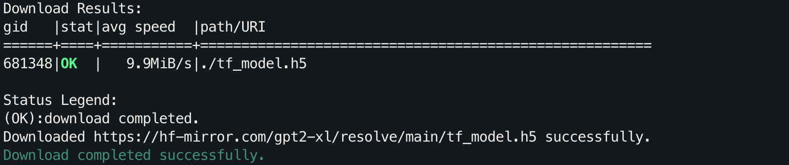
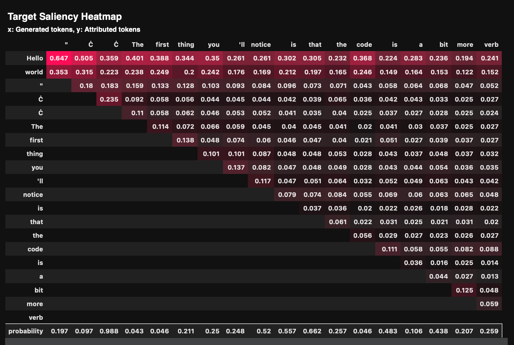
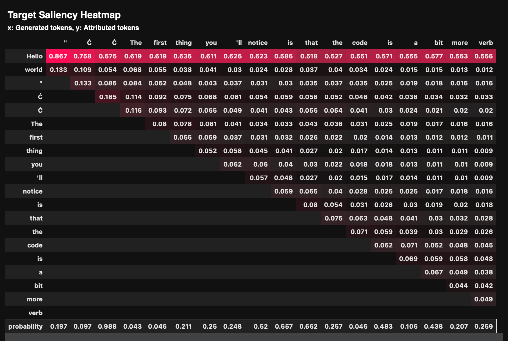

# Inseq 特征归因：可视化解释 LLM 的输出

> **Feature Attribution（特征归因）**：你可以将其当做对模型输出的解释，就像在图像分类中可视化模型关注的区域一样。
>
> 本文将介绍 **Inseq**，这是一个用于解释和可视化序列生成模型输出的工具。我们将通过翻译任务（关注整个序列）和文本生成任务（关注前面的词）来演示如何使用 Inseq 来了解输入文本的哪些部分对模型生成下一个单词的影响最大。
>
> 这篇文章也为[生成式人工智能导论](https://speech.ee.ntu.edu.tw/~hylee/genai/2024-spring.php)课程中 [HW7: Understand what Generative AI is thinking](https://colab.research.google.com/drive/1Xnz0GHC0yWO2Do0aAYBCq9zL45lbiRjM?usp=sharing#scrollTo=UFOUfh2k1jFN) 提供中文引导。
>
> [代码文件下载](../Demos/10.%20Inseq：可视化解释%20LLM%20的输出.ipynb) | [作业PDF](../GenAI_PDF/HW7.pdf)
>
> 在线链接：[Kaggle](https://www.kaggle.com/code/aidemos/10-inseq-llm) | [Colab](https://colab.research.google.com/drive/1bWqGtRaG3aO7Vo149wIPHaz_XKnbJqlE?usp=sharing)

## 目录

- [安装和导入一些必要的库](#安装和导入一些必要的库)
- [可视化翻译任务](#可视化翻译任务)
  - [下载中译英模型](#下载中译英模型)
  - [进行特征归因](#进行特征归因)
- [可视化文本生成任务](#可视化文本生成任务)
  - [下载 GPT-2 XL 模型](#下载-gpt-2-xl-模型)
  - [加载模型](#加载模型)
  - [进行特征归因](#进行特征归因)
- [参考资料](#参考资料)

## 安装和导入一些必要的库

```bash
pip install inseq
pip install transformers
pip install bitsandbytes
pip install accelerate
pip install sacremoses
```

## 可视化翻译任务

### 下载中译英模型

为了加快模型下载速度，我们可以使用多线程下载。如果直接运行以下命令报错，可以参考[使用 HFD 加快 Hugging Face 模型和数据集的下载](../Guide/a.%20使用%20HFD%20加快%20Hugging%20Face%20模型和数据集的下载.md)进行前置安装。

首先，下载 `hfd.sh` 脚本并赋予执行权限：

```bash
wget https://hf-mirror.com/hfd/hfd.sh
chmod a+x hfd.sh
```

然后，多线程下载模型：

```bash
export HF_ENDPOINT=https://hf-mirror.com
./hfd.sh 'Helsinki-NLP/opus-mt-zh-en' --tool aria2c -x 16
```


### 进行特征归因

```python
import inseq

# 定义要使用的归因方法列表
attribution_methods = ['saliency', 'attention']

for method in attribution_methods:
    print(f"======= 归因方法: {method} =======")
    # 加载中译英模型并设置归因方法
    # model = inseq.load_model("Helsinki-NLP/opus-mt-zh-en", method)
    model = inseq.load_model("opus-mt-zh-en", method)  # 导入之前下载到本地的模型

    # 使用指定的归因方法对输入文本进行归因
    attribution_result = model.attribute(
        input_texts="我喜歡機器學習和人工智慧。",
    )

    # 从tokenizer中去除 '▁' 前缀以避免混淆（可以忽略这段代码）
    for attr in attribution_result.sequence_attributions:
        for item in attr.source:
            item.token = item.token.replace('▁', '')
        for item in attr.target:
            item.token = item.token.replace('▁', '')

    # 显示归因结果
    attribution_result.show()
```

**输出：**

1. **Saliency** 方法
   通过计算输入对输出的梯度，衡量输入 token 对生成输出的影响程度。你可以看到生成的每个输出 token 是如何受到输入 token 的影响的，比如： `I` `like` 受 `我喜欢` 的影响最大。
   

2. **Attention** 方法
   利用模型的注意力机制来进行解释，展示输入和输出 token 之间的注意力权重。

   

## 可视化文本生成任务

### 下载 GPT-2 XL 模型

同样地，我们使用多线程方法下载 GPT-2 XL 模型，如果只是为了查看的话，可以换成 GPT-2 下载，因为 GPT-2 XL 下载完需要占用 30G：

```bash
export HF_ENDPOINT=https://hf-mirror.com
./hfd.sh 'gpt2-xl' --tool aria2c -x 16
#./hfd.sh 'gpt2' --tool aria2c -x 16
```



### 加载模型

```python
from transformers import AutoModelForCausalLM, BitsAndBytesConfig

# 创建一个 BitsAndBytesConfig 对象，用于配置量化选项
bnb_config = BitsAndBytesConfig(load_in_8bit=True)
model = AutoModelForCausalLM.from_pretrained(
    "gpt2-xl",  # gpt2
    quantization_config=bnb_config,
    device_map={"": 0}
)
```

### 进行特征归因

```python
import inseq

# 定义要使用的归因方法列表
attribution_methods = ['saliency', 'attention']

for method in attribution_methods:
    print(f"======= 归因方法: {method} =======")
    # 使用指定的归因方法加载模型
    inseq_model = inseq.load_model(model, method)

    # 对输入文本进行归因分析
    attribution_result = inseq_model.attribute(
        input_texts="Hello world",
        step_scores=["probability"],
    )

    # 清理 tokenizer 中的特殊字符（可选）
    for attr in attribution_result.sequence_attributions:
        for item in attr.source:
            item.token = item.token.replace('Ġ', '')
        for item in attr.target:
            item.token = item.token.replace('Ġ', '')

    # 显示归因结果
    attribution_result.show()
```

**输出：**

1. **Saliency** 方法
   

2. **Attention** 方法
   

## 参考资料

- [Inseq 官方文档](https://inseq.readthedocs.io/)