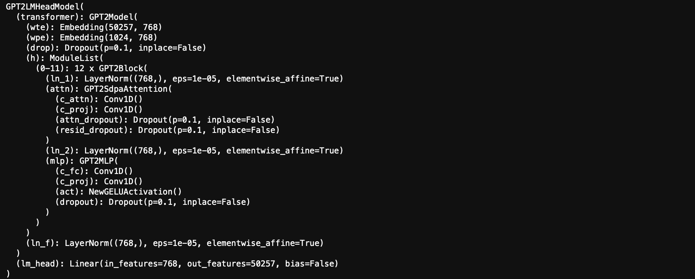
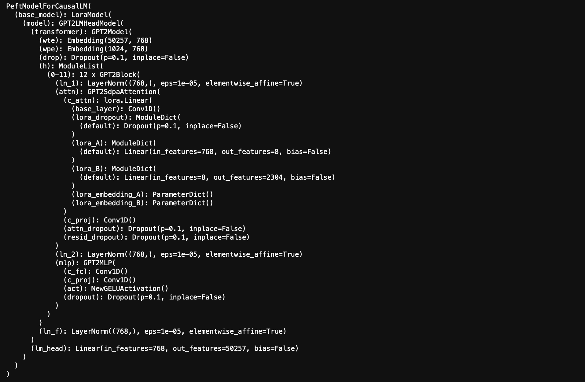
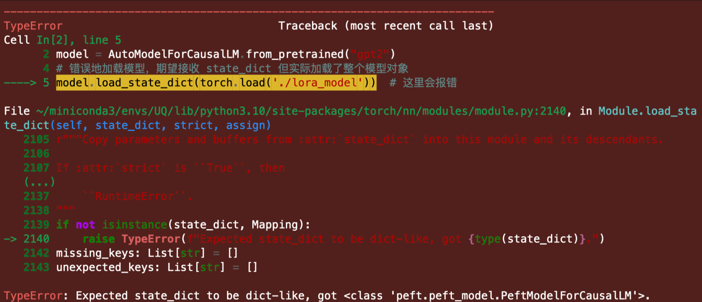

# PEFT：在大模型中快速应用 LoRA

>如果对 LoRA 还没有一个直观的概念，可以回看这篇文章：[《03. 认识 LoRA：从线性层到注意力机制》](../Guide/03.%20进阶指南：自定义%20Prompt%20提升大模型解题能力.md)。
>
>我们将在这里进一步探讨**如何快速地在大型预训练模型中应用 LoRA**，并解答可能存在的问题，包括：
>
>- `peft` 和 `lora` 之间有什么关系？
>- `get_peft_model` 怎么使用？
>- 如何知道应用 LoRA 后模型的参数变化量？
>- 如何使用 `merge_and_unload()` 合并 LoRA 权重？
>- 认识报错：`TypeError: Expected state_dict to be dict-like...`
>- 认知一个非常刁钻的 Bug：应用 LoRA 前使用 `get_peft_model()`。
>
>[代码文件下载](../Demos/12.%20应用%20LoRA%20到大模型的简单示例（PEFT）.ipynb)
>
>在线链接：[Kaggle](https://www.kaggle.com/code/aidemos/12-lora-peft) | [Colab](https://colab.research.google.com/drive/1-gWfn9xslSq6WlYDS9cinnyDEhBhjte4?usp=sharing)

## 目录

- [PEFT 和 LoRA 的关系](#peft-和-lora-的关系)
- [在大模型中应用 LoRA](#在大模型中应用-lora)
  - [安装必要的库](#安装必要的库)
  - [加载预训练模型](#加载预训练模型)
  - [应用 LoRA](#应用-lora)
  - [查看当前模型架构](#查看当前模型架构)
  - [查看增加的参数量](#查看增加的参数量)
     - [理论计算](#理论计算)
     - [使用 PEFT 查看参数](#使用-peft-查看参数)
     - [自定义函数查看参数](#自定义函数查看参数)
  - [准备数据并进行微调](#准备数据并进行微调)
  - [保存和加载 LoRA 微调的模型](#保存和加载-lora-微调的模型)
     - [合并 LoRA 权重并卸载 PEFT 包装](#合并-lora-权重并卸载-peft-包装)
- [可能的错误及解决方案（TypeError: Expected state_dict to be dict-like...）](#可能的错误及解决方案typeerror-expected-state_dict-to-be-dict-like)
  - [错误原因](#错误原因)
  - [错误重现](#错误重现)
  - [解决方法](#解决方法)
- [一个导致微调看似无效的 Bug：应用 LoRA 前使用 get_peft_model()](#一个导致微调看似无效的-bug应用-lora-前使用-get_peft_model)
- [参考链接](#参考链接)

## PEFT 和 LoRA 的关系

PEFT（Parameter-Efficient Fine-Tuning）是 Hugging Face 提供的专门用于参数高效微调的工具库。LoRA（Low-Rank Adaptation）是 PEFT 支持的多种微调方法之一，旨在通过减少可训练参数来提高微调大模型的效率。除此之外，PEFT 还支持其他几种常见的微调方法，包括：

- **Prefix-Tuning**：冻结原模型参数，为每一层添加可学习的前缀向量，只学习前缀参数。
- **Adapter-Tuning**：冻结原模型参数，在模型的层与层之间插入小型的 adapter 模块，仅对 adapter 模块进行训练。
- ...

## 在大模型中应用 LoRA

下面，我们以实际的例子来展示如何在大模型中快速应用 LoRA。

### 安装必要的库

首先，确保你已经安装了 `transformers` 和 `peft` 库。

```bash
pip install transformers peft
```

### 加载预训练模型

我们以 Hugging Face 的 `transformers` 库为例，加载一个预训练的 GPT-2 模型，其参数大小为 110M。

```python
from transformers import AutoTokenizer, AutoModelForCausalLM

# 加载预训练的 GPT-2 模型和分词器
tokenizer = AutoTokenizer.from_pretrained('gpt2')
model = AutoModelForCausalLM.from_pretrained('gpt2')

print(model)
```

打印 model，方便和应用 LoRA 后进行对比。



### 应用 LoRA

使用 `peft` 库，我们可以轻松地将 LoRA 集成到模型中：

```python
from peft import get_peft_model, LoraConfig, TaskType

# 配置 LoRA
lora_config = LoraConfig(
    task_type=TaskType.CAUSAL_LM,  # 任务类型：因果语言模型
    inference_mode=False,          # 推理模式关闭，以进行训练
    r=8,                           # 低秩值 r
    lora_alpha=32,                 # LoRA 的缩放因子
    lora_dropout=0.1,              # Dropout 概率
)

# 将 LoRA 应用到模型中
model = get_peft_model(model, lora_config)
```

### 查看当前模型架构

```python
print(model)
```

可以看到 LoRA 已经成功应用。



### 查看增加的参数量

应用 LoRA 后，或许你希望了解模型参数量的变化。以下是理论计算和查看方式：

#### 理论计算

对于每个应用了 LoRA 的层，增加的参数量为：

$$
\text{增加的参数量} = r \times (\text{输入维度} + \text{输出维度})
$$

- **`r`**：LoRA 的低秩值。
- **输入维度**：层的输入特征数。
- **输出维度**：层的输出特征数。

#### 使用 PEFT 查看参数

`peft` 提供了查看模型参数的便捷方法：

```python
# 查看 LoRA 模块
model.print_trainable_parameters()
```

输出：

```python
trainable params: 294,912 || all params: 124,734,720 || trainable%: 0.23643136409814364
```

#### 自定义函数查看参数

实际上直接计算所有可训练参数就行。

```python
def print_trainable_parameters(model):
    trainable_params = 0
    all_params = 0
    for _, param in model.named_parameters():
        num_params = param.numel()
        all_params += num_params
        if param.requires_grad:
            trainable_params += num_params
    print(f"可训练参数量: {trainable_params}")
    print(f"总参数量: {all_params}")
    print(f"可训练参数占比: {100 * trainable_params / all_params:.2f}%")
    
print_trainable_parameters(model)
```

输出：

```python
可训练参数量: 294912
总参数量: 124734720
可训练参数占比: 0.24%
```

### 准备数据并进行微调

假设你已经有了训练数据集 `train_dataset`，下面是一个简单的样例代码。

```python
from transformers import Trainer, TrainingArguments

# 定义训练参数
training_args = TrainingArguments(
    output_dir='./results',         # 模型保存和日志输出的目录路径
    num_train_epochs=3,             # 训练的总轮数（epochs）
    per_device_train_batch_size=16, # 每个设备（如GPU或CPU）上的训练批次大小，16表示每次输入模型的数据数量
    learning_rate=5e-5,             # 学习率
    logging_steps=10,               # 每隔多少步（steps）进行一次日志记录
    save_steps=100,                 # 每隔多少步保存模型
)

# 创建 Trainer
trainer = Trainer(
    model=model,                    # 训练的模型对象，需要事先加载好
    args=training_args,             # 上面定义的训练参数配置
    train_dataset=train_dataset,    # 需要对应替换成已经处理过的dataset
)

# 开始训练
trainer.train()
```

### 保存和加载 LoRA 微调的模型

训练完成后，你可以保存或者加载 LoRA 微调的参数，下面是个简单的示例。

```python
# 保存 LoRA 参数
model.save_pretrained('./lora_model')
```

在推理时，加载原始的预训练模型和 LoRA 参数。

```python
# 加载原始模型
base_model = AutoModelForCausalLM.from_pretrained("gpt2")

# 加载 LoRA 参数
from peft import PeftModel

model = PeftModel.from_pretrained(base_model, './lora_model')
```

#### 合并 LoRA 权重并卸载 PEFT 包装

在完成微调后，可以使用 `merge_and_unload()` 将 LoRA 的权重合并回原始模型。这在部署和推理阶段非常有用，因为这样可以：

- **减少依赖**：合并后，模型成为标准的 `transformers` 模型，不再需要 `peft` 库。
- **提高推理效率**：减少了额外的计算开销，推理速度可能会有所提升。
- **简化模型保存和加载**：不需要分别保存基础模型和 LoRA 参数。

运行下面的代码：

```python
# 对比合并前后的模型
print("合并前的模型结构：")
print(model)

# 合并并卸载 LoRA 权重
model = model.merge_and_unload()

print("合并后的模型结构：")
print(model)
```

输出：

```
合并前的模型结构：
PeftModelForCausalLM(
  (base_model): LoraModel(
    (model): GPT2LMHeadModel(
      (transformer): GPT2Model(
        (wte): Embedding(50257, 768)
        (wpe): Embedding(1024, 768)
        (drop): Dropout(p=0.1, inplace=False)
        (h): ModuleList(
          (0-11): 12 x GPT2Block(
            (ln_1): LayerNorm((768,), eps=1e-05, elementwise_affine=True)
            (attn): GPT2Attention(
              (c_attn): lora.Linear(
                (base_layer): Conv1D()
                (lora_dropout): ModuleDict(
                  (default): Dropout(p=0.1, inplace=False)
                )
                (lora_A): ModuleDict(
                  (default): Linear(in_features=768, out_features=8, bias=False)
                )
                (lora_B): ModuleDict(
                  (default): Linear(in_features=8, out_features=2304, bias=False)
                )
                (lora_embedding_A): ParameterDict()
                (lora_embedding_B): ParameterDict()
              )
              (c_proj): Conv1D()
              (attn_dropout): Dropout(p=0.1, inplace=False)
              (resid_dropout): Dropout(p=0.1, inplace=False)
            )
            (ln_2): LayerNorm((768,), eps=1e-05, elementwise_affine=True)
            (mlp): GPT2MLP(
              (c_fc): Conv1D()
              (c_proj): Conv1D()
              (act): NewGELUActivation()
              (dropout): Dropout(p=0.1, inplace=False)
            )
          )
        )
        (ln_f): LayerNorm((768,), eps=1e-05, elementwise_affine=True)
      )
      (lm_head): Linear(in_features=768, out_features=50257, bias=False)
    )
  )
)
合并后的模型结构：
GPT2LMHeadModel(
  (transformer): GPT2Model(
    (wte): Embedding(50257, 768)
    (wpe): Embedding(1024, 768)
    (drop): Dropout(p=0.1, inplace=False)
    (h): ModuleList(
      (0-11): 12 x GPT2Block(
        (ln_1): LayerNorm((768,), eps=1e-05, elementwise_affine=True)
        (attn): GPT2Attention(
          (c_attn): Conv1D()
          (c_proj): Conv1D()
          (attn_dropout): Dropout(p=0.1, inplace=False)
          (resid_dropout): Dropout(p=0.1, inplace=False)
        )
        (ln_2): LayerNorm((768,), eps=1e-05, elementwise_affine=True)
        (mlp): GPT2MLP(
          (c_fc): Conv1D()
          (c_proj): Conv1D()
          (act): NewGELUActivation()
          (dropout): Dropout(p=0.1, inplace=False)
        )
      )
    )
    (ln_f): LayerNorm((768,), eps=1e-05, elementwise_affine=True)
  )
  (lm_head): Linear(in_features=768, out_features=50257, bias=False)
)
```

你应该注意到，合并后模型的 LoRA 层将被去除。

现在，你可以像保存普通模型一样保存：

```python
# 保存合并后的模型
model.save_pretrained('./merged_model')
tokenizer.save_pretrained('./merged_model')
```

在推理阶段，直接加载这个合并后的模型：

```python
from transformers import AutoModelForCausalLM, AutoTokenizer

# 加载合并后的模型
tokenizer = AutoTokenizer.from_pretrained('./merged_model')
model = AutoModelForCausalLM.from_pretrained('./merged_model')

# 进行推理
inputs = tokenizer("Hello, World！", return_tensors="pt")
outputs = model.generate(**inputs)
print(tokenizer.decode(outputs[0], skip_special_tokens=True))
```

**注意**：

- **不可逆操作**：合并操作是不可逆的。如果你之后还需要进一步微调 LoRA 参数，需确保在合并前备份模型。
- **无需 PEFT 库**：合并后的模型不再包含 LoRA 适配器（Adapter）的信息，因此在加载时无需使用 `PeftModel`。

## 可能的错误及解决方案（TypeError: Expected state_dict to be dict-like...）

在使用 `PEFT` 和 `LoRA` 进行模型微调和保存加载时，可能会遇到如下错误：

```
TypeError: Expected state_dict to be dict-like, got <class 'peft.peft_model.PeftModel'>.
```

### 错误原因

一般是因为混合使用不同的保存和加载方式，这个错误不局限于 `PeftModel`，问题出在你用 `torch.save(model)` 保存整个模型却用 `load_state_dict()` 去加载，注意模型加载和保存的一致性。

### 错误重现

下面我们来复现它，看是不是和你的操作一致（这里以 `PeftModel` 举例）：

1. 错误地保存整个 `PeftModel` 对象而不是其 `state_dict`：

   ```python
   import torch
   from transformers import AutoTokenizer, AutoModelForCausalLM
   from peft import get_peft_model, LoraConfig, TaskType
   
   # 加载预训练模型和分词器
   tokenizer = AutoTokenizer.from_pretrained('gpt2')
   model = AutoModelForCausalLM.from_pretrained('gpt2')
   
   # 配置 LoRA
   lora_config = LoraConfig(
       task_type=TaskType.CAUSAL_LM,
       inference_mode=False,
       r=8,
       lora_alpha=32,
       lora_dropout=0.1,
   )
   
   # 应用 LoRA
   model = get_peft_model(model, lora_config)
   
   # 错误地保存整个 PeftModel 对象
   torch.save(model, './model')

2. 加载时传入`PeftModel` 对象：

   ```python
   # 初始化模型
   model = AutoModelForCausalLM.from_pretrained("gpt2")
   
   # 错误地加载模型，期望接收 state_dict 但实际加载了整个模型对象
   model.load_state_dict(torch.load('./model'))  # 这里会报错
   ```

   

### 解决方法

确保你保存和加载的对象是一致的：

- `torch.save(model, '...')` 对应于 `torch.load(model, '...')`。
- `torch.save(model.state_dict(), '...')` 对应于 `model.load_state_dict(torch.load('...'))`

## 一个导致微调看似无效的 Bug：应用 LoRA 前使用 `get_peft_model()`

我花了三个小时排除了所有可能的问题才找到它，起因：将代码从 load stata_dict 转为 PEFT 以供学习。

```python
# 原始项目代码（正确）：
# 将 LoRA 配置应用到 text_encoder 和 unet
text_encoder = get_peft_model(text_encoder, lora_config)
unet = get_peft_model(unet, lora_config)

# 如果设置为继续训练，则加载上一次的模型权重，当然，你可以修改 model_path 来指定其他的路径
if resume:
    # 加载上次训练的模型权重，注意这里只加载权重，而不是覆盖整个模型，覆盖：model = torch.load(...)
    text_encoder = torch.load(os.path.join(model_path, "text_encoder.pt"))
    unet = torch.load(os.path.join(model_path, "unet.pt"))
```

转换为 PEFT 形式：

```python
# 错误的示范
# 将 LoRA 配置应用到 text_encoder 和 unet
text_encoder = get_peft_model(text_encoder, lora_config)
unet = get_peft_model(unet, lora_config)

# 如果设置为继续训练，则加载上一次的模型权重
if resume:
    # 使用 PEFT 的 from_pretrained 方法加载 LoRA 模型
    text_encoder = PeftModel.from_pretrained(text_encoder, os.path.join(model_path, "text_encoder"))
    unet = PeftModel.from_pretrained(unet, os.path.join(model_path, "unet"))
```

很好，现在我们获得了一个不会报错，但是效果和没加 LoRA **完全相同**的模型，真是太棒了（它真的太刁钻了😡）。

来看看它究竟有什么区别，为了清晰，定义一个简单的线性层进行演示：

```python
import torch
import torch.nn as nn
from torch.optim import Adam
from copy import deepcopy
from peft import get_peft_model, LoraConfig, PeftModel

# 固定随机数种子，确保结果可复现
torch.manual_seed(42)

# 定义一个简单的线性模型
class LinearModel(nn.Module):
    def __init__(self, input_size, output_size):
        super(LinearModel, self).__init__()
        self.linear = nn.Linear(input_size, output_size)

    def forward(self, x):
        return self.linear(x)

# 实例化线性模型
model = LinearModel(input_size=10, output_size=1)

# 在应用 LoRA 之前深拷贝原始模型，确保后续公平比较
original_model = deepcopy(model)

# 配置 LoRA 参数
config = LoraConfig(
    inference_mode=False,
    r=4,
    lora_alpha=16,
    target_modules=['linear'],
)

# 将 LoRA 应用到模型中
lora_model = get_peft_model(model, config)

# 定义一个简单的损失函数和优化器
criterion = nn.MSELoss()
optimizer = Adam(lora_model.parameters(), lr=1e-3)

# 生成一些模拟的训练数据
input_data = torch.randn(100, 10)  # 100 个样本，每个样本有 10 个特征
target_data = torch.randn(100, 1)  # 对应的目标值

# 训练一个回合
lora_model.train()
for epoch in range(1):  # 训练 1 个回合
    optimizer.zero_grad()
    outputs = lora_model(input_data)
    loss = criterion(outputs, target_data)
    loss.backward()
    optimizer.step()

# 训练后保存 LoRA 权重
lora_model.save_pretrained('linear_lora_model')

# 方法 1：先使用 get_peft_model，再加载 LoRA 权重
model1 = PeftModel.from_pretrained(get_peft_model(deepcopy(original_model), config), 'linear_lora_model')

# 方法 2：直接加载 LoRA 权重
model2 = PeftModel.from_pretrained(deepcopy(original_model), 'linear_lora_model')

# 生成相同的输入数据以进行输出比较
test_input = torch.randn(1, 10)

# 比较四个模型的输出（原始模型，LoRA，方法1，方法2）
def compare_model_outputs(input_data):
    # 原始模型
    original_output = original_model(input_data)
    print("原始模型输出:", original_output.detach().numpy())

    # 训练后的 LoRA 模型
    lora_output = lora_model(input_data)
    print("训练后的 LoRA 模型输出:", lora_output.detach().numpy())

    # 方法 1：先使用 get_peft_model，再加载 LoRA
    output1 = model1(input_data)
    print("方法 1（先使用 get_peft_model，再加载 LoRA）输出:", output1.detach().numpy())

    # 方法 2：直接加载 LoRA
    output2 = model2(input_data)
    print("方法 2（直接加载 LoRA）输出:", output2.detach().numpy())

    if torch.allclose(original_output, output1):
        print("\n原始模型和方法 1 输出相同。")
    if torch.allclose(lora_output, output2):
        print("训练后的 LoRA 模型和方法 2 输出相同。\n")

# 比较两个模型的参数
def compare_params(m1, m2):
    for (n1, p1), (n2, p2) in zip(m1.named_parameters(), m2.named_parameters()):
        if n1 != n2 or not torch.allclose(p1, p2):
            print(f"参数不匹配: \n{n1}\n{n2}")
            return False
    return True

# 比较四个模型的输出
compare_model_outputs(test_input)

# 检查方法 1 和方法 2 的参数是否一致
if compare_params(model1, model2):
    print("方法 1 和方法 2 的 LoRA 模型参数一致！")
else:
    print("方法 1 和方法 2 的 LoRA 模型参数不一致！")
```

输出：

```python
原始模型输出: [[-0.03600371]]
训练后的 LoRA 模型输出: [[-0.03428639]]
方法 1（先使用 get_peft_model，再加载 LoRA）输出: [[-0.03600371]]
方法 2（直接加载 LoRA）输出: [[-0.03428639]]

原始模型和方法 1 输出相同。
训练后的 LoRA 模型和方法 2 输出相同。

参数不匹配: 
base_model.model.base_model.model.linear.base_layer.weight
base_model.model.linear.base_layer.weight
方法 1 和方法 2 的 LoRA 模型参数不一致！
```

从输出中可以看到，**方法 1**（在加载 LoRA 之前使用 `get_peft_model()`）与原始模型的输出**完全相同**，这意味着 LoRA 没有被有效应用。而**方法 2**（直接使用 `PeftModel.from_pretrained()` 加载 LoRA 权重）的输出与训练后的 LoRA 模型输出**一致**，说明被正确加载。

另外，你还可以看到方法 1 的模型架构会多一个 base_model.model 包裹，如果你感兴趣的话可以使用 `print(model1)` 进一步地查看，这证明了在加载 LoRA 之前使用 `get_peft_model()` 会干扰模型结构，导致 LoRA 应用失效。我已经向官方提出了 [issue#2115](https://github.com/huggingface/peft/issues/2115)，并得到了很积极的回复，这些开发人员很棒。预计在未来的版本会解决这个问题，当前 Bug 会出现在版本 <=0.12.0。


## 参考链接

[PEFT - Hugging Face](https://huggingface.co/docs/peft/index)
