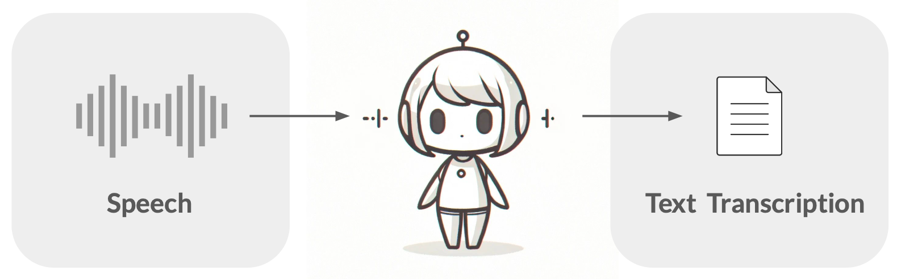
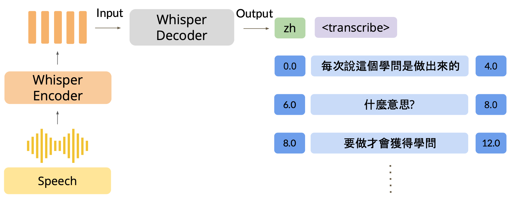
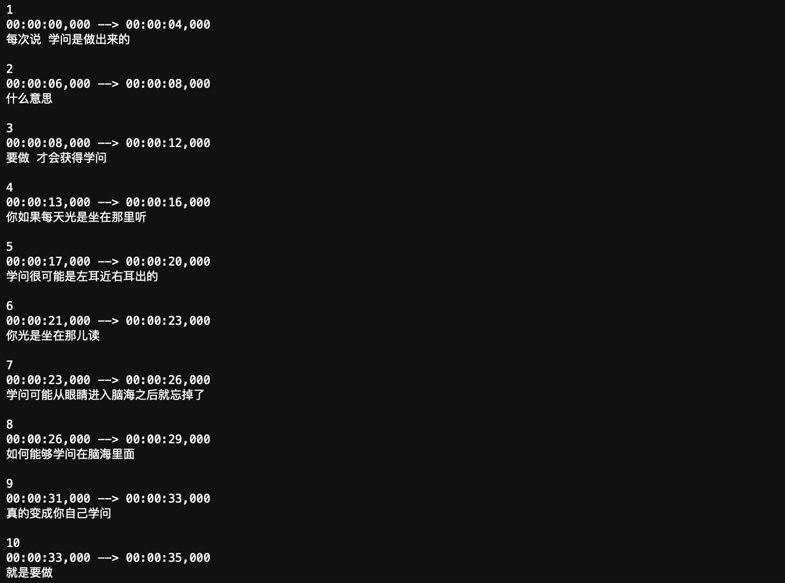
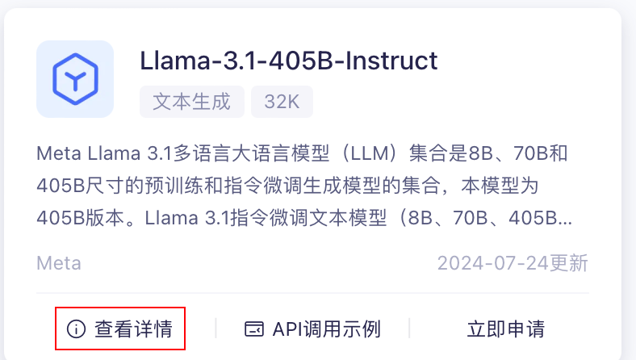
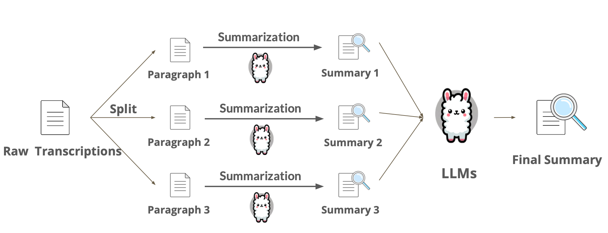
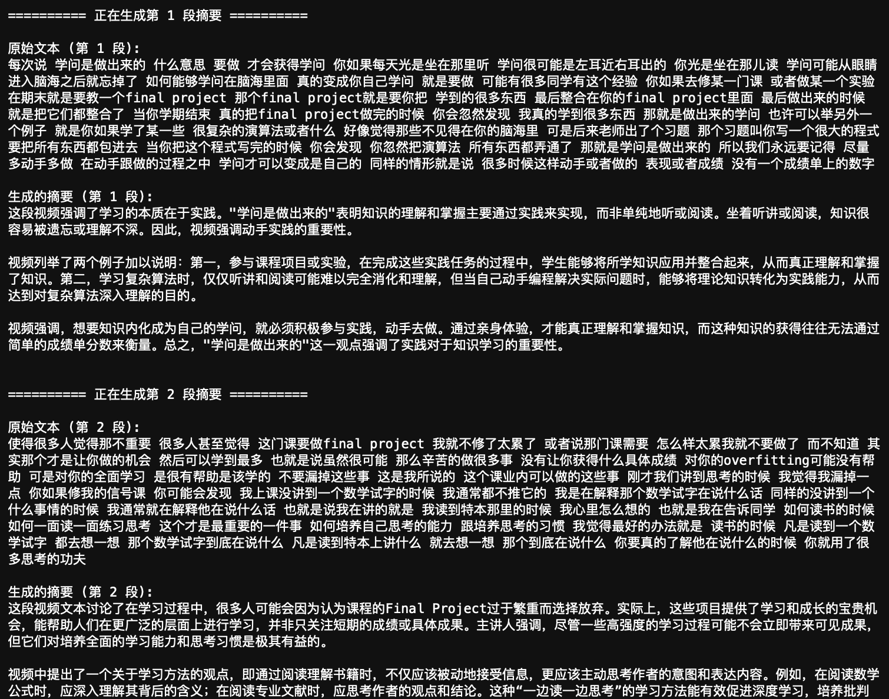
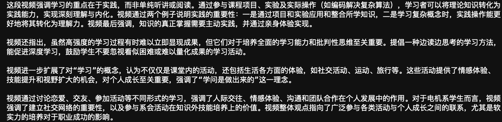
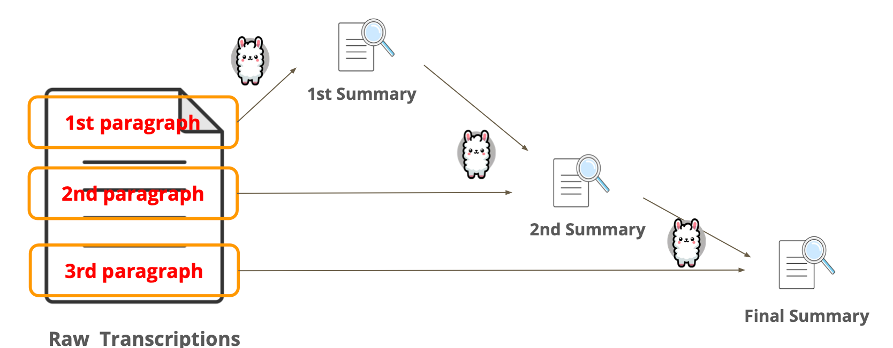

# 用 API 实现 AI 视频摘要：动手制作属于你的 AI 视频小助手

> AI 视频摘要想必你一定不陌生，在各大视频平台，比如 B 站，评论区的 AI 视频小助手就如雨后春笋般遍地都是。
>
> 今天，让我们来填了这“护城河”，站到墙上看一看它的全貌。
>
> **简而言之，AI 视频摘要的工作流程如下：**
>
> 1. **视频 → 音频（MP3）**
> 2. **音频 → 字幕（带时间戳）**
> 3. **字幕 → AI 摘要**
>
> 是不是很简单？你可能会好奇，AI 视频小助手真的“看”视频了吗？其实大概率是没有的，它只是分析了字幕和对应的时间戳。哦，对了，时间戳对应字幕发生的时间。
>
> AI 视频摘要看似有些夸大其词，但实际上却名副其实。因为对于绝大多数信息量丰富，需要总结的视频来说，音频蕴含的信息足以贯穿全文（实际上，它更像是“AI 音频摘要”，不过“AI 视频摘要”显然更有噱头）。
>
> 这篇文章将带你一步步的实现 AI 摘要功能。同时，也为[生成式人工智能导论](https://speech.ee.ntu.edu.tw/~hylee/genai/2024-spring.php)课程中 [HW9: Quick Summary of Lecture Video](https://colab.research.google.com/drive/1Ysr25kz6lP7gR8DNTkJMAqOuMp2bhXes?usp=sharing#scrollTo=UULEr1GpDAl6) 提供中文引导。
>
> **建议搭配代码文件逐块运行的同时理解文章。 **
> **注意，这里没有任何模型会被训练。** 
>
> 代码文件下载: [交互完整版](../Demos/13a.%20轻松开始你的第一次%20AI%20视频总结（API%20版）%20-%20完整版.ipynb) | [非交互精简版](../Demos/13b.%20轻松开始你的第一次%20AI%20视频总结（API%20版）-%20精简版.ipynb) |  [🎡AI Summarizer 脚本](../CodePlayground/summarizer.py)
>
> 在线链接（精简版）：[Kaggle](https://www.kaggle.com/code/aidemos/13b-ai-api) | [Colab](https://colab.research.google.com/drive/1yh2J4_Cy45fqvydH34LLtDpw10kuWutO?usp=sharing)

## 目录

- [第 0 部分 - 运行脚本（推荐，但可以跳过）](#第-0-部分---运行脚本推荐但可以跳过)
- [第 1 部分 - 准备工作](#第-1-部分---准备工作)
  - [视频转音频](#视频转音频)
     - [Linux：](#linux)
     - [MacOS](#macos)
     - [Windows：](#windows)
  - [准备音频文件](#准备音频文件)
  - [安装必要的库](#安装必要的库)
  - [导入库](#导入库)
  - [加载数据](#加载数据)
     - [直接加载 .mp3 文件](#直接加载-mp3-文件)
- [第 2 部分 - 自动语音识别 (ASR)](#第-2-部分---自动语音识别-asr)
  - [定义语音识别函数](#定义语音识别函数)
  - [设置参数](#设置参数)
  - [运行语音识别](#运行语音识别)
  - [检查结果](#检查结果)
- [第 3 部分 - 处理自动语音识别的结果](#第-3-部分---处理自动语音识别的结果)
  - [提取字幕文本](#提取字幕文本)
  - [拆分文本](#拆分文本)
  - [执行文本处理](#执行文本处理)
- [第 4 部分 - 文本摘要](#第-4-部分---文本摘要)
  - [设置 OpenAI API](#设置-openai-api)
  - [设置参数](#设置参数-1)
  - [定义摘要函数](#定义摘要函数)
  - [这里演示两种摘要方式](#这里演示两种摘要方式)
     - [方法一：拆分为多段进行摘要（Multi-Stage Summarization）- MapReduce](#方法一拆分为多段进行摘要multi-stage-summarization--mapreduce)
     - [方法二：精炼方法（the method of Refinement) - Refine](#方法二精炼方法the-method-of-refinement---refine)
- [总结与展望](#总结与展望)
  - [对深度学习一窍不通也可以做出 AI 应用吗？](#对深度学习一窍不通也可以做出-ai-应用吗)
  - [可能的疑问](#可能的疑问)

## 第 0 部分 - 运行脚本（推荐，但可以跳过）

> 如果你尚未配置运行环境，请参照 [README](../CodePlayground#codeplayground)。

建议运行 [🎡AI Summarizer 脚本](../CodePlayground/summarizer.py)获得直观的体验。


1. 克隆整个仓库，确保相关配置文件和样例视频被下载：

    ```bash
    git clone https://github.com/Hoper-J/AI-Guide-and-Demos-zh_CN.git
    cd AI-Guide-and-Demos-zh_CN/CodePlayground
    ```

2. 命令行运行：

    ```bash
    python summarizer.py examples/summarizer.mp4
    ```

    你会被要求输入你的 API 密钥，随后你将获得以下三个文件：

    - `output/summarizer.mp3` - 音频文件
    - `output/summarizer.srt` - 字幕文件
    - `output/summarizer.summary.txt` - 摘要文件

    你可以检查这些文件，并在后续步骤中使用它们（如果你想的话）。
    

## 第 1 部分 - 准备工作

> 之前装过的模块可以跳过。

### 视频转音频

你可以自己准备一个视频文件进行实验，也可以跳过这一部分，因为我们已经为你提供了一个音频文件。假设你准备的是 `.mp4` 格式的视频文件，可以使用 `ffmpeg` 轻松将其转换为 `.mp3` 格式。

首先，我们需要安装 `ffmpeg`。选择你的操作系统进行：

#### Linux：

```bash
sudo apt-get install ffmpeg
```

#### MacOS

```bash
brew install ffmpeg
```

#### Windows：

1. 前往 [FFmpeg 官网](https://ffmpeg.org/download.html) 下载对应的安装包。
2. 按照教程安装并将 `ffmpeg` 路径添加到环境变量。

安装完成后，使用以下命令将视频文件（input_video.mp4）转为 MP3 音频（output_audio.mp3），你需要修改对应文件名：

```bash
ffmpeg -i input_video.mp4 -q:a 0 -map a output_audio.mp3
```

参数解释：

- `-i input_video.mp4`：指定输入的视频文件。
- `-q:a 0`：设置音频质量，`0` 为最高音频质量。
- `-map a`：只提取音频部分。
- `output_audio.mp3`：指定输出的音频文件名。

### 准备音频文件

为了对齐课程作业，我们使用李琳山教授《信号与人生 (2023)》演讲的一个片段（从 1:43:24 到 2:00:49），已经上传了对应的 [MP3 文件](../Demos/data/13/audio.mp3)。

如果你感兴趣，也可以通过以下链接查看原始视频：

- **视频链接**：
  - [Bilibili](https://www.bilibili.com/video/BV14P411B7Le)
  - [YouTube](https://www.youtube.com/watch?v=MxoQV4M0jY8)

### 安装必要的库

在开始之前，需要安装一些必要的 Python 库：

```bash
pip install srt
pip install datasets
pip install DateTime
pip install OpenCC==1.1.6
pip install opencv-contrib-python
pip install opencv-python
pip install opencv-python-headless
pip install openpyxl
pip install openai
pip install git+https://github.com/openai/whisper.git@ba3f3cd54b0e5b8ce1ab3de13e32122d0d5f98ab
pip install numpy
pip install soundfile
pip install ipywidgets
pip install librosa
#pip install 'httpx<0.28.0' # 降级 httpx 以解决关键字 'proxies' 被移除的问题，最新的 openai 库不会引发该问题，故默认注释
```

### 导入库

```python
# 标准库
import os
import time
import re
import pathlib
import textwrap
import datetime

# 第三方库
import numpy as np
import srt
import soundfile as sf
from tqdm import tqdm

# 项目相关库
import whisper
from datasets import load_dataset
from openai import OpenAI
```

### 加载数据

对应的数据文件来自于：[kuanhuggingface/NTU-GenAI-2024-HW9](https://huggingface.co/datasets/kuanhuggingface/NTU-GenAI-2024-HW9/tree/main)。

[Parquet](../Demos/data/13/test-00000-of-00001.parquet) 文件也已经上传至 `data` 文件夹，无需再下载。

```python
# 加载本地 Parquet 格式的数据集
dataset = load_dataset('parquet', data_files={'test': './data/13/test-00000-of-00001.parquet'})

# 准备音频
input_audio = dataset["test"]["audio"][0]
input_audio_name = input_audio["path"]
input_audio_array = input_audio["array"].astype(np.float32)
sampling_rate = input_audio["sampling_rate"]
```

在这个过程中，`input_audio_array` 包含了音频数据，`input_audio_name` 是音频文件名，`sampling_rate` 是采样率。

#### 直接加载 .mp3 文件

那如果我们想使用 .mp3 文件而不是这个从来没见过的文件格式的话，应该怎么办呢？

以 `Demos/data/13/audio.mp3` 的文件为例：

```python
import librosa

# 指定 MP3 文件路径
mp3_file_path = './data/13/audio.mp3'

input_audio_name = os.path.basename(mp3_file_path)

# 加载音频文件，指定采样率为 16000
input_audio_array, sampling_rate = librosa.load(mp3_file_path, sr=16000)

# 打印音频数据的采样率和形状，确保加载成功
print(f"采样率: {sampling_rate}")
print(f"音频数据形状: {input_audio_array.shape}")

print(f"现在我们将转录音频: ({input_audio_name})。")
```

具体变量和参数解释：

- `input_audio_array`：音频数据的 NumPy 数组表示。
- `sampling_rate`：音频的采样率（Hz）。
- `input_audio_name`：音频文件名，仅保留文件名，不包含路径。
- **注意**：我们使用 `sr=16000`，将音频采样率转换为 Whisper 模型要求的 16000 Hz，确保模型能够正确处理音频数据。

这样，我们就完成了音频文件的导入。你可以进一步替换成你自己的 .mp3 文件。

## 第 2 部分 - 自动语音识别 (ASR)

> **Automatic Speech Recognition**
> 
>
> Whisper 是 OpenAI 开源的通用语音识别模型，支持多种语言的语音识别任务，并且能够为音频文件生成带有时间戳的字幕，在[论文](https://arxiv.org/abs/2212.04356)中，作者提到：“我们使用了 68 万小时的多语言和多任务监督数据训练了该模型。”
>
> 所以你可以相信它的能力，感谢开源精神。

接下来，你可以将某段会议的音频录制作为输入，查看转录后的效果。我们将利用 Whisper 模型来带你完成 ASR。下图是处理的样例过程：



### 定义语音识别函数

```python
def speech_recognition(model_name, input_audio, output_subtitle_path, decode_options, cache_dir="./"):
    # 加载模型
    model = whisper.load_model(name=model_name, download_root=cache_dir)

    # 转录音频
    transcription = model.transcribe(
        audio=input_audio,
        language=decode_options["language"],
        verbose=False,
        initial_prompt=decode_options["initial_prompt"],
        temperature=decode_options["temperature"]
    )

    # 处理转录结果，生成字幕文件
    subtitles = []
    for i, segment in enumerate(transcription["segments"]):
        start_time = datetime.timedelta(seconds=segment["start"])
        end_time = datetime.timedelta(seconds=segment["end"])
        text = segment["text"]
        subtitles.append(srt.Subtitle(index=i, start=start_time, end=end_time, content=text))

    srt_content = srt.compose(subtitles)

    # 保存字幕文件
    with open(output_subtitle_path, "w", encoding="utf-8") as file:
        file.write(srt_content)

    print(f"字幕已保存到 {output_subtitle_path}")
```

### 设置参数

注意，这里设置的参数都是 Whisper 相关的，与后续的 AI 摘要不同。

你可以通过 model_name 设置不同的模型，使用**标识**指定。通过[官方仓库](https://github.com/openai/whisper)所提供的数据，我们可以看到不同模型需要的显存大小：

| Size   | Parameters | English-only model | Multilingual model | Required VRAM | Relative speed |
| ------ | ---------- | ------------------ | ------------------ | ------------- | -------------- |
| tiny   | 39 M       | `tiny.en`          | `tiny`             | ~1 GB         | ~32x           |
| base   | 74 M       | `base.en`          | `base`             | ~1 GB         | ~16x           |
| small  | 244 M      | `small.en`         | `small`            | ~2 GB         | ~6x            |
| medium | 769 M      | `medium.en`        | `medium`           | ~5 GB         | ~2x            |
| large  | 1550 M     | N/A                | `large`            | ~10 GB        | 1x             |

**解释：**

- **Size (大小)**：表示模型的尺寸，不同大小的模型训练时使用的数据量不同，因此性能和精度也不同。较大的模型通常会有更高的精度。`Medium` 是个不错的选择，`tiny` 和 `base` 效果一般，用于学习的话也可以。
- **Parameters (参数量)**：模型的参数数量，表示模型的复杂度。参数越多，模型的性能通常越好，但也会占用更多的计算资源。
- **English-only model (仅限英文模型)**：模型的**标识**名称，只用于处理英文音频转录，适用于仅需要处理英文语音的场景。
- **Multilingual model (多语言模型)**：模型的**标识**名称，用于在代码中加载相应的模型，对应于接下来的 `model_name` 参数。
- **Required VRAM (所需显存)**：指运行该模型时所需的显存大小。如果你对参数和显存的对应关系感兴趣，可以阅读之前的文章：[《07. 探究模型参数与显存的关系以及不同精度造成的影响.md》](../Guide/07.%20探究模型参数与显存的关系以及不同精度造成的影响.md)。
- **Relative speed (相对速度)**：相对速度表示模型处理语音转录任务的效率。数字越大，模型处理速度越快，与模型的参数量成反比。

```python
# 模型名称，可选 'tiny', 'base', 'small', 'medium', 'large-v3'
model_name = 'medium'

# 语言
language = 'zh'  # 选择语音识别的目标语言，如 'zh' 表示中文

# 初始 prompt，可选
initial_prompt = '请用中文'  # 如果需要，可以为 Whisper 模型设置初始 prompt 语句

# 采样温度，控制模型的输出多样性
temperature = 0.0  # 0 表示最确定性的输出，范围为 0-1

# 输出文件后缀
suffix = '信号与人生'

# 字幕文件路径
output_subtitle_path = f"./output-{suffix}.srt"

# 模型缓存目录
cache_dir = './'
```

**initial_prompt**：这个参数用于设置 Whisper 模型转录任务的初始提示，为模型提供上下文信息。对于不连续的对话或者需要保持一致性的转录任务，`initial_prompt` 可以帮助模型更好地理解和预测后续的语音内容。

例如，如果你有一个分段的长视频，并且每段视频之间有相关的上下文信息，你可以使用 `initial_prompt` 来告知模型当前的语境。

### 运行语音识别

```python
# 构建解码选项
decode_options = {
    "language": language,
    "initial_prompt": initial_prompt,
    "temperature": temperature
}

# 运行 ASR
speech_recognition(
    model_name=model_name,
    input_audio=input_audio_array,
    output_subtitle_path=output_subtitle_path,
    decode_options=decode_options,
    cache_dir=cache_dir
)
```

运行成功后，Whisper 模型会生成带有时间戳的字幕文件（.srt 格式），保存在你指定的路径中。


### 检查结果

```python
# 读取并打印字幕内容
with open(output_subtitle_path, 'r', encoding='utf-8') as file:
    content = file.read()
print(content)
```

你将看到生成的字幕内容，包括时间戳和对应的文字。



**JUST DO IT**

## 第 3 部分 - 处理自动语音识别的结果

在这一部分，我们将处理通过 Whisper 模型生成的字幕文件（SRT 文件），提取其中的纯文本内容，并对文本进行拆分以便后续的处理。

### 提取字幕文本

SRT 文件包含了字幕的索引、时间戳（字幕显示的起始和结束时间）以及字幕文本内容。我们这里做的是简单处理，只保留了每个字幕条目的文本部分，去除了时间戳和索引信息。

```python
def extract_and_save_text(srt_filename, output_filename):
    # 读取 SRT 文件
    with open(srt_filename, 'r', encoding='utf-8') as file:
        content = file.read()

    # 去除时间戳和索引
    pure_text = re.sub(r'\d+\n\d{2}:\d{2}:\d{2},\d{3} --> \d{2}:\d{2}:\d{2},\d{3}\n', '', content)
    pure_text = re.sub(r'\n\n+', '\n', pure_text)

    # 保存纯文本
    with open(output_filename, 'w', encoding='utf-8') as output_file:
        output_file.write(pure_text)

    print(f'提取的文本已保存到 {output_filename}')

    return pure_text
```

### 拆分文本

这里我们使用了 textwrap.wrap 函数，将纯文本按 max_length 个字符的长度进行划分。

```python
def chunk_text(text, max_length):
    return textwrap.wrap(text, max_length)
```

每个生成的文本块都会包含最多 512 个字符（包括空格和标点符号），这是一种简单的分割方法。

### 执行文本处理

调用之前的函数进行文本提取和拆分。

```python
# 文本块长度
chunk_length = 512

# 提取文本并拆分
pure_text = extract_and_save_text(
    srt_filename=output_subtitle_path,
    output_filename=f"./output-{suffix}.txt",
)

chunks = chunk_text(text=pure_text, max_length=chunk_length)
```

## 第 4 部分 - 文本摘要

### 设置 OpenAI API

首先，需要设置 OpenAI API 密钥，这里演示使用的是**阿里云的大模型 API**，你可以通过[《00. 大模型API获取步骤》](../Guide/00.%20大模型API获取步骤.md)获取 API 密钥。

如果需要使用其他平台，请参考对应的开发文档后对应修改 `base_url`。

```python
# TODO: 设置你的 OPENAI API 密钥，这里以阿里云 DashScope API 为例进行演示
OPENAI_API_KEY = ""
# 不设置则默认使用环境变量
if not OPENAI_API_KEY:
    OPENAI_API_KEY = os.getenv('OPENAI_API_KEY')
    
# 构建 OpenAI 客户端
client = OpenAI(
    api_key=openai_api_key,
    base_url="https://dashscope.aliyuncs.com/compatible-mode/v1", 
)
```

### 设置参数

这里就是 AI 摘要相关的参数了。

```python
# 模型名称
model_name = 'qwen-turbo'

# 控制响应的随机性
temperature = 0.0

# 控制多样性
top_p = 1.0

# 最大生成标记数
max_tokens = 512
```

默认使用 qwen-turbo，其他模型可以参阅[模型广场 -- 阿里云百炼](https://bailian.console.aliyun.com/?spm=5176.29619931.J__Z58Z6CX7MY__Ll8p1ZOR.1.4d1d59fcWwSqvr#/model-market)，点击对应模型的`查看详情`。



你可以在界面左上角看到对应的英文名称，复制它，然后替换 `model_name`。


你可以随意更换为你想要的模型，不过可能要先申请使用（通过大概要几个小时，会有短信提示）。

### 定义摘要函数

```python
def summarization(client, summarization_prompt, model_name="qwen-turbo", temperature=0.0, top_p=1.0, max_tokens=512):
    response = client.chat.completions.create(
        messages=[{"role": "user", "content": summarization_prompt}],
        model=model_name,
        temperature=temperature,
        top_p=top_p,
        max_tokens=max_tokens
    )
    return response.choices[0].message.content
```

### 这里演示两种摘要方式

分别对应于 `MapReduce` 和 `Refine`，你可以通过接下来的代码来感受二者的区别。

#### 方法一：拆分为多段进行摘要（Multi-Stage Summarization）- MapReduce



1. 将长文本分成多个较小的部分，并分别获取每个小段落的摘要

    ```python
    # 定义摘要提示模板
    summarization_prompt_template = "用 300 个字以内写出这段视频文本的摘要，其中包括要点和所有重要细节：<text>"
    
    # 对每个文本块生成摘要
    paragraph_summaries = []
    for index, chunk in enumerate(chunks):
        print(f"\n========== 正在生成第 {index + 1} 段摘要 ==========\n")
        print(f"原始文本 (第 {index + 1} 段):\n{chunk}\n")
        
        # 构建摘要提示
        summarization_prompt = summarization_prompt_template.replace("<text>", chunk)
        
        # 调用摘要函数
        summary = summarization(
            client=client,
            summarization_prompt=summarization_prompt,
            model_name=model_name,
            temperature=temperature,
            top_p=top_p,
            max_tokens=max_tokens
        )
        
        # 打印生成的摘要
        print(f"生成的摘要 (第 {index + 1} 段):\n{summary}\n")
        
        # 将生成的摘要保存到列表
        paragraph_summaries.append(summary)
    ```

	

2. 在分别获取每个小段落的摘要后，处理这些摘要以生成最终的摘要。

    ```python
    # 合并段落摘要
    collected_summaries = "\n".join(paragraph_summaries)
    
    # 定义最终摘要提示模板
    final_summarization_prompt = "在 500 字以内写出以下文字的简洁摘要：<text>"
    final_summarization_prompt = final_summarization_prompt.replace("<text>", collected_summaries)
    
    # 生成最终摘要
    final_summary = summarization(
        client=client,
        summarization_prompt=final_summarization_prompt,
        model_name=model_name,
        temperature=temperature,
        top_p=top_p,
        max_tokens=max_tokens
    )
    
    print(final_summary)
    ```
	

#### 方法二：精炼方法（the method of Refinement) - Refine

Refinement 就是把每次的文本和之前的摘要结合起来丢给大模型，类似于迭代：



步骤（Pipeline）如下：

- 第1步：从一小部分数据开始，运行prompt生成初始输出。
- 第2步：对后续每个文档，将前一个输出与新文档结合输入。
- 第3步：LLM 根据新文档中的信息精炼输出。
- 第4步：此过程持续迭代，直到处理完所有文档。

对应代码：

```python
# 定义初始摘要提示模板
summarization_prompt_template = "用 300 个字以内写出这段视频文本的摘要，其中包括要点和所有重要细节:<text>"

# 定义精炼摘要提示模板
summarization_prompt_refinement_template = "请在 500 字以内，结合原先的摘要和新的内容，提供简洁的摘要:<text>"

# 初始化保存摘要的列表
refined_summaries = []

# 对文本块逐步进行精炼摘要，并打印中间过程
for index, chunk in enumerate(chunks):
    if index == 0:
        # 第一步：对第一段文本生成初始摘要
        print(f"\n========== 正在生成第 {index + 1} 段的初始摘要 ==========\n")
        print(f"原始文本 (第 {index + 1} 段):\n{chunk}\n")
        
        # 构建初始摘要提示
        summarization_prompt = summarization_prompt_template.replace("<text>", chunk)
        
        # 调用摘要函数生成第一个摘要
        first_summary = summarization(
            client=client,
            summarization_prompt=summarization_prompt,
            model_name=model_name,
            temperature=temperature,
            top_p=top_p,
            max_tokens=max_tokens
        )
        
        # 打印生成的初始摘要
        print(f"生成的摘要 (第 {index + 1} 段):\n{first_summary}\n")
        
        # 保存生成的摘要
        refined_summaries.append(first_summary)

    else:
        # 后续步骤：结合前一个摘要与当前段落进行精炼
        print(f"\n========== 正在生成第 {index + 1} 段的精炼摘要 ==========\n")
        print(f"原始文本 (第 {index + 1} 段):\n{chunk}\n")
        
        # 构建精炼摘要的输入文本，将前一个摘要与当前段落内容结合
        chunk_with_previous_summary = f"前 {index} 段的摘要: {refined_summaries[-1]}\n第 {index + 1} 段的内容: {chunk}"
        
        # 构建精炼摘要提示
        summarization_prompt = summarization_prompt_refinement_template.replace("<text>", chunk_with_previous_summary)
        
        # 调用摘要函数生成精炼摘要
        refined_summary = summarization(
            client=client,
            summarization_prompt=summarization_prompt,
            model_name=model_name,
            temperature=temperature,
            top_p=top_p,
            max_tokens=max_tokens
        )
        
        # 打印生成的精炼摘要
        print(f"生成的摘要 (第 {index + 1} 段):\n{refined_summary}\n")
        
        # 保存生成的精炼摘要
        refined_summaries.append(refined_summary)

# 最终的精炼摘要结果就是 refined_summaries 列表的最后一个元素
final_refined_summary = refined_summaries[-1]

print("\n========== 最终精炼摘要结果 ==========\n")
print(final_refined_summary)
```


## 总结与展望

### 对深度学习一窍不通也可以做出 AI 应用吗？

当然可以！或许你曾经看到 AI 视频小助手的时候会觉得：“哇，肯定很多技术细节在里面，学习曲线一定很陡峭。”但实际上，在真正用到模型的地方，你只需要加载预训练模型和调用 API 就可以了，完全不需要自己训练模型：

- **音频提取**：从视频中提取音频，这一步可以通过各种工具实现，比如 `ffmpeg`。
- **语音识别**：使用开源的 ASR（自动语音识别）模型，如 OpenAI 的 Whisper，将音频转换为文字。
- **文本摘要**：借助大语言模型（LLM）对文本进行摘要，可以直接调用 OpenAI API 或其他大模型 API 实现。

因此，所有这些看似复杂的任务其实都是你可以轻松做到的。AI 应用并没有想象中那么神秘，只要你了解工具的使用方法，就可以轻松去实现你的想法。

🤔**再打开一下思路**：现在，大多数的视频都有字幕或者 AI 字幕，这为我们提供了一个捷径。通过直接下载这些字幕，你的 AI 应用就能跳过音频转录等步骤，直接进入它最擅长的环节：生成摘要。

So，让我们再次回到最初的疑问：**AI 视频小助手真的“看”视频了吗？**

**答**：不仅没看，还大概率没听。如果某个线上的 AI 小助手在可以正常下载到音频的情况下却不能做总结，这就表示：它读的是字幕。

### 可能的疑问

**摘要没有提供时间段，还是做不到和评论区的小助手一样的事情。**

确实，目前我们生成的摘要并没有包含具体的时间戳信息，不像一些评论区的 AI 小助手那样，为每个摘要段落提供对应的视频时间点。这是因为我们在 `extract_and_save_text()` 处理的时候就把时间戳信息拿掉了，为什么这样做呢？

**答**：提供一个简单的处理概览，以及**对齐**作业 :)

**如何解决这个问题？**

**答**：文本处理时保留时间戳 + 修改 prompt 模版，增加 <start_time> - <end_time> 占位符。

**这篇文章更多的作为一个入门文章，希望能帮你揭开面纱的一角。**

## 参考链接

- [生成式人工智能导论](https://speech.ee.ntu.edu.tw/~hylee/genai/2024-spring.php)
- [HW9 PDF](../GenAI_PDF/HW9.pdf) 当前文章中的有趣的图片大多来自于此
- [Whisper - Paper](https://arxiv.org/abs/2212.04356)
- [Whisper - Github](https://github.com/openai/whisper)
