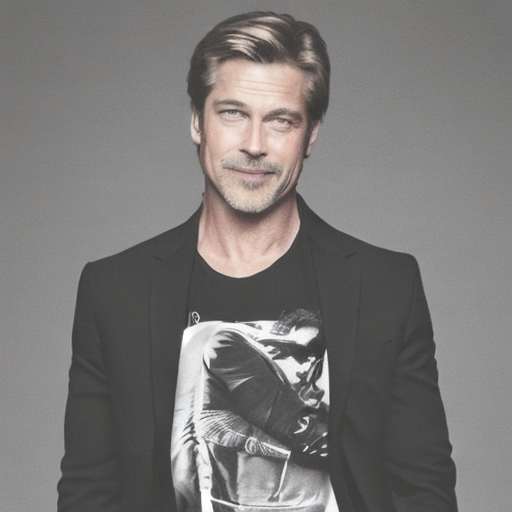
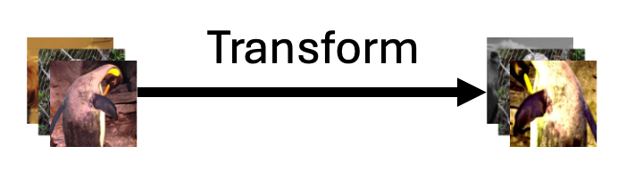
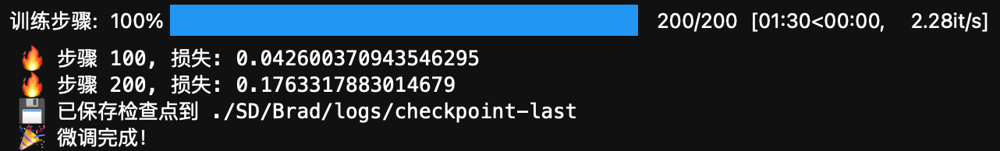

# 用 LoRA 微调 Stable Diffusion：拆开炼丹炉，动手实现你的第一次 AI 绘画

> 总得拆开炼丹炉看看是什么样的。这篇文章将带你从代码层面一步步实现 AI 文本生成图像（Text-to-Image）中的 LoRA 微调过程，你将：
>
> - 了解 **Trigger Words**（触发词）到底是什么，以及它们如何影响生成结果。
> - 掌握 LoRA 微调的基本原理。
> - 学习数据集的准备与结构，并知道如何根据需求定制自己的数据集。
> - 理解 Stable Diffusion 模型的微调步骤。
> - 明白在画图界面（UI）下到底发生了什么。
> - 使用代码实现 AI 绘画。
>
> 如果你想制作属于自己的数据集，最好遵循以下建议：
>
> 1. **至少准备 20 张图片**：想学到的概念越复杂就需要越多的图片。你可以尝试将样例数据集的图片数量减少到 20 张，看看效果会有什么变化。
> 2. **裁剪图片**：建议对图片进行裁剪，当然你也可以不裁剪，如果你不追求效果的话。这里会自动 resize 到自定义的分辨率。
>
> **与其花费大量时间去调参，更优的选择是处理好你的数据集和 Prompts。当然，这两件事情可以同步进行。**
>
> 注意，当前文章使用的是自然语言标注（而非 Tag），你也可以使用 Tag，这两种方式本质上是一致的。
>
> 同时，如果你对深度学习有所了解，那么代码中的一切，都将是你曾经见过的内容翻版，没有什么新的，除了 LoRA。另外，这篇文章也为[生成式人工智能导论](https://speech.ee.ntu.edu.tw/~hylee/genai/2024-spring.php)课程中 [HW10: Stable Diffusion Fine-tuning](https://colab.research.google.com/drive/1dI_-HVggxyIwDVoreymviwg6ZOvEHiLS?usp=sharing#scrollTo=CnJtiRaRuTFX) 提供中文引导。所以，我们将同步使用演员 [Brad Pitt（布拉德·皮特）](https://baike.baidu.com/item/布拉德·皮特/81288)的图片作为训练集，共计一百张。
>
> 代码文件下载：[镜像交互版](../Demos/14a.%20尝试使用%20LoRA%20微调%20Stable%20Diffusion%20模型.ipynb) |  [精简学习版](../Demos/14b.%20尝试使用%20LoRA%20微调%20Stable%20Diffusion%20模型%20-%20精简版.ipynb) | [🎡 SD LoRA 脚本](../CodePlayground/sd_lora.py)
>
> 在线链接（精简版）：[Kaggle](https://www.kaggle.com/code/aidemos/14b-lora-stable-diffusion) | [Colab](https://colab.research.google.com/drive/1idmnaQZwRhjUPw7ToEXlVo82Mihfl_aA?usp=sharing)

## 目录


- [前言](#前言)
- [开始动手](#开始动手)
- [安装必要的库](#安装必要的库)
- [导入](#导入)
- [准备数据](#准备数据)
- [设置项目路径](#设置项目路径)
- [导入数据](#导入数据)
  - [怎么扩充数据集？](#怎么扩充数据集)
  - [怎么让模型理解文本？](#怎么让模型理解文本)
  - [自定义数据集](#自定义数据集)
- [定义微调相关的函数](#定义微调相关的函数)
  - [加载 LoRA](#加载-lora)
  - [准备优化器](#准备优化器)
  - [定义 collate_fn 函数](#定义-collate_fn-函数)
- [设置相关参数](#设置相关参数)
  - [设备配置](#设备配置)
  - [模型与训练参数配置](#模型与训练参数配置)
- [微调前的准备](#微调前的准备)
  - [准备数据集](#准备数据集)
  - [准备模型和优化器](#准备模型和优化器)
- [开始微调](#开始微调)
- [生成图像和评估](#生成图像和评估)
  - [什么是 pipeline？](#什么是-pipeline)
  - [推理相关的参数](#推理相关的参数)
  - [加载用于验证的 prompts](#加载用于验证的-prompts)
  - [定义生成图像的函数](#定义生成图像的函数)
  - [定义评估函数](#定义评估函数)
- [拓展作业](#拓展作业)
- [用 🎡 脚本微调 SD（可选）](#用--脚本微调-sd可选)

  - [克隆仓库](#克隆仓库)
  - [执行脚本](#执行脚本)

- [参考链接](#参考链接)

## 前言

下面是使用 prompt：`"A man in a graphic tee and sport coat."`，在默认设置下训练 2000 个步骤后模型生成的图像，训练时长约为 18 分钟。乍一看，是不是还挺不错的？



你可能会注意到，我们的 prompt 中并没有提到 Brad Pitt（布拉德·皮特）这个演员（尽管我们的数据集完全来自于他），但模型却能够绘制长得像 Brad Pitt 的人。

这是因为，如果我们在 prompt 中直接指定 "Brad Pitt"，模型可能无法完全学习到他的特征风格。举个例子：

- "A man in a graphic tee and sport coat. Brad Pitt."
- "A man in a graphic tee and sport coat."

第一条 prompt 显然更精准，但精准并不意味着模型训练得更好。如果你用一系列包含 "Brad Pitt" 的 prompt 来训练，模型更有可能学到的是：只有在加上 "Brad Pitt" 时才进行风格转变。你可能会说：“我就是想要这个效果”，那么很好，"Brad Pitt" 就是你模型的 **Trigger Word**（触发词）。但有可能还有同学：“我希望模型只为 Brad Pitt 服务，我要把所有的 'man' 都变成 Brad Pitt”，那么在训练时就不要在 prompt 中增加 "Brad Pitt"。简而言之：**反着来**。

这实际上并没有反直觉，跳出来想一想：

1. 想象一下你是一位画家，生活在一个从不变暗的世界里，整个世界永远是白天，你已经习惯画出白天背景下的各种景象，但你不知道白天是什么，这就是你所熟知的「日常」。

2. 有一天，有人给你看了一些照片，说：“Hey，实际上世界可以是黑的，叫做夜晚”，这时候你就会理解到，日常是有另一种状态的，叫做夜晚，即便你以前从来没有过概念，但现在，你将认知到它，你将这部分新的概念聚焦到了「夜晚」。于是，从此以后，你的画作被分为了「日常」和「日常，夜晚」。

3. 同时，在另一个平行世界，有人告诉你：“你眼中看到的世界是不对的”，他们“治”好了你的眼睛，向你展示了一个完全陌生的漆黑世界，并承诺只要你学会画出这种风格的画作，将会获得丰厚的回报，否则将无人问津你的画摊。于是你开始画“夜晚”风格的「日常」。

这是杜攥的三个小片段，希望你喜欢。

你可以分别将它理解为：

1. **原始模型**：活在自己世界的画家。
2. **LoRA 微调**：当新标签（Tag）“夜晚”被引入，画家学会了夜晚的概念。Prompt：夜晚，日常。
3. **另一个 LoRA 微调**：迁移风格，画家将“夜晚”视为真正的日常风格。Prompt：日常。

因此，训练模型就像教小朋友认知世界。如果你将世界分解为不同的概念并逐一传授，孩子会学到不同的知识。这就类似于模型学习不同的标签和风格。如果你不明确区分概念，并将新概念混杂在已有的认知中，孩子的认知会被重塑，或许会将鹿“误”认为马。这是合理的，模型也是如此，取决于你如何教导（prompt）它。

**Prompt 小技巧：**

- **明确你的目标**：在训练前，思考你是希望模型学习特定的风格、特定的人物，还是希望模型在特定的场景下才生成特定的效果。到底是希望所有的 man 都是 Brad Pitt，还是希望模型知道 Brad Pitt 是一个 man。
- **保持一致性**：如果你希望将某个概念拆分出来，应该为它创建一个特定的标签（tag），并应用于具有相同概念的图像上。

大模型很聪明，它会自动将图像中的共性归因于共用的标签上。因此，如果不给它新的标签，它会将新学到的内容融入到已有的标签中。

这些是关于 AI 绘画 Prompt + 微调背后逻辑的大白话。扯远了，让我们回到代码部分 :)

## 开始动手

下面，我将带你从代码层面一步步实现 LoRA 微调 Stable Diffusion 模型。注意，这里的知识是通用的，你完全可以推广至任何需要 LoRA 微调的领域。

## 安装必要的库

首先，确保安装以下必要的 Python 库：

```bash
pip install timm
pip install fairscale
pip install transformers
pip install requests
pip install accelerate
pip install diffusers
pip install einop
pip install safetensors
pip install voluptuous
pip install jax
pip install jaxlib
pip install peft
pip install deepface==0.0.92
pip install tensorflow==2.9.0  # 为了避免最后评估阶段使用deepface时的错误，这里选择降级版本
pip install keras
pip install opencv-python
```

## 导入

```python
# ========== 标准库模块 ==========
import os
import math
import glob
import shutil
import subprocess

# ========== 第三方库 ==========
import numpy as np
import torch
import torch.nn.functional as F
from PIL import Image
from tqdm.auto import tqdm

# ========== 深度学习相关库 ==========
from torchvision import transforms

# Transformers (Hugging Face)
from transformers import CLIPTextModel, CLIPTokenizer, CLIPModel, CLIPProcessor

# Diffusers (Hugging Face)
from diffusers import (
    AutoencoderKL,
    DDPMScheduler,
    UNet2DConditionModel,
    DiffusionPipeline
)
from diffusers.optimization import get_scheduler
from diffusers.training_utils import compute_snr

# ========== LoRA 模型库 ==========
from peft import LoraConfig, get_peft_model, PeftModel

# ========== 面部检测库 ==========
from deepface import DeepFace

import cv2
```

## 准备数据

当前演示使用的是 Brad Pitt（布拉德·皮特），我们的目标是让模型绘制的 man 是 Brad Pitt，粗略地换个表述：AI 换脸。

那根据我们之前的描述，标注应该长什么样呢？

**答**：都带 “man”，下面是我们当前数据集的标注示例：

1. a man with a beard and a suit jacket
2. a man in a suit and tie standing in front of a crowd
3. a man with long hair and a tie
4. ...

相信你发现了，所有的标注，都不会含有 “Brad Pitt”，那这篇文章训练出的 LoRA 模型的 **Trigger Words**（触发词）是什么？

**答**：“a man”。

是不是很有趣，看似简单的 Prompt 中也有一些真实有用的小技巧和逻辑。别急着去炼丹，我们继续往下看。

在这里，我们使用 Brad Pitt 的 100 张图片进行演示，数据集已经上传到了[Demos/data/14](../Demos/data/14/Datasets.zip)，你可以下载后放到当前目录下的 `./data/14` 下。这个路径没有什么说法，单纯是为了对齐示例代码，你也可以修改代码关于数据的路径，这里不会有限制，你甚至可以直接用其他的数据集，只要它的文件组织如下：

```
-- 图片1
-- 图片1.txt
-- 图片2
-- 图片2.txt
...
```

> **注意**：图片和对应的文本标注需要同名，且位于同一文件夹中。

值得一提的是，样例数据集的裁剪大小和比例都是不一致的，只是接近正方形，但这没有太大的关系，因为在数据预处理的时候会自动放缩（resize），所以在这里不用担心你的数据集无法训练。

## 设置项目路径

很好！现在你已经知道这篇文章数据集相关的所有前置知识，直接复制下面的代码运行，不用在意其中的任何代码细节，你只需要知道会创建一个文件夹`SD`，之后的所有结果都会被存放在其中：

```python
# 项目名称和数据集名称
project_name = "Brad"
dataset_name = "Brad"

# 根目录和主要目录
root_dir = "./"  # 当前目录
main_dir = os.path.join(root_dir, "SD")  # 主目录

# 项目目录
project_dir = os.path.join(main_dir, project_name)  # 项目目录

# 数据集和模型路径
images_folder = os.path.join(main_dir, "Datasets", dataset_name)
prompts_folder = os.path.join(main_dir, "Datasets", "prompts")
captions_folder = images_folder  # 与原始代码一致
output_folder = os.path.join(project_dir, "logs")  # 存放 model checkpoints 和 validation 的文件夹

# prompt 文件路径
validation_prompt_name = "validation_prompt.txt"
validation_prompt_path = os.path.join(prompts_folder, validation_prompt_name)

# 模型检查点路径
model_path = os.path.join(project_dir, "logs", "checkpoint-last")

# 其他路径设置
zip_file = os.path.join("./", "data/14/Datasets.zip")
inference_path = os.path.join(project_dir, "inference")  # 保存推理结果的文件夹

os.makedirs(images_folder, exist_ok=True)
os.makedirs(prompts_folder, exist_ok=True)
os.makedirs(output_folder, exist_ok=True)
os.makedirs(inference_path, exist_ok=True)

# 检查并解压数据集
print("📂 正在检查并解压样例数据集...")

if not os.path.exists(zip_file):
    print("❌ 未找到数据集压缩文件 Datasets.zip！")
    print("请下载数据集:\n../Demos/data/14/Datasets.zip\n并放在 ./data/14 文件夹下")
else:
    subprocess.run(f"unzip -q -o {zip_file} -d {main_dir}", shell=True)
    print(f"✅ 项目 {project_name} 已准备好！")
```

如果你用的是自己的数据集，修改 `zip_file` 即可（压缩为 zip 格式）：

```python
zip_file = # 改为你自己的数据集路径
```

## 导入数据

下面，我们需要自定义一个 `Dataset` 类，它的作用是告诉模型如何处理你的数据集，这个自定义的类能够返回图像和文本标注分别作为 `data` 和 `label`。接下来的内容会有点“干”，你也可以将其先当作黑盒，我会在每个函数之后提供一个简练的解释帮你理解。

### 怎么扩充数据集？

> 拓展文章：[e. 数据增强：torchvision.transforms 常用方法解析](../Guide/e.%20数据增强：torchvision.transforms%20常用方法解析.md)

这里有一个非常熟悉的词：`transform`，但这个跟我们耳熟能详的 `transformer` 可不同，`transform` 就是单纯的对图像进行操作，比如说调整大小，翻转，又或者随机的裁剪一部分区域，这些操作统称为数据增强。

数据增强就是扩充数据集的外挂，以下图为例，即便进行水平翻转+颜色变化+中心裁剪，它也是一只企鹅。



这大大地扩充了数据集。

知道了概念后，简单定义当前的数据增强如下：

```python
# 训练图像的分辨率
resolution = 512

# 数据增强操作
train_transform = transforms.Compose(
    [
        transforms.Resize(resolution, interpolation=transforms.InterpolationMode.BILINEAR),  # 调整图像大小
        transforms.CenterCrop(resolution),  # 中心裁剪图像
        transforms.RandomHorizontalFlip(),  # 随机水平翻转
        transforms.ToTensor(),  # 将图像转换为张量
    ]
)
```

### 怎么让模型理解文本？

使用 CLIPTokenizer，这是 Hugging Face transformers 库中的一个类，专门用于对文本进行**分词**（tokenization）操作。CLIP，全称 **Contrastive Language-Image Pretraining**（对比语言-图像预训练），Contrastive 这个词说透了它的由来，这是一个非常有意思的自训练思想：通过最大化对应文本-图像对的相似性，同时最小化不同文本-图像对的相似性实现训练。

> **学习资料**
>
> 论文链接：[Learning Transferable Visual Models From Natural Language Supervision](https://arxiv.org/abs/2103.00020)
> 对理论感兴趣的话可以进一步查看以下四个非常棒的视频：
>
> 1. [对比学习论文综述【论文精读】](https://www.bilibili.com/video/BV19S4y1M7hm/?share_source=copy_web&vd_source=e46571d631061853c8f9eead71bdb390)
> 2. [CLIP 论文逐段精读【论文精读】](https://www.bilibili.com/video/BV1SL4y1s7LQ/?share_source=copy_web&vd_source=e46571d631061853c8f9eead71bdb390)
> 3. [CLIP 改进工作串讲（上）【论文精读·42】](https://www.bilibili.com/video/BV1FV4y1p7Lm/?share_source=copy_web&vd_source=e46571d631061853c8f9eead71bdb390)
> 4. [CLIP 改进工作串讲（下）【论文精读·42】](https://www.bilibili.com/video/BV1gg411U7n4/?share_source=copy_web&vd_source=e46571d631061853c8f9eead71bdb390)
>
> 你将发现两个宝藏 UP 主，我无法用语言表达对他们的赞美，只能道一句：“导师好！”。

具体来说，`CLIPTokenizer` 将输入的 prompt 拆解为 token（单词或子词），并将这些 token 映射为`input_ids` 供 CLIP 模型的 `text_encoder` 处理，从而生成 prompt 的嵌入向量，以让模型理解。

就像一切数据到了计算机中都变成 0，1 让其处理，所以向上抽象一下，`CLIP` 就是将人类可以阅读的文本描述变成模型能够理解的形式。

> **拓展：看看 Tokenizer 实际上做了什么**
>
> ```python
> from transformers import CLIPTokenizer
> 
> # 初始化 CLIPTokenizer
> tokenizer = CLIPTokenizer.from_pretrained("openai/clip-vit-base-patch32")
> 
> # 示例 prompt
> prompt_text = "A man in a graphic tee and sport coat."
> 
> # 先使用 tokenizer.tokenize 查看分词后的 token
> tokens = tokenizer.tokenize(prompt_text)
> print("Tokens:", tokens)
> 
> # 将文本转化为 token
> inputs = tokenizer(
>     prompt_text,
>     padding="max_length",  # 如果输入长度不足最大长度，进行填充
>     truncation=True,       # 如果输入过长，进行截断
>     return_tensors="pt"    # 返回 PyTorch 张量
> )
> 
> # 打印分词后的结果
> print("Tokenized Input IDs:", inputs.input_ids)
> print("Attention Mask:", inputs.attention_mask)
> ```
> **输出：**
>
> ```python
> Tokens: ['a</w>', 'man</w>', 'in</w>', 'a</w>', 'graphic</w>', 'tee</w>', 'and</w>', 'sport</w>', 'coat</w>', '.</w>']
> Tokenized Input IDs: tensor([[49406,   320,   786,   530,   320,  4245,  3385,   537,  2364,  7356,
>            269, 49407, 49407, 49407, 49407, 49407, 49407, 49407, 49407, 49407,
>          49407, 49407, 49407, 49407, 49407, 49407, 49407, 49407, 49407, 49407,
>          49407, 49407, 49407, 49407, 49407, 49407, 49407, 49407, 49407, 49407,
>          49407, 49407, 49407, 49407, 49407, 49407, 49407, 49407, 49407, 49407,
>          49407, 49407, 49407, 49407, 49407, 49407, 49407, 49407, 49407, 49407,
>          49407, 49407, 49407, 49407, 49407, 49407, 49407, 49407, 49407, 49407,
>          49407, 49407, 49407, 49407, 49407, 49407, 49407]])
> Attention Mask: tensor([[1, 1, 1, 1, 1, 1, 1, 1, 1, 1, 1, 1, 0, 0, 0, 0, 0, 0, 0, 0, 0, 0, 0, 0,
>          0, 0, 0, 0, 0, 0, 0, 0, 0, 0, 0, 0, 0, 0, 0, 0, 0, 0, 0, 0, 0, 0, 0, 0,
>          0, 0, 0, 0, 0, 0, 0, 0, 0, 0, 0, 0, 0, 0, 0, 0, 0, 0, 0, 0, 0, 0, 0, 0,
>          0, 0, 0, 0, 0]])
> ```
> 问：49407 是什么？我们的 prompt 中似乎没有重复的词。
>
> 答：结束标记，这是因为我们设置了 `padding="max_length"`。思考一下，设置`padding=False`后输出应该是什么样的？先不要往下滑。
>
> #### 具体解释：
>
> - **Tokenized Input IDs**：这个张量展示了输入文本 `A man in a graphic tee and sport coat.` 被转换为的数字 ID 序列。每个数字 ID 对应于词汇表中的一个 token，`49406` 是起始标记，`49407` 是结束标记。
> - **Attention Mask**：用于标记哪些 token 需要模型的关注，1 表示有效 token，0 表示填充的无效 token。
>
> **`padding=False`时的输出：**
>
> ```python
> Tokens: ['a</w>', 'man</w>', 'in</w>', 'a</w>', 'graphic</w>', 'tee</w>', 'and</w>', 'sport</w>', 'coat</w>', '.</w>']
> Tokenized Input IDs: tensor([[49406,   320,   786,   530,   320,  4245,  3385,   537,  2364,  7356,
>            269, 49407]])
> Attention Mask: tensor([[1, 1, 1, 1, 1, 1, 1, 1, 1, 1, 1, 1]])
> ```
>
> 是不是和预期一致呢？
>
> 接下来，`input_ids` 将被传入 `text_encoder`，生成文本的嵌入向量。

### 自定义数据集

在认识 `transform` 和 `tokenizer` 之后，我们可以定义自己的数据集。这个 `Text2ImageDataset` 负责将图像和文本配对，并进行数据的预处理，以便输入到模型中。

```python
# 识别图片后缀
IMAGE_EXTENSIONS = [".png", ".jpg", ".jpeg", ".webp", ".bmp", ".PNG", ".JPG", ".JPEG", ".WEBP", ".BMP"]

class Text2ImageDataset(torch.utils.data.Dataset):
    """
    (1) 目标:
        - 用于构建文本到图像模型的微调数据集
    """
    def __init__(self, images_folder, captions_folder, transform, tokenizer):
        """
        (2) 参数:
            - images_folder: str, 图像文件夹路径
            - captions_folder: str, 标注文件夹路径
            - transform: function, 将原始图像转换为 torch.Tensor
            - tokenizer: CLIPTokenizer, 将文本标注转为 word ids
        """
        # 初始化图像路径列表，并根据指定的扩展名找到所有图像文件
        self.image_paths = []
        for ext in IMAGE_EXTENSIONS:
            self.image_paths.extend(glob.glob(os.path.join(images_folder, f"*{ext}")))
        self.image_paths = sorted(self.image_paths)

        # 加载对应的文本标注，依次读取每个文本文件中的内容
        caption_paths = sorted(glob.glob(os.path.join(captions_folder, "*.txt")))
        captions = []
        for p in caption_paths:
            with open(p, "r", encoding="utf-8") as f:
                captions.append(f.readline().strip())

        # 确保图像和文本标注数量一致
        if len(captions) != len(self.image_paths):
            raise ValueError("图像数量与文本标注数量不一致，请检查数据集。")

        # 使用 tokenizer 将文本标注转换为 word ids
        inputs = tokenizer(
            captions, max_length=tokenizer.model_max_length, padding="max_length", truncation=True, return_tensors="pt"
        )
        self.input_ids = inputs.input_ids
        self.transform = transform

    def __getitem__(self, idx):
        img_path = self.image_paths[idx]
        input_id = self.input_ids[idx]
        try:
            # 加载图像并将其转换为 RGB 模式，然后应用数据增强
            image = Image.open(img_path).convert("RGB")
            tensor = self.transform(image)
        except Exception as e:
            print(f"⚠️ 无法加载图像路径: {img_path}, 错误: {e}")
            # 返回一个全零的张量和空的输入 ID 以避免崩溃
            tensor = torch.zeros((3, resolution, resolution))
            input_id = torch.zeros_like(input_id)
        
        return tensor, input_id  # 返回处理后的图像和相应的文本标注

    def __len__(self):
        return len(self.image_paths)
```

**解释**：

- **`IMAGE_EXTENSIONS`**：定义可接受的图像文件扩展名列表。
- **`__init__` 方法**：
  - **图像路径**：通过遍历指定的图像文件夹，获取所有符合扩展名的图像文件路径，并排序。
  - **文本标注**：在标注文件夹中查找所有 `.txt` 文件，读取其内容并存储为列表。
  - **一致性检查**：确保图像数量与文本标注数量一致。
  - **文本编码**：使用 `tokenizer` 将文本标注转换为 token IDs。
  - **数据转换**：存储图像的预处理方法 `transform`。
- **`__getitem__` 方法**：
  - 根据索引获取图像路径和对应的文本 token ID。
  - 尝试加载并预处理图像，失败时返回全零张量。
- **`__len__` 方法**：返回数据集的长度。

## 定义微调相关的函数

### 加载 LoRA

> 前置文章：
>
> - [04. 认识 LoRA：从线性层到注意力机制](../Guide/04.%20认识%20LoRA：从线性层到注意力机制.md)
> - [14. PEFT：在大模型中快速应用 LoRA](../Guide/14.%20PEFT：在大模型中快速应用%20LoRA.md)
>
> **LoRA（Low-Rank Adaptation）** 是一种非常高效的参数微调方法，通过在预训练模型的特定层添加小的低秩矩阵（可以联想线性代数中的奇异值分解），来实现模型的微调，这也是一类 Adapter。
>
> LoRA 的核心思想是将大模型中的某些权重矩阵近似为两个低秩矩阵进行更新，从而大幅减少需要微调的参数数量，提高训练效率和节省存储空间。一般而言，模型越大，减小比例越夸张，对于 GPT-3，LoRA 微调的训练参数量为原来的 1/10000。

通常，在微调时我们只对模型的特定部分（如注意力机制中的 Q、K、V 矩阵）进行 LoRA 微调，而不是微调整个模型。这里选择对 `unet` 和 `text_encoder` 增加 LoRA，因为这两个模块直接负责图像生成和文本引导中的关键任务：`unet` 处理扩散过程的逆运算，`text_encoder` 将输入文本转换为特征向量。下面，我们定义一个函数来应用 LoRA 模型。

```python
def prepare_lora_model(lora_config, pretrained_model_name_or_path, model_path=None, resume=False, merge_lora=False):
    """
    (1) 目标:
        - 加载完整的 Stable Diffusion 模型，包括 LoRA 层，并根据需要合并 LoRA 权重。这包括 Tokenizer、噪声调度器、UNet、VAE 和文本编码器。

    (2) 参数:
        - lora_config: LoraConfig, LoRA 的配置对象
        - pretrained_model_name_or_path: str, Hugging Face 上的模型名称或路径
        - model_path: str, 预训练模型的路径
        - resume: bool, 是否从上一次训练中恢复
        - merge_lora: bool, 是否在推理时合并 LoRA 权重

    (3) 返回:
        - tokenizer: CLIPTokenizer
        - noise_scheduler: DDPMScheduler
        - unet: UNet2DConditionModel
        - vae: AutoencoderKL
        - text_encoder: CLIPTextModel
    """
    # 加载噪声调度器，用于控制扩散模型的噪声添加和移除过程
    noise_scheduler = DDPMScheduler.from_pretrained(pretrained_model_name_or_path, subfolder="scheduler")

    # 加载 Tokenizer，用于将文本标注转换为 tokens
    tokenizer = CLIPTokenizer.from_pretrained(
        pretrained_model_name_or_path,
        subfolder="tokenizer"
    )

    # 加载 CLIP 文本编码器，用于将文本标注转换为特征向量
    text_encoder = CLIPTextModel.from_pretrained(
        pretrained_model_name_or_path,
        torch_dtype=weight_dtype,
        subfolder="text_encoder"
    )

    # 加载 VAE 模型，用于在扩散模型中处理图像的潜在表示
    vae = AutoencoderKL.from_pretrained(
        pretrained_model_name_or_path,
        subfolder="vae"
    )

    # 加载 UNet 模型，负责处理扩散模型中的图像生成和推理过程
    unet = UNet2DConditionModel.from_pretrained(
        pretrained_model_name_or_path,
        torch_dtype=weight_dtype,
        subfolder="unet"
    )
    
    # 如果设置为继续训练，则加载上一次的模型权重
    if resume:
        if model_path is None or not os.path.exists(model_path):
            raise ValueError("当 resume 设置为 True 时，必须提供有效的 model_path")
        # 使用 PEFT 的 from_pretrained 方法加载 LoRA 模型
        text_encoder = PeftModel.from_pretrained(text_encoder, os.path.join(model_path, "text_encoder"))
        unet = PeftModel.from_pretrained(unet, os.path.join(model_path, "unet"))

        # 确保 UNet 的可训练参数的 requires_grad 为 True
        for param in unet.parameters():
            if param.requires_grad is False:
                param.requires_grad = True
        
        # 确保文本编码器的可训练参数的 requires_grad 为 True
        for param in text_encoder.parameters():
            if param.requires_grad is False:
                param.requires_grad = True
                
        print(f"✅ 已从 {model_path} 恢复模型权重")

    else:
        # 将 LoRA 配置应用到 text_encoder 和 unet
        text_encoder = get_peft_model(text_encoder, lora_config)
        unet = get_peft_model(unet, lora_config)

        # 打印可训练参数数量
        print("📊 Text Encoder 可训练参数:")
        text_encoder.print_trainable_parameters()
        print("📊 UNet 可训练参数:")
        unet.print_trainable_parameters()
    
    if merge_lora:
        # 合并 LoRA 权重到基础模型，仅在推理时调用
        text_encoder = text_encoder.merge_and_unload()
        unet = unet.merge_and_unload()

        # 切换为评估模式
        text_encoder.eval()
        unet.eval()

    # 冻结 VAE 参数
    vae.requires_grad_(False)

    # 将模型移动到 GPU 上并设置权重的数据类型
    unet.to(DEVICE, dtype=weight_dtype)
    vae.to(DEVICE, dtype=weight_dtype)
    text_encoder.to(DEVICE, dtype=weight_dtype)
    
    return tokenizer, noise_scheduler, unet, vae, text_encoder
```

**解释：**

- **加载模型组件：** 依次加载了噪声调度器、Tokenizer、文本编码器（`text_encoder`）、VAE 和 UNet 模型。
- **应用 LoRA：** 使用 `get_peft_model` 函数将 LoRA 配置应用到 `text_encoder` 和 `unet` 模型中。这会在模型中插入可训练的 LoRA 层。
- **打印可训练参数：** 调用 `print_trainable_parameters()` 来查看 LoRA 添加了多少可训练参数。
- **恢复训练：** 如果设置了 `resume=True`，则从指定的 `model_path` 加载之前保存的模型权重。
- **合并 LoRA 权重：** 如果 `merge_lora=True`，则将 LoRA 的权重合并到基础模型中，以便在推理时使用，感兴趣的话阅读：[14. PEFT：在大模型中快速应用 LoRA](../Guide/14.%20PEFT：在大模型中快速应用%20LoRA.md)。
- **冻结 VAE 参数：** 调用 `vae.requires_grad_(False)` 来冻结 VAE 的参数，使其在训练中不更新。
- **移动模型到设备：** 将所有模型组件移动到指定的设备（CPU 或 GPU），并设置数据类型。

**为什么只微调 `unet` 和 `text_encoder` 最终却返回这么多模块？**

因为在后面的微调中，我们将从文本开始处理而非将其当作又一个黑盒。

### 准备优化器

接下来，需要对于应用了 LoRA 的 UNet 和文本编码器（`text_encoder`）分别使用不同的学习率，这也是炼丹炉 UI 中常需要调节的选项。

```python
def prepare_optimizer(unet, text_encoder, unet_learning_rate=5e-4, text_encoder_learning_rate=1e-4):
    """
    (1) 目标:
        - 为 UNet 和文本编码器的可训练参数分别设置优化器，并指定不同的学习率。

    (2) 参数:
        - unet: UNet2DConditionModel, Hugging Face 的 UNet 模型
        - text_encoder: CLIPTextModel, Hugging Face 的文本编码器
        - unet_learning_rate: float, UNet 的学习率
        - text_encoder_learning_rate: float, 文本编码器的学习率

    (3) 返回:
        - 输出: 优化器 Optimizer
    """
    # 筛选出 UNet 中需要训练的 Lora 层参数
    unet_lora_layers = [p for p in unet.parameters() if p.requires_grad]
    
    # 筛选出文本编码器中需要训练的 Lora 层参数
    text_encoder_lora_layers = [p for p in text_encoder.parameters() if p.requires_grad]
    
    # 将需要训练的参数分组并设置不同的学习率
    trainable_params = [
        {"params": unet_lora_layers, "lr": unet_learning_rate},
        {"params": text_encoder_lora_layers, "lr": text_encoder_learning_rate}
    ]
    
    # 使用 AdamW 优化器
    optimizer = torch.optim.AdamW(trainable_params)
    
    return optimizer
```

### 定义 `collate_fn` 函数

在大多数常见的机器学习任务中（例如图像分类或回归），数据集通常是简单的 `(data, label)` 结构，PyTorch 的 `DataLoader` 默认能够处理这样的简单数据结构，将样本打包成批次（batch）。在我们的项目中，每个样本也是一个包含图像张量和文本编码的元组 `(tensor, input_id)`。默认的 `collate_fn` 可以将这些样本打包成批次，访问时需要使用索引，例如 `batch[0]` 和 `batch[1]`。

为了使代码更具可读性，我们可以自定义一个 `collate_fn` 函数，将批次数据组织成字典的形式，方便通过键名直接访问，例如 `batch["pixel_values"]` 和 `batch["input_ids"]`。自定义的 `collate_fn` 定义如下：

```python
def collate_fn(examples):
    pixel_values = []
    input_ids = []
    
    for tensor, input_id in examples:
        pixel_values.append(tensor)
        input_ids.append(input_id)
    
    pixel_values = torch.stack(pixel_values, dim=0).float()
    input_ids = torch.stack(input_ids, dim=0)
    
    # 如果你喜欢列表推导式的话，使用下面的方法
    #pixel_values = torch.stack([example[0] for example in examples], dim=0).float()
    #input_ids = torch.stack([example[1] for example in examples], dim=0)
    return {"pixel_values": pixel_values, "input_ids": input_ids}
```

**解释：**

- **`examples` 是什么？**
  - `examples` 是一个列表，包含了一个批次中的多个样本。
  - 其中的每个样本都是从我们自定义的 `Text2ImageDataset` 数据集中获取的，形式为 `(tensor, input_id)`。
    - `tensor`：经过预处理的图像张量，形状为 `(C, H, W)`，即通道数（Channel）和图像的高度（Height）、宽度（Weight）。
    - `input_id`：对应的文本标注经过 `tokenizer` 编码后的张量，形状为 `(sequence_length,)`。

**补充**：PyTorch 的 `torch.stack()` 函数会将多个张量沿新维度拼接在一起。例如，将一批图像张量拼接成 `(batch_size, C, H, W)` 的形式，确保每个批次数据的组织结构一致。

> **拓展：自定义和默认 `collate_fn` 的对比**
>
> 下面提供了一个对比函数，来展示自定义 `collate_fn` 和默认 `collate_fn` 在处理当前数据时的不同。你可以通过运行代码来观察自定义和默认方式的使用差异。
>
> ```python
> import torch
> from torch.utils.data import DataLoader, Dataset
> 
> def compare_dataloaders(dataset, batch_size):
>     # 第一种情况：使用自定义的 collate_fn
>     train_dataloader_custom = DataLoader(
>        dataset,
>        shuffle=True,
>        collate_fn=collate_fn,  # 使用自定义的 collate_fn
>        batch_size=batch_size,
>     )
>     
>     # 第二种情况：不使用自定义的 collate_fn（默认方式）
>     train_dataloader_default = DataLoader(
>        dataset,
>        shuffle=True,
>        batch_size=batch_size,
>     )
>     
>     # 从每个数据加载器中取一个批次进行对比
>     custom_batch = next(iter(train_dataloader_custom))
>     default_batch = next(iter(train_dataloader_default))
>     
>     # 打印自定义 collate_fn 的输出结果
>     print("使用自定义 collate_fn:")
>     print("批次的类型:", type(custom_batch))
>     print("批次 pixel_values 的形状:", custom_batch["pixel_values"].shape)
>     print("批次 input_ids 的形状:", custom_batch["input_ids"].shape)
>     
>     # 打印默认 DataLoader 的输出结果
>     print("\n使用默认 collate_fn:")
>     print("批次的类型:", type(default_batch))
>     
>     pixel_values, input_ids = default_batch
>     print("批次 pixel_values 的形状:", pixel_values.shape)
>     print("批次 input_ids 的形状:", input_ids.shape)
>     
>     return custom_batch, default_batch
>        
> # 对比
> custom_batch, default_batch = compare_dataloaders(dataset, batch_size=2)
> ```
>
> 
>
> **输出**：
>
> ```python
> 使用自定义 collate_fn:
> 批次的类型: <class 'dict'>
> 批次 pixel_values 的形状: torch.Size([2, 3, 224, 224])
> 批次 input_ids 的形状: torch.Size([2, 16])
> 
> 使用默认 collate_fn:
> 批次的类型: <class 'list'>
> 批次 pixel_values 的形状: torch.Size([2, 3, 224, 224])
> 批次 input_ids 的形状: torch.Size([2, 16])
> ```
> 具体选择哪一种由你决定，默认的方法实际上更普遍。

## 设置相关参数

### 设备配置

当前的微调毫无疑问需要用到显卡（GPU），对于 Apple 芯片的 Mac 来说，把 "cuda" 改为 "mps"，也就是使用第二行代码，但需要注意的是，对于PyTorch版本过低的环境， `torch.backends.mps.is_available()` 会报错，所以这里选择注释。

```python
# 设备配置
DEVICE = torch.device("cuda" if torch.cuda.is_available() else "cpu")

# For Mac M1, M2...
# DEVICE = torch.device("mps" if torch.backends.mps.is_available() else ("cuda" if torch.cuda.is_available() else "cpu"))

print(f"🖥 当前使用的设备: {DEVICE}")
```

### 模型与训练参数配置

这里的参数大多与之前的函数相关，下面是你可以调节的内容：

- **训练参数**：设置批次大小、数据类型、随机种子等。
  - `train_batch_size = 2` 时，微调显存要求为 5G，在命令行输入 `nvidia-smi` 可以查看当前显存占用。
- **优化器参数**：为 UNet 和文本编码器分别设置学习率。
- **学习率调度器**：选择 `cosine_with_restarts` 调度器，这一点一般无关紧要。
- **预训练模型**：指定预训练的 Stable Diffusion 模型。
- **LoRA 配置**：设置 LoRA 的相关参数，如秩 `r`、`lora_alpha`、应用模块等。

```python
# 训练相关参数
train_batch_size = 2  # 训练批次大小，即每次训练中处理的样本数量
weight_dtype = torch.bfloat16  # 权重数据类型，使用 bfloat16 以节省内存并加快计算速度
snr_gamma = 5  # SNR 参数，用于信噪比加权损失的调节系数

# 设置随机数种子以确保可重复性
seed = 1126  # 随机数种子
torch.manual_seed(seed)
if torch.cuda.is_available():
    torch.cuda.manual_seed_all(seed)
    
# Stable Diffusion LoRA 的微调参数

# 优化器参数
unet_learning_rate = 1e-4  # UNet 的学习率，控制 UNet 参数更新的步长
text_encoder_learning_rate = 1e-4  # 文本编码器的学习率，控制文本嵌入层的参数更新步长

# 学习率调度器参数
lr_scheduler_name = "cosine_with_restarts"  # 设置学习率调度器为 Cosine annealing with restarts，逐渐减少学习率并定期重启
lr_warmup_steps = 100  # 学习率预热步数，在最初的 100 步中逐渐增加学习率到最大值
max_train_steps = 2000  # 总训练步数，决定了整个训练过程的迭代次数
num_cycles = 3  # Cosine 调度器的周期数量，在训练期间会重复 3 次学习率周期性递减并重启

# 预训练的 Stable Diffusion 模型路径，用于加载模型进行微调
pretrained_model_name_or_path = "stablediffusionapi/cyberrealistic-41"  

# LoRA 配置
lora_config = LoraConfig(
    r=32,  # LoRA 的秩，即低秩矩阵的维度，决定了参数调整的自由度
    lora_alpha=16,  # 缩放系数，控制 LoRA 权重对模型的影响
    target_modules=[
        "q_proj", "v_proj", "k_proj", "out_proj",  # 指定 Text encoder 的 LoRA 应用对象（用于调整注意力机制中的投影矩阵）
        "to_k", "to_q", "to_v", "to_out.0"  # 指定 UNet 的 LoRA 应用对象（用于调整 UNet 中的注意力机制）
    ],
    lora_dropout=0  # LoRA dropout 概率，0 表示不使用 dropout
)
```

## 微调前的准备

### 准备数据集

```python
# 初始化 tokenizer
tokenizer = CLIPTokenizer.from_pretrained(
    pretrained_model_name_or_path,
    subfolder="tokenizer"
)

# 准备数据集
dataset = Text2ImageDataset(
    images_folder=images_folder,
    captions_folder=captions_folder,
    transform=train_transform,
    tokenizer=tokenizer,
)

train_dataloader = torch.utils.data.DataLoader(
    dataset,
    shuffle=True,
    collate_fn=collate_fn,  # 之前定义的collate_fn()
    batch_size=train_batch_size,
    num_workers=8,
)

print("✅ 数据集准备完成！")
```

**解释：**

- **加载 Tokenizer：** 使用与预训练模型相同的 Tokenizer。
- **创建数据集：** 使用我们之前定义的 `Text2ImageDataset`。
- **创建数据加载器：** 使用 PyTorch 的 `DataLoader`。

### 准备模型和优化器

```python
# 准备模型
tokenizer, noise_scheduler, unet, vae, text_encoder = prepare_lora_model(
    lora_config,
    pretrained_model_name_or_path,
    model_path,
    resume=False,
    merge_lora=False
)

# 准备优化器
optimizer = prepare_optimizer(
    unet, 
    text_encoder, 
    unet_learning_rate=unet_learning_rate, 
    text_encoder_learning_rate=text_encoder_learning_rate
)

# 设置学习率调度器
lr_scheduler = get_scheduler(
    lr_scheduler_name,
    optimizer=optimizer,
    num_warmup_steps=lr_warmup_steps,
    num_training_steps=max_train_steps,
    num_cycles=num_cycles
)

print("✅ 模型和优化器准备完成！可以开始训练。")
```

**解释：**

- **准备模型：** 调用之前定义的 `prepare_lora_model` 函数。
- **准备优化器：** 调用之前定义的 `prepare_optimizer` 函数。
- **设置学习率调度器：** 使用 Hugging Face 的 `get_scheduler` 函数。

## 开始微调

主要流程和结构如下：

- **训练循环：** 我们在多个 `epoch` 中进行训练，直到达到 `max_train_steps`。每个 `epoch` 代表一轮数据的完整训练，在常见的 UI 界面中也可以看到 `epoch` 和 `max_train_steps` 的参数。
- **编码图像：** 使用 VAE（变分自编码器）将图像编码为潜在表示（latent space），以便后续在扩散模型中添加噪声并进行处理。
- **添加噪声：** 使用噪声调度器（`noise_scheduler`）为潜在表示添加随机噪声，模拟图像从清晰到噪声的退化过程。这是扩散模型的关键步骤，训练时模型通过学习如何还原噪声，从而在推理过程中通过逐步去噪生成清晰的图像。
- **获取文本嵌入：** 使用文本编码器（`text_encoder`）将输入的文本 prompt 转换为隐藏状态（我们见过很多类似的表达：隐藏向量/特征向量/embedding/...），为图像生成提供文本引导信息。
- **计算目标值：** 根据扩散模型的类型（`epsilon` 或 `v_prediction`），确定模型的目标输出（噪声或速度向量）。
- **UNet 预测：** 使用 UNet 模型对带噪声的潜在表示进行预测，生成的输出用于还原噪声或预测速度向量。
- **计算损失：** 通过加权均方误差（MSE）计算模型损失，并进行反向传播。
- **优化与保存**：通过优化器更新模型参数，并在适当时保存检查点。

```python
# 禁用并行化，避免警告
os.environ["TOKENIZERS_PARALLELISM"] = "false"

# 初始化
global_step = 0
best_face_score = float("inf")  # 初始化为正无穷大，存储最佳面部相似度分数

# 进度条显示训练进度
progress_bar = tqdm(
    range(max_train_steps),  # 根据 num_training_steps 设置
    desc="训练步骤",
)

# 训练循环
for epoch in range(math.ceil(max_train_steps / len(train_dataloader))):
    # 如果你想在训练中增加评估，那在循环中增加 train() 是有必要的
    unet.train()
    text_encoder.train()
    
    for step, batch in enumerate(train_dataloader):
        if global_step >= max_train_steps:
            break
        
        # 编码图像为潜在表示（latent）
        latents = vae.encode(batch["pixel_values"].to(DEVICE, dtype=weight_dtype)).latent_dist.sample()
        latents = latents * vae.config.scaling_factor  # 根据 VAE 的缩放因子调整潜在空间

        # 为潜在表示添加噪声，生成带噪声的图像
        noise = torch.randn_like(latents)  # 生成与潜在表示相同形状的随机噪声
        timesteps = torch.randint(0, noise_scheduler.config.num_train_timesteps, (latents.shape[0],), device=DEVICE).long()
        noisy_latents = noise_scheduler.add_noise(latents, noise, timesteps)

        # 获取文本的嵌入表示
        encoder_hidden_states = text_encoder(batch["input_ids"].to(DEVICE))[0]

        # 计算目标值
        if noise_scheduler.config.prediction_type == "epsilon":
            target = noise  # 预测噪声
        elif noise_scheduler.config.prediction_type == "v_prediction":
            target = noise_scheduler.get_velocity(latents, noise, timesteps)  # 预测速度向量

        # UNet 模型预测
        model_pred = unet(noisy_latents, timesteps, encoder_hidden_states)[0]

        # 计算损失
        if not snr_gamma:
            loss = F.mse_loss(model_pred.float(), target.float(), reduction="mean")
        else:
            # 计算信噪比 (SNR) 并根据 SNR 加权 MSE 损失
            snr = compute_snr(noise_scheduler, timesteps)
            mse_loss_weights = torch.stack([snr, snr_gamma * torch.ones_like(timesteps)], dim=1).min(dim=1)[0]
            if noise_scheduler.config.prediction_type == "epsilon":
                mse_loss_weights = mse_loss_weights / snr
            elif noise_scheduler.config.prediction_type == "v_prediction":
                mse_loss_weights = mse_loss_weights / (snr + 1)
            
            # 计算加权的 MSE 损失
            loss = F.mse_loss(model_pred.float(), target.float(), reduction="none")
            loss = loss.mean(dim=list(range(1, len(loss.shape)))) * mse_loss_weights
            loss = loss.mean()

        # 反向传播
        loss.backward()
        optimizer.step()
        lr_scheduler.step()
        optimizer.zero_grad()
        progress_bar.update(1)
        global_step += 1

        # 打印训练损失
        if global_step % 100 == 0 or global_step == max_train_steps:
            print(f"🔥 步骤 {global_step}, 损失: {loss.item()}")

        # 保存中间检查点，当前简单设置为每 500 步保存一次
        if global_step % 500 == 0:
            save_path = os.path.join(output_folder, f"checkpoint-{global_step}")
            os.makedirs(save_path, exist_ok=True)

            # 使用 save_pretrained 保存 PeftModel
            unet.save_pretrained(os.path.join(save_path, "unet"))
            text_encoder.save_pretrained(os.path.join(save_path, "text_encoder"))
            print(f"💾 已保存中间模型到 {save_path}")

# 保存最终模型到 checkpoint-last
save_path = os.path.join(output_folder, "checkpoint-last")
os.makedirs(save_path, exist_ok=True)
unet.save_pretrained(os.path.join(save_path, "unet"))
text_encoder.save_pretrained(os.path.join(save_path, "text_encoder"))
print(f"💾 已保存最终模型到 {save_path}")

print("🎉 微调完成！")
```

训练完成后的 `checkpoint` 会保存到 `./SD/Brad/logs/checkpoint-last` 中，以 `max_train_steps=200` 为例，模型输出如下：



## 生成图像和评估

### 什么是 `pipeline`？

`pipeline` 是 Hugging Face 库中一种高层次的封装工具，通常用于推理。默认情况下，`pipeline` 以 **eval 模式**加载模型，因此适合用于生成或评估场景。我们这里使用的是 `Diffusers.DiffusionPipeline`，它将之前提到的多个模型组件（如 UNet、VAE、文本编码器等）组合在一起，实现从文本到图像的生成。

`pipeline` 的工作原理也跟之前微调过程类似：

1. **文本编码**：`pipeline` 中的文本编码器会将输入的 `prompt` 转换为特征向量。
2. **噪声注入**：在潜在空间中，模型从随机噪声开始生成图像。
3. **迭代去噪**：UNet 使用从文本编码器得到的特征向量指导去噪过程，逐步将噪声还原为高质量图像。
4. **图像解码**：最终，VAE 将潜在表示解码为实际的图像。

### 推理相关的参数

1. **什么是推理步数（`num_inference_steps`）？**

   - 推理步数控制扩散模型生成图像时的去噪迭代次数。步数越多，生成的图像质量越高，但推理时间也相应增加。这是一个需要你根据图像质量和时间需求去权衡的参数，通常在肉眼觉得够好的时候，就可以了。
   
2. **如何决定 `prompt` 的影响程度（`guidance_scale`）？**

   - `guidance_scale` 决定了文本提示对生成图像的影响程度。较高的 `guidance_scale` 会让模型更严格地按照 `prompt` 生成图像，数值通常在 7.5 到 10 之间调整，过高可能会导致图像失真，同样需要你去权衡。这个参数与文本生成任务中的 `temperature` 参数类似，适用于不同场景。
   
3. **怎么确保相同 `prompt` 生成相同的图像？**

   - 设置固定的随机数种子（seed），可以确保同样的 `prompt` 在每次运行时生成相同的图像。可以通过使用 `torch.Generator` 生成随机数并设置种子（seed），示例如下：

    ```python
    generator = torch.Generator().manual_seed(42)
    ```


### 加载用于验证的 prompts

这是一组用于生图的文本提示（prompts），本实验中位于`./SD/Datasets/prompts/validation_prompt.txt`，下面摘取几行 prompt 预览：

- A man in a black hoodie and khaki pants.
- A man sports a red polo and denim jacket.
- A man wears a blue shirt and brown blazer.
- ...

定义加载 `prompts` 的函数如下：

```python
def load_validation_prompts(validation_prompt_path):
    """
    (1) 目标:
        - 加载验证提示文本。

    (2) 参数:
        - validation_prompt_path: str, 验证提示文件的路径

    (3) 返回:
        - validation_prompt: list, 验证提示的字符串列表，每一行就是一个prompt
    """
    with open(validation_prompt_path, "r", encoding="utf-8") as f:
        validation_prompt = [line.strip() for line in f.readlines()]
    return validation_prompt
```

### 定义生成图像的函数

结合之前的讨论，我们可以定义一个生成图像的函数：

```python
def generate_images(pipeline, prompts, num_inference_steps=50, guidance_scale=7.5, output_folder="inference", generator=None):
    """
    (1) 目标:
        - 使用 DiffusionPipeline 生成图像，保存到指定文件夹并返回生成的图像列表。

    (2) 参数:
        - pipeline: DiffusionPipeline, 已加载并配置好的 Pipeline
        - prompts: list, 文本提示列表
        - num_inference_steps: int, 推理步骤数，越高图像质量越好，但推理时间也会增加
        - guidance_scale: float, 决定文本提示对生成图像的影响程度
        - output_folder: str, 保存生成图像的文件夹路径
        - generator: torch.Generator, 控制生成随机数的种子，确保图像生成的一致性。如果不提供，生成的图像每次可能不同

    (3) 返回:
        - 生成的图像列表，同时图像也会保存到指定文件夹。
    """
    print("🎨 正在生成图像...")
    os.makedirs(output_folder, exist_ok=True)
    generated_images = []
    
    for i, prompt in enumerate(tqdm(prompts, desc="生成图像中")):
        # 使用 pipeline 生成图像
        image = pipeline(prompt, num_inference_steps=num_inference_steps, guidance_scale=guidance_scale, generator=generator).images[0]
        
        # 保存图像到指定文件夹
        save_file = os.path.join(output_folder, f"generated_{i+1}.png")
        image.save(save_file)
        
        # 将图像保存到列表中，稍后返回
        generated_images.append(image)
    
    print(f"✅ 已生成并保存 {len(prompts)} 张图像到 {output_folder}")
    
    return generated_images
```

### 定义评估函数

虽然图像生成的好与坏现在更多的由人去判断，但最基础的模块还是可以交给机器，以当前实验为例，我们的目的是 “AI 换脸”，那就可以有两个新的度量：

- **无脸图像的数量**

  - 使用 `DeepFace` 库检测生成图像中的人脸。如果没有检测到人脸，则该图像计为无脸图像，数量加 1。

- **面部相似性**

  - 利用 `DeepFace` 库提取生成图像中的人脸特征，然后与训练集中人脸的特征进行对比。通过计算欧氏距离来衡量相似度，距离越小，表示生成的人脸与训练集中人脸的相似度越高。

    > **拓展：什么是欧式距离？**
    >
    > 听起来很复杂，实际上非常简单，以二维空间为例：
    >
    > 如果 $\mathbf{p} = (x_1, y_1)$ 和 $\mathbf{q} = (x_2, y_2)$，它们之间的欧式距离公式为:
    > 
    > $$d(\mathbf{p}, \mathbf{q}) = \sqrt{(x_1 - x_2)^2 + (y_1 - y_2)^2}$$
    > 
    > 是不是很熟悉？这就是我们在几何学中学过的**两点之间的距离**公式。
    >
    > 将其拓展到 $n$ 维空间，对于两个点 $\mathbf{p} = (p_1, p_2, \dots, p_n)$ 和 $\mathbf{q} = (q_1, q_2, \dots, q_n)$ ，欧式距离的公式为:
    > 
    > $$d(\mathbf{p}, \mathbf{q}) = \sqrt{(p_1 - q_1)^2 + (p_2 - q_2)^2 + \dots + (p_n - q_n)^2}$$
    > 
    > P.S. 虽然欧式距离通常适用于欧几里得空间，但我们不需要特别关注这些数学限制。

除了人脸生成之外，AI 图像生成领域还有很多其他应用场景。那么，有没有通用的评估方法来衡量生成图像与文本提示的匹配度呢？

有，**CLIP 评分**。

是的，CLIP 除了可以处理文本输入，还可以评估最终的模型，无论生成的是人脸、风景还是物体，它都可以帮助我们判断生成图像与文本提示的相关性。

对于当前实验，我们采取这三种方式对模型进行度量，完整流程如下：

1. 使用 `load_validation_prompts()` 函数从文件中加载 prompts。
2. 使用 `prepare_lora_model()` 函数加载已经经过 LoRA 微调的 UNet 和文本编码器（`text_encoder`），并合并 LoRA 权重。模型会从上一次训练保存的文件中恢复权重。
3. 使用已经微调的 UNet 和文本编码器来创建 `DiffusionPipeline`。
4. 加载 CLIP 模型后续用于评估。
5. 使用 `DeepFace` 提取训练图像的面部嵌入 `train_emb` 与生成的图像进行对比，计算面部相似度。
6. 进行评估，最后打印结果。

```python
def evaluate(lora_config):
    """
    加载模型、生成图像并评估。
    
    主要步骤：
    1. 加载验证文本提示（prompts）用于生成图像。
    2. 加载和准备 LoRA 微调后的模型。
    3. 使用 DiffusionPipeline 生成图像。
    4. 评估生成图像的人脸相似度、CLIP 评分和无面部图像数量。
    5. 打印评估结果。
    """
    print("📂 加载验证提示...")
    validation_prompts = load_validation_prompts(validation_prompt_path)

    print("🔧 准备 LoRA 模型...")
    # 准备 LoRA 模型（用于推理，合并权重）
    tokenizer, noise_scheduler, unet, vae, text_encoder = prepare_lora_model(
        lora_config,
        pretrained_model_name_or_path,
        model_path=model_path,
        resume=True,  # 从检查点恢复
        merge_lora=True  # 合并 LoRA 权重
    )

    # 创建 DiffusionPipeline 并更新其组件
    print("🔄 创建 DiffusionPipeline...")
    pipeline = DiffusionPipeline.from_pretrained(
        pretrained_model_name_or_path,
        unet=unet,  # 传递基础模型
        text_encoder=text_encoder,  # 传递基础模型
        torch_dtype=weight_dtype,
        safety_checker=None,
    )
    pipeline = pipeline.to(DEVICE)

    # 加载 CLIP 模型和处理器
    print("🎯 加载 CLIP 模型...")
    clip_model_name = "openai/clip-vit-base-patch32"
    clip_model = CLIPModel.from_pretrained(clip_model_name).to(DEVICE)
    clip_processor = CLIPProcessor.from_pretrained(clip_model_name)

    # CLIP 模型设置为评估模式
    clip_model.eval()

    # 设置随机数种子
    generator = torch.Generator(device=DEVICE)
    generator.manual_seed(seed)

    # 加载训练图像的面部嵌入
    print("📂 加载训练图像的面部嵌入...")
    train_image_paths = sorted([
        p for p in glob.glob(os.path.join(images_folder, "*")) 
        if any(p.endswith(ext) for ext in IMAGE_EXTENSIONS)
    ])
    train_emb_list = []
    for img_path in tqdm(train_image_paths, desc="提取训练图像面部嵌入"):
        face_representation = DeepFace.represent(
            img_path, 
            detector_backend="ssd",
            model_name="GhostFaceNet",
            enforce_detection=False
        )
        if face_representation:
            embedding = face_representation[0]['embedding']
            train_emb_list.append(embedding)

    if len(train_emb_list) == 0:
        print("⚠️ 未能提取到任何训练图像的面部嵌入。")
        train_emb = torch.tensor([]).to(DEVICE)
    else:
        train_emb = torch.tensor(train_emb_list).to(DEVICE)

    # 生成图像
    generated_images = generate_images(
        pipeline=pipeline,
        prompts=validation_prompts,
        num_inference_steps=30,
        guidance_scale=7.5,
        output_folder=inference_path,
        generator=generator
    )

    # 评估生成的图像，mis记录无法检测到面部的图像数量
    face_score, clip_score, mis = 0, 0, 0  # 初始化评估分数和计数
    valid_emb = []
    print("📊 正在计算评估分数...")

    for i, image in enumerate(tqdm(generated_images, desc="评估图像中")):
        # 使用 DeepFace 检测面部特征
        opencvImage = cv2.cvtColor(np.array(image), cv2.COLOR_RGB2BGR)
        emb = DeepFace.represent(
            opencvImage,
            detector_backend="ssd",
            model_name="GhostFaceNet",
            enforce_detection=False,
        )
        if not emb or emb[0].get('face_confidence', 0) == 0:
            mis += 1  # 无法检测到面部的图像数量
            continue

        # 计算 CLIP 分数
        current_prompt = validation_prompts[i]
        inputs = clip_processor(text=current_prompt, images=image, return_tensors="pt").to(DEVICE)
        with torch.no_grad():
            outputs = clip_model(**inputs)
        sim = outputs.logits_per_image
        clip_score += sim.item()

        # 收集有效的面部嵌入
        valid_emb.append(emb[0]['embedding'])

    # 如果没有有效的面部嵌入，则返回默认分数
    if len(valid_emb) == 0:
        print("⚠️ 无法检测到面部嵌入！")
        return 0, 0, mis

    # 计算面部相似度分数（使用欧氏距离）
    valid_emb = torch.tensor(valid_emb).to(DEVICE)
    valid_emb = valid_emb / valid_emb.norm(p=2, dim=-1, keepdim=True)
    train_emb = train_emb / train_emb.norm(p=2, dim=-1, keepdim=True)
    face_distance = torch.cdist(valid_emb, train_emb, p=2).mean().item()
    face_score = face_distance  # 平均欧氏距离作为面部相似性分数
    clip_score /= (len(validation_prompts) - mis) if (len(validation_prompts) - mis) > 0 else 1
    print("📈 评估完成！")

    # 打印评估结果
    print(f"✅ 面部相似度评分 (平均欧氏距离): {face_score:.4f} (越低越好，表示生成图像与训练图像更相似)")
    print(f"✅ CLIP 评分 (平均相似度): {clip_score:.4f} (越高越好，表示生成图像与文本提示的相关性更强)")
    print(f"✅ 无面部图像数量: {mis} (无法检测到面部的生成图像数量)")

# 调用函数执行
evaluate(lora_config)
```

生成的图像会保存在 `./SD/Brad/inference` 中。

## 拓展作业

1. 当前 prompt 的触发词（**trigger words**）只是 “a man” 吗？  
   仔细观察之前数据集的prompt：
   
   - a man with a beard and a suit jacket
   - a man in a suit and tie standing in front of a crowd
   - a man with long hair and a tie
   - ...
   
2. 使用当前数据集训练出的模型，如果 prompt 设置为 “a man”，生成的图像应该是什么样的？

3. 除了之前设置的参数外，探究生成图像相关参数（位于 `evaluate()`）。
   
   ```python
   generated_images = generate_images(
           pipeline=pipeline,
           prompts=validation_prompts,
           num_inference_steps=30,  # 修改推理步数
           guidance_scale=7.5,  # 修改文本提示影响程度
           output_folder=inference_path,
           generator=generator  # 注释这一行，看看不传入 generator 时生成的图像是否有变化？尝试运行三次进行对比。
       )
   ```

希望你能通过对代码文件的运行，找到它们的答案。

## 用 🎡 脚本微调 SD（可选）

这是可选的行为，脚本的代码处理逻辑与文章对应。

### 克隆仓库

```bash
# 如果已经克隆仓库的话跳过这行
git clone https://github.com/Hoper-J/AI-Guide-and-Demos-zh_CN
```

### 执行脚本

1. 切换到 `CodePlayground` 文件夹：

   ```bash
   cd AI-Guide-and-Demos-zh_CN/CodePlayground
   ```

2. 准备样例数据集：

   ```bash
   # 如果已经下载过，可以跳过，将之后的命令参数修改为对应路径
   wget https://github.com/Hoper-J/AI-Guide-and-Demos-zh_CN/raw/refs/heads/master/Demos/data/14/Datasets.zip
   unzip Datasets.zip
   ```

3. 使用指定的数据集和提示文件：

   ```bash
   python sd_lora.py -d ./Datasets/Brad -gp ./Datasets/prompts/validation_prompt.txt
   ```

   - `-d` 或 `--dataset_path`：数据集路径。
   - `-gp` 或 `--prompts_path`：生成图像时使用的文本提示文件路径。

4. 指定其他参数：

   ```bash
   python sd_lora.py -d ./Datasets/Brad -gp ./Datasets/prompts/validation_prompt.txt -e 500 -b 4 -u 1e-4 -t 1e-5
   ```

   - `-e` 或 `--max_train_steps`：总训练步数。
   - `-b` 或 `--batch_size`：训练批次大小。
   - `-u` 或 `--unet_learning_rate`：UNet 的学习率。
   - `-t` 或 `--text_encoder_learning_rate`：文本编码器的学习率。
   - 其他参数使用 `--help` 进行查看。

更详细的介绍见 [CodePlayground](../CodePlayground/README.md#当前的玩具)，点击 `►` 或对应的文本展开。

## 参考链接

- [Learning Transferable Visual Models From Natural Language Supervision](https://arxiv.org/abs/2103.00020)
- [DiffusionPipeline 文档](https://huggingface.co/docs/diffusers/main/en/api/pipelines/overview#diffusers.DiffusionPipeline), [源码](https://github.com/huggingface/diffusers/blob/8e7d6c03a366fdb0f551ce7b92f0871c863d4e08/src/diffusers/pipelines/pipeline_utils.py#L495)
- [Customize a pipeline - Hugging Face](https://huggingface.co/docs/diffusers/using-diffusers/loading?pipelines=generic+pipeline#customize-a-pipeline)
