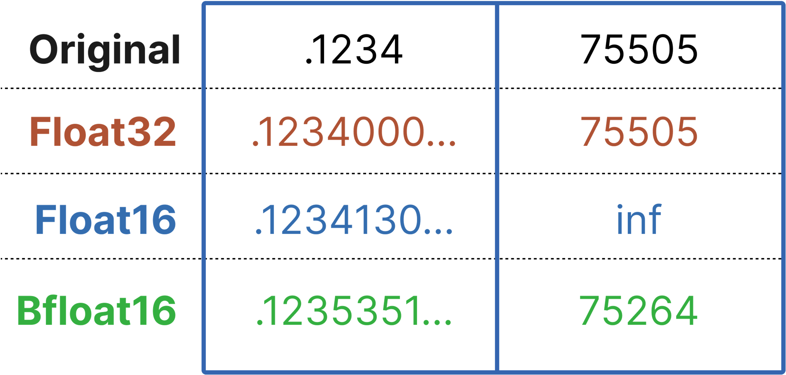

# 浅谈 RTN 模型量化: 非对称 vs 对称

> **RTN**（Round-to-Nearest）模型量化的背后究竟做了什么？这非常简单直观，后续的研究（GPTQ/AWQ/...）更像是对权重量化的范围作约束，本质上还是会使用类似的思想。
>
> 本文将以 **INT8** 为例，结合计算和代码演示，向你展示其中的一些原理。
>
> 相关论文: [LLM.int8(): 8-bit Matrix Multiplication for Transformers at Scale](https://arxiv.org/abs/2208.07339)，Background 会提到 “...where ⌊⌉ indicates **r**ounding **t**o the **n**earest integer.”
>
> 相关文章: [《07. 模型参数与显存的关系，以及不同精度的影响》](../Guide/07.%20探究模型参数与显存的关系以及不同精度造成的影响.md)
>
> [代码文件下载](../Demos/15.%20探究非对称量化和对称量化%20-%20INT8.ipynb)
>
> 在线链接：[Kaggle](https://www.kaggle.com/code/aidemos/15-int8) | [Colab](https://colab.research.google.com/drive/1aFlUL8jQZEAO2ZsMXJxbUqlIXGb0m0hC?usp=sharing)

## 目录

- [非对称量化步骤](#非对称量化步骤)
  - [1. 确定范围（Range）](#1-确定范围range)
  - [2. 计算缩放因子（Scaling Factor）和零点（Zero Point）](#2-计算缩放因子scaling-factor和零点zero-point)
  - [3. 量化（Quantization）](#3-量化quantization)
  - [4. 反量化（Dequantization）](#4-反量化dequantization)
- [对称量化步骤](#对称量化步骤)
  - [量化过程会丢失什么？](#量化过程会丢失什么)
- [代码示例](#代码示例)
  - [1. 绝对值的最大值不变，但最大值减少为 4.0](#1-绝对值的最大值不变但最大值减少为-40)
  - [2. 绝对值的最大值增加为 8.0](#2-绝对值的最大值增加为-80)
  - [非对称量化](#非对称量化)
  - [对称量化](#对称量化)
- [参考链接](#参考链接)
- [推荐阅读](#推荐阅读)
- [附录](#附录)

如果你在量化后试着打印模型参数，你会发现量化主要针对 **前馈层（Feed-Forward）** 和 **注意力中的投影层（Attention Projection Layers）** 进行。这一点在论文摘要中有提到: *“We develop a procedure for Int8 matrix multiplication for **feed-forward** and **attention projection layers in transformers**, which cut the memory needed for inference by half while retaining full precision performance.”*

简单来说，这意味着对**线性层（Linear Layers）** 进行量化，因为前馈层和投影层本质上都是线性变换。

```python
from transformers import AutoModelForCausalLM, BitsAndBytesConfig
import torch.nn as nn

model_name = 'gpt2-large'

# 将模型配置为以 8-bit 量化的方式加载
bnb_config = BitsAndBytesConfig(load_in_8bit=True)

# 加载模型，并根据设备自动分配
model = AutoModelForCausalLM.from_pretrained(
    model_name,
    quantization_config=bnb_config,
    device_map='auto'
)

# 打印模型的架构
print(model)

# 打印模型的参数名称和数据类型
print(f"\n打印模型 {model_name} 的参数信息:\n")
for name, param in model.named_parameters():
    print(f"参数名称: {name}, 数据类型: {param.dtype}")
```

**输出:**

```python
GPT2LMHeadModel(
  (transformer): GPT2Model(
    (wte): Embedding(50257, 1280)
    (wpe): Embedding(1024, 1280)
    (drop): Dropout(p=0.1, inplace=False)
    (h): ModuleList(
      (0-35): 36 x GPT2Block(
        (ln_1): LayerNorm((1280,), eps=1e-05, elementwise_affine=True)
        (attn): GPT2Attention(
          (c_attn): Linear8bitLt(in_features=1280, out_features=3840, bias=True)
          (c_proj): Linear8bitLt(in_features=1280, out_features=1280, bias=True)
          (attn_dropout): Dropout(p=0.1, inplace=False)
          (resid_dropout): Dropout(p=0.1, inplace=False)
        )
        (ln_2): LayerNorm((1280,), eps=1e-05, elementwise_affine=True)
        (mlp): GPT2MLP(
          (c_fc): Linear8bitLt(in_features=1280, out_features=5120, bias=True)
          (c_proj): Linear8bitLt(in_features=5120, out_features=1280, bias=True)
          (act): NewGELUActivation()
          (dropout): Dropout(p=0.1, inplace=False)
        )
      )
    )
    (ln_f): LayerNorm((1280,), eps=1e-05, elementwise_affine=True)
  )
  (lm_head): Linear(in_features=1280, out_features=50257, bias=False)
)

打印模型 gpt2-large 的参数信息:

参数名称: transformer.wte.weight, 数据类型: torch.float16
参数名称: transformer.wpe.weight, 数据类型: torch.float16
参数名称: transformer.h.0.ln_1.weight, 数据类型: torch.float16
参数名称: transformer.h.0.ln_1.bias, 数据类型: torch.float16
参数名称: transformer.h.0.attn.c_attn.weight, 数据类型: torch.int8
参数名称: transformer.h.0.attn.c_attn.bias, 数据类型: torch.float16
参数名称: transformer.h.0.attn.c_proj.weight, 数据类型: torch.int8
参数名称: transformer.h.0.attn.c_proj.bias, 数据类型: torch.float16
参数名称: transformer.h.0.ln_2.weight, 数据类型: torch.float16
参数名称: transformer.h.0.ln_2.bias, 数据类型: torch.float16
参数名称: transformer.h.0.mlp.c_fc.weight, 数据类型: torch.int8
参数名称: transformer.h.0.mlp.c_fc.bias, 数据类型: torch.float16
参数名称: transformer.h.0.mlp.c_proj.weight, 数据类型: torch.int8
参数名称: transformer.h.0.mlp.c_proj.bias, 数据类型: torch.float16
...
```

## 非对称量化步骤

非对称量化（Asymmetric Quantization）的特点是量化范围在数轴的正负方向上不对称。具体步骤如下: 

### 1. 确定范围（Range）

为了将 **FP32** 数值映射到 **INT8**，首先需要确定数值的最小值和最大值范围。这个范围通常通过分析模型某个部分或整个模型层在训练集上的数值分布来确定。

- **最小值 ($x_{\text{min}}$)**: 层输出的最小激活值。
- **最大值 ($x_{\text{max}}$)**: 层输出的最大激活值。

例如，如果某层的 **FP32** 输出范围为 $[-6.0, 6.0]$。

### 2. 计算缩放因子（Scaling Factor）和零点（Zero Point）

**INT8** 的取值范围是 $[-128, 127]$，总共有 **256** 个可能的值。因此，定义:

- $q_{\text{min}}$: **INT8** 的最小值，等于 -128。
- $q_{\text{max}}$: **INT8** 的最大值，等于 127。

- **缩放因子（scale）**:

$$
\text{scale} = \frac{x_{\text{max}} - x_{\text{min}}}{q_{\text{max}} - q_{\text{min}}} = \frac{6.0 - (-6.0)}{127 - (-128)} = \frac{12.0}{255} \approx 0.04705882
$$

  该缩放因子用于将浮点数映射到整数范围。

- **零点（zero\_point）**:

  零点用于对齐浮点数的零值到整数值。计算公式如下: 
  
  $`\text{zero\_point} = \text{round}\left(q_{\text{min}} - \frac{x_{\text{min}}}{\text{scale}}\right)`$

  代入数值: 
  
  $`\text{zero\_point} = \text{round}\left(-128 - \frac{-6.0}{0.04705882}\right) = \text{round}(-128 + 127.5) = \text{round}(-0.5) = 0`$

  需要注意的是，零点必须被限制在 $[q_{\text{min}}, q_{\text{max}}]$ 范围内。

### 3. 量化（Quantization）

将 **FP32** 数值根据缩放因子和零点转换为 **INT8** 数值: 

$$
\text{int8\\_value} = \text{round}\left(\frac{\text{fp32\\_value}}{\text{scale}}\right) + \text{zero\\_point}
$$

例如，对于一个 **FP32** 值 **3.0**，假设zero_point=0，计算方式如下: 

$$
\text{int8\\_value} = \text{round}\left(\frac{3.0}{0.04705882}\right) + 0 = \text{round}(63.75000478) = 64
$$

**看到 round 了吗？是的，这就是 RTN（Round-to-Nearest），中文又称之为：「四舍五入」。**

### 4. 反量化（Dequantization）

在推理过程中，有时需要将 **INT8** 值还原为近似的 **FP32** 值。这通过反量化完成，方法是使用相同的缩放因子，将 **INT8** 值映射回浮点数范围: 

$$
\text{fp32\\_value} = (\text{int8\\_value} - \text{zero\\_point}) \times \text{scale}
$$

由于在 **对称量化** 中 $\text{zero\\_point} = 0$，公式简化为: 

$$
\text{fp32\\_value} = \text{int8\\_value} \times \text{scale}
$$

例如，对于 **INT8** 值 **64**，通过反量化可以还原为:

$$
\text{fp32\\_value} = 64 \times 0.04705882 = 3.01176...\approx 3.0
$$


## 对称量化步骤

对称量化（Symmetric Quantization）的特点是量化范围在数轴的正负方向上对称。这意味着: 

- **零点（zero_point）** 被固定为 **0**（对于有符号数据类型，如 **torch.qint8**）。
- **缩放因子（scale）** 基于张量的绝对最大值计算，以确保量化后的整数范围覆盖张量的动态范围。

$$
\text{scale} = \frac{\max(|x_{\text{min}}|, |x_{\text{max}}|)}{(q_{\text{max}} - q_{\text{min}})/2} = \frac{6.0}{127.5} \approx 0.04705882
$$

> [!NOTE]
>
> 1. 其实都是一些很简单的概念，不用畏惧，没有理解的话尝试拿出纸笔，逐步代入数值，很快你就会迈过它。
>2. 在不同的文献中，对于缩放因子的定义可能不一致，有些在 **qint8** 类型上直接使用 `127` 作为分母，这是因为范围去除了 `-128`，不太需要关注这一点。
> 3. 什么是 **q**int8？**Quantized** int8。
>
> 3. 另外需要注意的是，文章的表述针对 **int8** 进行，而非 **uint8**。
>
>    | 数据类型 | 描述       | 范围          |
>    | -------- | ---------- | ------------- |
>    | int8     | 有符号整数 | $[-128, 127]$ |
>    | uint8    | 无符号整数 | $[0, 255]$    |


### 量化过程会丢失什么？

简单从位布局来看: 

**FP32:**

| 符号位（1位） | 指数位（8位） | 尾数位（23位） |
| :-----------: | :-----------: | :------------: |

**INT8:**

| 符号位（1位） | 整数位（7位） |
| :-----------: | :-----------: |

最直观的表现就是精度的丢失，从 FP32 量化到 INT8 再反量化为 FP32，在绝大多数的数值下都会丢失原有精度，这一点从之后的代码示例中可以清晰地看到。

下面是一张广为流传的图（来源于[推荐阅读](#推荐阅读)中文章的作者），可以辅助进行理解（FP32 vs FP16 vs BF16）：



## 代码示例

以下代码展示了量化和反量化的操作示例，包含使用PyTorch实现、根据之前公式自定义，以及模型量化的操作。

```python
import torch
import torch.nn as nn
import torch.quantization

# 假设 FP32 的张量
fp32_values = torch.tensor([3.0, -5.5, 0.0, 6.0, -6.0, 2.5], dtype=torch.float32)
print(f"FP32 的示例张量: {fp32_values}\n")

# 定义 PyTorch 的量化和反量化函数
def pytorch_quantize(fp32_tensor):
    # 使用 min-max 范围计算缩放因子，指定 dtype 为 torch.qint8
    q_params = torch.quantization.MinMaxObserver(dtype=torch.qint8)
    q_params(fp32_tensor)
    scale, zero_point = q_params.calculate_qparams()

    # 量化
    int8_tensor = torch.quantize_per_tensor(fp32_tensor, scale.item(), zero_point.item(), dtype=torch.qint8)
    return int8_tensor, scale.item(), zero_point

def pytorch_dequantize(int8_tensor):
    # 反量化
    fp32_tensor = int8_tensor.dequantize()
    return fp32_tensor

# 量化并获取 PyTorch 结果
int8_tensor, scale, zero_point = pytorch_quantize(fp32_values)
print("PyTorch 量化后的 INT8 数值: ", int8_tensor.int_repr())
print("PyTorch 使用的 scale:", scale, "zero_point:", zero_point)

# 反量化
recovered_fp32_pytorch = pytorch_dequantize(int8_tensor)
print("PyTorch 反量化恢复后的 FP32 数值: ", recovered_fp32_pytorch)

print("\n=====================\n")

# 对比与自定义的量化方式
def custom_quantize_compare(fp32_values):
    # 获取张量数值的最小值和最大值
    x_min, x_max = fp32_values.min().item(), fp32_values.max().item()
    
    # 定义量化后整数数值的范围
    qmin, qmax = -128, 127  # 对应 torch.qint8
    
    # 计算 scale
    scale_custom = (x_max - x_min) / (qmax - qmin)
    
    # 非对称量化
    initial_zero_point = qmin - x_min / scale_custom
    zero_point_custom = int(round(initial_zero_point))
    
    # 将 zero_point 限制在 [qmin, qmax] 范围内
    zero_point_custom = max(qmin, min(qmax, zero_point_custom))
    
    print("自定义计算的 scale:", scale_custom, "zero_point:", zero_point_custom)
    
    def quantize(fp32_tensor, scale, zero_point):
        # 计算量化值
        int8_tensor = torch.round(fp32_tensor / scale) + zero_point
        # 限制在 [qmin, qmax] 范围内
        int8_tensor = torch.clamp(int8_tensor, qmin, qmax)
        return int8_tensor.to(torch.int8)
    
    def dequantize(int8_tensor, scale, zero_point):
        # 反量化
        fp32_tensor = (int8_tensor.float() - zero_point) * scale
        return fp32_tensor
    
    # 量化
    int8_values_custom = quantize(fp32_values, scale_custom, zero_point_custom)
    print("自定义对称量化后的 INT8 数值: ", int8_values_custom)
    
    # 反量化
    recovered_fp32_custom = dequantize(int8_values_custom, scale_custom, zero_point_custom)
    print("自定义对称反量化恢复后的 FP32 数值: ", recovered_fp32_custom)

# 运行自定义量化并比较
custom_quantize_compare(fp32_values)

print("\n=====================\n")

# 使用 fp32_values 作为线性层参数

# 定义一个简单的线性模型
class SimpleLinearModel(nn.Module):
    def __init__(self, weights, bias=None):
        super(SimpleLinearModel, self).__init__()
        # 假设输入特征数为6，输出特征数为1，用于匹配之前定义的张量，你也可以试试 (1, 6)，记得对应修改 weights.view(6, 1)
        self.linear = nn.Linear(6, 1, bias=False)
        # 初始化权重
        self.linear.weight = nn.Parameter(weights.view(1, 6))  # 权重形状为 [out_features, in_features]
    
    def forward(self, x):
        return self.linear(x)

# 创建 FP32 模型
fp32_weights = fp32_values  # [6]
model_fp32 = SimpleLinearModel(fp32_weights)

# 打印 FP32 模型的权重
print("FP32 模型的权重:\n", model_fp32.linear.weight)

# 使用默认量化配置
model_fp32.qconfig = torch.quantization.get_default_qconfig('fbgemm')

# 准备量化
torch.quantization.prepare(model_fp32, inplace=True)

# 量化权重
torch.quantization.convert(model_fp32, inplace=True)

# 打印量化后的权重
print("量化后的 INT8 模型的权重:\n", model_fp32.linear.weight())

# 获取量化参数
weight_observer = model_fp32.linear.weight().q_per_channel_scales()
weight_zero_points = model_fp32.linear.weight().q_per_channel_zero_points()
print("量化权重的 scale:", weight_observer)
print("量化权重的 zero_point:", weight_zero_points)
```

**输出: **

```python
FP32 的示例张量: tensor([ 3.0000, -5.5000,  0.0000,  6.0000, -6.0000,  2.5000])

PyTorch 量化后的 INT8 数值:  tensor([  64, -117,    0,  127, -128,   53], dtype=torch.int8)
PyTorch 使用的 scale: 0.0470588244497776 zero_point: 0
PyTorch 反量化恢复后的 FP32 数值:  tensor([ 3.0118, -5.5059,  0.0000,  5.9765, -6.0235,  2.4941])

=====================

自定义计算的 scale: 0.047058823529411764 zero_point: 0
自定义量化后的 INT8 数值:  [  64 -117    0  127 -128   53]
自定义反量化恢复后的 FP32 数值:  [ 3.01176471 -5.50588235  0.          5.97647059 -6.02352941  2.49411765]

=====================

FP32 模型的权重:
 Parameter containing:
tensor([[ 3.0000, -5.5000,  0.0000,  6.0000, -6.0000,  2.5000]],
       requires_grad=True)
量化后的 INT8 模型的权重:
 tensor([[ 3.0118, -5.5059,  0.0000,  5.9765, -6.0235,  2.4941]], size=(1, 6),
       dtype=torch.qint8, quantization_scheme=torch.per_channel_affine,
       scale=tensor([0.0471], dtype=torch.float64), zero_point=tensor([0]),
       axis=0)
量化权重的 scale: tensor([0.0471], dtype=torch.float64)
量化权重的 zero_point: tensor([0])
```

你需要注意到，在这里我们**取巧**地设计了 `fp32_values`，使得 `abs(max(fp32_values))==abs(min(fp32_values))==6.0`，且`mean(fp32_values)==0`，从而对你**混淆**了完全不同的两种量化方式：从结果上看是一致的。

为什么说取巧呢？尝试将`fp32_values`分别定义为 `1` 和 `2` 的形式执行之前的代码: 

```diff
# 0
- fp32_values = torch.tensor([3.0, -5.5, 0.0, 6.0, -6.0, 2.5], dtype=torch.float32)
# 1
+ fp32_values = torch.tensor([3.0, -5.5, 0.0, 4.0, -6.0, 2.5], dtype=torch.float32)
# 2
+ fp32_values = torch.tensor([3.0, -5.5, 0.0, 8.0, -6.0, 2.5], dtype=torch.float32)
```

现在再来看看输出: 

### 1. 绝对值的最大值不变，但最大值减少为 4.0

```python
FP32 的示例张量: tensor([ 3.0000, -5.5000,  0.0000,  4.0000, -6.0000,  2.5000])

PyTorch 量化后的 INT8 数值:  tensor([ 101, -115,   25,  127, -128,   89], dtype=torch.int8)
PyTorch 使用的 scale: 0.03921568766236305 zero_point: 25
PyTorch 反量化恢复后的 FP32 数值:  tensor([ 2.9804, -5.4902,  0.0000,  4.0000, -6.0000,  2.5098])

=====================

自定义计算的 scale: 0.0392156862745098 zero_point: 25
自定义量化后的 INT8 数值:  [ 101 -115   25  127 -128   89]
自定义反量化恢复后的 FP32 数值:  [2.98039216 4.54901961 0.         4.         4.03921569 2.50980392]

=====================

FP32 模型的权重:
 Parameter containing:
tensor([[ 3.0000, -5.5000,  0.0000,  4.0000, -6.0000,  2.5000]],
       requires_grad=True)
量化后的 INT8 模型的权重:
 tensor([[ 3.0118, -5.5059,  0.0000,  4.0000, -6.0235,  2.4941]], size=(1, 6),
       dtype=torch.qint8, quantization_scheme=torch.per_channel_affine,
       scale=tensor([0.0471], dtype=torch.float64), zero_point=tensor([0]),
       axis=0)
量化权重的 scale: tensor([0.0471], dtype=torch.float64)
量化权重的 zero_point: tensor([0])
```

可以看到，「前两种方法」的 `scale` 变了，而「模型量化」的 `scale` 却没变，带着疑惑继续阅读下去。

### 2. 绝对值的最大值增加为 8.0

```python
FP32 的示例张量: tensor([ 3.0000, -5.5000,  0.0000,  8.0000, -6.0000,  2.5000])

PyTorch 量化后的 INT8 数值:  tensor([  36, -119,  -19,  127, -128,   27], dtype=torch.int8)
PyTorch 使用的 scale: 0.054901961237192154 zero_point: -19
PyTorch 反量化恢复后的 FP32 数值:  tensor([ 3.0196, -5.4902,  0.0000,  8.0157, -5.9843,  2.5255])

=====================

自定义计算的 scale: 0.054901960784313725 zero_point: -19
自定义量化后的 INT8 数值:  [  36 -119  -19  127 -128   27]
自定义反量化恢复后的 FP32 数值:  [ 3.01960784 -5.49019608  0.         -6.03921569 -5.98431373  2.5254902 ]

=====================

FP32 模型的权重:
 Parameter containing:
tensor([[ 3.0000, -5.5000,  0.0000,  8.0000, -6.0000,  2.5000]],
       requires_grad=True)
量化后的 INT8 模型的权重:
 tensor([[ 3.0118, -5.5216,  0.0000,  7.9686, -6.0235,  2.5098]], size=(1, 6),
       dtype=torch.qint8, quantization_scheme=torch.per_channel_affine,
       scale=tensor([0.0627], dtype=torch.float64), zero_point=tensor([0]),
       axis=0)
量化权重的 scale: tensor([0.0627], dtype=torch.float64)
量化权重的 zero_point: tensor([0])
```

所有方法的 `scale` 都改变了，且「前两种方法」还是保持一致，这说明，「前两种方法」和后面的「模型量化」采用的方式不同。

实际上，当前代码的「前两种方法」和「模型量化」分别对应于**非对称量化**和**对称量化**，如果你想保持一致，参考下方的代码进行修改。

### 非对称量化

修改模型量化方法为非对称。

```python
model_fp32 = SimpleLinearModel(fp32_weights)

# 打印 FP32 模型的权重
print("FP32 模型的权重:\n", model_fp32.linear.weight)

# ------------------------ 修改部分开始 ------------------------

import torch.quantization as quant

# 自定义的 qconfig，使用非对称量化
custom_qconfig = quant.QConfig(
    activation=quant.MinMaxObserver.with_args(dtype=torch.quint8, qscheme=torch.per_tensor_affine),
    weight=quant.MinMaxObserver.with_args(dtype=torch.qint8, qscheme=torch.per_tensor_affine)
)

# 应用自定义的 qconfig 到模型
model_fp32.qconfig = custom_qconfig

# 插入量化准备步骤
quant.prepare(model_fp32, inplace=True)

# 量化权重
quant.convert(model_fp32, inplace=True)

# 打印量化后的权重
quantized_weight = model_fp32.linear.weight()
print("量化后的 INT8 模型的权重（int_repr）: \n", quantized_weight.int_repr())
print("量化权重的 scale:", quantized_weight.q_scale())
print("量化权重的 zero_point:", quantized_weight.q_zero_point())
# ------------------------ 修改部分结束 ------------------------

```

### 对称量化

对三种方式分别进行以下修改: 

1. 指定 MinMaxObserver() 的 qscheme 参数为 torch.per_tensor_symmetric。
2. 在自定义量化函数中调整缩放因子的计算方式，并固定 zero_point 为 0。
3. 在模型量化配置 (qconfig) 中指定对称量化方案。

```python
import torch
import torch.nn as nn
import torch.quantization

# 假设 FP32 的张量
fp32_values = torch.tensor([3.0, -5.5, 0.0, 6.0, -6.0, 2.5], dtype=torch.float32)
print(f"FP32 的示例张量: {fp32_values}\n")

# 定义 PyTorch 的量化和反量化函数（对称量化）
def pytorch_quantize_symmetric(fp32_tensor):
    # 使用 MinMaxObserver 计算缩放因子，指定 dtype 为 torch.qint8，使用对称量化
    q_params = torch.quantization.MinMaxObserver(
        dtype=torch.qint8, qscheme=torch.per_tensor_symmetric
    )
    q_params(fp32_tensor)
    scale, zero_point = q_params.calculate_qparams()

    # 量化
    int8_tensor = torch.quantize_per_tensor(fp32_tensor, scale.item(), zero_point.item(), dtype=torch.qint8)
    return int8_tensor, scale.item(), zero_point

def pytorch_dequantize(int8_tensor):
    # 反量化
    fp32_tensor = int8_tensor.dequantize()
    return fp32_tensor

# 量化并获取 PyTorch 结果（对称量化）
int8_tensor, scale, zero_point = pytorch_quantize_symmetric(fp32_values)
print("PyTorch 对称量化后的 INT8 数值：", int8_tensor.int_repr())
print("PyTorch 使用的 scale:", scale, "zero_point:", zero_point)

# 反量化
recovered_fp32_pytorch = pytorch_dequantize(int8_tensor)
print("PyTorch 反量化恢复后的 FP32 数值：", recovered_fp32_pytorch)

print("\n=====================\n")

# 对比与自定义的量化方式（对称量化）
def custom_quantize_compare_symmetric(fp32_values):
    # 获取张量的绝对最大值
    x_max = fp32_values.abs().max().item()
    
    # 定义量化后整数数值的范围
    qmin, qmax = -128, 127  # 对应 torch.qint8
    
    # 使用 PyTorch 的方式计算 scale
    scale_custom = x_max / 127.5  # PyTorch源码：scale = max_val_pos / (float(quant_max - quant_min) / 2)
    
    # 对称量化时，zero_point 固定为 0
    zero_point_custom = 0
    
    print("自定义计算的 scale:", scale_custom, "zero_point:", zero_point_custom)
    
    # 使用 torch 的 round 函数以匹配 PyTorch 的量化行为
    def quantize(fp32_tensor, scale, zero_point):
        # 计算量化值
        int8_tensor = torch.round(fp32_tensor / scale) + zero_point
        # 限制在 [qmin, qmax] 范围内
        int8_tensor = torch.clamp(int8_tensor, qmin, qmax)
        return int8_tensor.to(torch.int8)
    
    def dequantize(int8_tensor, scale, zero_point):
        # 反量化
        fp32_tensor = (int8_tensor.float() - zero_point) * scale
        return fp32_tensor
    
    # 量化
    int8_values_custom = quantize(fp32_values, scale_custom, zero_point_custom)
    print("自定义对称量化后的 INT8 数值：", int8_values_custom)
    
    # 反量化
    recovered_fp32_custom = dequantize(int8_values_custom, scale_custom, zero_point_custom)
    print("自定义对称反量化恢复后的 FP32 数值：", recovered_fp32_custom)
    
    return recovered_fp32_custom  # 返回以便后续使用

# 运行自定义对称量化并比较
print("运行自定义对称量化并比较：")
recovered_fp32_custom = custom_quantize_compare_symmetric(fp32_values)

print("\n=====================\n")

# 使用 fp32_values 作为线性层参数

# 定义一个简单的线性模型
class SimpleLinearModel(nn.Module):
    def __init__(self, weights, bias=None):
        super(SimpleLinearModel, self).__init__()
        # 假设输入特征数为6，输出特征数为1
        self.linear = nn.Linear(6, 1, bias=False)
        # 初始化权重
        with torch.no_grad():
            self.linear.weight = nn.Parameter(weights.view(1, 6))  # 权重形状为 [out_features, in_features]
    
    def forward(self, x):
        return self.linear(x)

# 创建 FP32 模型
fp32_weights = fp32_values  # [6]
model_fp32 = SimpleLinearModel(fp32_weights)

# 打印 FP32 模型的权重
print("FP32 模型的权重:\n", model_fp32.linear.weight)

# 和之前非对称保持一致方便对比

import torch.quantization as quant

# 自定义的 qconfig，使用对称量化
custom_qconfig = quant.QConfig(
    activation=quant.MinMaxObserver.with_args(
        dtype=torch.quint8, qscheme=torch.per_tensor_symmetric
    ),
    weight=quant.MinMaxObserver.with_args(
        dtype=torch.qint8, qscheme=torch.per_tensor_symmetric
    )
)

# 应用自定义的 qconfig 到模型，结果和model_fp32.qconfig = torch.quantization.get_default_qconfig('fbgemm')一致
model_fp32.qconfig = custom_qconfig

# 准备量化
quant.prepare(model_fp32, inplace=True)

# 量化权重
quant.convert(model_fp32, inplace=True)

# 打印量化后的权重
quantized_weight = model_fp32.linear.weight()
print("量化后的 INT8 模型的权重（int_repr）：\n", quantized_weight.int_repr())
print("量化权重的 scale:", quantized_weight.q_scale())
print("量化权重的 zero_point:", quantized_weight.q_zero_point())
```

你可能会注意到 **127.5** 这个奇怪的数值，PyTorch 中的[源代码](https://github.com/pytorch/pytorch/blob/55c343fa3a49cd6b8a774e8419f7843063e2a1ea/torch/ao/quantization/observer.py#L362)或许能够解决你的疑惑，完整源码见附录部分: 

```python
scale = max_val_pos / (float(quant_max - quant_min) / 2)
```

## 参考链接

[observer.py](https://github.com/pytorch/pytorch/blob/55c343fa3a49cd6b8a774e8419f7843063e2a1ea/torch/ao/quantization/observer.py#L362)

## 推荐阅读

[A Visual Guide to Quantization](https://www.maartengrootendorst.com/blog/quantization/) 在完成攥写后我发现了这篇非常棒的文章，推荐大家阅读，它将更深入且生动地带你进一步理解量化。

## 附录

> torch.ao.quantization.observer.UniformQuantizationObserverBase._calculate_qparams()

```python
def _calculate_qparams(
     self, min_val: torch.Tensor, max_val: torch.Tensor
 ) -> Tuple[torch.Tensor, torch.Tensor]:
     r"""Calculates the quantization parameters, given min and max
     value tensors. Works for both per tensor and per channel cases

     Args:
         min_val: Minimum values per channel
         max_val: Maximum values per channel

     Returns:
         scales: Scales tensor of shape (#channels,)
         zero_points: Zero points tensor of shape (#channels,)
     """
     # Functionally equivalent to 'determine_qparams' in utils.py. Observers must be torchscriptable however and qscheme
     # as far as I can tell is not allowed to passed as a parameter in torchscript functions. This makes refactoring observer
     # to use this utility a massive pain and very gross. For now Im opting just to duplicate as this code
     # seems unlikey to change (last update over 1 year ago) and when torchscript is fully deprecated we can refactor.
     # TODO(jakeszwe, jerryzh168)
     if not check_min_max_valid(min_val, max_val):
         return torch.tensor([1.0], device=min_val.device.type), torch.tensor([0], device=min_val.device.type)

     quant_min, quant_max = self.quant_min, self.quant_max
     min_val_neg = torch.min(min_val, torch.zeros_like(min_val))
     max_val_pos = torch.max(max_val, torch.zeros_like(max_val))

     device = min_val_neg.device
     scale = torch.ones(min_val_neg.size(), dtype=torch.float32, device=device)
     zero_point = torch.zeros(min_val_neg.size(), dtype=torch.int64, device=device)

     if (
         self.qscheme == torch.per_tensor_symmetric
         or self.qscheme == torch.per_channel_symmetric
     ):
         max_val_pos = torch.max(-min_val_neg, max_val_pos)
         scale = max_val_pos / (float(quant_max - quant_min) / 2)
         scale = torch.max(scale, self.eps)
         if self.dtype in [torch.quint8, torch.uint8]:
             if self.has_customized_qrange:
                 # When customized quantization range is used, down-rounded midpoint of the range is chosen.
                 zero_point = zero_point.new_full(
                     zero_point.size(), (quant_min + quant_max) // 2
                 )
             else:
                 zero_point = zero_point.new_full(zero_point.size(), 128)
     elif self.qscheme == torch.per_channel_affine_float_qparams:
         scale = (max_val - min_val) / float(quant_max - quant_min)
         scale = torch.where(scale > self.eps, scale, torch.ones_like(scale))
         # We use the quantize function
         # xq = Round(Xf * inv_scale + zero_point),
         # setting zero_point to (-1 * min *inv_scale) we get
         # Xq = Round((Xf - min) * inv_scale)
         zero_point = -1 * min_val / scale
     else:
         scale = (max_val_pos - min_val_neg) / float(quant_max - quant_min)
         scale = torch.max(scale, self.eps)
         zero_point = quant_min - torch.round(min_val_neg / scale).to(torch.int)
         zero_point = torch.clamp(zero_point, quant_min, quant_max)

     # For scalar values, cast them to Tensors of size 1 to keep the shape
     # consistent with default values in FakeQuantize.
     if len(scale.shape) == 0:
         # TODO: switch to scale.item() after adding JIT support
         scale = torch.tensor([float(scale)], dtype=scale.dtype, device=device)
     if len(zero_point.shape) == 0:
         # TODO: switch to zero_point.item() after adding JIT support
         zero_point = torch.tensor(
             [int(zero_point)], dtype=zero_point.dtype, device=device
         )
         if self.qscheme == torch.per_channel_affine_float_qparams:
             zero_point = torch.tensor(
                 [float(zero_point)], dtype=zero_point.dtype, device=device
             )

     return scale, zero_point
```

