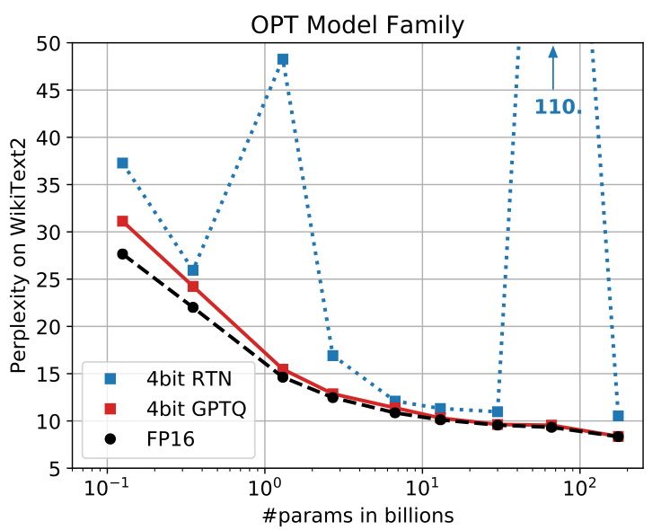
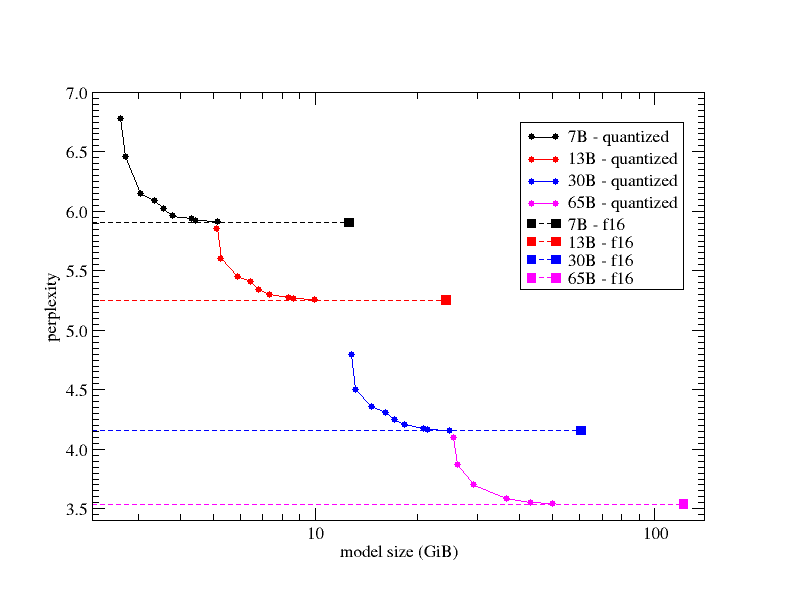
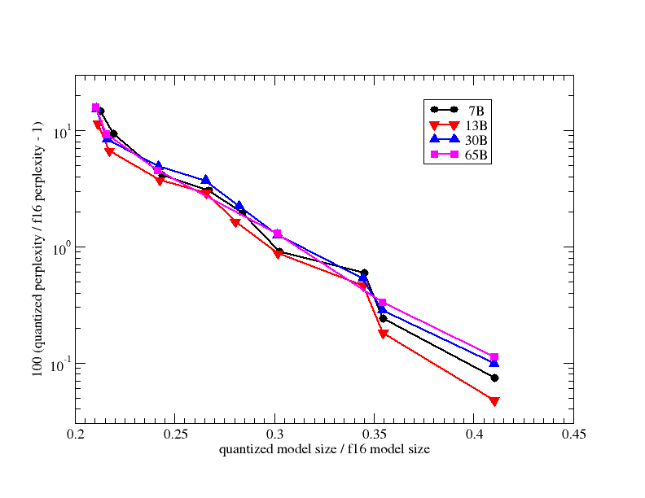
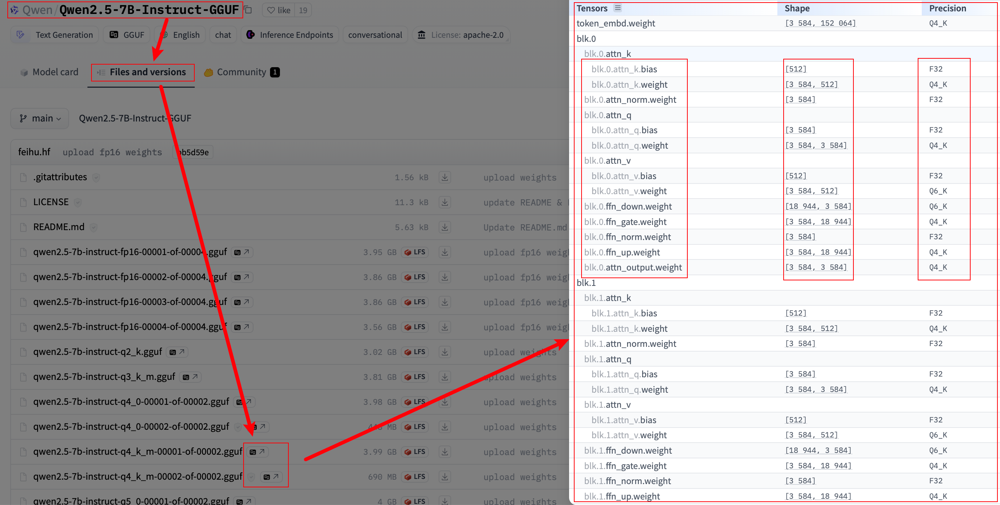

# 模型量化技术概述及 GGUF & GGML 文件格式解析

> 通过阅读本文，你将能够：
>
> 1. 简单了解  RTN、GPTQ、AWQ 和 GGUF（GGML）。
> 2. 理解 PPL（Perplexity）是什么。
> 3. 掌握 GGUF（GGML）文件的命名规则。
> 4. 认识 k-quants 量化方法。
> 5. 分清 Q4_0、Q4_1、Q4_K 和 Q4_K_M。
> 6. 学会怎么从 Hugging Face 直接查看模型权重组成。
>
> 这是一个浅显的入门文章，每个模块都提供了相关的参考链接，如果你对其感兴趣可以深入探索。

## 目录

- [RTN vs GPTQ vs AWQ vs GGUF（GGML） 速览](#rtn-vs-gptq-vs-awq-vs-ggufggml-速览)
- [什么是 PPL？](#什么是-ppl)
- [理解 GGUF 模型文件名](#理解-gguf-模型文件名)
- [新的量化方法：k-quants](#新的量化方法k-quants)
   - [为什么需要新的量化方法？](#为什么需要新的量化方法)
   - [k-quants 量化类型有哪些？](#k-quants-量化类型有哪些)
   - [性能表现如何？](#性能表现如何)
   - [QA](#qa)
      - [1. 相同位数下量化方法的区别？](#1-相同位数下量化方法的区别)
      - [2. 7B-Q4_K_M 和 13B_Q2_K，哪个更好？](#2-7b-q4_k_m-和-13b_q2_k哪个更好)
- [GGUF 文件结构](#gguf-文件结构)
- [直观感受 GGUF 文件的权重](#直观感受-gguf-文件的权重)
- [文件名解析答案](#文件名解析答案)
- [附录](#附录)
   - [GGUF](#gguf)
      - [性能和大小简表](#性能和大小简表)
      - [完整类型表](#完整类型表)
      - [文件结构](#文件结构)

## RTN vs GPTQ vs AWQ vs GGUF（GGML） 速览

> **参考链接**：[GPTQ - 2210.17323](https://arxiv.org/pdf/2210.17323) | [AWQ - 2306.00978](https://arxiv.org/pdf/2306.00978) | [GGML](https://github.com/ggerganov/ggml/blob/master/docs/gguf.md#historical-state-of-affairs) | [GGUF - docs](https://github.com/ggerganov/ggml/blob/master/docs/gguf.md) | [What is GGUF and GGML?](https://medium.com/@phillipgimmi/what-is-gguf-and-ggml-e364834d241c)

- **RTN (Round-to-Nearest)**

  RTN 是一种直接将权重四舍五入到目标位宽的量化方法，简单但可能带来显著的量化误差。具体可见[《17. 浅谈 RTN 模型量化：非对称 vs 对称》](../Guide/17.%20浅谈模型量化：非对称%20vs%20对称.md)。

- **GPTQ** (Generalized **Post-Training** Quantization)

  GPTQ 是一种基于近似二阶信息的**后训练**（PTQ）量化技术，能够将模型的权重位宽降低到 3-4 bits，在大幅减少模型大小和计算成本的同时还能保持模型性能。在极端情况下还能量化到 2 bits 甚至 3 进制，但会有一定的性能损失。

  下图展示了 4-bit GPTQ 与 RTN 在 WikiText2 数据集上的 PPL 对比：

  

- **AWQ** (**Activation-aware** Weight Quantization)

  

  AWQ 不会量化模型的所有权重，保留了对模型性能重要的一小部分权重，大大减少了量化损失。如图所示，这里比较极端，是 INT3 量化：

  - 图 a：**RTN量化（Round-to-Nearest）**

    将权重直接四舍五入到目标位宽，导致性能明显下降，PPL 达到 43.2。

  - 图 b：**保护 1% 的显著权重，使用混合精度形式**

    这里展示了一种改进策略，即保留 1% 最重要的权重通道使用高精度（FP16），其余使用低精度（INT3）。PPL 降低到 13.0。虽然这种方法能保住性能，但由于需要不同精度切换，硬件效率不高。但这一策略证明了并非所有权重都对模型性能同等重要。

  - 图 c：**AWQ 提出的通道缩放量化方法**

    AWQ 通过**通道缩放**保护显著权重，利用激活分布找到重要的权重并缩放它们的值来减少量化误差。相比混合精度形式，AWQ 提升了硬件效率，同时性能与图 b 一致，PPL 也为 13.0。

- **GGML** (GPT-Generated Model Language)

  「显存不够内存来凑」，这是一种文件格式，支持在 CPU 和 GPU 上进行推理。

- **GGUF** (GPT-Generated Unified Format)：

  GGUF 是 GGML 的升级版，提升了扩展和兼容性。

不要因为 ChatGPT 的存在将 GPT 的概念完全映射为它，GPT（Generative Pre-trained Transformer）指的是**生成式预训练 Transformer**。

> [!NOTE]
>
> ## 什么是 PPL？
>
> > **参考链接**： [Hugging Face - docs](https://huggingface.co/docs/transformers/perplexity#perplexity-of-fixed-length-models)。
>
> PPL 是 **Perplexity（困惑度）** 的缩写，它是衡量语言模型性能的常用指标，特别是在评估**经典语言模型**（**自回归**或**因果语言模型**）的生成任务时。
>
> **PPL** 主要用于衡量模型对给定文本的预测能力。PPL 反映了模型在处理一段文本时的“不确定性”或“困惑度”，数值越低，表示模型越擅长预测下一个词汇。其定义为序列的指数化平均负对数似然。如果有一个标记化序列 $X = (x_0, x_1, \dots, x_t)$, 那么该序列的 PPL 定义为：
>
> $\text{PPL}(X) = \exp \left( -\frac{1}{t} \sum_{i=1}^{t} \log p_\theta (x_i \mid x_{<i}) \right)$
>
> 其中, $\log p_\theta (x_i \mid x_{<i})$ 是模型在给定前 $i-1$ 个词 $x_{<i}$ 的条件下，对第 $i$ 个词 $x_i$ 的对数似然。
>
> - **较低的 PPL**：表示模型更准确地预测了文本中的词汇，模型对语言结构的掌握更好。
> - **较高的 PPL**：表示模型对文本的预测较为不确定，困惑度高，模型的表现较差。
>
> 在 AWQ 和 GPTQ 的量化研究中，PPL 被用来评估模型在不同量化位宽下的性能表现，例如 3-bit 或 4-bit 量化对模型预测能力的影响。
>
> **计算固定长度模型的 PPL**
>
> 如果不受模型上下文长度的限制，我们可以通过自回归地分解序列，并在每一步根据整个前序子序列来评估模型的困惑度，如下所示：
>
> 
>
> 但是在实际中，模型的上下文长度是有限的，例如 [GPT-2](https://huggingface.co/docs/transformers/main/en/model_doc/gpt2) 的最大长度为 1024 个标记。因此，当 $t$ 超过 1024 时，我们无法直接计算 $p_\theta(x_t | x_{<t})$。
>
> 通常，序列会被分割为最大输入大小的子序列。如果最大输入大小为 $k$, 我们就基于前 $k-1$ 个标记来近似计算 $x_t$ 的似然。另一种近似方法是将序列分割为不重叠的块，独立累加每个段的分解对数似然：
>
> 
>
> 这种方法计算速度快，但从图示可以看出存在的问题，在新的一个窗口开始时，上下文是有限的，这会导致更高的 PPL。所以很自然的想到**滑动窗口策略**。
>
> 
>
> 这种策略更接近真实的序列概率分解，并且通常会得到更低的 PPL。缺点是它需要为语料库中的每个标记进行单独的前向传播。一个折衷方案是采用**跨步滑动窗口**，即通过更大的步幅（Stride）移动上下文，而不是每次滑动一个标记（Token）。
>

## 理解 GGUF 模型文件名

> **参考链接**：[GGUF - docs](https://github.com/ggerganov/ggml/blob/master/docs/gguf.md) 

为了方便人们快速识别模型的关键信息，GGUF 文件命名遵循以下规则：

```
<BaseName><SizeLabel><FineTune><Version><Encoding><Type><Shard>.gguf
```

具体说明如下：

- **BaseName**：模型的基础名称或架构名称，例如 `Llama`。

- **SizeLabel**：模型的参数规模标签，表示模型的参数数量及可能的专家数量，格式为 `<expertCount>x<count><scale-prefix>`。

  - **expertCount**：表示专家模型中的专家数量。如果模型没有使用 Mixture of Experts (MoE) 架构，可以省略。

  - **Count**：

    - `Q`: 表示百万亿（quadrillion）参数。
    - `T`: 表示万亿（trillion）参数。
    - `B`: 表示十亿（billion）参数。
    - `M`: 表示百万（million）参数。
    - `K`: 表示千（thousand）参数。

    当前主流大模型多为 B 级参数（十亿级），但未来 T（万亿级）模型可能会成为主流。

    更详细的内容见[附录](#附录)部分。

  - **附加属性**：在某些情况下，`-<attributes><count><scale-prefix>` 可以进一步细化模型的描述，添加额外的参数，例如 `Q`, `K`, `T`，这些表示量化方式或其他模型特性。例如：

    - `Q4`: 表示 4-bit 量化。

    示例：

    - `7B`: 表示 70 亿参数的模型。
    - `4x3T`: 表示有 4 个专家的 3 万亿参数模型。
    - `2x10B-Q4`: 表示有 2 个专家且采用 Q4 量化的 100 亿参数模型。

- **FineTune**：微调目标描述（如 `Chat`、`Instruct`）。

- **Version**（可选）：模型的版本号，格式为 `v<Major>.<Minor>`，没提供则假设为 `v1.0`。

- **Encoding**：权重编码方案（如 `Q4_0` 表示 4-bit 量化）。

- **Type**：文件类型，如 `LoRA`（适配器）或 `vocab`（仅包含词汇表）。

- **Shard**（可选）：模型分片信息，格式为 `<ShardNum>-of-<ShardTotal>`，适用于大型模型。例如 `00003-of-00009` 表示第 3 个分片，共 9 个分片，注意分片编号从 `00001` 开始，而非 `00000`。

> [!TIP]
>
> 验证命名是否符合规范的正则：
>
> ```
> ^(?<BaseName>[A-Za-z0-9\s]*(?:(?:-(?:(?:[A-Za-z\s][A-Za-z0-9\s]*)|(?:[0-9\s]*)))*))-(?:(?<SizeLabel>(?:\d+x)?(?:\d+\.)?\d+[A-Za-z](?:-[A-Za-z]+(\d+\.)?\d+[A-Za-z]+)?)(?:-(?<FineTune>[A-Za-z0-9\s-]+))?)?-(?:(?<Version>v\d+(?:\.\d+)*))(?:-(?<Encoding>(?!LoRA|vocab)[\w_]+))?(?:-(?<Type>LoRA|vocab))?(?:-(?<Shard>\d{5}-of-\d{5}))?\.gguf$
> ```

尝试解析以下三个文件名：

1. **Mixtral-8x7B-v0.1-KQ2.gguf**
2. **Hermes-2-Pro-Llama-3-8B-F16.gguf**
3. **Grok-100B-v1.0-Q4_0-00003-of-00009.gguf**

在文章的末尾会给出解析答案，现在停下来思考一下。

## 新的量化方法：k-quants

> **参考链接**：[PR #1684 (k-quants) ](https://github.com/ggerganov/llama.cpp/pull/1684)
>
> 这个模块主要是解决你可能会遇到的文件名疑惑，比如 Q4_0， Q4_1，Q4_K，Q4_K_M。

GGML 在 23 年引入了一系列新的量化方法，被称为 **k-quants**，包括 2-bit 到 6-bit 的量化方法，以及它们的混合量化策略。这些方法的引入旨在进一步缩小模型大小，同时尽可能地保持模型性能。这一改进最初由 [#1240](https://github.com/ggerganov/llama.cpp/issues/1240) 和 [#1256](https://github.com/ggerganov/llama.cpp/issues/1256) 提出，并在 PR [#1684](https://github.com/ggerganov/llama.cpp/pull/1684) 中实现。

### 为什么需要新的量化方法？

为了理解这些新的量化方法的意义，我们来看下面的图表：



该图展示了在 `wikitext` 数据集上，不同模型大小（以 GiB 为单位）与其 PPL （Perplexity，PPL）之间的关系。横轴为模型大小（对数尺度），纵轴为 PPL 。图中的不同颜色代表不同大小的 LLaMA 模型（黑色 7B、红色 13B、蓝色 30B、品红 65B），相应颜色的正方形表示原始的 `FP16` 模型。

从图中可以看出， PPL 基本上是模型大小的平滑函数。也就是说，通过调整量化策略，我们可以在模型大小和性能之间找到一个平衡点。在计算资源有限的情况下（例如内存或显存限制），新的量化方法允许我们选择最适合的模型（这个工作做得真好）。

**值得注意的是，6-bit 量化模型的 PPL 与原始 `FP16` 模型的差异在 0.1% 以内或者更好，性能几乎没有损失。**

**另一个有趣的观察是，相对的量化误差（以 PPL 衡量）并不会随着基础模型参数数量的增加而减少。**

我们可能会假设随着模型规模的增大，量化误差会降低。然而，实际情况是，对于 30B 和 65B 模型，相对量化误差又回到了 7B 模型的水平。这个现象可以通过下面的图表来说明：



该图提供了上述数据的另一种视角，显示了相对于 `FP16` 模型的相对误差百分比，横轴是量化模型大小与 `FP16` 模型大小的比值（线性尺度），而纵轴是误差百分比（对数尺度）。

### k-quants 量化类型有哪些？

> 可以类比到 GGUF。

在之前的 `ggml` 量化类型中，有 "type-0"（`Q4_0`、`Q5_0`）和 "type-1"（`Q4_1`、`Q5_1`）两种概念：

- **"type-0"** 的权重计算方式为: 
  $$
  w = d \times q
  $$
  其中 $d$ 是块的缩放因子（block scale）, $q$ 是量化值（quants）。

- **"type-1"** 的权重计算方式为: 
  $$
  w = d \times q + m
  $$
  其中 $m$ 是块的最小值（block minimum）。

在此基础上，k-quants 又扩展了以下新类型：

- **GGML_TYPE_Q2_K**：2-bit 的 "type-1" 量化，超块包含 16 个块，每个块有 16 个权重。块的缩放因子和最小值用 4 位表示。每个权重平均使用 2.5625 bits。
- **GGML_TYPE_Q3_K**：3-bit 的 "type-0" 量化，超块包含 16 个块，每个块有 16 个权重。缩放因子用 6 位表示。每个权重平均使用 3.4375 bits。
- **GGML_TYPE_Q4_K**：4-bit 的 "type-1" 量化，超块包含 8 个块，每个块有 32 个权重。缩放因子和最小值用 6 位表示。每个权重平均使用 4.5 bits。
- **GGML_TYPE_Q5_K**：5-bit 的 "type-1" 量化，与 `GGML_TYPE_Q4_K` 的超块结构相同，每个权重平均使用 5.5 bits。
- **GGML_TYPE_Q6_K**：6-bit 的 "type-0" 量化，超块包含 16 个块，每个块有 16 个权重。缩放因子用 8 位表示。每个权重平均使用 6.5625 bits。
- **GGML_TYPE_Q8_K**：8-bit 的 "type-0" 量化，仅用于量化中间结果。与现有的 `Q8_0` 不同，块大小为 256。

> bpw 代表每个权重的位数 (Bits per weight)。

这些量化类型通过 `llama.cpp` 的量化类型，以各种“量化混合”的形式呈现，允许针对不同的张量应用不同的量化策略。例如：

- **LLAMA_FTYPE_MOSTLY_Q2_K**：对 `attention.wv` 和 `feed_forward.w2` 张量使用 `GGML_TYPE_Q4_K`，其余张量使用 `GGML_TYPE_Q2_K`。
- **LLAMA_FTYPE_MOSTLY_Q3_K_S**：所有张量均使用 `GGML_TYPE_Q3_K`。
- **LLAMA_FTYPE_MOSTLY_Q3_K_M**：对 `attention.wv`、`attention.wo` 和 `feed_forward.w2` 张量使用 `GGML_TYPE_Q4_K`，其余张量使用 `GGML_TYPE_Q3_K`。
- **LLAMA_FTYPE_MOSTLY_Q3_K_L**：对 `attention.wv`、`attention.wo` 和 `feed_forward.w2` 张量使用 `GGML_TYPE_Q5_K`，其余张量使用 `GGML_TYPE_Q3_K`。
- **LLAMA_FTYPE_MOSTLY_Q4_K_S**：所有张量均使用 `GGML_TYPE_Q4_K`。
- **LLAMA_FTYPE_MOSTLY_Q4_K_M**：对一半的 `attention.wv` 和 `feed_forward.w2` 张量使用 `GGML_TYPE_Q6_K`，其余张量使用 `GGML_TYPE_Q4_K`。
- **LLAMA_FTYPE_MOSTLY_Q5_K_S**：所有张量均使用 `GGML_TYPE_Q5_K`。
- **LLAMA_FTYPE_MOSTLY_Q5_K_M**：对一半的 `attention.wv` 和 `feed_forward.w2` 张量使用 `GGML_TYPE_Q6_K`，其余张量使用 `GGML_TYPE_Q5_K`。
- **LLAMA_FTYPE_MOSTLY_Q6_K**：所有张量均使用 6-bit 量化（`GGML_TYPE_Q8_K`）。

此外，在这些新的量化策略中，`output.weight` 张量统一使用 6-bit 量化，这可以降低 PPL ，提高模型性能。

### 性能表现如何？

以下是不同量化策略下的性能表现，包含 PPL 、模型文件大小、以及在不同硬件（如 M2 Max、RTX 4080、Ryzen 7950X）上的推理速度（以每个 token 的毫秒数表示）：

| 模型 | 指标                    | F16    | Q2_K   | Q3_K_M | Q4_K_S | Q5_K_S | Q6_K   |
| ---- | ----------------------- | ------ | ------ | ------ | ------ | ------ | ------ |
| 7B   | PPL                     | 5.9066 | 6.7764 | 6.1503 | 6.0215 | 5.9419 | 5.9110 |
| 7B   | 文件大小                | 13.0G  | 2.67G  | 3.06G  | 3.56G  | 4.33G  | 5.15G  |
| 7B   | 推理速度@4线程，M2 Max  | 116    | 56     | 69     | 50     | 70     | 75     |
| 7B   | 推理速度@8线程，M2 Max  | 111    | 36     | 36     | 36     | 44     | 51     |
| 7B   | 推理速度@4线程，RTX4080 | 60     | 15.5   | 17.0   | 15.5   | 16.7   | 18.3   |
| 7B   | 推理速度@4线程，Ryzen   | 214    | 57     | 61     | 68     | 81     | 93     |
| 13B  | PPL                     | 5.2543 | 5.8545 | 5.4498 | 5.3404 | 5.2785 | 5.2568 |
| 13B  | 文件大小                | 25.0G  | 5.13G  | 5.88G  | 6.80G  | 8.36G  | 9.95G  |
| 13B  | 推理速度@4线程，M2 Max  | 216    | 103    | 148    | 95     | 132    | 142    |
| 13B  | 推理速度@8线程，M2 Max  | 213    | 67     | 77     | 68     | 81     | 95     |
| 13B  | 推理速度@4线程，RTX4080 | -      | 25.3   | 29.3   | 26.2   | 28.6   | 30.0   |
| 13B  | 推理速度@4线程，Ryzen   | 414    | 109    | 118    | 130    | 156    | 180    |

从上表可以看出，随着量化位宽的降低，模型文件大小显著减小，推理速度也有所提升。但同时， PPL 会有所增加（模型性能略有下降）。因此，需要在模型大小、性能和推理速度之间找到一个平衡点，[附录](#附录)部分有一个更简洁的表格。

### QA

这里是一些有趣的问答，或许能够解决一些你的困惑：

#### 1. 相同位数下量化方法的区别？

> **原问题**：[The difference between quantization methods for the same bits - reddit](https://www.reddit.com/r/LocalLLaMA/comments/159nrh5/the_difference_between_quantization_methods_for/)
>
> *“Using GGML quantized models, let's say we are going to talk about 4bit*
>
> *I see a lot of versions suffixed with either 0, 1, k_s or k_m*
>
> *I understand that the difference is in the way of quantization that affect the final size of the quantized models but how does this effect quality of output and speed of inference?”*
>
> “使用 GGML 量化模型，我们假设讨论的是 4bit 量化方法。
>
> 我注意到有很多版本的后缀是 0、1、k_s 或 k_m。
>
> 我理解这些后缀代表不同的量化方式，它们影响量化模型的大小，但对输出质量和推理速度的影响到底是什么样的？”

- *“k_s models for whatever reason are a little slower than k_m models. k models are k-quant models and generally have less perplexity loss relative to size. A q4_K_M model will have much less perplexity loss than a q4_0 or even a q4_1 model.*

  *Generally, the K_M models have the best balance between size and PPL, so q3_K_M, q4_K_M, q5_K_M, etc. I like q5, and q4 best usually. Here's some of my test data with tokens/s:*

  *[Kobold.cpp - What are your numbers between CLBlast and CUBlas? (VRAM usage & tokens/s)](https://www.reddit.com/r/LocalLLaMA/comments/1584vgc/koboldcpp_what_are_your_numbers_between_clblast/)*

  *Look for the tables at the bottom of my post.”*

  “k_s 模型出于某些原因比 k_m 模型稍慢。k 模型是 k-quants 模型，通常在相同模型大小下具有更小的 PPL。q4_K_M 模型的 PPL 比 q4_0 甚至 q4_1 模型要少得多。

  一般来说，K_M 模型在模型大小和 PPL 之间达到了最佳平衡，比如 q3_K_M、q4_K_M、q5_K_M 等。我通常最喜欢 q5 和 q4。这是一些关于每秒生成标记数的测试数据：

  [Kobold.cpp - What are your numbers between CLBlast and CUBlas? (VRAM usage & tokens/s)](https://www.reddit.com/r/LocalLLaMA/comments/1584vgc/koboldcpp_what_are_your_numbers_between_clblast/) 
  请查看帖子底部的表格。” 

#### 2. 7B-Q4_K_M 和 13B_Q2_K，哪个更好？

> **原问题**：[What is better ? 7B-Q4_K_M or 13B_Q2_K ? - reddit](https://www.reddit.com/r/LocalLLaMA/comments/18kqge8/what_is_better_7bq4_k_m_or_13b_q2_k/)
>
> *“I always wondered about this. Which will give better quality reply ? Because according to model card Q2 have lot of Losses. Will it be accurate compared to lower Q4 or even Q8 version ?”*
>
> 我一直好奇，哪个模型能给出更好的回答？因为根据模型卡片，Q2 存在很多损失。相比于较低损失的 Q4 或 Q8，Q2 是否准确？

- *“Ive read that a larger sized model even at a lower quant will most likely yield better results than a smaller model at a higher quant”*

  “我读到过一个说法，较大的模型即使在较低的量化位宽下，通常也会产生比较小的高量化模型更好的结果。”

- *“While the general rule is that a lower q of a higher b is always worth it, in practice I generally recommend not touching a q2 with a 10 foot pole, especially at 13b level.*

  *q2k is about 2.6 bpw. I've sat down with a 2.65bpw exl2 of a 70b and I don't see how people do it; I would use a 34b q4 any day of the week over that. If that wasn't an option, I'd prefer a q8 13b over a 2.65bpw 70b lol. So I imagine that a q2 13b would make me want to just give up on life.*

  *Add on to this that some of the 7b models, like OpenHermes-Mistral-7b, are so good that they hold their own against 13b in general... no, I don't at all think that a q2 13b beats out a q4 7b”*

  “虽然通常来说，更高参数量（b）配合更低量化位宽（q）值得一试，但在实际操作中，我通常不建议碰 Q2 尤其是 13B 这种规模的模型。

  Q2K 大约是 2.6 bpw（每权重的位数）。我曾尝试过一个 2.65 bpw 的 70B 模型，实在不理解别人是怎么用的；我宁可每天使用 34B 的 Q4 模型。如果没有其他选择，我也会选择 Q8 的 13B，而不是 2.65 bpw 的 70B。所以我想，Q2 的 13B 模型会让我感到非常失望。

  再者，一些 7B 模型，比如 OpenHermes-Mistral-7b，其表现非常优秀，甚至可以与 13B 竞争……所以我完全不认为 Q2 的 13B 能胜过 Q4 的 7B。”

  - *“My general rule of thumb is*

    - *q2 and q3 are almost always just for fun/testing/experimenting*
    - *q4 is the minimum to get reasonable results, ie the first "acceptable" quant*
    - *q5 is my personal minimum for daily usage, I wouldn't want to run lower than that on a daily basis*
    - *q6 I don't really use, either I use q5 because the model barely fits in my system or I use q8 because it easily fits into my system*
    - *q8 is most preferred.*

    *This is only based on my experience with GGUF models on llama.cpp”*

    “我的经验法则是：

    - Q2 和 Q3 通常只是用于娱乐、测试或实验
    - Q4 是获取合理结果的最低标准，即第一个“可接受”的量化位宽
    - Q5 是我日常使用的最低标准，我不会在日常使用中选择比这更低的量化
    - Q6 我不常用，要么用 Q5，因为模型刚好能适应我的系统；要么用 Q8，因为它能轻松适应我的系统
    - Q8 是最优选

    以上仅基于我对 GGUF 模型在 llama.cpp 上的使用经验。”

## GGUF 文件结构


如果想进一步了解，查看[附录](#附录)部分的代码。

## 直观感受 GGUF 文件的权重

在上面的介绍中，你可能会对 Q4_K_M 这类模型产生一些疑问：这些模型到底在哪些层应用了 Q4_K？是否可以在不下载和打印权重的情况下直接查看相关信息？

当然可以！以 [Qwen/Qwen2.5-7B-Instruct-GGUF](https://huggingface.co/Qwen/Qwen2.5-7B-Instruct-GGUF/tree/main) 为例，点击 `Files and versions`，假设你想查看的是 Q4_K_M，按照下图示意，点击模型文件名字右侧的 `GG`，你将会在右侧界面看到一个卡片：



在卡片中，你可以查看每一层的 `weight` 和 `bias` 所对应的详细信息，包括形状和精度。

## 文件名解析答案

- **Mixtral-8x7B-v0.1-KQ2.gguf**：
  - **BaseName**：Mixtral
  - **SizeLabel**：8x7B（8 个专家，每个有 70 亿参数）
  - **Version**：v0.1
  - **Encoding**：KQ2
  
- **Hermes-2-Pro-Llama-3-8B-F16.gguf**：
  - **BaseName**：Hermes 2 Pro Llama 3
  - **SizeLabel**：8B（80 亿参数）
  - **Version**：v1.0
  - **Encoding**：F16
  
- **Grok-100B-v1.0-Q4_0-00003-of-00009.gguf**：
  - **BaseName**：Grok
  - **SizeLabel**：100B（1000 亿参数）
  - **Version**：v1.0
  - **Encoding**：Q4_0
  - **Shard**：第 3 个分片，共 9 个分片

## 附录

### GGUF

#### 性能和大小简表

> **参考链接**：[PR #1684 (k-quants)  comment](https://github.com/ggerganov/llama.cpp/pull/1684#issuecomment-1579252501)

**7B**：

| type      | ppl increase | ppl 13b to 7b % | file size |
| --------- | ------------ | --------------- | --------- |
| q2_k      | 0.8698       | >100%           | 2.67GB    |
| **q3_ks** | 0.5505       | 84.4%           | 2.75GB    |
| **q3_km** | 0.2437       | 37.4%           | 3.06GB    |
| **q3_kl** | 0.1803       | 27.6%           | 3.35GB    |
| q4_0      | 0.2499       | 38.3%           | 3.5GB     |
| q4_1      | 0.1846       | 28.3%           | 3.9GB     |
| **q4_ks** | 0.1149       | 17.6%           | 3.56GB    |
| **q4_km** | 0.0535       | 8.2%            | 3.80GB    |
| q5_0      | 0.0796       | 12.2%           | 4.3GB     |
| q5_1      | 0.0415       | 6.36%           | 4.7GB     |
| **q5_ks** | 0.0353       | 5.41%           | 4.33GB    |
| **q5_km** | 0.0142       | 2.18%           | 4.45GB    |
| **q6_k**  | 0.0044       | 0.67%           | 5.15GB    |
| **k8_0**  | 0.0004       | 0.061%          | 6.7GB     |

**13 B：**

| type      | ppl increase | ppl 13b to 7b % | file size |
| --------- | ------------ | --------------- | --------- |
| *q2_k*    | 0.6002       | 92.0%           | 5.13GB    |
| **q3_ks** | 0.349        | 53.5%           | 5.27GB    |
| **q3_km** | 0.1955       | 30.0%           | 5.88GB    |
| **q3_kl** | 0.152        | 23.3%           | 6.45GB    |
| q4_0      | 0.1317       | 20.2%           | 6.8GB     |
| q4_1      | 0.1065       | 16.3%           | 7.6GB     |
| **q4_ks** | 0.0861       | 13.2%           | 6.8GB     |
| **q4_km** | 0.0459       | 7.04%           | 7.32GB    |
| q5_0      | 0.0313       | 4.8%            | 8.3GB     |
| **q5_1**  | 0.0163       | 2.5%            | 9.1GB     |
| **q5_ks** | 0.0242       | 3.71%           | 8.36GB    |
| **q5_km** | 0.0095       | 1.46%           | 8.60GB    |
| **q6_k**  | 0.0025       | 0.38%           | 9.95GB    |
| **k8_0**  | 0.0005       | 0.07%           | 13GB      |

**更多的对比查看**：[Which GGUF is right for me? (Opinionated)](https://gist.github.com/Artefact2/b5f810600771265fc1e39442288e8ec9)

#### 完整类型表

> **参考链接**：[Quantization Types](https://huggingface.co/docs/hub/gguf#quantization-types)

| 类型    | 来源                                                         | 描述                                                         |
| ------- | ------------------------------------------------------------ | ------------------------------------------------------------ |
| F64     | [Wikipedia](https://en.wikipedia.org/wiki/Double-precision_floating-point_format) | 64 位标准 IEEE 754 双精度浮点数。                            |
| I64     | [GH](https://github.com/ggerganov/llama.cpp/pull/6062)       | 64 位定宽整数。                                              |
| F32     | [Wikipedia](https://en.wikipedia.org/wiki/Single-precision_floating-point_format) | 32 位标准 IEEE 754 单精度浮点数。                            |
| I32     | [GH](https://github.com/ggerganov/llama.cpp/pull/6045)       | 32 位定宽整数。                                              |
| F16     | [Wikipedia](https://en.wikipedia.org/wiki/Half-precision_floating-point_format) | 16 位标准 IEEE 754 半精度浮点数。                            |
| BF16    | [Wikipedia](https://en.wikipedia.org/wiki/Bfloat16_floating-point_format) | 32 位 IEEE 754 单精度浮点数的 16 位简化版本。                |
| I16     | [GH](https://github.com/ggerganov/llama.cpp/pull/6045)       | 16 位定宽整数。                                              |
| Q8_0    | [GH](https://github.com/huggingface/huggingface.js/pull/615#discussion_r1557654249) | 8 位四舍五入量化（q）。每个块有 32 个权重。权重公式：`w = q * block_scale`。目前已不广泛使用的过时量化方法。 |
| Q8_1    | [GH](https://github.com/huggingface/huggingface.js/pull/615#discussion_r1557682290) | 8 位四舍五入量化（q）。每个块有 32 个权重。权重公式：`w = q * block_scale + block_minimum`。目前已不广泛使用的过时量化方法。 |
| Q8_K    | [GH](https://github.com/ggerganov/llama.cpp/pull/1684#issue-1739619305) | 8 位量化（q）。每个块有 256 个权重。仅用于量化中间结果。此量化类型支持所有 2-6 位点积。权重公式：`w = q * block_scale`。 |
| I8      | [GH](https://github.com/ggerganov/llama.cpp/pull/6045)       | 8 位定宽整数。                                               |
| Q6_K    | [GH](https://github.com/ggerganov/llama.cpp/pull/1684#issue-1739619305) | 6 位量化（q）。超块包含 16 个块，每个块有 16 个权重。权重公式：`w = q * block_scale(8-bit)`，每个权重占用 6.5625 位。 |
| Q5_0    | [GH](https://github.com/huggingface/huggingface.js/pull/615#discussion_r1557654249) | 5 位四舍五入量化（q）。每个块有 32 个权重。权重公式：`w = q * block_scale`。目前已不广泛使用的过时量化方法。 |
| Q5_1    | [GH](https://github.com/huggingface/huggingface.js/pull/615#discussion_r1557682290) | 5 位四舍五入量化（q）。每个块有 32 个权重。权重公式：`w = q * block_scale + block_minimum`。目前已不广泛使用的过时量化方法。 |
| Q5_K    | [GH](https://github.com/ggerganov/llama.cpp/pull/1684#issue-1739619305) | 5 位量化（q）。超块包含 8 个块，每个块有 32 个权重。权重公式：`w = q * block_scale(6-bit) + block_min(6-bit)`，每个权重占用 5.5 位。 |
| Q4_0    | [GH](https://github.com/huggingface/huggingface.js/pull/615#discussion_r1557654249) | 4 位四舍五入量化（q）。每个块有 32 个权重。权重公式：`w = q * block_scale`。目前已不广泛使用的过时量化方法。 |
| Q4_1    | [GH](https://github.com/huggingface/huggingface.js/pull/615#discussion_r1557682290) | 4 位四舍五入量化（q）。每个块有 32 个权重。权重公式：`w = q * block_scale + block_minimum`。目前已不广泛使用的过时量化方法。 |
| Q4_K    | [GH](https://github.com/ggerganov/llama.cpp/pull/1684#issue-1739619305) | 4 位量化（q）。超块包含 8 个块，每个块有 32 个权重。权重公式：`w = q * block_scale(6-bit) + block_min(6-bit)`，每个权重占用 4.5 位。 |
| Q3_K    | [GH](https://github.com/ggerganov/llama.cpp/pull/1684#issue-1739619305) | 3 位量化（q）。超块包含 16 个块，每个块有 16 个权重。权重公式：`w = q * block_scale(6-bit)`，每个权重占用 3.4375 位。 |
| Q2_K    | [GH](https://github.com/ggerganov/llama.cpp/pull/1684#issue-1739619305) | 2 位量化（q）。超块包含 16 个块，每个块有 16 个权重。权重公式：`w = q * block_scale(4-bit) + block_min(4-bit)`，每个权重占用 2.5625 位。 |
| IQ4_NL  | [GH](https://github.com/ggerganov/llama.cpp/pull/5590)       | 4 位量化（q）。超块包含 256 个权重。权重 `w` 通过 `super_block_scale` 和 `importance matrix` 计算得到。 |
| IQ4_XS  | [HF](https://huggingface.co/CISCai/OpenCodeInterpreter-DS-6.7B-SOTA-GGUF/blob/main/README.md?code=true#L59-L70) | 4 位量化（q）。超块包含 256 个权重。权重 `w` 通过 `super_block_scale` 和 `importance matrix` 计算得到，每个权重占用 4.25 位。 |
| IQ3_S   | [HF](https://huggingface.co/CISCai/OpenCodeInterpreter-DS-6.7B-SOTA-GGUF/blob/main/README.md?code=true#L59-L70) | 3 位量化（q）。超块包含 256 个权重。权重 `w` 通过 `super_block_scale` 和 `importance matrix` 计算得到，每个权重占用 3.44 位。 |
| IQ3_XXS | [HF](https://huggingface.co/CISCai/OpenCodeInterpreter-DS-6.7B-SOTA-GGUF/blob/main/README.md?code=true#L59-L70) | 3 位量化（q）。超块包含 256 个权重。权重 `w` 通过 `super_block_scale` 和 `importance matrix` 计算得到，每个权重占用 3.06 位。 |
| IQ2_XXS | [HF](https://huggingface.co/CISCai/OpenCodeInterpreter-DS-6.7B-SOTA-GGUF/blob/main/README.md?code=true#L59-L70) | 2 位量化（q）。超块包含 256 个权重。权重 `w` 通过 `super_block_scale` 和 `importance matrix` 计算得到，每个权重占用 2.06 位。 |
| IQ2_S   | [HF](https://huggingface.co/CISCai/OpenCodeInterpreter-DS-6.7B-SOTA-GGUF/blob/main/README.md?code=true#L59-L70) | 2 位量化（q）。超块包含 256 个权重。权重 `w` 通过 `super_block_scale` 和 `importance matrix` 计算得到，每个权重占用 2.5 位。 |
| IQ2_XS  | [HF](https://huggingface.co/CISCai/OpenCodeInterpreter-DS-6.7B-SOTA-GGUF/blob/main/README.md?code=true#L59-L70) | 2 位量化（q）。超块包含 256 个权重。权重 `w` 通过 `super_block_scale` 和 `importance matrix` 计算得到，每个权重占用 2.31 位。 |
| IQ1_S   | [HF](https://huggingface.co/CISCai/OpenCodeInterpreter-DS-6.7B-SOTA-GGUF/blob/main/README.md?code=true#L59-L70) | 1 位量化（q）。超块包含 256 个权重。权重 `w` 通过 `super_block_scale` 和 `importance matrix` 计算得到，每个权重占用 1.56 位。 |
| IQ1_M   | [GH](https://github.com/ggerganov/llama.cpp/pull/6302)       | 1 位量化（q）。超块包含 256 个权重。权重 `w` 通过 `super_block_scale` 和 `importance matrix` 计算得到，每个权重占用 1.75 位。 |

#### 文件结构

> **参考链接**：[file-structure](https://github.com/ggerganov/ggml/blob/master/docs/gguf.md#file-structure)

```c
enum ggml_type: uint32_t {
    GGML_TYPE_F32     = 0,
    GGML_TYPE_F16     = 1,
    GGML_TYPE_Q4_0    = 2,
    GGML_TYPE_Q4_1    = 3,
    // GGML_TYPE_Q4_2 = 4, support has been removed
    // GGML_TYPE_Q4_3 = 5, support has been removed
    GGML_TYPE_Q5_0    = 6,
    GGML_TYPE_Q5_1    = 7,
    GGML_TYPE_Q8_0    = 8,
    GGML_TYPE_Q8_1    = 9,
    GGML_TYPE_Q2_K    = 10,
    GGML_TYPE_Q3_K    = 11,
    GGML_TYPE_Q4_K    = 12,
    GGML_TYPE_Q5_K    = 13,
    GGML_TYPE_Q6_K    = 14,
    GGML_TYPE_Q8_K    = 15,
    GGML_TYPE_IQ2_XXS = 16,
    GGML_TYPE_IQ2_XS  = 17,
    GGML_TYPE_IQ3_XXS = 18,
    GGML_TYPE_IQ1_S   = 19,
    GGML_TYPE_IQ4_NL  = 20,
    GGML_TYPE_IQ3_S   = 21,
    GGML_TYPE_IQ2_S   = 22,
    GGML_TYPE_IQ4_XS  = 23,
    GGML_TYPE_I8      = 24,
    GGML_TYPE_I16     = 25,
    GGML_TYPE_I32     = 26,
    GGML_TYPE_I64     = 27,
    GGML_TYPE_F64     = 28,
    GGML_TYPE_IQ1_M   = 29,
    GGML_TYPE_COUNT,
};

enum gguf_metadata_value_type: uint32_t {
    // The value is a 8-bit unsigned integer.
    GGUF_METADATA_VALUE_TYPE_UINT8 = 0,
    // The value is a 8-bit signed integer.
    GGUF_METADATA_VALUE_TYPE_INT8 = 1,
    // The value is a 16-bit unsigned little-endian integer.
    GGUF_METADATA_VALUE_TYPE_UINT16 = 2,
    // The value is a 16-bit signed little-endian integer.
    GGUF_METADATA_VALUE_TYPE_INT16 = 3,
    // The value is a 32-bit unsigned little-endian integer.
    GGUF_METADATA_VALUE_TYPE_UINT32 = 4,
    // The value is a 32-bit signed little-endian integer.
    GGUF_METADATA_VALUE_TYPE_INT32 = 5,
    // The value is a 32-bit IEEE754 floating point number.
    GGUF_METADATA_VALUE_TYPE_FLOAT32 = 6,
    // The value is a boolean.
    // 1-byte value where 0 is false and 1 is true.
    // Anything else is invalid, and should be treated as either the model being invalid or the reader being buggy.
    GGUF_METADATA_VALUE_TYPE_BOOL = 7,
    // The value is a UTF-8 non-null-terminated string, with length prepended.
    GGUF_METADATA_VALUE_TYPE_STRING = 8,
    // The value is an array of other values, with the length and type prepended.
    ///
    // Arrays can be nested, and the length of the array is the number of elements in the array, not the number of bytes.
    GGUF_METADATA_VALUE_TYPE_ARRAY = 9,
    // The value is a 64-bit unsigned little-endian integer.
    GGUF_METADATA_VALUE_TYPE_UINT64 = 10,
    // The value is a 64-bit signed little-endian integer.
    GGUF_METADATA_VALUE_TYPE_INT64 = 11,
    // The value is a 64-bit IEEE754 floating point number.
    GGUF_METADATA_VALUE_TYPE_FLOAT64 = 12,
};

// A string in GGUF.
struct gguf_string_t {
    // The length of the string, in bytes.
    uint64_t len;
    // The string as a UTF-8 non-null-terminated string.
    char string[len];
};

union gguf_metadata_value_t {
    uint8_t uint8;
    int8_t int8;
    uint16_t uint16;
    int16_t int16;
    uint32_t uint32;
    int32_t int32;
    float float32;
    uint64_t uint64;
    int64_t int64;
    double float64;
    bool bool_;
    gguf_string_t string;
    struct {
        // Any value type is valid, including arrays.
        gguf_metadata_value_type type;
        // Number of elements, not bytes
        uint64_t len;
        // The array of values.
        gguf_metadata_value_t array[len];
    } array;
};

struct gguf_metadata_kv_t {
    // The key of the metadata. It is a standard GGUF string, with the following caveats:
    // - It must be a valid ASCII string.
    // - It must be a hierarchical key, where each segment is `lower_snake_case` and separated by a `.`.
    // - It must be at most 2^16-1/65535 bytes long.
    // Any keys that do not follow these rules are invalid.
    gguf_string_t key;

    // The type of the value.
    // Must be one of the `gguf_metadata_value_type` values.
    gguf_metadata_value_type value_type;
    // The value.
    gguf_metadata_value_t value;
};

struct gguf_header_t {
    // Magic number to announce that this is a GGUF file.
    // Must be `GGUF` at the byte level: `0x47` `0x47` `0x55` `0x46`.
    // Your executor might do little-endian byte order, so it might be
    // check for 0x46554747 and letting the endianness cancel out.
    // Consider being *very* explicit about the byte order here.
    uint32_t magic;
    // The version of the format implemented.
    // Must be `3` for version described in this spec, which introduces big-endian support.
    //
    // This version should only be increased for structural changes to the format.
    // Changes that do not affect the structure of the file should instead update the metadata
    // to signify the change.
    uint32_t version;
    // The number of tensors in the file.
    // This is explicit, instead of being included in the metadata, to ensure it is always present
    // for loading the tensors.
    uint64_t tensor_count;
    // The number of metadata key-value pairs.
    uint64_t metadata_kv_count;
    // The metadata key-value pairs.
    gguf_metadata_kv_t metadata_kv[metadata_kv_count];
};

uint64_t align_offset(uint64_t offset) {
    return offset + (ALIGNMENT - (offset % ALIGNMENT)) % ALIGNMENT;
}

struct gguf_tensor_info_t {
    // The name of the tensor. It is a standard GGUF string, with the caveat that
    // it must be at most 64 bytes long.
    gguf_string_t name;
    // The number of dimensions in the tensor.
    // Currently at most 4, but this may change in the future.
    uint32_t n_dimensions;
    // The dimensions of the tensor.
    uint64_t dimensions[n_dimensions];
    // The type of the tensor.
    ggml_type type;
    // The offset of the tensor's data in this file in bytes.
    //
    // This offset is relative to `tensor_data`, not to the start
    // of the file, to make it easier for writers to write the file.
    // Readers should consider exposing this offset relative to the
    // file to make it easier to read the data.
    //
    // Must be a multiple of `ALIGNMENT`. That is, `align_offset(offset) == offset`.
    uint64_t offset;
};

struct gguf_file_t {
    // The header of the file.
    gguf_header_t header;

    // Tensor infos, which can be used to locate the tensor data.
    gguf_tensor_info_t tensor_infos[header.tensor_count];

    // Padding to the nearest multiple of `ALIGNMENT`.
    //
    // That is, if `sizeof(header) + sizeof(tensor_infos)` is not a multiple of `ALIGNMENT`,
    // this padding is added to make it so.
    //
    // This can be calculated as `align_offset(position) - position`, where `position` is
    // the position of the end of `tensor_infos` (i.e. `sizeof(header) + sizeof(tensor_infos)`).
    uint8_t _padding[];

    // Tensor data.
    //
    // This is arbitrary binary data corresponding to the weights of the model. This data should be close
    // or identical to the data in the original model file, but may be different due to quantization or
    // other optimizations for inference. Any such deviations should be recorded in the metadata or as
    // part of the architecture definition.
    //
    // Each tensor's data must be stored within this array, and located through its `tensor_infos` entry.
    // The offset of each tensor's data must be a multiple of `ALIGNMENT`, and the space between tensors
    // should be padded to `ALIGNMENT` bytes.
    uint8_t tensor_data[];
};
```

