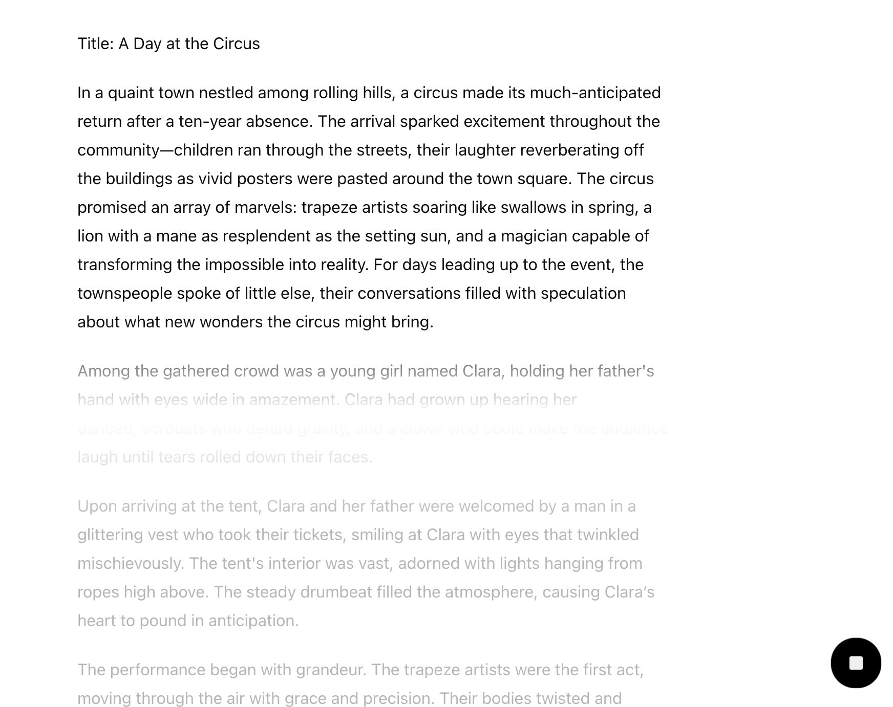

# a. **从加载到对话：使用 Transformers 本地运行量化 LLM 大模型（GPTQ & AWQ）**

> 来用点主流的大型语言模型（LLM）。
>
> LLM 的加载、微调和应用涉及多个方面，今天我们先聚焦于**加载**，本文的难点仅在于正确安装和知晓模型量化的概念 :)，所以不用担心，这是一篇轻松的文章。
>
> 你可能已经听说过一些工具，比如 Ollama 和 GPT4ALL，这些都是即开即用的优秀开源项目。然而，仅仅使用这些工具并不能真正理解它们是怎么做的。因此，让我们更加深入一点，亲自通过代码来完成 LLM 部署和简单的对话交互。
>
> 在之前的文章[《06. 开始实践：部署你的第一个LLM大语言模型》](https://github.com/Hoper-J/AI-Guide-and-Demos-zh_CN/blob/master/Guide/06.%20开始实践：部署你的第一个LLM大语言模型.md)中，我们展示了如何使用一个较小的预训练模型来部署对话应用，旨在为初学者提供一个简单的入门教程。但如果你想基于那篇文章，真正部署更流行的大模型，可能会遇到：
>
> - **直接使用大模型**：Out of Memory。
> - **大模型 4-bit 量化导入**：确实可以，但下载一个 7B 的大模型再转 4-bit，需要先吃 30GB 的磁盘空间，不太适合部署去“玩”。
> - **想使用 GGUF 文件**：查阅文档和攻略后，尝试用 Transformers 部署，但发现推理速度极慢（转换成了 FP32 并且运行在 CPU 上）。
> - ...
>
> 这篇文章会解决这些问题，并通过使用 Transformers 和 Llama-cpp-python 分别进行演示，帮助你更好地理解和掌握，本文对应于 Transformers，[19b](https://github.com/Hoper-J/AI-Guide-and-Demos-zh_CN/blob/master/Guide/19b.%20从加载到对话：使用%20Llama-cpp-python%20本地运行量化%20LLM%20大模型（GGUF）.md) 对应于 Llama-cpp-python。
>
> 注意：当前文章对显卡没有强制要求，无显卡一样可以实现（推理使用 CPU ）。
>
> 与之前的文章不同是，为了直观感受，本文没有对代码进行函数封装，而是在需要时直接复用。
>
> [代码文件下载 - Transformers](https://github.com/Hoper-J/AI-Guide-and-Demos-zh_CN/blob/master/Demos/16a.%20使用%20Transformers%20加载量化后的%20LLM%20大模型（GPTQ%20%26%20AWQ）.ipynb)

## 目录

   - [前言](#前言)
   - [手动下载模型（推荐）](#手动下载模型推荐)
     - [GPTQ](#gptq)
     - [AWQ](#awq)
     - [GGUF](#gguf)
     - [模型所在地](#模型所在地)
   - [使用 Transformers 开始加载](#使用-transformers-开始加载)
     - [环境配置](#环境配置)
     - [GPTQ](#gptq-1)
       - [安装](#安装)
       - [导入库](#导入库)
       - [本地导入模型](#本地导入模型)
       - [自动下载并导入模型](#自动下载并导入模型)
       - [推理测试](#推理测试)
     - [AWQ](#awq-1)
       - [安装](#安装-1)
       - [导入库](#导入库-1)
       - [本地导入模型](#本地导入模型-1)
       - [自动下载并导入模型](#自动下载并导入模型-1)
       - [推理测试](#推理测试-1)
     - [了解提示词模版（Prompt Template）](#了解提示词模版prompt-template)
     - [流式输出](#流式输出)
     - [单轮对话](#单轮对话)
     - [多轮对话](#多轮对话)

## 前言

访问 [Hugging Face](https://huggingface.co/models)，让我们先选择一个7B左右的语言模型：

1. [mistralai/Mistral-7B-Instruct-v0.3](https://huggingface.co/mistralai/Mistral-7B-Instruct-v0.3)
2. [Qwen/Qwen2.5-7B-Instruct](https://huggingface.co/Qwen/Qwen2.5-7B-Instruct)
3. [meta-llama/Llama-3.1-8B-Instruct](https://huggingface.co/meta-llama/Llama-3.1-8B-Instruct)

> [!NOTE]
>
> 你可以随意更换你喜欢的模型，上面只是简单列举。

停一下，还记得 FP32 下 7B 模型的参数有多大吗？

“不严谨的说，好像是 28 GB，所以我们要用模型量化来导入模型，就是太大了，可能要下载比较久的时间:(”

是的，这个说法没有问题，不过上面列出的模型采用的是 BF16，所以还会更小点。

“那大概 14 GB，我晚点再开始正式学习，还是要下载很久”

诶，那你有没有想过，既然这些模型下载下来需要量化，为什么不直接去下一个量化版的模型？

是的，以上所列的三个模型，在 Hugging Face 中都有着量化版本：

| GPTQ                                                         | AWQ                                                          | GGUF                                                         |
| ------------------------------------------------------------ | ------------------------------------------------------------ | ------------------------------------------------------------ |
| [neuralmagic/Mistral-7B-Instruct-v0.3-GPTQ-4bit](https://huggingface.co/neuralmagic/Mistral-7B-Instruct-v0.3-GPTQ-4bit) | [solidrust/Mistral-7B-Instruct-v0.3-AWQ](https://huggingface.co/solidrust/Mistral-7B-Instruct-v0.3-AWQ) | [bartowski/Mistral-7B-Instruct-v0.3-GGUF](https://huggingface.co/bartowski/Mistral-7B-Instruct-v0.3-GGUF) |
| [Qwen/Qwen2.5-7B-Instruct-GPTQ-Int4](https://huggingface.co/Qwen/Qwen2.5-7B-Instruct-GPTQ-Int4) | [Qwen/Qwen2.5-7B-Instruct-AWQ](https://huggingface.co/Qwen/Qwen2.5-7B-Instruct-AWQ) | [Qwen/Qwen2.5-7B-Instruct-GGUF](https://huggingface.co/Qwen/Qwen2.5-7B-Instruct-GGUF) |
| [hugging-quants/Meta-Llama-3.1-8B-Instruct-GPTQ-INT4](https://huggingface.co/hugging-quants/Meta-Llama-3.1-8B-Instruct-GPTQ-INT4) | [hugging-quants/Meta-Llama-3.1-8B-Instruct-AWQ-INT4](hugging-quants/Meta-Llama-3.1-8B-Instruct-AWQ-INT4) | [bartowski/Meta-Llama-3.1-8B-Instruct-GGUF](https://huggingface.co/bartowski/Meta-Llama-3.1-8B-Instruct-GGUF) |

> [!note]
>
> 注意，表格中 GPTQ 和 AWQ 的跳转链接均为 4-bit 量化。
>
> **Q：为什么 AWQ 不标注量化类型？**
>
> A：因为 3-bit 没什么需求，更高的 bit 官方现在还不支持（见 [Issue #172](https://github.com/mit-han-lab/llm-awq/issues/172)），所以分享的 AWQ 文件基本默认是 4-bit。
>
> **Q：GPTQ，AWQ，GGUF 是什么？**
>
> A：简单了解见 [18. 模型量化技术概述及 GGUF:GGML 文件格式解析](https://github.com/Hoper-J/AI-Guide-and-Demos-zh_CN/blob/master/Guide/18.%20模型量化技术概述及%20GGUF%3AGGML%20文件格式解析.md)。
>
> **Q：怎么去找其他模型对应的量化版本？**
>
> A：假设你要找的是 4 bit 量化，搜索 `[模型名称]-[GPTQ]/[AWQ]/[GGUF]` 或 `[模型名称]-[4bit/INT4]`。

三种量化模型，该选哪个进行演示呢？选择困难症犯了 :)

**索性不选了，接下来将逐一介绍 GPTQ，AWQ 以及 GGUF 的加载方式，读者选择一种进行即可。**

> [!important]
>
> 文章演示的模型为 **Mistral-7B-Instruct-v0.3**，对应的加载方法：
>
> a. **Transformers**：GPTQ，AWQ
>
> b. **LLama-cpp-python**：GGUF
>
> Llama-cpp-python 的使用将位于文章 [19b](https://github.com/Hoper-J/AI-Guide-and-Demos-zh_CN/blob/master/Guide/19b.%20从加载到对话：使用%20Llama-cpp-python%20本地运行量化%20LLM%20大模型（GGUF）.md)，建议在阅读完模型下载后再进行跳转。
>
> 默认读者只选取一种方式进行阅读，所以为了防止缺漏，每个类型会重复模型下载的指引，当然，你完全可以选择全看。

## 手动下载模型（推荐）

来试试多线程指定文件下载，对于 Linux，这里给出配置命令，其余系统可以参照[《a. 使用 HFD 加快 Hugging Face 模型和数据集的下载》](https://github.com/Hoper-J/AI-Guide-and-Demos-zh_CN/blob/master/Guide/a.%20使用%20HFD%20加快%20Hugging%20Face%20模型和数据集的下载.md)先进行环境配置。你也可以跳过这部分，后面会介绍自动下载。

```bash
sudo apt-get update
sudo apt-get install git git-lfs wget aria2
git lfs install
```

下载并配置 HFD 脚本：

```bash
wget https://huggingface.co/hfd/hfd.sh
chmod a+x hfd.sh
export HF_ENDPOINT=https://hf-mirror.com
```

使用多线程下载指定模型。

### GPTQ

命令遵循 `./hfd.sh <model_path> --tool aria2c -x <线程数>`的格式：

```bash
./hfd.sh neuralmagic/Mistral-7B-Instruct-v0.3-GPTQ-4bit --tool aria2c -x 16
```

### AWQ

命令遵循 `./hfd.sh <model_path> --tool aria2c -x <线程数>`的格式：

```bash
./hfd.sh solidrust/Mistral-7B-Instruct-v0.3-AWQ --tool aria2c -x 16
```

### GGUF

使用多线程下载指定模型，命令遵循 `./hfd.sh <model_path> --include <file_name> --tool aria2c -x <线程数>`的格式：

```bash
./hfd.sh bartowski/Mistral-7B-Instruct-v0.3-GGUF --include Mistral-7B-Instruct-v0.3-Q4_K_M.gguf --tool aria2c -x 16
```

下载完成你应该可以看到类似的输出：

```
Download Results:
gid   |stat|avg speed  |path/URI
======+====+===========+=======================================================
145eba|OK  |   6.8MiB/s|./Mistral-7B-Instruct-v0.3-Q4_K_M.gguf

Status Legend:
(OK):download completed.
Downloaded https://huggingface.co/bartowski/Mistral-7B-Instruct-v0.3-GGUF/resolve/main/Mistral-7B-Instruct-v0.3-Q4_K_M.gguf successfully.
Download completed successfully.
```

### 模型所在地

默认在当前目录下的 `<model_name>` 文件夹中（`<model_path>` 由 `id` + `/` + `model_name` 组成）

```
3.9G    ./Mistral-7B-Instruct-v0.3-AWQ
3.9G    ./Mistral-7B-Instruct-v0.3-GPTQ-4bit
4.1G    ./Mistral-7B-Instruct-v0.3-GGUF
```

## 使用 Transformers 开始加载

### 环境配置

在开始之前，请确保环境已正确配置。运行以下命令安装所需的库：

```python
pip install numpy==1.24.4
pip install --upgrade transformers
```

### GPTQ

#### 安装

你需要注意的是，如果安装不正确，GPTQ 将无法正确使用 GPU 进行推理，也就是说无法进行加速，即便 print(model.device) 显示为 "cuda"。类似的问题见 [Is This Inference Speed Slow?  #130](https://github.com/AutoGPTQ/AutoGPTQ/issues/130) 和 [CUDA extension not installed #694](https://github.com/AutoGPTQ/AutoGPTQ/issues/694)。

这个问题是普遍存在的，当你直接使用 `pip install auto-gptq` 进行安装时，可能就会出现。

你可以通过以下命令检查已安装的版本：

```bash
pip list | grep auto-gptq
```

如果发现之前安装的版本不带 cuda 标识，卸载它，从源码重新进行安装（推理速度将提升为原来的 15 倍以上）。

```bash
pip uninstall auto-gptq
git clone https://github.com/PanQiWei/AutoGPTQ.git && cd AutoGPTQ
```

```bash
# 以下两种方式任选一种进行安装即可，经测试均有效
pip install -vvv --no-build-isolation -e .
# >> Successfully installed auto-gptq-0.8.0.dev0+cu121

python setup.py install
# >> Finished processing dependencies for auto-gptq==0.8.0.dev0+cu121
```

> [!CAUTION]
>
> 请确保系统已安装 CUDA，可以通过 `nvcc --version` 检查。

#### 导入库

```python
import torch
from transformers import AutoModelForCausalLM, AutoTokenizer
```

接下来介绍两种导入模型的方法，根据需要选择本地导入或自动下载导入。

#### 本地导入模型

如果已经在本地下载了模型，可以通过指定模型路径来加载模型。以下示例假设模型位于当前目录的 `Mistral-7B-Instruct-v0.3-GPTQ-4bit` 文件夹下：

```python
# 指定本地模型的路径
model_path = "./Mistral-7B-Instruct-v0.3-GPTQ-4bit"

# 加载分词器
tokenizer = AutoTokenizer.from_pretrained(model_path)

# 加载模型
model = AutoModelForCausalLM.from_pretrained(
    model_path,
    torch_dtype="auto",  # 自动选择模型的权重数据类型
    device_map="auto"    # 自动选择可用的设备（CPU/GPU）
)
```

#### 自动下载并导入模型

如果没有本地模型，可以使用 `from_pretrained` 方法从 Hugging Face Hub 自动下载模型：

```python
# 指定模型的名称
model_name = "neuralmagic/Mistral-7B-Instruct-v0.3-GPTQ-4bit"

# 加载分词器
tokenizer = AutoTokenizer.from_pretrained(model_name)

# 下载并加载模型
model = AutoModelForCausalLM.from_pretrained(
    model_name,
    torch_dtype="auto",  # 自动选择模型的权重数据类型
    device_map="auto"    # 自动选择可用的设备（CPU/GPU）
)
```

#### 推理测试

```python
# 输入文本
input_text = "Hello, World!"

# 将输入文本编码为模型可接受的格式
input_ids = tokenizer.encode(input_text, return_tensors="pt").to(model.device)

# 生成输出
with torch.no_grad():
    output_ids = model.generate(
        input_ids=input_ids,
        max_length=50,
    )

# 解码生成的输出
output_text = tokenizer.decode(output_ids[0], skip_special_tokens=True)

# 打印生成的文本
print(output_text)
```

### AWQ

#### 安装

```bash
pip install autoawq autoawq-kernels
```

#### 导入库

```python
import torch
from awq import AutoAWQForCausalLM
from transformers import AutoTokenizer
```

同样地，下面介绍两种导入 AWQ 模型的方法，根据需要选择本地导入或自动下载导入。

#### 本地导入模型

如果已经下载了 AWQ 格式的模型，可以使用以下代码加载：

```python
# 指定本地模型的路径
model_path = "./Mistral-7B-Instruct-v0.3-AWQ"

# 加载分词器
tokenizer = AutoTokenizer.from_pretrained(
    model_path,
    trust_remote_code=True
)

# 加载模型
model = AutoAWQForCausalLM.from_quantized(
    model_path,
    fuse_layers=True  # 融合部分模型层以提高推理速度
)
```

#### 自动下载并导入模型

如果没有本地模型，可以从 Hugging Face Hub 自动下载：

```python
# 指定模型的名称
model_name = "solidrust/Mistral-7B-Instruct-v0.3-AWQ"

# 加载分词器
tokenizer = AutoTokenizer.from_pretrained(
    model_name,
    trust_remote_code=True
)

# 下载并加载模型
model = AutoAWQForCausalLM.from_quantized(
    model_name,
    fuse_layers=True  # 融合部分模型层以提高推理速度
)
```

#### 推理测试

```python
# 设置设备
device = 'cuda' if torch.cuda.is_available() else 'cpu'

# 输入文本
input_text = "Hello, World!"

# 将输入文本编码为模型可接受的格式
input_ids = tokenizer.encode(input_text, return_tensors="pt").to(device)

# 生成输出
with torch.no_grad():
    output_ids = model.generate(
        input_ids=input_ids,
        max_length=50,
        pad_token_id=tokenizer.eos_token_id
    )

# 解码生成的输出
output_text = tokenizer.decode(output_ids[0], skip_special_tokens=True)

# 打印生成的文本
print(output_text)
```

### 了解提示词模版（Prompt Template）

其实非常简单，就是曾经提到的占位符（下图对于 `{{question}}` 的应用）。


举个直观的例子：

```python
# 定义 Prompt Template
prompt_template = "问：{question}\n答："

# 定义问题
question = "人工智能的未来发展方向是什么？"

# 使用 Prompt Template 生成完整的提示
prompt = prompt_template.format(question=question)
print(prompt)
```

**输出**：

```
问：人工智能的未来发展方向是什么？
答：
```

> [!tip]
>
> 如果你对 `"问：{question}\n答：".format()` 的形式不太理解，可以将其理解为 `f"问：{question}\n答："`：
>
> ```python
> print(f"问：{question}\n答：")
> ```
>
> **输出**：
>
> ```
> 问：人工智能的未来发展方向是什么？
> 答：
> ```
>
> 在[《02. 简单入门：通过API与Gradio构建AI应用》](https://github.com/Hoper-J/AI-Guide-and-Demos-zh_CN/blob/master/Guide/02.%20简单入门：通过API与Gradio构建AI应用.md#第一部分文章摘要单轮对话应用)的第一部分，你应该见过它的使用。
>
> **Q: 应该选择哪种形式的 Prompt Template 呢？**
>
> A: 按照自己的喜好进行使用，但需要注意的是 f-string 在 Python 3.6 版本才引入。
>
> **Q: 提示词模版的应用在哪里，为什么能得到发展？**
>
> A：偷懒。
>
> 讲个小故事。假设团队正在进行大量的文献翻译任务。早在 GPT-3.5 刚发布时，我们就开始使用 ChatGPT 来帮忙「翻译」文章，为自己的摸鱼大业添砖加瓦。虽然每次都需要输入大量的文本才能让它进行地道的翻译，但这总比自己逐句翻译省力得多。「工资不变，吞吐量增加，加量不加价，直呼好员工」
>
> 经过一段时间，我们总结出了一套「模版」，每次只需要复制粘贴：将「模版」+「文本」丢给ChatGPT 就能得到结果（或许小组已经有人在偷偷用 API 写提示词模版🤣）。「虽然重复单调无趣，但是轻松还高效」
>
> 矜矜业业的当了一年 CV 机器人（`Ctrl`+`C「模版」` `V「模版」` + `Ctrl`+`C「文本」` `V「文本」` ），OpenAI 发布了 GPTs，这可太好了！我们可以定制 GPT 来做任务，将原来总结出的「模版」直接丢进去就行：一个 GPT 负责「分段」，另一个负责「翻译」，再加一个负责「润色」！「再也不用复制重复的「模版」了」
>
> **回归正题**，在角色扮演或其他 AI 应用中，使用 Prompt 进行预设是很常见的方法（因为 In-context Learning 是有效的）。而用得多了，自然需要一个合适的名称来指代它，Prompt Template 确实很贴切。

### 流式输出

在项目初期认识 API 的时候，文章[《01. 初识LLM API：环境配置与多轮对话演示》](https://github.com/Hoper-J/AI-Guide-and-Demos-zh_CN/blob/master/Guide/01.%20初识LLM%20API：环境配置与多轮对话演示.md#流式输出)有提到过流式输出，这是我们一直以来见到的大模型输出方式：逐字（token）打印而非等全部生成完再打印。

执行下面的代码试试（无论之前导入的是哪种模型，都可以继续）：

```python
from transformers import TextStreamer

device = 'cuda' if torch.cuda.is_available() else 'cpu'

# 创建 TextStreamer 实例
streamer = TextStreamer(
    tokenizer, 
    skip_prompt=True,         # 在输出时跳过输入的提示部分，仅显示生成的文本
    skip_special_tokens=True  # 忽略生成过程中的特殊标记（比如 <pad> / <eos> ...）
)

# 将提示编码为模型输入
input_ids = tokenizer.encode(prompt, return_tensors="pt").to(device)

# 设置生成参数
generation_kwargs = {
    "input_ids": input_ids,  # 模型的输入 ID，注意，这不是 Embedding
    "max_length": 200,       # 生成的最大 token 数
    "streamer": streamer,    # 使用 TextStreamer 实现生成过程中逐步输出文本
    "pad_token_id": tokenizer.eos_token_id  # 默认行为，消除警告
}

# 开始生成文本
with torch.no_grad():
    model.generate(**generation_kwargs)
```

> [!note]
>
> `**` 是 Python 中的解包操作符，它将字典中的键值对解包为函数的关键字参数。在这里，`**generation_kwargs` 将字典中的参数逐一传递给 `model.generate()` 方法，等价于直接写出所有参数：
>
> ```python
> model.generate(
>  input_ids=input_ids, 
>  max_length=200, 
>  ...
> )
> ```
>
> 你需要注意到，这和之前采用了不同的传参方式，但本质是一样的。为了初见的直观，在后续的教程中，会较少地使用这种方式进行传参。
>
> **Q：为什么设置 `pad_token_id=tokenizer.eos_token_id`？**
>
> A：如果不进行设置，你将在每次生成时看到这样的一行警告：
>
> ```
> Setting `pad_token_id` to `eos_token_id`:{eos_token_id} for open-end generation.
> ```
>
> 让我们看看[源码](https://github.com/huggingface/transformers/blob/b880508440f43f80e35a78ccd2a32f3bde91cb23/src/transformers/generation_utils.py#L410-L414)：
>
> ```python
> def _get_pad_token_id(self, pad_token_id: int = None, eos_token_id: int = None) -> int:
>     if pad_token_id is None and eos_token_id is not None:
>         logger.warning(f"Setting `pad_token_id` to `eos_token_id`:{eos_token_id} for open-end generation.")
>         pad_token_id = eos_token_id
>     return pad_token_id
> ```
>
> 当 `pad_token_id` 为 None 而 `eos_token_id` 不为 None 时，弹出这个警告，并且设置 pad_token_id = eos_token_id。
>
> 这里提前进行设置只是为了抑制这个警告，实际效果和不设置的默认行为一样。
>
> 同样的问题见：https://stackoverflow.com/a/71397707/20445396

**输出**：


现在，你可以根据生成文本的质量决定是否终止输出。

另外，当前输出中不包含我们之前提到的 Prompt 模板。如果希望包含它，将 `streamer` 参数中的 `skip_prompt` 设置为 `False` 即可。

> [!tip]
>
> 最近示出的 GPT-4o canvas 在对原回答进行修改时展示出的按行刷新原文比逐 Token 更赏心悦目，设计的很好（不过一番体验下来，现在还处于好玩有意思，但不够用的阶段）。
>
> 

### 单轮对话

让我们看看模型自身对应的聊天模版。

```python
# 打印 chat_template 信息（如果存在的话）
if hasattr(tokenizer, 'chat_template'):
    print(tokenizer.chat_template)
else:
    print("Tokenizer 没有 'chat_template' 属性。")
```

**输出**：

```
{{ bos_token }}{% if (message['role'] == 'user') != (loop.index0 % 2 == 0) %}{{ raise_exception('Conversation roles must alternate user/assistant/user/assistant/...') }}{{ '[INST] ' + message['content'] + ' [/INST]' }}{{ message['content'] + eos_token}}{{ raise_exception('Only user and assistant roles are supported!') }}
```

你应该能发现，这其中有很多非常熟悉的词：`messages`、`role`、`user` 和 `assistant`（在[最早](https://github.com/Hoper-J/AI-Guide-and-Demos-zh_CN/blob/master/Guide/02.%20简单入门：通过API与Gradio构建AI应用.md#第一部分文章摘要单轮对话应用)调用 API 时其实见到过），但今天不去了解其中的细节（之后将详细讲解），让我们直接来设计 `messages` 实现刚刚的流式输出：

```python
prompt = "人工智能的未来发展方向是什么？"

# 定义消息列表
messages = [
    {"role": "user", "content": prompt}
]

# 使用 tokenizer.apply_chat_template() 生成模型输入
input_ids = tokenizer.apply_chat_template(messages, return_tensors="pt").to(device)

# ========== 以下代码与之前一致 ==============
# 创建 TextStreamer 实例
streamer = TextStreamer(
    tokenizer, 
    skip_prompt=True,         # 在输出时跳过输入的提示部分，仅显示生成的文本
    skip_special_tokens=True  # 忽略生成过程中的特殊标记（比如 <pad> / <eos> ...）
)

# 设置生成参数
generation_kwargs = {
    "input_ids": input_ids,          # 模型的输入 ID
    "max_length": 200,               # 生成的最大 token 数
    "streamer": streamer,            # 使用 TextStreamer 实现生成过程中逐步输出文本
    "pad_token_id": tokenizer.eos_token_id  # 默认行为，消除警告
}

# 开始生成文本
with torch.no_grad():
    model.generate(**generation_kwargs)
```

如果想进行单轮对话，那么修改 `prompt` 即可：

```python
prompt = input("User: ")
```

### 多轮对话

接下来，让我们重现曾经见过的多轮对话：

```python
from transformers import TextStreamer

device = 'cuda' if torch.cuda.is_available() else 'cpu'

# 初始化对话历史
messages = []

# 开始多轮对话
while True:
    # 获取输入
    prompt = input("User: ")
    
    # 退出对话条件（当然，你也可以直接终止代码块）
    if prompt.lower() in ["exit", "quit", "bye"]:
        print("Goodbye!")
        break
    
    # 将输入添加到对话历史
    messages.append({"role": "user", "content": prompt})
    
    # 使用 tokenizer.apply_chat_template() 生成模型输入
    input_ids = tokenizer.apply_chat_template(messages, return_tensors="pt").to(device)
    
    # 创建 TextStreamer 实例
    streamer = TextStreamer(
        tokenizer, 
        skip_prompt=True,         # 在输出时跳过输入的提示部分，仅显示生成的文本
        skip_special_tokens=True  # 忽略生成过程中的特殊标记（比如 <pad> / <eos> ...）
    )
    
    # 设置生成参数
    generation_kwargs = {
        "input_ids": input_ids,                  # 模型的输入 ID
        "max_length": input_ids.shape[1] + 500,  # 生成的最大 token 数，input_ids.shape[1] 即输入对应的 tokens 数量
        "streamer": streamer,                    # 使用 TextStreamer 实现生成过程中逐步输出文本
        "pad_token_id": tokenizer.eos_token_id   # 默认行为，消除警告
    }
    
    # 开始生成回复
    with torch.no_grad():
        output_ids = model.generate(**generation_kwargs)
    
    # 获取生成的回复文本
    assistant_reply = tokenizer.decode(output_ids[0], skip_special_tokens=True)
    
    # 将模型的回复添加到对话历史
    messages.append({"role": "assistant", "content": assistant_reply})
```

**输出**：

```
User:  如果你是大模型面试官，你会怎么出面试题
如果我是大模型面试官，我会出面试题如下：

1. 你能解释什么是深度学习？
2. 你能给出一个例子，说明什么是卷积神经网络（CNN）？
3. 你能解释什么是反 Propagation 算法？
4. 你能给出一个例子，说明什么是自编码器（Autoencoder）？
5. 你能解释什么是 Transfer Learning？
6. 你能给出一个例子，说明什么是 Generative Adversarial Networks（GANs）？
7. 你能解释什么是 Reinforcement Learning？
8. 你能给出一个例子，说明什么是 Neural Turing Machines（NTMs）？
9. 你能解释什么是 One-Shot Learning？
10. 你能给出一个例子，说明什么是 Siamese Networks？
User:  对于第十个问题能否给我答案
对于第十个问题：给出一个例子，说明什么是 Siamese Networks？

Siamese Networks 是一种双向的神经网络，用于学习两个相似的输入的相似性。

例如，在人脸识别中，Siamese Networks 可以用来学习两个人脸的相似性，从而实现人脸识别的目的。
```

可以看到模型拥有之前的对话“记忆”。

如果你对 GGUF 文件的加载或者 Llama-cpp-python 的使用感兴趣，继续阅读 [19b](https://github.com/Hoper-J/AI-Guide-and-Demos-zh_CN/blob/master/Guide/19b.%20从加载到对话：使用%20Llama-cpp-python%20本地运行量化%20LLM%20大模型（GGUF）.md)。
