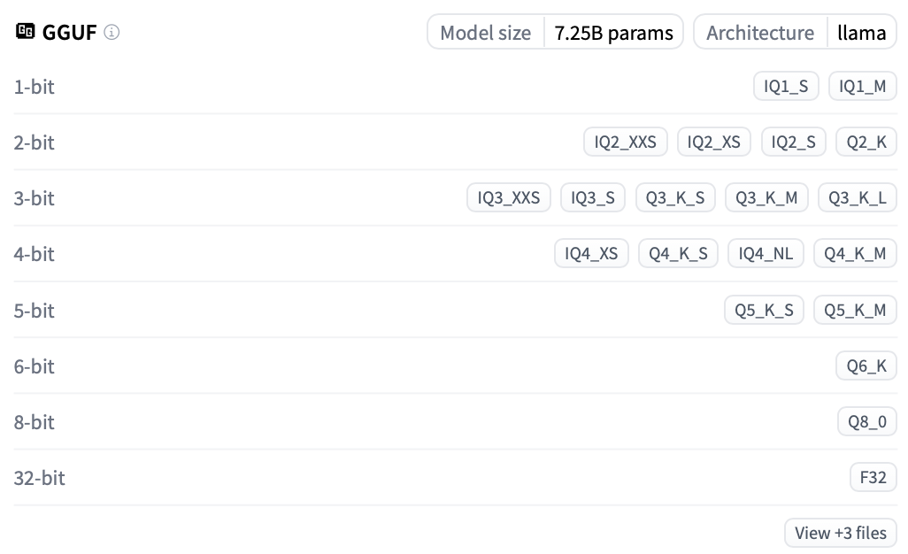

# b. 从加载到对话：使用 Llama-cpp-python 本地运行量化 LLM 大模型（GGUF）

> 建议阅读完 [19a](../Guide/19a.%20从加载到对话：使用%20Transformers%20本地运行量化%20LLM%20大模型（GPTQ%20%26%20AWQ）%20.md) 的「前言」和「模型下载」部分后再进行本文的阅读。
>
> 代码文件下载：[Llama-cpp-python](../Demos/16b.%20使用%20Llama-cpp-python%20加载量化后的%20LLM%20大模型（GGUF）.ipynb) | [🎡 AI Chat 脚本](../CodePlayground/chat.py)
>
> 在线链接：[Kaggle - b](https://www.kaggle.com/code/aidemos/16b-llama-cpp-python-llm-gguf) | [Colab - b](https://colab.research.google.com/drive/1AhgC0qDaqWBXAI9eSbwTStGgvgFfLOpf?usp=sharing)

## 目录

- [Llama-cpp-python](#llama-cpp-python)
   - [环境配置](#环境配置)
   - [GGUF](#gguf)
      - [安装库](#安装库)
      - [导入库](#导入库)
      - [本地导入模型](#本地导入模型)
      - [自动下载并导入模型](#自动下载并导入模型)
      - [推理测试](#推理测试)
      - [卸载到 GPU 加速推理](#卸载到-gpu-加速推理)
   - [流式输出](#流式输出)
   - [多轮对话](#多轮对话)
- [📝 作业](#-作业)
- [用 🎡 脚本感受 AI 对话（可选）](#用--脚本感受-ai-对话可选)
   - [克隆仓库](#克隆仓库)
   - [执行脚本](#执行脚本)
   - [加载和保存历史对话](#加载和保存历史对话)
- [参考链接](#参考链接)

### 环境配置

> 【**更新**】可以直接使用下面的代码一键安装：
>
> ```bash
> CUDA_HOME="$(find /usr/local -name "cuda" -exec readlink -f {} \; \
>              | awk '{print length($0), $0}' \
>              | sort -n \
>                 | head -n1 \
>                 | cut -d ' ' -f 2)" && \
> CMAKE_ARGS="-DGGML_CUDA=on \
>             -DCUDA_PATH=${CUDA_HOME} \
>             -DCUDAToolkit_ROOT=${CUDA_HOME} \
>             -DCUDAToolkit_INCLUDE_DIR=${CUDA_HOME} \
>             -DCUDAToolkit_LIBRARY_DIR=${CUDA_HOME}/lib64 \
>                -DCMAKE_CUDA_COMPILER=${CUDA_HOME}/bin/nvcc" \
>    FORCE_CMAKE=1 \
>    pip install --upgrade --force-reinstall llama-cpp-python --no-cache-dir --verbose
>    ```
>    
> 如果对细节感兴趣，可以继续阅读环境配置部分。

为了确保后续的 "offload"（卸载到 GPU）功能正常工作，需要进行一些额外的配置。

首先，找到 CUDA 的安装路径（你需要确保已经安装了 CUDA）：

```bash
find /usr/local -name "cuda" -exec readlink -f {} \;
```

**参数解释**：

- `-name "cuda"`：在 `/usr/local` 目录下搜索名为 "cuda" 的文件或目录。
- `-exec readlink -f {} \;`：对找到的每个文件或目录执行 `readlink -f`，获取其完整的绝对路径。

假设输出如下（路径最短的）：

```
/usr/local/cuda-12.1
...
```

复制这个路径，设置 `CUDA_HOME` 环境变量：

```bash
export CUDA_HOME=/usr/local/cuda-12.1
```

接下来，安装 `llama-cpp-python`：

```bash
CMAKE_ARGS="-DGGML_CUDA=on \
            -DCUDA_PATH=${CUDA_HOME} \
            -DCUDAToolkit_ROOT=${CUDA_HOME} \
            -DCUDAToolkit_INCLUDE_DIR=${CUDA_HOME} \
            -DCUDAToolkit_LIBRARY_DIR=${CUDA_HOME}/lib64 \
            -DCMAKE_CUDA_COMPILER=/usr/local/cuda/bin/nvcc" \
FORCE_CMAKE=1 \
pip install --upgrade --force-reinstall llama-cpp-python --no-cache-dir --verbose

# 可以使用简短的版本，但如果系统装了多个版本的cuda，可能需要采取上面的安装步骤
#CMAKE_ARGS="-DGGML_CUDA=on" pip install llama-cpp-python
```

> [!note]
>
> 如果仅在 CPU 上运行，可以直接使用 `pip install llama-cpp-python` 进行安装。
>
> 否则，请确保系统已安装 CUDA，可以通过 `nvcc --version` 检查。

### GGUF

以 [bartowski/Mistral-7B-Instruct-v0.3-GGUF](https://huggingface.co/bartowski/Mistral-7B-Instruct-v0.3-GGUF) 为例进行演示。你将在模型界面查看到以下信息：



可以看到 4-bit 量化有 **IQ4_XS**，**Q4_K_S**， **IQ4_NL**，**Q4_K_M** 四种，出于性能的考虑，我们将选择 **Q4_K_M** 进行加载。

| 文件名                                                       | 量化类型 | 文件大小 | 描述                                                |
| ------------------------------------------------------------ | -------- | -------- | --------------------------------------------------- |
| [Mistral-7B-Instruct-v0.3-Q4_K_M.gguf](https://huggingface.co/bartowski/Mistral-7B-Instruct-v0.3-GGUF/blob/main/Mistral-7B-Instruct-v0.3-Q4_K_M.gguf) | Q4_K_M   | 4.37GB   | 质量较好，权重每位约占 4.83 比特，*推荐使用*。      |
| [Mistral-7B-Instruct-v0.3-Q4_K_S.gguf](https://huggingface.co/bartowski/Mistral-7B-Instruct-v0.3-GGUF/blob/main/Mistral-7B-Instruct-v0.3-Q4_K_S.gguf) | Q4_K_S   | 4.14GB   | 略低于 Q4_K_M 的质量，但节省更多空间，*推荐使用*。  |
| [Mistral-7B-Instruct-v0.3-IQ4_NL.gguf](https://huggingface.co/bartowski/Mistral-7B-Instruct-v0.3-GGUF/blob/main/Mistral-7B-Instruct-v0.3-IQ4_NL.gguf) | IQ4_NL   | 4.13GB   | 质量不错，体积略小于 Q4_K_S，性能相近，*推荐使用*。 |
| [Mistral-7B-Instruct-v0.3-IQ4_XS.gguf](https://huggingface.co/bartowski/Mistral-7B-Instruct-v0.3-GGUF/blob/main/Mistral-7B-Instruct-v0.3-IQ4_XS.gguf) | IQ4_XS   | 3.91GB   | 质量不错，体积小于 Q4_K_S，性能相近，*推荐使用*。   |

> [!NOTE]
>
> **Q：这些量化类型到底是什么？**
> A：拓展阅读：[《d. 如何加载 GGUF 模型（分片 & Shared & Split & 00001-of-0000...的解决方法）》](../Guide/d.%20如何加载%20GGUF%20模型（分片%20%26%20Shared%20%26%20Split%20%26%2000001-of-0000...的解决方法）.md)，其中还会以 `Qwen2.5-7B` 为例讲述分片模型的加载方式。

#### 安装库

```bash
pip install gguf
```

#### 导入库

```python
from llama_cpp import Llama
```

下面介绍两种导入模型的方法，实际执行时在本地导入和自动下载中选择一种即可。

#### 本地导入模型

根据模型路径导入模型，注意，文件位于 `<model_name>` 文件夹下，以当前下载的文件为例：

```python
# 指定本地模型的路径
model_path = "./Mistral-7B-Instruct-v0.3-GGUF/Mistral-7B-Instruct-v0.3-Q4_K_M.gguf"

# 加载模型
llm = Llama(
    model_path=model_path,
    #n_gpu_layers=-1,  # 取消注释使用 GPU 加速
    #verbose=False,  # 取消注释禁用详细日志输出
)
```

#### 自动下载并导入模型

对于 `llama-cpp-python`，入乡随俗使用 `repo_id` 变量名，但本质是和之前一致的，`filename` 可以使用通配符，比如 `"*Q4_K_M.gguf"`。

```python
# 指定仓库的名称和文件名
repo_id = "bartowski/Mistral-7B-Instruct-v0.3-GGUF"
filename = "Mistral-7B-Instruct-v0.3-Q4_K_M.gguf"
#filename = "*Q4_K_M.gguf"  # 使用通配符也是可以的

# 下载并加载模型
llm = Llama.from_pretrained(
    repo_id=repo_id,
    filename=filename,
    #n_gpu_layers=-1,  # 取消注释使用 GPU 加速
    #verbose=False,  # 取消注释禁用详细日志输出
)
```

> [!tip]
>
> 二者的函数区别在于 `Llama()` 和 `Llama.from_pretrained()`。

#### 推理测试

使用以下代码进行简单的推理测试：

```python
# 输入文本
input_text = "Hello, World!"

# 生成输出
output = llm(input_text, max_tokens=50)

# 打印生成的文本
print(output['choices'][0]['text'])
```

**输出**：

```
Llama.generate: 4 prefix-match hit, remaining 1 prompt tokens to eval
llama_perf_context_print:        load time =      28.32 ms
llama_perf_context_print: prompt eval time =       0.00 ms /     1 tokens (    0.00 ms per token,      inf tokens per second)
llama_perf_context_print:        eval time =       0.00 ms /   100 runs   (    0.00 ms per token,      inf tokens per second)
llama_perf_context_print:       total time =    1563.56 ms /   101 tokens


Welcome to the latest post on my blog. Today, we will discuss an interesting topic: “How to create a website using JavaScript, HTML, and CSS“. This article is for those who are new to web development or want to learn the basics of creating a website using these technologies. Let’s dive in!

## Prerequisites

Before we start, I would like to mention that I am assuming that you have some basic knowledge of HTML, CSS,
```

每次生成都会打印一些时间方面的信息，设置 Llama() 的参数 `verbose` 为 False 可以禁止这个行为。

#### 卸载到 GPU 加速推理

当前的模型默认被部署在 CPU 上，如果你的电脑拥有显卡且大于 5G 显存，那么可以增加 `n_gpu_layers` 参数将部分计算卸载（offload）到 GPU，以加速推理。修改加载模型的代码如下：

```python
# 本地加载并卸载到 GPU
llm = Llama(
    model_path=model_path,
    n_gpu_layers=-1  # 将所有层卸载到 GPU
    verbose=False,  # 禁用详细日志输出
)

# 或者，自动下载并卸载到 GPU
llm = Llama.from_pretrained(
    repo_id=repo_id,
    filename=filename,
    n_gpu_layers=-1  # 将所有层卸载到 GPU
    verbose=False,  # 禁用详细日志输出
)
```

如果你的显卡不足 5G，可以设置卸载的具体层数，例如 `n_gpu_layers=20`，根据你的显存大小调整该参数。

P.S. 不卸载层是允许的，使用 CPU 一样可以进行推理，简单参考下面的表格：

| 设备 | tokens/s | ms/token | s/100 tokens |
| ---- | -------- | -------- | ------------ |
| CPU  | 11.48    | 87.08    | 8.71         |
| GPU  | 66.85    | 14.96    | 1.50         |

注：`tokens/s` 为每秒生成的 Token 数量，`ms/token` 为生成每个 Token 所需的毫秒数，`s/100 tokens` 为生成 100 个 Token 所需的秒数。


### 流式输出

`Llama-cpp-python` 的流式输出只需要在 create_chat_completion() 中传递参数 `stream=True` 就可以开启，以本地模型导入为例：

```python
prompt = "人工智能的未来发展方向是什么？"

output = llm.create_chat_completion(
    messages=[{
        "role": "user",
        "content": prompt
    }],
    max_tokens=200,
    stream=True
)

for chunk in output:
    delta = chunk['choices'][0]['delta']
    if 'role' in delta:
        print(delta['role'], end=': ', flush=True)
    elif 'content' in delta:
        print(delta['content'], end='', flush=True)
```

**输出**：


**代码解释**：

- **`for chunk in output:`**：遍历模型生成的每一个数据块（chunk）。
  - **`delta = chunk['choices'][0]['delta']`**：
    - 每个`chunk`包含一个`choices`列表，这里只取第一个选择（`choices[0]`）。
    - `delta`包含了当前数据块中的增量信息，可能是角色（role）信息或内容（content）信息。
  
  - **`if 'role' in delta:`**：
    - 如果`delta`中包含`'role'`键，说明这是角色信息（例如 “assistant”）。
      - **`print(delta['role'], end=': ')`**：打印角色名，并以冒号和空格结尾，例如“assistant: ”，这是自定义行为，当然也可以 `pass` 掉。
  
  - **`elif 'content' in delta:`**：
    - 如果`delta`中包含`'content'`键，说明这是实际的回答内容。
      - **`print(delta['content'], end='')`**：打印内容，不换行，以便逐步显示生成的回答，注意，在这里参数 `end='' `是正确打印所必须的。

> [!note]
>
> **查看 output 的构造**：
>
> ```python
> from itertools import islice
> 
> prompt = "人工智能的未来发展方向是什么？"
> 
> output = llm.create_chat_completion(
>        messages=[{
>            "role": "user",
>            "content": prompt
>        }],
>        max_tokens=200,
>        stream=True
> )
> 
> print(type(output))
> 
> # 将生成器转换为列表
> output_list = list(islice(output, 3))
> 
> # 获取前 3 个条目
> output_list[:3]
> ```
>
> **输出**（只需要查看其中的 `delta`）：
>
> ```
> <class 'generator'>
> [{'id': 'chatcmpl-848b2e9b-7d70-4a7b-99aa-74b8206721db',
> 'model': './Mistral-7B-Instruct-v0.3-GGUF/Mistral-7B-Instruct-v0.3-Q4_K_M.gguf',
> 'created': 1728562647,
> 'object': 'chat.completion.chunk',
> 'choices': [{'index': 0,
>  'delta': {'role': 'assistant'},
>  'logprobs': None,
>  'finish_reason': None}]},
> {'id': 'chatcmpl-848b2e9b-7d70-4a7b-99aa-74b8206721db',
> 'model': './Mistral-7B-Instruct-v0.3-GGUF/Mistral-7B-Instruct-v0.3-Q4_K_M.gguf',
> 'created': 1728562647,
> 'object': 'chat.completion.chunk',
> 'choices': [{'index': 0,
>  'delta': {'content': ' '},
>  'logprobs': None,
>  'finish_reason': None}]},
> {'id': 'chatcmpl-848b2e9b-7d70-4a7b-99aa-74b8206721db',
> 'model': './Mistral-7B-Instruct-v0.3-GGUF/Mistral-7B-Instruct-v0.3-Q4_K_M.gguf',
> 'created': 1728562647,
> 'object': 'chat.completion.chunk',
> 'choices': [{'index': 0,
>  'delta': {'content': '人'},
>  'logprobs': None,
>  'finish_reason': None}]}]
> ```

将刚刚对于流式输出的处理抽象为函数便于后续调用：
```python
def handle_stream_output(output):
    """
    处理流式输出，将生成的内容逐步打印出来。
    
    参数：
        output: 生成器对象，来自 create_chat_completion 的流式输出
    """
    for chunk in output:
        delta = chunk['choices'][0]['delta']
        if 'role' in delta:
            print(f"{delta['role']}: ", end='', flush=True)
        elif 'content' in delta:
            print(delta['content'], end='', flush=True)
            
# 使用示例
prompt = "人工智能的未来发展方向是什么？"

output = llm.create_chat_completion(
    messages=[{
        "role": "user",
        "content": prompt
    }],
    max_tokens=200,
    stream=True
)

handle_stream_output(output)
```

**函数解释**：

- **`handle_stream_output`**：
  - 接收一个生成器对象 `output`，遍历每个数据块 `chunk`。
  - 从每个 `chunk` 中提取 `delta` 信息。
  - 根据 `delta` 中的键值，分别处理 `role` 和 `content` 信息。
  - 使用 `flush=True` 确保内容实时打印。

### 多轮对话

让我们自定义一个交互的对话类（需要注意到 handle_stream_output() 有所修改）。

```python
from llama_cpp import Llama

def handle_stream_output(output):
    """
    处理流式输出，将生成的内容逐步打印出来，并收集完整的回复。

    参数：
        output: 生成器对象，来自 create_chat_completion 的流式输出

    返回：
        response: 完整的回复文本
    """
    response = ""
    for chunk in output:
        delta = chunk['choices'][0]['delta']
        if 'role' in delta:
            print(f"{delta['role']}: ", end='', flush=True)
        elif 'content' in delta:
            content = delta['content']
            print(content, end='', flush=True)
            response += content
    return response

class ChatSession:
    def __init__(self, llm):
        self.llm = llm
        self.messages = []

    def add_message(self, role, content):
        """
        添加一条消息到会话中。

        参数：
            role: 消息角色，通常为 'user' 或 'assistant'
            content: 消息内容
        """
        self.messages.append({"role": role, "content": content})

    def get_response_stream(self, user_input):
        """
        获取模型对用户输入的响应（流式输出）。

        参数：
            user_input: 用户输入的文本

        返回：
            response: 完整的回复文本
        """
        self.add_message("user", user_input)
        
        try:
            output = self.llm.create_chat_completion(
                messages=self.messages,
                stream=True  # 开启流式输出
            )
            
            response = handle_stream_output(output)  # 同时打印和收集回复
            
            self.add_message("assistant", response.strip())
            return response.strip()
        except Exception as e:
            print(f"\n发生错误: {e}")
            return ""

# 初始化模型（假设使用本地路径）
model_path = "./Mistral-7B-Instruct-v0.3-GGUF/Mistral-7B-Instruct-v0.3-Q4_K_M.gguf"
llm = Llama(
    model_path=model_path,
    n_gpu_layers=-1,  # 根据需要卸载到 GPU
    verbose=False,    # 禁用详细日志输出
)

# 创建会话实例
chat = ChatSession(llm)
        
# 开始对话
while True:
    prompt = input("User: ")
    # 退出对话条件（当然，你也可以直接终止代码块）
    if prompt.lower() in ["exit", "quit", "bye"]:
        print("Goodbye!")
        break
    chat.get_response_stream(prompt)
    print()  # 换行以便下一次输入，这是因为之前的 print 都设置了 end=''
```

**输出**：

```
User:  如果你是大模型面试官，你会怎么出面试题
assistant:  以下是一些可能的大模型面试题：

1. 解释什么是深度学习和卷积神经网络，以及它们的应用场景。
2. 描述你对数据预处理和特征工程的了解，并提供一个实际使用例子。
3. 如何选择合适的模型、优化器和损失函数，以及如何评估模型性能？
4. 解释你对TensorFlow和PyTorch的了解，并提供一个使用它们的实际例子。
5. 如何处理不平衡数据集，以及你对样本平衡和数据增强方法的了解。
6. 如何使用Transfer Learning来提高模型性能，并提供一个实际例子。
7. 如何使用文本生成模型（如Seq2Seq模型）来进行机器翻译，文本摘要和情感分析？
8. 如何使用对象检测模型（如Faster R-CNN和YOLO）来进行目标检测？
9. 如何使用自编码器来进行数据压缩和特征学习？
10. 如何使用喂给网络（Feeding Networks）和Generative Adversarial Networks（GANs）来生成图像和文本？
11. 如何使用时序数据模型（如ARIMA和LSTM）来进行预测？
12. 如何使用回归树和随机森林来进行预测和分类？
13. 描述你对超参数调优的了解，包括网络架构、学习率和批大小等方面。
14. 如何使用K-means和朴素贝叶斯等聚类和分类方法？
15. 描述你对凸优化和
User:  对于第十个问题能否给我答案

发生错误: Requested tokens (530) exceed context window of 512
```

可以看到报错超过了上下文窗口的长度，让我们增加它：

```python
llm = Llama(
    model_path=model_path,
    n_gpu_layers=-1,  # 根据需要卸载到 GPU
    n_ctx=4096,       # 设置上下文窗口大小
    verbose=False,    # 禁用详细日志输出
)
```

此时模型输出正常：

```
User:  如果你是大模型面试官，你会怎么出面试题
assistant:  以下是一些可能的大模型面试题：

1. 解释什么是深度学习和卷积神经网络，以及它们的应用场景。
2. 描述你对数据预处理和特征工程的了解，并提供一个实际使用例子。
3. 如何选择合适的模型、优化器和损失函数，以及如何评估模型性能？
4. 解释你对TensorFlow和PyTorch的了解，并提供一个使用它们的实际例子。
5. 如何处理不平衡数据集，以及你对样本平衡和数据增强方法的了解。
6. 如何使用Transfer Learning来提高模型性能，并提供一个实际例子。
7. 如何使用文本生成模型（如Seq2Seq模型）来进行机器翻译，文本摘要和情感分析？
8. 如何使用对象检测模型（如Faster R-CNN和YOLO）来进行目标检测？
9. 如何使用自编码器来进行数据压缩和特征学习？
10. 如何使用喂给网络（Feeding Networks）和Generative Adversarial Networks（GANs）来生成图像和文本？
11. 如何使用时序数据模型（如ARIMA和LSTM）来进行预测？
12. 如何使用回归树和随机森林来进行预测和分类？
13. 描述你对超参数调优的了解，包括网络架构、学习率和批大小等方面。
14. 如何使用K-means和朴素贝叶斯等聚类和分类方法？
15. 描述你对凸优化和随机 Forests等算法的了解。
User:  对于第十个问题能否给我答案
assistant:  给定一个生成图像和文本的问题，一种方法是使用Generative Adversarial Networks（GANs）。

GANs是一种深度学习模型，由两个子网络组成：生成器和判别器。生成器生成一组随机噪声并根据该噪声生成新的数据，而判别器试图区分生成的数据和真实数据。这两个子网络通过最小化一个对抗性损失函数来互相学习。

在生成图像方面，常用的GAN模型包括DCGAN（Deep Convolutional GAN）、CGAN（Conditional GAN）和WGAN（Wasserstein GAN）等。DCGAN使用 convolutional neural network 作为生成器，对于生成图像来说，DCGAN可以生成高质量的图像，但是它可能会生成一些不太可靠的图像，因为它是一种无条件生成器。

CGAN是DCGAN的一种扩展，它引入了条件信息，允许生成器根据特定条件（如类别标签）生成图像。WGAN是DCGAN的一种改进版本，它使用 Wasserstein 距离来替换了原来的对抗性损失函数，从而使得模型更加稳定。

在生成文本方面，常用的GAN模型包括SeqGAN（Sequence Generative Adversarial Nets）和StackGAN（Stack Generative Adversarial Networks）。SeqGAN通过使用RNNs（Recurrent Neural Networks）生成一系列单词来生成文本。StackGAN使用多个堆叠的GAN子网络来生成复杂的文本。

总之，GANs是一种强大的生成模型，可以生成高质量的图像和文本，但是它们也有一些问题，例如生成的数据可能存在模式缺陷，并且训练过程可能会收敛很慢。
```

至此，篇章告一段落 :)。

## 📝 作业

修改 `model_path`，加载 [bartowski/DeepSeek-R1-Distill-Qwen-7B-GGUF/DeepSeek-R1-Distill-Qwen-7B-Q5_K_L.gguf](https://huggingface.co/bartowski/DeepSeek-R1-Distill-Qwen-7B-GGUF/blob/main/DeepSeek-R1-Distill-Qwen-7B-Q5_K_L.gguf) 进行对话：

```python
model_path = "bartowski/DeepSeek-R1-Distill-Qwen-7B-GGUF/DeepSeek-R1-Distill-Qwen-7B-Q5_K_L.gguf"
```

观察 <think> </think> 部分的输出。

## 用 🎡 脚本感受 AI 对话（可选）

这是可选的行为，脚本的代码处理逻辑与文章对应。

### 克隆仓库

```bash
# 如果已经克隆仓库的话跳过这行
git clone https://github.com/Hoper-J/AI-Guide-and-Demos-zh_CN
```

### 执行脚本

1. 切换到 `CodePlayground` 文件夹：

   ```bash
   cd AI-Guide-and-Demos-zh_CN/CodePlayground
   ```

2. 开始对话：

   ```bash
   # 使用方法：python chat.py <model_path> [可选参数]，替换为你想用的 <model_path>
   # 本地加载
   python chat.py ../Demos/Mistral-7B-Instruct-v0.3-GGUF/Mistral-7B-Instruct-v0.3-Q4_K_M.gguf
   
   # 远程加载
   python chat.py bartowski/Mistral-7B-Instruct-v0.3-GGUF/Mistral-7B-Instruct-v0.3-Q4_K_M.gguf --remote
   
   # 远程加载（通配符版）
   python chat.py 'bartowski/Mistral-7B-Instruct-v0.3-GGUF/*Q4_K_M.gguf' --remote
   
   # 或者试试 DeepSeek
   python chat.py 'bartowski/DeepSeek-R1-Distill-Qwen-7B-GGUF/*Q5_K_L.gguf' --remote
   ```

### 加载和保存历史对话

使用 `-i` 参数指定文件加载，`-o` 参数进行保存，或者 `-io` 参数指明加载和保存的文件路径相同：

```bash
python chat.py <model_path> -io history
```

注意，`Ctrl + C` 将直接终止对话，只有使用 'exit'、'quit' 或 'bye' 结束，或者使用 `Ctrl + D` (EOF) 退出时才会保存对话。

> [!note]
>
> 暂时仅支持与拥有 `tokenizer.chat_template` 属性的模型正常对话。

## 参考链接

- [llama-cpp-python - Docs](https://llama-cpp-python.readthedocs.io/en/latest/)
- [Example with `stream = True`? #319](https://github.com/abetlen/llama-cpp-python/discussions/319#discussioncomment-8422590)

