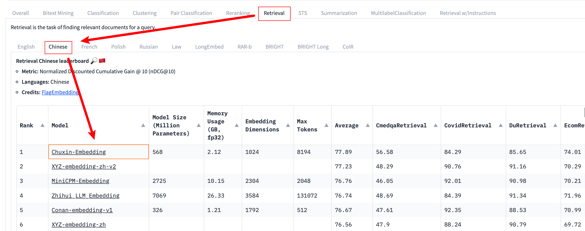

# RAG 入门实践：从文档拆分到向量数据库与问答构建

> 本文将使用 Transformers 和 LangChain，选择在 `Retrieval` -> `Chinese` 中表现较好的编码模型进行演示，即 `chuxin-llm/Chuxin-Embedding`。
>
> 
>
> 你还将了解 `RecursiveCharacterTextSplitter` 的递归工作原理。
>
> 一份值得关注的基准测试榜单：[MTEB (Massive Text Embedding Benchmark) Leaderboard](https://huggingface.co/spaces/mteb/leaderboard)。
>
> [代码文件下载](../Demos/17.%20使用%20LangChain%20实现%20RAG.ipynb)
>
> 在线链接：[Kaggle](https://www.kaggle.com/code/aidemos/17-langchain-rag) | [Colab](https://colab.research.google.com/drive/1260befv1nLiEzV7SvzPPb0n-u3IXlp6E?usp=sharing)

## 目录

   - [前言](#前言)
   - [环境配置](#环境配置)
   - [RA](#ra)
     - [文档导入](#文档导入)
     - [文本处理](#文本处理)
       -  [递归拆分的过程](#递归拆分的过程)
     - [加载编码模型](#加载编码模型)
     - [建立向量数据库](#建立向量数据库)
     - [保存和加载向量数据库（可选）](#保存和加载向量数据库可选)
     - [创建检索器](#创建检索器)
   - [G](#g)
     - [加载文本生成模型](#加载文本生成模型)
     - [创建管道](#创建管道)
     - [集成到 LangChain](#集成到-langchain)
     - [定义提示词模版](#定义提示词模版)
   - [构建问答链](#构建问答链)
   - [进行 QA](#进行-qa)
   - [参考链接](#参考链接)
   - [附录](#附录)
     - [完整代码](#完整代码)
     - [RecursiveCharacterTextSplitter 源码](#recursivecharactertextsplitter-源码)

## 前言

RAG（**Retrieval-Augmented Generation**，检索增强生成）并不是一项高深的技术，你可以将其拆分为 **RA**（检索增强）和 **G**（生成）来理解。

RA 的通俗解释是：在询问模型之前，通过相似度匹配从文档中检索相关内容，将其与当前问题结合。

举个例子。

**假设你正在负责图书答疑**，有读者询问某本书中特定主题的问题：

1. **情景 1**：读者直接向你提问，但你并不知道他所说的是哪本书，不过，凭借丰富的知识储备，你还是给出了一个回答。

   

2. **情景 2**：读者先向你的助理提问，助理从书架上找出了相关的书籍，检索到了他认为相关的段落，并将这些段落和问题一起交给你，基于这些具体的信息，你提供了一个更加准确、相关且详细的回答。

   

**情景 2** 就是 RAG 的工作方式：在模型回答之前，先检索相关的信息提供给模型，以增强其回答的准确性和相关性。

因此，RA 更像是一种工程上的操作，或者说是对 Prompt 的增强，并不会影响模型本身的参数。通过在 Prompt 中加入检索到的相关信息，模型可以在回答特定文档的问题时表现得更好。有点像将 Zero-shot Prompting 扩充为 Few-shot Prompting，所以在特定文档的问答中会有提升。

而 G 就是大家熟悉的文本生成，或者说生成式模型的调用（本文不会涉及模型训练）。

## 环境配置

```bash
pip install langchain langchain-community langchain-huggingface unstructured 
pip install pandas
pip install transformers sentence-transformers accelerate
pip install faiss-gpu
pip install optimum
pip install "numpy<2.0"

# 处理图片，tesseract 进行 OCR（以下为可选下载）
#sudo apt-get update
#sudo apt-get install python3-pil tesseract-ocr libtesseract-dev tesseract-ocr-eng tesseract-ocr-script-latn
#pip install "unstructured[image]" tesseract tesseract-ocr
```

执行以下代码避免后续 `documents = loader.load()` 可能的 `LookupError` 报错。

```python
import nltk

nltk.download('punkt')  # 下载 punkt 分词器
nltk.download('punkt_tab')  # 下载 punkt_tab 分词器数据
nltk.download('averaged_perceptron_tagger')  # 下载词性标注器
nltk.download('averaged_perceptron_tagger_eng')  # 下载英文词性标注器
```

## RA

在实际实现中，遵循的步骤大致如下：

1. 使用预训练的**编码器模型**将「文档」内容编码为向量表示（embedding），然后建立一个向量数据库。
2. 在检索阶段，针对用户的「问题」，同样使用编码器将其编码为向量，然后在向量数据库中寻找与之相似的文档片段。

### 文档导入

以当前项目 `Guide` 文件夹下的指导文章为例，你可以修改 `DOC_PATH`，替换并构建属于你的向量数据库。

首先，设置路径并使用 `DirectoryLoader` 加载文档：

```python
from langchain.document_loaders import DirectoryLoader

# 定义文件所在的路径
DOC_PATH = "../Guide"

# 使用 DirectoryLoader 从指定路径加载文件。"*.md" 表示加载所有 .md 格式的文件，这里仅导入文章 10（避免当前文章的演示内容对结果的影响）
loader = DirectoryLoader(DOC_PATH, glob="10*.md")

# 加载目录中的指定的 .md 文件并将其转换为文档对象列表
documents = loader.load()

# 打印查看加载的文档内容
print(documents[0].page_content[:200])
```

> [!note]
>
> 可以修改参数 `glob` 来指定想处理的文件，也可以去除这个参数以处理所有文件。

**输出**：

```
什么是 Top-K 和 Top-P 采样？Temperature 如何影响生成结果？

在之前的文章中我们探讨了 Beam Search 和 Greedy Search。

现在来聊聊 model.generate() 中常见的三个参数: top-k, top-p 和 temperature。

代码文件下载

目录

采样方法概述

Top-K 采样详解
...
```

> [!note]
>
> 仔细观察输出格式，想想有什么地方与原文本格式不同。
>
> **Markdown 的结构化标记被去除了。**

### 文本处理

> 或许你对 chunk 会有一点印象，在 [15. 用 API 实现 AI 视频摘要：动手制作属于你的 AI 视频助手](../Guide/15.%20用%20API%20实现%20AI%20视频摘要：动手制作属于你的%20AI%20视频助手.md#拆分文本)中，我们使用了非常简单的分块方法（直接截断）。
>
> LangChain 提供了多种文本分块方式，例如 [RecursiveCharacterTextSplitter](https://python.langchain.com/api_reference/text_splitters/character/langchain_text_splitters.character.RecursiveCharacterTextSplitter.html)、[HTMLSectionSplitter](https://python.langchain.com/api_reference/text_splitters/html/langchain_text_splitters.html.HTMLSectionSplitter.html)、[MarkdownTextSplitter](https://python.langchain.com/api_reference/text_splitters/markdown/langchain_text_splitters.markdown.MarkdownTextSplitter.html) 等，可以根据需求选择。本文将演示 `RecursiveCharacterTextSplitter`。

不过，在使用 `split_documents()` 处理文档之前，我们先使用 `split_text()` 来看看它究竟是怎么进行分块的。摘取一段[长隆万圣节](https://www.chimelong.com/gz/chimelongparadise/news/1718.html)的文本介绍：

```python
text = """长隆广州世界嘉年华系列活动的长隆欢乐世界潮牌玩圣节隆重登场，在揭幕的第一天就吸引了大批年轻人前往打卡。据悉，这是长隆欢乐世界重金引进来自欧洲的12种巨型花车重磅出巡，让人宛若进入五彩缤纷的巨人国；全新的超级演艺广场每晚开启狂热的电音趴，将整个狂欢氛围推向高点。

记者在现场看到，明日之城、异次元界、南瓜欢乐小镇、暗黑城、魔域，五大风格迥异的“鬼”域在夜晚正式开启，全新重磅升级的十大“鬼”屋恭候着各位的到来，各式各样的“鬼”开始神出“鬼”没：明日之城中丧尸成群出行，寻找新鲜的“血肉”。异次元界异形生物游走，美丽冷艳之下暗藏危机。暗黑城亡灵出没，诅咒降临。魔域异“鬼”横行，上演“血腥恐怖”。南瓜欢乐小镇小丑当家，滑稽温馨带来欢笑。五大“鬼”域以灯光音效科技情景+氛围营造360°沉浸式异域次元界探险模式为前来狂欢的“鬼”友们献上“惊奇、恐怖、搞怪、欢乐”的玩圣体验。持续23天的长隆欢乐玩圣节将挑战游客的认知极限，让你大开眼界！
据介绍，今年长隆玩圣节与以往相比更为隆重，沉浸式场景营造惊悚氛围，两大新“鬼”王隆重登场，盛大的“鬼”王出巡仪式、数十种集声光乐和高科技于一体的街头表演、死亡巴士酷跑、南瓜欢乐小镇欢乐电音、暗黑城黑暗朋克、魔术舞台双煞魔舞、异形魔幻等一系列精彩节目无不让人拍手称奇、惊叹不止的“玩圣”盛宴让 “鬼”友们身临其境，过足“戏”瘾！
"""
print(len(text))
```

这段文本长度为 581。接下来看看结果如何：

```python
from langchain.text_splitter import RecursiveCharacterTextSplitter

# 创建一个文本分割器。
text_splitter = RecursiveCharacterTextSplitter(
    chunk_size=100,   # 每个文本块的最大长度
    chunk_overlap=20  # 文本块之间的字符重叠数量
)

# 将文本分割成多个块
texts = text_splitter.split_text(text)

# 打印分割后的文本块数量
print(len(texts))

# 打印第一个文本块的长度
print(len(texts[0]))

# 打印第一个文本块的最后 20 个字符
print(texts[0][80:])

# 打印第二个文本块的前 20 个字符
print(texts[1][:20])
```

**输出**：

```
9
100
出巡，让人宛若进入五彩缤纷的巨人国；全新
出巡，让人宛若进入五彩缤纷的巨人国；全新
```

很好，`text` 被分为了 9 段，而且可以看到第一段文本确实以 100 个字符进行分割，而且 overlap 符合预期。

> [!tip]
>
> 你可以通过下图来理解 overlap：
>
> 

到目前为止，`RecursiveCharacterTextSplitter` 的表现就像是一个简单的文本截断，没有什么特别之处。但是，让我们观察 `len(text)` 和 `len(texts)`：原文本长度为 581，分割后的段落数为 9，问题出现了。按照直接截断的假设，前 8 段应为 100 个字符，即便去除 overlap，总长度仍应超过 600，这与原始文本的长度不符。说明文本分割过程中一定执行了其他操作，而不仅仅是直接截断。

实际上，`RecursiveCharacterTextSplitter()` 的关键在于 **RecursiveCharacter**，即**递归地按照指定的分隔符**（默认为 `["\n\n", "\n", " ", ""]`）进行文本拆分。也就是说，在文本拆分的时候，它会尝试使用较大的分隔符来拆分文本，如果长度仍超过 `chunk_size`，则逐步使用更小的分隔符，直到长度满足或最终进行截断，也就是出现第一次分块当中的结果。所以说，第一次的分块实际上是一个“妥协”。

为了更好的进行理解，现在将 `chunk_overlap` 设置为 0，并打印输出：

```python
from langchain.text_splitter import RecursiveCharacterTextSplitter

text_splitter = RecursiveCharacterTextSplitter(
    chunk_size=100,
    chunk_overlap=0  # 不重叠
)
texts = text_splitter.split_text(text)

# 输出每个片段的长度和内容
for i, t in enumerate(texts):
    print(f"Chunk {i+1} length: {len(t)}")
    print(t)
    print("-" * 50)
```

**输出**：

```
Chunk 1 length: 100
长隆广州世界嘉年华系列活动的长隆欢乐世界潮牌玩圣节隆重登场，在揭幕的第一天就吸引了大批年轻人前往打卡。据悉，这是长隆欢乐世界重金引进来自欧洲的12种巨型花车重磅出巡，让人宛若进入五彩缤纷的巨人国；全新
--------------------------------------------------
Chunk 2 length: 30
的超级演艺广场每晚开启狂热的电音趴，将整个狂欢氛围推向高点。
--------------------------------------------------
Chunk 3 length: 99
记者在现场看到，明日之城、异次元界、南瓜欢乐小镇、暗黑城、魔域，五大风格迥异的“鬼”域在夜晚正式开启，全新重磅升级的十大“鬼”屋恭候着各位的到来，各式各样的“鬼”开始神出“鬼”没：明日之城中丧尸成群
--------------------------------------------------
Chunk 4 length: 100
出行，寻找新鲜的“血肉”。异次元界异形生物游走，美丽冷艳之下暗藏危机。暗黑城亡灵出没，诅咒降临。魔域异“鬼”横行，上演“血腥恐怖”。南瓜欢乐小镇小丑当家，滑稽温馨带来欢笑。五大“鬼”域以灯光音效科技情
--------------------------------------------------
...
```

可以看到，文本在 `全新` 和 `的` 之间被截断，因为达到了 100 个字符的限制，这符合直觉。然而，接下来的 `chunk 2` 只有 30 个字符，这是因为 `RecursiveCharacterTextSplitter` 并不是逐「段」分割，而是逐「分隔符」分割。

##### 递归拆分的过程

以下是 `RecursiveCharacterTextSplitter` 的递归拆分流程：

1. **尝试使用第一个分隔符 `\n\n`**：如果文本长度超过 `chunk_size`，就以 `\n\n` 为分隔符拆分文本，以当前文本为例：

   ```
   Chunk 1 length: 130
   长隆广州世界嘉年华...全新的超级演艺广场每晚开启狂热的电音趴，将整个狂欢氛围推向高点。
   --------------------------------------------------
   Chunk 2 length: 451
   
   
   记者在现场看到，...让你大开眼界！
   据介绍，...惊叹不止的“玩圣”盛宴让 “鬼”友们身临其境，过足“戏”瘾！
   
   --------------------------------------------------
   ```

   **注意，如果两段被拆分的文本加起来不超过 `chunk_size`，它们会被合并（不然的话对于英文文本，使用" "空格分割就全拆成单词了）。**

2. **检查拆分后的子文本长度**：如果子文本长度仍然超过 `chunk_size`，就对每个子文本递归地使用下一个分隔符 `\n` 进行拆分。

   ```
   Chunk 1 length: 130
   ...（不变）
   --------------------------------------------------
   Chunk 2 length: 285
   
   记者在现场看到，...让你大开眼界！
   --------------------------------------------------
   Chunk 3 length: 164（Chunk 2 3 由之前的 Chunk 2 分割得来）
   
   据介绍，...惊叹不止的“玩圣”盛宴让 “鬼”友们身临其境，过足“戏”瘾！
   --------------------------------------------------
   ```

3. **检查拆分后的子文本长度（和之前一样）**：如果子文本长度仍然超过 `chunk_size`，就对每个子文本递归地使用下一个分隔符 ` `（空格） 进行拆分，注意到，`chunk 3` 的“让”字后面有一个空格：

   ```
   Chunk 1 length: 130
   ...（不变）
   --------------------------------------------------
   Chunk 2 length: 285
   
   ...（不变）
   --------------------------------------------------
   Chunk 3 length: 146
   
   据介绍，...惊叹不止的“玩圣”盛宴让
   --------------------------------------------------
   Chunk 4 length: 17（Chunk 3 4 由之前的 Chunk 3 分割得来）
   “鬼”友们身临其境，过足“戏”瘾！
   --------------------------------------------------
   ```

   还需要注意的是 146+17=163<164，这说明当前分隔符不被继承到新的 `chunk` 中。

4. **重复上述过程（如果还有其他分隔符的话）**：直到使用最小的分隔符 `""`（即逐字符）进行拆分，这一步将会直接截断：

   ```
   Chunk 1 length: 100
   长隆广州世界嘉年华...全新
   --------------------------------------------------
   Chunk 2 length: 30（Chunk 1 2 由之前的 Chunk 1 截断得来）
   的超级...
   --------------------------------------------------
   Chunk 3 length: 99
   记者在现场看到...
   --------------------------------------------------
   Chunk 4 length: 100
   出行...科技情
   --------------------------------------------------
   Chunk 5 length: 85（Chunk 2 3 4 由之前的 Chunk 2 截断得来）
   景+氛围...让你大开眼界！
   --------------------------------------------------
   Chunk 6 length: 99
   据介绍，...暗黑城黑
   --------------------------------------------------
   Chunk 7 length: 46（Chunk 6 7 由之前的 Chunk 3 截断得来）
   暗朋克...惊叹不止的“玩圣”盛宴让
   --------------------------------------------------
   Chunk 8 length: 17（Chunk 8 就是之前的 Chunk 4，一段 _good_split）
   “鬼”友们身临其境，过足“戏”瘾！
   --------------------------------------------------
   ```

关于拆分文本的 `RecursiveCharacterTextSplitter._split_text()` 的源码位于[附录](#RecursiveCharacterTextSplitter-源码)部分。

> [!note]
>
> 回看对于 `\n\n` 的处理，`chunk` 均大于 100，你可能会说：“这是因为演示，代码增加了 chunk_size”，实际并不是如此，`\n\n` 对应的代码如下：
> ```python
> text_splitter = RecursiveCharacterTextSplitter(
>     chunk_size=100,
>     chunk_overlap=0,
>     separators=["\n\n"]
> )
> texts = text_splitter.split_text(text)
> 
> # 输出每个片段的长度和内容
> for i, t in enumerate(texts):
>     print(f"Chunk {i+1} length: {len(t)}")
>     print(t)
>     print("-" * 50)
> ```
>
> 思考一下为什么没有正确截断？
>
> 修改为 `separators=["\n\n", ""]`，再查看其输出。

中文的句号更偏向表达于一段叙述的结束，所以我们可以试着增加这个符号来修改预期行为：

```python
text_splitter = RecursiveCharacterTextSplitter(
    chunk_size=100,
    chunk_overlap=0,
    separators=["\n\n", "\n", " ", "。", ""]
)
texts = text_splitter.split_text(text)

# 输出每个片段的长度和内容
for i, t in enumerate(texts):
    print(f"Chunk {i+1} length: {len(t)}")
    print(t)
    print("-" * 50)
```

**输出**：

```
Chunk 1 length: 50
长隆广州世界嘉年华系列活动的长隆欢乐世界潮牌玩圣节隆重登场，在揭幕的第一天就吸引了大批年轻人前往打卡
--------------------------------------------------
Chunk 2 length: 80
。据悉，这是长隆欢乐世界重金引进来自欧洲的12种巨型花车重磅出巡，让人宛若进入五彩缤纷的巨人国；全新的超级演艺广场每晚开启狂热的电音趴，将整个狂欢氛围推向高点。
--------------------------------------------------
...
```

现在，`RecursiveCharacterTextSplitter()` 还有最后一个参数没有进行讲解：`length_function`，这是在 split 时计算长度是否达标的重要参数：

```python
if self._length_function(s) < self._chunk_size:
    _good_splits.append(s)
```

所以一般指定为 len。

❌ `length_function` 错误示范：

```python
text_splitter = RecursiveCharacterTextSplitter(
    chunk_size=100,
    chunk_overlap=0,
    length_function=lambda x: 1,
)
texts = text_splitter.split_text(text)

# 输出每个片段的长度和内容
for i, t in enumerate(texts):
    print(f"Chunk {i+1} length: {len(t)}")

print(text_splitter._length_function("Hello"))
```

**输出**：

```
Chunk 1 length: 580
1
```

此时无论多长，`text_splitter._length_function()` 都返回为1，所以对任意文本来说，都是一个 `_good_splits`，导致直接返回不进行分割。

回归正题，处理文档：

```python
from langchain.text_splitter import RecursiveCharacterTextSplitter

text_splitter = RecursiveCharacterTextSplitter(
    chunk_size=500,  # 尝试调整它
    chunk_overlap=100,  # 尝试调整它
    #length_function=len,  # 可以省略
    #separators=["\n\n", "\n", " ", "。", ""]  # 可以省略
)
docs = text_splitter.split_documents(documents)
print(len(docs))
```

### 加载编码模型

接下来，使用 `HuggingFaceEmbeddings` 加载 Hugging Face 上的预训练模型：

```python
from langchain_huggingface import HuggingFaceEmbeddings

# 指定要加载的预训练模型的名称，参考排行榜：https://huggingface.co/spaces/mteb/leaderboard
model_name = "chuxin-llm/Chuxin-Embedding"

# 创建 Hugging Face 的嵌入模型实例，这个模型将用于将文本转换为向量表示（embedding）
embedding_model = HuggingFaceEmbeddings(model_name=model_name)

# 打印嵌入模型的配置信息，显示模型结构和其他相关参数
print(embedding_model)

# embed_query() 方法会将文本转换为嵌入的向量
query_embedding = embedding_model.embed_query("Hello")

# 打印生成的嵌入向量的长度，向量长度应与模型的输出维度一致（这里是 1024），你也可以选择打印向量看看
print(f"嵌入向量的维度为: {len(query_embedding)}")
```

**输出**：

```sql
client=SentenceTransformer(
  (0): Transformer({'max_seq_length': 8192, 'do_lower_case': False}) with Transformer model: XLMRobertaModel 
  (1): Pooling({'word_embedding_dimension': 1024, 'pooling_mode_cls_token': True, 'pooling_mode_mean_tokens': False, 'pooling_mode_max_tokens': False, 'pooling_mode_mean_sqrt_len_tokens': False, 'pooling_mode_weightedmean_tokens': False, 'pooling_mode_lasttoken': False, 'include_prompt': True})
  (2): Normalize()
) model_name='chuxin-llm/Chuxin-Embedding' cache_folder=None model_kwargs={} encode_kwargs={} multi_process=False show_progress=False
嵌入向量的维度为: 1024
```

可以看到当前编码模型最终输出的维度是 1024。

> **注意**：输出结果显示的是模型的配置信息，而不是具体的向量嵌入。向量嵌入将在后续步骤中生成。

### 建立向量数据库

现在，使用预训练嵌入模型对文本片段生成实际的向量表示，然后建立向量数据库来存储和检索这些向量。这里使用 FAISS（Facebook AI Similarity Search）：

```python
from langchain.vectorstores import FAISS

# 使用预训练嵌入模型生成向量并创建向量数据库
vectorstore = FAISS.from_documents(docs, embedding_model)
```

`FAISS.from_documents()` 方法会调用 `embedding_model` 对 `docs` 中的每个文本片段生成相应的向量表示。

### 保存和加载向量数据库（可选）

为了避免每次运行程序都重新计算向量表示，可以将向量数据库保存到本地，以便下次直接加载：

```python
from langchain.vectorstores import FAISS

# 保存向量数据库
vectorstore.save_local("faiss_index")

# 加载向量数据库
# 注意参数 allow_dangerous_deserialization，确保你完全信任需要加载的数据库（当然，自己生成的不需要考虑这一点）
vectorstore = FAISS.load_local("faiss_index", embedding_model, allow_dangerous_deserialization=True)
```

### 创建检索器

现在，我们需要创建一个检索器，用于在用户提出问题时，从向量数据库中检索相关的文本片段。

```python
retriever = vectorstore.as_retriever(search_kwargs={"k": 3})
```

`k=3` 表示每次检索返回最相似的 3 个文档片段，`k` 的大小可以根据需要调整，较大的 `k` 值会返回更多的文档片段，但可能会包含较多无关信息，也可以通过 `score` 的大小进行初筛。

试着检索一下：

```python
query = "Top-K 和 Top-P 的区别是什么？"

# 检索与 query 相关的文档片段
retrieved_docs = retriever.invoke(query)
 
# 打印检索到的文档片段
for i, doc in enumerate(retrieved_docs):
    print(f"Document {i+1}:")
    print(f"Content: {doc.page_content}\n")
```

**输出（省略部分内容）**：

```
Document 1:
Content: 什么是 Top-K 和 Top-P 采样？Temperature 如何影响生成结果？

...

代码文件下载

目录

采样方法概述

Top-K 采样详解
...

Top-P 采样详解
...

Document 2:
Content: 输出:

...

Top-P 采样（又称 Nucleus Sampling）是一种动态选择候选词汇的方法。与 Top-K 采样不同，Top-P 采样不是固定选择 K 个词汇，而是选择一组累计概率达到 P 的词汇集合（即从高到低加起来的概率）。这意味着 Top-P 采样可以根据当前的概率分布动态调整候选词汇的数量，从而更好地平衡生成的多样性和质量。
...


Document 3:
Content: top_p=0.5: 在这 10 个词汇中，从高到低，选择累积概率达到 0.5 的词汇归一化后进行采样。

temperature=0.8: 控制生成的随机性，较低的温度使模型更倾向于高概率词汇。

...
```

你需要注意到的是，即便是在当前项目中进行简单的文档检索，也会出现一个问题，观察 Document 1：由于文章在引言和目录部分一般会精炼总体的信息，所以 retriever 非常有可能捕捉到它，而这些部分通常无法有效回答具体技术细节。通过以下代码，我们可以查看各部分的得分情况：

```python
# 使用 FAISS 数据库进行相似性搜索，返回最相关的文档片段
retrieved_docs = vectorstore.similarity_search_with_score(query, k=3)

# 现在的 retrieved_docs 包含 (Document, score)
for doc, score in retrieved_docs:
    print(f"Score: {score}")
    print(f"Content: {doc.page_content}\n")
```

**输出**：

```
Document 1:
Score: 0.8947205543518066
Content: 什么是 Top-K 和 Top-P 采样？Temperature 如何影响生成结果？
...
目录
...
Document 2:
Score: 0.9108018279075623
Content: 输出:
...
Document 3:
Score: 0.9529485702514648
Content: top_p=0.5: 在这 10 个词汇中，从高到低，选择累积概率达到 0.5 的词汇归一化后进行采样。
```

需要注意的是，在这里，得分越低表示相似度越高，参见[源码](https://python.langchain.com/api_reference/_modules/langchain_community/vectorstores/faiss.html#FAISS.similarity_search_with_score_by_vector)：

```python
"""
Returns:
	List of documents most similar to the query text and L2 distance in float for each. Lower score represents more similarity.
	返回一个包含与查询文本最相似的文档列表，以及每个文档对应的 L2 距离（浮点数）。得分越低，表示相似度越高。
"""
```

如果查询的问题都是关于具体细节的，那么目录部分的得分可能没有实质意义。所以根据需求，可以在文件预处理时简单地过滤掉目录内容。

## G

通过 Transformers 以及 LangChain 的 `HuggingFacePipeline`，完成文本生成任务。

### 加载文本生成模型

这里我们选择 [19a](../Guide/19a.%20从加载到对话：使用%20Transformers%20本地运行量化%20LLM%20大模型（GPTQ%20%26%20AWQ）.md#前言) 所使用的量化模型，当然，你可以替换它：

```python
from transformers import AutoTokenizer, AutoModelForCausalLM

# 以下二选一，也可以进行替换
# 本地
model_path = './Mistral-7B-Instruct-v0.3-GPTQ-4bit'
# 远程
model_path = 'neuralmagic/Mistral-7B-Instruct-v0.3-GPTQ-4bit'

# 加载
tokenizer = AutoTokenizer.from_pretrained(model_path)
model = AutoModelForCausalLM.from_pretrained(
    model_path,
    torch_dtype="auto",  # 自动选择模型的权重数据类型
    device_map="auto",   # 自动选择可用的设备（CPU/GPU）
)
```

### 创建管道

使用 Transformers 的 `pipeline` 创建一个文本生成器：

```python
from transformers import pipeline

generator = pipeline(
    "text-generation",  # 指定任务类型为文本生成
    model=model,
    tokenizer=tokenizer,
    max_length=4096,    # 指定生成文本的最大长度
    pad_token_id=tokenizer.eos_token_id
)
```

> [!IMPORTANT]
>
> `pipeline()` 的第一个参数 [task](https://huggingface.co/docs/transformers/main_classes/pipelines#transformers.pipeline.task) 并不是可以随意自定义的名称，而是特定任务的标识。例如，"text-generation" 对应于构造一个 [TextGenerationPipeline](https://huggingface.co/docs/transformers/v4.45.2/en/main_classes/pipelines#transformers.TextGenerationPipeline)，用于生成文本。

### 集成到 LangChain

使用 LangChain 的 `HuggingFacePipeline` 将生成器包装为 LLM 接口：

```python
from langchain_huggingface import HuggingFacePipeline

llm = HuggingFacePipeline(pipeline=generator)
```

### 定义提示词模版

```python
from langchain.prompts import PromptTemplate

custom_prompt = PromptTemplate(
    template="""Use the following pieces of context to answer the question at the end. If you don't know the answer, just say that you don't know, don't try to make up an answer.

{context}

Question: {question}
Answer:""",
    input_variables=["context", "question"]
)

```

## 构建问答链

使用检索器和 LLM 创建问答链：

```python
from langchain.chains import RetrievalQA

qa_chain = RetrievalQA.from_chain_type(
    llm=llm,
    chain_type="stuff",   # 直接堆叠所有检索到的文档
    retriever=retriever,  # 使用先前定义的检索器来获取相关文档
    # chain_type_kwargs={"prompt": custom_prompt}  # 可以选择传入自定义提示模板（传入的话记得取消注释），如果不需要可以删除这个参数
)
```

- `chain_type` 参数说明：

  - **stuff**
    
    将所有检索到的文档片段直接与问题“堆叠”在一起，传递给 LLM。这种方式简单直接，但当文档数量较多时，可能会超过模型的上下文长度限制。
    
  - **map_reduce**
  
    对每个文档片段分别生成回答（map 阶段），然后将所有回答汇总为最终答案（reduce 阶段）。
  
  - **refine**
  
    先对第一个文档片段生成初始回答，然后依次读取后续文档，对答案进行逐步细化和完善。
  
  - **map_rerank**
  
    对每个文档片段分别生成回答，并为每个回答打分，最终选择得分最高的回答作为答案。

> [!note]
>
> `map_reduce` 和 `refine` 在[用 API 实现 AI 视频摘要](../Guide/15.%20用%20API%20实现%20AI%20视频摘要：动手制作属于你的%20AI%20视频助手.md#这里演示两种摘要方式)一文中有简单的概念解释。

## 进行 QA

```python
# 提出问题
query = "Top-K 和 Top-P 的区别是什么？"

# 获取答案
answer = qa_chain.invoke(query)
# print(answer)  # 可以对比 qa_chain.run() 和 qa_chain.invoke() 在返回上的差异
print(answer['result'])
```

**输出**：

```
Use the following pieces of context to answer the question at the end. If you don't know the answer, just say that you don't know, don't try to make up an answer.

什么是 Top-K 和 Top-P 采样？Temperature 如何影响生成结果？

...


Question: Top-K 和 Top-P 的区别是什么？
Answer: Top-K 采样是固定选择 K 个词汇，而 Top-P 采样是选择一组累计概率达到 P 的词汇集合。Top-P 采样可以根据当前的概率分布动态调整候选词汇的数量，从而更好地平衡生成的多样性和质量。
```

至此，我们完成了一个简单的 RAG 流程。注意，在实际应用中，很多的参数都需要根据具体情况来调整。

实际上，LangChain 并非必需。你可以观察到，代码对于模型的处理完全可以基于 Transformers，文档的递归分割实际上也可以自己构造函数来实现，使用 LangChain 只是为了将其引入我们的视野。

## 参考链接

[LangChain - Docs](https://python.langchain.com/v0.1/docs/get_started/introduction)

[Understanding LangChain's RecursiveCharacterTextSplitter](https://dev.to/eteimz/understanding-langchains-recursivecharactertextsplitter-2846)

## 附录

### 完整代码

```python
from langchain.document_loaders import DirectoryLoader
from langchain.text_splitter import RecursiveCharacterTextSplitter
from langchain.prompts import PromptTemplate
from langchain.vectorstores import FAISS
from transformers import AutoTokenizer, AutoModelForCausalLM, pipeline
from langchain.chains import RetrievalQA
from langchain_huggingface import HuggingFaceEmbeddings, HuggingFacePipeline

# 定义文件所在的路径
DOC_PATH = "../Guide"

# 使用 DirectoryLoader 从指定路径加载文件。"*.md" 表示加载所有 .md 格式的文件，这里仅导入文章 10（避免文章 20 的演示内容对结果的影响）
loader = DirectoryLoader(DOC_PATH, glob="10*.md")

# 加载目录中的指定的 .md 文件并将其转换为文档对象列表
documents = loader.load()

# 文本处理
text_splitter = RecursiveCharacterTextSplitter(
    chunk_size=500,  # 尝试调整它
    chunk_overlap=100,  # 尝试调整它
    #length_function=len,  # 可以省略
    #separators=["\n\n", "\n", " ", "。", ""]  # 可以省略
)
docs = text_splitter.split_documents(documents)

# 生成嵌入（使用 Hugging Face 模型）
# 指定要加载的预训练模型的名称，参考排行榜：https://huggingface.co/spaces/mteb/leaderboard
model_name = "chuxin-llm/Chuxin-Embedding"

# 创建 Hugging Face 的嵌入模型实例，这个模型将用于将文本转换为向量表示（embedding）
embedding_model = HuggingFaceEmbeddings(model_name=model_name)

# 建立向量数据库
vectorstore = FAISS.from_documents(docs, embedding_model)

# 保存向量数据库（可选）
#vectorstore.save_local("faiss_index")

# 加载向量数据库（可选）
# 注意参数 allow_dangerous_deserialization，确保你完全信任需要加载的数据库（当然，自己生成的不需要考虑这一点）
#vectorstore = FAISS.load_local("faiss_index", embedding_model, allow_dangerous_deserialization=True)

# 创建检索器
retriever = vectorstore.as_retriever(search_kwargs={"k": 3})

# 加载文本生成模型
# 本地
model_path = './Mistral-7B-Instruct-v0.3-GPTQ-4bit'
# 远程
#model_path = 'neuralmagic/Mistral-7B-Instruct-v0.3-GPTQ-4bit'

# 加载
tokenizer = AutoTokenizer.from_pretrained(model_path)
model = AutoModelForCausalLM.from_pretrained(
    model_path,
    torch_dtype="auto",  # 自动选择模型的权重数据类型
    device_map="auto",   # 自动选择可用的设备（CPU/GPU）
)

# 创建文本生成管道
generator = pipeline(
    "text-generation",  # 指定任务类型为文本生成
    model=model,
    tokenizer=tokenizer,
    max_length=4096,    # 指定生成文本的最大长度
    pad_token_id=tokenizer.eos_token_id
)

# 包装为 LangChain 的 LLM 接口
llm = HuggingFacePipeline(pipeline=generator)

custom_prompt = PromptTemplate(
    template="""Use the following pieces of context to answer the question at the end. If you don't know the answer, just say that you don't know, don't try to make up an answer.

{context}

Question: {question}
Answer:""",
    input_variables=["context", "question"]
)

# 构建问答链
qa_chain = RetrievalQA.from_chain_type(
    llm=llm,
    chain_type="stuff",   # 直接堆叠所有检索到的文档
    retriever=retriever,  # 使用先前定义的检索器来获取相关文档
    # chain_type_kwargs={"prompt": custom_prompt}  # 可以选择传入自定义提示模板（传入的话记得取消注释），如果不需要可以删除这个参数
)

# 提出问题
query = "Top-K 和 Top-P 的区别是什么？"

# 获取答案
answer = qa_chain.invoke(query)
print(answer['result'])
```

### RecursiveCharacterTextSplitter 源码

> [https://api.python.langchain.com/en/latest/_modules/langchain_text_splitters/character.html#RecursiveCharacterTextSplitter](https://api.python.langchain.com/en/latest/_modules/langchain_text_splitters/character.html#RecursiveCharacterTextSplitter)

```python
class RecursiveCharacterTextSplitter(TextSplitter):
    ...
    def _split_text(self, text: str, separators: List[str]) -> List[str]:
        """Split incoming text and return chunks."""
        final_chunks = []
        # 获取要使用的分隔符
        separator = separators[-1]
        new_separators = []
        for i, _s in enumerate(separators):
            _separator = _s if self._is_separator_regex else re.escape(_s)
            if _s == "":
                separator = _s
                break
            if re.search(_separator, text):
                separator = _s
                new_separators = separators[i + 1 :]
                break

        _separator = separator if self._is_separator_regex else re.escape(separator)
        splits = _split_text_with_regex(text, _separator, self._keep_separator)

        # 现在开始合并文本，并递归拆分较长的文本片段
        _good_splits = []
        _separator = "" if self._keep_separator else separator
        for s in splits:
            if self._length_function(s) < self._chunk_size:
                _good_splits.append(s)
            else:
                if _good_splits:
                    merged_text = self._merge_splits(_good_splits, _separator)
                    final_chunks.extend(merged_text)
                    _good_splits = []
                if not new_separators:
                    final_chunks.append(s)
                else:
                    # **递归调用自身，使用剩余的分隔符继续拆分**
                    other_info = self._split_text(s, new_separators)
                    final_chunks.extend(other_info)
        if _good_splits:
            merged_text = self._merge_splits(_good_splits, _separator)
            final_chunks.extend(merged_text)
        return final_chunks

```

