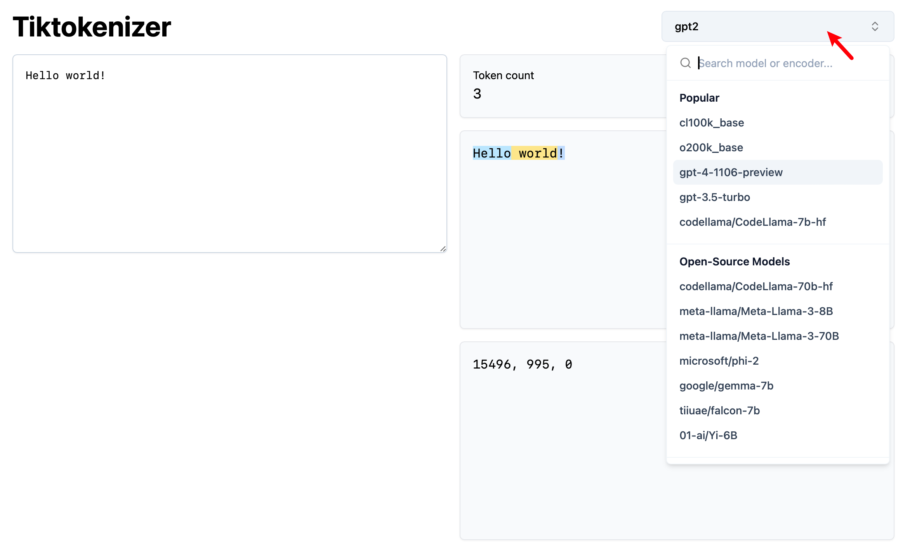

# BPE vs WordPiece：理解 Tokenizer 的工作原理与子词分割方法

> 在应用的路上“蒙着头”走了一段，是时候回过头来理解其中的工作原理了。
>
> 文章将以文本处理为例，介绍数据预处理中的关键组件——**Tokenizer（分词器）**。需要注意的是，这里是偏概念性的讲解，不会深入具体函数的参数细节。
>
> 「[构造词汇表](#构造词汇表)」部分将介绍两种常见的子词分割方法：
>
> - **BPE（Byte-Pair Encoding）**：用于 GPT、GPT-2、RoBERTa、BART 和 DeBERTa 等模型。
> - **WordPiece**：用于 DistilBERT、MobileBERT、Funnel Transformers 和 MPNET 等模型。
>
> 「[拓展](#q注意力掩码attention-mask和词元类型-id-token-type-ids是什么)」部分将涉及两个重要概念：
>
> - **注意力掩码（Attention Mask）**
> - **词元类型 ID （Token Type IDs）**
>
> 工具：[Tiktokenizer（推荐）](https://tiktokenizer.vercel.app) | [The Tokenizer Playground](https://huggingface.co/spaces/Xenova/the-tokenizer-playground)
>
> [代码文件下载](../Demos/19.%20BPE%20vs%20WordPiece：理解%20Tokenizer%20的工作原理与子词分割方法.ipynb)
>
> 在线链接：[Kaggle](https://www.kaggle.com/code/aidemos/19-bpe-vs-wordpiece-tokenizer) | [Colab](https://colab.research.google.com/drive/1J6QN0QbuoWBDIIrBe-TJ6Hi5rnzTSovM?usp=sharing)

## 目录

- [什么是 Tokenizer？](#什么是-tokenizer)
  - [模型输入（编码 Encode）阶段](#模型输入编码-encode阶段)
  - [模型输出（解码 Decode）阶段](#模型输出解码-decode阶段)
  - [直观感受](#直观感受)
- [实际使用](#实际使用)
  - [安装库](#安装库)
  - [BPE 分词器示例](#bpe-分词器示例)
  - [WordPiece 分词器示例](#wordpiece-分词器示例)
  - [使用 encode() 和 decode() 方法](#使用-encode-和-decode-方法)
- [了解 Tokenizer 的基础属性](#了解-tokenizer-的基础属性)
  - [查看词汇表大小](#查看词汇表大小)
  - [查看词汇表](#查看词汇表)
  - [查看特定 Token 和 ID 的映射关系](#查看特定-token-和-id-的映射关系)
  - [查看特殊标记（Special Tokens）](#查看特殊标记special-tokens)
- [分词（Tokenize）](#分词tokenize)
  - [构造词汇表](#构造词汇表)
    - [Byte-Pair Encoding (BPE)](#byte-pair-encoding-bpe)
      - [步骤](#步骤)
      - [示例](#示例)
      - [📝 练习题](#-练习题)
    - [WordPiece](#wordpiece)
      - [步骤](#步骤-1)
      - [示例](#示例-1)
      - [使用函数实现简单的 WordPiece](#使用函数实现简单的-wordpiece)
    - [📝 练习题答案](#-练习题答案)
  - [标记文本](#标记文本)
    - [BPE](#bpe)
    - [WordPiece](#wordpiece-1)
- [映射（Mapping）](#映射mapping)
- [拓展（Transformers）](#拓展transformers)
  - [Q：注意力掩码（Attention Mask）和词元类型 ID （Token Type IDs）是什么？](#q注意力掩码attention-mask和词元类型-id-token-type-ids是什么)
- [参考链接](#参考链接)

## 什么是 Tokenizer？

**Tokenizer**（分词器）可以将原始文本（raw text）转换为模型能够理解的数字序列，在模型输入和输出的两个主要阶段中发挥重要作用：

### 模型输入（编码 Encode）阶段

1. **分词（Tokenize）**

   将文本拆分为词元（Token），常见的分词方式包括字级、词级、子词级（如 BPE、WordPiece）、空格分词等。

   ```sql
   输入: "你好"
   分词: ["你", "好"]
   ```

2. **映射（Mapping）**

   将每个词元映射为词汇表中的唯一 ID，生成的数字序列即为模型的输入。

   ```sql
   分词: ["你", "好"]
   映射: [1001, 1002]
   ```

### 模型输出（解码 Decode）阶段

1. **反映射（De-mapping）**

   模型输出的数字序列通过词汇表映射回对应的词元，二者是一一对应的关系。

   ```sql
   输出: [1001, 1002]
   反映射: ["你", "好"]
   ```

2. **文本重组**

   将解码后的词元以某种规则重新拼接为完整文本。

   ```sql
   反映射: ["你", "好"]
   重组: "你好"
   ```

### 直观感受

访问 [Tiktokenizer](https://tiktokenizer.vercel.app)，通过右上角选取不同的 Tokenizer 进行尝试：



## 实际使用

在进一步讲解之前，我们先通过 **Transformers** 库中的 `AutoTokenizer` 类来使用 Tokenizer。

### 安装库

```bash
pip install transformers
```

### BPE 分词器示例

```python
from transformers import AutoTokenizer

# 使用 GPT-2 的分词器（BPE）
tokenizer = AutoTokenizer.from_pretrained("gpt2")

text = "Hello, world!"

# 编码
# 1. 将文本分词为 Tokens
tokens = tokenizer.tokenize(text)
print("Tokens:", tokens)

# 2. 将 Tokens 转换为 Token IDs
token_ids = tokenizer.convert_tokens_to_ids(tokens)
print("Token IDs:", token_ids)

# 解码
# 1. Token IDs 转换为 Tokens
tokens = tokenizer.convert_ids_to_tokens(token_ids)
print("Tokens:", tokens)

# 2. Tokens 拼接为文本
decoded_text = tokenizer.convert_tokens_to_string(tokens)
print("Decoded Text:", decoded_text)
```

**输出**：

```python
Tokens: ['Hello', ',', 'Ġworld', '!']
Token IDs: [15496, 11, 995, 0]
Tokens: ['Hello', ',', 'Ġworld', '!']
Decoded Text: Hello, world!
```

> [!note]
>
> 实际上 GPT-2 用的是 Byte-level BPE，也就是从字符级处理变成了字节级，这样可以直接处理不同语言或者特殊的符号。

### WordPiece 分词器示例

```python
from transformers import AutoTokenizer

# 使用 BERT 的分词器（WordPiece）
tokenizer = AutoTokenizer.from_pretrained("bert-base-uncased")

text = "Hello, world!"

# 编码
# 1. 将文本分词为 Tokens
tokens = tokenizer.tokenize(text)
print("Tokens:", tokens)

# 2. 将 Tokens 转换为 Token IDs
token_ids = tokenizer.convert_tokens_to_ids(tokens)
print("Token IDs:", token_ids)

# 解码
# 1. Token IDs 转换为 Tokens
tokens = tokenizer.convert_ids_to_tokens(token_ids)
print("Tokens:", tokens)

# 2. Tokens 拼接为文本
decoded_text = tokenizer.convert_tokens_to_string(tokens)
print("Decoded Text:", decoded_text)

```

**输出**：

```python
Tokens: ['hello', ',', 'world', '!']
Token IDs: [7592, 1010, 2088, 999]
Tokens: ['hello', ',', 'world', '!']
Decoded Text: hello, world!
```

### 使用 `encode()` 和 `decode()` 方法

更简洁且常见的使用方式是直接使用 `encode()` 和 `decode()` 方法：

```python
from transformers import AutoTokenizer

# 取消注释以对比两种分词器的输出差异
tokenizer = AutoTokenizer.from_pretrained("gpt2")
# tokenizer = AutoTokenizer.from_pretrained("bert-base-uncased")

text = "Hello, world!"

# 使用 encode() 将文本直接转换为 Token IDs
token_ids = tokenizer.encode(text)
print("Token IDs:", token_ids)

# 使用 decode() 将 Token IDs 转换回文本
decoded_text = tokenizer.decode(token_ids)
print("Decoded Text:", decoded_text)
```

**输出**：

```sql
Token IDs: [15496, 11, 995, 0]
Decoded Text: Hello, world!
```

## 了解 Tokenizer 的基础属性

导入分词器后，可以选择查看一些属性来获得直观的理解，例如查看词汇表、特殊标记等，以 GPT-2 为例。

### 查看词汇表大小

```python
# 获取词汇表大小
vocab_size = tokenizer.vocab_size
print("Vocabulary Size:", vocab_size)
```

**输出**：

```python
Vocabulary Size: 50257
```

### 查看词汇表

```python
print("Vocabulary:", tokenizer.vocab)
```

**输出**：

```sql
{'ĠNaturally': 30413,
 'Ġinteractive': 14333,
 'ĠPlays': 38116,
 'hemer': 39557,
 ...}
```

### 查看特定 Token 和 ID 的映射关系

```python
# 查看特定 Token 的 ID
token_id = tokenizer.convert_tokens_to_ids('world')
print("Token ID for 'world':", token_id)

# 查看特定 ID 对应的 Token
token = tokenizer.convert_ids_to_tokens(995)
print("Token for ID 995:", token)
```

**输出**：

```python
Token ID for 'world': 6894
Token for ID 995: Ġworld
```

> [!note]
>
> 这里的 `Ġ` 代表一个空格字符：
>
> ```python
> print(tokenizer.tokenize(' '))
> ```
>
> 输出为 `['Ġ']`

### 查看特殊标记（Special Tokens）

一些分词器需要使用特殊标记来表示句子的开始、结束、填充等。

```python
# 查看所有特殊标记
special_tokens = tokenizer.all_special_tokens
print("All Special Tokens:", special_tokens)

# 查看特殊标记对应的 ID
special_token_ids = tokenizer.all_special_ids
print("Special Token IDs:", special_token_ids)
```

**输出**：

```python
All Special Tokens: ['<|endoftext|>']
Special Token IDs: [50256]
```

GPT-2 只有一个特殊标记 `<|endoftext|>`，用于表示文本的结束。

**「接下来，我们将探讨 Tokenizer 的具体细节」**

> [!note]
>
> 不需要深入接下来的所有代码细节，只需要查看输出与相应「步骤」的表述。

## 分词（Tokenize）

我们需要将语料库（corpus）的文本拆分为单词，假设当前语料库包含的单词和对应频次如下：

```sql
("low", 5), ("lower", 2), ("newest", 6), ("widest", 3)
```

有些论文也用 `vocab` 来表述，知道后面是频次即可，命名不用纠结。

### 构造词汇表

#### Byte-Pair Encoding (BPE)

> **参考文献：**
>
> - [A new algorithm for data compression. 1994](http://www.pennelynn.com/Documents/CUJ/HTML/94HTML/19940045.HTM)
> - [Neural Machine Translation of Rare Words with Subword Units. 2015](https://arxiv.org/pdf/1508.07909v5)
>
> BPE 是一种基于数据压缩的技术，最早由 Gage 在 1994 年提出，后来被用于 GPT 等模型。它是一种子词分割算法，从字符级别开始，通过迭代合并频率最高的字符对（或字符序列）来构建新的 Token，从而可以处理部分 OOV（Out-Of-Vocabulary）情况。
>
> **Q: 什么是 OOV ？**
>
> 其实就是不在词汇表中的词，也称之为「未登录词」。

BPE 每次的迭代目标是找到频率最高的相邻字符对，定义 Score 以与 WordPiece 作对比：

$$
\text{Score}_{\text{BPE}}(x, y) = \text{freq}(x, y)
$$

其中, $\text{freq}(x, y)$ 表示字符对 $(x, y)$ 在语料库中的出现频次。

##### 步骤

1. **初始化词汇表 $V$**：
   - $V$ 包含语料库中的所有唯一字符，即单词字符的集合。
2. **统计字符对的频次**：
   - 对于每个单词的字符序列，统计相邻字符对的出现频次。
3. **找到频次（Score）最高的字符对并合并**：
   - 选择出现频率最高的字符对 $(x, y)$，将其合并为新符号 $xy$。
4. **更新词汇表并重复步骤 2 到 4**：
   - 将新符号添加到词汇表 $V = V \cup \{xy\}$。
   - 更新语料库中的单词表示，重复统计和合并过程，直到满足停止条件（例如，词汇表达到预定大小）。

##### 示例

**步骤 1：初始化词汇表**

- **将单词拆分为字符序列**：

  ```plaintext
  ("l", "o", "w"), 5  
  ("l", "o", "w", "e", "r"), 2  
  ("n", "e", "w", "e", "s", "t"), 6  
  ("w", "i", "d", "e", "s", "t"), 3
  ```

- **词汇表 $V$**：

  ```plaintext
  {'l', 'o', 'w', 'e', 'r', 'n', 's', 't', 'i', 'd'}
  ```

**步骤 2：统计字符对的频次**

编写一个函数，根据给定的单词和其频次，自动统计字符对的频次。

```python
from collections import defaultdict

def count_char_pairs(word_freq):
    """
    计算字符对的频次。
    
    参数：
        word_freq: List of tuples, 每个元组包含单词和其频次
        
    返回：
        字符对频次的字典
    """
    pair_freq = defaultdict(int)
    for word, freq in word_freq:
        chars = list(word)
        for i in range(len(chars) - 1):
            pair = (chars[i], chars[i + 1])
            pair_freq[pair] += freq
    return pair_freq

# 示例词汇表和单词频次
word_freq = [
    ("low", 5),
    ("lower", 2),
    ("newest", 6),
    ("widest", 3)
]

pair_freq = count_char_pairs(word_freq)
print("字符对频次统计结果:")
for pair, freq in pair_freq.items():
    print(f"{pair}: {freq}")
```

**输出**：

```plaintext
字符对频次统计结果:
('l', 'o'): 7        # 5 (low) + 2 (lower)
('o', 'w'): 7        # 5 (low) + 2 (lower)
('w', 'e'): 8        # 2 (lower) + 6 (newest)
('e', 'r'): 2
('n', 'e'): 6
('e', 'w'): 6
('e', 's'): 9        # 6 (newest) + 3 (widest)
('s', 't'): 9        # 6 (newest) + 3 (widest)
('w', 'i'): 3
('i', 'd'): 3
('d', 'e'): 3
```

**步骤 3：找到频次最高的字符对并合并**

- **选择频次最高的字符对**：

  - `("e", "s")` 和 `("s", "t")`，频次均为 9。可以任选其一进行合并，假设选择排序第一的： `("e", "s")`。

- **合并 `("e", "s")` 为新符号 `es`**。

- **记录合并操作**：

  ```plaintext
  Merge 1: ("e", "s") -> "es"
  ```

**步骤 4：更新词汇表并重复**

- **更新单词序列**：

  ```plaintext
  ("l", "o", "w"), 5  
  ("l", "o", "w", "e", "r"), 2  
  ("n", "e", "w", "es", "t"), 6  
  ("w", "i", "d", "es", "t"), 3
  ```

- **更新词汇表 $V$**：

  ```plaintext
  {'l', 'o', 'w', 'e', 'r', 'n', 's', 't', 'i', 'd', 'es'}
  ```

- **重复步骤 2 到 4，直到达到预定的词汇表大小**。

> ##### 📝 练习题
>
> 停下来思考一下，答案和代码位于[当前模块末尾](#-练习题答案)。
>
> **Q1.** 最初的词汇表大小为 10，假设预定大小为 13，那么当前的词汇表 $V$ 为多少？合并记录是什么？
>
> **Q2.** 如果以 `</w>`（表示单词结尾）作为每个语料库中单词的结尾，最初的词汇表会受到什么影响，后续的过程会如何变化？假设预定大小为 14，当前的合并记录是什么？

#### WordPiece

> **参考文献：**
>
> - [Japanese and Korean voice search. 2012](https://static.googleusercontent.com/media/research.google.com/zh-CN//pubs/archive/37842.pdf)
> - [Google’s Neural Machine Translation System: Bridging the Gap between Human and Machine Translation. 2016](https://arxiv.org/pdf/1609.08144v2)
>
> WordPiece 是一种子词分割算法，最初用于处理日语和韩语的语音搜索，后来在 Google 的神经机器翻译系统中得到应用。

与 BPE 不同，WordPiece 的 Score 由字符对频次与其组成部分频次的比值决定，定义 Score：

$$
\text{Score}_{\text{WordPiece}}(x, y) = \frac{\text{freq}(xy)}{\text{freq}(x) \times \text{freq}(y)}
$$

其中, $\text{freq}(x)$, $\text{freq}(y)$ 和 $\text{freq}(xy)$ 分别表示符号 $x$, $y$ 和它们合并后的符号 $xy$ 的频次。

##### 步骤

1. **初始化词汇表 $V$**：
   - 与 BPE 相同, $V$ 包含语料库中的所有唯一字符，但处理方式略有不同：对于每个单词，除了首个字符外，其他字符前都加上 `##` 前缀。
2. **统计字符对的频次及 Score**：
   - 对于每个可能的字符对 $(x, y)$，计算 $\text{freq}(x)$, $\text{freq}(y)$, $\text{freq}(xy)$，并计算 Score。
3. **找到 Score 最高的字符对并合并**：
   - 选择 Score 最高的字符对 $(x, y)$，将其合并为新符号 $xy$，注意：
     - 如果第二个符号以 `##` 开头，合并时去掉 `##` 前缀再进行连接。
     - 新符号是否以 `##` 开头，取决于第一个符号是否以 `##` 开头。
4. **更新词汇表并重复步骤 2 到 4**：
   - 将新符号添加到词汇表 $V = V \cup \{xy\}$。
   - 更新语料库中的单词表示，重复统计和合并过程，直到满足停止条件。

##### 示例

使用与 BPE 示例相同的语料库。

**步骤 1：初始化词汇表**

- **将单词拆分为字符序列**：

  ```plaintext
  ('l', '##o', '##w'), 5                       # "low"
  ('l', '##o', '##w', '##e', '##r'), 2         # "lower"
  ('n', '##e', '##w', '##e', '##s', '##t'), 6  # "newest"
  ('w', '##i', '##d', '##e', '##s', '##t'), 3  # "widest"
  ```
  
- **词汇表 $V$**：

  ```plaintext
  {'l', '##o', '##w', '##e', '##r', 'n', '##s', '##t', 'w', '##i', '##d'}
  ```

**步骤 2：统计字符和字符对的频次，计算 Score**

可以设计一个函数完成这个步骤（直接运行查看输出）：

```python
from collections import defaultdict

def count_char_pairs_wordpiece(word_freq):
    """
    计算字符对的频次和单个字符的频次。
    
    参数：
        word_freq: List of tuples, 每个元组包含单词（列表形式）和其频次
        
    返回：
        两个字典，分别为字符对频次和单个字符频次
    """
    pair_freq = defaultdict(int)
    char_freq = defaultdict(int)
    for word, freq in word_freq:
        for i in range(len(word)):
            char_freq[word[i]] += freq
            if i < len(word) - 1:
                pair = (word[i], word[i + 1])
                pair_freq[pair] += freq
    return pair_freq, char_freq

def compute_wordpiece_score(freq_xy, freq_x, freq_y):
    """
    根据 WordPiece 的定义计算 Score。
    
    参数：
        freq_xy: 符号对的频次
        freq_x: 符号 x 的频次
        freq_y: 符号 y 的频次
        
    返回：
        计算得到的 Score
    """
    if freq_x == 0 or freq_y == 0:
        return 0
    return freq_xy / (freq_x * freq_y)

# 示例词汇表和单词频次
word_freq = [
    (['l', '##o', '##w'], 5),
    (['l', '##o', '##w', '##e', '##r'], 2),
    (['n', '##e', '##w', '##e', '##s', '##t'], 6),
    (['w', '##i', '##d', '##e', '##s', '##t'], 3)
]

# 统计字符对频次和单个字符频次
pair_freq, char_freq = count_char_pairs_wordpiece(word_freq)

# 计算每对字符的 Score
scores = {}
for pair in pair_freq:
    freq_xy = pair_freq[pair]
    freq_x = char_freq[pair[0]]
    freq_y = char_freq[pair[1]]
    score = compute_wordpiece_score(freq_xy, freq_x, freq_y)
    scores[pair] = score

# 输出结果
print("字符对频次统计结果:")
for pair, freq in pair_freq.items():
    print(f"{pair}: {freq}")

print("\n单个字符频次统计结果:")
for char, freq in char_freq.items():
    print(f"{char}: {freq}")

print("\n字符对 Score 计算结果:")
for pair, score in scores.items():
    print(f"{pair}: {score:.4f}")

```

**输出**：

```python
字符对频次统计结果:
('l', '##o'): 7
('##o', '##w'): 7
('##w', '##e'): 8
('##e', '##r'): 2
('n', '##e'): 6
('##e', '##w'): 6
('##e', '##s'): 9
('##s', '##t'): 9
('w', '##i'): 3
('##i', '##d'): 3
('##d', '##e'): 3

单个字符频次统计结果:
l: 7
##o: 7
##w: 13
##e: 17
##r: 2
n: 6
##s: 9
##t: 9
w: 3
##i: 3
##d: 3

字符对 Score 计算结果:
('l', '##o'): 0.1429
('##o', '##w'): 0.0769
('##w', '##e'): 0.0362
('##e', '##r'): 0.0588
('n', '##e'): 0.0588
('##e', '##w'): 0.0271
('##e', '##s'): 0.0588
('##s', '##t'): 0.1111
('w', '##i'): 0.3333
('##i', '##d'): 0.3333
('##d', '##e'): 0.0588
```

- **选择频次最高的字符对**：

  -  `('w', '##i')` 和 `('##i', '##d')`，Score 都为 0.3333。可以任选其一进行合并，假设选择排序第一的： `("w", "##i")`。

- **合并 `('w', '##i')` 为新符号 `wi`**

  - 注意：合并时，若第二个符号以 `##` 开头，合并后的新符号为第一个符号加上第二个符号去掉 `##` 前缀的部分。

- **记录合并操作：**

  ```plaintext
  Merge 1: ('w', '##i') -> 'wi'
  ```

**步骤 4：更新词汇表并重复**

- **更新词汇表 $V$**：

  ```plaintext
  {'l', '##o', '##w', '##e', '##r', 'n', '##s', '##t', 'w', '##i', '##d', 'wi'}
  ```

- **更新单词序列**：

  ```plaintext
  ('l', '##o', '##w'), 5                       # "low"
  ('l', '##o', '##w', '##e', '##r'), 2         # "lower"
  ('n', '##e', '##w', '##e', '##s', '##t'), 6  # "newest"
  ('wi', '##d', '##e', '##s', '##t'), 3        # "widest"
  ```

- **重复步骤 2 到 4，直到达到预定的词汇表大小**。

##### 使用函数实现简单的 WordPiece

BPE 的实现在[练习题答案](#-练习题答案)中。

```python
from collections import defaultdict

def create_new_symbol(x, y):
    """
    根据 WordPiece 的规则创建新符号。

    - 如果 y 以 '##' 开头，合并时需要去掉 y 的 '##' 前缀。
    - 新符号是否以 '##' 开头，取决于 x 是否以 '##' 开头。
    """
    x_starts_hash = x.startswith('##')
    x_without_hash = x[2:] if x_starts_hash else x
    y_without_hash = y[2:] if y.startswith('##') else y
    new_symbol = x_without_hash + y_without_hash
    if x_starts_hash:
        new_symbol = '##' + new_symbol
    return new_symbol

def count_char_pairs_wordpiece(word_freq):
    """
    计算字符对的频次和单个字符的频次。
    
    参数：
        word_freq: List of tuples, 每个元组包含单词（列表形式）和其频次
        
    返回：
        两个字典，分别为字符对频次和单个字符频次
    """
    pair_freq = defaultdict(int)
    char_freq = defaultdict(int)
    for word, freq in word_freq:
        for i in range(len(word)):
            char_freq[word[i]] += freq
            if i < len(word) - 1:
                pair = (word[i], word[i + 1])
                pair_freq[pair] += freq
    return pair_freq, char_freq

def compute_wordpiece_score(freq_xy, freq_x, freq_y):
    """
    根据 WordPiece 的定义计算 Score。
    
    参数：
        freq_xy: 符号对的频次
        freq_x: 符号 x 的频次
        freq_y: 符号 y 的频次
        
    返回：
        计算得到的 Score
    """
    if freq_x == 0 or freq_y == 0:
        return 0
    return freq_xy / (freq_x * freq_y)

def find_best_pair_wordpiece(pair_freq, char_freq):
    """
    找到具有最高 Score 的字符对。

    参数：
        pair_freq: 字符对频次的字典
        char_freq: 单个字符频次的字典
        
    返回：
        具有最高 Score 的字符对及其 Score
    """
    scores = {}
    for pair, freq_xy in pair_freq.items():
        x, y = pair
        freq_x = char_freq.get(x, 0)
        freq_y = char_freq.get(y, 0)
        score = compute_wordpiece_score(freq_xy, freq_x, freq_y)
        scores[pair] = score
    if not scores:
        return None, 0
    best_pair = max(scores, key=scores.get)
    return best_pair, scores[best_pair]

def merge_pair_wordpiece(word_freq, pair_to_merge):
    """
    合并指定的字符对到新符号。

    参数：
        word_freq: List of tuples, 每个元组包含单词（列表形式）和其频次
        pair_to_merge: 要合并的字符对
    返回：
        更新后的单词频次列表
    """
    merged_word_freq = []
    new_symbol = create_new_symbol(pair_to_merge[0], pair_to_merge[1])
    for word, freq in word_freq:
        new_word = []
        i = 0
        while i < len(word):
            # 检查当前字符和下一个字符是否是要合并的字符对
            if (
                i < len(word) - 1
                and word[i] == pair_to_merge[0]
                and word[i + 1] == pair_to_merge[1]
            ):
                new_word.append(new_symbol)
                i += 2  # 跳过下一个字符，因为已合并
            else:
                new_word.append(word[i])
                i += 1
        merged_word_freq.append((new_word, freq))
    return merged_word_freq

def wordpiece_merge(word_freq, vocab_size):
    """
    执行 WordPiece 合并操作，直到词汇表达到预定大小。

    参数：
        word_freq: List of tuples, 每个元组包含单词（列表形式）和其频次
        vocab_size: 预定的词汇表大小
        
    返回：
        最终词汇表和合并记录
    """
    # 初始化词汇表
    vocab = set()
    for word, _ in word_freq:
        vocab.update(word)
    merges = []

    while len(vocab) < vocab_size:
        pair_freq, char_freq = count_char_pairs_wordpiece(word_freq)
        best_pair, best_score = find_best_pair_wordpiece(pair_freq, char_freq)
        if not best_pair:
            break
        # 合并最佳字符对
        new_symbol = create_new_symbol(best_pair[0], best_pair[1])
        word_freq = merge_pair_wordpiece(word_freq, best_pair)
        vocab.add(new_symbol)
        merges.append((best_pair, new_symbol))
        print(
            f"Merge: {best_pair} -> {new_symbol}, Score: {best_score:.4f}, 词汇表大小: {len(vocab)}"
        )

    return vocab, merges

# 示例
word_freq = [
    (['l', '##o', '##w'], 5),
    (['l', '##o', '##w', '##e', '##r'], 2),
    (['n', '##e', '##w', '##e', '##s', '##t'], 6),
    (['w', '##i', '##d', '##e', '##s', '##t'], 3)
]

# 预定词汇表大小为15
final_vocab_wp, merge_records_wp = wordpiece_merge(word_freq, 15)

print("\n最终词汇表 V:")
print(final_vocab_wp)

print("\n合并记录:")
for idx, (pair, new_sym) in enumerate(merge_records_wp, 1):
    print(f"Merge {idx}: {pair} -> {new_sym}")
```

**输出**：

```
Merge: ('w', '##i') -> wi, Score: 0.3333, 词汇表大小: 12
Merge: ('wi', '##d') -> wid, Score: 0.3333, 词汇表大小: 13
Merge: ('l', '##o') -> lo, Score: 0.1429, 词汇表大小: 14
Merge: ('##s', '##t') -> ##st, Score: 0.1111, 词汇表大小: 15

最终词汇表 V:
{'##st', 'n', '##i', '##s', 'wid', '##d', 'wi', '##r', '##o', 'lo', 'w', '##e', '##w', '##t', 'l'}

合并记录:
Merge 1: ('w', '##i') -> wi
Merge 2: ('wi', '##d') -> wid
Merge 3: ('l', '##o') -> lo
Merge 4: ('##s', '##t') -> ##st
```

#### 📝 练习题答案

**Q1. 最初的词汇表大小为 10，假设预定大小为 13，那么当前的词汇表 $V$ 为多少？合并记录呢？**

- **初始词汇表 $V$**：

  ```plaintext
  {'l', 'o', 'w', 'e', 'r', 'n', 's', 't', 'i', 'd'}
  ```

  大小为 10。

- **合并记录**：

  1. 合并 `("e", "s")` -> `es`，词汇表大小增加到 11。
  2. 合并 `("es", "t")` -> `est`，词汇表大小增加到 12。
  3. 合并 `("l", "o")` -> `lo`，词汇表大小增加到 13。

- **最终词汇表 $V$**：

  ```plaintext
  {'l', 'o', 'w', 'e', 'r', 'n', 's', 't', 'i', 'd', 'es', 'est', 'lo'}
  ```

运行代码：

```python
from collections import defaultdict

def count_char_pairs(word_freq):
    """
    计算字符对的频次。
    
    参数：
        word_freq: List of tuples, 每个元组包含单词（列表形式）和其频次
    
    返回：
        字符对频次的字典
    """
    pair_freq = defaultdict(int)
    for word, freq in word_freq:
        for i in range(len(word) - 1):
            pair = (word[i], word[i + 1])
            pair_freq[pair] += freq
    return pair_freq

def find_best_pair(freq):
    """
    找到频次最高的字符对。
    
    参数：
        freq: 字符对频次的字典
        
    返回：
        频次最高的字符对及其频次
    """
    if not freq:
        return None, 0
    best_pair = max(freq, key=freq.get)
    return best_pair, freq[best_pair]

def merge_pair(word_freq, pair_to_merge):
    """
    合并指定的字符对到新符号。
    
    参数：
        word_freq: List of tuples, 每个元组包含单词（列表形式）和其频次
        pair_to_merge: 要合并的字符对
    
    返回：
        更新后的单词频次列表
    """
    merged_word_freq = []
    pair_str = ''.join(pair_to_merge)
    for word, freq in word_freq:
        new_word = []
        i = 0
        while i < len(word):
            # 检查当前字符和下一个字符是否是要合并的字符对
            if i < len(word) - 1 and word[i] == pair_to_merge[0] and word[i + 1] == pair_to_merge[1]:
                new_word.append(pair_str)
                i += 2  # 跳过下一个字符，因为已合并
            else:
                new_word.append(word[i])
                i += 1
        merged_word_freq.append((new_word, freq))
    return merged_word_freq

def bpe_merge(word_freq, vocab_size):
    """
    执行 BPE 合并操作，直到词汇表达到预定大小。
    
    参数：
        word_freq: List of tuples, 每个元组包含单词（列表形式）和其频次
        vocab_size: 预定的词汇表大小
    
    返回：
        最终词汇表和合并记录
    """
    # 初始化词汇表
    vocab = set()
    for word, _ in word_freq:
        vocab.update(word)
    merges = []
    
    while len(vocab) < vocab_size:
        pair_freq = count_char_pairs(word_freq)
        best_pair, best_freq = find_best_pair(pair_freq)
        if not best_pair:
            break
        # 合并最佳字符对
        word_freq = merge_pair(word_freq, best_pair)
        new_symbol = ''.join(best_pair)
        vocab.add(new_symbol)
        merges.append((best_pair, new_symbol))
        print(f"Merge: {best_pair} -> {new_symbol}, 词汇表大小: {len(vocab)}")
            
    return vocab, merges

# 示例
word_freq = [
    (['l', 'o', 'w'], 5),
    (['l', 'o', 'w', 'e', 'r'], 2),
    (['n', 'e', 'w', 'e', 's', 't'], 6),
    (['w', 'i', 'd', 'e', 's', 't'], 3)
]

# 预定词汇表大小为13
final_vocab, merge_records = bpe_merge(word_freq, 13)

print("\n最终词汇表 V:")
print(final_vocab)

print("\n合并记录:")
for idx, (pair, new_sym) in enumerate(merge_records, 1):
    print(f"Merge {idx}: {pair} -> {new_sym}")

```

**输出**：

```python
Merge: ('e', 's') -> es, 词汇表大小: 11
Merge: ('es', 't') -> est, 词汇表大小: 12
Merge: ('l', 'o') -> lo, 词汇表大小: 13

最终词汇表 V:  # 因为是字典，所以实际顺序会和之前展示的不一致
{'e', 'r', 's', 'est', 'w', 'l', 'o', 'lo', 'es', 'i', 'n', 't', 'd'}

合并记录:
Merge 1: ('e', 's') -> es
Merge 2: ('es', 't') -> est
Merge 3: ('l', 'o') -> lo
```

**Q2. 如果以`</w>`（end-of-word）作为每个语料库中单词的结尾，最初的词汇表会受到什么影响，后续的过程呢？假设预定大小为 14，当前的合并记录是什么？**

- **初始词汇表 $V$**：

  添加 `</w>` 后，词汇表变为：

  ```plaintext
  {'l', 'o', 'w', 'e', 'r', 'n', 's', 't', 'i', 'd', '</w>'}
  ```

  大小为 11。

- **影响**：

  合并过程和合并记录将会发生变化，因为 `</w>` 的存在会影响字符对的频次统计和合并顺序。

- **合并记录**：

  1. 合并 `("e", "s")` -> `es`，词汇表大小增加到 12。
  2. 合并 `("es", "t")` -> `est`，词汇表大小增加到 13。
  3. 合并 `("est", "<\w>")` -> `est<\w>`，词汇表大小增加到 14。

运行代码：
```python
# 示例
word_freq = [
    (['l', 'o', 'w', '</w>'], 5),
    (['l', 'o', 'w', 'e', 'r', '</w>'], 2),
    (['n', 'e', 'w', 'e', 's', 't', '</w>'], 6),
    (['w', 'i', 'd', 'e', 's', 't', '</w>'], 3)
]

# 预定词汇表大小为14
final_vocab, merge_records = bpe_merge(word_freq, 14)

print("\n最终词汇表 V:")
print(final_vocab)

print("\n合并记录:")
for idx, (pair, new_sym) in enumerate(merge_records, 1):
    print(f"Merge {idx}: {pair} -> {new_sym}")
```

**输出**：

```
Merge: ('e', 's') -> es, 词汇表大小: 12
Merge: ('es', 't') -> est, 词汇表大小: 13
Merge: ('est', '</w>') -> est</w>, 词汇表大小: 14

最终词汇表 V:
{'e', 'r', 's', 'est', 'w', 'l', 'est</w>', 'o', 'es', 'i', 'n', 't', 'd', '</w>'}

合并记录:
Merge 1: ('e', 's') -> es
Merge 2: ('es', 't') -> est
Merge 3: ('est', '</w>') -> est</w>
```

### 标记文本

你可能已经注意到，每次合并时我们都会记录对应的 **merge** 规则，但并未详细说明其作用，下面将以 BPE 为例进行解释。

#### BPE

在之前的示例中，三轮合并后将得到以下合并规则（按合并顺序排列）：  

1. 合并字符对 `'e'` 和 `'s'`，得到 `'es'`。
2. 合并字符对 `'es'` 和 `'t'`，得到 `'est'`。
3. 合并字符对 `'l'` 和 `'o'`，得到 `'lo'`。

假设当前词汇表包含所有单个字符，修改[官方文档](https://huggingface.co/learn/nlp-course/en/chapter6/5)最后提供的 tokenize() 示例代码进行演示：

```python
def tokenize(text):
    # 预分词处理：将文本拆分为初步的单词列表
    pre_tokenize_result = tokenizer._tokenizer.pre_tokenizer.pre_tokenize_str(text)
    pre_tokenized_text = [word for word, offset in pre_tokenize_result]

    print("初始预分词结果:")
    print(pre_tokenized_text)

    # 将每个单词拆分为字符列表
    splits = [[l for l in word] for word in pre_tokenized_text]
    print("\n初始拆分结果:")
    print(splits)

    # 遍历所有合并规则（merges），逐步应用到拆分后的结果中
    for pair, merge in merges.items():
        print(f"\n应用合并规则: {pair} -> {merge}")

        # 遍历每个已拆分的单词
        for idx, split in enumerate(splits):
            print(f"  合并前第 {idx+1} 个单词: {split}")
            i = 0
            # 在当前拆分的字符中查找匹配的字符对
            while i < len(split) - 1:
                if split[i] == pair[0] and split[i + 1] == pair[1]:
                    # 合并字符对
                    split = split[:i] + [merge] + split[i + 2 :]
                    print(f"    在位置 {i} 处合并: {split}")
                else:
                    i += 1
            # 更新拆分后的结果
            splits[idx] = split

    print("\n最终拆分结果:")
    print(splits)

    # 将所有拆分后的结果合并为一个 Token 列表并返回
    return sum(splits, [])

# 示例 merges 字典
merges = {
    ('e', 's'): 'es',
    ('es', 't'): 'est',
    ('l', 'o'): 'lo'
}

# 示例文本
text = "estimate, local"

# 调用 tokenize 函数，并打印中间过程
tokens = tokenize(text)
print("\n最终生成的 Tokens:")
print(tokens)

```

**输出**：

```python
初始预分词结果:
['estimate', ',', 'local']

初始拆分结果:
[['e', 's', 't', 'i', 'm', 'a', 't', 'e'], [','], ['l', 'o', 'c', 'a', 'l']]

应用合并规则: ('e', 's') -> es
  合并前第 1 个单词: ['e', 's', 't', 'i', 'm', 'a', 't', 'e']
    在位置 0 处合并: ['es', 't', 'i', 'm', 'a', 't', 'e']
  合并前第 2 个单词: [',']
  合并前第 3 个单词: ['l', 'o', 'c', 'a', 'l']

应用合并规则: ('es', 't') -> est
  合并前第 1 个单词: ['es', 't', 'i', 'm', 'a', 't', 'e']
    在位置 0 处合并: ['est', 'i', 'm', 'a', 't', 'e']
  合并前第 2 个单词: [',']
  合并前第 3 个单词: ['l', 'o', 'c', 'a', 'l']

应用合并规则: ('l', 'o') -> lo
  合并前第 1 个单词: ['est', 'i', 'm', 'a', 't', 'e']
  合并前第 2 个单词: [',']
  合并前第 3 个单词: ['l', 'o', 'c', 'a', 'l']
    在位置 0 处合并: ['lo', 'c', 'a', 'l']

最终拆分结果:
[['est', 'i', 'm', 'a', 't', 'e'], [','], ['lo', 'c', 'a', 'l']]

最终生成的 Tokens:
['est', 'i', 'm', 'a', 't', 'e', ',', 'lo', 'c', 'a', 'l']
```

不过，在之前的过程中生成的最终词汇表 $V$ 并未包含所有单个字符，而是：  

```sql
{'e', 'r', 's', 'est', 'w', 'l', 'o', 'lo', 'es', 'i', 'n', 't', 'd'}
```

因此，对于输入 `"estimate, local"`，其标记结果为：  

```sql
['est', 'i', '[UNK]', 'a', 't', 'e', '[UNK]', 'lo', '[UNK]', '[UNK]', l]
```

这里的 `'[UNK]'`（UNKNOWN）表示该子词不在词汇表中，即属于 **OOV（Out-of-Vocabulary）** 的情况。

#### WordPiece

和 BPE 不同，WordPiece 对 OOV 采取的是「宁杀错不放过」策略，即只要有一个字符没见过，整个单词都标记为 `'[UNK]'`。

修改[官方文档](https://huggingface.co/learn/nlp-course/en/chapter6/6)最后提供的 tokenize() 示例代码进行演示：

```python
from transformers import AutoTokenizer

def tokenize(text):
    # 预分词处理：将文本拆分为初步的单词列表
    pre_tokenize_result = tokenizer._tokenizer.pre_tokenizer.pre_tokenize_str(text)
    pre_tokenized_text = [word for word, offset in pre_tokenize_result]

    print("\n初始预分词结果:")
    print(pre_tokenized_text)

    # 对每个单词进行标记
    tokenized_words = []
    for word in pre_tokenized_text:
        tokens = []
        print(f"\n正在标记单词: {word}")
        
        while len(word) > 0:
            i = len(word)
            # 尝试匹配词汇表中的最长子词
            while i > 0 and word[:i] not in vocab:
                i -= 1
            if i == 0:
                print(f"  [UNK] 标记: {word}")
                tokens = ["[UNK]"]  # 没有匹配到则返回 [UNK]
                break  # 跳出循环，不再继续处理该单词

            # 匹配到子词，添加到 tokens 列表中
            matched_token = word[:i]
            tokens.append(matched_token)
            print(f"  匹配到 Token: {matched_token}")

            # 更新剩余部分，并添加“##”作为前缀
            word = word[i:]
            if len(word) > 0:
                word = f"##{word}"
                print(f"  剩余部分添加前缀: {word}")

        print(f"  标记结果: {tokens}")
        tokenized_words.append(tokens)

    print("\n最终标记结果:")
    flattened_tokens = sum(tokenized_words, [])  # 展平成单层列表
    print(flattened_tokens)

    return flattened_tokens

# 示例词汇表
vocab = {'##st', 'n', '##i', '##s', 'wid', '##d', 'wi', '##r', '##o', 
         'lo', 'w', '##e', '##w', '##t', 'l'}

# 示例文本
text = "estimate, local, lows"

# 使用 BERT 的分词器（WordPiece）
tokenizer = AutoTokenizer.from_pretrained('bert-base-uncased')

# 调用 tokenize 函数，并打印中间过程
tokens = tokenize(text)

```

**输出**：

```sql
初始预分词结果:
['estimate', ',', 'local', ',', 'lows']

正在标记单词: estimate
  [UNK] 标记: estimate
  标记结果: ['[UNK]']

正在标记单词: ,
  [UNK] 标记: ,
  标记结果: ['[UNK]']

正在标记单词: local
  匹配到 Token: lo
  剩余部分添加前缀: ##cal
  [UNK] 标记: ##cal
  标记结果: ['[UNK]']

正在标记单词: ,
  [UNK] 标记: ,
  标记结果: ['[UNK]']

正在标记单词: lows
  匹配到 Token: lo
  剩余部分添加前缀: ##ws
  匹配到 Token: ##w
  剩余部分添加前缀: ##s
  匹配到 Token: ##s
  标记结果: ['lo', '##w', '##s']

最终标记结果:
['[UNK]', '[UNK]', '[UNK]', '[UNK]', 'lo', '##w', '##s']
```

## 映射（Mapping）

以 BPE 为例，最终词汇表 $V$ 中的 Token 和对应的频次分别为：

```
vocab = {
    'lo': 7,
    'w': 16,
    'e': 8,
    'r': 2,
    'n': 6,
    'est': 9,
    'i': 3,
    'd': 3
}
```

简单实现 Token 和 ID 之间的映射关系的代码：

```python
# 创建 token 到 ID 的映射
token_to_id = {token: idx for idx, token in enumerate(vocab)}

# 创建 ID 到 token 的映射
id_to_token = {idx: token for token, idx in token_to_id.items()}

# 打印映射关系
print("Token to ID:", token_to_id)
print("ID to Token:", id_to_token)
```

**输出**：

```
Token to ID: {'lo': 0, 'w': 1, 'e': 2, 'r': 3, 'n': 4, 'est': 5, 'i': 6, 'd': 7}
ID to Token: {0: 'lo', 1: 'w', 2: 'e', 3: 'r', 4: 'n', 5: 'est', 6: 'i', 7: 'd'}
```

当然，也可以根据频次或者其他规则进行特殊处理。

以上是编码部分的概述，实际上在文本预处理的时候还会增加特殊标记，但这些以及后续的解码部分大多是一些文本处理的规则，这里就不过多赘述了，Tokenizer 之间的核心差异在于使用的分割方法和词汇表的构建策略。

## 拓展（Transformers）

在 Transformers 中，**分词（tokenization）** 实际上包含以下几个步骤：  

1. **标准化（Normalization）**：对文本进行必要的清理操作，例如删除多余空格或重音符号、进行 Unicode 标准化等。
2. **预分词（Pre-tokenization）**：将输入拆分为单词。
3. **通过模型处理输入（Running the input through the model）**：使用预分词后的单词生成一系列词元（tokens）。
4. **后处理（Post-processing）**：添加分词器的特殊标记，生成注意力掩码（attention mask）和词元类型 ID（token type IDs）。

[官方文档](https://huggingface.co/learn/nlp-course/en/chapter6/8)给出了一张整体流程图：


运行代码：

```python
from transformers import AutoTokenizer

# 加载 BERT 的分词器
tokenizer = AutoTokenizer.from_pretrained("bert-base-uncased")

# 原始文本
text = "Hello how are U tday"
print("原始文本:", text)

# 1. 标准化：转换为小写
normalized_text = text.lower()
print("标准化后的文本:", normalized_text)

# 2. 预分词（Pre-tokenization）：将输入拆分为单词
pre_tokenized = tokenizer.backend_tokenizer.pre_tokenizer.pre_tokenize_str(normalized_text)
print("预分词结果:", pre_tokenized)

# 3. 分词：将预分词后的结果转换为子词级词元
tokens = tokenizer.tokenize(normalized_text)
print("词元（Tokens）:", tokens)

# 4. 将 tokens 转换为 token IDs
token_ids = tokenizer.convert_tokens_to_ids(tokens)
print("词元 ID（Token IDs）:", token_ids)

# 5. 编码（包含特殊标记和后处理）
encoded = tokenizer(normalized_text, return_tensors="pt")
print("编码结果:", encoded)

# 6. 打印注意力掩码和词元类型 ID（后处理部分）
print("注意力掩码（Attention Mask）:", encoded["attention_mask"])
print("词元类型 ID（Token Type IDs）:", encoded["token_type_ids"])

# 7. 解码：将 token IDs 转换回文本
decoded_text = tokenizer.decode(token_ids)
print("解码后的文本:", decoded_text)

```

**输出**：

```sql
原始文本: Hello how are U tday
标准化后的文本: hello how are u tday
预分词结果: [('hello', (0, 5)), ('how', (6, 9)), ('are', (10, 13)), ('u', (14, 15)), ('tday', (16, 20))]
词元（Tokens）: ['hello', 'how', 'are', 'u', 'td', '##ay']
词元 ID（Token IDs）: [7592, 2129, 2024, 1057, 14595, 4710]
编码结果: {'input_ids': tensor([[  101,  7592,  2129,  2024,  1057, 14595,  4710,   102]]), 'token_type_ids': tensor([[0, 0, 0, 0, 0, 0, 0, 0]]), 'attention_mask': tensor([[1, 1, 1, 1, 1, 1, 1, 1]])}
注意力掩码（Attention Mask）: tensor([[1, 1, 1, 1, 1, 1, 1, 1]])
词元类型 ID（Token Type IDs）: tensor([[0, 0, 0, 0, 0, 0, 0, 0]])
解码后的文本: hello how are u tday
```

### Q：注意力掩码（Attention Mask）和词元类型 ID （Token Type IDs）是什么？

> 

**注意力掩码**确保模型只关注实际的词元，忽略填充部分，从而避免无效的计算：

- **1**：表示模型应关注的词元（Tokens）
- **0**：表示模型应忽略的词元（通常是填充 `padding` 的部分）。

在之前的[文章](../Guide/16.%20用%20LoRA%20微调%20Stable%20Diffusion：拆开炼丹炉，动手实现你的第一次%20AI%20绘画.md#怎么让模型理解文本)中曾展示过注意力掩码在 `padding="max_length"` 下的表现。

**词元类型 ID** 用于区分输入中的不同句子或段落：

- **0**：表示第一个句子的词元。
- **1**：表示第二个句子的词元。

运行代码：

```python
from transformers import AutoTokenizer

# 加载 BERT 的分词器
tokenizer = AutoTokenizer.from_pretrained("bert-base-uncased")

# 两个句子
text_a = "Hello how are you"
text_b = "I am fine thank you"

# 编码两个句子
encoded = tokenizer(text_a, text_b, return_tensors="pt", padding=True, truncation=True)

# 打印词元类型 ID
print("词元类型 ID（Token Type IDs）:", encoded["token_type_ids"])

# 解码
decoded_text = tokenizer.decode(encoded["input_ids"][0])
print("解码后的文本:", decoded_text)
```

**输出**：

```
词元类型 ID（Token Type IDs）: tensor([[0, 0, 0, 0, 0, 0, 1, 1, 1, 1, 1, 1]])
解码后的文本: [CLS] hello how are you [SEP] i am fine thank you [SEP]
```

## 参考链接

- [Byte-Pair Encoding tokenization](https://huggingface.co/learn/nlp-course/en/chapter6/5)
- [WordPiece tokenization](https://huggingface.co/learn/nlp-course/en/chapter6/6)
- [BERT 图源](https://speech.ee.ntu.edu.tw/~hylee/ml/ml2023-course-data/HW07.pdf)
