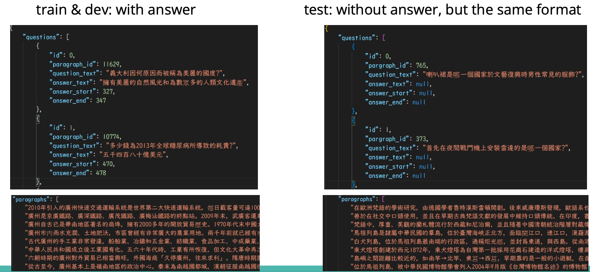
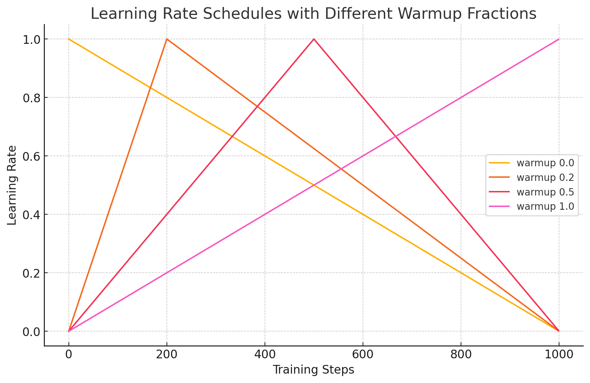
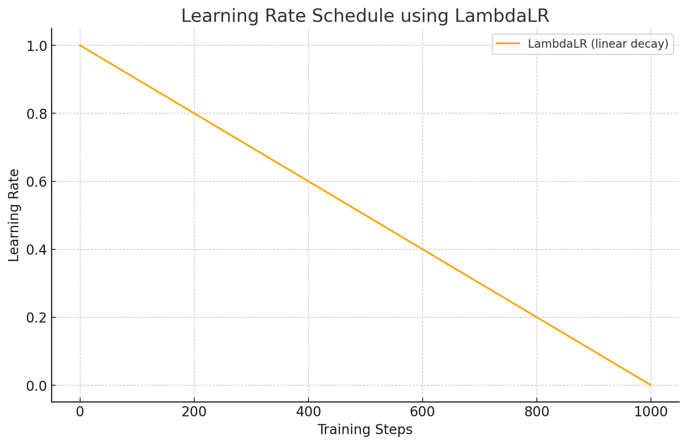

# 微调 LLM：实现抽取式问答

> 学习如何使用 Transformers 库微调预训练模型来实现抽取式问答。
>
> 本文的思路与 [08. 尝试微调 LLM：让它会写唐诗](./08.%20尝试微调%20LLM：让它会写唐诗.md)一致，不过这次我们使用 BERT 作为预训练模型进行演示，并进行全量微调而非使用 LoRA。为了更好地解释细节，我们不使用 `transformers.Trainer`，而是手动实现训练流程。
>
> 如果时间充足，可以选择完成[作业](./22b.%20作业%20-%20Bert%20微调抽取式问答.md)后再阅读这篇文章。由于镜像的原因，作业的组织方式可能与当前略有不同。
>
> **代码文件下载**：[Code](../Demos/21a.%20微调%20LLM：实现抽取式问答.ipynb)
>
> **在线链接**：[Kaggle](https://www.kaggle.com/code/aidemos/21a-llm) | [Colab](https://colab.research.google.com/drive/1jgdoO7fKk7Tsn2yi28ytsDQ8VXdthnIm?usp=sharing)
>
> **相关文章**：[BERT 论文精读](../PaperNotes/BERT%20论文精读.md)

## 目录

- [前言](#前言)
  - [Q: 模型怎么完成抽取式问答任务？输出是什么？](#q-模型怎么完成抽取式问答任务输出是什么)
- [前置准备](#前置准备)
  - [安装库](#安装库)
  - [导入库](#导入库)
  - [设置设备和随机数种子](#设置设备和随机数种子)
- [加载模型和分词器](#加载模型和分词器)
  - [Q: 什么是 AutoModelForQuestionAnswering？](#q-什么是-automodelforquestionanswering)
- [数据部分](#数据部分)
  - [下载数据集](#下载数据集)
  - [读取数据](#读取数据)
  - [分词处理](#分词处理)
  - [自定义数据集处理](#自定义数据集处理)
- [评估函数](#评估函数)
- [训练部分](#训练部分)
  - [设置超参数](#设置超参数)
  - [学习率调度器](#学习率调度器)
    - [带有 Warmup 的线性衰减](#带有-warmup-的线性衰减)
    - [线性衰减](#线性衰减)
  - [设置 Accelerator](#设置-accelerator)
  - [开始训练](#开始训练)
    - [训练阶段](#训练阶段)
    - [评估阶段](#评估阶段)
    - [Q: AutoModel 类下的 model 到底是怎么处理输入的？应该怎么样快速查看源码？](#q-automodel-类下的-model-到底是怎么处理输入的应该怎么样快速查看源码)
      - [查看 \_\_init\_\_ 方法](#查看-__init__-方法)
      - [查看 forward 方法](#查看-forward-方法)
- [测试部分](#测试部分)
- [QA](#qa)
  - [a. Encoder-only 模型（如 BERT 系列）如何在抽取式问答任务中确定答案？](#a-encoder-only-模型如-bert-系列如何在抽取式问答任务中确定答案)
  - [b. Decoder-only 模型（如 GPT 系列）如何在抽取式问答任务中确定答案？](#b-decoder-only-模型如-gpt-系列如何在抽取式问答任务中确定答案)
- [附录](#附录)
  - [1](#1)
  - [2](#2)

## 前言

**预训练 + 微调**是一个非常主流的范式，适用于各种下游任务，如文本分类、命名实体识别、机器翻译等。在这篇文章中，我们将以**抽取式问答任务**为例，再次尝试微调预训练模型。

首先，了解什么是**抽取式问答**[^1]：根据「给定的问题」和「**包含**答案的文本」，从中**抽取**出对应的答案片段，**不需要生成新的词语**。

**举例说明**：

- **文本**：`BERT 是由 Google 提出的预训练语言模型，它在多个 NLP 任务上取得了 SOTA 的成绩。`
- **问题**：`谁提出了 BERT？`
- **答案**：`Google`

> 如果去掉“抽取式”的限定，广义上的“问答”更接近于**生成式问答（Generative Question Answering）**，即答案并非固定的文本片段，模型基于理解进行**生成**，最终的答案不拘泥于特定的文本。
>
> **举例说明**：
>
> - **文本**：同上。
> - **问题**：同上。
> - **答案**：`BERT 是由 Google 提出的预训练语言模型。具体来说，它是由 Jacob Devlin 等研究人员在 2018 年的论文《BERT: Pre-training of Deep Bidirectional Transformers for Language Understanding》中首次介绍的。BERT 在多个 NLP 任务上取得了 SOTA（State-of-the-Art）的成绩，推动了自然语言处理领域的快速发展。`（该答案由 GPT-4o 生成）
>

#### Q: 模型怎么完成抽取式问答任务？输出是什么？

停下来思考一下，是直接生成答案对应的词或句子吗？

**不是**，输出的是**答案在文本中的起始和结束位置**。通过下图[^2]进行理解：

> 

模型的最终输出为两个向量：起始位置得分向量 $\mathbf{s} \in \mathbb{R}^N$ 和结束位置得分向量 $\mathbf{e} \in \mathbb{R}^N$，其中 $N$ 是输入序列的长度。

对于每个位置 $i$，模型计算其作为答案起始位置和结束位置的得分：

$`
\begin{aligned}
s_i &= \mathbf{w}_{\text{start}} \mathbf{h}_i + b_{\text{start}} \\
e_i &= \mathbf{w}_{\text{end}} \mathbf{h}_i + b_{\text{end}}
\end{aligned}
`$

其中, $`\mathbf{h}_i \in \mathbb{R}^H`$ 是编码器在位置 $i$ 的隐藏状态输出 ($\mathbf{h}$ 就是 BERT 模型的最终输出), $H$ 是隐藏层的维度。$`\mathbf{w}_{\text{start}} \in \mathbb{R}^H`$ 和 $`\mathbf{w}_{\text{end}} \in \mathbb{R}^H`$ 是权重向量（对应于 `nn.Linear(H, 1)`，这里写成了常见的数学形式，了解线性层代码的同学可以当做 $`\mathbf{h}\mathbf{w}^\top`$）, $b_{\text{start}}$ 和 $b_{\text{end}}$ 是偏置项。

然后，对得分向量进行 softmax 操作，得到每个位置作为起始和结束位置的概率分布：

$$
\begin{aligned}
P_{\text{start}}(i) &= \frac{e^{s_i}}{\sum_{j=1}^{N} e^{s_j}} \\
P_{\text{end}}(i) &= \frac{e^{e_i}}{\sum_{j=1}^{N} e^{e_j}}
\end{aligned}
$$

在推理时，选择具有最高概率的起始位置 $\hat{s}$ 和结束位置 $\hat{e}$。为了保证答案的合理性，通常要求 $\hat{s} \leq \hat{e}$，并且答案的长度不超过预设的最大长度 $L_{\text{max}}$。此时的行为称为后处理（Postprocessing），根据实际需求进行。

最终，答案就是输入序列中从位置 $\hat{s}$ 到 $\hat{e}$ 的片段，即：

$$
\text{Answer} = \text{Input}[\hat{s}:\hat{e}]
$$

[^1]: [BERT 论文精读](../PaperNotes/BERT%20论文精读.md#认识问答任务抽取式和生成式)
[^2]: [What Is Extractive Question Answering?](https://www.ontotext.com/knowledgehub/fundamentals/what-is-extractive-question-answering/)

## 前置准备

### 安装库 


```python
pip install transformers
pip install accelerate
```

### 导入库

```python
# ========== 标准库模块 ==========
import json
import random

# ========== 第三方库 ==========
import numpy as np
from tqdm.auto import tqdm

# ========== 深度学习相关库 ==========
import torch
from torch.utils.data import DataLoader, Dataset
from torch.optim.lr_scheduler import LambdaLR

# Transformers (Hugging Face)
from transformers import (
    AdamW,
    AutoTokenizer,
    AutoModelForQuestionAnswering,
    get_linear_schedule_with_warmup
)

# 加速库
from accelerate import Accelerator
```

### 设置设备和随机数种子

```python
device = "cuda" if torch.cuda.is_available() else "cpu"
# For Mac M1, M2...
# device = "mps" if torch.backends.mps.is_available() else ("cuda" if torch.cuda.is_available() else "cpu")

def same_seeds(seed):
    """
    设置随机种子以确保结果的可复现性。

    参数：
    - seed (int): 要设置的随机种子值。
    """
    torch.manual_seed(seed)
    if torch.cuda.is_available():
        torch.cuda.manual_seed(seed)
        torch.cuda.manual_seed_all(seed)
    np.random.seed(seed)
    random.seed(seed)
    torch.backends.cudnn.benchmark = False
    torch.backends.cudnn.deterministic = True
```

## 加载模型和分词器

使用以下代码加载预训练模型，并附加问答任务特定的输出层：

```python
model = AutoModelForQuestionAnswering.from_pretrained("bert-base-chinese").to(device)
tokenizer = AutoTokenizer.from_pretrained("bert-base-chinese")

# 预训练模型也可以换成其他的
# model = AutoModelForQuestionAnswering.from_pretrained("luhua/chinese_pretrain_mrc_macbert_large").to(device)
# tokenizer = AutoTokenizer.from_pretrained("luhua/chinese_pretrain_mrc_macbert_large")

# 你可以忽略警告消息（它弹出是因为新的 QA 预测头是随机初始化的）
```

关于模型的选择，可以简单参考[附录]()。


### Q: 什么是 `AutoModelForQuestionAnswering`？

`AutoModelForQuestionAnswering` 是 Hugging Face 提供的自动模型加载类，除了加载指定模型的预训练权重之外，**它会在模型的顶层添加一个用于问答任务的输出层**，用于预测答案的起始位置和结束位置。如果模型本身已经包含用于问答任务的输出层，则会加载相应的权重；如果没有，则会在顶层添加一个**新的输出层**，随机初始化权重（这时候会有警告信息）。

不妨打印看看这个输出层到底是什么：

```python
print(model.qa_outputs)
# print(model)  # 如果感兴趣，也可以打印整个模型
```

**输出**：

```
Linear(in_features=768, out_features=2, bias=True)
```

实际上，添加的就是一个简单的线性层，用于将每个位置的隐藏状态（hidden state）映射为两个值，分别对应起始位置和结束位置的得分。

> [!note]
>
> 可以回顾之前的文章《[05. 理解 Hugging Face 的 `AutoModel` 系列：不同任务的自动模型加载类.md](./05.%20理解%20Hugging%20Face%20的%20%60AutoModel%60%20系列：不同任务的自动模型加载类.md)》。

## 数据部分

> 使用两个繁体中文阅读理解数据集：[DRCD](https://github.com/DRCKnowledgeTeam/DRCD) 和 [ODSQA](https://github.com/Chia-Hsuan-Lee/ODSQA)。

- **训练集（DRCD + DRCD-backtrans）**：包含 15,329 个段落和 26,918 个问题。一个段落可能对应多个问题。
- **开发集（DRCD + DRCD-backtrans）**：包含 1,255 个段落和 2,863 个问题。用于验证。
- **测试集（DRCD + ODSQA）**：包含 1,606 个段落和 3,504 个问题。测试集的段落没有提供答案，需要模型进行预测。

所有数据集的格式相同：

- `id`：问题编号
- `paragraph_id`：段落编号
- `question_text`：问题文本
- `answer_text`：答案文本
- `answer_start`：答案在段落中的起始字符位置
- `answer_end`：答案在段落中的结束字符位置



### 下载数据集

```bash
wget https://github.com/Hoper-J/HUNG-YI_LEE_Machine-Learning_Homework/raw/refs/heads/master/HW07/ml2023spring-hw7.zip
unzip ml2023spring-hw7.zip
```

### 读取数据

```python
def read_data(file):
    with open(file, 'r', encoding="utf-8") as reader:
        data = json.load(reader)
    return data["questions"], data["paragraphs"]

train_questions, train_paragraphs = read_data("hw7_train.json")
dev_questions, dev_paragraphs = read_data("hw7_dev.json")
test_questions, test_paragraphs = read_data("hw7_test.json")
```

### 分词处理

```python
# 分别对问题和段落进行分词
# 设置 add_special_tokens=False，因为在自定义数据集 QA_Dataset 的 __getitem__ 中会手动添加特殊标记
train_questions_tokenized = tokenizer(
    [q["question_text"] for q in train_questions], add_special_tokens=False
)
dev_questions_tokenized = tokenizer(
    [q["question_text"] for q in dev_questions], add_special_tokens=False
)
test_questions_tokenized = tokenizer(
    [q["question_text"] for q in test_questions], add_special_tokens=False
)

train_paragraphs_tokenized = tokenizer(train_paragraphs, add_special_tokens=False)
dev_paragraphs_tokenized = tokenizer(dev_paragraphs, add_special_tokens=False)
test_paragraphs_tokenized = tokenizer(test_paragraphs, add_special_tokens=False)
```

### 自定义数据集处理

以下代码定义了一个 `QA_Dataset` 类，用于处理问答数据。

```python
class QA_Dataset(Dataset):
    """
    自定义的问答数据集类，用于处理问答任务的数据。

    参数：
    - split (str): 数据集的类型，'train'、'dev' 或 'test'。
    - questions (list): 问题列表，每个元素是一个字典，包含问题的详细信息。
    - tokenized_questions (BatchEncoding): 分词后的问题，由 tokenizer 生成。
    - tokenized_paragraphs (BatchEncoding): 分词后的段落列表，由 tokenizer 生成。
    
    属性（即 __init_() 中的 self.xxx）：
    - max_question_len (int): 问题的最大长度（以分词后的 token 数计）。
    - max_paragraph_len (int): 段落的最大长度（以分词后的 token 数计）。
    - doc_stride (int): 段落窗口滑动步长。
    - max_seq_len (int): 输入序列的最大长度。
    """
    
    def __init__(self, split, questions, tokenized_questions, tokenized_paragraphs):
        self.split = split
        self.questions = questions
        self.tokenized_questions = tokenized_questions
        self.tokenized_paragraphs = tokenized_paragraphs
        self.max_question_len = 60
        self.max_paragraph_len = 150

        # 设置段落窗口滑动步长为段落最大长度的 10%
        self.doc_stride = int(self.max_paragraph_len * 0.1)

        # 输入序列长度 = [CLS] + question + [SEP] + paragraph + [SEP]
        self.max_seq_len = 1 + self.max_question_len + 1 + self.max_paragraph_len + 1

    def __len__(self):
        """
        返回数据集中样本的数量。

        返回：
        - (int): 数据集的长度。
        """
        return len(self.questions)

    def __getitem__(self, idx):
        """
        获取数据集中指定索引的样本。

        参数：
        - idx (int): 样本的索引。

        返回：
        - 对于训练集，返回一个输入张量和对应的答案位置：
          (input_ids, token_type_ids, attention_mask, answer_start_token, answer_end_token)
        - 对于验证和测试集，返回包含多个窗口的输入张量列表：
          (input_ids_list, token_type_ids_list, attention_mask_list)
        """
        question = self.questions[idx]
        tokenized_question = self.tokenized_questions[idx]
        tokenized_paragraph = self.tokenized_paragraphs[question["paragraph_id"]]

        ##### 预处理 #####
        if self.split == "train":
            # 将答案在段落文本中的起始/结束位置转换为在分词后段落中的起始/结束位置
            answer_start_token = tokenized_paragraph.char_to_token(question["answer_start"])
            answer_end_token = tokenized_paragraph.char_to_token(question["answer_end"])

            # 防止模型学习到「答案总是位于中间的位置」，加入随机偏移
            mid = (answer_start_token + answer_end_token) // 2
            max_offset = self.max_paragraph_len // 2   # 最大偏移量为段落长度的1/2，这是可调的
            random_offset = np.random.randint(-max_offset, max_offset)  # 在 [-max_offset, +max_offset] 范围内随机选择偏移量
            paragraph_start = max(0, min(mid + random_offset - self.max_paragraph_len // 2, len(tokenized_paragraph) - self.max_paragraph_len))
            paragraph_end = paragraph_start + self.max_paragraph_len
            
            # 切片问题/段落，并添加特殊标记（101：CLS，102：SEP）
            input_ids_question = [101] + tokenized_question.ids[:self.max_question_len] + [102]
            # ... = [tokenizer.cls_token_id] + tokenized_question.ids[: self.max_question_len] + [tokenizer.sep_token_id]
            input_ids_paragraph = tokenized_paragraph.ids[paragraph_start : paragraph_end] + [102]
            # ... = ... + [tokenizer.sep_token_id]

            # 将答案在分词后段落中的起始/结束位置转换为窗口中的起始/结束位置
            answer_start_token += len(input_ids_question) - paragraph_start
            answer_end_token += len(input_ids_question) - paragraph_start

            # 填充序列，生成模型的输入
            input_ids, token_type_ids, attention_mask = self.padding(input_ids_question, input_ids_paragraph)
            
            return torch.tensor(input_ids), torch.tensor(token_type_ids), torch.tensor(attention_mask), answer_start_token, answer_end_token

        else:
            # 验证集和测试集的处理
            input_ids_list, token_type_ids_list, attention_mask_list = [], [], []

            # 段落被分割成多个窗口，每个窗口的起始位置由步长 "doc_stride" 分隔
            for i in range(0, len(tokenized_paragraph), self.doc_stride):
                # 切片问题/段落并添加特殊标记（101：CLS，102：SEP）
                input_ids_question = [101] + tokenized_question.ids[:self.max_question_len] + [102]
                # ... = [tokenizer.cls_token_id] + tokenized_question.ids[: self.max_question_len] + [tokenizer.sep_token_id]
                input_ids_paragraph = tokenized_paragraph.ids[i : i + self.max_paragraph_len] + [102]
                # ... = ... + [tokenizer.sep_token_id]

                # 填充序列，生成模型的输入
                input_ids, token_type_ids, attention_mask = self.padding(input_ids_question, input_ids_paragraph)

                input_ids_list.append(input_ids)
                token_type_ids_list.append(token_type_ids)
                attention_mask_list.append(attention_mask)

            return torch.tensor(input_ids_list), torch.tensor(token_type_ids_list), torch.tensor(attention_mask_list)

    def padding(self, input_ids_question, input_ids_paragraph):
        """
        对输入的序列进行填充，生成统一长度的模型输入。

        参数：
        - input_ids_question (list): 问题部分的输入 ID 列表。
        - input_ids_paragraph (list): 段落部分的输入 ID 列表。

        返回：
        - input_ids (list): 填充后的输入 ID 列表。
        - token_type_ids (list): 区分问题和段落的标记列表。
        - attention_mask (list): 注意力掩码列表，指示哪些位置是有效的输入。
        """
        # 计算需要填充的长度
        padding_len = self.max_seq_len - len(input_ids_question) - len(input_ids_paragraph)
        # 填充输入序列
        input_ids = input_ids_question + input_ids_paragraph + [0] * padding_len
        # 构造区分问题和段落的 token_type_ids
        token_type_ids = [0] * len(input_ids_question) + [1] * len(input_ids_paragraph) + [0] * padding_len
        # 构造注意力掩码，有效位置为 1，填充位置为 0
        attention_mask = [1] * (len(input_ids_question) + len(input_ids_paragraph)) + [0] * padding_len

        return input_ids, token_type_ids, attention_mask

train_set = QA_Dataset("train", train_questions, train_questions_tokenized, train_paragraphs_tokenized)
dev_set = QA_Dataset("dev", dev_questions, dev_questions_tokenized, dev_paragraphs_tokenized)
test_set = QA_Dataset("test", test_questions, test_questions_tokenized, test_paragraphs_tokenized)
```

**解释**：

- **训练集处理**：定位答案的起始和结束位置，将包含答案的段落部分截取为一个窗口（引入随机偏移，防止模型过拟合于答案总在中间的位置）。然后将问题和段落合并为一个输入序列，并进行填充。

- **验证/测试集处理**：将段落分成多个窗口，每个窗口之间的步长由 `self.doc_stride` 决定，然后将每个窗口作为模型的输入。验证和测试时不需要答案位置，因此只需生成多个窗口作为输入。
- `self.doc_stride` 控制窗口之间的滑动步长。
  
- **训练阶段**不需要使用 `doc_stride`，因为训练时我们已经知道答案的位置，可以直接截取包含答案的窗口。但在**验证和测试**阶段，由于模型并不知道答案的位置，`doc_stride` 保证每个窗口之间有足够的重叠（overlap），减少遗漏答案的可能。

> [作业](./22b.%20作业%20-%20Bert%20微调抽取式问答.md)代码修改 `doc_stride` 时的运行结果（num_epoch=1 + 学习率线性衰减）：
>
> | self.doc_stride           | Private Score | Public Score |
> | ------------------------- | ------------- | ------------ |
> | =max_paragraph_len=150    | 0.55164       | 0.56356      |
> | =max_paragraph_len * 0.75 | 0.63450       | 0.62656      |
> | =max_paragraph_len * 0.5  | 0.67366       | **0.68501**  |
> | =max_paragraph_len * 0.25 | **0.70090**   | 0.68161      |
> 
> 注意，`doc_stride` **仅**影响**验证和测试**阶段。

## 评估函数


```python
def evaluate(data, output):
    """
    对模型的输出进行后处理，获取预测的答案文本。

    参数：
    - data (tuple): 包含输入数据的元组，(input_ids, token_type_ids, attention_mask)。
    - output (transformers.modeling_outputs.QuestionAnsweringModelOutput): 模型的输出结果。

    返回：
    - answer (str): 模型预测的答案文本。
    """
    answer = ''
    max_prob = float('-inf')
    num_of_windows = data[0].shape[1]

    for k in range(num_of_windows):
        # 通过选择最可能的起始位置/结束位置来获得答案
        start_prob, start_index = torch.max(output.start_logits[k], dim=0)
        end_prob, end_index = torch.max(output.end_logits[k], dim=0)

        # 确保起始位置索引小于或等于结束位置索引，避免选择错误的起始和结束位置对
        if start_index <= end_index:
            # 答案的概率计算为 start_prob 和 end_prob 的和
            prob = start_prob + end_prob

            # 如果当前窗口的答案具有更高的概率，则更新结果
            if prob > max_prob:
                max_prob = prob
                # 将标记转换为字符（例如，[1920, 7032] --> "大 金"）
                answer = tokenizer.decode(data[0][0][k][start_index : end_index + 1])
        else:
            # 如果起始位置索引 > 结束位置索引，则跳过此对（可能是错误情况）
            continue
    # 移除答案中的空格（例如，"大 金" --> "大金"）
    return answer.replace(' ','')
```

## 训练部分
### 设置超参数

```python
# 超参数
num_epoch = 1            # 训练的轮数，可以尝试修改
validation = True        # 是否在每个 epoch 结束后进行验证
logging_step = 100       # 每隔多少步打印一次训练日志
learning_rate = 1e-5     # 学习率
train_batch_size = 8     # 训练时的批次大小

# 优化器
optimizer = AdamW(model.parameters(), lr=learning_rate)

# 数据加载器
# 注意：不要更改 dev_loader / test_loader 的批次大小
# 虽然批次大小=1，但它实际上是由同一对 QA 的多个窗口组成的批次
train_loader = DataLoader(train_set, batch_size=train_batch_size, shuffle=True, pin_memory=True)
dev_loader = DataLoader(dev_set, batch_size=1, shuffle=False, pin_memory=True)
test_loader = DataLoader(test_set, batch_size=1, shuffle=False, pin_memory=True)
```

### 学习率调度器

#### 带有 Warmup 的线性衰减

使用调度器可以加速模型的收敛速度，不同的 Warmup 比例对学习率的影响如下图所示：



```python
# 总训练步数
total_steps = len(train_loader) * num_epoch
num_warmup_steps = int(0.2 * total_steps)  # 这里设置 Warmup 步数为总步数的 20%

# [Hugging Face] 应用带有 warmup 的线性学习率衰减
scheduler = get_linear_schedule_with_warmup(
    optimizer, num_warmup_steps=num_warmup_steps, num_training_steps=total_steps
)
```

#### 线性衰减

如果不进行 Warmup，等价于直接使用线性衰减：



```python
# [PyTorch] 替代方法：应用不带 warmup 的线性学习率衰减
# lr_lambda 自定义学习率随时间衰减（此处是简单的线性衰减）
lr_lambda = lambda step: max(0.0, 1.0 - step / total_steps)
scheduler = LambdaLR(optimizer, lr_lambda=lr_lambda)
```

> [作业](./22b.%20作业%20-%20Bert%20微调抽取式问答.md)代码**仅**运用学习率调度器时的运行结果（num_epoch=1）：
>
> | Schedule                          | Private Score | Public Score |
> | --------------------------------- | ------------- | ------------ |
> | no schedule                       | 0.54426       | **0.56356**  |
> | Linear schedule (PyTorch)         | **0.55164**   | **0.56356**  |
> | Linear schedule with warmup (0)   | **0.55164**   | **0.56356**  |
> | Linear schedule with warmup (0.2) | 0.54653       | **0.56356**  |
> | Linear schedule with warmup (0.5) | 0.53916       | 0.54597      |
> | Linear schedule with warmup (1.0) | 0.54994       | 0.55051      |

### 设置 Accelerator

```python
#### 梯度累积（可选）####
# 注意：train_batch_size * gradient_accumulation_steps = 有效批次大小
# 如果 CUDA 内存不足，你可以降低 train_batch_size 并提高 gradient_accumulation_steps
# 文档：https://huggingface.co/docs/accelerate/usage_guides/gradient_accumulation
gradient_accumulation_steps = 4

# 将 "fp16_training" 更改为 True 以支持自动混合精度训练（fp16）
fp16_training = True
if fp16_training:
    accelerator = Accelerator(mixed_precision="fp16", gradient_accumulation_steps=gradient_accumulation_steps)
else:
    accelerator = Accelerator(gradient_accumulation_steps=gradient_accumulation_steps)

model, optimizer, train_loader, scheduler = accelerator.prepare(model, optimizer, train_loader, scheduler)
```

### 开始训练

```python
model.train()

print("开始训练...")

for epoch in range(num_epoch):
    step = 1
    train_loss = train_acc = 0

    for data in tqdm(train_loader):
        with accelerator.accumulate(model):
            # 数据已经通过 accelerator.prepare() 移动到设备
            #data = [i.to(device) for i in data]

            # 模型输入：input_ids, token_type_ids, attention_mask, start_positions, end_positions（注意：只有 "input_ids" 是必需的）
            # 模型输出：start_logits, end_logits, loss（提供 start_positions/end_positions 时返回）
            output = model(
                input_ids=data[0],
                token_type_ids=data[1],
                attention_mask=data[2],
                start_positions=data[3],
                end_positions=data[4]
            )
            # 选择最可能的起始位置/结束位置
            start_index = torch.argmax(output.start_logits, dim=1)
            end_index = torch.argmax(output.end_logits, dim=1)

            # 只有当 start_index 和 end_index 都正确时，预测才正确
            train_acc += ((start_index == data[3]) & (end_index == data[4])).float().mean()

            train_loss += output.loss

            accelerator.backward(output.loss)

            step += 1
            optimizer.step()
            scheduler.step()
            optimizer.zero_grad()

            # 每经过 logging_step，打印训练损失和准确率（实际上，使用了梯度累积后的 step 应该除以对应的数量进行校正）
            if step % logging_step == 0:
                print(f"Epoch {epoch + 1} | Step {step} | loss = {train_loss.item() / logging_step:.3f}, acc = {train_acc / logging_step:.3f}")
                train_loss = train_acc = 0

    if validation:
        print("评估开发集...")
        model.eval()
        with torch.no_grad():
            dev_acc = 0
            for i, data in enumerate(tqdm(dev_loader)):
                # 这里保留了 device 的使用
                output = model(
                    input_ids=data[0].squeeze(0).to(device),
                    token_type_ids=data[1].squeeze(0).to(device),
                    attention_mask=data[2].squeeze(0).to(device),
                )
                # 只有当答案文本完全匹配时，预测才正确
                dev_acc += evaluate(data, output) == dev_questions[i]["answer_text"]
            print(f"Validation | Epoch {epoch + 1} | acc = {dev_acc / len(dev_loader):.3f}")
        model.train()

# 将模型及其配置文件保存到目录「saved_model」
# 即，在目录「saved_model」下有两个文件：「pytorch_model.bin」和「config.json」
# 可以使用「model = BertForQuestionAnswering.from_pretrained("saved_model")」重新加载保存的模型
print("保存模型...")
model_save_dir = "saved_model"
model.save_pretrained(model_save_dir)
#tokenizer.save_pretrained(model_save_dir)
```

#### 训练阶段

从 `train_loader` 中迭代获取数据，每个 `data` 包含以下内容：

```python
for data in tqdm(train_loader):
    # data 包含以下内容：
    # data[0]: input_ids (batch_size, max_seq_len)
    # data[1]: token_type_ids (batch_size, max_seq_len)
    # data[2]: attention_mask (batch_size, max_seq_len)
    # data[3]: answer_start_token (batch_size)
    # data[4]: answer_end_token (batch_size)
    # 可以使用以下代码查看：
    # for d in data:
	#     print(d.shape)
```

这些数据是在之前定义的 `QA_Dataset` 类的 `__getitem__` 方法中返回的：

```python
return torch.tensor(input_ids), torch.tensor(token_type_ids), torch.tensor(attention_mask), answer_start_token, answer_end_token
```

- `input_ids`：模型的输入 ID 序列。
- `token_type_ids`：区分问题和段落的标记。
- `attention_mask`：注意力掩码，指示哪些位置是有效的输入。
- `answer_start_token` 和 `answer_end_token`：答案在输入序列中的起始和结束位置索引，这个是训练集标签（Label）。

在模型前向传播时，将这些数据输入模型：

```python
output = model(
    input_ids=data[0],
    token_type_ids=data[1],
    attention_mask=data[2],
    start_positions=data[3],
    end_positions=data[4]
)
```

- 模型会根据 `input_ids`、`token_type_ids` 和 `attention_mask` 计算每个位置作为答案起始和结束位置的概率分布，即 `start_logits` 和 `end_logits`。
- 由于提供了 `start_positions` 和 `end_positions`，模型会计算损失 `loss`，即预测的起始和结束位置与真实位置之间的交叉熵损失。

然后，我们计算训练准确率：

```python
start_index = torch.argmax(output.start_logits, dim=1)
end_index = torch.argmax(output.end_logits, dim=1)

train_acc += ((start_index == data[3]) & (end_index == data[4])).float().mean()
```

- `start_index` 和 `end_index` 是模型预测的最可能的答案起始和结束位置索引。
- 我们比较预测的索引与真实的 `data[3]` 和 `data[4]`，只有完全匹配时，计为一次正确预测。

#### 评估阶段

从 `dev_loader` 中获取数据，由于验证集的数据处理方式不同（详见 `QA_Dataset`），`data` 的结构会有所差异：

```python
for i, data in enumerate(tqdm(dev_loader)):
    # data 包含以下内容：
    # data[0]: input_ids_list (1, num_windows, max_seq_len)
    # data[1]: token_type_ids_list (1, num_windows, max_seq_len)
    # data[2]: attention_mask_list (1, num_windows, max_seq_len)
    # 可以使用以下代码查看：
    # for d in data:
	#     print(d.shape)
```

这是因为在 `QA_Dataset` 类中，对于验证集和测试集，`__getitem__` 方法返回的是包含多个窗口的列表：

```python
return torch.tensor(input_ids_list), torch.tensor(token_type_ids_list), torch.tensor(attention_mask_list)
```

- `input_ids_list`：一个问题对应多个窗口的 `input_ids` 序列，每个窗口覆盖段落的一部分。
  - 验证和测试阶段不知道答案的具体位置，所以需要将段落划分为多个窗口，以覆盖整个段落。
- `token_type_ids_list`：对应的 `token_type_ids` 列表。
- `attention_mask_list`：对应的 `attention_mask` 列表。

在模型前向传播时，需要对每个窗口进行预测答案的预测。`data[0]` 的形状为 `(1, num_windows, max_seq_len)`，因此我们需要对维度进行调整：

```python
output = model(
    input_ids=data[0].squeeze(0).to(device),
    token_type_ids=data[1].squeeze(0).to(device),
    attention_mask=data[2].squeeze(0).to(device),
)
```

- `squeeze(0)` 是为了去掉批次大小为 1 的维度，将数据形状调整为 `(num_windows, max_seq_len)`。

接着使用 `evaluate` 函数对模型的输出进行处理，选取最有可能的答案：

```python
dev_acc += evaluate(data, output) == dev_questions[i]["answer_text"]
```

- `evaluate` 函数会遍历所有窗口的预测结果，选择起始和结束位置概率最大的答案。
- 然后，将模型预测的答案与真实的答案文本进行比较，只有完全匹配时，计为一次正确预测。

#### Q: AutoModel 类下的 model 到底是怎么处理输入的？应该怎么样快速查看源码？

在当前代码中，我们直接使用了 Hugging Face 提供的 `AutoModelForQuestionAnswering` 类。这种“黑盒”方式虽简便，但难免让人心里不够踏实。为了更好地理解其内部实现，我们通过 `inspect` 库快速查看模型的核心代码，以 `__init__` 和 `forward` 为例：

##### 查看 `__init__` 方法

`__init__` 方法是模型的初始化函数，定义了模型的基本架构，包括预训练权重的加载和任务特定层的添加。

```python
import inspect
from transformers import AutoModelForQuestionAnswering

# 加载预训练模型
model = AutoModelForQuestionAnswering.from_pretrained("bert-base-chinese")

# 获取并打印 __init__ 方法的源码
init_code = inspect.getsource(model.__init__)
print(init_code)
```

**输出**：

```python
    def __init__(self, config):
        super().__init__(config)
        self.num_labels = config.num_labels

        self.bert = BertModel(config, add_pooling_layer=False)
        self.qa_outputs = nn.Linear(config.hidden_size, config.num_labels)

        # Initialize weights and apply final processing
        self.post_init()
```

##### 查看 `forward` 方法

`forward` 方法定义了模型的前向传播逻辑，负责处理输入并生成输出。通常对应于 `model(x)` 的调用。

```python
import inspect
from transformers import AutoModelForQuestionAnswering

# 加载预训练模型
model = AutoModelForQuestionAnswering.from_pretrained("bert-base-chinese")

# 获取并打印 forward 方法的源码
forward_code = inspect.getsource(model.forward)
print(forward_code)
```

**输出**：

```python
	...
    def forward(
        self,
        input_ids: Optional[torch.Tensor] = None,
        attention_mask: Optional[torch.Tensor] = None,
        token_type_ids: Optional[torch.Tensor] = None,
        position_ids: Optional[torch.Tensor] = None,
        head_mask: Optional[torch.Tensor] = None,
        inputs_embeds: Optional[torch.Tensor] = None,
        start_positions: Optional[torch.Tensor] = None,
        end_positions: Optional[torch.Tensor] = None,
        output_attentions: Optional[bool] = None,
        output_hidden_states: Optional[bool] = None,
        return_dict: Optional[bool] = None,
    ) -> Union[Tuple[torch.Tensor], QuestionAnsweringModelOutput]:
        r"""
        start_positions (`torch.LongTensor` of shape `(batch_size,)`, *optional*):
            Labels for position (index) of the start of the labelled span for computing the token classification loss.
            Positions are clamped to the length of the sequence (`sequence_length`). Position outside of the sequence
            are not taken into account for computing the loss.
        end_positions (`torch.LongTensor` of shape `(batch_size,)`, *optional*):
            Labels for position (index) of the end of the labelled span for computing the token classification loss.
            Positions are clamped to the length of the sequence (`sequence_length`). Position outside of the sequence
            are not taken into account for computing the loss.
        """
        return_dict = return_dict if return_dict is not None else self.config.use_return_dict

        outputs = self.bert(
            input_ids,
            attention_mask=attention_mask,
            token_type_ids=token_type_ids,
            position_ids=position_ids,
            head_mask=head_mask,
            inputs_embeds=inputs_embeds,
            output_attentions=output_attentions,
            output_hidden_states=output_hidden_states,
            return_dict=return_dict,
        )

        sequence_output = outputs[0]

        logits = self.qa_outputs(sequence_output)
        start_logits, end_logits = logits.split(1, dim=-1)
        start_logits = start_logits.squeeze(-1).contiguous()
        end_logits = end_logits.squeeze(-1).contiguous()

        total_loss = None
        if start_positions is not None and end_positions is not None:
            # If we are on multi-GPU, split add a dimension
            if len(start_positions.size()) > 1:
                start_positions = start_positions.squeeze(-1)
            if len(end_positions.size()) > 1:
                end_positions = end_positions.squeeze(-1)
            # sometimes the start/end positions are outside our model inputs, we ignore these terms
            ignored_index = start_logits.size(1)
            start_positions = start_positions.clamp(0, ignored_index)
            end_positions = end_positions.clamp(0, ignored_index)

            loss_fct = CrossEntropyLoss(ignore_index=ignored_index)
            start_loss = loss_fct(start_logits, start_positions)
            end_loss = loss_fct(end_logits, end_positions)
            total_loss = (start_loss + end_loss) / 2

        if not return_dict:
            output = (start_logits, end_logits) + outputs[2:]
            return ((total_loss,) + output) if total_loss is not None else output

        return QuestionAnsweringModelOutput(
            loss=total_loss,
            start_logits=start_logits,
            end_logits=end_logits,
            hidden_states=outputs.hidden_states,
            attentions=outputs.attentions,
        )
```

> 尝试查看 `help(AutoModelForQuestionAnswering)` 的输出。

## 测试部分


```python
model.eval()

print("评估测试集...")

result = []

with torch.no_grad():
    for data in tqdm(test_loader):
        output = model(
            input_ids=data[0].squeeze(dim=0).to(device),
            token_type_ids=data[1].squeeze(dim=0).to(device),
            attention_mask=data[2].squeeze(dim=0).to(device)
        )
        result.append(evaluate(data, output))

result_file = "result.csv"
with open(result_file, 'w') as f:
    f.write("ID,Answer\n")
    for i, test_question in enumerate(test_questions):
        # 将答案中的逗号替换为空字符串（因为 csv 以逗号分隔），这一步处理只是为了作业提交到 Kaggle 上，实际上不一定需要保存为 .csv 文件
        f.write(f"{test_question['id']},{result[i].replace(',','')}\n")

print(f"完成！结果保存在 {result_file}")
```

## QA

> 微调（Fine-tune）和提示（Prompt）之间存在一些差异。上下文学习（In-context Learning）可以让预训练模型在不进行梯度下降的情况下，通过少量示例给出许多下游任务的正确预测。
>
> **训练/推理过程的差异**
>
> - **Fine-tuning**: 进行梯度下降，调整模型参数。
>
> -  **In-context learning**: 不进行梯度下降，只依赖少量样本，让预训练模型通过上下文提供答案。其实就是 Prompt。
>
>   [Label Words are Anchors: An Information Flow Perspective for Understanding In-Context Learning](https://arxiv.org/pdf/2305.14160) 2023 年的这篇文章可视化展示了 In-Context Learning（ICL） 的机制，感兴趣的同学可以阅读原文或查看视频：[第11讲：大型语言模型在「想」什么呢？ — 浅谈大型语言模型的可解释性](https://www.bilibili.com/video/BV1BJ4m1e7g8/?p=22&share_source=copy_web&vd_source=e46571d631061853c8f9eead71bdb390)。
>
>   
>
> 思考以下问题[^3]：
>
> ### a. Encoder-only 模型（如 BERT 系列）如何在抽取式问答任务中确定答案？
>
> ### b. Decoder-only 模型（如 GPT 系列）如何在抽取式问答任务中确定答案？

a. **Encoder-only 模型（如 BERT 系列）**：

- BERT 等编码器模型通过将问题和段落拼接为输入，然后通过 Transformer 编码层进行编码。
- 模型在输出层使用一个预测头，通常是一个全连接层（`nn.Linear(hidden_dim, 2)`），用于预测答案的起始位置和结束位置的得分。
  
- 通过计算每个位置作为起始和结束位置的概率，选择概率最大的起止位置（argmax），提取对应的文本片段作为答案（直接定位段落中的子串）。

b. **Decoder-only 模型（如 GPT 系列）**：

- GPT 等解码器模型主要用于生成式任务，但也可以用于抽取式问答。
- 将问题和段落作为输入，模型**生成**答案文本。
- 由于模型是自回归的，需要设计合适的提示（Prompt），使模型在生成时**复述**段落中的相关部分，达到抽取答案的效果（但既然是生成，那概率上一定会有不存在于段落中的词）。

[^3]: [李宏毅老师2023年机器学习春 HW07 的 Report Questions](../Demos/PDF/HW_BERT_Question_Answering.pdf).

## 附录

> 下表展示了小型模型（≤ 324M）的实验结果，仅供参考。你可以选择更大的模型并训练更长时间。
>
> **注意**：同一张表中的实验使用了相同的训练代码，而不同表之间的训练代码有所区别。表 2 额外使用了梯度累积和开发集（dev）进行训练。

### 1
| Pre-trained Model                                            | Params | epoch | Private Score | Public Score |
| ------------------------------------------------------------ | ------ | ----- | ------------- | ------------ |
| [google-bert/bert-base-chinese](https://huggingface.co/google-bert/bert-base-chinese) | 103M   | 1     | 0.73155       | 0.72985      |
|                                                              |        | 2     | 0.77185       | 0.75993      |
| [google-bert/bert-base-multilingual-cased](https://huggingface.co/google-bert/bert-base-multilingual-cased) | 179M   | 1     | 0.74517       | 0.74006      |
|                                                              |        | 2     | 0.77525       | 0.76730      |
| [FacebookAI/xlm-roberta-base](https://huggingface.co/FacebookAI/xlm-roberta-base) | 279M   | 1     | 0.68955       | 0.67139      |
| [NchuNLP/Chinese-Question-Answering](https://huggingface.co/NchuNLP/Chinese-Question-Answering) | 103M   | 0     | 0.56299       | 0.57094      |
|                                                              | 103M   | 1     | **0.79001**   | **0.78149**  |


### 2

| Pre-trained Model                                            | Params | epoch    | Private Score | Public Score |
| ------------------------------------------------------------ | ------ | -------- | ------------- | ------------ |
| [DaydreamerF/chinese-macbert-base-finetuned-accelerate](https://huggingface.co/DaydreamerF/chinese-macbert-base-finetuned-accelerate) | 101M   | 2        | 0.78830       | 0.78660      |
| [IDEA-CCNL/Erlangshen-MacBERT-325M-TextMatch-Chinese](https://huggingface.co/IDEA-CCNL/Erlangshen-MacBERT-325M-TextMatch-Chinese) | 324M   | 2        | 0.78887       | 0.79228      |
| [hfl/chinese-macbert-large](https://huggingface.co/hfl/chinese-macbert-large) | 324M   | 1        | 0.81668       | 0.82349      |
|                                                              |        | 5        | 0.83144       | 0.83030      |
| [luhua/chinese_pretrain_mrc_macbert_large](https://huggingface.co/luhua/chinese_pretrain_mrc_macbert_large) | 324M   | 1        | 0.83654       | 0.82292      |
|                                                              |        | 2        | **0.84222**   | **0.83144**  |
|                                                              |        | 2 (FP32) | 0.84165       | 0.82973      |
|                                                              |        | 3        | 0.83777       | 0.82065      |
|                                                              |        | 5        | 0.82917       | 0.82463      |
| [qalover/chinese-pert-large-open-domain-mrc]()               | 324M   | 0        | 0.56413       | 0.54143      |
|                                                              |        | 2        | 0.83314       | 0.82519      |
