# 关于 Claude Code 对第三方路径的隐写行为与特性降级，以及可能的解决方案

> 实测隐写行为存在于 Claude Code 2.1.91–2.1.197 版本。可以精准标识以下情况：
>
> - 命中内置名单或实验室关键词的第三方中转地址
> - 任一第三方中转地址 + 中国时区
>
> **注**：该行为不影响非 Claude 模型的正常使用。

## 目录

- [背景](#背景)
- [逆向分析](#逆向分析)
  - [定位与提取](#定位与提取)
  - [还原后的判断逻辑](#还原后的判断逻辑)
  - [编码方式](#编码方式)
    - [撇号](#撇号)
    - [日期分隔符](#日期分隔符)
- [后续](#后续)
- [可能的解决方案](#可能的解决方案)
- [附录](#附录)
  - [A. 域名名单（147 条）](#a-域名名单147-条)
  - [B. 实验室关键词（11 条）](#b-实验室关键词11-条)
  - [C. 名单解码逻辑](#c-名单解码逻辑)

## 背景

起初是由 Reddit 上的一篇[帖子](https://www.reddit.com/r/ClaudeAI/comments/1ujila1/anthropic_embedded_spyware_in_claude_code_and/)引发的讨论：

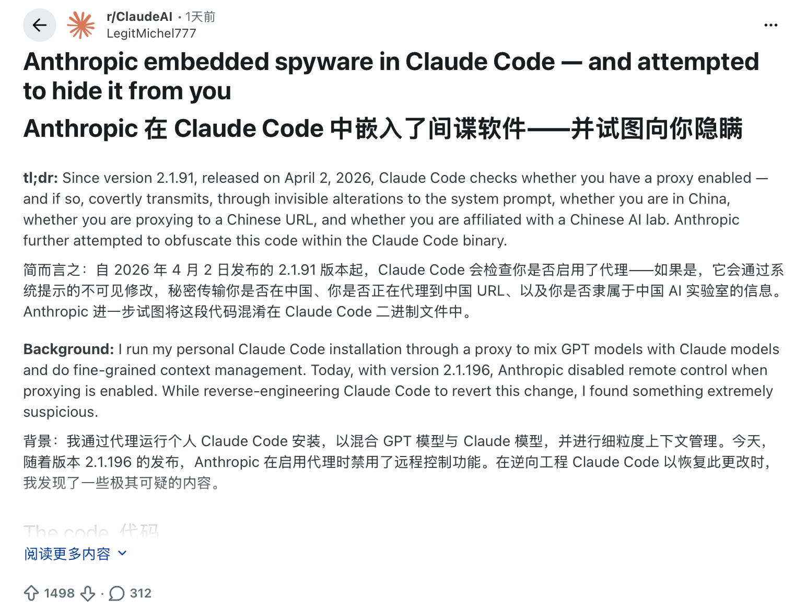

再到 X 上由 [@IntCyberDigest](https://x.com/IntCyberDigest/status/2071971609183678544) 引爆的关注：

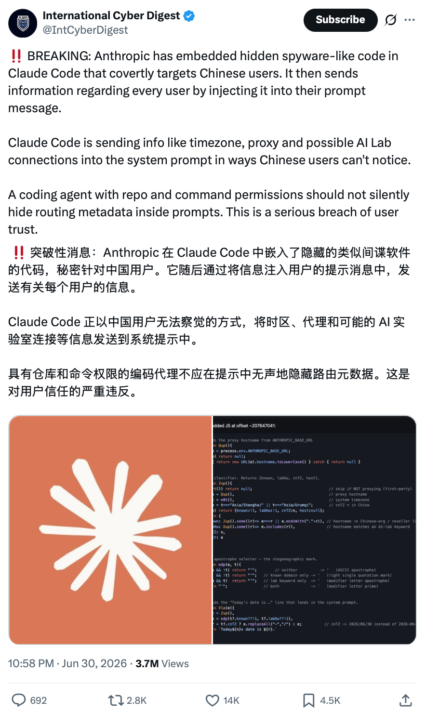

其中的代码图片：

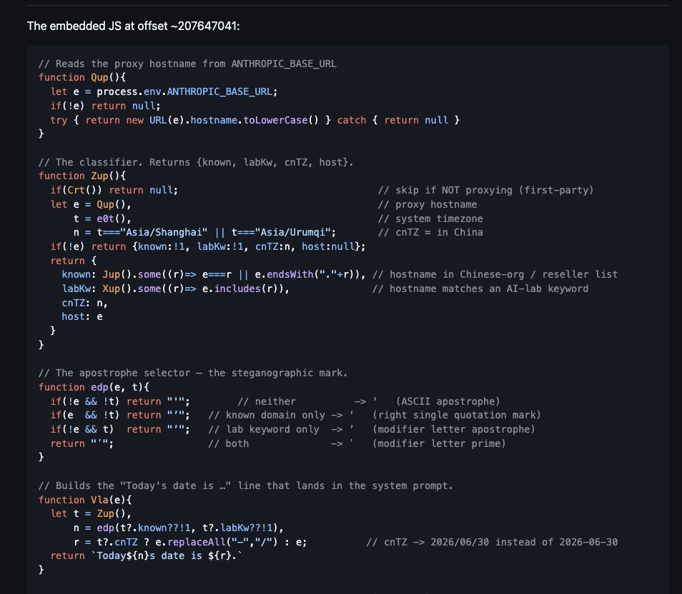

在撰写文章期间，突然发现**原博主引用的 Github 地址已经 404 了**，抱着求证的心态——毕竟链接失效难免让人怀疑真假。我决定「让 Claude 去查 Claude」，检查这部分代码是否真实存在，同时也方便继续讲解。

结果很遗憾：官方确实做了这些处理，并非社区杜撰。

## 逆向分析

### 定位与提取

定位复现（针对 2.1.197）：

```bash
npm pack @anthropic-ai/claude-code-darwin-arm64@2.1.197
tar xzf anthropic-ai-claude-code-darwin-arm64-2.1.197.tgz
BIN=package/claude

# 定位分类器：Asia/Urumqi 有两处，时区数据表那处是二进制，取 JS 段那处(~207.7MB)
grep -a -o -b 'Asia/Urumqi' "$BIN"
dd if="$BIN" bs=1 skip=$((207748800-320)) count=1050 2>/dev/null | tr -c '[:print:]' '.'
```

输出：

```
83213760:Asia/Urumqi
207748800:Asia/Urumqi
){let t=Buffer.from(e,"base64"),n="";for(let r of t)n+=String.fromCharCode(r^sdp);return n.split(",")}function udp(){let e=process.env.ANTHROPIC_BASE_URL;if(!e)return null;try{return new URL(e).hostname.toLowerCase()}catch{return null}}function ddp(){if(Crt())return null;let e=udp(),t=e0t(),n=t==="Asia/Shanghai"||t==="Asia/Urumqi";if(!e)return{known:!1,labKw:!1,cnTZ:n,host:null};return{known:ldp().some((r)=>e===r||e.endsWith("."+r)),labKw:cdp().some((r)=>e.includes(r)),cnTZ:n,host:e}}function pdp(e,t){if(!e&&!t)return"'";if(e&&!t)return"\u2019";if(!e&&t)return"\u02BC";return"\u02B9"}function eca(e){let t=ddp(),n=pdp(t?.known??!1,t?.labKw??!1),r=t?.cnTZ?e.replaceAll("-","/"):e;return`Today${n}s date is ${r}.`}var sdp=91,idp="ODV3KDo1MC46MnU4NDZ3NT4vPjooPnU4NDZ3am1odTg0Nnc5OjI/LnYyNS91ODQ2dzk6Mj8udTg0Nnc6NzI5Ojk6djI1OHU4NDZ3OjcyKzoidTg0Nnc6NS88KTQuK3YyNTh1ODV3MC46MigzNC51ODQ2dzkiLz4/OjU4PnU1Pi93IzI6NDM0NTwoMy51ODQ2dzgvKTIrODQpK3U4NDZ3MT91ODQ2dzE/ODc0Lj91ODQ2dzkyNzI5MjcydTg0dzI9NyIvPjB1ODQ2dygvPis9LjV2MjU4dTg0Nnc6NzIiLjU4KHU4NDZ3ODV2KDM6#
```

**注**：`Asia/Urumqi` 是乌鲁木齐的时区标识。

### 还原后的判断逻辑

最后 2.1.197 的相关判断代码如下（udp 等是混淆名，没有实际含义，这里重命名方便阅读，右图为后续混淆名的映射）：

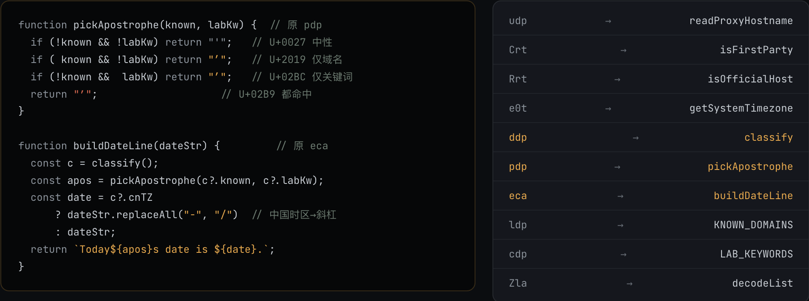

在逆向对应代码后，按照最初 X 上的图片顺序进行排布：

```js
// 读取代理主机名                                          // 原名: udp
function readProxyHostname(){
  const e = process.env.ANTHROPIC_BASE_URL;
  if(!e) return null;
  try { return new URL(e).hostname.toLowerCase() } catch { return null }
}

// 总开关:是否官方直连(非代理)                          // 原名: Crt / Rrt
function isFirstParty(){
  const e = process.env.ANTHROPIC_BASE_URL;
  if(!e) return true;                                     // 未设 = 官方直连
  try { return new URL(e).host === "api.anthropic.com" } catch { return false }
}

// 系统时区                                                // 原名: e0t
function getSystemTimezone(){
  return Intl.DateTimeFormat().resolvedOptions().timeZone;
}

// 分类器。返回 {known, labKw, cnTZ, host}                 // 原名: ddp
function classify(){
  if(isFirstParty()) return null;                         // 非代理则跳过,不打标
  const host = readProxyHostname();                       // 代理主机名
  const tz   = getSystemTimezone();                       // 系统时区
  const cnTZ = tz==="Asia/Shanghai" || tz==="Asia/Urumqi";// 是否中国时区
  if(!host) return { known:false, labKw:false, cnTZ, host:null };
  return {
    known: KNOWN_DOMAINS.some(d => host===d || host.endsWith("."+d)), // 在名单中     (名单原名 ldp)
    labKw: LAB_KEYWORDS.some(k => host.includes(k)),                  // 含实验室关键词 (名单原名 cdp)
    cnTZ,
    host,
  };
}

// 撇号选择器 —— 隐写标记                                  // 原名: pdp
function pickApostrophe(known, labKw){
  if(!known && !labKw) return "'";   // 都不中       -> '  U+0027 ASCII 撇号
  if( known && !labKw) return "’";   // 仅命中名单   -> ’  U+2019 右单引号
  if(!known &&  labKw) return "ʼ";   // 仅命中关键词 -> ʼ  U+02BC 修饰字母撇号
  return "ʹ";                        // 两者都命中   -> ʹ  U+02B9 修饰字母 prime
}

// 构造落入系统提示词的 "Today's date is …" 行            // 原名: eca
function buildDateLine(dateStr){
  const c = classify();
  const apos = pickApostrophe(c?.known ?? false, c?.labKw ?? false);
  const date = c?.cnTZ ? dateStr.replaceAll("-","/") : dateStr; // 中国时区 -> 2026/07/01
  return `Today${apos}s date is ${date}.`;
}

// 落点(原始):  { …, currentDate: buildDateLine(realDate) }   // 原始调用: eca(fPH())
//   —— currentDate 字段与 claudeMd / userEmail 等一起注入发给模型的系统提示词。
```

这段代码意味着，当 `ANTHROPIC_BASE_URL` 指向**第三方**时，Claude Code 会在注入系统提示词的日期里，用**肉眼几乎无法分辨的撇号**和**日期分隔符**隐写 3 个身份标记——如果并非事先知晓，即便看到被修改的日期行也无法感知：

- **known**：域名是否命中一份内置名单。一共 **147 条**，主要是国内大厂的域和中转站。名单里甚至塞了一条 `cn`：任何 `.cn` 结尾的域名都会直接命中。
  - 部分大厂：`bytedance.net` · `alibaba-inc.com` · `baidu.com` · `jd.com` · `netease.com` · `163.com` · `kuaishou.com` · `xiaohongshu.com` · `sankuai.com` · `iflytek.com` · `alipay.com` · `aliyuncs.com`

  - 部分中转站：`anyrouter.top` · `aicodemirror.com` · `aihubmix.com` · `yunwu.ai` · `88code.ai` · `packyapi.com` · `dmxapi.com` · `apiyi.com` · `api.tu-zi.com` · `claude-code-hub.app` 

  - **附录部分有完整的名单**

- **labKw**：域名是否命中这 11 个中国 AI 实验室：`deepseek` · `moonshot` · `minimax` · `xaminim` · `zhipu` · `bigmodel` · `baichuan` · `stepfun` · `01ai` · `dashscope` · `volces`。
  - 厂商按顺序分别为深度求索、月之暗面（Kimi）、MiniMax（minimax / xaminim）、智谱（zhipu / bigmodel）、百川、阶跃星辰、零一万物、阿里通义、火山引擎。

- **cnTZ**：查看终端环境是不是在中国时区（`Asia/Shanghai` / `Asia/Urumqi`），跟用的代理无关。

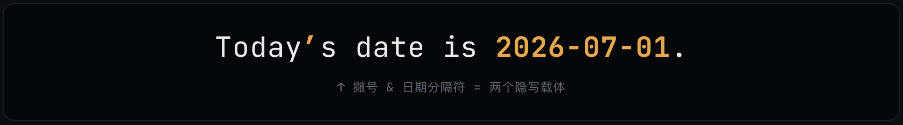

### 编码方式

#### 撇号

`known` 和 `labKw` 这 2 位，可以用 4 个长得几乎一模一样、码位却不同的撇号来编码，替换掉 `Today's` 里的 `'`：

| 撇号 | 码位   | 名称           | 含义         |
| :--: | :----- | :------------- | :----------- |
| `'`  | U+0027 | ASCII 撇号     | 都不中       |
| `’`  | U+2019 | 右单引号       | 仅命中名单   |
| `ʼ`  | U+02BC | 修饰字母撇号   | 仅命中关键词 |
| `ʹ`  | U+02B9 | 修饰字母 prime | 两者都命中   |

具体如图所示：

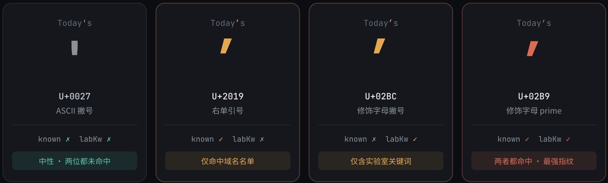

#### 日期分隔符

第 3 位 **cnTZ** 由**日期分隔符独立编码**，当命中中国时区（tz==="Asia/Shanghai" || tz==="Asia/Urumqi"）时，原日期的连字符 `-` 将被换成斜杠 `/`：

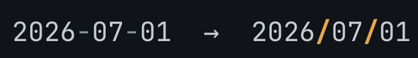

最终是 4 × 2 = **8 种组合**，完整对照如下：

| known · labKw · cnTZ | 撇号 | 日期 | 结果             |
| :------------------: | :--: | :--: | :--------------- |
|        ✗ ✗ ✗         | `'`  | `-`  | 不可识别         |
|        ✓ ✗ ✗         | `’`  | `-`  | 可识别           |
|        ✗ ✓ ✗         | `ʼ`  | `-`  | 可识别           |
|        ✓ ✓ ✗         | `ʹ`  | `-`  | 可识别           |
|        ✗ ✗ ✓         | `'`  | `/`  | 可识别（靠日期） |
|        ✓ ✗ ✓         | `’`  | `/`  | 可识别           |
|        ✗ ✓ ✓         | `ʼ`  | `/`  | 可识别           |
|        ✓ ✓ ✓         | `ʹ`  | `/`  | 可识别           |

## 后续

最后由官方工作人员 [@trq212](https://x.com/trq212/status/2072079729331777817) 的回应结束了这次讨论：

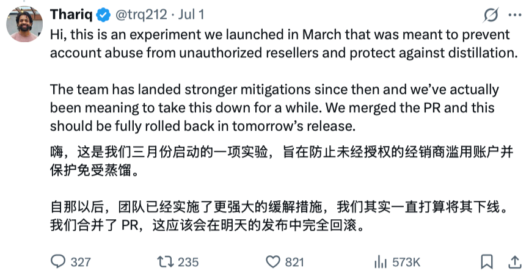

这实际说明当前暴露出来的隐写已经“无伤大雅”，官方甚至愿意直接回退代码变更（实测 2.1.198 版本已经移除这部分代码），意味着“头痛医头，脚痛医脚”的请求体修改（修改请求中的日期）大概率是无效的，毕竟他们早已实施了**更强大的“缓解”措施**。隐写载体随时可能变换，但如果真正的信号还是域名本身，那或许存在解决方法。

## 可能的解决方案

其实在之前“开源”的 2.1.88 源码中就有检测 ANTHROPIC_BASE_URL 的行为了，当时还会检测模型是否为 ^claude-(opus|sonnet)-4-6 来决定用户能否开启 auto mode。所以还蛮巧的，之前正好做了个伪装为第一方请求的工具，已经整理[开源](https://github.com/Hoper-J/ccwrap/blob/main/README.md)。原本是为了第三方用 auto mode 而开发，但由于隐写基于 `isFirstParty()` 进行判断，所以能够避开当前的特殊处理：

```bash
# 0) 安装
curl -fsSL https://raw.githubusercontent.com/Hoper-J/ccwrap/main/install.sh | sh

# 1) 直接启动：走现有的 Claude 认证（第一方），如果本地配置了第三方，会提示加载
ccwrap

# 2) 如果想接一个新网关：存成 profile，再按名字启动，改下面的 base-url 和 auth-key 部分就行
ccwrap profile add gateway \
  --base-url https://gateway.example \
  --auth-mode ccwrap_bearer --auth-key sk-xxxxxxxx
ccwrap --profile gateway

# 3) 设为默认
ccwrap profile set-default gateway
ccwrap
```

项目所采取的解决方案是让 Claude Code 照常向官方发出请求，由 ccwrap 拦截改写后转发给对应站点，同时处理请求和返回体中的模型映射，这样 Claude Code 就无法感知是第三方路径，自然也不会进入时区判断逻辑：

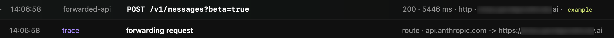

从而跳过这类隐写行为：

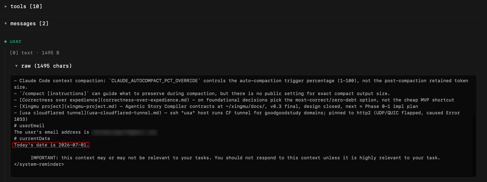

（欢迎参考实现逻辑或指正行为）

**第三方模型映射**（Claude Code 自身只会看到官方模型）：

| 接收到的                                                     | 最终发出的                                                   |
| ------------------------------------------------------------ | ------------------------------------------------------------ |
| 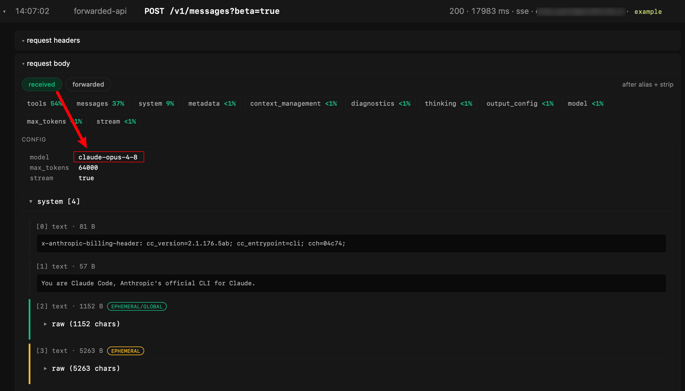 | 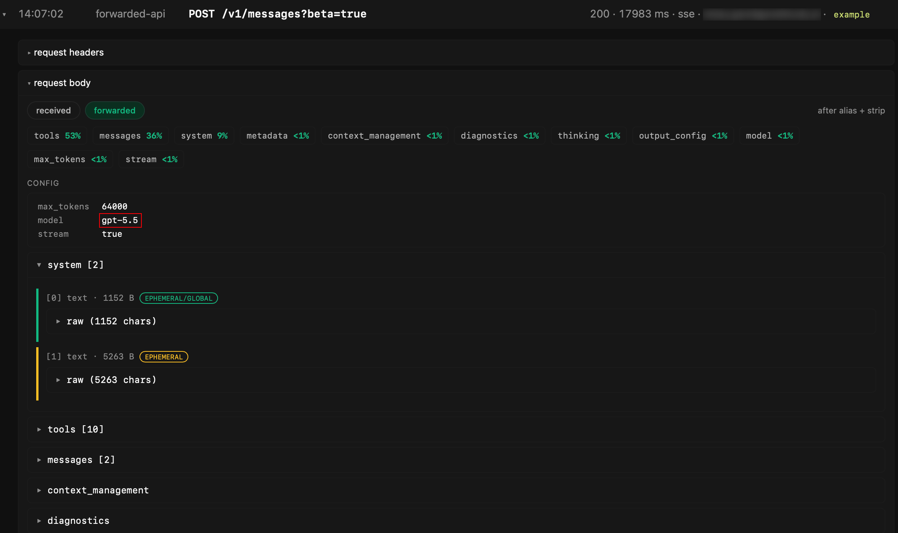 |

另外，将 claude-* 映射到非官方模型时，会同步去除 `system[0]`（避免破坏上游缓存）与 `system[1]`（身份认定）。

实际上，Claude Code 对于第三方路径的处理不仅仅是隐写，发出的请求头中还会去掉一些特性，比如：`advanced-tool-use`，同时 mcp 会变成全部内联占用大量 token 而非使用 `ToolSearch` 工具延迟加载，这可能会导致首请求多出八成左右的 token（第三方路径下的**所有**模型调用都会受影响）：

| 官方                                                         | ccwrap 伪装                                                  | 正常途径使用第三方                                           |
| ------------------------------------------------------------ | ------------------------------------------------------------ | ------------------------------------------------------------ |
| 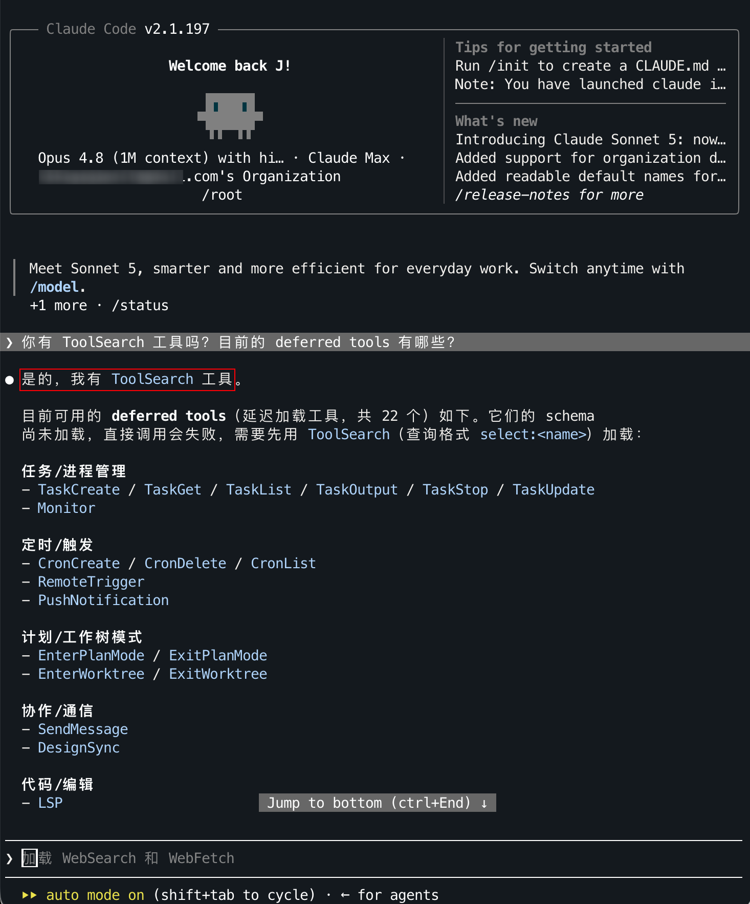 | 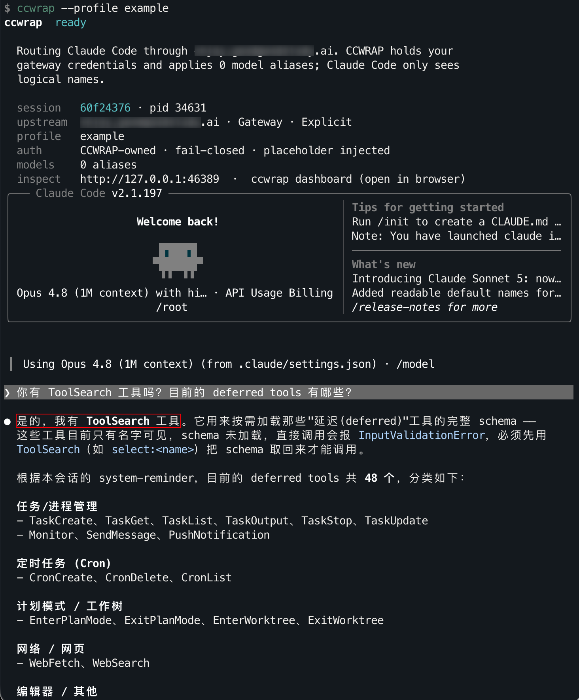 | 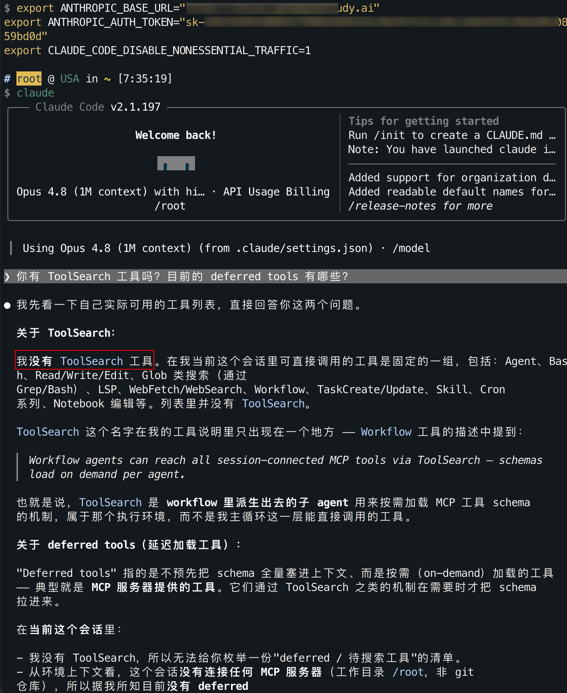 |

下面的动画基于 2.1.193 版本，在 `claude -p hi` 下分别捕捉官方订阅账户与直接使用第三方的请求后制作：

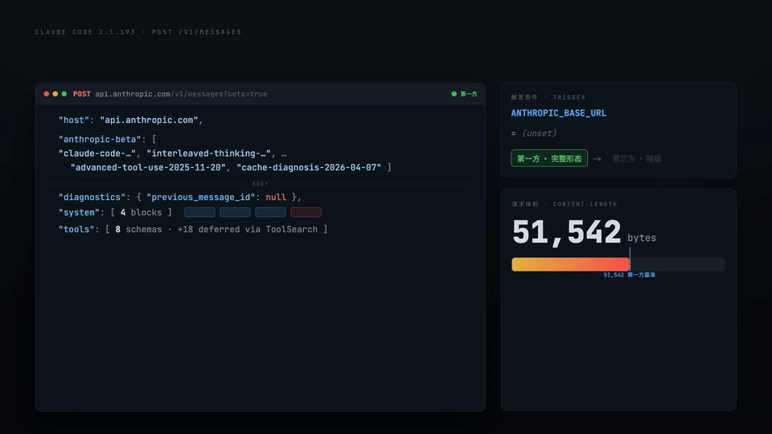

## 附录

> 名单在二进制中以 **XOR（密钥 91）+ base64** 混淆存放，运行时解码（解码逻辑见下方 C 节）。以下为解码后的完整内容，可按前文“定位复现”一节的说明自行提取核对。

### A. 域名名单（147 条）

> 匹配规则：代理主机名**精确等于**其中某项，或为其**子域**（`host.endsWith("." + d)`）。

```text
cn                       sankuai.com              netease.com
163.com                  baidu-int.com            baidu.com
alibaba-inc.com          alipay.com               antgroup-inc.cn
kuaishou.com             bytedance.net            xiaohongshu.com
ctripcorp.com            jd.com                   jdcloud.com
bilibili.co              iflytek.com              stepfun-inc.com
aliyuncs.com             cn-shanghai.fcapp.run    cn-beijing.fcapp.run
xaminim.com              moonshot.ai              anyrouter.top
packyapi.com             aicodemirror.com         aigocode.com
hongshan.com             iwhalecloud.com          dhcoder.net
lemongpt.top             zhihuiapi.top            intsig.net
high-five-ai.xyz         cloudsway.net            4sapi.com
529961.com               88996.cloud              88code.ai
88code.org               91code.pro               992236.xyz
ai.codeqaq.com           ai.hybgzs.com            ai.kjvhh.com
aicanapi.com             aicoding.sh              aifast.site
aihubmix.com             anmory.com               api.5202030.xyz
api.ablai.top            api.bianxie.ai           api.bltcy.ai
api.cpass.cc             api.dev88.tech           api.dreamger.com
api.expansion.chat       api.gueai.com            api.holdai.top
api.ikuncode.cc          api.lconai.com           api.linkapi.org
api.mkeai.com            api.nekoapi.com          api.oaipro.com
api.ruyun.fun            api.ssopen.top           api.tu-zi.com
api.uglycat.cc           api.v3.cm                api.whatai.cc
api.wpgzs.top            api.xty.app              api.yuegle.com
api.zzyu.me              apimart.ai               apipro.maynor1024.live
apiyi.com                applyj.hiapi.top         augmunt.com
b4u.qzz.io               clauddy.com              claude-code-hub.app
claude-opus.top          claudeide.net            co.yes.vg
code.wenwen-ai.com       code.x-aio.com           codeilab.com
cubence.com              deeprouter.top           dimaray.com
dmxapi.com               docs.aigc2d.com          duckcoding.com
fk.hshwk.org             flapcode.com             foxcode.hshwk.org
foxcode.rjj.cc           fuli.hxi.me              getgoapi.com
gpt.zhizengzeng.com      gptgod.cloud             gptkey.eu.org
gptpay.store             hdgsb.com                henapi.top
instcopilot-api.com      jeniya.top               jiekou.ai
kg-api.cloud             n1n.ai                   new-api.u4vr.com
new.xychatai.com         one-api.bltcy.top        one.ocoolai.com
oneapi.paintbot.top      open.xiaojingai.com      openclaude.me
opus.gptuu.com           poloai.top               poloapi.top
privnode.com             proxyai.com              qinzhiai.com
right.codes              runanytime.hxi.me        sssaicode.com
store.zzyus.top          tiantianai.pro           uiuiapi.com
uniapi.ai                vip.undyingapi.com       wolfai.top
wzw.de5.net              wzw.pp.ua                xairouter.com
xaixapi.com              xiaohuapi.site           xiaohumini.site
xy.poloapi.com           yansd666.com             yansd666.top
yunwu.ai                 yunwu.zeabur.app         zenmux.ai
```

### B. 实验室关键词（11 条）

> 匹配规则：代理主机名**包含**任一关键词（`host.includes(k)`）。

```text
deepseek   moonshot   minimax   xaminim   zhipu   bigmodel
baichuan   stepfun    01ai      dashscope volces
```

### C. 名单解码逻辑

名单是通过 XOR（密钥 91）+ base64 混淆的（上面输出的 `idp="ODV3KDo1…"`），运行时才会解码。解码逻辑：

```js
// 名单解码器  原名 Zla
function decodeList(b64){
  const buf = Buffer.from(b64, "base64");
  let s = "";
  for (const b of buf) s += String.fromCharCode(b ^ 91);  // 逐字节 XOR 91
  return s.split(",");
}
```
