# 聊聊 Claude Code v2.1.111：Opus 4.7，Auto 模式开放，新的思考等级 xhigh，以及“限免3次”的 `/ultrareview`

> 没想到 Claude Opus 4.7 先来一步，不过除了模型更新的消息，还有一些值得关注的 Claude Code 新特性：
>
> - Opus 4.7 引入新的思考等级 `xhigh`，默认使用 `xhigh`。
> - 新 `/ultrareview` 命令，每付费用户限免 3 次。
> - auto mode 终于可用于 Max 计划。
>
> **参考链接**：
>
> - [`Introducing Claude Opus 4.7`](https://www.anthropic.com/news/claude-opus-4-7)
> - [`Claude Code changelog v2.1.111`](https://docs.anthropic.com/en/release-notes/claude-code)

## 目录

- [版本升级](#版本升级)
- [Opus 4.7](#opus-47)
- [Claude Code 更新](#claude-code-更新)
  - [1. 新的思考等级 /effort xhigh](#1-新的思考等级-effort-xhigh)
  - [2. /ultrareview 实测](#2-ultrareview-实测)
    - [ultrareview 本地完整项目](#ultrareview-本地完整项目)
    - [源码实现](#源码实现)
    - [顺带聊一下 ultraplan](#顺带聊一下-ultraplan)
  - [3. auto mode 开放](#3-auto-mode-开放)

## 版本升级

下面讲述的功能大多需要 Claude Code ≥ v2.1.111。复制下面的 prompt 交给 Claude 或者手动升级：

```
Claude Code 需要升到最新版，请帮我：

1. 跑 `claude --version` 看当前版本
2. 跑 `which -a claude` 检查是否有多个 claude 二进制
   - 多个的话（常见情形：npm 全局 + native installer + 不同 node 版本下的全局），把所有路径列给我，问我保留哪个
   - 多余的不要自动删，给我清理命令让我自己确认
3. 根据保留的那个二进制，用对应方式升级到 npm 上的 latest：
   - npm 全局：`npm install -g @anthropic-ai/claude-code@latest`
   - native installer：`claude update`
   - 包管理器装的：告诉我对应的升级命令，但**不要自动跑**
4. 升级完再跑 `claude --version` 确认。如果版本号没变（PATH 冲突、缓存、shell 没刷新等）告诉我可能的原因

任何 sudo / rm 命令都先停下来问我。检测到异常输出（报错、找不到命令、权限问题）也停下来汇报，不要自己尝试解决。
```

## Opus 4.7

先看一轮得分对比：

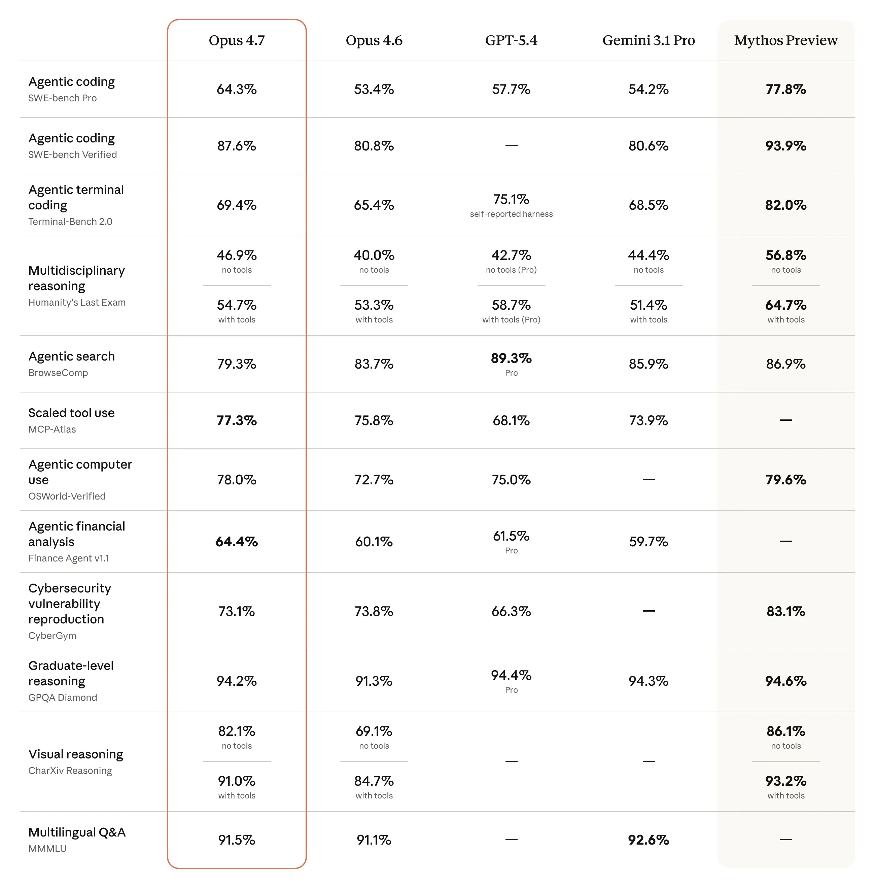

除了 `Agentic search (BrowseComp)` 从 `83.7%` 掉到 `79.3%`、网络安全（CyberGym）从 `73.8%` 微降到 `73.1%` 这两项以外，各项分数均优于 Opus 4.6。尽管官方框选的是 Opus 4.7，给人的感觉却是在秀 `Mythos Preview`，不过从口风来看， Mythos 或许存在广泛发布的可能：

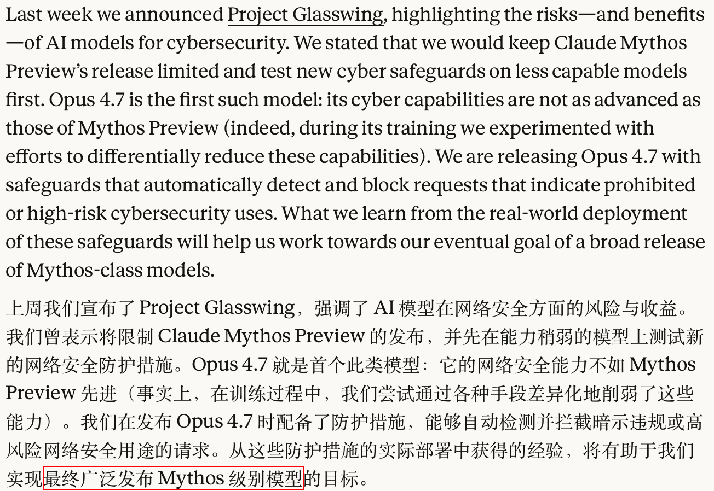

价格上 Opus 4.7 和 Opus 4.6 一致：每百万输入 tokens `$5`，每百万输出 tokens `$25`。不过实际上会比之前花的快一点，因为 Opus 4.7 用了新的分词器（tokenizer），优化了模型处理文本的方式。所以同样一段输入映射成 tokens 后，可能会变成原来的 `1.0x - 1.35x`，具体取决于内容类型。

下面简述一下官方博客中描述的模型能力升级和早期测试反馈：

- **高级软件工程能力**
  - 在 93 项 coding benchmark 上，Opus 4.7 的解决率相对于 Opus 4.6 提升了 `13%`。

- **更强的指令遵循能力**
  - Claude 长上下文的指令遵循能力体感上一直是最好的，官方提及早期编写的提示词可能会有意想不到的效果（或许该清理 claude.md 中过时的一些规范了）。

- **能够识别更高分辨率的图像**
  - Opus 4.7 可以接受长边 2,576 像素（约 375 万像素）的图像，是之前模型的三倍多。另外，在 computer-use 的相关工作上，visual-acuity benchmark 得分从 Opus 4.6 的 `54.5%` 跳到 Opus 4.7 的 `98.5%`。

- **更具有审美和创意**
- **推理更具有自主性和创造性**
  - 在 Cursor 给出的 CursorBench 测试中，Opus 4.7 达到了 `70%`，之前的 Opus 4.6 为 `58%`。

- **金融分析能力提升**
  - General Finance 模块得分从 Opus 4.6 的 `0.767` 提到 Opus 4.7 的 `0.813`。

- **基于文件系统的记忆能力提升**
- ~~**成功尝试削弱了模型的网络安全能力**~~

## Claude Code 更新

### 1. 新的思考等级 `/effort xhigh`

> *More effort control: Opus 4.7 introduces a new `xhigh` (“extra high”) [effort level](https://platform.claude.com/docs/en/build-with-claude/effort) between `high` and `max`, giving users finer control over the tradeoff between reasoning and latency on hard problems. In Claude Code, we’ve raised the default effort level to `xhigh` for all plans. When testing Opus 4.7 for coding and agentic use cases, we recommend starting with `high` or `xhigh` effort.*

官方为 Opus 4.7 新加了一个 `xhigh`（extra high）effort，介于 `high` 和 `max` 之间，同时把所有计划的默认思考档都抬到了 `xhigh`。不过个人还是更喜欢用 `/effort max`：

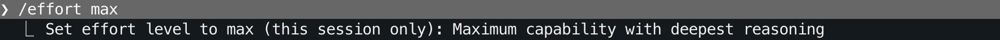

> [!tip]
>
> `/effort` 不带参数现在会开启一个交互式滑块（v2.1.111），← → 选择档位、回车确认：
>
> 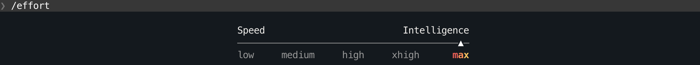

Opus 4.7 effort 的官方指南[^1]：

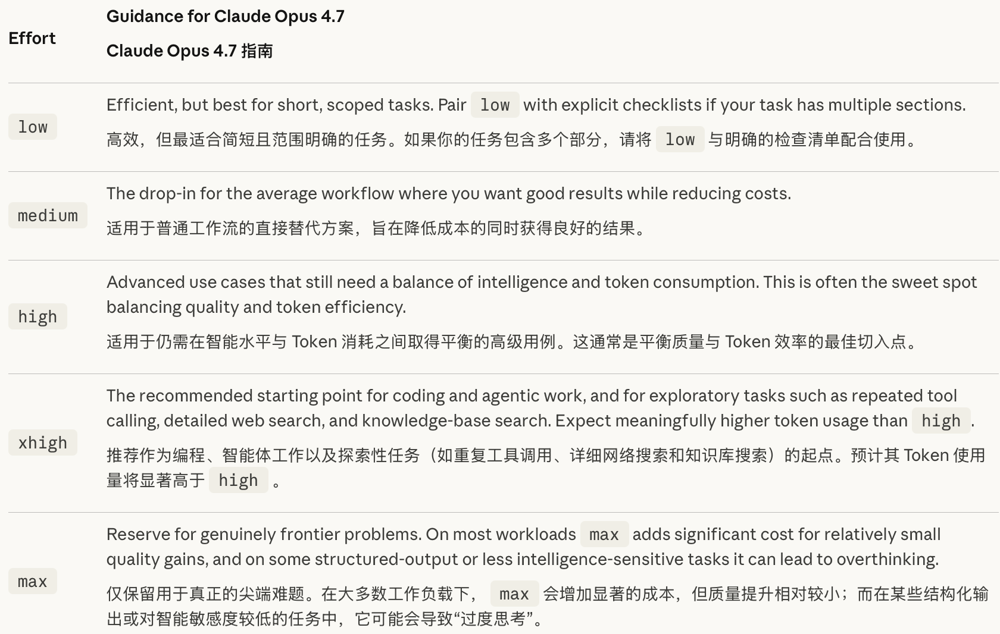

>[!note]
>
>Opus 4.6 不支持 `xhigh`，其他模型（Sonnet、Haiku 等）选了会默认回退到 `high`。

下图为 Claude 内部智能体编程评估中，不同 effort 等级下的得分和 tokens 的关系（模型根据单用户提示词自主工作）：

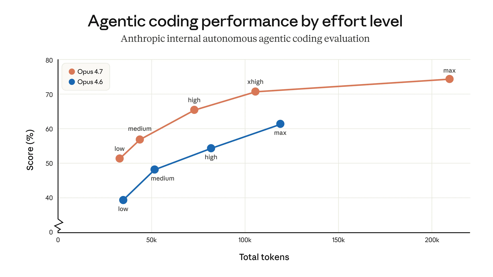

[^1]: [Effort](https://platform.claude.com/docs/en/build-with-claude/effort)

### 2. `/ultrareview` 实测

> *In Claude Code: The new `/ultrareview` [slash command](https://code.claude.com/docs/en/commands) produces a dedicated review session that reads through changes and flags bugs and design issues that a careful reviewer would catch. We’re giving Pro and Max Claude Code users three free ultrareviews to try it out.*

> [!important]
>
> 目前开放的 `/ultrareview` 每个订阅的计划限免 3 次，后续需要按量付费，请勿随意在目录中实验该命令：
>
> 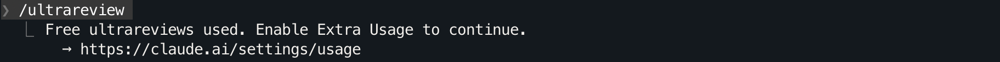

在 Claude Code v2.1.111 的命令列表里我们可以看到新的 `/ultrareview`：

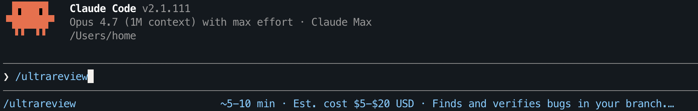

用时取决于代码量，官方预计在 `5-10` 分钟左右，消耗 `5-20` 美元。可以直接 review 当前变更（相对于 main），也可以用 `/ultrareview <PR number>` 去指定 GitHub PR。

回车后，Claude Code 会直接说明这次 review 的范围（根据 git），以及它要做什么：

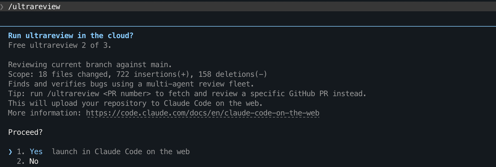

图示说明：

- 剩余免费额度会直接显示，图中是 `Free ultrareview 2 of 3`

- review 的对象默认是“当前相对默认分支的变更，纯本地仓库就是 `main` 分支”

  - 本地仓库显示的变更等价于执行命令：`git diff --shortstat`

    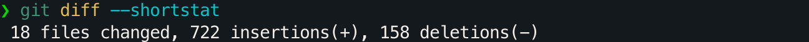

- 会把仓库上传到 web 版 Claude Code 去执行
  - 如果对 web 版感兴趣可以访问：[Use Claude Code on the web](https://code.claude.com/docs/en/claude-code-on-the-web)

`Yes` 继续之后，终端会返回 web 的会话链接：

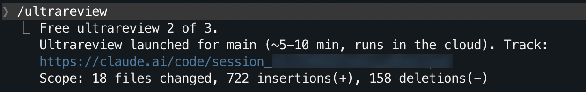

此时在终端无法看到实际审阅的具体信息，这个命令会启动一个云任务。网页界面大致如下（项目来自一个废旧测试项目）：

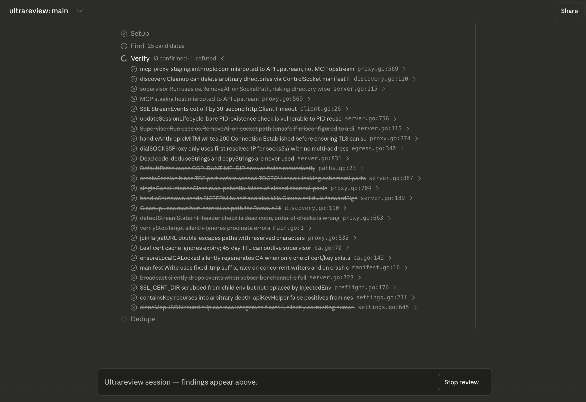

在等待的这段时间里认识一下和 `cloud session` 的交互：

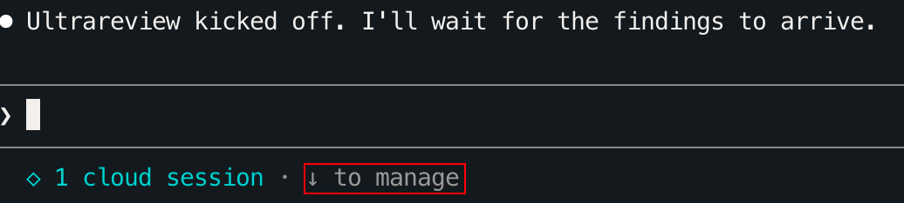

按一下 ↓ 再回车，可以看到更细的信息：`Setup -> Find -> Verify -> Dedupe`（高亮则代表目前阶段），以及当前发现、验证、驳回的问题数：

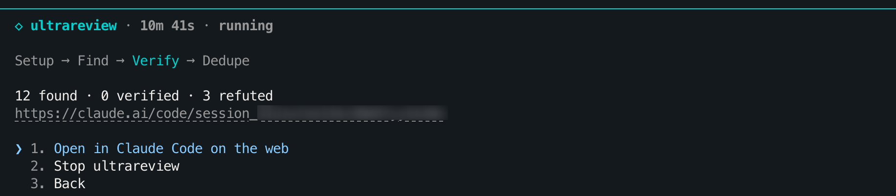


> [!note]
>
> **关于纯本地代码（无 origin）**
>
> `/ultrareview` 不是在任何目录都能直接跑的，需要位于一个存在 main 分支的 Git 仓库中，否则会报错：
>
> 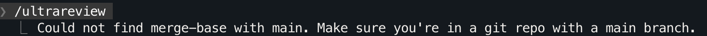
>
> 测试了一下，如果本地没有 main 分支，还需要重命名：
>
> 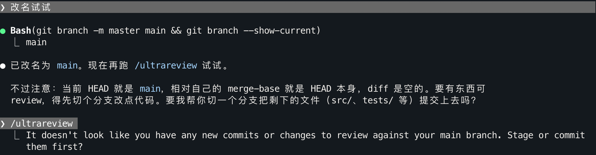
>
> 执行命令前也可以直接把想要 review 的代码 add 到暂存区，不用特意创建分支：
>
> 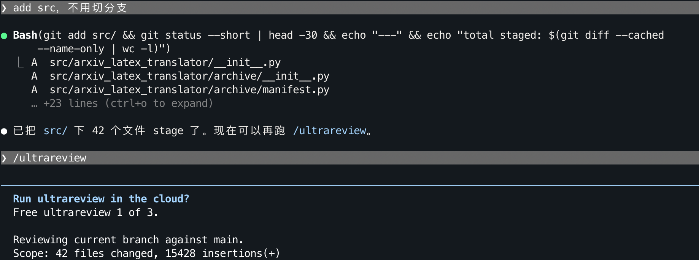
>
> 另外，ultrareview 只能看到 tracked 内容（已提交 + 已暂存 + 未暂存的 tracked 改动）。untracked 文件（??）不会上传到 web 端，下图是之前一次 `/ultrareview` 执行后的反馈：
>
> 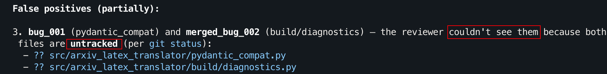
>
> **使用该命令时不要遗漏新增的文件**。

#### ultrareview 本地完整项目

> 既然只有三次机会，不如最大化收益看看项目是否存在问题。注意，>30 分钟可能会被本地认为失败。

- 方法1：复制到全新的文件夹再执行以下命令：

  ```bash
  git init                                  # 初始化 git（默认 main 分支）
  git commit --allow-empty -m "empty seed"  # main 指向一个空 commit
  git add -A                                # 把所有代码 add 到暂存区
  ```

  然后 /ultrareview，此时 diff 覆盖整个代码库。

- 方法2：复制下面的 prompt 交给 Claude，不用担心上下文污染，因为 ultrareview 目前并不会传对话历史到 web：

  ````
  当前 Git 仓库需要用 /ultrareview 做全量代码审查。对于本地仓库，/ultrareview 内部硬编码用 `main` 作为 diff base，所以我们总是要把一个叫 `main` 的分支指到空 seed，不管当前分支叫什么。请帮我自动完成准备阶段：
  
  - 记录当前分支名 `CUR=$(git branch --show-current)`；detached HEAD（取到空值）就报错停下来
  - 工作区不干净直接 `git stash push -u -m "pre-ultrareview-stash"`，不要停下来问
  - 然后执行下面的命令，任何一步失败就停下来告诉我：
  
  ```bash
  FIRST=$(git rev-list --max-parents=0 HEAD | tail -n1)
  EMPTY_COMMIT=$(git commit-tree 4b825dc642cb6eb9a060e54bf8d69288fbee4904 -m "empty seed")
  
  # 记录 main 是否原本就存在，恢复时要区分处理
  MAIN_EXISTED=$(git show-ref --verify --quiet refs/heads/main && echo 1 || echo 0)
  printf '%s\n%s\n%s\n' "$CUR" "$FIRST" "$MAIN_EXISTED" > .git/ultrareview-state
  
  git replace --graft $FIRST $EMPTY_COMMIT
  
  # 如果 main 原本存在就备份
  [ "$MAIN_EXISTED" = "1" ] && git branch main-real main
  
  # 只有当前就在 main 上才需要 detach（不然 branch -f main 会被拒）
  [ "$CUR" = "main" ] && git switch --detach
  
  git branch -f main $EMPTY_COMMIT
  ```
  
  （`4b825dc...` 是 git 官方的 empty tree SHA 常量；状态落盘到 `.git/ultrareview-state` 方便恢复时不靠记忆。）
  
  执行完停下来，我会手动跑 /ultrareview。下面是后续恢复用的命令（知道就行，等我明确说恢复再执行，从 `.git/ultrareview-state` 读回 `CUR` / `FIRST` / `MAIN_EXISTED`）：
  
  ```bash
  if [ "$MAIN_EXISTED" = "1" ]; then
    git branch -f main main-real
    git branch -D main-real
  else
    git branch -D main   # main 原本不存在，临时造的，直接删
  fi
  
  git switch "$CUR"      # 回到原分支
  git replace -d $FIRST
  
  # 如果 stash list 里有 "pre-ultrareview-stash"，pop 对应那条（按 sentinel 精确匹配，别误 pop 别的）
  rm .git/ultrareview-state
  ```
  ````

#### 源码实现

> ultrareview 的代码也存在于 v2.1.88 泄漏的源码中。考虑到官方已废弃 npm 上的 `@anthropic-ai/claude-code@2.1.88` 安装，这里不提供从下载到反编译的脚本，感兴趣可以访问：[tanbiralam/claude-code](https://github.com/tanbiralam/claude-code)。

这部分代码位于 [`src/commands/review/reviewRemote.ts`](https://github.com/tanbiralam/claude-code/blob/9f51e71/src/commands/review/reviewRemote.ts)，/ultrareview 命令根据 args 是否为纯数字来区分两种模式（[`reviewRemote.ts:162-243`](https://github.com/tanbiralam/claude-code/blob/9f51e71/src/commands/review/reviewRemote.ts#L162-L243)）：

```js
// reviewRemote.ts
const prNumber = args.trim()
const isPrNumber = /^\d+$/.test(prNumber)

if (isPrNumber) {
  // PR 模式：refs/pull/N/head 走 GitHub clone
  session = await teleportToRemote({
    branchName: `refs/pull/${prNumber}/head`,
    environmentId: CODE_REVIEW_ENV_ID,
    environmentVariables: {
      BUGHUNTER_PR_NUMBER: prNumber,
      BUGHUNTER_REPOSITORY: `${repo.owner}/${repo.name}`,
      ...commonEnvVars,
    },
  })
} else {
  // Branch 模式：bundle 工作树上传
  session = await teleportToRemote({
    useBundle: true,
    environmentId: CODE_REVIEW_ENV_ID,
    environmentVariables: { BUGHUNTER_BASE_BRANCH: mergeBaseSha, ...commonEnvVars },
  })
}
```

- **PR 模式**（`/ultrareview <PR#>`）：告诉 web `refs/pull/{N}/head`，容器自己从 GitHub clone，不上传仓库
- **Branch 模式**（不传数字参数）：先用 [`getDefaultBranch()`](https://github.com/tanbiralam/claude-code/blob/9f51e71/src/utils/git.ts#L265-L267) 拿默认分支，跑 `git merge-base <默认分支> HEAD` 拿 fork point，再把 tracked 内容（含未暂存的 tracked 改动）打包上传，作为 `seed_bundle_file_id` 传给 web。

> [!tip]
> `getDefaultBranch()` 的实际调用链是 → `getCachedDefaultBranch()` → [`computeDefaultBranch()`](https://github.com/tanbiralam/claude-code/blob/9f51e71/src/utils/git/gitFilesystem.ts#L544-L566)。它只看 `refs/remotes/origin/*`，不读本地分支，在纯本地仓库 [`baseBranch`](https://github.com/tanbiralam/claude-code/blob/9f51e71/src/commands/review/reviewRemote.ts#L232) 会被回退为 `'main'`，所以前文才“没有 main 分支就需要重命名”。

相关环境变量在 `commonEnvVars`：

```js
const commonEnvVars = {
  BUGHUNTER_DRY_RUN:         '1',  // 走 lite-review 路径，不进完整 bughunter.go
  BUGHUNTER_FLEET_SIZE:      String(posInt(raw?.fleet_size,             5, 20)),
  BUGHUNTER_MAX_DURATION:    String(posInt(raw?.max_duration_minutes,  10, 25)),
  BUGHUNTER_AGENT_TIMEOUT:   String(posInt(raw?.agent_timeout_seconds, 600, 1800)),
  BUGHUNTER_TOTAL_WALLCLOCK: String(posInt(raw?.total_wallclock_minutes, 22, 27)),
}
```

[`posInt(value, default, max)`](https://github.com/tanbiralam/claude-code/blob/9f51e71/src/commands/review/reviewRemote.ts#L181-L186) 的第三个参数是上限。`BUGHUNTER_TOTAL_WALLCLOCK` 默认 22 分钟、最多到 27，因为还有一条 30 分钟轮询超时（[`REMOTE_REVIEW_TIMEOUT_MS = 30 * 60 * 1000`，`POLL_INTERVAL_MS = 1000`](https://github.com/tanbiralam/claude-code/blob/9f51e71/src/tasks/RemoteAgentTask/RemoteAgentTask.tsx#L540-L541)），注释说留 ~3 分钟给 finalization，所以加起来刚好 30。然后 Claude Code 通过 `RemoteAgentTask` 每秒发起一次轮询，web 完成后会把 review 结果塞进本地对话。

> [!note]
>
> 如果项目的 diff 非常大导致 ultrareview 超时，会直接浪费一次机会，issues [#49706](https://github.com/anthropics/claude-code/issues/49706) 和 [#49905](https://github.com/anthropics/claude-code/issues/49905) 反馈了这一点。

ultrareview 的计费门控是 [`checkOverageGate()`](https://github.com/tanbiralam/claude-code/blob/9f51e71/src/commands/review/reviewRemote.ts#L42-L46)，简单来说，对于免费额度或 Team/Enterprise 直接继续（`proceed`），免费用完但开了 Extra Usage 会弹 `UltrareviewOverageDialog` 二次确认（`needs-confirm`），没开付费则拒绝（`not-enabled`），余额低于阈值同样拒绝（`low-balance`），计划用量不算在内。

这一整套流程并没有非要在 web 实现的感觉，特别是还需要用户从 claude code 使用命令的情况下。更像是为了隐藏工程细节，并更进一步地引入按量计费到用户视野上。

#### 顺带聊一下 ultraplan

> 该小节主观且仅能代表 v2.1.111 的使用体验，抛砖引玉。

“ultrareview 后进入 ultraplan，多么 ultra 的开发流程”

看起来确实如此，但**并不建议这么做**，ultraplan 并不会把你之前的对话历史上传到服务器，这会导致一个问题，如果在 ultrareview 后直接进入 ultraplan，Claude 会不知道要干什么，而且绝大多数用户并不知道它不知道（“有一种 ToB 的美”，这个斜杆命令在 Claude Code 的实际用户感知上似乎没有明确会丢失上下文）。

/ultraplan 后附带的 prompt 就是它除代码外唯一可见的上下文，比如这个由 `/ultraplan 刚刚你做了什么？...` 激活的 web ultraplan：

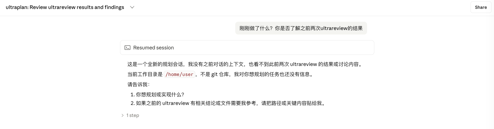

所以如果真的要使用 ultraplan，建议先 shift+tab 进入 plan mode，然后再选择进入 ultraplan 微调：

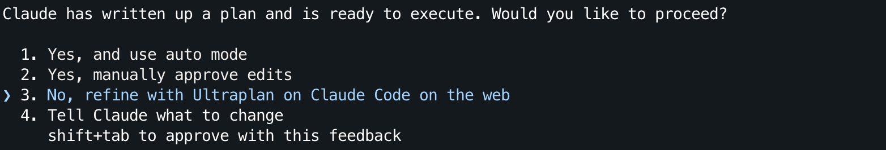

这样能够让 ultraplan 拥有初始上下文（来自之前的 plan mode 产出。注：项目本身未开源）：

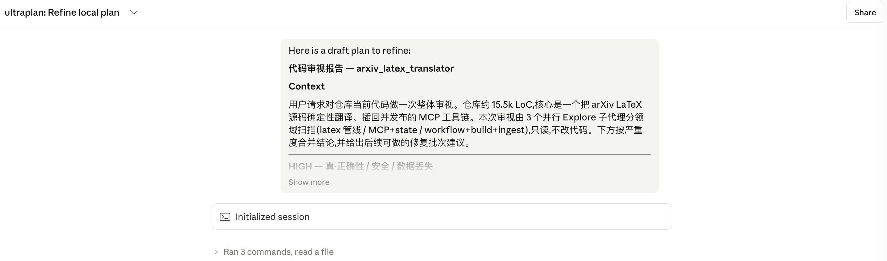

此时的 ultraplan 才可能符合你的预期：

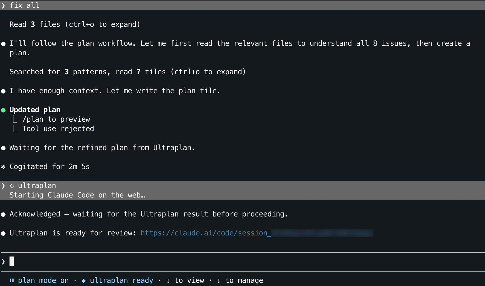

还需要注意的是，ultraplan 跑完会要求**在 web 上点确认**（ultrareview 不用，review 结果直接回到本地终端）。

从[源代码和注释](https://github.com/tanbiralam/claude-code/blob/9f51e71/src/commands/ultraplan.tsx)来看，ultraplan 仅仅只是默认启动了 Opus 和更多 Agent 并行探索（服务端有更高阶的处理应当会作为卖点说明，所以本文暂且当作没有处理）。

另外，从 ultraplan 出来会偶发无法启用 auto mode 的情况（未复现）。

### 3. auto mode 开放

> *In addition, we’ve extended [auto mode](https://claude.com/blog/auto-mode) to Max users. auto mode is a new permissions option where Claude makes decisions on your behalf, meaning that you can run longer tasks with fewer interruptions—and with less risk than if you had chosen to skip all permissions.*

Max 计划的用户**终于**实际开放了 auto mode，为了实际可用，你可能需要更新到 v2.1.112 —— "Fixed claude-opus-4-7 is temporarily unavailable for auto mode"。直接在 claude code 中使用 `shift+tab` 切换 3 次模式就会触发选项：

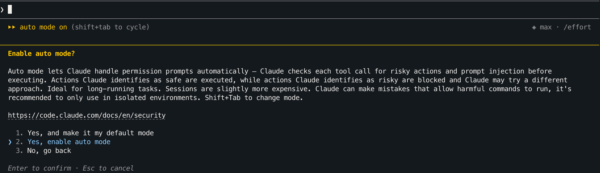

根据自身情况进行选择，个人选择 2 而非默认启用。

这次 auto mode 和 xhigh 的发布定位其实有点像，也是介于 accept edits 和 bypass permissions（`claude --dangerously-skip-permissions` / v2.1.x 可以用 `claude --permission-mode bypassPermissions`）之间的档位。相比于 accept edits 的「自动接受文件修改 + 常见文件系统命令」和 bypass permissions 的「几乎全盘接受」，auto mode 是一个“既要又要”的选项：没事不要让我决定，但别全部自己来。

另外，Claude Code `v2.1.111` 中 auto mode 不再需要 `--enable-auto-mode`。记得早几个版本 Max 用户未开放 auto mode 时（可恶的营销号），使用 `claude --enable-auto-mode` 再确认某些选项会直接瘫痪 plan mode：`auto mode is unavailable for your plan`，此时需要去 `~/.claude/settings.json` 中删除行 `"skipAutoPermissionPrompt": true`。
