# Claude Code 使用指南：安装与进阶技巧

> 如果你“正好”有一个 Claude 帐号，这篇文章或许能够带来一些启发。
>
> **相关文章**：
>
> - [Cursor 与 Claude Code Max 5x 订阅体验分享以及建议](./$125%20订阅撬动%20$2000%20API%20额度：这是我最终选择%20Claude%20Code%20Max%205x%20的理由.md)
> - [Claude Code 必备的用量监控工具：claude-monitor 实践指南](./Claude%20Code%20必备的用量监控工具：claude-monitor%20实践指南.md)

## 目录

- [快速开始](#快速开始)
   - [环境准备](#环境准备)
   - [安装 Claude Code](#安装-claude-code)
- [初始配置](#初始配置)
   - [文本主题](#文本主题)
   - [登录](#登录)
- [进阶配置](#进阶配置)
   - [优化体验](#优化体验)
   - [查看默认配置](#查看默认配置)
   - [任务完成通知（Mac iTerm 2）](#任务完成通知mac-iterm-2)
   - [命令参考](#命令参考)
- [命令使用](#命令使用)
   - [模型选择（/model）](#模型选择model)
   - [初始化（/init）](#初始化init)
      - [什么是 CLAUDE.md？](#什么是-claudemd)
   - [继续过去的对话](#继续过去的对话)
- [小技巧](#小技巧)
   - [采用思考模式](#采用思考模式)
   - [快捷键](#快捷键)
- [QA](#qa)
   - [如何关闭 Claude Code Commit 消息中的 Co-Authored-By](#如何关闭-claude-code-commit-消息中的-co-authored-by)
   - [Bug：invalid_request_error](#buginvalid_request_error)

## 快速开始

### 环境准备

- **Linux**

  ```bash
  # 更新系统包管理器
  sudo apt-get update
  sudo apt-get install npm
  
  # 安装 NVM (Node Version Manager)
  curl -o- https://raw.githubusercontent.com/nvm-sh/nvm/v0.39.0/install.sh | bash
  
  # 立即启用 NVM（不需要重启终端）
  export NVM_DIR="$HOME/.nvm"
  [ -s "$NVM_DIR/nvm.sh" ] && \. "$NVM_DIR/nvm.sh"
  [ -s "$NVM_DIR/bash_completion" ] && \. "$NVM_DIR/bash_completion"
  
  # 设置 Node.js 镜像源
  export NVM_NODEJS_ORG_MIRROR=https://npmmirror.com/mirrors/node
  
  # 安装并使用最新 LTS 版本
  nvm install --lts
  nvm use --lts
  ```

- **Mac**

  ```bash
  # 如果没有安装 Homebrew，取消下面的命令注释
  # /bin/bash -c "$(curl -fsSL https://raw.githubusercontent.com/Homebrew/install/HEAD/install.sh)"
  # 使用 Homebrew 安装 nvm
  brew update
  brew install nvm
  
  # 初始化 nvm（当前会话生效）
  mkdir -p ~/.nvm
  export NVM_DIR="$HOME/.nvm"
  source "$(brew --prefix nvm)/nvm.sh"
  
  # 可选：设置 Node.js 镜像（国内建议）
  export NVM_NODEJS_ORG_MIRROR=https://npmmirror.com/mirrors/node
  
  # 安装并使用最新 LTS 版本
  nvm install --lts
  nvm use --lts
  ```

- **Windows（PowerShell）**

  ```powershell
  # 安装 NVM for Windows
  winget install --id CoreyButler.NVMforWindows -e --source winget
  
  # 关闭并重新打开终端后：
  
  # （可选）设置国内镜像
  nvm node_mirror https://npmmirror.com/mirrors/node/
  nvm npm_mirror  https://npmmirror.com/mirrors/npm/
  
  # 安装并使用 LTS 版本 Node.js
  nvm install lts
  nvm use lts
  ```

  如果 `lts` 别名不可用，先执行：

  ```powershell
  nvm list available   # 查看可用版本
  nvm install <LTS版本号>
  nvm use <LTS版本号>
  ```

  如果不使用 nvm，也可直接安装 LTS 版 Node：

  ```powershell
  winget install OpenJS.NodeJS.LTS
  ```

  后续需要代理时（当前会话生效）：

  ```powershell
  $env:HTTPS_PROXY = "http://127.0.0.1:7890"
  $env:HTTP_PROXY  = "http://127.0.0.1:7890"
  $env:ALL_PROXY   = "socks5://127.0.0.1:7890"
  ```

### 安装 Claude Code

```bash
# 终端代理（如果下载不了就取消注释运行代理命令，注意，你的代理软件可能不同，需要根据实际代理软件调整端口）
# export https_proxy=http://127.0.0.1:7890 http_proxy=http://127.0.0.1:7890 all_proxy=socks5://127.0.0.1:7890

npm install -g @anthropic-ai/claude-code
```

安装完成后，使用 `claude` 命令启动：

```bash
claude
```

注意，国内用户需要启用终端代理，否则无法连接到服务。

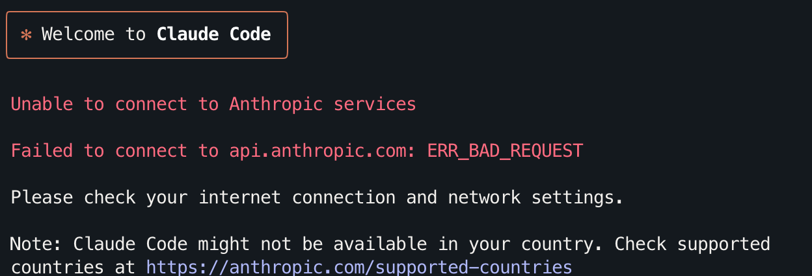

这里以 7890 端口代理为例，对应的终端代理命令为：
```bash
# 终端代理
export https_proxy=http://127.0.0.1:7890 http_proxy=http://127.0.0.1:7890 all_proxy=socks5://127.0.0.1:7890

# 连接服务
claude
```

## 初始配置

### 文本主题

使用键盘的上下按钮（或者`j` `k`）进行移动，根据预览（preview）来选择你喜欢的主题，确认后按回车。

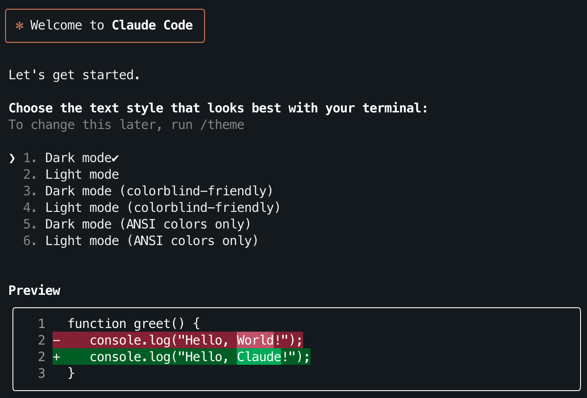

我个人更倾向于第3个：
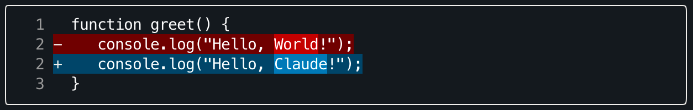

### 登录

有账号的话选择第一个即可，基于 API 用量的话成本会高不少：
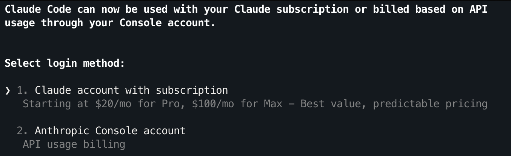

回车后会打开浏览器跳转界面，如果服务器无法跳转可以复制终端的网址打开：

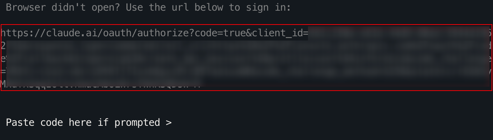

然后登录你的账号：


注意，没有订阅计划的情况下无法继续访问：

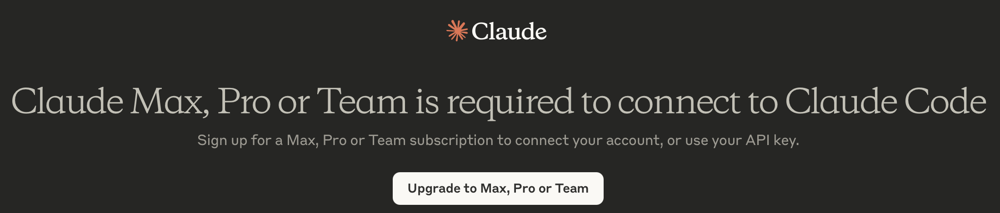

Claude 有三种月订阅计划：Pro / Max 5x / Max 20x，分别对应于 17 / 100 / 200 美元：

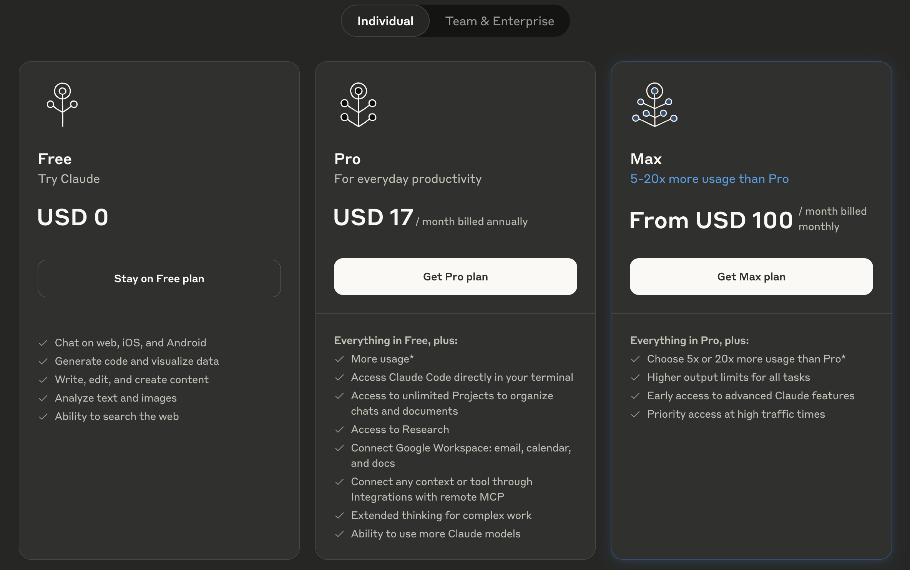

对于学生和学术研究项目，开 Pro 一般已经够用了。

另外，Pro 和 Max 的区别除了 API 额度以外，还有模型上的区别：Pro 的 Claude Code 无法使用 Opus 模型（网页对话可以），但 Sonnet 已经很优秀了，所以没有必要为了 Opus 硬上 Max。

Max 的定价很“狡猾”，在用量上来说，Max 5x 只是 5 倍的 Pro，但现在 Pro 的定价从 20 降到了 17，让 Max 5x 的100 美元定价很尴尬，而看起来很划算的 "Save 50%" 却需要 200 美元：

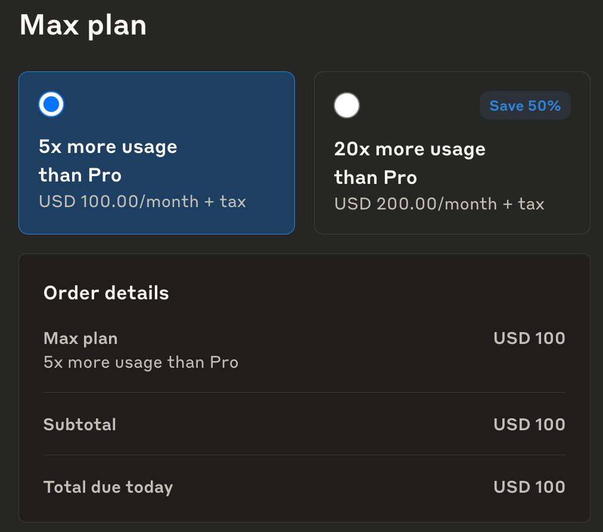

> [!note]
>
> 如果使用 IOS 进行订阅，则需要多付出 25% 的价格（因为苹果收取额外的资费）。Max 5x 和 Max 20x 分别需要 125 和 250 美元，但这一方案不需要担心因为付费导致的封号，如果只是开 Pro 还是很划算的。
>
> **订阅流程分享**
>
> 1. **创建美区 Apple ID** 
>
>    访问 [Apple 账号页面](https://account.apple.com/account#) 创建一个地区在美国的账号，然后在苹果设备的 App Store 中登录，下载 Claude。
>
> 2. **购买充值卡** 
>
>    打开支付宝，搜索「PocketShop」小程序，选择「App Store & iTunes US」，输入计划对应的充值金额后点击「立即购买」。
>
> 3. **兑换充值卡** 
>
>    在「订单」中复制对应的「礼品卡号码」，返回 App Store，点击右上角头像 → 兑换充值卡或代码 → 手动输入代码，粘贴礼品卡号码并完成兑换。
>
> 4. **完成订阅** 
>
>    打开 Claude 后选择计划进行订阅。
>
> **小提示**：此方法适用于所有支持移动端订阅的应用 :)

订阅后点击 `Authorize` 进行授权：


复制界面上的 Code：

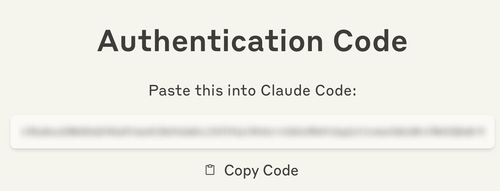

粘贴到命令行中并回车：


弹出登录提示后回车：


接着过几个默认设置和信赖，依旧是按 `回车` 继续。下面的设置是让 `Shift+Enter` 在终端换行，算是一个很常用的快捷键，所以这里保持默认：
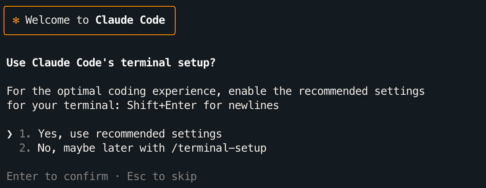

如果在可信项目中使用，选择 `Yes`：

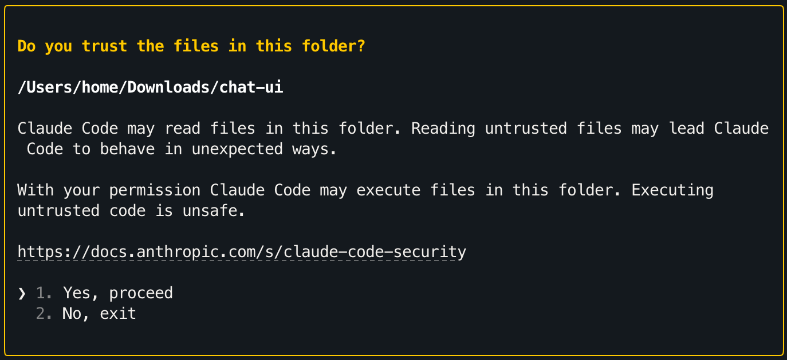

至此，安装和登录流程已经结束：
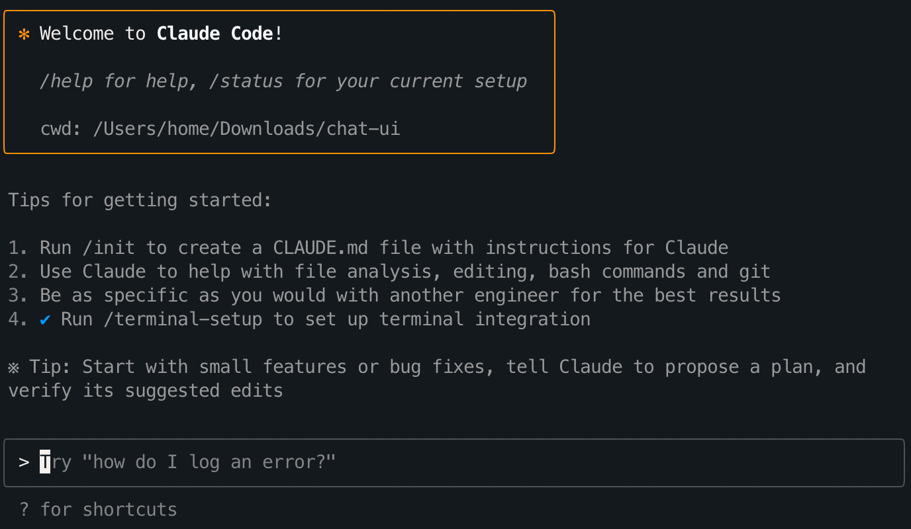

## 进阶配置

### 优化体验

使用 `/terminal-setup` 进行 `Shift+Enter` 的终端换行配置：

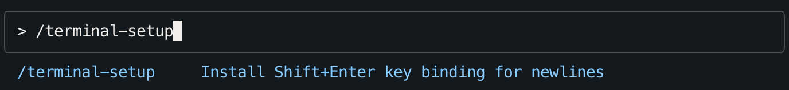

虽然刚刚已经确认了默认设置，但执行一下总不会有错。

### 查看默认配置

先查看默认配置是一个好习惯，终端执行：

```bash
claude config list --global
```

可以看到 `theme` 配置、`ShiftEnterKeyBinding` 的安装情况以及其他状态：

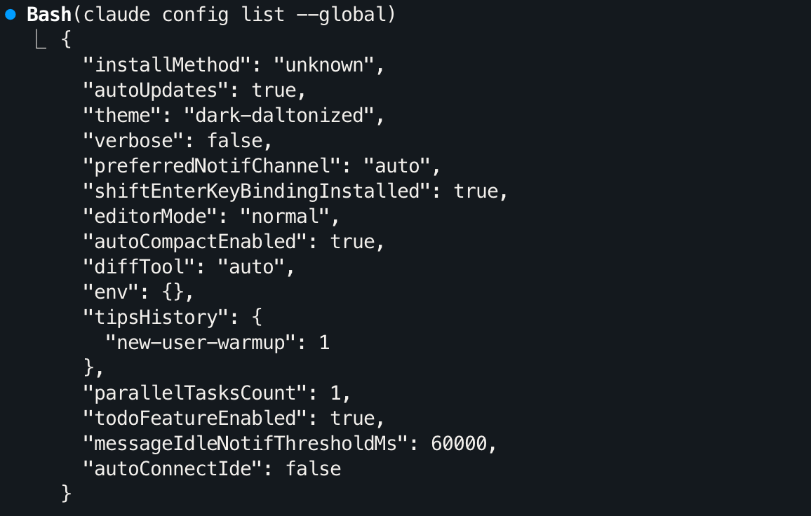

如果想修改，可以简单使用：

```bash
/config
```

通过 ↑/↓ 选择，回车/Tab/空格都可以切换对应项，Esc 保存并退出：

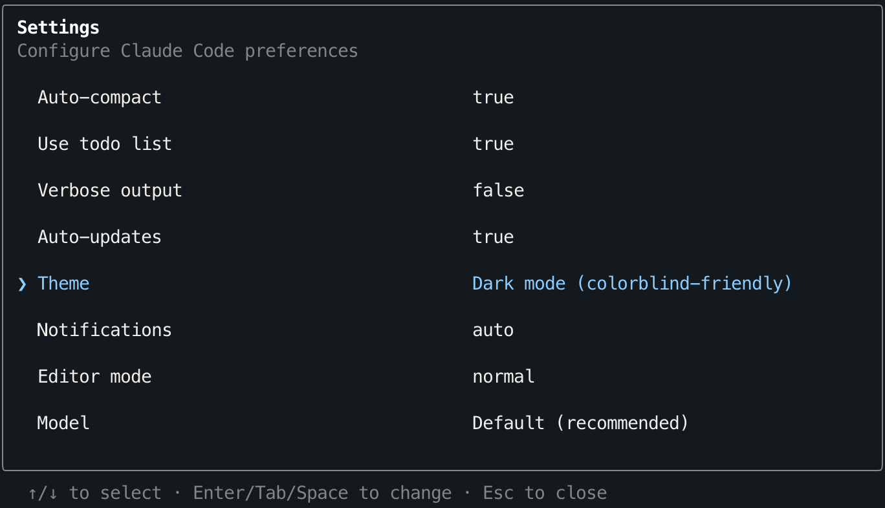

如果你是一个 Vim 爱好者，可以修改 `Editor mode` 为 `vim`：


### 任务完成通知（Mac iTerm 2）

也可以在命令行修改配置，假如你想要在任务完成的时候启用通知，使用以下命令：
```bash
claude config set --global preferredNotifChannel terminal_bell
```

此时配置中 `preferredNotifChannel` 的值将变为 `terminal_bell`，可以通过 `claude config list --global` 进行核验。这等价于之前使用 `/config` 手动进行切换，所以，如果想退回默认设置，使用 `/config` 或以下命令：

```bash
claude config set --global preferredNotifChannel auto
```

注意，该通知功能目前仅适用于 Mac iTerm 2。

### 命令参考

[官方文档](https://docs.anthropic.com/zh-CN/docs/claude-code/quickstart#%E5%9F%BA%E6%9C%AC%E5%91%BD%E4%BB%A4)中列出了最常用的基本命令：

| 命令                 | 功能                     | 示例                                |
| -------------------- | ------------------------ | ----------------------------------- |
| `claude`             | 启动交互模式             | `claude`                            |
| `claude "task"`      | 运行一次性任务           | `claude "fix the build error"`      |
| `claude -p "query"`  | 运行一次性查询，然后退出 | `claude -p "explain this function"` |
| `claude -c`          | 继续最近的对话           | `claude -c`                         |
| `claude -r`          | 恢复之前的对话           | `claude -r`                         |
| `claude commit`      | 创建 Git 提交            | `claude commit`                     |
| `/clear`             | 清除对话历史             | `> /clear`                          |
| `/help`              | 显示可用命令             | `> /help`                           |
| `exit` 或 `Ctrl + C` | 退出 Claude Code         | `> exit`                            |

准备出更详细的说明时，发现官方文档的中文支持做的很好，所以这里简单列出一些链接，可以按需查阅：

- [交互模式](https://docs.anthropic.com/zh-CN/docs/claude-code/interactive-mode) - 快捷键、输入模式和交互功能，包括 vim 模式下可用的命令。
- [斜杠命令](https://docs.anthropic.com/zh-CN/docs/claude-code/slash-commands) - 交互会话命令，这里还会指导如何进行自定义。
- [CLI 参考](https://docs.anthropic.com/zh-CN/docs/claude-code/cli-reference) - 更多命令和参数的参考。
- [常见工作流程](https://docs.anthropic.com/zh-CN/docs/claude-code/common-workflows)

## 命令使用

交互模式可以看作开了个窗口聊天，而非交互模式则是执行单次任务后立即退出，类似于一次性的 API 调用，所以这里仅介绍交互模式下的使用。

交互模式下内部命令以 `/` 斜杆开头，可以得到更好的UI体验。

### 模型选择（/model）

使用 `/model` 了解并选择你的模型：
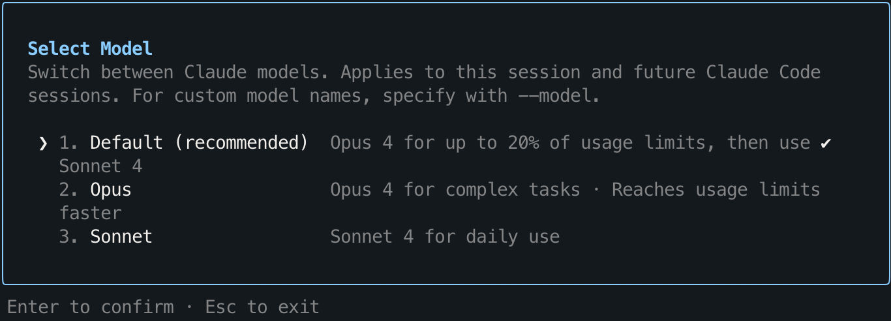

Max 计划默认使用 Opus，当会话（Session）的用量只剩 20% 时自动切换为 Sonnet。

> 继续讲解之前需要了解官方对于会话的定义[^2]：
>
> *A "session" starts with your first message to Claude and lasts for 5 hours. Any messages you send within that 5-hour window count as part of the same session, not as separate sessions. If you send one message now and come back 4 hours later to continue the conversation (in the same chat or a different one), that's still just one session.*
>
> 会话从发送第一条消息开始，持续 5 小时。在这 5 小时窗口内发送的所有消息都算作同一个会话的一部分。如果我们现在发送一条消息，4 小时后回来继续对话（在同一个聊天或不同聊天中），也只算一个会话。
>
> *The session counter only resets after the 5-hour period from when your first message began. When you start a new conversation after that 5-hour window, that begins a new session.*
>
> 简单来说就是每五个小时算一次会话，对应的用量限制也会随之重置。如果你之前有在网页上达到过用量限制，应该会注意到 Claude 会让我们在几个小时之后再次进行对话。
>
> *Please note that if you exceed 50 sessions per month, we may limit your access to Claude. The 50 sessions guideline is not a strict cut-off – rather, it's a flexible benchmark that allows us to limit excessive usage case-by-case and only when necessary, to ensure fair access for all Max subscribers. Most users won't approach this limit – 50 sessions equals up to 250 hours of usage monthly – and we will provide a warning if you have a limited number of sessions remaining.*
>
> 需要知道会话定义的另一个原因是因为官方对于会话总量进行了模糊的限制，一般而言每个用户的上限为 50 次，也就是 50*5=250 小时的会话窗口。当然，正常使用不太需要在意这一点。

### 初始化（/init）

官方对该命令的定义是：设置一个 CLAUDE.md 文件来存储重要的项目信息、约定和常用命令。

#### 什么是 CLAUDE.md？

其实就是记忆（memory），或者说项目指导，使用 `/memory` 可以察觉到这一点：

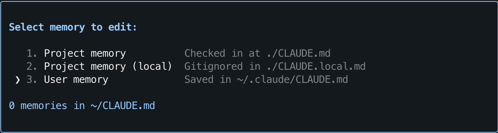

使用 `/init` 后，Claude 将会分析当前的代码库并创建 `CLAUDE.md` 文件。在生成规则后会弹出提示：


如果选择了 Yes，那么会确定创建，并打印用量和具体内容：

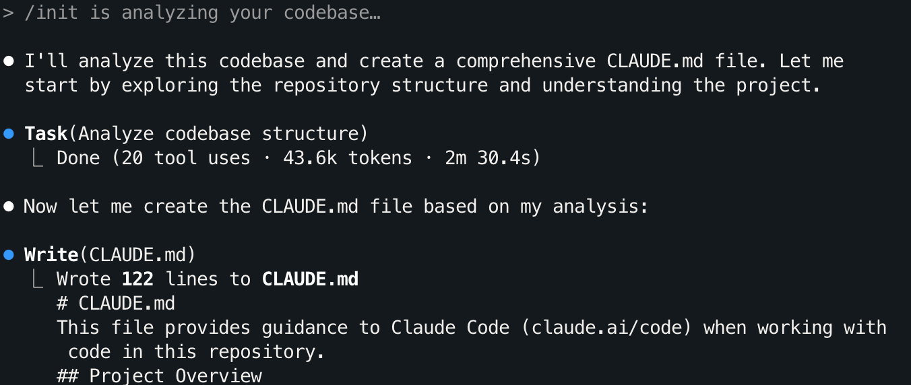

如果觉得不好，可以选择 3 或者使用 Esc 快捷选择：


然后再叙述你对项目的见解，Claude 会重新进行规划。

简单举个例子：

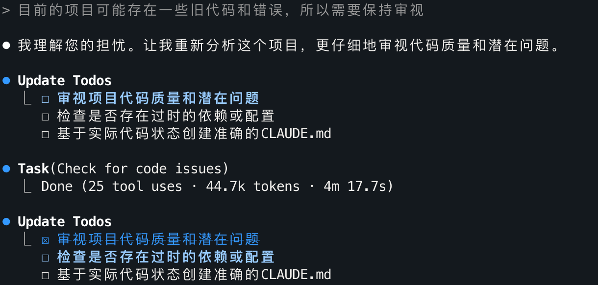

题外话：可以看到 Claude 创建了一个 Todos（这个功能目前 Cursor 已经跟进），并创建对应的 Task 去完成。

### 继续过去的对话

Claude 提供了两种方式：

- `claude --continue/-c`：继续最近的对话。

- `claude --resume/-r`：选择对话，按回车继续，会加载之前的聊天记录。

  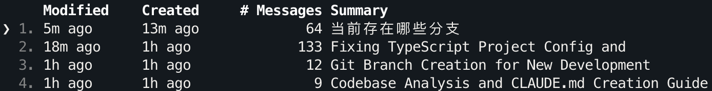

## 小技巧

### 采用思考模式

> *We recommend using the word "think" to trigger extended thinking mode, which gives Claude additional computation time to evaluate alternatives more thoroughly. These specific phrases are mapped directly to increasing levels of thinking budget in the system: "think" < "think hard" < "think harder" < "ultrathink." Each level allocates progressively more thinking budget for Claude to use.*[^3]
>
> 我们建议使用 "think" 一词来触发扩展思考模式，这会给 Claude 额外的计算时间来更彻底地评估替代方案。这些特定短语直接映射到系统中不断增加的思考预算级别："think" < "think hard" < "think harder" < "ultrathink"。每个级别都为 Claude 分配了逐步增加的思考预算。

Claude Code 不会自觉思考，需要在 Prompt 中加上 `think` 关键词。官方指出 Claude 存在四个思考档位："think" < "think hard" < "think harder" < "ultrathink"，初见一个项目的时候不妨使用 `ultrathink` 来获得更全面的见解。

我的使用方式是在开头直接添加 (ultrathink) 然后接 Prompt：

```bash
(ultrathink){Prompt}
```

### 快捷键

总是左右来移动光标进行编辑实在是太慢了，这里贴一些我的常用终端快捷键（非 Vim 模式）：

| 类别         | 快捷键          | 功能说明                                                     |
| ------------ | --------------- | ------------------------------------------------------------ |
| **光标移动** | `Ctrl + A`      | 移动到行首                                                   |
|              | `Ctrl + E`      | 移动到行尾                                                   |
|              | `Shift + Enter` | 换行（需要执行 `/terminal-setup`，不同终端的设置可能不同）   |
| **删除操作** | `Ctrl + U`      | 删除从光标到行首的所有字符（可以和 `Ctrl + E` 组合）         |
|              | `Ctrl + K`      | 删除从光标到行尾的所有字符（可以和 `Ctrl + A` 组合）         |
|              | `Ctrl + W`      | 删除光标前的一个单词                                         |
|              | `Ctrl + D`      | 删除光标所在字符                                             |
|              | `Ctrl + H`      | 删除光标前一个字符（等同于 `backspace`，即退格键）           |
| **模式切换** | `Shift + tab`   | 从三种模式进行切换：<br />- `normal-mode`：普通模式（询问是否应用修改）<br />- `auto-accept edits`：自动接受所有编辑<br />- `plan`：做计划（询问是否应用）<br / |
| **历史记录** | `上/下箭头`     | 导航命令历史                                                 |
|              | `Esc` x 2       | 编辑之前的消息（该行为不会回退修改，建议结合 Git 使用）      |
| **停止执行** | `Esc`           | 停止执行（建议）                                             |
|              | `Ctrl + D` x 2  | 退出 Claude                                                  |
|              | `Ctrl + C` x 2  | 退出 Claude                                                  |

> [!note]
>
> 1. **编辑之前的消息并善用 Git**
>
>    连续按两次 `Esc` 可以编辑最近的聊天消息，但需要注意这受终端显示限制的影响。如果某次响应输出内容过多，会无法索引到更早的消息，出现历史记录"截断"的情况。
>
>    在完成一次经过测试的正确修改后，可以让 Claude commit 这次更新。**结合 Git 使用的 Claude Code 体验才能真正超越 Cursor**，毕竟在无法回滚代码的情况下让 Claude 修改文件无异于脱缰野马。
>
>    如果觉得完整的 Git 工作流过于繁杂，可以从简单的手动"存档"开始。假设你开了两个终端，一个运行 Claude Code，另一个负责版本管理：
>
>    ```bash
>    # 感觉这次的代码写得不错，先存档
>    git add .
>    git commit -m "tmp"
>                         
>    # 让 Claude 继续优化
>    # ...Claude 开始大刀阔斧地改造...
>                         
>    # 改的乱七八糟，回滚
>    git reset --hard HEAD  # 重置已跟踪文件
>    git clean -fd          # 删除未跟踪文件和目录（可选）
>    ```
>    
>    注意，使用之前需要真正理解命令实际做了什么。
>
>
> 2. **停止最好使用 `Esc`**
>
>    `Ctrl + C` 本身也可以停止执行，但在界面响应不及时的情况下多次按下会退出 Claude，建议仅使用 `Esc` 安全停止。
>    
>    因为在退出后，即便使用 `claude -c` 连接刚刚的会话，AI 也需要重新读取之前的文件。

## QA

### 如何关闭 Claude Code Commit 消息中的 Co-Authored-By

使用`claude commit`润色消息的时候会默认增加协作信息：


当前版本还无法使用命令 `claude config add includeCoAuthoredBy false` 关闭，这和官方文档的叙述有所冲突，需要手动修改 settings.json 文件[^4]。

假设需要修改当前项目中的设置：

```bash
vim .claude/settings.json
```

粘贴以下内容并使用`Esc`+`:wq`保存（也可以使用文本编辑器）：

```json
{
  "includeCoAuthoredBy": false
}
```

### Bug：invalid_request_error

如果遇到以下错误：

```yaml
API Error: 400 {"type":"error","error":{"type":"invalid_request_error","me
    ssage":"messages.75: `tool_use` ids were found without `tool_result`
    blocks immediately after: toolu_01X6NRLdkXeZeMJNHRVnrmXd. Each `tool_use`
    block must have a corresponding `tool_result` block in the next
    message."}}
```

使用 `/model` 切换为 `default`，或者退出重新启动 Claude。

[^2]: [How are “sessions” defined? ](https://support.anthropic.com/en/articles/11014257-about-claude-s-max-plan-usage#h_58b484f913)

[^3]: [Claude Code: Best practices for agentic coding](https://www.anthropic.com/engineering/claude-code-best-practices)
[^4]: [[FEATURE REQUEST] Allow disabling Claude attribution in git commit messages #617 ](https://github.com/anthropics/claude-code/issues/617#issuecomment-2918193677) 

除了参考链接外，我还发现了一个优秀的网站：[Claude Log](https://claudelog.com)，这里有一些对于 Claude Code 的独特见解，感兴趣的同学可以查看。