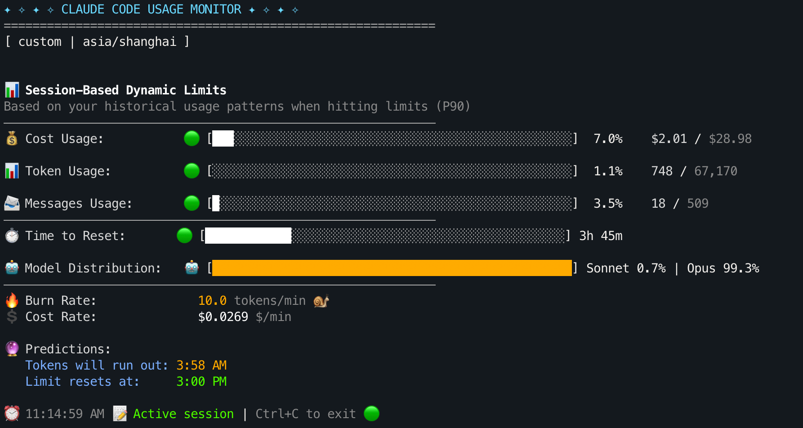
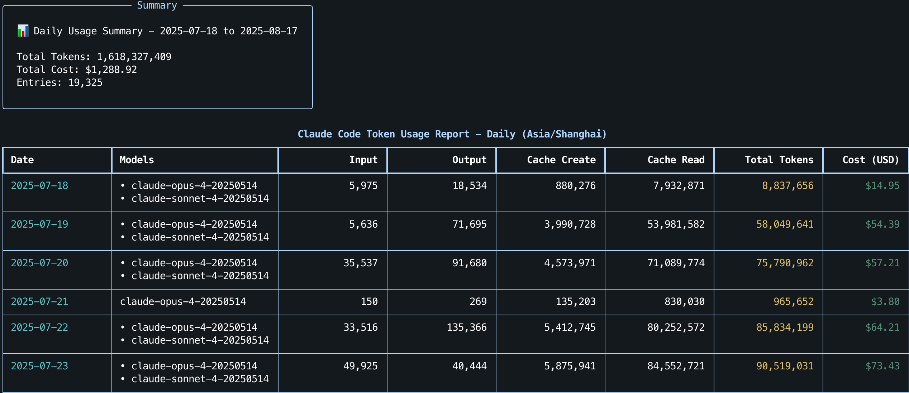
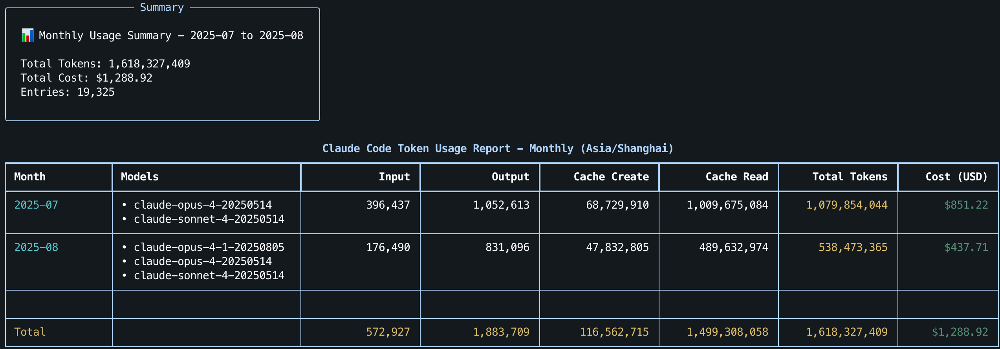
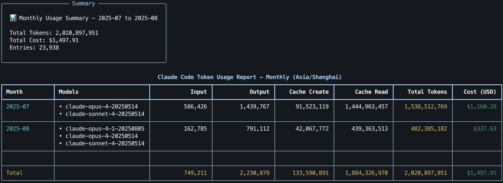
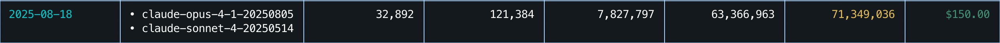

# Claude Code 必备的用量监控工具：claude-monitor 实践指南

> 在使用 Claude Code 时，我经常会冒出一些困惑：“当前会话到底还剩多少 token 用量？最初的问题是几点问的？什么时候这次会话才会重置？”。这让我在模型的使用上“束手束脚”，因为不得不考虑：“如果现在切换模型为 Opus，是否可能导致之后几个小时无法使用 Claude？”
>
> 不夸张地说，claude-monitor 完全解决了我对用量的困惑，因此有了这一篇分享文章。
>
> 先了解实际功能，claude-monitor 提供了：
>
> - 几乎实时的 token 用量显示
> - 会话窗口实际开始时间和重置时间
> - 当前会话窗口下的平均 token 消耗速率与预计耗尽时间
> - 按天/月汇总的用量表格（包括 API 成本的计算）
>
> **项目信息**：
>
> - GitHub：[Maciek-roboblog/Claude-Code-Usage-Monitor](https://github.com/Maciek-roboblog/Claude-Code-Usage-Monitor)
> - PyPI：[claude-monitor](https://pypi.org/project/claude-monitor/)
> - 许可：MIT License
>
> **相关文章**：[Claude Code 使用指南：安装与进阶技巧](./Claude%20Code%20使用指南：安装与进阶技巧.md)
>

## 目录

- [快速开始](#快速开始)
   - [uv（推荐）](#uv推荐)
   - [pip](#pip)
   - [常用命令速查](#常用命令速查)
      - [官方参数表](#官方参数表)
- [使用演示](#使用演示)
   - [实时监控](#实时监控)
   - [计划（--plan）](#计划--plan)
   - [视图（--view）](#视图--view)
      - [查看最近 30 天的用量](#查看最近-30-天的用量)
      - [查看每月用量](#查看每月用量)
- [使用体验分享](#使用体验分享)
- [拓展：工具背后的代码逻辑](#拓展工具背后的代码逻辑)

## 快速开始

复制以下任一命令到终端运行：

### uv（推荐）

- Linux / macOS：

  ```bash
  # 安装 uv（如果还没安装）
  curl -LsSf https://astral.sh/uv/install.sh | sh
  
  # 安装并运行
  uv tool install claude-monitor
  claude-monitor  # 可用别名：claude-code-monitor, cmonitor, ccmonitor, ccm
  ```
  
- Windows（PowerShell）：

  ```bash
  # 安装 uv（如果还没安装）
  powershell -ExecutionPolicy ByPass -c "irm https://astral.sh/uv/install.ps1 | iex"
  
  # 安装并运行
  uv tool install claude-monitor
  claude-monitor
  ```

### pip

```bash
pip install claude-monitor

# 检查是否在 PATH 中
which claude-monitor

# 查看目前的 Shell：
echo $SHELL

# 根据输出执行以下命令（如果终端不是 bash 和 zsh 的话，需要对应修改配置文件地址）
# bash：
echo 'export PATH="$HOME/.local/bin:$PATH"' >> ~/.bashrc
source ~/.bashrc
# zsh：
# echo 'export PATH="$HOME/.local/bin:$PATH"' >> ~/.zshrc
# source ~/.zshrc

# 运行
claude-monitor  # 可用别名：claude-code-monitor, cmonitor, ccmonitor, ccm
```

> [!note]
>
> 1. 如果在 Ubuntu 23.04+ 上遇到了 "externally-managed-environment" 错误，使用 `uv` 是最好的解决方法（官方强烈不建议使用 `--break-system-packages` 进行安装）。
> 2. 首次运行可能会看到 “No Claude data directory found”，需要在 Claude Code 中发送一条消息开启会话。

### 常用命令速查

```bash
# 一键启动（默认：custom 计划 + 实时视图）
claude-monitor

# 视图设置
claude-monitor --view realtime  # 可选值：realtime / daily / monthly

# 计划设置
claude-monitor --plan pro  # 可选值：pro / max5 / max20 / custom

# 主题设置
claude-monitor --theme dark  # 可选值：light / dark / classic / auto

# 时区设置
claude-monitor --timezone Asia/Shanghai

# 时间格式设置
claude-monitor --time-format 24h  # 可选值：12h / 24h

# 刷新设置
claude-monitor --refresh-rate 5
claude-monitor --refresh-per-second 1.0

# 配置管理与版本
claude-monitor --clear
claude-monitor --version
```

#### 官方参数表

| 参数                    | 默认值   | 说明                                                       |
| ----------------------- | -------- | ---------------------------------------------------------- |
| `--plan`                | custom   | 订阅计划：pro/max5/max20/custom                            |
| `--custom-limit-tokens` | None | `custom` 计划的 token 限额（不提供时基于 P90 自动估算）     |
| `--view`                | realtime | 显示模式：realtime/daily/monthly                           |
| `--timezone`            | auto     | 时区设置（自动检测系统时区）                               |
| `--time-format`         | auto     | 时间格式：12h/24h/auto                                     |
| `--theme`               | auto     | 界面主题：light/dark/classic/auto                          |
| `--refresh-rate`        | 10       | 数据更新间隔（1–60 秒）                                   |
| `--refresh-per-second`  | 0.75     | 界面刷新频率（0.1–20 Hz）                                 |
| `--reset-hour`          | None     | 每日重置时间（0–23 时，当前版本仅保存配置，未参与限额计算）|
| `--log-level`           | INFO     | 日志级别：DEBUG/INFO/WARNING/ERROR/CRITICAL                |
| `--log-file`            | None     | 将日志输出到指定文件路径                                   |
| `--debug`               | False    | 启用调试模式（等价于 --log-level DEBUG）                   |
| `--version`             | False    | 显示版本并退出                                             |
| `--clear`               | False    | 清除保存的配置                                             |


> [!note]
>
> 当我们指定了参数后，最近一次的配置会自动保存到 `~/.claude-monitor/last_used.json`，下一次使用 `claude-monitor` 如果不带参数，就会默认加载最近的配置，如果想查看或者清空，使用以下命令：
>
> ```bash
> # 查看保存的配置
> cat ~/.claude-monitor/last_used.json
> 
> # 清除配置重新开始
> claude-monitor --clear
> ```
>
> 注意：`--plan` 不会被自动保存，每次需要主动指定，默认为 `custom`。


## 使用演示

### 实时监控

第一次直接执行 claude-monitor 实际等价于使用以下参数配置：

```bash
claude-monitor --plan custom --view realtime --refresh-rate 10 
```

界面如下：



你可以从中了解到 Claude Code 当前的用量，比如：

- 💰 Cost Usage：当前会话窗口内累计成本，包含输入/输出/缓存读写的计费，其中图标：< 50%🟢，50–80%🟡，≥ 80%🔴。
  - 对于 max 计划的订阅者，可以在重置时间前使用 Opus 安排大请求/重构快速消耗剩余的用量。

- 📊 Token Usage：当前会话窗口内累计 token（input + output），与计划限额对比上色。
- 📨 Messages Usage：当前活跃会话的已发送消息数（用于参考）。
- ⏱️ Time to Reset：距离当前活跃会话窗口结束的剩余时间（基于“所属小时整点 + 5 小时”的滚动窗口，下方时间戳显示受 `--timezone` 与 `--time-format` 影响）。
- 🤖 Model Distribution：本窗口内按模型统计的 token 占比（input + output）。
- 🔥 Burn Rate：最近 1 小时会话 token 的平均消耗速率（越高代表消耗越快），单位 tokens/min。
- 💲 Cost Rate：按当前会话的平均速率估算的成本速度，单位 \$/min。
- 🔮 Predictions：
  - Tokens will run out：基于“成本速率（\$/min）与会话成本上限”预测会话用量耗尽时间。
  - Limit resets at：当前会话的结束时间，也是会话窗口重置时间。
    - 注意，会话窗口按首条消息所在小时的整点对齐，持续 5 小时（例如：10:30 发出首条消息，则该窗口为 10:00–15:00），期间消息归入同一窗口，仅在当前会话结束后才新开会话窗口。


> [!important]
>
> 面板无法监控 Claude 网页版的用量，因为它通过读取本地 Claude Code 的数据目录进行统计与计算。

### 计划（--plan）

plan 有四个可选值：`pro / max5 / max20 / custom`。这些选项仅用于确定界面中的“配额阈值”（Token / Cost / Message 限额）及进度条/预测的参考上限，**不会改变 Claude Code 的实际限额**。

- 标准计划（`pro` / `max5` / `max20`）
  - 目前的内置值：
    - Token limit：19,000 / 88,000 / 220,000
    - Cost limit：\$18.00 / \$35.00 / \$140.00

- 自定义计划（`custom`）
  - 指定 `--custom-limit-tokens`：直接使用该值作为会话窗口限额，并写入 `~/.claude-monitor/last_used.json` 以便下次无参启动时复用。
  - 未指定 `--custom-limit-tokens`：分析最近 8 天（192 小时）的历史（P90）自动估算。
    - 若分析异常（无法加载数据），回退到默认 19,000。
    - 若能加载数据但无法计算出 P90，上限回退为内置 custom 值 44,000。


```bash
# 假设订阅计划为 max5
claude-monitor --plan max5  # 可选值：pro / max5 / max20 / custom
```

监控面板左上角会标识当前指定的计划和时区（`[ max5 | asia/shanghai ]`）：

![左上角：[计划 | 时区]](./assets/image-20250817163500731.png)

> [!note]
>
> - 如果显式传入 `--plan custom` 但没有指定 `--custom-limit-tokens`，则会忽略之前保存的 `custom_limit_tokens`（不会沿用历史值）。
>
> - 不传 `--plan` 时，如果之前保存过 `custom_limit_tokens`，就会被复用。
>
>   源代码逻辑（`core/settings.py`）：
>
>   ```python
>   # 将上次使用的参数写回当前 Settings（除 plan 外），若该字段已通过 CLI 显式提供，则不回填
>   for key, value in last_params.items():
>       if key == "plan":
>           continue
>       if not hasattr(settings, key):
>           continue
>       if key not in cli_provided_fields:
>           setattr(settings, key, value)
>               
>   # 若本次显式指定了 plan=custom 且未提供 custom_limit_tokens，则清空历史自定义限额，强制走 P90 估算或回退默认值
>   if (
>       "plan" in cli_provided_fields
>       and settings.plan == "custom"
>       and "custom_limit_tokens" not in cli_provided_fields
>   ):
>       settings.custom_limit_tokens = None
>   ```

### 视图（--view）

除了实时监控之外，还可以查看过去的使用记录。

#### 查看最近 30 天的用量

```bash
# 按日统计
claude-monitor --view daily
```

下面是我在 2025-07-18 到 2025-08-17 的用量面板：



> [!note]
>
> 因为 Claude Code 的后端只存储 30 天的会话记录[^1]，所以只能查看最近 30 天的用量。

[^1]: [Does Claude Code Store My Data](https://claudelog.com/faqs/does-claude-code-store-my-data/).

#### 查看每月用量

```bash
# 按月统计
claude-monitor --view monthly
```

按月分组展示：



顺便说一句，按月分组的功能同样受限于 30 天的范围，上图为 2025-08-17 截图的数据（2025-07-18 to 2025-08-17），下图为前几天 2025-08-14 截图的数据（2025-07-15 to 2025-08-14）。或许 claude-monitor 可以增加查询数据备份的特性，这样就不会丢失过去的记录。



## 使用体验分享

我的日常使用习惯（仅供参考）：

```bash
# 窗口 1：Claude Code
claude

# 窗口 2：Git（随时回滚）
git status

# 窗口 3：实时监控
claude-monitor --view realtime
```

一个会话窗口为 5 小时，按首条消息所在小时的整点对齐。如果从早上 9 点开始持续进行项目开发，那么接下来的会话窗口为：

- 9:00 → 14:00
- 14:00 → 19:00
- 19:00 → 24:00（00:00）
- 00:00 → 5:00

一天最极限的情况下，大概是前三个会话全部上限，12 点再开一个会话：此时模型固定用 Opus 快速消耗。

因为 7 月份的时候我还没有使用 claude-monitor，当时考虑到实际的项目推进，基本都采取了 Default 模式（前 20% 额度用 Opus，之后自动切换为 Sonnet）进行使用。从 9 点开始，不间断使用 3-4 个会话后，2025-07-26 到 2025-07-31 的用量如下图：


而现在有了 claude-monitor 后，就可以根据实际剩余额度计划接下来的模型使用，而非不知不觉地等到会话重置，浪费剩余的额度。得益于监控面板，我的实际用量有了大幅度的提升：



### 建议

- **提前激活会话窗口**：如果想尽可能“榨干” Claude Code 的用量，同时也给自己留出调整策略的缓冲，**强烈建议**每天在 9 点前先发送一条消息，激活当日第一个 5 小时会话窗口。纠结于“聊什么”的话可以简单使用命令：

  ```bash
  claude -p "Hello"
  ```
  
- **集中消耗剩余额度**：若接近当前 5 小时窗口结束（如剩余 30–60 分钟）仍有大量额度，可以开始批量推进任务（如跑测试、批量代码检查/重构、生成文档），快速用完当前额度。

- **降档控制消耗速率**：在窗口前中段消耗过快时切到 Sonnet，避免额度消耗过快导致无法接续开发。如果窗口最后 1 小时仍剩余 50% 以上的用量，可以切换模型为 Opus。

对于 Max 5x 计划，在实际开发工作中，每天 \$40–\$60 会是一个比较正常的规划。如果无法达到这样的用量或经费有限，建议开通 Pro。

## 拓展：工具背后的代码逻辑

> 下面是一些简单的整理，提到的文件都位于 [src/claude_monitor](https://github.com/Maciek-roboblog/Claude-Code-Usage-Monitor/blob/main/src/claude_monitor) 文件夹下，如果对背后的代码逻辑感兴趣可以跳转阅读。

- **CLI 参数与配置**：
  
  - 参数解析与默认值：`core/settings.py`
  - 日志/环境/时区初始化：`cli/bootstrap.py`
  - CLI 主入口与视图分发：`cli/main.py`
  
- **数据读取**：`data/reader.py`

  - 扫描数据目录：`~/.claude/projects` 与 `~/.config/claude/projects`（见 `cli/main.py` 的 `discover_claude_data_paths()`）
  - 读取 `.jsonl` 并解析为 `UsageEntry`，成本用 `PricingCalculator` 计算

- **token 提取**：`core/data_processors.py`

  ```python
  # 以下代码主要是为了兼容不同版本 JSON 的字段命名
  input_tokens = (
      source.get("input_tokens", 0)
      or source.get("inputTokens", 0)
      or source.get("prompt_tokens", 0)
      or 0
  )
  
  output_tokens = (
      source.get("output_tokens", 0)
      or source.get("outputTokens", 0)
      or source.get("completion_tokens", 0)
      or 0
  )
  
  cache_creation = (
      source.get("cache_creation_tokens", 0)
      or source.get("cache_creation_input_tokens", 0)
      or source.get("cacheCreationInputTokens", 0)
      or 0
  )
  
  cache_read = (
      source.get("cache_read_input_tokens", 0)
      or source.get("cache_read_tokens", 0)
      or source.get("cacheReadInputTokens", 0)
      or 0
  )
  ```
  
- **会话分块**：`data/analyzer.py`，将条目聚合成 5 小时窗口的会话块。

  ```python
  # 将任意时区时间戳归一化到 UTC 整点
  def _round_to_hour(self, timestamp: datetime) -> datetime:
      """Round timestamp to the nearest full hour in UTC."""
      if timestamp.tzinfo is None:
          timestamp = timestamp.replace(tzinfo=timezone.utc)
      elif timestamp.tzinfo != timezone.utc:
          timestamp = timestamp.astimezone(timezone.utc)
  
      return timestamp.replace(minute=0, second=0, microsecond=0)
  
  # 新建一个会话块：[start, end) 默认 5 小时，block_id 采用 ISO 字符串
  def _create_new_block(self, entry: UsageEntry) -> SessionBlock:
      """Create a new session block."""
      start_time = self._round_to_hour(entry.timestamp)
      end_time = start_time + self.session_duration
      block_id = start_time.isoformat()
  ```

- **进度条与配色**：`ui/progress_bars.py`

  - 以 token 进度条为例：

    ```python
    class TokenProgressBar(BaseProgressBar):
        """Token usage progress bar component."""
    
        # Color threshold constants
        # 百分比阈值：>=90% 红，>=50% 黄，否则为绿
        HIGH_USAGE_THRESHOLD: Final[float] = 90.0
        MEDIUM_USAGE_THRESHOLD: Final[float] = 50.0
        LOW_USAGE_THRESHOLD: Final[float] = 0.0
    
        # Style constants
        HIGH_USAGE_STYLE: Final[str] = "cost.high"
        MEDIUM_USAGE_STYLE: Final[str] = "cost.medium"
        LOW_USAGE_STYLE: Final[str] = "cost.low"
        BORDER_STYLE: Final[str] = "table.border"
    
        # Icon constants
        HIGH_USAGE_ICON: Final[str] = "🔴"
        MEDIUM_USAGE_ICON: Final[str] = "🟡"
        LOW_USAGE_ICON: Final[str] = "🟢"
        
        def render(self, percentage: float) -> str:
            """Render token usage progress bar.
    
            Args:
                percentage: Usage percentage (can be > 100)
    
            Returns:
                Formatted progress bar string
            """
            # 进度条视觉填充最多到 100%，文本百分比可超过 100%
            filled: int = self._calculate_filled_segments(min(percentage, 100.0))
    
            # 从高到低匹配阈值，选取对应的样式
            color_thresholds: list[tuple[float, str]] = [
                (self.HIGH_USAGE_THRESHOLD, self.HIGH_USAGE_STYLE),
                (self.MEDIUM_USAGE_THRESHOLD, self.MEDIUM_USAGE_STYLE),
                (self.LOW_USAGE_THRESHOLD, self.LOW_USAGE_STYLE),
            ]
    
            filled_style: str = self._get_color_style_by_threshold(
                percentage, color_thresholds
            )
            # 超过高阈值时，空白区使用中等样式以凸显“溢出风险”。
            bar: str = self._render_bar(
                filled,
                filled_style=filled_style,
                empty_style=self.BORDER_STYLE
                if percentage < self.HIGH_USAGE_THRESHOLD
                else self.MEDIUM_USAGE_STYLE,
            )
    
            # 图标选择与阈值保持一致。
            if percentage >= self.HIGH_USAGE_THRESHOLD:
                icon: str = self.HIGH_USAGE_ICON
            elif percentage >= self.MEDIUM_USAGE_THRESHOLD:
                icon = self.MEDIUM_USAGE_ICON
            else:
                icon = self.LOW_USAGE_ICON
    
            percentage_str: str = self._format_percentage(percentage)
            return f"{icon} [{bar}] {percentage_str}"
    ```
  
- **模型定价与成本计算**：`core/pricing.py`

  按输入/输出/缓存创建/缓存读取分别计价（单位：每百万 tokens），缓存读取 ≈ 输入价的 10%，缓存创建 ≈ 输入价的 1.25×。

  ```python
  # 内置价格表
  class PricingCalculator:
      FALLBACK_PRICING: Dict[str, Dict[str, float]] = {
          "opus": {
              "input": 15.0,
              "output": 75.0,
              "cache_creation": 18.75,
              "cache_read": 1.5,
          },
          "sonnet": {
              "input": 3.0,
              "output": 15.0,
              "cache_creation": 3.75,
              "cache_read": 0.3,
          },
          "haiku": {
              "input": 0.25,
              "output": 1.25,
              "cache_creation": 0.3,
              "cache_read": 0.03,
          },
      }
  ```

- **P90 算法实现**：`core/p90_calculator.py`

  ```python
  class P90Calculator:
      def __init__(self, config: Optional[P90Config] = None) -> None:
          if config is None:
              from claude_monitor.core.plans import (
                  COMMON_TOKEN_LIMITS,
                  DEFAULT_TOKEN_LIMIT,
                  LIMIT_DETECTION_THRESHOLD,
              )
  
              # 配置说明：
              # - common_limits：常见上限候选（如 19k/88k/220k）
              # - limit_threshold：过限判定阈值
              # - default_min_limit：兜底最小上限
              # - cache_ttl_seconds：缓存有效期（按时间片缓存）
              config = P90Config(
                  common_limits=COMMON_TOKEN_LIMITS,
                  limit_threshold=LIMIT_DETECTION_THRESHOLD,
                  default_min_limit=DEFAULT_TOKEN_LIMIT,
                  cache_ttl_seconds=60 * 60,
              )
          self._cfg: P90Config = config
          
      @lru_cache(maxsize=1)
      def _cached_calc(
          self, key: int, blocks_tuple: Tuple[Tuple[bool, bool, int], ...]
      ) -> int:
          blocks: List[Dict[str, Any]] = [
              {"isGap": g, "isActive": a, "totalTokens": t} for g, a, t in blocks_tuple
          ]
          return _calculate_p90_from_blocks(blocks, self._cfg)
  
      def calculate_p90_limit(
          self,
          blocks: Optional[List[Dict[str, Any]]] = None,
          use_cache: bool = True,
      ) -> Optional[int]:
          if not blocks:
              return None
          if not use_cache:
              return _calculate_p90_from_blocks(blocks, self._cfg)
          ttl: int = self._cfg.cache_ttl_seconds
          expire_key: int = int(time.time() // ttl)
          # 使用 TTL 片区键 + 标准化 blocks 内容 作为缓存 key。
          blocks_tuple: Tuple[Tuple[bool, bool, int], ...] = tuple(
              (
                  b.get("isGap", False),
                  b.get("isActive", False),
                  b.get("totalTokens", 0),
              )
              for b in blocks
          )
          return self._cached_calc(expire_key, blocks_tuple)
  ```
  
- **Burn Rate 计算**：`core/calculations.py`

  ```python
  # 汇总最近 1 小时的 token 消耗并换算为 tokens/min
  def calculate_hourly_burn_rate(
      blocks: List[Dict[str, Any]], current_time: datetime
  ) -> float:
      """Calculate burn rate based on all sessions in the last hour."""
      if not blocks:
          return 0.0
  
      one_hour_ago = current_time - timedelta(hours=1)
      total_tokens = _calculate_total_tokens_in_hour(blocks, one_hour_ago, current_time)
  
      return total_tokens / 60.0 if total_tokens > 0 else 0.0
  ```
  
- **表格与视图**：`ui/table_views.py`

- **显示控制与刷新**：`ui/display_controller.py`
