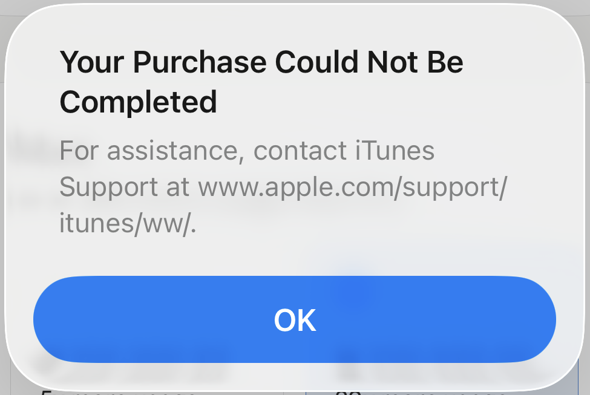
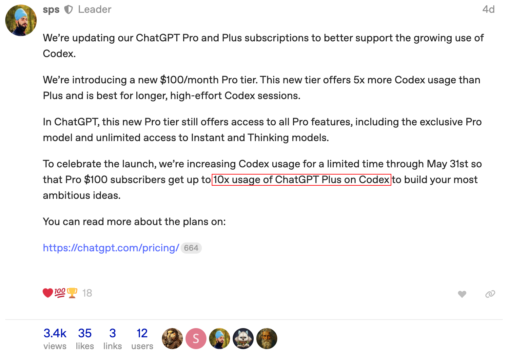
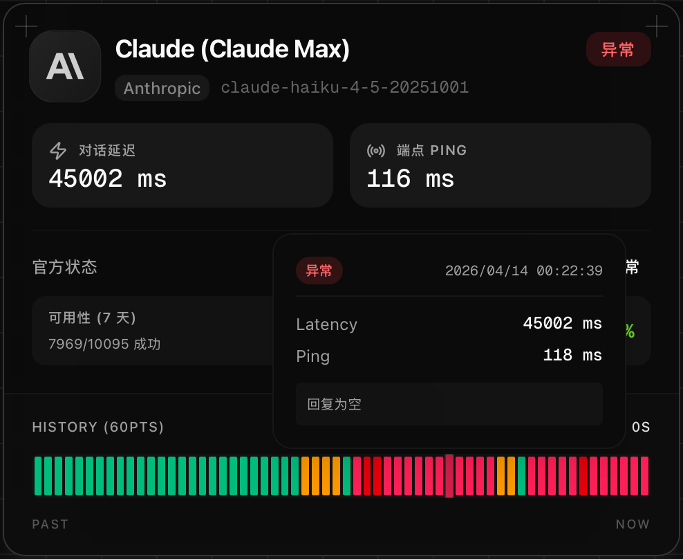
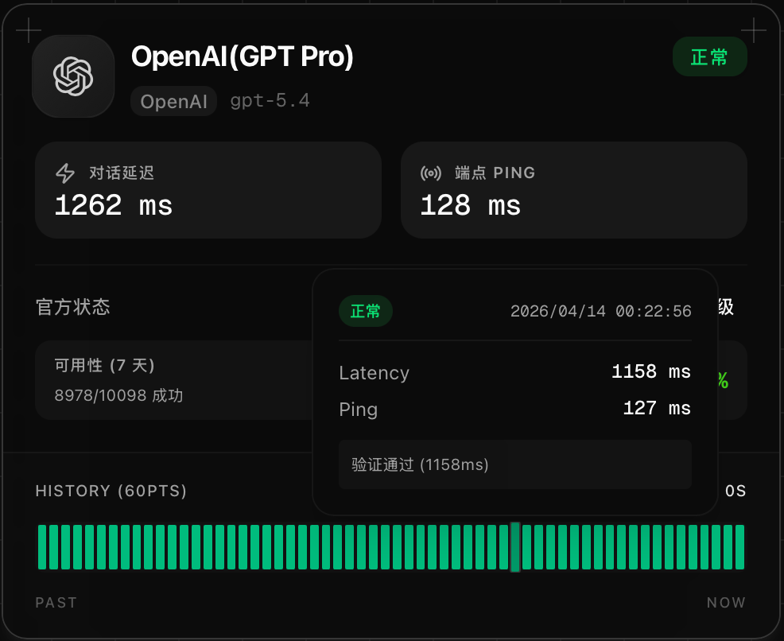
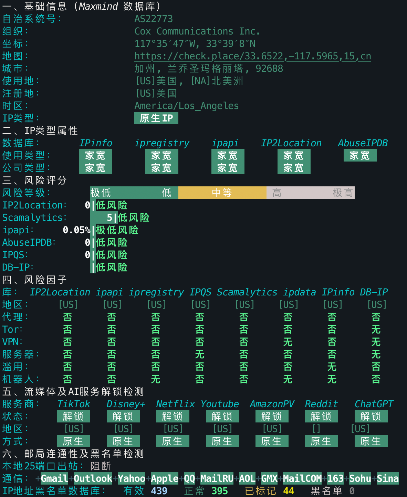

# Claude / GPT 订阅建议与反代避坑

> 半年来在 Claude 和 GPT 的 CLI 上累计消耗了约 20,000\$ 用量的 tokens（Claude : GPT = 1.6: 1）。这期间关于模型对比体验的文章断断续续其实写了不少，但 Agent 相关技术和概念迭代太快，新技术的学习、业务的跟进，再加上拖更（罪魁祸首），最后很多稿子都拖成了废稿。“痛定思痛”，赶在 GPT 下个版本前把这篇小分享补上。
>
> **最近一次更新时间**：2026-04-16，此时国外最新的模型参考组为：Opus 4.7｜GPT 5.4｜Gemini 3.1，主要针对 Opus 4.7 和 GPT 5.4 进行推荐。没想到 Opus 4.7 来的比 GPT 更快。

## 目录

- [订阅建议](#订阅建议)
  - [订阅流程分享（iOS）](#订阅流程分享ios)
    - [美区：花费 250$](#美区花费-250)
    - [尼日利亚区：花费 200000₦ ≈ 1005 RMB（实际开销约 1150 RMB）](#尼日利亚区花费-200000--1005-rmb实际开销约-1150-rmb)
- [关于模型配额](#关于模型配额)
- [关于中转站点（反代）](#关于中转站点反代)
  - [自部署](#自部署)

## 订阅建议

从 2025-12-18 发布的 GPT 5.2 Codex 开始，可以明显感受到 GPT 在智商、知识广度和新鲜度上强于当时的 Claude Opus 4.5，同样一次对 Supabase 的从零部署开发，Opus 4.5 需要反复撤销校正，而 GPT 5.2 Codex 可以做到 Plan 后直接达成预期。2026-02-05，Opus 4.6 发布后，这种体感一度有所改观，但在 2026-03-05 GPT 5.4 发布之后，GPT 又重新给了我这样的感觉。下表是我在实际体验后给出的订阅建议，可以根据自身实际情况参考，希望能够对你有所帮助：

| 使用场景 | 推荐 | 备注 |
| --- | --- | --- |
| 熟悉业务，能看懂代码，追求开发响应速度，热衷于 review 代码 | Claude | Claude Code 就是目前最好的 CLI 产品设计，没有之一。 在你熟悉的业务领域里，项目推进速度上：你 + Claude >> 你 + GPT |
| 熟悉业务，能看懂代码，经常在长上下文（>200k）的环境下工作 | Claude | 实际体验下来，Codex 在接近 200k 上下文后，指令遵循能力偶尔存在问题，需要反复确认（去年就已经存在） |
| 科研论文 & 比赛 | Claude | 预算 100\$ 及以上也可以选 GPT，GPT Pro 能够完美满足你的需求，但很可能存在用量浪费 |
| 最近一年比较新的开源项目/协议的使用和开发 | Claude | Opus 4.7 来了 |
| Vibe Coding，不太懂代码 | Claude | 同上 |
| 多人拼车/龙虾/Opencode/反代 | GPT | Claude 会封号 |
| 非代码场景，通用的知识学习，文章撰写 | GPT |  |
| 习惯图形界面而非命令行界面 | Claude | 即便 Codex 有 GUI，但在 Opus 4.7 面前，或许我们也可以选择 Claude Desktop |
| 预算有限（20\$）/ **新手** | 都可以 |  |
| 有生图的需求，或者需要 Google 的一些生态 | Gemini | Gemini 3.1 Pro 的上线扭转了我对它的印象，写视频脚本的能力也很不错。 但并没有使用 Gemini 完整测试开发过一个项目，所以不做更多的描述。 |

~~P.S. 如果后续新 GPT 推出，而 Claude 没有同步开放新模型，那么除了第一种和最后一种场景外，我会更推荐订阅 GPT。~~（Opus 4.7 抢先一步，代码层面 GPT 的优先级推后，除非你的预算在 100\$ 以上，GPT 5.4 Pro 的 Vibe 能力还是不错的）

顺带一提，个人今年完全不建议订阅 Cursor，除非你的用量不大。Cursor 已经越来越偏向按量计费，很多时候性价比甚至不如中转站。

> 国内各家的订阅如果有同学实际对比过，也欢迎提交 PR 进行补充（会有惊喜小礼品🎁～）

### 订阅流程分享（iOS）

~~聊点可以聊的 :)，~~ 以 Claude Max 20x 为例[^1]：

#### 美区：花费 250\$

> [!note]
>
> Claude 使用 iOS 订阅需要多付出 25% 的价格（因为苹果收取额外的资费）。Max 5x 和 Max 20x 分别需要 125 和 250 美元，但这一方案不需要担心因为付费导致的封号，如果只是开 Claude Pro 还是很划算的。

1. **创建美区 Apple ID** 

   访问 [Apple 账号页面](https://account.apple.com/account#) 创建一个地区在美国的账号，然后在苹果设备的 App Store 中登录，下载 Claude。

2. **购买充值卡** 

   访问 [https://shop.pockyt.io](https://shop.pockyt.io)，选择「App Store & iTunes US」，输入计划对应的充值金额后点击「立即购买」。

   - 注：「PockytShop」小程序目前已经无法在支付宝直接搜到。

3. **兑换充值卡** 

   在「订单」中复制对应的「礼品卡号码」，返回 App Store，点击右上角头像 → 兑换充值卡或代码 → 手动输入代码，粘贴礼品卡号码并完成兑换。

4. **完成订阅** 

   打开 Claude 后选择计划进行订阅。

#### 尼日利亚区：花费 200000₦ ≈ 1005 RMB（实际开销约 1150 RMB）

> [!note]
>
> 新的苹果账户 ID 付费大概率会遇到风控不允许支付：
>
> 
>
> 此时需要拨打 4006668800，说明自己有一个海外账户无法支付，请求处理，客服最终会让你等待 48 小时解除风控，会比较**麻烦**。
>
> 另外，如果购买 Claude，尼区是最划算的苹果订阅方式，但如果你有订阅 GPT 的需求，建议灵活选区，参考：[苹果商店全球价格比对](https://appstoreprice.org/zh/apps)。

1. **创建尼区 Apple ID** 

   访问 [Apple 账号页面](https://account.apple.com/account#) 创建一个地区在尼日利亚的账号，然后在苹果设备的 App Store 中登录，下载 Claude。

2. **购买充值卡** 

   闲鱼搜索“尼日利亚礼品卡”，购买对应面值。

   - 实际开销会大于汇率换算，大概花费在 1150 元左右，最好在信誉高 & 经营时间久的小铺进行购买，减少买到黑卡的可能，不然被风控后再创建一个 ID 有点折腾。
   - **注意**：请在充值余额前，确认当下价格是否有变化，过去尼区 GPT 订阅同样是最便宜的，Plus 只需要 50 元，但在去年，GPT 调整了尼日利亚区的价格，目前 Plus（158.89元）比美元（136.86元）直接购买还贵。
   
3. **兑换充值卡** 

   在「订单」中复制对应的「礼品卡号码」，返回 App Store，点击右上角头像 → 兑换充值卡或代码 → 手动输入代码，粘贴礼品卡号码并完成兑换。

4. **完成订阅** 

   打开 Claude 后选择计划进行订阅。

[^1]: [Claude Code 使用指南：安装与进阶技巧](./Claude%20Code%20使用指南：安装与进阶技巧.md)

## 关于模型配额

2026-04-10，GPT 同样推出了 100\$ 档的订阅服务。和 Claude Max 5x 一样，官方声明它在 Codex 上的用量为 Plus（20\$）的 5 倍，不过在 2026-05-31 前，这个倍率会临时翻到 10 倍：

**Q：目前 Claude Max 20x 和 GPT Pro 200\$ 的计划每周（7d）大概能用多少刀？**

保守测算下来，Claude 在 1000\$ 以上，GPT 在 1500\$ 以上。如果开发量足够大，订阅的收益会明显高于中转站点。

> **最近一次的 7d 窗口参考**
>
> - Claude Max 20x：周限额消耗 16% 时，使用约 350\$。线性外推理论上限约 2187.5\$。
>   - 使用 `npx ccusage daily` 测算，`claude-code-monitor` 由于作者停更，价格测算约为实际的 3 倍。
> - GPT Pro 200\$：周限额消耗 18% 时，使用约 483\$。线性外推理论上限约 2683.3\$。
>   - 使用 `npx @ccusage/codex daily` 测算。
>
> **注**：窗口的用量上限同样取决于消息数，或者说个人的使用习惯。在 578,979 tokens 的代码仓库下测试 Claude 8 Opus subagent 并行代码探索时，仅 20\$ 的用量就消耗了 20% 的 5h 限额和 2% 的 7d 限额，此时计算周限约 1000\$。

**Q：更轻量的 Claude Max 5x 够我的日常开发使用吗？GPT Pro 100\$ 呢？**

Claude Max 5x 用于日常开发肯定是够的，但如果你一整天都在编程，且喜欢使用 Plan / Spec / Subagents / 多窗口并行开发不停歇，那么 5x 用起来会有点拘束。在去年用量未下调的时候，Max 5x 的 5h 窗口用量也只有 50\$ 左右，当时大概会在 2 小时触达上限（有 Opus 4.1 价格比较贵的因素，是现在 Opus 4.6 价格的 3 倍）。

GPT Pro 100\$ 目前拥有 10x Plus 的用量，可以支持高强度并发的编程开发。

## 关于中转站点（反代）

除了官方订阅，中转站点也是使用国外模型的途径之一。这类服务本质上是把订阅账号或者官方免费配额封装成统一 API，再卖给下游用户。像 GPT 的 Business 账号、Google 的学生会员、亚马逊的 Kiro，这几年都被不少商家拿来做反代，这点无可厚非，毕竟谁不喜欢用上便宜的 API 呢，双赢。

但羊毛总是薅不长久，最近半年各家的福利都在收紧，同时官方也下调了计划的用量，这导致一些中转站点开始掺水，价格却不变甚至涨价。个人测试下：纯的 Claude Opus 和 GPT 不会在短上下文窗口时出现明显“降智”。所以如果你的 API 在对话一开始就降智极其严重，比如：Opus 退化到 Sonnet 的水平，那么请不要再继续充值，此时真正有问题的大概率是站点本身，可能是模型映射不对、上下文被截断、转发链路不稳定，甚至是以次充好。

### 自部署

> [!caution]
>
> 请勿使用 [Antigravity-Manager](https://github.com/lbjlaq/Antigravity-Manager) 对你的 Google 账户进行反代，分别测试的两个号在第二天都被停用了 Gemini CLI 使用资格。

目前比较热门的反代项目有：[Sub2API](https://github.com/Wei-Shaw/sub2api)（由原 [Claude Relay Service](https://github.com/Wei-Shaw/claude-relay-service) 的作者维护，旧项目 CRS 不再建议使用。如果 API 有日/周/月限额的需求，推荐部署）、[New API](https://github.com/QuantumNous/new-api)、[One API](https://github.com/songquanpeng/one-api) 等，大部分中转站点背后都基于它们提供服务。

不管是哪一个项目，如果你是第一次部署并准备用来分发，建议订阅 GPT，它的风控相对松很多。这一点可以从中转站点的模型定价感知[^2]：

|        | 官方订阅账户 | Kiro     | Antigravity 逆向 | Team     |
| ------ | ------------ | -------- | ---------------- | -------- |
| Claude | 2.1元/刀     | 0.3元/刀 | 1元/刀           | -        |
| GPT    | 0.6元/刀     | -        | -                | 0.3元/刀 |
| Gemini | 0.6元/刀     | -        | -                | -        |

Claude Max 账户的反代价格大概是 GPT Pro 的 3.5 倍，且服务有一半的时间处于异常状态，对话延迟有时候是 GPT Pro 的 40 倍（Claude 封控非常严重，掉号的情况多。注意：反代站点的延迟不代表官方速度，Claude 实际比 GPT 快很多）：

| Claude                                                       | GPT                                                          |
| ------------------------------------------------------------ | ------------------------------------------------------------ |
|  |  |

[^2]: Pincc 中转站点的模型定价和服务监控

> [!tip]
>
> **企业 / 实验室内部反代分发小建议**
>
> 1. 请先订阅 GPT 提供基础的服务，再考虑是否要引入 Claude，**完全不推荐**一开始就分发 Claude。
>
> 2. **保守的初始配置**：每个账号分配 4 个 API Key，100\$/天，每个 API 限制 4 并发，使用一个星期后根据实际账号周限额消耗情况进行提高。
>
>    - 如果是实验室使用，初始可以提高到 8 个 API Key，具体取决于高频使用的人数，每多 1 个能用满 100\$ 的同学可以考虑 -1。
>    - **注**：1 个 API Key 多个人用和多个 API Key 多个人用的本质是一样的。
>
> 3. **关注服务器 IP 质量**：终端执行 `bash <(curl -sL IP.Check.Place)` 查看报告（不要轻信其中的推广链接）：
>
>    
