# DeepSeek API 的获取与对话示例

> **代码文件下载**：[Code](../Demos/deepseek-api-guide-1.ipynb)
>
> **在线链接**：[Kaggle](https://www.kaggle.com/code/aidemos/deepseek-api-guide-1) | [Colab](https://colab.research.google.com/drive/1rdBEJT_oOxaScm3_10epoHX_TdbSm1Ty?usp=sharing)

## 目录

- [环境依赖](#环境依赖)
- [获取 API](#获取-api)
   - [ DeepSeek 官方 ](#-deepseek-官方-)
   - [ 硅基流动 ](#-硅基流动-)
   - [ 阿里云百炼 ](#-阿里云百炼-)
   - [ 百度智能云 ](#-百度智能云-)
   - [ 字节火山引擎 ](#-字节火山引擎-)
- [📝 作业](#-作业)

## 环境依赖

```bash
pip install openai
```

## 获取 API

**不同平台参数对照表**：

|              | api_key_name          | base_url                                            | model_id                        |
| ------------ | --------------------- | --------------------------------------------------- | ------------------------------- |
| DeepSeek     | "DEEPSEEK_API_KEY"    | "https://api.deepseek.com"                          | "deepseek-v4-flash"             |
| 硅基流动     | "SILICONFLOW_API_KEY" | "https://api.siliconflow.cn/v1"                     | "deepseek-ai/DeepSeek-V4-Flash" |
| 阿里云百炼   | "DASHSCOPE_API_KEY"   | "https://dashscope.aliyuncs.com/compatible-mode/v1" | "deepseek-v4-flash"             |
| 百度智能云   | "BAIDU_API_KEY"       | "https://qianfan.baidubce.com/v2"                   | "deepseek-v4-flash"             |
| 字节火山引擎 | "ARK_API_KEY"         | "https://ark.cn-beijing.volces.com/api/v3"          | "deepseek-v4-flash-260425"      |

参数说明：

- `api_key_name`：环境变量名称。
- `base_url`：API 请求地址。
- `model_id`：模型标识。

> 模型并非一开始就会“思考”的，早期的 DeepSeek 分为两个模型：V3 对话，R1 推理，想用推理能力就得换模型。

从下方选择一个平台继续，**点击 `►` 或文字展开**。

<details>
    <summary> <h3> DeepSeek 官方 </h3> </summary>

访问 [https://platform.deepseek.com/sign_in](https://platform.deepseek.com/sign_in) 进行注册并登录：


点击左侧的 `API keys`（或者访问 [https://platform.deepseek.com/api_keys](https://platform.deepseek.com/api_keys)），然后点击 `创建 API key:`


命名，然后点击 `创建`：


与其他平台不同的是，DeepSeek 的 API 仅在创建时显示，你可能需要记录它，点击 `复制`：


#### 代码示例

```python
from openai import OpenAI
import os

# 临时环境变量配置
os.environ["DEEPSEEK_API_KEY"] = "your-api-key" # 1

client = OpenAI(
    api_key=os.getenv("DEEPSEEK_API_KEY"),
    base_url="https://api.deepseek.com", # 2
)

# 单轮对话示例
response = client.chat.completions.create(
    model="deepseek-v4-flash", # 3
    messages=[
        {'role': 'system', 'content': 'You are a helpful assistant.'},
        {'role': 'user', 'content': '你是谁？'}
    ],
    extra_body={"thinking": {"type": "disabled"}},  # 关闭思考
)

# 打印模型回复内容
print(response.choices[0].message.content)
```

#### 模式切换

```python
# 切换到思考模式：删除 extra_body 参数即可（V4 默认开启思考）
response = client.chat.completions.create(
    model="deepseek-v4-flash",
    # ...其他参数保持不变...
)
```

观察 `reasoning_content` 可以捕捉到思考过程。

</details>

**可以通过其他平台提供的服务来等价地访问 DeepSeek（当然，也可以使用平台自身的模型，比如阿里的 Qwen 或者百度的文言一心，不过本文不作探究）：**

<details>
    <summary> <h3> 硅基流动 </h3> </summary>

> 下方硅基流动的注册链接附带邀请码，因邀请所产生**所有** tokens 将被用于学习共享（[Discussions](https://github.com/Hoper-J/AI-Guide-and-Demos-zh_CN/discussions/6)）。
>
> **感谢注册，因为你才有了该分享的诞生**。

访问 [https://cloud.siliconflow.cn/i/ofzj9IQy](https://cloud.siliconflow.cn/i/ofzj9IQy) 进行注册并登录：


点击[体验中心](https://cloud.siliconflow.cn/account/ak)左侧的 `API 密钥`，然后点击 `新建 API 密钥`：


随意填写描述后点击 `新建密钥`：


直接点击密钥进行复制，这就是我们即将用到的 API KEY：


#### 代码示例

```python
from openai import OpenAI
import os

# 临时环境变量配置
os.environ["SILICONFLOW_API_KEY"] = "your-api-key" # 1

client = OpenAI(
    api_key=os.getenv("SILICONFLOW_API_KEY"),
    base_url="https://api.siliconflow.cn/v1", # 2
)

# 单轮对话示例
response = client.chat.completions.create(
    model="deepseek-ai/DeepSeek-V4-Flash", # 3
    messages=[
        {'role': 'system', 'content': 'You are a helpful assistant.'},
        {'role': 'user', 'content': '你是谁？'}
    ],
    extra_body={"thinking": {"type": "disabled"}},  # 关闭思考
)

# 打印模型回复内容
print(response.choices[0].message.content)
```

#### 模式切换

```python
# 切换到思考模式
response = client.chat.completions.create(
    model="deepseek-ai/DeepSeek-V4-Flash",
    extra_body={"thinking": {"type": "enabled"}},  # 硅基流动上偶尔不默认思考，所以这里显式开启
    # ...其他参数保持不变...
)
```

> [!note]
>
> **注意**，硅基流动官方对于非实名用户的用量做了限制（100 次/天）：
>
> 
>
> 如果有更高的用量需求，则需要进行[实名认证](https://cloud.siliconflow.cn/account/authentication)。

</details>

<details>
    <summary> <h3> 阿里云百炼 </h3> </summary>

访问 [阿里云百炼控制台](https://bailian.console.aliyun.com) 注册并登录。


在注册后将获取 1000 万的免费额度，有效期为半年，可以用于 DeepSeek 系列。


> **注意**：目前仅供免费体验，免费额度用完之后不可继续调用（个人使用可以忽略），随着时间的推移，赠送的额度或有变化。
>
> 目前国内所有赠送额度的平台都需要实名才能正常使用 API：[阿里云实名入口](https://myaccount.console.aliyun.com/certificate?spm=a2c4g.11186623.0.0.27695bbfNxX04T)，进入后点击 `个人支付宝认证 `/ `个人扫脸认证`。

点开左侧的 `模型广场`，点击 `开通模型服务`：


在弹窗中打勾，并点击 `确认开通`，然后在[控制台](https://bailian.console.aliyun.com/)点击右上角的 `用户图标` - `API-KEY`：


点击`创建`：


选择 `默认业务空间`，点击 `确定` 创建 `API-KEY`：


点击 `查看` 并复制 `API KEY`：


#### 代码示例

```python
from openai import OpenAI
import os

# 临时环境变量配置
os.environ["DASHSCOPE_API_KEY"] = "your-api-key" # 1

client = OpenAI(
    api_key=os.getenv("DASHSCOPE_API_KEY"),
    base_url="https://dashscope.aliyuncs.com/compatible-mode/v1", # 2
)

# 单轮对话示例
response = client.chat.completions.create(
    model="deepseek-v4-flash", # 3
    messages=[
        {'role': 'system', 'content': 'You are a helpful assistant.'},
        {'role': 'user', 'content': '你是谁？'}
    ],
    extra_body={"thinking": {"type": "disabled"}},  # 关闭思考
)

# 打印模型回复内容
print(response.choices[0].message.content)
```

#### 模式切换

```python
# 切换到思考模式：删除 extra_body 参数即可（V4 默认开启思考）
response = client.chat.completions.create(
    model="deepseek-v4-flash",
    # ...其他参数保持不变...
)
```

</details>

<details>
    <summary> <h3> 百度智能云 </h3> </summary>

访问[百度智能云控制台](https://login.bce.baidu.com/?redirect=https%3A%2F%2Fconsole.bce.baidu.com%2Fqianfan%2Fmodelcenter%2Fmodel%2FbuildIn%2Flist)进行注册并登录：


查看用户协议，点击 `同意并继续`：


点击左侧的 `模型广场`，搜索 `DeepSeek`：


可以看到百度也提供了相关服务，接下来我们访问 [API Key](https://console.bce.baidu.com/iam/#/iam/apikey/list)，点击 `创建 API Key`：


选择 `千帆 ModelBuilder`，点击 `确定`：


点击 `复制`：


#### 代码示例

```python
from openai import OpenAI
import os

# 临时环境变量配置
os.environ["BAIDU_API_KEY"] = "your-api-key" # 1

client = OpenAI(
    api_key=os.getenv("BAIDU_API_KEY"),
    base_url="https://qianfan.baidubce.com/v2", # 2
)

# 单轮对话示例
response = client.chat.completions.create(
    model="deepseek-v4-flash", # 3
    messages=[
        {'role': 'system', 'content': 'You are a helpful assistant.'},
        {'role': 'user', 'content': '你是谁？'}
    ],
    extra_body={"thinking": {"type": "disabled"}},  # 关闭思考
)

# 打印模型回复内容
print(response.choices[0].message.content)
```

#### 模式切换

```python
# 切换到思考模式：删除 extra_body 参数即可（V4 默认开启思考）
response = client.chat.completions.create(
    model="deepseek-v4-flash",
    # ...其他参数保持不变...
)
```

</details>


<details>
    <summary> <h3> 字节火山引擎 </h3> </summary>

> 下方火山引擎的注册链接附带邀请码，因邀请所产生**所有** tokens 将被用于学习共享（[Discussions](https://github.com/Hoper-J/AI-Guide-and-Demos-zh_CN/discussions/6)）。
>
> **感谢注册，因为你才有了该分享的诞生**。
>
> **注**：下图使用 DeepSeek-V3/R1 进行步骤演示。

访问[火山引擎](https://www.volcengine.com/experience/ark?utm_term=202502dsinvite&ac=DSASUQY5&rc=ON2SBXC1)进行注册并登录：

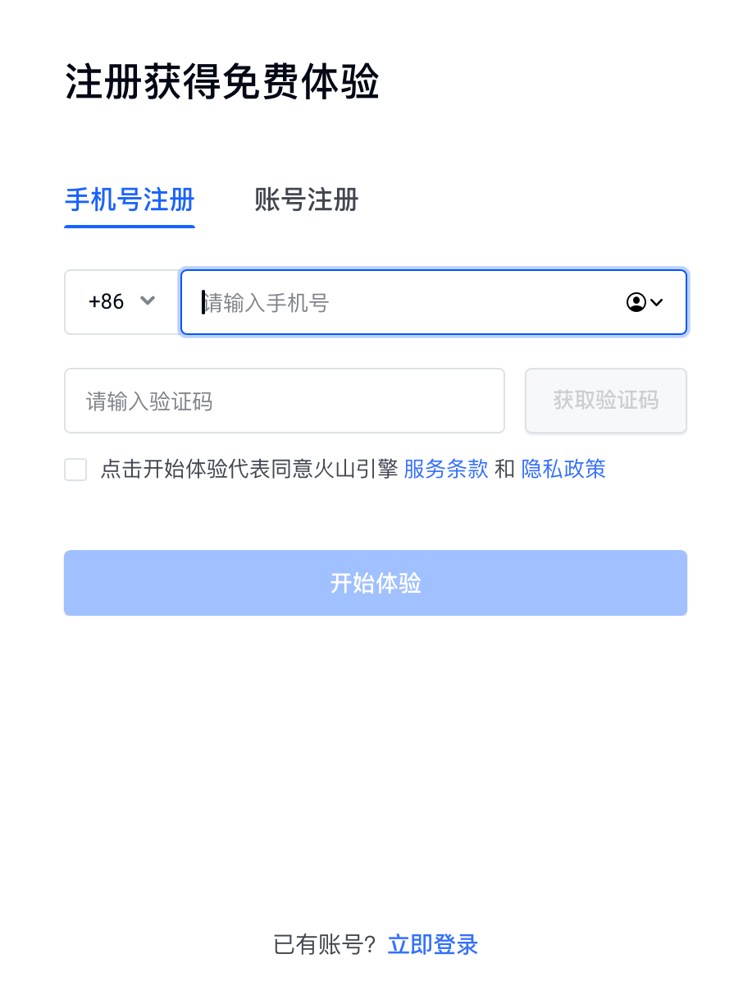

对于每个模型，将赠送 50 万 tokens 的额度。

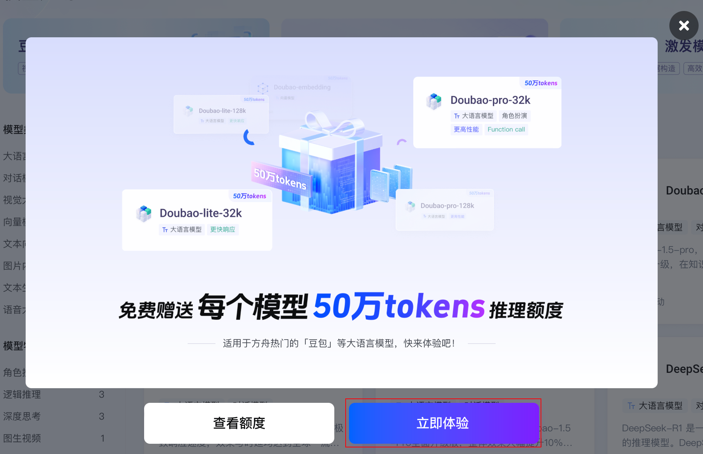

点击左侧的 `API Key 管理` 或者访问 [API 入口](https://console.volcengine.com/ark/region:ark+cn-beijing/apiKey?apikey=%7B%7D)，然后点击 `创建 API Key`：

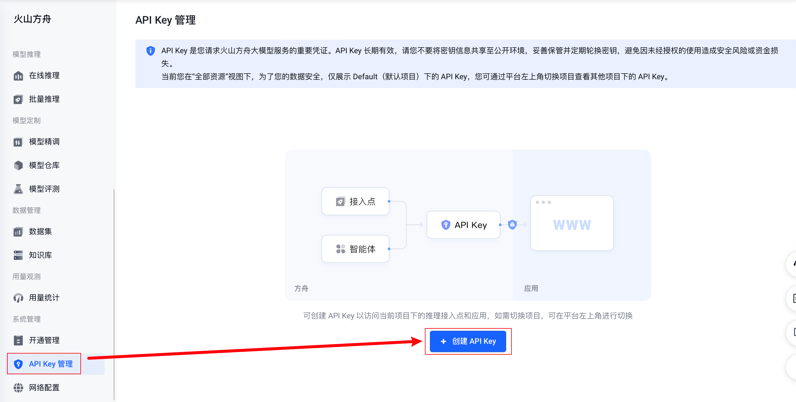

默认名称基于时间自动生成，修改或直接点击 `创建`：

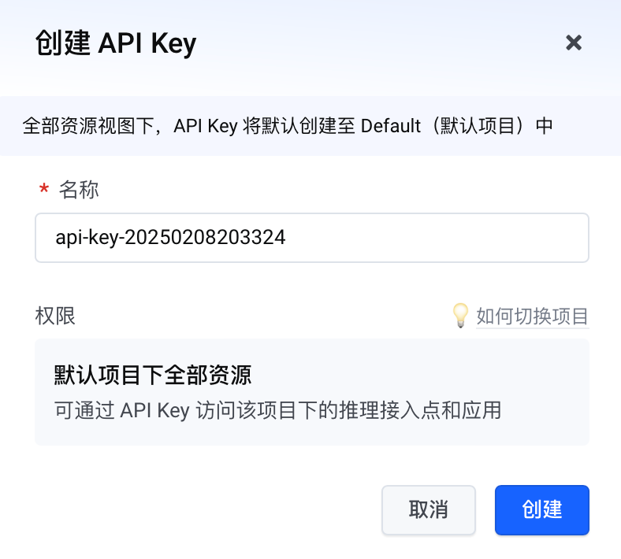

点击箭头位置，然后复制 `API Key`：

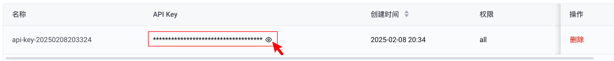

接下来，点击左侧的 `开通服务`，找到 `DeepSeek`，然后点击右侧的 `开通服务`：

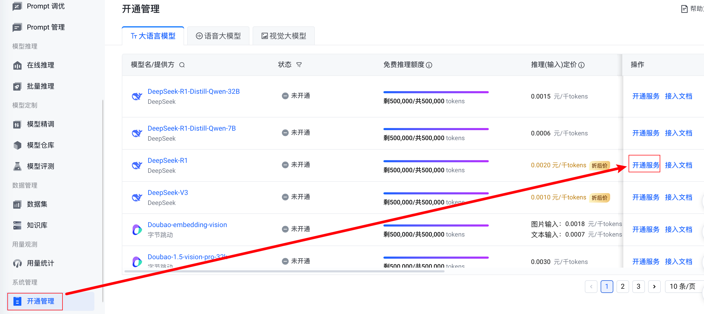

勾选想用的模型，点击 `立即开通`：

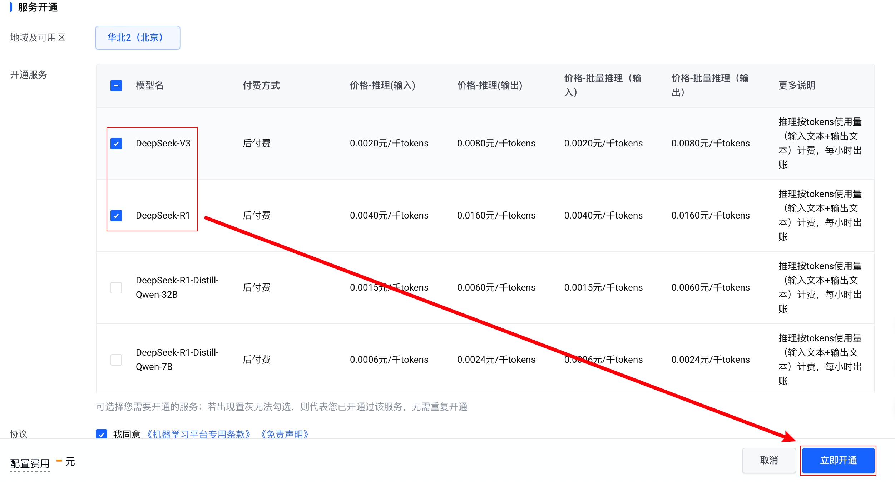

字节终于有了预置的推理接入点：

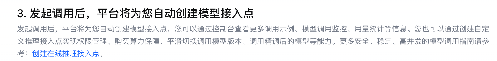

- 模型：`deepseek-v4-flash-260425`（思考/非思考双模式，切换见下方代码）

现在可以跳过下面的「自定义推理接入点」部分。

<details>
    <summary> <h4> 自定义推理接入点 </h4> </summary>
点击左侧的 `在线推理`，点击 `创建推理接入点`：

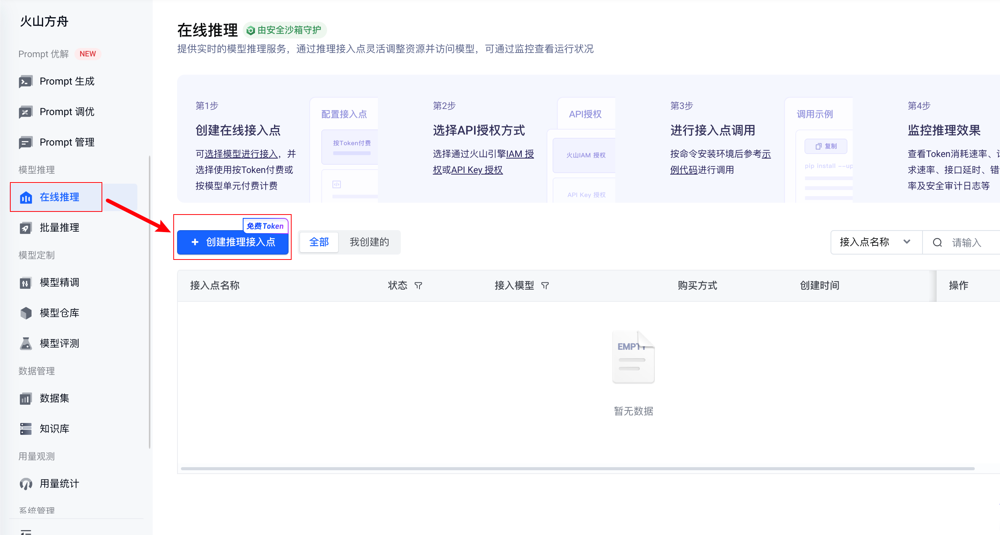

接入点名称可以随意命名，命名完之后进行 `模型选择`：

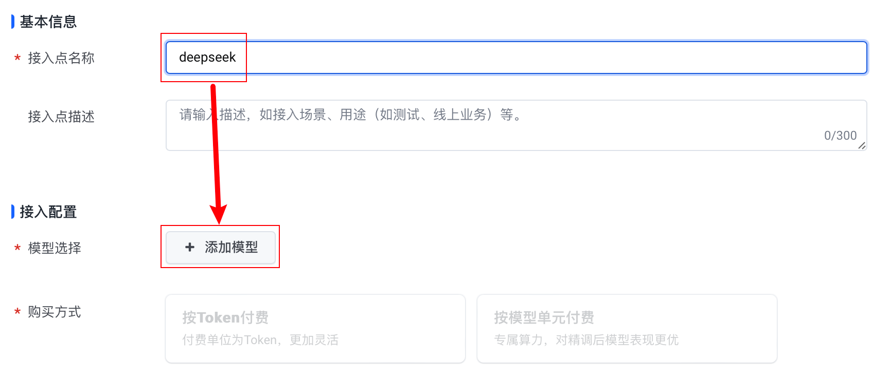

选择步骤参考下图（注意，不能同时选择两个，需要分开创建）：

| 聊天模型                                             | 推理模型                                             |
| ---------------------------------------------------- | ---------------------------------------------------- |
| 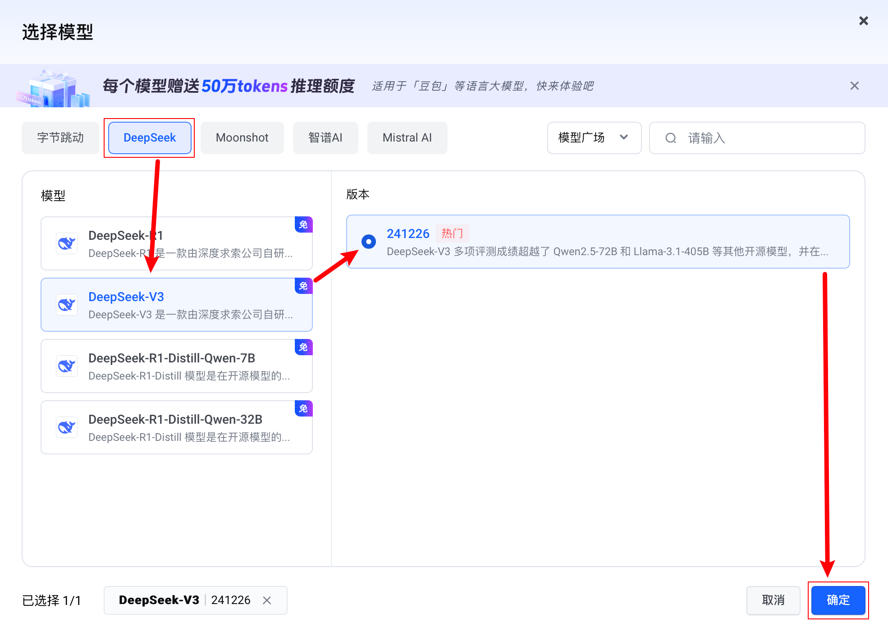 | 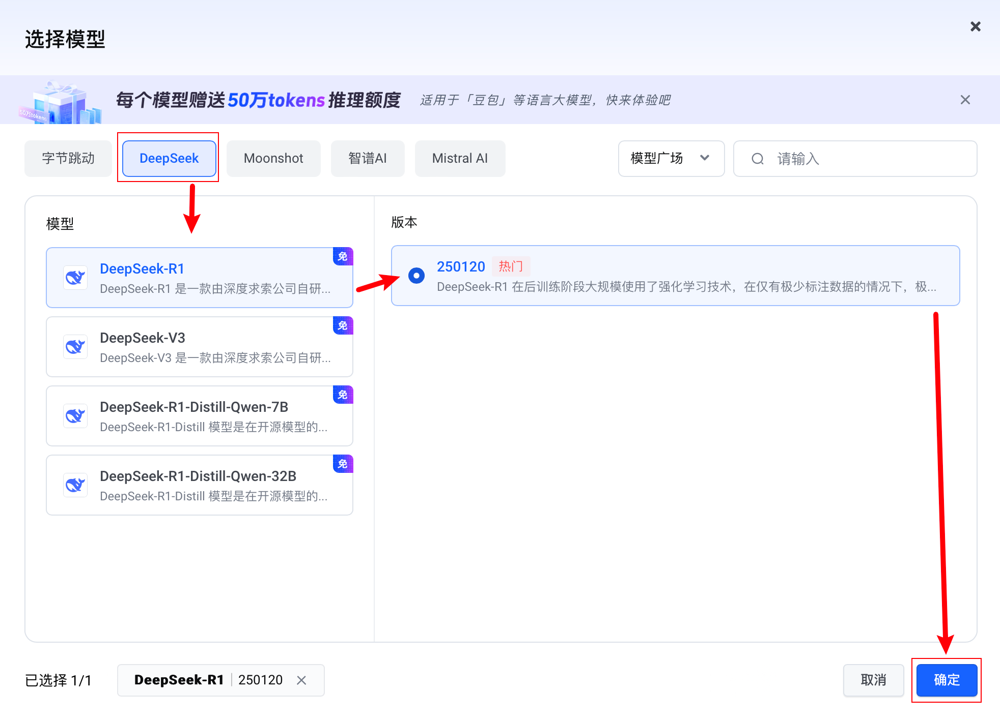 |

然后点击右侧的 `确认接入`：

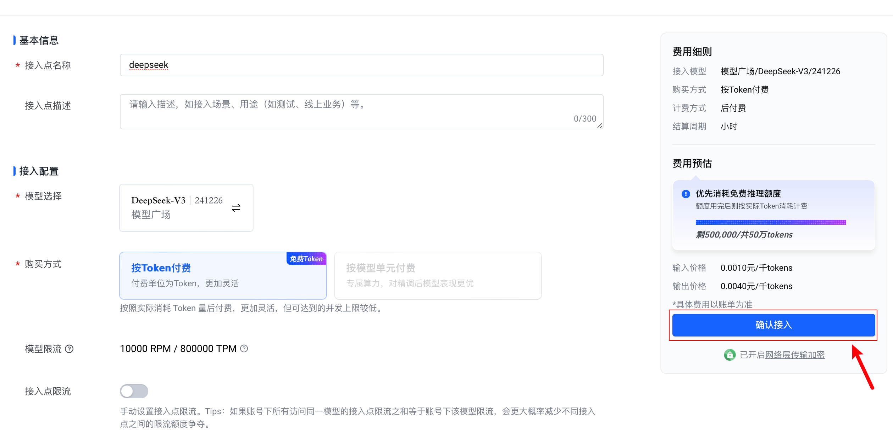

在接入点名称处复制想要接入模型的 ID。

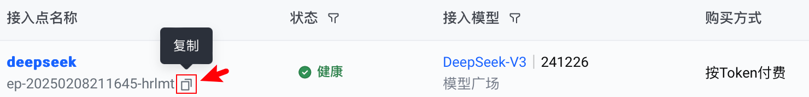

以上图的 DeepSeek-V3 为例，此时 `model_id = "ep-20250208211645-hrlmt"`，而非 `DeepSeek-V3`。

</details>

#### 代码示例

> ~~字节与其他家完全不同的点在于 `model_id` 不固定，在创建完接入点之后才可以得知对应 ID，这固然提高了可操作性，但对于刚注册的用户来说实在不够明确，在使用时需要注意它们的不同，如果在之前没有保存 `api_key` 和 `model`，可以通过入口进行复制：~~
>
> 目前已经有了预置接入点，参见下方代码的 `model` 参数。

```python
from openai import OpenAI
import os

# 临时环境变量配置
os.environ["ARK_API_KEY"] = "your-api-key" # 1

client = OpenAI(
    api_key=os.getenv("ARK_API_KEY"),
    base_url="https://ark.cn-beijing.volces.com/api/v3", # 2
)

# 单轮对话示例
response = client.chat.completions.create(
    model="deepseek-v4-flash-260425", # 3
    messages=[
        {'role': 'system', 'content': 'You are a helpful assistant.'},
        {'role': 'user', 'content': '你是谁？'}
    ],
    extra_body={"thinking": {"type": "disabled"}},  # 关闭思考
)

# 打印模型回复内容
print(response.choices[0].message.content)
```

#### 模式切换

```python
# 切换到思考模式：删除 extra_body 参数即可（V4 默认开启思考）
response = client.chat.completions.create(
    model="deepseek-v4-flash-260425",
    # ...其他参数保持不变...
)
```

</details>

## 📝 作业

1. 尝试非官方平台来感知代码上的差异（对应于代码注释中的 #1 #2 #3 所在行）。
2. 根据文章《[DeepSeek 联网满血版使用指南](./DeepSeek%20联网满血版使用指南.md)》进行多平台配置并对话。

