# DeepSeek API 的获取与对话示例

> **代码文件下载**：[Code](../Demos/deepseek-api-guide-with-examples.ipynb)
>
> **在线链接**：[Kaggle](https://www.kaggle.com/code/aidemos/deepseek-api-guide-with-examples) | [Colab](https://colab.research.google.com/drive/1rdBEJT_oOxaScm3_10epoHX_TdbSm1Ty?usp=sharing)

## 目录

- [环境依赖](#环境依赖)
- [获取 API](#获取-api)
   - [ DeepSeek 官方 ](#-deepseek-官方-)
   - [ 硅基流动 ](#-硅基流动-)
   - [ 阿里云百炼 ](#-阿里云百炼-)
   - [ 百度智能云 ](#-百度智能云-)
- [在线体验地址](#在线体验地址)
- [📝 作业](#-作业)

## 环境依赖

```bash
pip install openai
```

## 获取 API

> ~~因为被攻击的原因，官方 API 平台可能会暂时无法注册，本文提供可替代的解决方案。~~
>
> 撰写文章时发现 DeepSeek API 创建已恢复正常，不过箭在弦上，其余平台的解决方案也同时提供。

**不同平台参数对照表**：

|            | api_key_name          | base_url                                            | chat_model_id             | reasoner_model_id         |
| ---------- | --------------------- | --------------------------------------------------- | ------------------------- | ------------------------- |
| DeepSeek   | "DEEPSEEK_API_KEY"    | "https://api.deepseek.com"                          | "deepseek-chat"           | "deepseek-reasoner"       |
| 硅基流动   | "SILICONFLOW_API_KEY" | "https://api.siliconflow.cn/v1"                     | "deepseek-ai/DeepSeek-V3" | "deepseek-ai/DeepSeek-R1" |
| 阿里云百炼 | "DASHSCOPE_API_KEY"   | "https://dashscope.aliyuncs.com/compatible-mode/v1" | "deepseek-v3"             | "deepseek-r1"             |
| 百度智能云 | "BAIDU_API_KEY"       | "https://qianfan.baidubce.com/v2"                   | "deepseek-v3"             | "deepseek-r1"             |

参数说明：

- `api_key_name`：环境变量名称。
- `base_url`：API 请求地址。
- `chat_model_id`：对话模型标识。
- `reasoner_model_id`：推理模型标识。

从下方选择一个平台继续，**点击 `►` 或文字展开**。

<details>
    <summary> <h3> DeepSeek 官方 </h3> </summary>

> 目前已恢复正常，所有新平台的注册都会赠送一定数量的 tokens，择一即可。

访问 [https://platform.deepseek.com/sign_in](https://platform.deepseek.com/sign_in) 进行注册并登录：

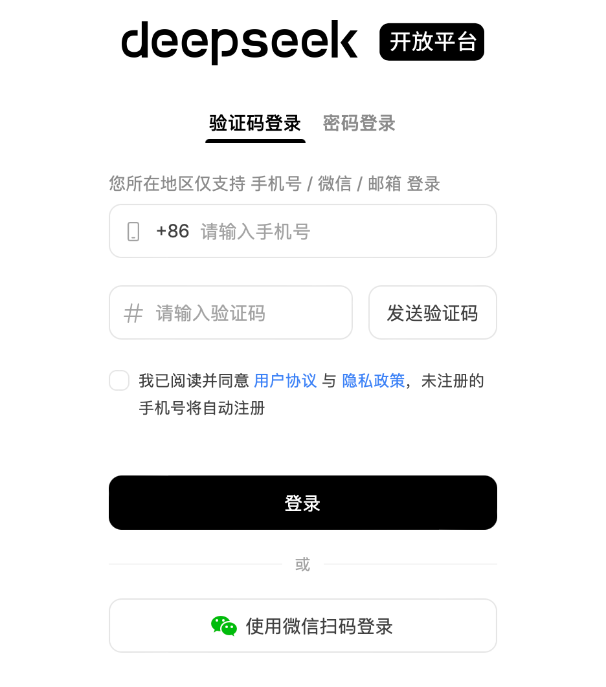

新用户注册后将赠送 10 块钱余额，有效期为一个月：


点击左侧的 `API keys`（或者访问 [https://platform.deepseek.com/api_keys](https://platform.deepseek.com/api_keys)），然后点击 `创建 API key:`

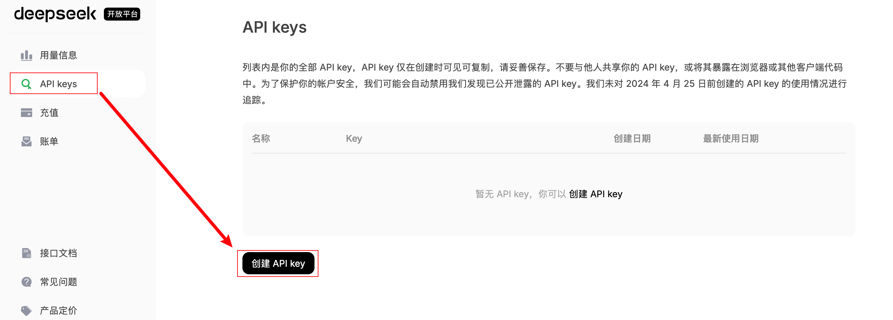

命名，然后点击 `创建`：

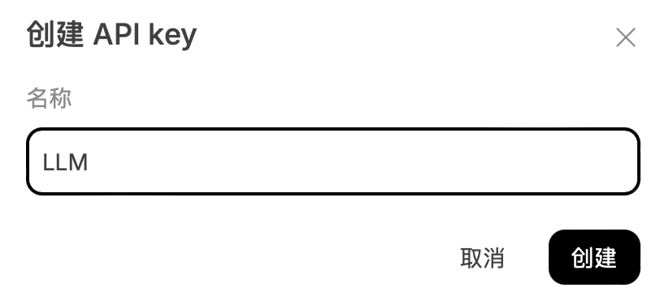

与其他平台不同的是，DeepSeek 的 API 仅在创建时显示，你可能需要记录它，点击 `复制`：

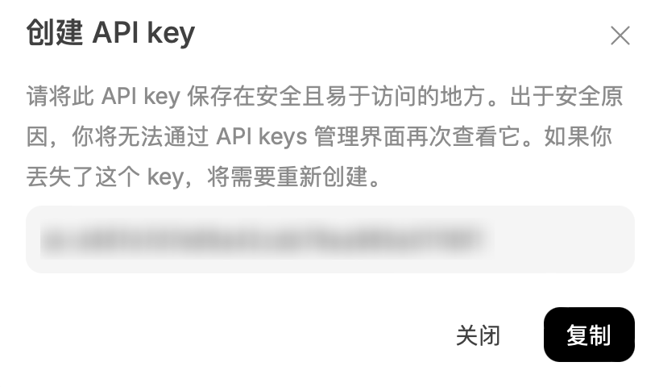

#### 代码示例

```python
from openai import OpenAI
import os

# 临时环境变量配置
os.environ["DEEPSEEK_API_KEY"] = "your-api-key" # 1

client = OpenAI(
    api_key=os.getenv("DEEPSEEK_API_KEY"),
    base_url="https://api.deepseek.com", # 2
)

# 单轮对话示例
completion = client.chat.completions.create(
    model="deepseek-chat", # 3
    messages=[
        {'role': 'system', 'content': 'You are a helpful assistant.'},
        {'role': 'user', 'content': '你是谁？'}]
    )
print(completion.model_dump_json())
```

#### 模型切换

```python
# 切换推理模型
response = client.chat.completions.create(
    model="deepseek-reasoner",  # 修改此处标识
    # ...其他参数保持不变...
)
```

观察 `reasoning_content` 可以捕捉到思考过程。

</details>

**可以通过其他平台提供的服务来等价地访问 DeepSeek（当然，也可以使用平台自身的模型，比如阿里的 Qwen 或者百度的文言一心，不过本文不作探究）：**

<details>
    <summary> <h3> 硅基流动 </h3> </summary>

> 下方硅基流动的邀请链接附带邀请码，最终因邀请所产生的每 2000 万 tokens 将被用于共享，预计在 [Discussions](https://github.com/Hoper-J/AI-Guide-and-Demos-zh_CN/discussions) 中免费示出用于学习。

访问 [https://cloud.siliconflow.cn/i/ofzj9IQy](https://cloud.siliconflow.cn/i/ofzj9IQy) 进行注册并登录：

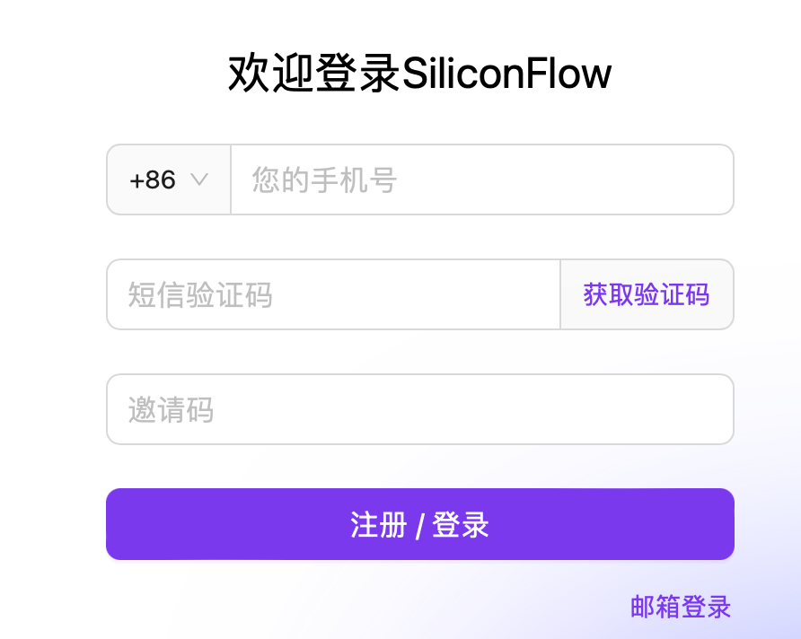

点击[体验中心](https://cloud.siliconflow.cn/account/ak)左侧的 `API 密钥`，然后点击 `新建 API 密钥`：

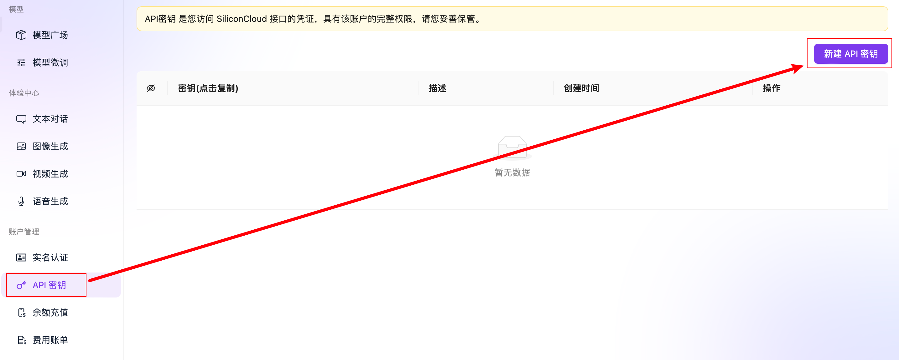

随意填写描述后点击 `新建密钥`：

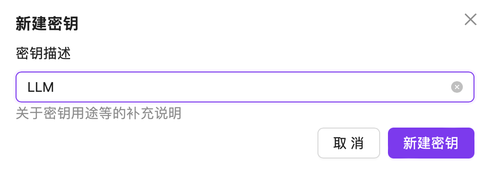

直接点击密钥进行复制，这就是我们即将用到的 API KEY：

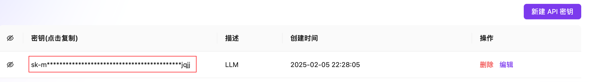

#### 代码示例

```python
from openai import OpenAI
import os

# 临时环境变量配置
os.environ["SILICONFLOW_API_KEY"] = "your-api-key" # 1

client = OpenAI(
    api_key=os.getenv("SILICONFLOW_API_KEY"),
    base_url="https://api.siliconflow.cn/v1", # 2
)

# 单轮对话示例
completion = client.chat.completions.create(
    model="deepseek-ai/DeepSeek-V3", # 3
    messages=[
        {'role': 'system', 'content': 'You are a helpful assistant.'},
        {'role': 'user', 'content': '你是谁？'}]
    )
print(completion.model_dump_json())
```

#### 模型切换

```python
# 切换推理模型
response = client.chat.completions.create(
    model="deepseek-ai/DeepSeek-R1",  # 修改此处标识
    # ...其他参数保持不变...
)
```

</details>

<details>
    <summary> <h3> 阿里云百炼 </h3> </summary>

访问 [阿里云百炼控制台](https://bailian.console.aliyun.com) 注册并登录。

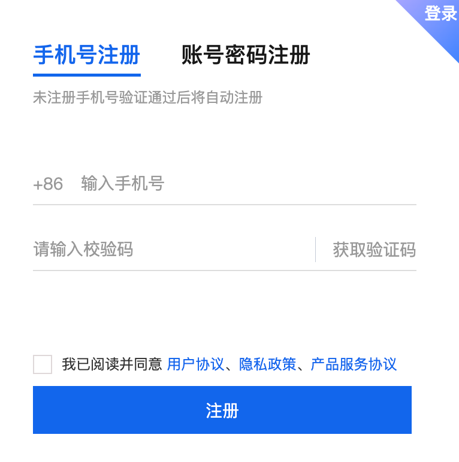

在注册后将获取 1000 万的免费额度，有效期为半年，可以用于 DeepSeek-V3 和 DeepSeek-R1。

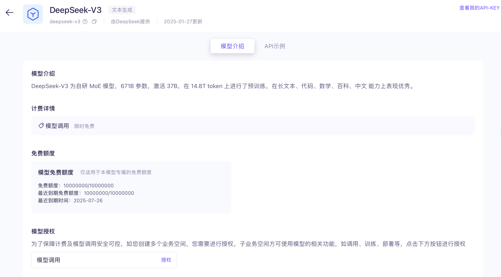

> **注意**：目前仅供免费体验，免费额度用完之后不可继续调用（个人使用可以忽略）

点开左侧的 `模型广场`，点击 `开通模型服务`：


打勾，并点击 `确认开通`：


在[控制台](https://bailian.console.aliyun.com/)点击右上角的 `用户图标` - `API-KEY`：


点击`创建`


选择 `默认业务空间`，点击 `确定` 创建 `API-KEY`：


点击 `查看` 并复制 `API KEY`：


#### 代码示例

```python
from openai import OpenAI
import os

# 临时环境变量配置
os.environ["DASHSCOPE_API_KEY"] = "your-api-key" # 1

client = OpenAI(
    api_key=os.getenv("DASHSCOPE_API_KEY"),
    base_url="https://dashscope.aliyuncs.com/compatible-mode/v1", # 2
)

# 单轮对话示例
completion = client.chat.completions.create(
    model="deepseek-v3", # 3
    messages=[
        {'role': 'system', 'content': 'You are a helpful assistant.'},
        {'role': 'user', 'content': '你是谁？'}]
    )
print(completion.model_dump_json())
```

#### 模型切换

```python
# 切换推理模型
response = client.chat.completions.create(
    model="deepseek-r1",  # 修改此处标识
    # ...其他参数保持不变...
)
```

</details>

<details>
    <summary> <h3> 百度智能云 </h3> </summary>

访问[百度智能云控制台](https://login.bce.baidu.com/?redirect=https%3A%2F%2Fconsole.bce.baidu.com%2Fqianfan%2Fmodelcenter%2Fmodel%2FbuildIn%2Flist)进行注册并登录：


查看用户协议，点击 `同意并继续`：

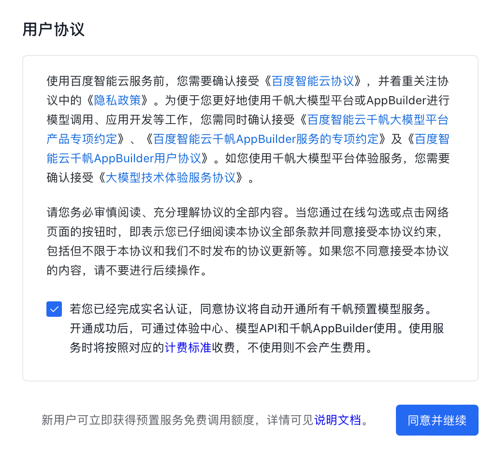

点击左侧的 `模型广场`，搜索 `DeepSeek`：

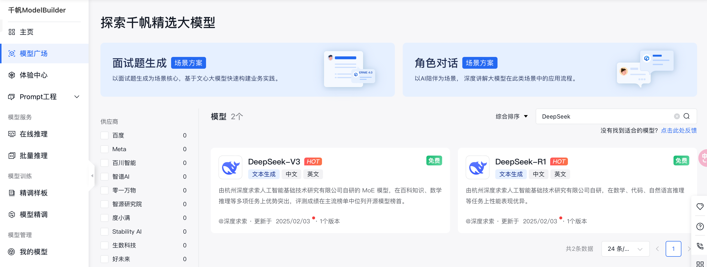

可以看到百度也提供了相关服务，接下来我们访问 [API Key](https://console.bce.baidu.com/iam/#/iam/apikey/list)，点击 `创建 API Key`：

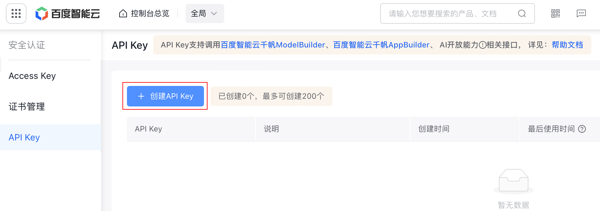

选择 `千帆 ModelBuilder`，点击 `确定`：

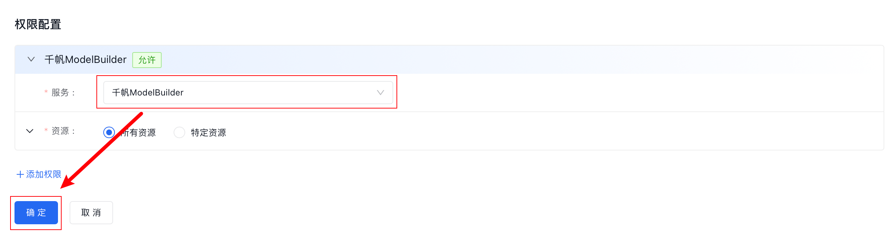

点击 `复制`：


#### 代码示例

```python
from openai import OpenAI
import os

# 临时环境变量配置
os.environ["BAIDU_API_KEY"] = "your-api-key" # 1

client = OpenAI(
    api_key=os.getenv("BAIDU_API_KEY"),
    base_url="https://qianfan.baidubce.com/v2", # 2
)

# 单轮对话示例
completion = client.chat.completions.create(
    model="deepseek-v3", # 3
    messages=[
        {'role': 'system', 'content': 'You are a helpful assistant.'},
        {'role': 'user', 'content': '你是谁？'}]
    )
print(completion.model_dump_json())
```

#### 模型切换

```python
# 切换推理模型
response = client.chat.completions.create(
    model="deepseek-r1",  # 修改此处标识
    # ...其他参数保持不变...
)
```

</details>

---

## 在线体验地址

除了官方平台外，还可以通过其他平台与 DeepSeek 进行对话（避开官方平台的卡顿）：

| 平台          | 在线链接                                                     |
| ------------- | ------------------------------------------------------------ |
| DeepSeek 官方 | [官方](https://chat.deepseek.com)                            |
| 硅基流动      | [DeepSeek-V3](https://cloud.siliconflow.cn/playground/chat/17885302723)<br />[DeepSeek-R1](https://cloud.siliconflow.cn/playground/chat/17885302724) |
| 百度智能云    | [DeepSeek-V3](https://console.bce.baidu.com/qianfan/ais/console/onlineTest/LLM/DeepSeek-V3)<br />[DeepSeek-R1](https://console.bce.baidu.com/qianfan/ais/console/onlineTest/LLM/DeepSeek-R1) |

## 📝 作业

尝试非官方平台来感知代码上的差异（对应于代码注释中的 #1 #2 #3 所在行）。
