# Kaggle：免费 GPU 使用指南，Colab 的理想替代方案

> 如果电脑显卡性能不足，又无法访问 Colab 的免费 GPU，那该怎么开始之后的学习呢？
>
> **答案是 Kaggle**。
>
> Kaggle 不仅提供免费的 GPU 计算资源，还可以直连而无需翻墙，同时不需要海外手机号验证。接下来，文章将详细介绍如何注册 Kaggle 账号、创建 Notebook 文件、设置 GPU 环境，并导入数据集。

## 目录

* [注册 Kaggle 账号](#注册-kaggle-账号)
* [创建 Notebook 文件](#创建-notebook-文件)
* [启用免费 GPU](#启用免费-gpu)
* [在 Notebook 中启用 GPU](#在-notebook-中启用-gpu)
* [查看显卡性能](#查看显卡性能)
* [导入 Notebook 文件](#导入-notebook-文件)
* [导入数据集](#导入数据集)
* ["Copy &amp; Edit" 功能介绍](#copy--edit-功能介绍)

## 注册 Kaggle 账号

1. **访问官网**：在浏览器中访问 [https://www.kaggle.com](https://www.kaggle.com)，进入 Kaggle 官网。

   

2. **开始注册**：点击 `Register with Email` 按钮，进入注册页面（使用🪜科学上网的同学可以使用 Google 注册，没有并不影响后续使用）。

3. **填写信息**：在注册页面，输入邮箱地址、密码和用户名，然后点击 `Sign Up`。

   

4. **邮箱验证**：前往邮箱，查收来自 Kaggle 的验证邮件，复制邮件中的验证码或者点击 `click here`。

   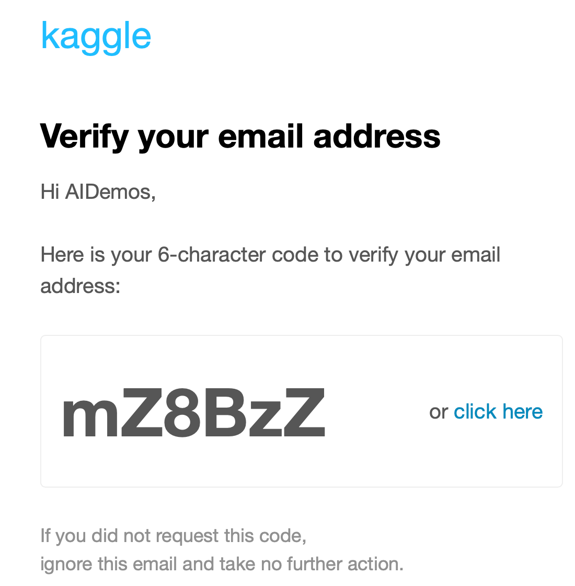

5. **输入验证码**：回到网站，在验证页面粘贴验证码，点击 `Next`。

   

6. **完成登录**：使用刚刚注册的邮箱和密码，点击 `Sign in` 登录账号。

   

## 创建 Notebook 文件

在左边栏点击 `Create`，选择 `New Notebook`：

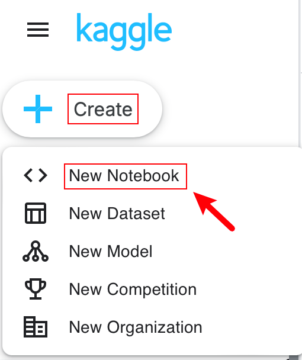

现在我们成功创建了一个 Notebook 文件：

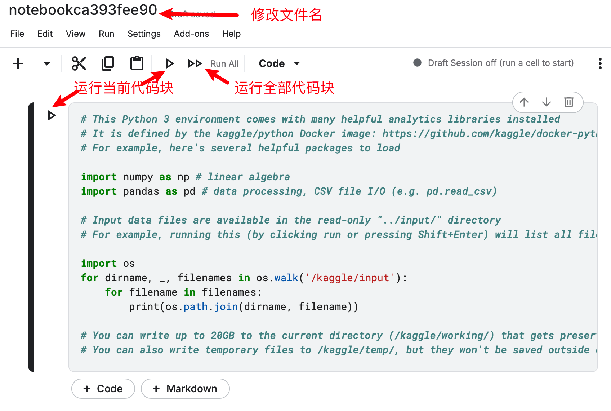

注意，此时还无法使用免费的 GPU：

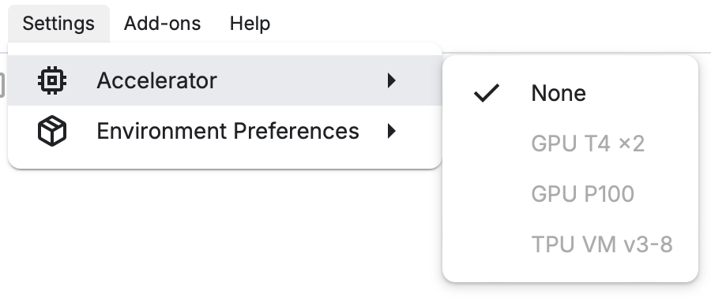

## 启用免费 GPU

默认情况下，Notebook 无法使用免费的 GPU，需要完成手机号验证以启用此功能。

1. **访问设置页面**：点击右上角的头像，选择 `Settings`，进入设置页面，或者直接访问 [https://www.kaggle.com/settings](https://www.kaggle.com/settings)。

   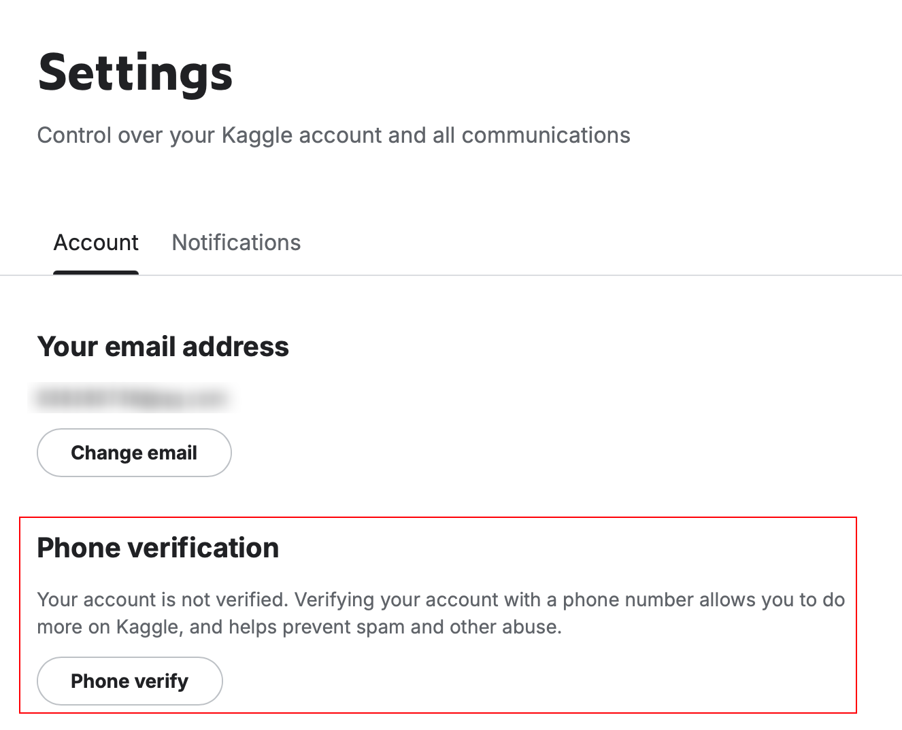

2. **验证手机号**：如上图，在设置页面，找到 `Phone Verification` 部分，点击 `Verify Phone Number`。

3. **输入手机号**：选择国家区号，输入手机号码，点击 `Send verification code`。

   - 国内手机号可以正常通过验证，不用担心。

   

4. **输入验证码**：等待接收短信验证码，输入后点击 `Verify`。

   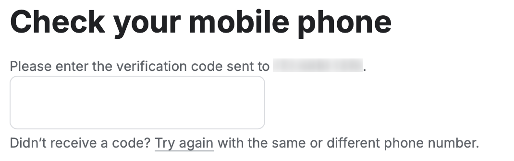

5. **验证成功**：手机号验证完成，现在可以使用免费的 GPU。

   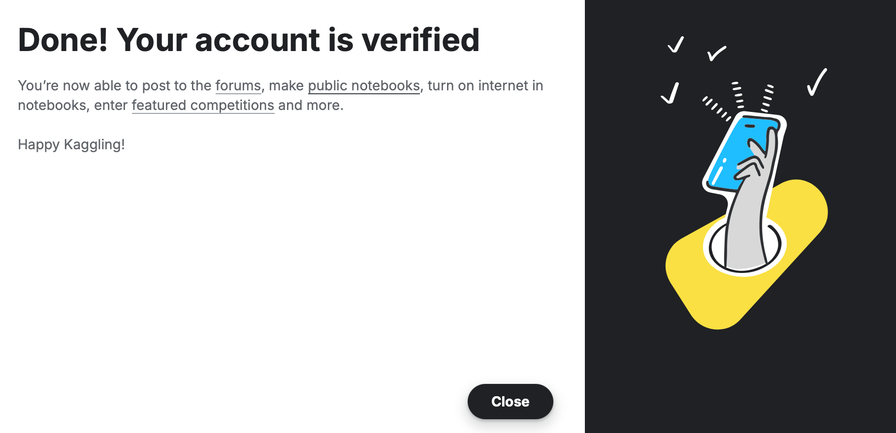

## 在 Notebook 中启用 GPU

1. **打开 Notebook**：返回 [Code 页面](https://www.kaggle.com/work/code)，打开之前创建的 Notebook 文件。

2. **设置 GPU**：在 Notebook 界面，点击左上角的 `Settings` 按钮，以 GPU T4 为例，在下拉菜单中点击 `Accelerator`，选择 `GPU T4 x2`。

   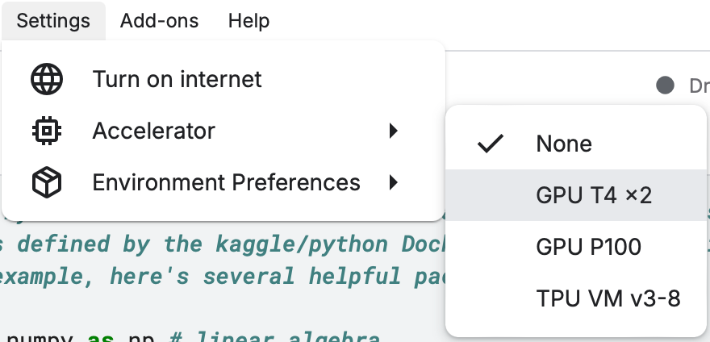

3. **确认启用**：系统会提示每周有 30 小时的 GPU 使用时间，点击 `Turn on GPU T4 x2` 进行确认。

   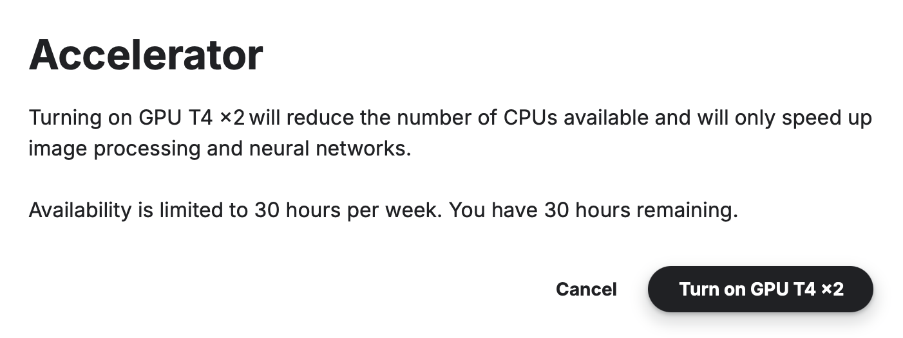

   - 用于日常学习是足够的，不够的话就多开 :)

4. **查看使用时间**：在页面右边栏的 `Session Options` 中，可以查看剩余的 GPU 使用时间。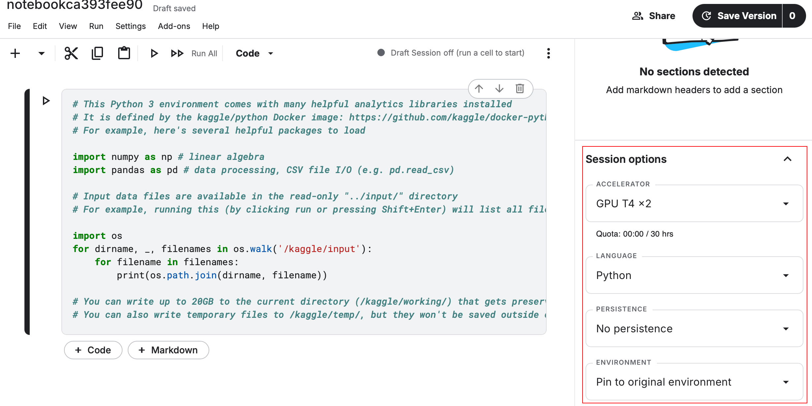

5. **节省时间**：在不需要 GPU 时，可将 `Accelerator` 设置为 `None`，以节省 GPU 时间。

   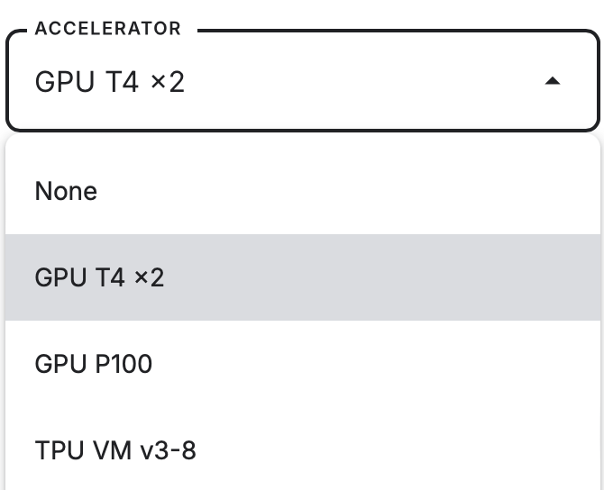

## 查看显卡性能

在 Notebook 中，运行以下命令查看当前 GPU 的性能和状态：

```bash
!nvidia-smi
```

**输出**：

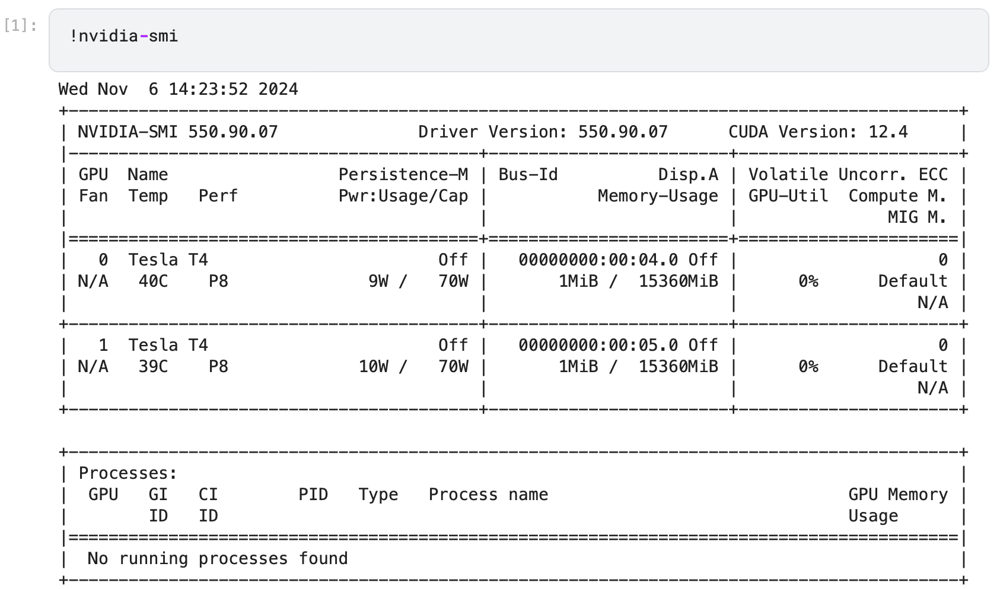

一个伟大的平台。

## 导入 Notebook 文件

点击`File`-> `Import notebook`：

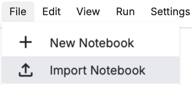

是的，Kaggle 提供了四种方法来导入 Notebook 文件，下面演示 Github：

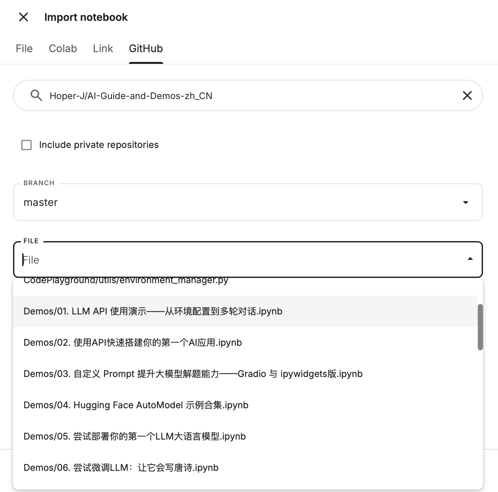

导入的过程非常顺利：

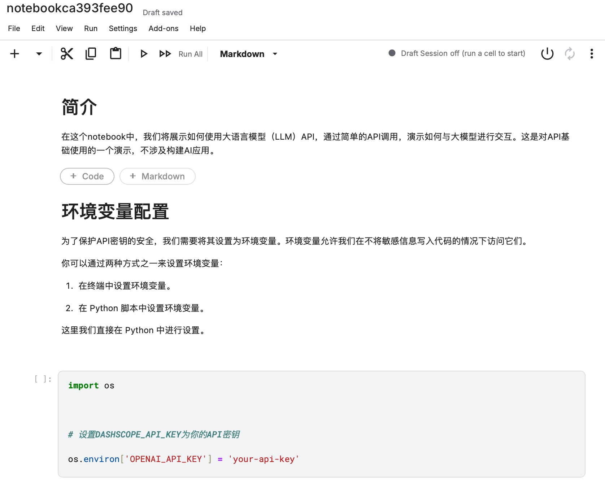

## 导入数据集

Kaggle 提供了简单的方式来导入数据集。

1. **添加数据**：在 Notebook 界面的右侧，找到 `Input` 下拉菜单，点击 `Add Input` 或 `Upload`。

   - **`Add Input`**：导入 Kaggle 中已有的数据集。

   - **`Upload`**：上传本地的数据集。

   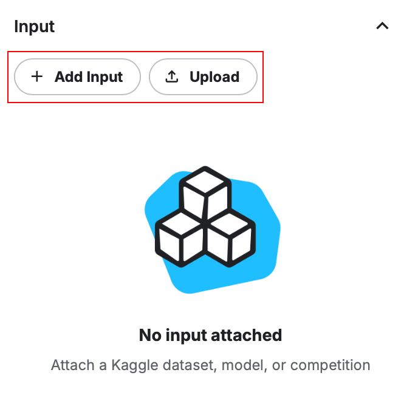

2. **搜索数据集**：点击 `Add Input` 后，在搜索栏中输入需要的数据集名称。这里输入 `mnist`，然后选择 `Fashion MNIST` 数据集作为示范。

   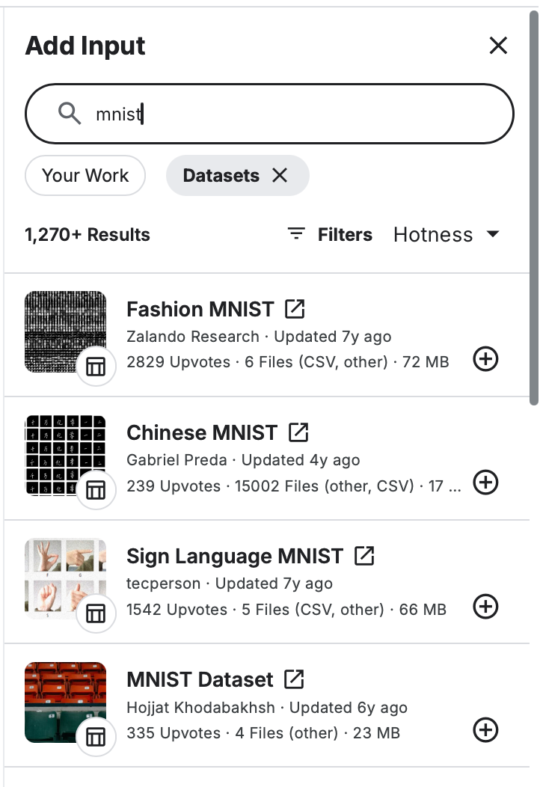

3. **添加数据集**：在数据集右侧，点击 `+` 按钮，将其添加到 Notebook 中，然后点击右上角的 `x` 号。

   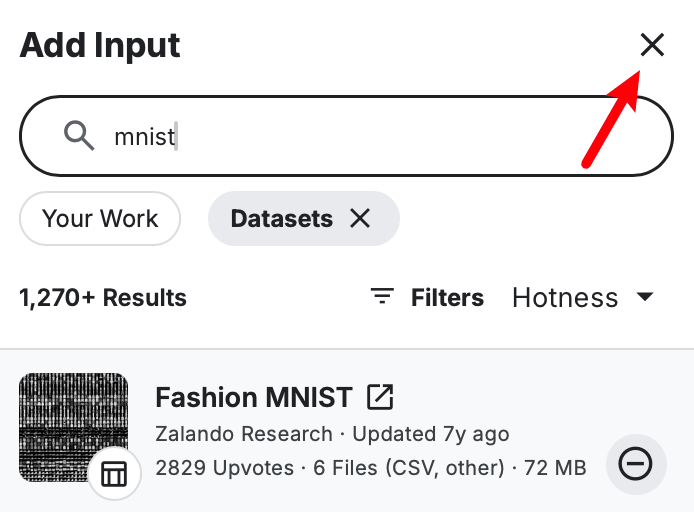

4. **查看已添加的数据集**：可以在右侧的 **DATASETS** 中看到已添加的数据集。

   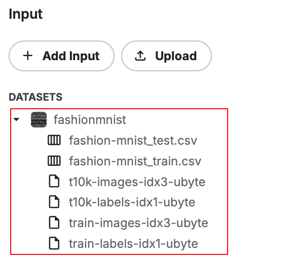

5. **查看数据集内容**：在 Notebook 中，使用官方提供的代码查看数据集文件夹的内容。

   ```python
   # 这是一个预先配置的 Python 3 环境，包含许多有用的分析库
   # 由 kaggle/python Docker 镜像定义：https://github.com/kaggle/docker-python
   # 例如，这里导入了几个有用的包
   
   import numpy as np  # 线性代数
   import pandas as pd  # 数据处理，CSV 文件 I/O（如 pd.read_csv）
   
   # 输入的数据文件位于只读的 "../input/" 目录中
   # 例如，运行此代码（点击运行或按 Shift+Enter）将列出输入目录中的所有文件
   
   import os
   for dirname, _, filenames in os.walk('/kaggle/input'):
       for filename in filenames:
           print(os.path.join(dirname, filename))
   
   # 当使用“Save & Run All”创建版本时，可以将最多 20GB 的数据写入当前目录（/kaggle/working/），这些数据将被保存为输出
   # 也可以将临时文件写入 /kaggle/temp/，但在当前会话结束后，这些文件将不会被保存
   ```

   **输出**：

   ```
   /kaggle/input/fashionmnist/t10k-labels-idx1-ubyte
   /kaggle/input/fashionmnist/t10k-images-idx3-ubyte
   /kaggle/input/fashionmnist/fashion-mnist_test.csv
   /kaggle/input/fashionmnist/fashion-mnist_train.csv
   /kaggle/input/fashionmnist/train-labels-idx1-ubyte
   /kaggle/input/fashionmnist/train-images-idx3-ubyte
   ```

​	可以看到与之前的图示一致。

## "Copy & Edit" 功能介绍

我们还可以非常快速地复制其他人分享的 Notebook，正如其操作名 "Copy & Edit"：复制并编辑。

1. **找到感兴趣的 Notebook**：浏览 Kaggle 的 [Notebooks](https://www.kaggle.com/notebooks) 页面，找到感兴趣的 Notebook，你也可以简单访问当前用于演示的 [Demo](https://www.kaggle.com/code/aidemos/00-demo)。

2. **复制 Notebook**：点击右上角的 `Copy & Edit` 按钮。

   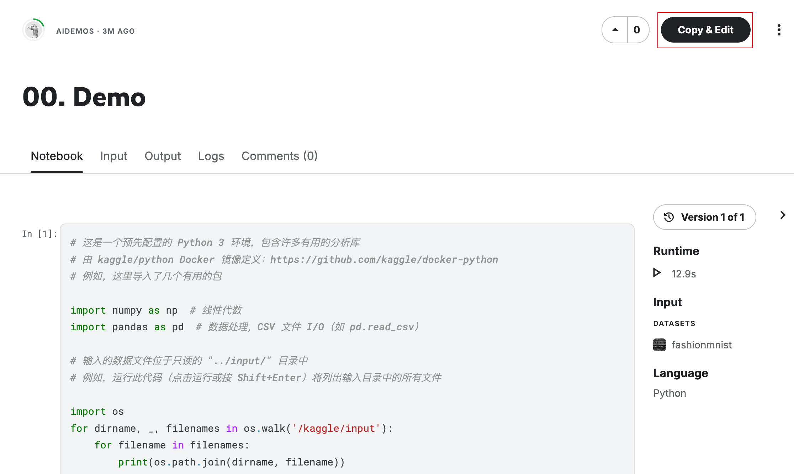

3. **分享**：如果你想将自己的 Notebook 分享给其他人，点击右上角的 `Share`。

   

4. **公开**：选择 `Public` 保存为公开的版本，`PUBLIC URL` 中的链接就是分享链接。

   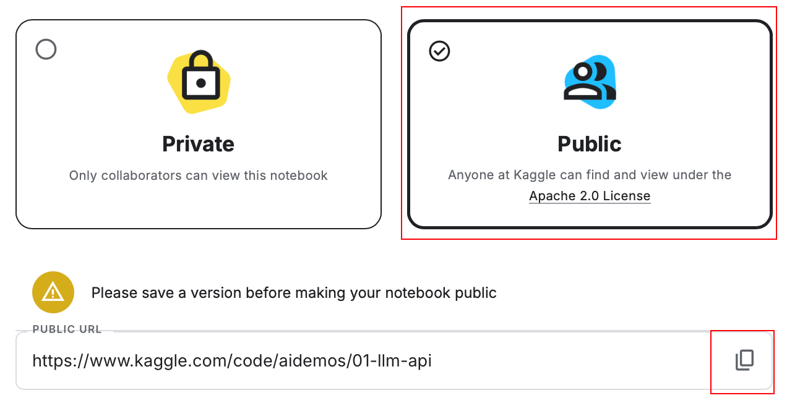

至此，我们已经完成了 Kaggle 账号的注册和设置，成功创建并配置了 Notebook，并且学会了如何使用免费的 GPU 计算资源以及导入数据集。

