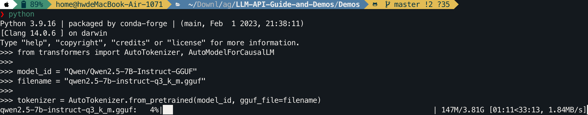
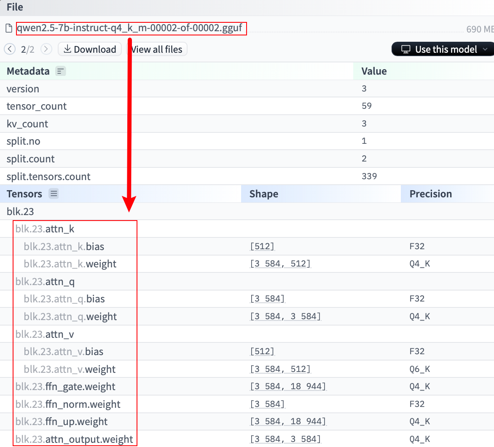
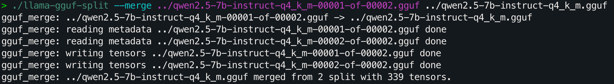
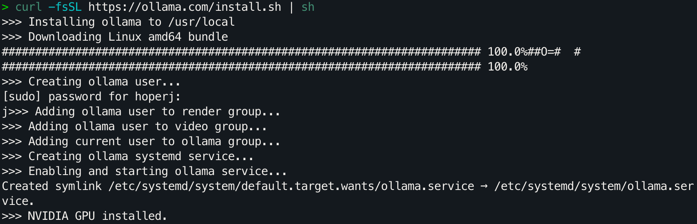
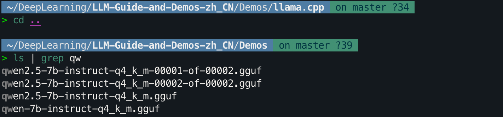
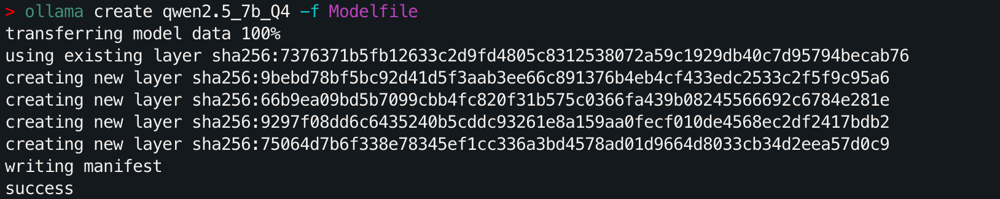
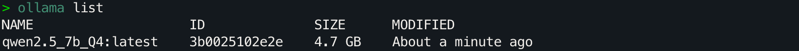
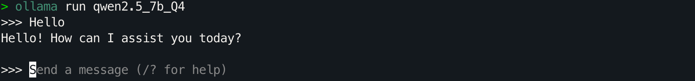

# 如何加载 GGUF 模型（分片 & Shared & Split & 00001-of-0000...的解决方法）

> 对 Transformers 来说，这是一个新特性，或许有必要成为一个拓展文章进行介绍。
>
> `llama-cpp-python` 和 `ollama` 的方法也会在本文中提到，我们在其他文章中采取的 GGUF 加载方式为 `llama-cpp-python`。	
>
> 即便你没有显卡，依旧可以加载并部署大模型，这就是 GGUF。

## 目录

- [使用 🤗 Transformers 加载 GGUF 模型](#使用--transformers-加载-gguf-模型)
    - [确保安装最新版本的 Transformers](#确保安装最新版本的-transformers)
    - [加载单个 GGUF 文件](#加载单个-gguf-文件)
    - [加载分片（Shared/Split）的 GGUF 文件](#加载分片sharedsplit的-gguf-文件)
       - [解决方法：合并分片文件](#解决方法合并分片文件)
    - [查看推理的内存占用](#查看推理的内存占用)
- [使用 llama-cpp-python 加载 GGUF 模型](#使用-llama-cpp-python-加载-gguf-模型)
  - [环境配置](#环境配置)
  - [加载单个 GGUF 文件](#加载单个-gguf-文件-1)
  - [加载分片（Shared/Split）的 GGUF 文件](#加载分片sharedsplit的-gguf-文件-1)
  - [查看推理的内存占用](#查看推理的内存占用-1)
  - [卸载到 GPU（offload）](#卸载到-gpuoffload)
     - [全部卸载](#全部卸载)
     - [部分卸载](#部分卸载)
- [使用 Ollama 加载 GGUF 模型](#使用-ollama-加载-gguf-模型)
  - [安装 Ollama](#安装-ollama)
  - [创建 Modelfile 文件](#创建-modelfile-文件)
  - [创建模型](#创建模型)
  - [运行模型](#运行模型)
- [相关文章阅读](#相关文章阅读)

## 使用 🤗 Transformers 加载 GGUF 模型

> 注意，Transformers 部分当前更像是一个故事，暂时还无法部署到实际生产环境中，真正进行部署可以看 [llama-cpp-python](#使用-llama-cpp-python-加载-gguf-模型) 部分。

我们当然可以使用 `llama.cpp` 或 `ollama` 进行加载，在 2024 年 5 月 17 日之前（也就是 Transformers v4.41.0 发布之前），它们是常用的方式。不过现在，Transformer 也支持了这个特性。

如果你查看Transformers 的官方文档，会发现它从 [v4.41.0](https://github.com/huggingface/transformers/releases/tag/v4.41.0) 开始，就已经支持了几种流行的模型架构：

- LLaMa
- Mistral

随后，在 v4.42.4 中，他们增加了对 Qwen2 的支持，并且从 v4.45.1 开始，大幅增加了对量化类型和模型架构的支持。你可以访问[文档](https://huggingface.co/docs/transformers/main/en/gguf#supported-model-architectures)查看详细信息。

### 确保安装最新版本的 Transformers

在尝试使用新特性之前，确保你安装的是最新版本的 Transformers。如果你刚遵循教程训练完 LoRA 文生图模型，那么你的版本可能是 v4.41.2，这个版本在导入 Qwen 的 GGUF 文件时会报错：`ValueError: Architecture qwen2 not supported`。

命令行执行以下命令：

```bash
pip install numpy==1.24.4
pip install gguf
pip install --upgrade transformers
```

### 加载单个 GGUF 文件

以模型 [qwen2.5-7b-instruct-q3_k_m.gguf](https://huggingface.co/Qwen/Qwen2.5-7B-Instruct-GGUF/blob/main/qwen2.5-7b-instruct-q3_k_m.gguf) 为例，如果我们选择 Q3_K_M，其对应的文件名为`qwen2.5-7b-instruct-q3_k_m.gguf`，加载命令如下：

```python
from transformers import AutoTokenizer, AutoModelForCausalLM

model_id = "Qwen/Qwen2.5-7B-Instruct-GGUF"
filename = "qwen2.5-7b-instruct-q3_k_m.gguf"

tokenizer = AutoTokenizer.from_pretrained(model_id, gguf_file=filename, clean_up_tokenization_spaces=True)
model = AutoModelForCausalLM.from_pretrained(model_id, gguf_file=filename)
```

**似乎一切都很好**，我们直接使用这种方式选择想要加载的量化模型就可以了。

> 即便你的电脑是 Mac，也可以使用这段命令进行加载（先不要进行推理，往下看）。
>
> 

### 加载分片（Shared/Split）的 GGUF 文件

但存在一个问题：对于**分片**的 GGUF 文件，怎么加载呢？

**分片**指的是文件名末尾为`<ShardNum>-of-<ShardTotal>`形式的 GGUF 文件。以 Qwen2.5 为例，它的 Q4_K_M 量化模型被分为两个文件：

- [qwen2.5-7b-instruct-q4_k_m-00001-of-00002.gguf](https://huggingface.co/Qwen/Qwen2.5-7B-Instruct-GGUF/blob/main/qwen2.5-7b-instruct-q4_k_m-00001-of-00002.gguf)
- [qwen2.5-7b-instruct-q4_k_m-00002-of-00002.gguf](https://huggingface.co/Qwen/Qwen2.5-7B-Instruct-GGUF/blob/main/qwen2.5-7b-instruct-q4_k_m-00002-of-00002.gguf)

**Transformers 可以自动加载分片模型吗？**

遗憾的是，经过研究发现，Transformers 暂时不支持直接加载分片模型。有人在 GitHub 上提出了相关的 Issue：[Support loading shard GGUF models #32266](https://github.com/huggingface/transformers/issues/32266)。

如果直接尝试加载 `qwen2.5-7b-instruct-q4_k_m-00001-of-00002.gguf`：

```python
from transformers import AutoTokenizer, AutoModelForCausalLM

model_id = "Qwen/Qwen2.5-7B-Instruct-GGUF"
filename = "qwen2.5-7b-instruct-q4_k_m-00001-of-00002.gguf"

tokenizer = AutoTokenizer.from_pretrained(model_id, gguf_file=filename, clean_up_tokenization_spaces=True)
model = AutoModelForCausalLM.from_pretrained(model_id, gguf_file=filename)
```

你会得到这样的输出：

```
Converting and de-quantizing GGUF tensors...: 100%|████████████████████████████████████████████████████████████| 280/280 [00:39<00:00,  7.05it/s]
Some weights of Qwen2ForCausalLM were not initialized from the model checkpoint at Qwen/Qwen2.5-7B-Instruct-GGUF and are newly initialized: ['model.layers.23.mlp.gate_proj.weight', 'model.layers.23.mlp.up_proj.weight', 'model.layers.23.post_attention_layernorm.weight', 'model.layers.23.self_attn.k_proj.bias', 'model.layers.23.self_attn.k_proj.weight', 'model.layers.23.self_attn.o_proj.weight', 'model.layers.23.self_attn.q_proj.bias', 'model.layers.23.self_attn.q_proj.weight', 'model.layers.23.self_attn.v_proj.bias', 'model.layers.23.self_attn.v_proj.weight', 'model.layers.24.input_layernorm.weight', 'model.layers.24.mlp.down_proj.weight', 'model.layers.24.mlp.gate_proj.weight', 'model.layers.24.mlp.up_proj.weight', 'model.layers.24.post_attention_layernorm.weight', 
...]
You should probably TRAIN this model on a down-stream task to be able to use it for predictions and inference.
```

其中出现大量权重未被加载的警告，这是因为第二个分片的数据没有被加载，导致部分权重被随机初始化。而这些未加载的权重正是分片 2 中的数据，如下图所示：



那么，对于分片文件，就只能手动合并或者用 `llama-cpp-python` 了，猜测 Qwen 采用的是 `llama.cpp` 中的 `llama-gguf-split` 进行拆分，所以，让我们下载它进行合并尝试。

#### 解决方法：合并分片文件

遵循步骤：

1. **下载分片文件**

   首先，安装 `huggingface-hub`：

   ```bash
   pip install huggingface-hub
   ```

   然后，下载分片文件：

   ```bash
   huggingface-cli download Qwen/Qwen2.5-7B-Instruct-GGUF qwen2.5-7b-instruct-q4_k_m-00001-of-00002.gguf --local-dir . --local-dir-use-symlinks False
   huggingface-cli download Qwen/Qwen2.5-7B-Instruct-GGUF qwen2.5-7b-instruct-q4_k_m-00002-of-00002.gguf --local-dir . --local-dir-use-symlinks False
   ```

2. **克隆 `llama.cpp` 仓库并编译**

   ```bash
   git clone https://github.com/ggerganov/llama.cpp
   cd llama.cpp
   make
   ```

3. **使用 `llama-gguf-split` 工具合并分片文件**

   在 `llama.cpp` 目录下，运行以下命令（可以修改文件路径，遵循 `./llama-gguf-split --merge [分块1的路径] [目标文件名]` 即可）：

   ```bash
   ./llama-gguf-split --merge ../qwen2.5-7b-instruct-q4_k_m-00001-of-00002.gguf ../qwen2.5-7b-instruct-q4_k_m.gguf
   ```

   这将把两个分片文件合并为一个完整的 `qwen-7b-instruct-q4_k_m.gguf` 文件：

   

   从输出可以看到文件成功进行了合并。

4. **加载合并后的 GGUF 文件**

   ```python
   from transformers import AutoTokenizer, AutoModelForCausalLM
   
   # 指定模型文件所在的本地目录
   model_path = "./"  # 如果模型文件在当前目录下
   
   # 合并后的 GGUF 文件名
   gguf_file = "qwen2.5-7b-instruct-q4_k_m.gguf"
   
   # 从本地加载模型
   tokenizer = AutoTokenizer.from_pretrained(model_path, gguf_file=gguf_file, clean_up_tokenization_spaces=True)
   model = AutoModelForCausalLM.from_pretrained(model_path, gguf_file=gguf_file)
   ```

   **输出**：

   ```
   Converting and de-quantizing GGUF tensors...: 100%|████████████████████████████████████████████████████████████| 339/339 [00:57<00:00,  5.92it/s]
   ```

   成功加载🎉，来验证一下：

    ```python
    input_text = "Hello, World!"
    inputs = tokenizer(input_text, return_tensors="pt")
    outputs = model.generate(**inputs, max_new_tokens=50)
    print(tokenizer.decode(outputs[0], skip_special_tokens=True))
    ```

    **输出**：

    ```
    Hello, World! I'm a 21-year-old software engineer with a passion for learning and a love for technology. I'm currently working on a project that involves building a web application using React and Node.js. I'm also interested in machine learning and have been
    ```

    还是一样，**“似乎一切都很好”**，让我们看看内存占用。

### 查看推理的内存占用

使用 `psutil` 和 `pynvml` 库来监测内存占用情况，先进行安装：

```bash
pip install psutil
pip install pynvml
```

然后，在代码中添加内存监控（不用关心这里的代码细节，看结果）：

```python
import psutil
from transformers import AutoTokenizer, AutoModelForCausalLM
from pynvml import nvmlInit, nvmlDeviceGetHandleByIndex, nvmlDeviceGetMemoryInfo, nvmlShutdown

# 初始化 NVML
nvmlInit()

# 获取 GPU 句柄（假设使用的是 GPU 0）
gpu_index = 0
handle = nvmlDeviceGetHandleByIndex(gpu_index)

def get_gpu_memory():
    """
    获取指定 GPU 的已用显存（单位：MB）
    """
    info = nvmlDeviceGetMemoryInfo(handle)
    used = info.used / 1024 ** 2  # 转换为 MB
    return used

# 获取当前进程的内存信息
process = psutil.Process()

# 获取模型加载前的 CPU 和 GPU 内存
cpu_before = process.memory_info().rss / 1024 ** 2  # 转换为 MB
try:
    gpu_used_before = get_gpu_memory()
except Exception as e:
    print(f"获取GPU显存信息时出错: {e}")
    gpu_used_before = 0

# 加载模型和分词器
model_path = "./"  # 如果模型文件在当前目录下

# 合并后的 GGUF 文件名
gguf_file = "qwen2.5-7b-instruct-q4_k_m.gguf"

# 从本地加载模型
tokenizer = AutoTokenizer.from_pretrained(model_path, gguf_file=gguf_file, clean_up_tokenization_spaces=True)
model = AutoModelForCausalLM.from_pretrained(model_path, gguf_file=gguf_file)

# 获取模型加载后的 CPU 和 GPU 内存
cpu_after_load = process.memory_info().rss / 1024 ** 2
try:
    gpu_used_after_load = get_gpu_memory()
except Exception as e:
    print(f"获取GPU显存信息时出错: {e}")
    gpu_used_after_load = 0

# 计算加载模型后的内存变化量
cpu_change_load = cpu_after_load - cpu_before
gpu_change_load = gpu_used_after_load - gpu_used_before

print(f"加载模型后CPU内存变化量：{cpu_change_load:+.2f} MB")
print(f"加载模型后GPU显存变化量：{gpu_change_load:+.2f} MB")

# 在生成文本前的内存状态
input_text = "Hello, World!"
inputs = tokenizer(input_text, return_tensors="pt")
cpu_before_inference = process.memory_info().rss / 1024 ** 2
try:
    gpu_used_before_inference = get_gpu_memory()
except Exception as e:
    print(f"获取GPU显存信息时出错: {e}")
    gpu_used_before_inference = 0

# 生成文本
outputs = model.generate(**inputs, max_new_tokens=50)

# 获取推理后的 CPU 和 GPU 内存
cpu_after_inference = process.memory_info().rss / 1024 ** 2
try:
    gpu_used_after_inference = get_gpu_memory()
except Exception as e:
    print(f"获取GPU显存信息时出错: {e}")
    gpu_used_after_inference = 0

# 计算推理后的内存变化量
cpu_change_inference = cpu_after_inference - cpu_before_inference
gpu_change_inference = gpu_used_after_inference - gpu_used_before_inference

print(f"推理后CPU内存变化量：{cpu_change_inference:+.2f} MB")
print(f"推理后GPU显存变化量：{gpu_change_inference:+.2f} MB")

# 输出生成的文本
print("\n生成的文本：")
print(tokenizer.decode(outputs[0], skip_special_tokens=True))

# 关闭 NVML
nvmlShutdown()

```

**输出**：

```
Converting and de-quantizing GGUF tensors...: 100%|████████████████████████████████████████████████████████████| 339/339 [00:39<00:00,  8.69it/s]
加载模型后CPU内存变化量：+27826.30 MB
加载模型后GPU显存变化量：+0.00 MB
Starting from v4.46, the `logits` model output will have the same type as the model (except at train time, where it will always be FP32)
推理后CPU内存变化量：+344.52 MB
推理后GPU显存变化量：+0.00 MB

生成的文本：
Hello, World! I'm a 21-year-old software engineer with a passion for learning and a love for technology. I'm currently working on a project that involves building a web application using React and Node.js. I'm also interested in machine learning and have been
```

**可以注意到，GGUF 的确可以只使用 CPU 进行推理，Qwen2.5—7B 的 Q4_K_M 模型需要 28GB 的内存，而显存为 0。**

思考一下，这对吗？**占用 28GB 内存**，比预期多太多了，打印一下参数看看：

```python
for name, param in model.named_parameters():
    print(f"参数名称: {name}, 数据类型: {param.dtype}")
```

**输出**：

```
参数名称: model.embed_tokens.weight, 数据类型: torch.float32
参数名称: model.layers.0.self_attn.q_proj.weight, 数据类型: torch.float32
参数名称: model.layers.0.self_attn.q_proj.bias, 数据类型: torch.float32
参数名称: model.layers.0.self_attn.k_proj.weight, 数据类型: torch.float32
参数名称: model.layers.0.self_attn.k_proj.bias, 数据类型: torch.float32
参数名称: model.layers.0.self_attn.v_proj.weight, 数据类型: torch.float32
参数名称: model.layers.0.self_attn.v_proj.bias, 数据类型: torch.float32
参数名称: model.layers.0.self_attn.o_proj.weight, 数据类型: torch.float32
参数名称: model.layers.0.mlp.gate_proj.weight, 数据类型: torch.float32
参数名称: model.layers.0.mlp.up_proj.weight, 数据类型: torch.float32
参数名称: model.layers.0.mlp.down_proj.weight, 数据类型: torch.float32
参数名称: model.layers.0.input_layernorm.weight, 数据类型: torch.float32
参数名称: model.layers.0.post_attention_layernorm.weight, 数据类型: torch.float32
参数名称: model.layers.1.self_attn.q_proj.weight, 数据类型: torch.float32
参数名称: model.layers.1.self_attn.q_proj.bias, 数据类型: torch.float32
...
```

可以看到全部以 FP32 的形式进行加载（不知道为什么还没有实现默认的精度识别，或许有对应参数，但官方文档和源码并没有直观写出）。而如果采取 BitsAndBytesConfig，设置 int4 类型进行加载的话，会报错：

```
ValueError: You cannot combine Quantization and loading a model from a GGUF file, try again by making sure you did not passed a `quantization_config` or that you did not load a quantized model from the Hub.
```

当然，无论是否报错，简单的设置为 int4 都是不对的，所以这一点没有问题，但我很疑惑官方文档的攥写为什么不直观的说明完整的使用方法，而是戛然而止给了一个半成品。

如果你有注意到之前的输出：

```
Converting and de-quantizing GGUF tensors...: 100%|████████████████████████████████████████████████████████████| 339/339 [00:33<00:00, 10.00it/s]
```

你就会发现，实际上在加载 GGUF 文件时，它已经被**反量化**了，所以，这个特性根本没有真正意义上的加载，而是将 GGUF 当成了“压缩文件”。

一时兴起为发现新特性而攥写的文章有一种虎头蛇尾的感觉 ，等待社区后续的继续开发，如果解决了问题我会将其同步。

那，如果想正确加载 GGUF 文件，有什么解决方法吗？

**答：使用 `llama-cpp-python` 。**

## 使用 llama-cpp-python 加载 GGUF 模型

相比之下，`llama-cpp-python` 能够更好地支持 GGUF 格式的量化模型，并且在加载分片模型时也更为方便。

### 环境配置

为了确保之后的 "offload" 正常工作，需要进行一些额外的工作。

首先，找到 CUDA 的安装路径：

```bash
find /usr/local -name "cuda" -exec readlink -f {} \;
```

**参数解释**：

- `-name "cuda"`：在 `/usr/local` 目录下搜索名为 "cuda" 的文件或目录。
- `-exec readlink -f {} \;`：对找到的每个文件或目录执行 `readlink -f`，获取其完整的绝对路径。

假设输出如下：

```
/usr/local/cuda-12.1
...
```

复制这个路径，设置 `CUDA_HOME` 环境变量：

```bash
export CUDA_HOME=/usr/local/cuda-12.1
```

接下来，安装 `llama-cpp-python`：

```bash
CMAKE_ARGS="-DGGML_CUDA=on \
            -DCUDA_PATH=${CUDA_HOME} \
            -DCUDAToolkit_ROOT=${CUDA_HOME} \
            -DCUDAToolkit_INCLUDE_DIR=${CUDA_HOME} \
            -DCUDAToolkit_LIBRARY_DIR=${CUDA_HOME}/lib64 \
            -DCMAKE_CUDA_COMPILER=/usr/local/cuda/bin/nvcc" \
FORCE_CMAKE=1 \
pip install --upgrade --force-reinstall llama-cpp-python --no-cache-dir --verbose
```

### 加载单个 GGUF 文件

```python
from llama_cpp import Llama

repo_id = "Qwen/Qwen2.5-7B-Instruct-GGUF"
filename = "qwen2.5-7b-instruct-q3_k_m.gguf"

llm = Llama.from_pretrained(repo_id=repo_id, filename=filename)
```

如果你下载到了某个文件夹下，也可以通过 `model_path` **指定路径**进行加载：

```python
from llama_cpp import Llama

model_path = "./qwen2.5-7b-instruct-q3_k_m.gguf"

llm = Llama(model_path=model_path)
```

### 加载分片（Shared/Split）的 GGUF 文件

对于分片的模型，只需在 `additional_files` 参数中指定其他分片文件：

```python
from llama_cpp import Llama

repo_id = "Qwen/Qwen2.5-7B-Instruct-GGUF"
filename = "qwen2.5-7b-instruct-q4_k_m-00001-of-00002.gguf"
additional_files = ["qwen2.5-7b-instruct-q4_k_m-00002-of-00002.gguf"]

llm = Llama.from_pretrained(repo_id=repo_id, filename=filename, additional_files=additional_files)
```

`llama-cpp-python` 会自动加载并合并。

**指定路径**：

```python
from llama_cpp import Llama

model_path = "./qwen2.5-7b-instruct-q4_k_m-00001-of-00002.gguf"
additional_files = ["./qwen2.5-7b-instruct-q4_k_m-00002-of-00002.gguf"]

llm = Llama(model_path=model_path, additional_files=additional_files)
```

### 查看推理的内存占用

安装 `psutil` 和 `pynvml` 库：

```bash
pip install psutil
pip install pynvml
```

现在，来看看正确的内存占用应该是什么样的，执行：

```python
import psutil
from pynvml import nvmlInit, nvmlDeviceGetHandleByIndex, nvmlDeviceGetMemoryInfo, nvmlShutdown
from llama_cpp import Llama

# 初始化 NVML
nvmlInit()

# 获取 GPU 句柄（假设使用的是 GPU 0）
gpu_index = 0
handle = nvmlDeviceGetHandleByIndex(gpu_index)

def get_gpu_memory():
    """
    获取指定 GPU 的已用显存（单位：MB）
    """
    info = nvmlDeviceGetMemoryInfo(handle)
    used = info.used / 1024 ** 2  # 转换为 MB
    return used

# 获取当前进程的内存信息
process = psutil.Process()

# 模型加载前的 CPU 和 GPU 内存
cpu_before = process.memory_info().rss / 1024 ** 2  # 转换为 MB
try:
    gpu_used_before = get_gpu_memory()
except Exception as e:
    print(f"获取GPU显存信息时出错: {e}")
    gpu_used_before = 0

# 模型加载
model_path = "./qwen2.5-7b-instruct-q4_k_m-00001-of-00002.gguf"
additional_files = ["./qwen2.5-7b-instruct-q4_k_m-00002-of-00002.gguf"]

llm = Llama(model_path=model_path, additional_files=additional_files, n_gpu_layers=-1)

# 模型加载后的 CPU 和 GPU 内存
cpu_after_load = process.memory_info().rss / 1024 ** 2
try:
    gpu_used_after_load = get_gpu_memory()
except Exception as e:
    print(f"获取GPU显存信息时出错: {e}")
    gpu_used_after_load = 0

# 计算加载模型后的内存变化量
cpu_change_load = cpu_after_load - cpu_before
gpu_change_load = gpu_used_after_load - gpu_used_before

print(f"加载模型后CPU内存变化量：{cpu_change_load:+.2f} MB")
print(f"加载模型后GPU显存变化量：{gpu_change_load:+.2f} MB")

# 生成文本前的内存状态
input_text = "Hello, World!"
cpu_before_inference = process.memory_info().rss / 1024 ** 2
try:
    gpu_used_before_inference = get_gpu_memory()
except Exception as e:
    print(f"获取GPU显存信息时出错: {e}")
    gpu_used_before_inference = 0

# 推理阶段
output = llm(input_text, max_tokens=50)

# 推理后的 CPU 和 GPU 内存
cpu_after_inference = process.memory_info().rss / 1024 ** 2
try:
    gpu_used_after_inference = get_gpu_memory()
except Exception as e:
    print(f"获取GPU显存信息时出错: {e}")
    gpu_used_after_inference = 0

# 计算推理后的内存变化量
cpu_change_inference = cpu_after_inference - cpu_before_inference
gpu_change_inference = gpu_used_after_inference - gpu_used_before_inference

print(f"推理后CPU内存变化量：{cpu_change_inference:+.2f} MB")
print(f"推理后GPU显存变化量：{gpu_change_inference:+.2f} MB")

# 输出生成的文本
print("\n生成的文本：")
print(output['choices'][0]['text'])

# 关闭 NVML
nvmlShutdown()

```

**输出**：

```
加载模型后CPU内存变化量：+4655.02 MB
加载模型后GPU显存变化量：+836.12 MB
llama_perf_context_print:        load time =     125.71 ms
llama_perf_context_print: prompt eval time =       0.00 ms /     4 tokens (    0.00 ms per token,      inf tokens per second)
llama_perf_context_print:        eval time =       0.00 ms /    49 runs   (    0.00 ms per token,      inf tokens per second)
llama_perf_context_print:       total time =    4617.21 ms /    53 tokens
推理后CPU内存变化量：+0.06 MB
推理后GPU显存变化量：+0.00 MB

生成的文本：
 : The Story of the First Computer Program
by Alice Aspnes
Illustrated by Elise Wilcox
Reviewed by Sarah W. (age 10)
Sarah W. is a student in Mrs. Karp's 4th Grade
```

现在，我们成功正确的加载了 GGUF 文件。

### 卸载到 GPU（offload）

是的，这里是卸载而非加载。「内存不够显存来凑」:)

#### 全部卸载

使用 `n_gpu_layers=-1` 可以将所有层卸载到 GPU，参见[`llama_cpp.Llama`](https://llama-cpp-python.readthedocs.io/en/latest/api-reference/#__codelineno-0-147)，即：

```python
llm = Llama(model_path=model_path, additional_files=additional_files, n_gpu_layers=-1)
```

再次执行之前的测量代码（别忘了替换参数），**输出**：

```
加载模型后CPU内存变化量：+449.30 MB
加载模型后GPU显存变化量：+4606.12 MB
llama_perf_context_print:        load time =      86.56 ms
llama_perf_context_print: prompt eval time =       0.00 ms /     4 tokens (    0.00 ms per token,      inf tokens per second)
llama_perf_context_print:        eval time =       0.00 ms /    49 runs   (    0.00 ms per token,      inf tokens per second)
llama_perf_context_print:       total time =     861.72 ms /    53 tokens
推理后CPU内存变化量：+169.19 MB
推理后GPU显存变化量：+88.00 MB

生成的文本：
 : The First 150 Years of the World's Most Famous Computer Programming Book
1978. A young programmer named Brian Kernighan walks into a room at Bell Laboratories. He's going to write a book with his colleague Dennis
```

如果你的内存占用和之前一致，那么请根据文章之前提供的[方法](#环境配置)重新安装 `llama-cpp-python`。

#### 部分卸载

你也可以指定卸载的层数，修改参数 `n_gpu_layers`，比如设为 8，输出：

```
加载模型后CPU内存变化量：+3890.05 MB
加载模型后GPU显存变化量：+1948.12 MB
llama_perf_context_print:        load time =     194.94 ms
llama_perf_context_print: prompt eval time =       0.00 ms /     4 tokens (    0.00 ms per token,      inf tokens per second)
llama_perf_context_print:        eval time =       0.00 ms /    49 runs   (    0.00 ms per token,      inf tokens per second)
llama_perf_context_print:       total time =    3720.65 ms /    53 tokens
推理后CPU内存变化量：+162.46 MB
推理后GPU显存变化量：+38.00 MB

生成的文本：
 : The Art of Computer Programming in the Age of the Internet
1981, when the first edition of Donald Knuth's "The Art of Computer Programming" was published, was a time when computer programming was still in its infancy. Computers
```

## 使用 Ollama 加载 GGUF 模型

### 安装 Ollama

按照[官方文档](https://github.com/ollama/ollama?tab=readme-ov-file)安装`Ollama`。以 Linux 为例：

```bash
curl -fsSL https://ollama.com/install.sh | sh
```



### 创建 Modelfile 文件

简单演示如何使用刚刚合并的 Q4_K_M，回到所在目录查看文件名。

```bash
# 用命令回到 Q4_K_M 所在的目录下
cd ..
ls | grep qw
```



可以看到 `qwen-7b-instruct-q4_k_m.gguf`，在模型文件所在目录下，创建一个名为 `ModelFile` 文件，当前模版来源于 [Qwen 官方文档](https://qwen.readthedocs.io/zh-cn/latest/run_locally/ollama.html#run-ollama-with-your-gguf-files)。执行 `vim ModelFile` 命令：

```
FROM qwen2.5-7b-instruct-q4_k_m.gguf

# set the temperature to 1 [higher is more creative, lower is more coherent]
PARAMETER temperature 0.7
PARAMETER top_p 0.8
PARAMETER repeat_penalty 1.05
PARAMETER top_k 20

TEMPLATE """{{ if .Messages }}
{{- if or .System .Tools }}<|im_start|>system
{{ .System }}
{{- if .Tools }}

# Tools

You are provided with function signatures within <tools></tools> XML tags:
<tools>{{- range .Tools }}
{"type": "function", "function": {{ .Function }}}{{- end }}
</tools>

For each function call, return a json object with function name and arguments within <tool_call></tool_call> XML tags:
<tool_call>
{"name": <function-name>, "arguments": <args-json-object>}
</tool_call>
{{- end }}<|im_end|>
{{ end }}
{{- range $i, $_ := .Messages }}
{{- $last := eq (len (slice $.Messages $i)) 1 -}}
{{- if eq .Role "user" }}<|im_start|>user
{{ .Content }}<|im_end|>
{{ else if eq .Role "assistant" }}<|im_start|>assistant
{{ if .Content }}{{ .Content }}
{{- else if .ToolCalls }}<tool_call>
{{ range .ToolCalls }}{"name": "{{ .Function.Name }}", "arguments": {{ .Function.Arguments }}}
{{ end }}</tool_call>
{{- end }}{{ if not $last }}<|im_end|>
{{ end }}
{{- else if eq .Role "tool" }}<|im_start|>user
<tool_response>
{{ .Content }}
</tool_response><|im_end|>
{{ end }}
{{- if and (ne .Role "assistant") $last }}<|im_start|>assistant
{{ end }}
{{- end }}
{{- else }}
{{- if .System }}<|im_start|>system
{{ .System }}<|im_end|>
{{ end }}{{ if .Prompt }}<|im_start|>user
{{ .Prompt }}<|im_end|>
{{ end }}<|im_start|>assistant
{{ end }}{{ .Response }}{{ if .Response }}<|im_end|>{{ end }}"""

# set the system message
SYSTEM """You are Qwen, created by Alibaba Cloud. You are a helpful assistant."""
```

复制黏贴后使用 `esc` + `:wq` 进行保存并退出。

如果你对其中的参数感兴趣，查阅 [modelfile - docs](https://github.com/ollama/ollama/blob/main/docs/modelfile.md)，有时间的话我会写一个拓展阅读详细解释。

### 创建模型

运行以下命令创建模型：

```bash
ollama create qwen2.5_7b_Q4 -f Modelfile
```

你应该能看到类似于下面的信息：



命令行输入：

```bash
ollama list
```

可以看到的确创建成功了。



### 运行模型

使用以下命令与模型进行交互：

```bash
ollama run qwen2.5_7b_Q4
```

是的，一行命令就可以直接进行交互：


> 在项目的更后期，才会考虑 `ollama` 的详细教程，现在专注于代码层面。

## 相关文章阅读

[18. 模型量化技术概述及 GGUF & GGML 文件格式解析](./18.%20模型量化技术概述及%20GGUF%20%26%20GGML%20文件格式解析.md#直观感受-gguf-文件的权重)
