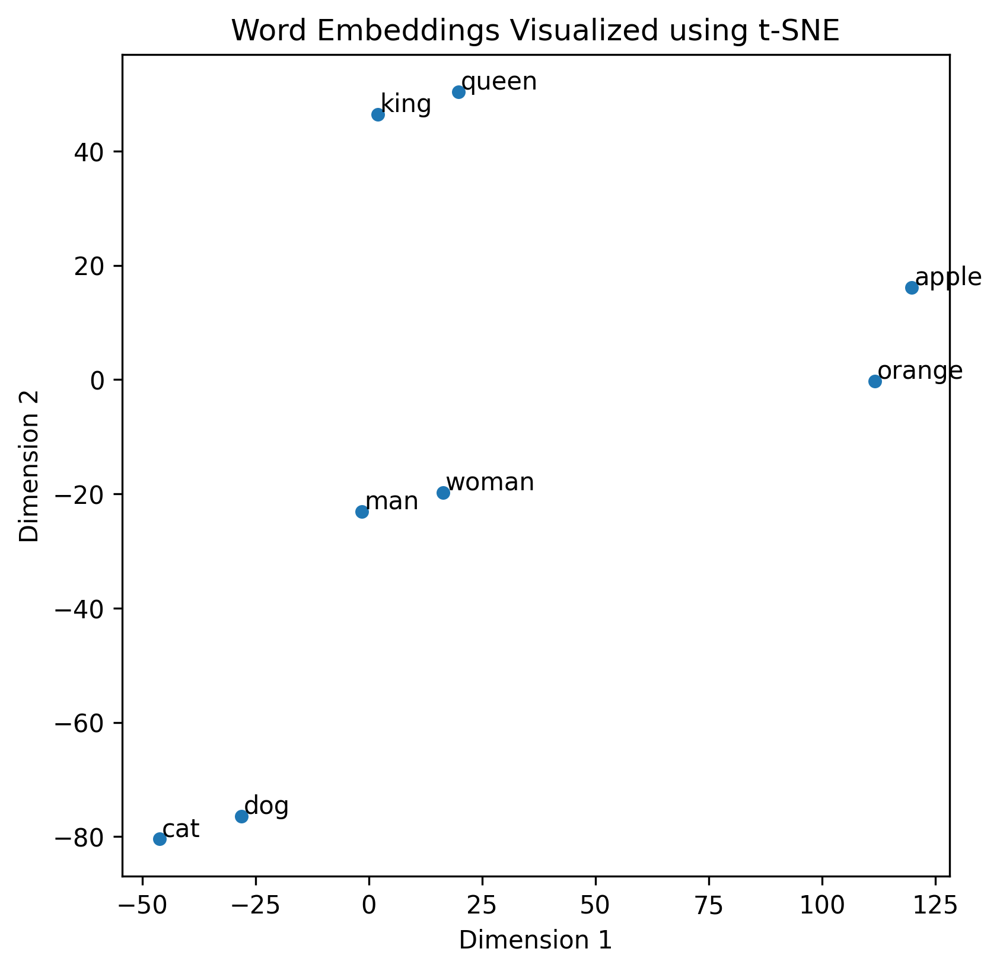

# 嵌入层 nn.Embedding() 详解和要点提醒（PyTorch）

> 在自然语言处理（NLP）任务中，我们需要把文本转换成一种机器能够“理解”的数字形式。通常，第一步是将文本进行分词（Tokenize），然后为每个词分配一个唯一的数字 ID，也就是 Token ID。这些 Token ID 可以输入到模型中，但需要明白的是，模型并不能直接从简单的数字中获取丰富的语义信息。类似于人类的认知，我们理解一个字或词并不是仅靠符号，而是其背后的含义。
>
> “那么，如何让模型真正理解这些词语背后的含义呢？”
>
> “既然一维的 Token ID 无法提供足够的信息，那就将其转换成更高维的向量，使其承载更丰富的语义信息，这就是嵌入层（Embedding Layer）的作用。”
>
> [代码文件下载](../Demos/20.%20嵌入层%20nn.Embedding()%20代码示例.ipynb)
>
> 在线链接：[Kaggle](https://www.kaggle.com/code/aidemos/20-nn-embedding) | [Colab](https://colab.research.google.com/drive/1BLgmxasxOD1HQGrI0L1sPlYG40iba9SY?usp=sharing)

## 目录

- [nn.Embedding 嵌入层](#nnembedding-嵌入层)
  - [参数](#参数)
  - [属性](#属性)
  - [方法](#方法)
     - [参数](#参数-1)
- [数学公式](#数学公式)
- [使用示例](#使用示例)
- [要点提醒](#要点提醒)
- [Q: 什么是语义？](#q-什么是语义)
- [可视化](#可视化)
   - [环境配置](#环境配置)
   - [导入](#导入)
   - [加载预训练模型](#加载预训练模型)
   - [准备文本数据](#准备文本数据)
   - [获取嵌入向量](#获取嵌入向量)
   - [使用 t-SNE 降维](#使用-t-sne-降维)
   - [画图](#画图)
- [参考链接](#参考链接)
- [附录](#附录)
   - [可视化完整代码](#可视化完整代码)

## nn.Embedding 嵌入层

> `torch.nn.Embedding(num_embeddings, embedding_dim, padding_idx=None, max_norm=None, norm_type=2.0, scale_grad_by_freq=False, sparse=False, _weight=None, _freeze=False, device=None, dtype=None)`
>
> A simple lookup table that stores embeddings of a fixed dictionary and size.
>
> 一个简单的查找表，用于存储固定大小的字典中每个词的嵌入向量。

### 参数

- **num_embeddings** (int): 嵌入字典的大小，即词汇表的大小 (vocab size)。
- **embedding_dim** (int): 每个嵌入向量的维度大小。
- **padding_idx** (int, 可选): 指定填充（`<PAD>`）对应的索引值。`padding_idx` 对应的嵌入向量在训练过程中不会更新，即梯度不参与反向传播。对于新构建的 `Embedding`，`padding_idx` 处的嵌入向量默认为全零，但可以手动更新为其他值。
- **max_norm** (float, 可选):  如果设置，嵌入向量的范数超过此值时将被重新归一化，使其范数等于 `max_norm`。
- **norm_type** (float, 可选): 用于计算 `max_norm` 的 p-范数，默认为 2，即计算 2 范数。
- **scale_grad_by_freq** (bool, 可选): 如果为 `True`，梯度将根据单词在 mini-batch 中的频率的倒数进行缩放，适用于高频词的梯度调整。默认为 `False`。
- **sparse** (bool, 可选): 如果设置为 `True`，则权重矩阵的梯度为稀疏张量，适合大规模词汇表的内存优化。

### 属性

- **weight** (Tensor): 模块的可学习权重，形状为 `(num_embeddings, embedding_dim)`，初始值从正态分布 `N(0, 1)` 中采样。

### 方法

> `from_pretrained(embeddings, freeze=True, padding_idx=None, max_norm=None, norm_type=2.0, scale_grad_by_freq=False, sparse=False)`
>
> Create Embedding instance from given 2-dimensional FloatTensor.
>
> 用于从给定的 2 维浮点张量（FloatTensor）创建一个 `Embedding` 实例，通俗来讲就是自定义二维的权重矩阵。

#### 参数

- **embeddings** (Tensor): 一个包含嵌入权重的 `FloatTensor`。第一个维度代表 `num_embeddings`（词汇表大小，vocab_size），第二个维度代表 `embedding_dim`（嵌入向量维度）。
- **freeze** (bool, 可选): 如果为 `True`，则嵌入矩阵在训练过程中保持不变，相当于设置 `embedding.weight.requires_grad = False`。默认值为 `True`。
- 其余参数参考之前定义。

## 数学公式

假设词汇表大小为 $V$，嵌入维度为 $D$，则嵌入层可以表示为一个矩阵 $E \in \mathbb{R}^{V \times D}$。

给定一个输入的 token ID 序列 $\{x_1, x_2, \dots, x_n\}$，嵌入层的输出为对应的嵌入向量序列 $\{E_{x_1}, E_{x_2}, \dots, E_{x_n}\}$，其中每个 $E_{x_i} \in \mathbb{R}^D$。

嵌入层接受 $x_i$ 作为输入，返回对应的行向量，公式如下：

$$
E(x_i) = E_{x_i}
$$

其中, $E$ 是嵌入矩阵, $x_i$ 是输入的 token ID, $E(x_i)$ 是对应的嵌入向量。

## 使用示例

思考一个问题：对于神经网络来说，什么是“符号”及其“背后的含义”？

答：**Token ID** 和 **Embedding**。

运行代码理解 `Embedding`：

```python
import torch
import torch.nn as nn

# 设置随机种子以确保结果可复现
torch.manual_seed(42)

# 定义嵌入层参数
num_embeddings = 5  # 假设词汇表中有 5 个 token
embedding_dim = 3   # 每个 token 对应 3 维嵌入向量

# 初始化嵌入层
embedding = nn.Embedding(num_embeddings, embedding_dim)

# 定义整数索引
input_indices = torch.tensor([0, 2, 4])

# 查找嵌入向量
output = embedding(input_indices)

# 打印结果
print("权重矩阵：")
print(embedding.weight.data)
print("\nEmbedding 输出：")
print(output)
```

**输出**：

```
权重矩阵：
tensor([[ 0.3367,  0.1288,  0.2345],
        [ 0.2303, -1.1229, -0.1863],
        [ 2.2082, -0.6380,  0.4617],
        [ 0.2674,  0.5349,  0.8094],
        [ 1.1103, -1.6898, -0.9890]])

Embedding 输出：
tensor([[ 0.3367,  0.1288,  0.2345],
        [ 2.2082, -0.6380,  0.4617],
        [ 1.1103, -1.6898, -0.9890]], grad_fn=<EmbeddingBackward0>)
```

在这个例子中，`input_indices = [0, 2, 4]`，嵌入层从权重矩阵中选择第 0、2 和 4 行，作为对应的嵌入表示。

可以看出，`nn.Embedding` 的核心功能就是根据索引从权重矩阵中查找对应的嵌入向量。

## 要点提醒

1. **嵌入矩阵就是权重矩阵**

   在 `nn.Embedding` 中，嵌入矩阵被视为模型的**可学习**参数 `weight`。在训练过程中，模型会根据损失函数调整嵌入矩阵，使其更好地表示词语的语义特征。

2. **`nn.Embedding` 实际上是一个查找表**

   输入接受的是索引，返回权重矩阵中对应索引的行。以下是一个嵌入层的简单实现：

   ```python
   class CustomEmbedding(nn.Module):
       def __init__(self, num_embeddings, embedding_dim):
           super(CustomEmbedding, self).__init__()
           self.weight = torch.nn.Parameter(torch.randn(num_embeddings, embedding_dim))
           
       def forward(self, indices):
           return self.weight[indices]  # 返回权重矩阵对应的行
   ```

3. **嵌入层与线性层的区别**

   嵌入层的权重矩阵形状为 `(num_embeddings, embedding_dim)`，即 `(输入维度, 输出维度)`，而线性层的权重矩阵形状为 `(output_dim, input_dim)`，即 `(输出维度, 输入维度)`，观察二者初始化时的差异：

   ```python
   # Embedding
   def __init__(self, num_embeddings, embedding_dim):
   	self.weight = torch.nn.Parameter(torch.randn(num_embeddings, embedding_dim))
   
   # Linear
   def __init__(self, input_dim, output_dim):
       self.weight = nn.Parameter(torch.randn(output_dim, input_dim))
       self.bias = nn.Parameter(torch.randn(output_dim))
   ```

   嵌入层用于将离散的输入（如 Token ID）映射到连续的嵌入向量空间；线性层则进行线性变换。二者 `forward()` 的区别：

   ```python
       # Embedding
       def forward(self, input):
           return self.weight[input]
   
       # Linear
       def forward(self, input):
           torch.matmul(input, self.weight.T) + self.bias
   ```

4. **`padding_idx` 的作用**

   假设在构造嵌入层时指定了 `padding_idx=0`，那么权重矩阵中第 0 行会被初始化为全零向量，并且在训练过程中不更新。

   **示例**：

   ```python
   import torch
   import torch.nn as nn
   
   # 定义嵌入层，指定 padding_idx=0
   embedding = nn.Embedding(num_embeddings=5, embedding_dim=3, padding_idx=0)
   
   # 打印权重矩阵
   print("权重矩阵：")
   print(embedding.weight.data)
   ```

   **输出**：

   ```
   权重矩阵：
   tensor([[ 0.0000,  0.0000,  0.0000],
           [-0.7658, -0.7506,  1.3525],
           [ 0.6863, -0.3278,  0.7950],
           [ 0.2815,  0.0562,  0.5227],
           [-0.2384, -0.0499,  0.5263]])
   ```

   可以看到，第 0 行是全零向量。

   **验证 `padding_idx` 对应的嵌入是否在训练过程中保持不变**：

   ```python
   import torch
   import torch.optim as optim
   
   # 注意之前设置了 padding_idx=0
   input_indices = torch.tensor([0, 2, 4])
   
   # 定义一个简单的损失函数
   loss_fn = nn.MSELoss()
   
   # 目标值
   target = torch.randn(3, 3)
   
   # 定义优化器
   optimizer = optim.SGD(embedding.parameters(), lr=0.1)
   
   # 清空之前的梯度
   optimizer.zero_grad()
   
   # 前向传播
   output = embedding(input_indices)
   
   # 计算损失
   loss = loss_fn(output, target)
   
   # 反向传播，注意此时不会更新权重
   loss.backward()
   
   # 查看梯度
   print("梯度：")
   print(embedding.weight.grad)
   
   # 打印权重矩阵
   print("权重矩阵：")
   print(embedding.weight.data)
   
   # 更新权重
   optimizer.step()
   
   # 打印权重矩阵更新后
   print("权重矩阵更新后:")
   print(embedding.weight.data)
   ```

   **输出**：

   ```python
   梯度：
   tensor([[ 0.0000,  0.0000,  0.0000],
           [ 0.0000,  0.0000,  0.0000],
           [-0.0395,  0.1529,  0.3742],
           [ 0.0000,  0.0000,  0.0000],
           [-0.0863,  0.0353,  0.2030]])
   原权重矩阵：
   tensor([[ 0.0000,  0.0000,  0.0000],
           [-0.7658, -0.7506,  1.3525],
           [ 0.6863, -0.3278,  0.7950],
           [ 0.2815,  0.0562,  0.5227],
           [-0.2384, -0.0499,  0.5263]])
   权重矩阵更新后:
   tensor([[ 0.0000,  0.0000,  0.0000],
           [-0.7658, -0.7506,  1.3525],
           [ 0.6903, -0.3430,  0.7576],
           [ 0.2815,  0.0562,  0.5227],
           [-0.2297, -0.0534,  0.5060]])
   ```

   可以看到，`padding_idx=0` 对应的梯度为零，即在训练过程中不会更新。

5. **使用预训练的嵌入向量**

   有时候，我们希望使用预训练的嵌入（如 GloVe、Word2Vec）来初始化嵌入层。这时候可以使用 `from_pretrained` 方法：

   ```python
   import torch
   import torch.nn as nn
   
   # 设置随机种子以确保结果可复现
   torch.manual_seed(42)
   
   # 假设我们有一个预训练的嵌入矩阵，这里只是随机初始化
   pretrained_embeddings = torch.tensor(torch.randn(5, 3))
   
   # 使用 from_pretrained 方法创建嵌入层，不冻结权重层（默认冻结）
   embedding = nn.Embedding.from_pretrained(pretrained_embeddings, freeze=False)
   
   # 查看权重矩阵
   print("权重矩阵：")
   print(embedding.weight.data)
   ```

   **输出**：

   ```
   权重矩阵：
   tensor([[ 0.3367,  0.1288,  0.2345],
           [ 0.2303, -1.1229, -0.1863],
           [ 2.2082, -0.6380,  0.4617],
           [ 0.2674,  0.5349,  0.8094],
           [ 1.1103, -1.6898, -0.9890]])
   ```

   现在设置一下 `padding_idx`：

   ```python
   embedding = nn.Embedding.from_pretrained(pretrained_embeddings, freeze=False, padding_idx=0)
   
   # 查看权重矩阵
   print("权重矩阵：")
   print(embedding.weight.data)
   ```

   输出：

   ```
   权重矩阵：
   tensor([[ 0.3367,  0.1288,  0.2345],
           [ 0.2303, -1.1229, -0.1863],
           [ 2.2082, -0.6380,  0.4617],
           [ 0.2674,  0.5349,  0.8094],
           [ 1.1103, -1.6898, -0.9890]])
   ```

   **注意**：虽然指定了 `padding_idx=0`，但预训练的嵌入矩阵第 0 行不会自动变为零向量。

---

上文“狭义”地解读了与 Token IDs 一起出现的 Embedding，这个概念在自然语言处理（NLP）中有着更具体的称呼：**词嵌入**（Word Embedding）。

## Q: 什么是语义？

举个简单的例子来理解“语义”关系：像“猫”和“狗”在向量空间中的表示应该非常接近，因为它们都是宠物；“男人”和“女人”之间的向量差异可能代表性别的区别。此外，不同语言的词汇，如“男人”（中文）和“man”（英文），如果在相同的嵌入空间中，它们的向量也会非常接近，反映出跨语言的语义相似性。同时，【“女人”和“woman”（中文-英文）】与【“男人”和“man”（中文-英文）】之间的向量差异也可能非常相似。

## 可视化

### 环境配置

假设已经安装好了 PyTorch。

```bash
pip install transformers scikit-learn matplotlib seaborn
```

### 导入

```python
import torch
from transformers import AutoTokenizer, AutoModel
import matplotlib.pyplot as plt
import numpy as np
import seaborn as sns
from sklearn.manifold import TSNE
```

### 加载预训练模型

```python
# 选择预训练的 BERT 模型
model_name = 'bert-base-uncased'  # 对于中文模型，可使用 'bert-base-chinese'

# 加载分词器和模型
tokenizer = AutoTokenizer.from_pretrained(model_name)
model = AutoModel.from_pretrained(model_name)
```

### 准备文本数据

```python
words = ['cat', 'dog', 'apple', 'orange', 'king', 'queen', 'man', 'woman']
```

对于中文模型：

```python
words = ['猫', '狗', '苹果', '橙子', '国王', '王后', '男人', '女人']
```

### 获取嵌入向量

实际上可以从模型中获取两种 Embedding：词嵌入（Word Embedding）和 句子嵌入（Sentence Embedding），分别对应方法一和方法二。

**方法一：使用 BERT 的输入嵌入层**

```python
def get_input_embeddings(tokenizer, model, words):
    # 获取词表中的索引
    word_ids = [tokenizer.convert_tokens_to_ids(word) for word in words]
    # 从嵌入层提取对应的向量
    embeddings = model.embeddings.word_embeddings.weight[word_ids]
    return embeddings.detach().numpy()
```

**方法二：使用 BERT 的输出嵌入**

```python
def get_output_embeddings(tokenizer, model, words):
    embeddings = []
    for word in words:
        inputs = tokenizer(word, return_tensors='pt')
        outputs = model(**inputs)
        # 获取 [CLS] 向量
        cls_embedding = outputs.last_hidden_state[0][0]  # [CLS] 的向量
        embeddings.append(cls_embedding.detach().numpy())
    return np.array(embeddings)
```

这里我们使用方法一：

```python
embeddings = get_input_embeddings(tokenizer, model, words)
```

### 使用 t-SNE 降维

```python
# 设置 t-SNE 参数
tsne = TSNE(n_components=2, perplexity=2, n_iter=1000, random_state=42)

# 执行降维
embeddings_2d = tsne.fit_transform(embeddings)
```

### 画图

```python
plt.figure(figsize=(10, 10))
sns.scatterplot(x=embeddings_2d[:, 0], y=embeddings_2d[:, 1])

# 添加注释
for i, word in enumerate(words):
    plt.text(embeddings_2d[i, 0]+0.5, embeddings_2d[i, 1]+0.5, word)

plt.title('Word Embeddings Visualized using t-SNE')
plt.xlabel('Dimension 1')
plt.ylabel('Dimension 2')
plt.show()
```

**输出**：



## 参考链接
[Embedding - Docs](https://pytorch.org/docs/stable/generated/torch.nn.Embedding.html)

## 附录

### 可视化完整代码

```python
import torch
from transformers import AutoTokenizer, AutoModel
import matplotlib.pyplot as plt
import numpy as np
import seaborn as sns
from sklearn.manifold import TSNE

# 选择预训练的 BERT 模型
model_name = 'bert-base-uncased'  # 对于中文模型，可使用 'bert-base-chinese'

# 加载分词器和模型
tokenizer = AutoTokenizer.from_pretrained(model_name)
model = AutoModel.from_pretrained(model_name)

# 要可视化的词语列表
words = ['cat', 'dog', 'apple', 'orange', 'king', 'queen', 'man', 'woman']
# words = ['猫', '狗', '苹果', '橙子', '国王', '王后', '男人', '女人']

def get_input_embeddings(tokenizer, model, words):
    # 获取词表中的索引
    word_ids = [tokenizer.convert_tokens_to_ids(word) for word in words]
    # 从嵌入层提取对应的向量
    embeddings = model.embeddings.word_embeddings.weight[word_ids]
    return embeddings.detach().numpy()

def get_output_embeddings(tokenizer, model, words):
    embeddings = []
    for word in words:
        inputs = tokenizer(word, return_tensors='pt')
        outputs = model(**inputs)
        # 获取 [CLS] 向量
        cls_embedding = outputs.last_hidden_state[0][0]  # [CLS] 的向量
        embeddings.append(cls_embedding.detach().numpy())
    return np.array(embeddings)

# 获取输入嵌入向量
embeddings = get_input_embeddings(tokenizer, model, words)

# 降维处理
tsne = TSNE(n_components=2, perplexity=2, n_iter=1000, random_state=42)
embeddings_2d = tsne.fit_transform(embeddings)

# 可视化
plt.figure(figsize=(10, 10))
sns.scatterplot(x=embeddings_2d[:, 0], y=embeddings_2d[:, 1])

for i, word in enumerate(words):
    plt.text(embeddings_2d[i, 0]+0.5, embeddings_2d[i, 1]+0.5, word)

plt.title('Word Embeddings Visualized using t-SNE')
plt.xlabel('Dimension 1')
plt.ylabel('Dimension 2')
plt.show()
```

