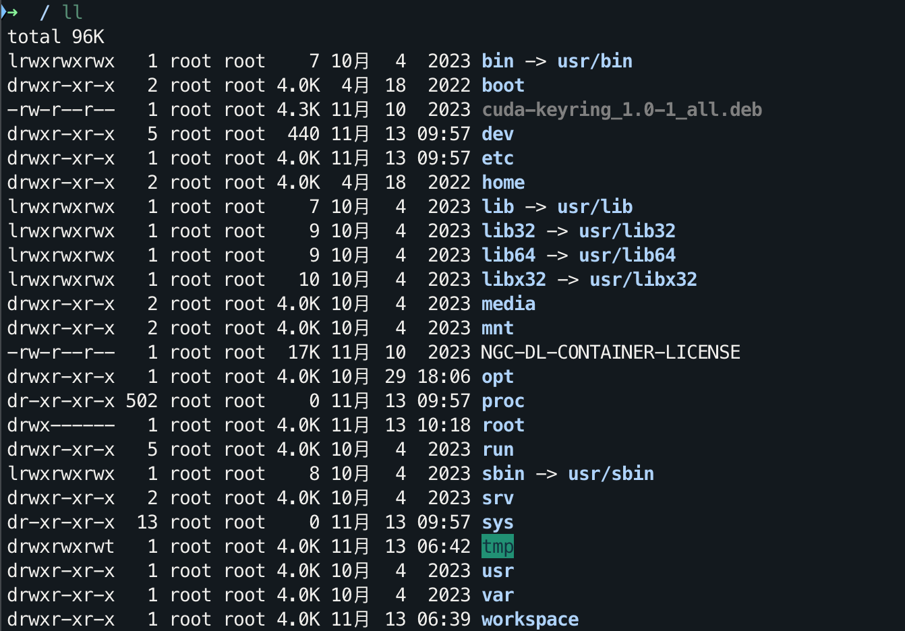
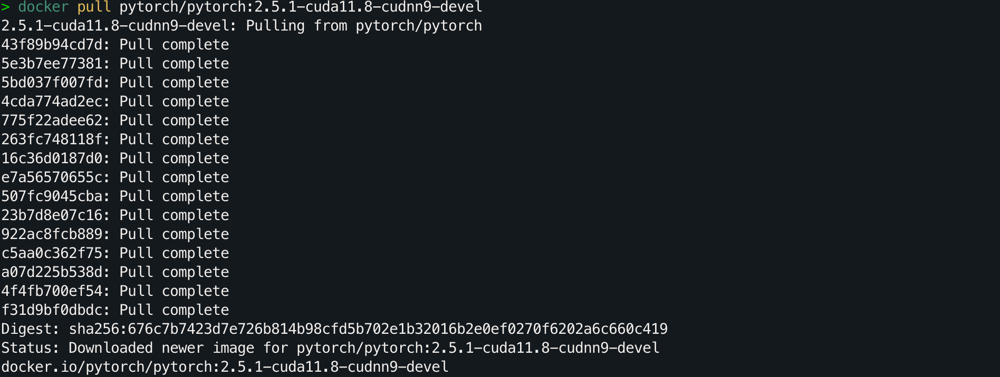

# 使用 Docker 快速配置深度学习环境（Linux）

> 在编写项目配置文档时，随着必装软件的增多，文档变得冗长而复杂。经过一番思考，我决定制作一个基础的镜像文件，供大家快速安装使用。
>
> 本文仅介绍命令行的配置和安装，图形界面的逻辑是一致的。

## 目录

- [镜像介绍](#镜像介绍)
  - [安装清单](#安装清单)

- [快速配置环境（两行命令）](#快速配置环境两行命令)
  - [1. 获取镜像（三选一）](#1-获取镜像三选一)
    - [国内镜像版](#国内镜像版)
    - [🪜科学上网版（直连）](#科学上网版直连)
    - [本地（网盘下载）](#本地网盘下载)
  - [2. 运行容器](#2-运行容器)
- [安装 Docker Engine](#安装-docker-engine)
  - [卸载旧版本](#卸载旧版本)
  - [使用 apt 仓库安装](#使用-apt-仓库安装)
- [GPU 驱动安装](#gpu-驱动安装)
- [安装 NVIDIA Container Toolkit](#安装-nvidia-container-toolkit)
- [拉取并运行 PyTorch Docker 镜像](#拉取并运行-pytorch-docker-镜像)

## 镜像介绍

所有版本都预装了 `sudo`、`pip`、`conda`、`wget`、`curl` 和 `vim` 等常用工具，并已经配置好 `pip` 和 `conda` 的国内镜像源。同时，集成了基础的 `zsh` 和一些实用的命令行插件，如命令自动补全和 `z` 跳转等。此外，已预装 `jupyter notebook` 和 `jupyter lab`，方便进行深度学习开发，容器内的中文显示已优化，不会出现乱码问题。

**Base** 版本基于 [pytorch/pytorch:2.5.1-cuda11.8-cudnn9-devel](https://hub.docker.com/layers/pytorch/pytorch/2.5.1-cuda11.8-cudnn9-devel/images/sha256-676c7b7423d7e726b814b98cfd5b702e1b32016b2e0ef0270f6202a6c660c419?context=explore)，默认 `python` 版本为 3.11.10，可以通过 `conda install python==版本号` 直接修改版本。界面如下：



> 如果想修改命令行风格，基于关键词「oh-my-zsh」进行搜寻。

**链接**：

- [quickstart](https://hub.docker.com/repository/docker/hoperj/quickstart/general)，位于 Docker Hub，对应于下方的 pull 命令。
- [base.tar - 百度云盘](https://pan.baidu.com/s/1RJDfc5ouTDeBFhOdbIAHNg?pwd=bdka)，直接下载，跳过科学版的命令进行配置。

### 安装清单

<details>
    <summary> <strong>Base</strong> </summary>

**Apt 安装**：

- `wget` 和 `curl`：命令行下载工具。
- `vim` 和 `nano`：文本编辑器。
- `git`：版本控制工具。
- `zip` 和 `unzip`：文件压缩和解压缩工具，用于 `.zip` 文件的压缩和解压。
- `htop`：系统监控工具，显示内存、CPU、进程等资源使用情况。
- `tmux` 和 `screen`：会话管理工具，在远程服务器上使用 SSH 时保持会话活跃。
- `build-essential`：包含了 `gcc`、`g++`、`make` 等基本的编译工具，方便编译源码。
- `net-tools`：包括网络工具如 `ifconfig`，用于检查网络连接。
- `ssh`：安装 SSH 客户端以便远程连接。
- `rsync`：文件同步工具。
- `tree`：以树状结构显示文件和目录。
- `lsof`：用于查看当前系统打开的文件。

**pip 安装**：

- `jupyter notebook`：交互式笔记本环境。
- `jupyter lab`：Jupyter Notebook 的增强版本，提供更丰富的功能和模块化界面。
- `virtualenv`：Python 虚拟环境管理工具，便于隔离和管理项目依赖，也可以直接用 conda。
- `tensorboard`：深度学习可视化工具，用于实时监控训练过程中的损失、准确率等指标。

**插件**：

- `zsh-autosuggestions`：提供命令自动补全建议。
- `zsh-syntax-highlighting`：提供语法高亮功能，便于查看输入的命令是否正确。
- `z`: 目录跳转工具。

</details>

## 快速配置环境（两行命令）

> 如果遇到报错，查阅《[Docker 基础命令介绍和常见报错解决](https://github.com/Hoper-J/AI-Guide-and-Demos-zh_CN/blob/master/Guide/Docker%20基础命令介绍和常见报错解决.md#解决常见报错)》。

### 1. 获取镜像（三选一）

假设你已经安装并配置好了 Docker，那么只需两行命令即可完成深度学习的环境配置，以 **Base** 镜像为例，拉取：

#### 国内镜像版

```bash
sudo docker pull dockerpull.org/hoperj/quickstart:base-torch2.5.1-cuda11.8-cudnn9-devel
```

#### 🪜科学上网版（直连）

```bash
sudo docker pull hoperj/quickstart:base-torch2.5.1-cuda11.8-cudnn9-devel
```

> [!note]
>
> 如果镜像有更新版本，可通过 `docker pull` 拉取最新镜像。

#### 本地（网盘下载）

> 通过[百度云盘](https://pan.baidu.com/s/1RJDfc5ouTDeBFhOdbIAHNg?pwd=bdka)下载文件（阿里云盘不支持分享大的压缩文件）。

假设 `base.tar` 被下载到了 `~/Downloads` 中，那么切换至对应目录：

```bash
cd ~/Downloads
```

然后加载镜像：

```bash
sudo docker load -i base.tar
```

### 2. 运行容器

```bash
sudo docker run --gpus all -it --name ai hoperj/quickstart:base-torch2.5.1-cuda11.8-cudnn9-devel /bin/zsh
```

如果需要使用 Jupyter，可以使用以下命令：

```bash
sudo docker run --gpus all -it --name ai -p 8888:8888 hoperj/quickstart:base-torch2.5.1-cuda11.8-cudnn9-devel /bin/zsh
```

---

**如果还没有安装 Docker，继续阅读，可以根据实际情况通过目录快速跳转。**

## 安装 Docker Engine

> 对于图形界面来说，可以跳过下面的命令直接安装 Desktop 版本（其中会提供 Docker Engine），这是最简单的方法。根据系统访问：
>
> - [Linux](https://docs.docker.com/desktop/setup/install/linux/)
> - [Mac](https://docs.docker.com/desktop/setup/install/mac-install/)
> - [Windows](https://docs.docker.com/desktop/setup/install/windows-install/)
>
> 以下是命令行的安装命令，在 Ubuntu 上运行，其余系统参考[官方文档](https://docs.docker.com/engine/install)。

### 卸载旧版本

在安装 Docker Engine 之前，需要卸载所有有冲突的包，运行以下命令：

```bash
for pkg in docker.io docker-doc docker-compose docker-compose-v2 podman-docker containerd runc; do sudo apt-get remove $pkg; done
```

`apt-get` 可能会报告没有安装这些包，忽略即可。

注意，卸载 Docker 的时候，存储在 /var/lib/docker/ 中的镜像、容器、卷和网络不会被自动删除。如果你想从头开始全新安装，请阅读 [Uninstall Docker Engine 部分](https://docs.docker.com/engine/install/ubuntu/#uninstall-docker-engine)。

### 使用 `apt` 仓库安装

首次安装 Docker Engine 之前，需要设置 Docker 的 `apt` 仓库。

1. **设置 Docker 的 `apt` 仓库。**

   ```bash
   # 添加 Docker 的官方 GPG 密钥：
   sudo apt-get update
   sudo apt-get install ca-certificates curl
   sudo install -m 0755 -d /etc/apt/keyrings
   sudo curl -fsSL https://download.docker.com/linux/ubuntu/gpg -o /etc/apt/keyrings/docker.asc
   sudo chmod a+r /etc/apt/keyrings/docker.asc
   
   # 将仓库添加到 Apt 源：
   echo \
     "deb [arch=$(dpkg --print-architecture) signed-by=/etc/apt/keyrings/docker.asc] https://download.docker.com/linux/ubuntu \
     $(. /etc/os-release && echo "$VERSION_CODENAME") stable" | \
     sudo tee /etc/apt/sources.list.d/docker.list > /dev/null
   sudo apt-get update
   ```

   > [!note]
   >
   > 如果你使用的是 Ubuntu 的衍生发行版，例如 Linux Mint，可能需要使用 `UBUNTU_CODENAME` 而不是 `VERSION_CODENAME`。

2. **安装 Docker 包。**

   ```console
   sudo apt-get install docker-ce docker-ce-cli containerd.io docker-buildx-plugin docker-compose-plugin
   ```

3. **通过运行 `hello-world` 镜像来验证安装是否成功：**

   ```console
   sudo docker run hello-world
   ```

   这个命令会下载测试镜像并运行，如果你看到以下输出，那么恭喜你安装成功：
   
   

## GPU 驱动安装

如果需要使用 GPU 的话，先安装适用于你的系统的 NVIDIA GPU 驱动程序，访问任一链接进行：

- [NVIDIA CUDA Installation Guide for Linux](https://docs.nvidia.com/cuda/cuda-installation-guide-linux/)
- [Official Drivers](https://www.nvidia.com/en-us/drivers/)

这部分配置文章很多，偷个懒 :) 就不开新环境演示了，下面讲点可能不同的。

## 安装 NVIDIA Container Toolkit

> 为了在 Docker 容器中使用 GPU，需要安装 NVIDIA Container Toolkit。
>
> 注意，我们现在不再需要安装 [nvidia-docker](https://github.com/NVIDIA/nvidia-docker?tab=readme-ov-file)，官方在 2023.10.20 指出其已被 [NVIDIA Container Toolkit](https://github.com/NVIDIA/nvidia-container-toolkit) 所取代，过去的配置命令可能已不再适用。

以下命令使用 Apt 完成，Yum 等其他命令访问参考链接：[Installing the NVIDIA Container Toolkit](https://docs.nvidia.com/datacenter/cloud-native/container-toolkit/latest/install-guide.html#installing-with-apt)。

1. **设置仓库和 GPG 密钥**

   设置 NVIDIA 的软件源仓库和 GPG 密钥，确保我们可以从官方源安装 NVIDIA Container Toolkit。

   ```bash
   curl -fsSL https://nvidia.github.io/libnvidia-container/gpgkey | sudo gpg --dearmor -o /usr/share/keyrings/nvidia-container-toolkit-keyring.gpg \
     && curl -s -L https://nvidia.github.io/libnvidia-container/stable/deb/nvidia-container-toolkit.list | \
       sed 's#deb https://#deb [signed-by=/usr/share/keyrings/nvidia-container-toolkit-keyring.gpg] https://#g' | \
       sudo tee /etc/apt/sources.list.d/nvidia-container-toolkit.list。
   ```

2. **安装 NVIDIA Container Toolkit**

   ```bash
   sudo apt-get update
   sudo apt-get install -y nvidia-container-toolkit
   ```

3. **配置 Docker**

   使用 `nvidia-ctk` 工具将 NVIDIA 容器运行时配置为 Docker 的默认运行时。

   ```bash
   sudo nvidia-ctk runtime configure --runtime=docker
   ```

4. **重启 Docker**

   ```bash
   sudo systemctl restart docker
   ```

## 拉取并运行 PyTorch Docker 镜像

> 以下是项目最初镜像的配置命令，提供简单的流程供参考。

1. **拉取镜像**

   ```bash
   sudo docker pull pytorch/pytorch:2.0.1-cuda11.8-cudnn8-devel
   ```

   

2. **运行镜像**

   ```bash
   sudo docker run --gpus all -it pytorch/pytorch:2.0.1-cuda11.8-cudnn8-devel
   ```

3. **检查 GPU**

   在容器内运行：

   ```bash
   nvidia-smi
   ```

   如果正确显示代表成功。不过对于实际使用来说，还需要了解基础命令和报错的解决方法。使用 `Ctrl + D` 或者命令行输入 `exit` 并回车退出容器，继续阅读《[Docker 基础命令介绍和常见报错解决](https://github.com/Hoper-J/AI-Guide-and-Demos-zh_CN/blob/master/Guide/Docker%20基础命令介绍和常见报错解决.md)》。

