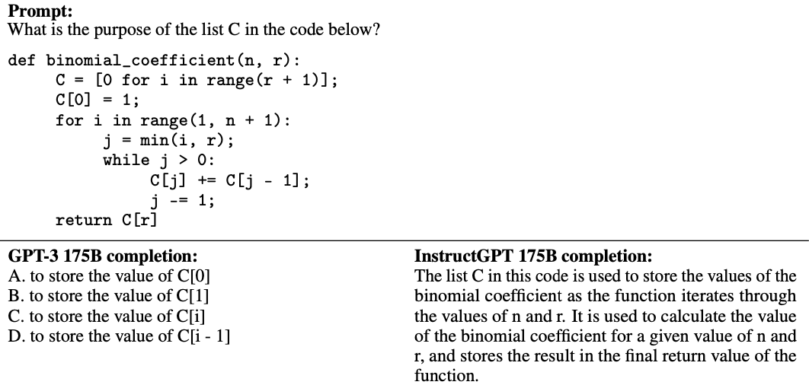
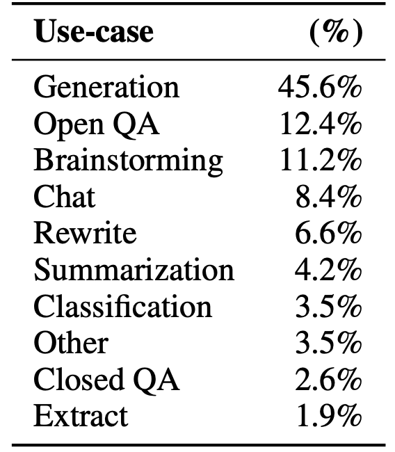
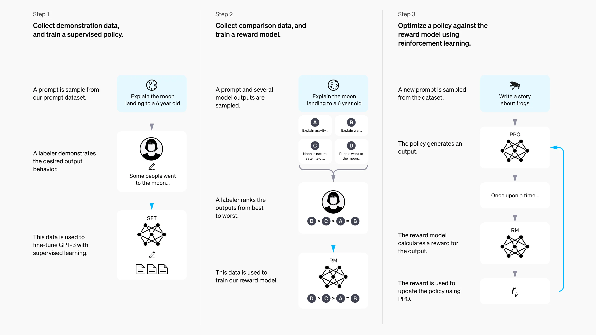

# InstructGPT

**Training language models to follow instructions with human feedback**
Long Ouyang et al. | [PDF](https://arxiv.org/pdf/2203.02155) | [精简版](https://openai.com/index/instruction-following/) | OpenAI | 2022.03

> **学习 & 参考资料**
>
> - **相关文章**
>
>   - [Transformer 论文精读](./Transformer%20论文精读.md)
>   - [GPT 论文精读](./GPT%20论文精读.md)
>
> - **机器学习**
>
>   —— 李宏毅老师的 B 站搬运视频
>
>   - [ChatGPT (可能)是怎么炼成的](https://www.bilibili.com/video/BV1TD4y137mP/?p=6&share_source=copy_web&vd_source=e46571d631061853c8f9eead71bdb390)
>
> - **论文逐段精读**
>
>   —— 沐神的论文精读合集
>
>   - [InstructGPT 论文精读【论文精读·48】](https://www.bilibili.com/video/BV1hd4y187CR/?share_source=copy_web&vd_source=e46571d631061853c8f9eead71bdb390)
>
> 这是一篇重要的文章，在 [ChatGPT](https://openai.com/index/chatgpt/) 的 Method 中有提及：
>
> “We trained this model using Reinforcement Learning from Human Feedback (RLHF), using the same methods as [InstructGPT⁠](https://openai.com/index/instruction-following/), but with slight differences in the data collection setup. ”
>

InstructGPT 基于 GPT-3（175B 版本） 进行微调，引入了一些微调和对齐的实验细节，是 GPT-3 到 ChatGPT 的重要环节。

## 动机

无论是小说还是电影，人们对 AI 的期待都是希望它能成为真正的助手，帮助我们高效地完成各类任务。然而，早期的 GPT 系列（如 GPT-1、GPT-2、GPT-3）由于主要训练目标是生成/预测下一个 token，它们在很多情况下生成的内容并不总是符合用户实际需求。也就是说，模型倾向于“继续写作”而非精准响应指令，这就引出了一个需要解决的问题——如何实现模型与人类意图的对齐（alignment）。

> 对齐的目标是打造一个“与人类意图一致的新版本 GPT-3”，具体要求为[^1]：
>
> - **Helpful（有帮助的）**：能帮助用户解决问题或完成任务。
>
>   - **反例**
>
>     传统预训练语言模型并不能直接产生人类所期望的回答[^2]：GPT-3 以文字接龙（language modeling）方式生成回答，而非遵循指令。
>
>     
>
>     在相同的 prompt 下，InstructGPT 在「回答问题」，而 GPT-3 在「续写问题」。
>
>     
>
> - **Truthful（真实的）**：不捏造信息或误导用户（幻觉问题）。
>
> - **Harmless（无害的）**：不对人或环境造成生理、心理或社会伤害。
>
> [^1]: [OpenAI's InstructGPT: Aligning Language Models with Human Intent](https://www.youtube.com/watch?v=QGpaBWOaHQI).

## 数据集

### 数据来源

- **标注人员编写的提示**

  在初始阶段，为了训练第一个 InstructGPT 模型，研究团队专门聘请了标注人员来编写指令式（instruction-like）提示，因为这种类型的提示在常规 GPT-3 模型的 API 数据中并不常见。

  要求标注人员编写以下三种类型的提示：

  - **普通（Plain）**：编写任意任务，需要确保任务多样性。

  - **少样本（Few-shot）**：提供一条指令以及多个问/答（query/response）示例对。

  - **基于用户（User-based）**：根据 OpenAI API 等候列表用户的应用需求，设计相关任务提示。

    > [OpenAI ChatGPT API Waitlist](https://share.hsforms.com/1u4goaXwDRKC9-x9IvKno0A4sk30) 中有一个必填的栏目 “Are there specific ideas you're excited to build with the ChatGPT API?” ，即“你有什么特别想用 ChatGPT API 实现的想法吗？”

  > [!tip]
  >
  > 论文第 7 页的 3.4「Human data collection」 和第 36 页附录 B「Additional human data collection details」详细的阐述了标注人员招聘，指导、任务分配以及数据收集流程等，如果有实际需要可以参考。

- **API 收集的提示**

  > *“Our prompt dataset consists primarily of text prompts submitted to the OpenAI API, specifically those using an earlier version of the InstructGPT models (trained via supervised learning on a subset of our demonstration data) on the Playground interface.”*

  早期的 InstructGPT 模型被部署到 [Playground](https://beta.openai.com/playground) 中（新用户注册后会赠送一些 API 额度），当时用户和 InstructGPT 模型交互时会收到通知，告知其数据可能被用于模型的进一步训练（不包含来自生产环境的 API 用户数据）。

  收集到的数据做以下处理：

  1. **去重**：通过启发式方法检测并删除长前缀相同的提示。
  2. **限制提示数量**：每个用户的提示最多 200 条。
  3. **数据集划分**：根据用户 ID 划分为训练、验证和测试集，确保「验证/测试集」和「训练集」不存在相同用户（减少可能的数据泄露，因为同一用户可能会重复的询问相同主题的问题）。
  4. **过滤敏感信息**：如检测到个人身份信息（personally identifiable information，PII）会去除。

### 数据构建

研究团队基于上述提示数据构建了三类数据集，用于不同训练阶段：

| 数据集类型 | 数据规模 | 数据来源                        | 用途             |
| ---------- | -------- | ------------------------------- | ---------------- |
| **SFT**    | 12,725   | 标注人员 (11,295) + API (1,430) | 有监督微调       |
| **RM**     | 33,207   | 标注人员 (6,623) + API (26,584) | 奖励模型训练     |
| **PPO**    | 31,144   | 完全来自 API                    | 强化学习策略优化 |

### 数据分布和示例

> **表 1**
>
> 

上表展示了 API 数据集中提示的使用类别分布，其中生成任务占比最高，为 45.6%。论文在附录 A.2.1 提供了一些提示示例，摘选部分进行理解：

| 用例类型                        | 样例                                                         |
| ------------------------------- | ------------------------------------------------------------ |
| Generation **生成**        | Write a short story where a brown bear to the beach, makes friends with a seal, and then return home. 写一篇关于一只棕熊去海滩与海豹交朋友然后回家的短篇故事。 |
| Open QA **开放式问答**     | Who built the statue of liberty? 自由女神像是由谁建造的？ |
| Brainstorming **头脑风暴** | What are 10 science fiction books I should read next? 我接下来应该阅读的 10 本科幻小说有哪些？ |
| Chat **聊天**              | The following is a conversation with an AI assistant. The assistant is helpful, creative, clever, and very friendly.  Human: Hello, who are you?  AI: I am an AI created by OpenAI. How can I help you today? Human: I’d like to cancel my subscription.  AI: 一段对话 |
| Rewrite **重写**           | Translate this sentence to Spanish:  <English sentence> 将以下句子翻译成西班牙语：  <英文句子> |
| Summarization **摘要**     | Summarize this for a second-grade student:  {text} 为二年级学生总结以下内容：  {文本} |
| Classification **分类**    | {java code}  What language is the code above written in? 上面的代码是用什么语言编写的？ |
| Other **其他**             | start with where 从哪里开始                             |
| Closed QA **封闭式问答**   | Answer the following question: What shape is the earth?  A) A circle  B) A sphere  C) An ellipse  D) A plane 一个选择题。 |
| Extract **抽取**           | Extract all place names from the article below:  {news article} 从下面的文章中提取所有的地名：  {新闻文章} |

## 模型

InstructGPT 从 GPT-3 的预训练模型（1.3B、6B、175B）开始，通过三阶段训练实现指令对齐。

### 训练概览

> 
>

先通过图示来了解模型的训练过程，分三步（从左到右）：

1. **收集示范数据并进行有监督微调（SFT）**

   - 从提示数据集（prompt dataset）中抽取提示（如“向6岁儿童解释月球登陆”）。

   - 标注人员根据提示撰写期望的答案（如“有些人去过月球……”）

     > 

   - 这些示范数据被用来有监督微调 GPT-3 模型。

2. **收集对比数据并训练奖励模型（RM）**

   - 针对同一提示，生成多个模型输出（如图中 A、B、C、D 的例子）。

   - 标注人员根据输出质量对这些结果进行排序，从最优到最差（如 D > C > A = B）。

   - 这些对比数据被用来训练一个奖励模型，让它能够正确给输出打分。

     > 询问 ChatGPT 的时候，期望的回答通常是答案，而不是续写这个问题：
     >
     > 
     >
     > 所以在偏好（输出质量）上，「玉山」> 「谁来告诉我呀」。

3. **强化学习（RL）微调**

   - 从提示数据集中抽取新的提示（如“写一个关于青蛙的故事”）。

   - 模型生成输出。

   - 奖励模型对生成的输出进行评分（作为奖励信号）。

   - 采用近端策略优化（PPO）算法对模型进行梯度更新，使其更好地符合人类偏好。

     > 下图中的增强式学习（Reinforcement learning）就是强化学习。
     >
     > - **最初（GPT）**
     >
     >   
     >
     > - **强化学习后（ChatGPT）**
     >
     >   

> [!note]
>
> 步骤 2 和 3 可循环执行：用当前最优策略收集新对比数据，训练更新的 RM 和策略"

[^2]: [来自于李宏毅老师「ChatGPT 是怎么炼成的」课件](https://docs.google.com/presentation/d/1vDT11ec_nY6P0o--NHq9col5XEE4tHBw/edit#slide=id.p14)

### 训练相关

#### 有监督微调（Supervised Fine-tuning, SFT）

- **数据来源**：标注人员为不同提示（prompt）提供高质量的示范答案，总共 12,725 条演示数据（提示 + 人工答案）。

- **训练方式**：在 GPT-3 预训练模型上用示范数据进行有监督微调。

- **训练超参**：
  - 经过 16 个 epoch 的训练。
  
  - 使用余弦学习率衰减（cosine learning rate decay）。
  
  - 残差 dropout（residual dropout）率为 0.2。
  
- **模型选择**：根据验证集上的奖励模型（RM）得分进行最终的 SFT 模型选择。

- **发现**：这个数据量比较少，所以验证损失在第 1 个 epoch 后就出现了过拟合，但更多 epoch 的训练能提升后续 RM 的分数和人类偏好评分（SFT 后并非直接放进生产环境部署，而是作为下一步的初始模型）。

#### 奖励建模（Reward Modeling, RM）

从移除 unembedding layer 的 SFT 模型开始，训练一个奖励模型（Reward Model） ，接受提示（prompt）和回答（response）作为输入，输出一个标量分数。

- **模型规格**：论文使用 **6B 参数** 的 RM（175B 的 RM 训练可能不稳定）。

- **数据来源**：对同一提示生成 K=4~9 条回答，标注人员对其进行排序，这一排序可以转化为 $\binom{K}{2}$ 组对比数据。

  > [!tip]
  >
  > $\binom{K}{2}$ 也可以写成 $C_K^2$ 或者 $C(K, 2)$, 表示从 $K$ 个元素中选出 2 个元素的组合数：
  > 
  > $$C_k^2 = \binom{K}{2} = \frac{K!}{2!(K-2)!} = \frac{K(K-1)}{2}$$
  > 
  > 恢复一下久远的中学记忆：
  >
  > - $K = 4$: 
  > 
  >   $$C_4^2 = \binom{4}{2} = \frac{4 \cdot 3}{2} = 6$$
  >
  > - $K = 9$: 
  > 
  >   $$C_{9}^2 = \binom{9}{2} = \frac{9 \cdot 8}{2} = 36$$
  >
  > **注意**: $K = 9$ 比 $K=4$ 多了 30 对数据。

- **损失函数**：采用二元排序损失（pairwise ranking loss）：

  $`\text{loss}(\theta) = -\frac{1}{\binom{K}{2}} \mathbb{E}_{(x, y_w, y_l) \sim \mathcal{D}} \left[\log \sigma \left(r_\theta(x, y_w) - r_\theta(x, y_l)\right)\right]`$
  
  其中：

  - $r_\theta(x, y)$: 奖励模型对「提示 $x$、回答 $y$」的打分，分值高表示该回答（给定提示）更符合人类偏好，分值低则表示不够好。
    - 对 $(x, y_w)$ 和 $(x, y_l)$ 这两对进行。
  - $y_w$ 和 $y_l$: 分别代表在对比中更受偏好与不受偏好的回答。
  - $\mathcal{D}$: (提示, 回答偏好对) 数据集，包含各种 $(x, y_w, y_l)$ 三元组，表示对同一提示 $x$ 下的成对答案偏好信息。
  - $(x, y_w, y_l) \sim \mathcal{D}$: 从数据集 $\mathcal{D}$ 中随机抽取三元组，训练会对所有数据求期望 ($\mathbb{E}$)。
  - 负号 $-$ 与对数 $\log$  ：这两一组合出现就有了「负对数似然/交叉熵损失」的影子。如果模型打分正确，使得 $r_\theta(x, y_w) - r_\theta(x, y_l) \gg 0$, 则 $\sigma(\dots)\approx 1$, $\log(\dots)\approx 0$, 损失较小，反之如果排序不正确，损失会增大。
    - $\sigma(\cdot)$: sigmoid 函数，公式为 $\sigma(z) = \frac{1}{1 + e^{-z}}$。将打分差 $r_\theta(x, y_w) - r_\theta(x, y_l)$ 映射到 $(0, 1)$ 区间, $\sigma(r_\theta(x, y_w) - r_\theta(x, y_l))$ 可以看作 “模型判断 $y_w$ 优于 $y_l$ 的概率”。
  
- 训练时，将同一提示下的所有 $\binom{K}{2}$ 组对比作为单个批次（batch）中的元素进行处理，进行一次前向传播（而非 $\binom{K}{2}$ 次），从而提升计算效率并避免可能的过拟合。

- 经过训练后，通过添加偏置项（bias）调整奖励模型输出，使标注示范数据的平均分为 0，防止奖励漂移。

#### 强化学习（Reinforcement Learning, RL）

在有监督微调（SFT）和奖励建模（RM）之后，论文延续了 [Stiennon et al. (2020)](https://arxiv.org/abs/2009.01325) 的思路，利用 近端策略优化（Proximal Policy Optimization, PPO, [Schulman et al., 2017](https://arxiv.org/abs/1707.06347)） 算法对 SFT 模型进行强化学习微调，以生成更符合人类偏好的回答。具体如下：

- **初始模型**：基于 SFT 模型（有监督微调后的模型）进行强化学习。

- **参考模型**：和初始模型（SFT）一致，但冻结参数。

- **算法**：PPO-ptx。

- > *“The environment is a bandit environment which presents a random customer prompt and expects a response to the prompt. Given the prompt and response, it produces a reward determined by the reward model and ends the episode.”*

  **环境设定**：将对话/任务场景视为一个老虎机（Bandit）环境，每次随机抽取用户提示 $x$, 基于当前策略生成回答 $y$, 将 $(x, y)$ 输入到之前训练好的 RM 中，得到标量奖励 $r_\theta(x, y)$。

- **策略（Policy）定义**：

  在强化学习中，策略可以理解为**模型**在给定状态（提示）下选择动作（生成回答）的概率分布。

  - $\pi_{\phi}^{\text{RL}}$: 待学习的 RL 策略（当前训练的模型参数 $\phi$)。

  - $\pi^{\text{SFT}}$: 冻结参数的 SFT 策略。
  - $\pi(y \mid x)$: 在给定提示 $x$ 下，策略 $\pi$ 生成输出 $y$ 的概率。

- **目标函数**

$`\text{objective}(\phi) = \mathbb{E}_{(x, y) \sim \mathcal{D}_{\pi_{\phi}^{\text{RL}}}} 
\left[r_\theta(x, y) - \beta \log \left(\frac{\pi_{\phi}^{\text{RL}}(y \mid x)}{\pi^{\text{SFT}}(y \mid x)}\right)\right] + \gamma \mathbb{E}_{x \sim \mathcal{D}_{\text{pretrain}}} 
\left[\log \pi_{\phi}^{\text{RL}}(x)\right]`$

其中：

- $r_\theta(x, y)$: **奖励项**，由 RM 打出的分数，衡量生成的质量。

- $-\beta \log \left(\frac{\pi_{\phi}^{\text{RL}}(y \mid x)}{\pi^{\text{SFT}}(y \mid x)}\right)$: **KL 惩罚项**，通过计算当前策略 $\pi_{\phi}^{\text{RL}}$ 与参考 SFT 策略 $\pi^{\text{SFT}}$ 在生成回答时的相对熵（KL 散度），对策略的偏离程度进行惩罚。

  - 对于每个生成的 token 计算 per-token 的 KL 散度。
  - 惩罚系数 $\beta$ 越大，约束越强。

  > **关于 KL 惩罚**
  >
  > 更通俗的解释是，我们并不想模型得到一个与答案无关的高分回答，这是没有意义的，真正想要的是一个高分且和 SFT 模型输出类似的回答，也就是说输出分布和 SFT 模型类似，这就引出了 KL 散度（因为减去所以充当惩罚）。
  >
  > **Q：公式哪个部分反映了 per-token 的 KL？**
  >
  > 对于自回归模型，生成一个回答 $y = (y_1, y_2, \ldots, y_T)$ 的概率可以分解为：
  > 
  > $`\pi(y \mid x) = \prod_{t=1}^T \pi(y_t \mid x, y_{<t})`$
  > 
  > 因此，当前策略与 SFT 策略的概率比率为：
  > 
  > $`\frac{\pi_{\phi}^{\text{RL}}(y \mid x)}{\pi^{\text{SFT}}(y \mid x)} = \prod_{t=1}^T \frac{\pi_{\phi}^{\text{RL}}(y_t \mid x, y_{<t})}{\pi^{\text{SFT}}(y_t \mid x, y_{<t})}`$
  > 
  > 取对数后得到：
  > 
  > $`\log \left(\frac{\pi_{\phi}^{\text{RL}}(y \mid x)}{\pi^{\text{SFT}}(y \mid x)}\right) = \sum_{t=1}^T \log \left(\frac{\pi_{\phi}^{\text{RL}}(y_t \mid x, y_{<t})}{\pi^{\text{SFT}}(y_t \mid x, y_{<t})}\right)`$
  > 
  > 原公式中没有显式写出 “per-token”，但实际上等价于 per-token KL 的累加。  

- $`\gamma \, \mathbb{E}_{x \sim \mathcal{D}_{\text{pretrain}}} \left[\log \pi_{\phi}^{\text{RL}}(x)\right]`$: **预训练梯度项**，对应于语言模型的预训练目标。系数 $\gamma$ 控制这部分梯度的贡献。

  > **PPO 与 PPO-ptx 的区别**
  >
  > - **PPO** ($\gamma=0$)：最大化 RM 奖励，同时最小化策略偏离（KL 惩罚）。
  > - **PPO-ptx** ($\gamma>0$)：在 PPO 基础上，混合预训练梯度（pretraining gradients），使模型在优化人类偏好的同时保留通用语言建模能力，减少在公共 NLP 任务上的性能退化。
  >   - 论文中默认讨论的 InstructGPT 就是 PPO-ptx 模型。

- **数据分布**：

  - $`\mathcal{D}_{\pi_{\phi}^{\text{RL}}}`$: 动态分布，通过当前策略生成 $(x, y)$（随机采样提示 $x$, 模型自回归生成回答 $y$)
  - $\mathcal{D}_{\text{pretrain}}$: 静态分布，来自 GPT-3 原始预训练数据。
