# Transformer

**Attention Is All You Need**
Ashish Vaswan et al. | [arXiv 1706.03762](https://arxiv.org/pdf/1706.03762) | [Code - 官方 Tensorflow](https://github.com/tensorflow/tensor2tensor) | NeurIPS 2017 | Google Brain

> **学习 & 参考资料**
>
> - **机器学习**
>
>   —— 李宏毅老师的 B 站搬运视频
>
>   - [自注意力机制 Self-attention（上）](https://www.bilibili.com/video/BV1Wv411h7kN?spm_id_from=333.788.videopod.episodes&vd_source=436107f586d66ab4fcf756c76eb96c35&p=38)
>
>   - [自注意力机制 Self-attention（下）]( https://www.bilibili.com/video/BV1Wv411h7kN/?p=39&share_source=copy_web&vd_source=e46571d631061853c8f9eead71bdb390)
>   - [Transformer（上）](https://www.bilibili.com/video/BV1Wv411h7kN/?p=49&share_source=copy_web&vd_source=e46571d631061853c8f9eead71bdb390)
>   - [Transformer（下）](https://www.bilibili.com/video/BV1Wv411h7kN/?p=50&share_source=copy_web&vd_source=e46571d631061853c8f9eead71bdb390)
>
> - **论文逐段精读**
>
>   —— 沐神的论文精读合集
>
>   - [Transformer论文逐段精读【论文精读】]( https://www.bilibili.com/video/BV1pu411o7BE/?share_source=copy_web&vd_source=e46571d631061853c8f9eead71bdb390)
>
> - **3Blue1Brown**
>
>   —— 顶级的动画解释
>
>   - [【官方双语】GPT是什么？直观解释Transformer | 【深度学习第5章】]( https://www.bilibili.com/video/BV13z421U7cs/?share_source=copy_web&vd_source=e46571d631061853c8f9eead71bdb390)
>   - [【官方双语】直观解释注意力机制，Transformer的核心 | 【深度学习第6章】](https://www.bilibili.com/video/BV1TZ421j7Ke/?share_source=copy_web)
>
> - **代码**
>
>   —— 哈佛 NLP 团队公开的 Transformer 注释版本，基于 PyTorch 实现。
>
>   - [The Annotated Transformer](https://nlp.seas.harvard.edu/annotated-transformer/)
>
> - **可视化工具**
>
>   - [TRANSFORMER EXPLAINER](https://poloclub.github.io/transformer-explainer/)
>
>     观察 Self-Attention 的中间过程，并调节右上角的温度（Temperature）查看对概率的影响。
>
>     需要注意的是网页端演示的不是传统的 Transformer 架构，而是 GPT-2（Decoder-Only），不过后续的大型语言模型（LLMs）本质都是 Transformer 的子架构，通过 GPT-2 理解相同的部分是完全足够的。
>
> ---
>
> 因为 Transformer 是一篇非常重要的基础论文，所以我决定尽量复现所有模块以供学习，另外，本文将附带曾经阅读论文时的困惑进行撰写，并尽可能地解答它们。不过，由于时间久远，有些我目前认为“显然”的内容可能没有特别说明，欢迎读者随时提出 issue，我会在闲暇时补充相关叙述。
>
> [代码文件下载](../PaperNotes/Demos/动手实现%20Transformer.ipynb)
>
> 在线链接：[Kaggle](https://www.kaggle.com/code/aidemos/transformer) | [Colab](https://colab.research.google.com/drive/1BtYPNjEHw3dudw5KKFe9dBEsUsgkm1Vt?usp=sharing)

## 目录

- [前言](#前言)
  - [RNN 的递归原理](#rnn-的递归原理)
- [贡献](#贡献)
- [模型架构](#模型架构)
  - [快速概述](#快速概述)
    - [编码器-解码器架构](#编码器-解码器架构)
    - [编码器的输入处理](#编码器的输入处理)
    - [解码器的输出处理](#解码器的输出处理)
- [呈现](#呈现)
  - [表 1](#表-1)
    - [Q1: 自注意力中每层的计算复杂度怎么计算？](#q1-自注意力中每层的计算复杂度怎么计算)
    - [Q2: 什么是顺序操作次数（Sequential Operations）？](#q2-什么是顺序操作次数sequential-operations)
    - [Q3: 什么是最大路径长度（Maximum Path Length）？](#q3-什么是最大路径长度maximum-path-length)
  - [训练细节](#训练细节)
    - [Q1: 为什么学习率热身的时候可以刚好线性增加到 warmup_steps？](#q1-为什么学习率热身的时候可以刚好线性增加到-warmup_steps)
    - [Q2: 什么是标签平滑（Label Smoothing）？](#q2-什么是标签平滑label-smoothing)
    - [Q3: 什么是 PPL?](#q3-什么是-ppl)
    - [Q4: 什么是 BLEU？](#q4-什么是-bleu)
  - [表 3](#表-3)
- [注意力机制详解](#注意力机制详解)
  - [缩放点积注意力机制](#缩放点积注意力机制)
    - [公式解释](#公式解释)
    - [代码实现](#代码实现)
    - [Q: 为什么需要 Mask 机制？](#q-为什么需要-mask-机制)
  - [单头注意力机制（Single-Head Attention）](#单头注意力机制single-head-attention)
    - [掩码机制（Masked Attention）](#掩码机制masked-attention)
    - [自注意力机制（Self-attention）](#自注意力机制self-attention)
      - [代码实现](#代码实现-1)
    - [交叉注意力机制（Cross-Attention）](#交叉注意力机制cross-attention)
      - [代码实现](#代码实现-2)
    - [总结](#总结)
  - [多头注意力机制（Multi-Head Attention）](#多头注意力机制multi-head-attention)
    - [数学表达](#数学表达)
    - [Q: 现在所说的性能“提升”真的是由多头造成的吗？](#q-现在所说的性能提升真的是由多头造成的吗)
    - [优化循环](#优化循环)
    - [代码实现](#代码实现-3)
- [Position-wise Feed-Forward Networks（FFN）](#position-wise-feed-forward-networksffn)
  - [数学表达](#数学表达-1)
  - [代码实现](#代码实现-4)
- [残差连接（Residual Connection）和层归一化（Layer Normalization, LayerNorm）](#残差连接residual-connection和层归一化layer-normalization-layernorm)
  - [Add（残差连接，Residual Connection）](#add残差连接residual-connection)
    - [Q: 为什么可以缓解梯度消失？](#q-为什么可以缓解梯度消失)
    - [代码实现](#代码实现-5)
  - [Norm（层归一化，Layer Normalization）](#norm层归一化layer-normalization)
    - [Q: BatchNorm 和 LayerNorm 的区别](#q-batchnorm-和-layernorm-的区别)
    - [LayerNorm 的计算过程](#layernorm-的计算过程)
    - [代码实现](#代码实现-6)
    - [澄清：LayerNorm 最后的缩放与线性层 (nn.Linear) 的区别](#澄清layernorm-最后的缩放与线性层-nnlinear-的区别)
  - [Add &amp; Norm](#add--norm)
    - [代码实现](#代码实现-7)
- [嵌入（Embeddings）](#嵌入embeddings)
  - [Q: 为什么需要嵌入层？](#q-为什么需要嵌入层)
  - [代码实现](#代码实现-8)
  - [Q: 什么是 nn.Embedding()？和 nn.Linear() 的区别是什么？](#q-什么是-nnembedding和-nnlinear-的区别是什么)
- [Softmax](#softmax)
  - [代码实现](#代码实现-9)
  - [交叉熵（Cross-Entropy）损失](#交叉熵cross-entropy损失)
  - [Q: Transformer 模型的输出是概率还是 logits？](#q-transformer-模型的输出是概率还是-logits)
- [位置编码（Positional Encoding）](#位置编码positional-encoding)
  - [代码实现](#代码实现-10)
- [输入处理](#输入处理)
  - [编码器输入处理](#编码器输入处理)
  - [解码器输入处理](#解码器输入处理)
    - [Q: 什么是右移（shifted right）？](#q-什么是右移shifted-right)
      - [数学表述](#数学表述)
      - [举例](#举例)
- [掩码](#掩码)
  - [填充掩码（Padding Mask）](#填充掩码padding-mask)
    - [示例](#示例)
  - [未来信息掩码（Look-ahead Mask）](#未来信息掩码look-ahead-mask)
    - [示例](#示例-1)
  - [组合掩码](#组合掩码)
    - [示例](#示例-2)
  - [总结](#总结-1)
- [子层模块](#子层模块)
  - [编码器层 （Encoder Layer）](#编码器层-encoder-layer)
    - [代码实现](#代码实现-11)
  - [解码器层（Decoder Layer）](#解码器层decoder-layer)
    - [代码实现](#代码实现-12)
- [编码器（Encoder）](#编码器encoder)
- [解码器（Decoder）](#解码器decoder)
- [完整模型](#完整模型)
  - [实例化](#实例化)
  - [示例](#示例-3)
    - [各模块的预期输出形状](#各模块的预期输出形状)
    - [代码](#代码)
  - [PyTorch 官方实现](#pytorch-官方实现)
- [QA](#qa)
  - [Q1: 什么是编码器-解码器架构？](#q1-什么是编码器-解码器架构)
  - [Q2: 什么是自回归与非自回归？](#q2-什么是自回归与非自回归)
    - [自回归（Auto-Regressive）](#自回归auto-regressive)
    - [非自回归（Non-Autoregressive）](#非自回归non-autoregressive)
  - [Q3: 既然输出 $`h_t`$ 同样依赖于 $`h_{t-1}`$, 那并行体现在哪？](#q3-既然输出-h_t-同样依赖于-h_t-1-那并行体现在哪)
    - [训练阶段的并行化](#训练阶段的并行化)
  - [Q4: 词嵌入 Word Embedding（输入处理）和句子嵌入 Sentence Embedding（e.g., in RAG）是同一回事吗？](#q4-词嵌入-word-embedding输入处理和句子嵌入-sentence-embeddingeg-in-rag是同一回事吗)
- [结语](#结语)
- [附录](#附录)

### 速览疑问

- [Q: 自注意力中每层的计算复杂度怎么计算？](#q1-自注意力中每层的计算复杂度怎么计算)
- [Q: 什么是顺序操作次数（Sequential Operations）？](#q2-什么是顺序操作次数sequential-operations)
- [Q: 什么是最大路径长度（Maximum Path Length）？](#q3-什么是最大路径长度maximum-path-length)
- [Q: 为什么学习率热身的时候可以刚好线性增加到 warmup_steps？](#q1-为什么学习率热身的时候可以刚好线性增加到-warmup_steps)
- [Q: 什么是标签平滑（Label Smoothing）？](#q2-什么是标签平滑label-smoothing)
- [Q: 什么是 PPL?](#q3-什么是-ppl)
- [Q: 什么是 BLEU？](#q4-什么是-bleu)
- [Q: 为什么需要 Mask 机制？](#q-为什么需要-mask-机制)
- [Q: 现在所说的性能“提升”真的是由多头造成的吗？](#q-现在所说的性能提升真的是由多头造成的吗)
- [Q: 为什么可以缓解梯度消失？](#q-为什么可以缓解梯度消失)
- [Q: BatchNorm 和 LayerNorm 的区别](#q-batchnorm-和-layernorm-的区别)
- [澄清：LayerNorm 最后的缩放与线性层 (nn.Linear) 的区别](#澄清layernorm-最后的缩放与线性层-nnlinear-的区别)
- [Q: 为什么需要嵌入层？](#q-为什么需要嵌入层)
- [Q: 什么是 nn.Embedding()？和 nn.Linear() 的区别是什么？](#q-什么是-nnembedding和-nnlinear-的区别是什么)
- [Q: Transformer 模型的输出是概率还是 logits？](#q-transformer-模型的输出是概率还是-logits)
- [Q: 什么是右移（shifted right）？](#q-什么是右移shifted-right)
- [Q: 什么是编码器-解码器架构？](#q1-什么是编码器-解码器架构)
- [Q: 什么是自回归与非自回归？](#q2-什么是自回归与非自回归)
- [Q: 既然输出 $`h_t`$ 同样依赖于 $`h_{t-1}`$, 那并行体现在哪？](#q3-既然输出-h_t-同样依赖于-h_t-1-那并行体现在哪)
- [Q: 词嵌入 Word Embedding（输入处理）和句子嵌入 Sentence Embedding（e.g., in RAG）是同一回事吗？](#q4-词嵌入-word-embedding输入处理和句子嵌入-sentence-embeddingeg-in-rag是同一回事吗)

## 前言

Transformer 已成为语言模型领域的奠基之作，大幅推动了自然语言处理（**NLP**，Natural Language Processing）的发展。它最初是为**机器翻译任务**提出的，因此背景介绍离不开 NLP，在 Transformer 出现之前，NLP 领域的 **SOTA**（State-of-the-Art）模型以循环神经网络（**RNN**）架构为主导，包含 LSTM 和 GRU 等变体，但 RNN 存在两个主要缺点： 

- **按时间步递进处理数据**：输入必须按照序列顺序依次处理，导致并行计算能力受限，训练速度慢。
- **长距离依赖问题**：在处理长序列时，信息容易随时间步 $t$ 的增加而被遗忘，尽管 LSTM 等变体在一定程度上减轻了此问题。  

> [!note]
>
> ### RNN 的递归原理
>
> 给定输入序列 $X = (x_1, x_2, ..., x_t)$, $X$ 可以理解为一个句子，RNN 的隐藏状态递归更新如下：
>
> $$
> h_t = f(W_h h_{t-1} + W_x x_t + b)
> $$
>
> 其中：
>
> - $W_h$ 和 $W_x$ 是权重矩阵，分别用于处理上一时间步的状态 $h_{t-1}$ 和当前时间步的输入 $x_t$。
> - $b$ 是偏置项。
> - $f$ 是激活函数。
>
> 从公式可以看出，每个时间步的状态 $h_t$ 依赖于**前一时间步** $h_{t-1}$, 这使得 RNN 无法并行处理序列中的数据。

## 贡献

实际在这一阶段的工作中，**注意力机制**就已经在**编码器-解码器架构**中被广泛应用（与 RNN 一起使用），但 Transformer 彻底颠覆了默认采取的逻辑：**直接放弃 RNN 的递归结构，只使用注意力机制来编码和解码序列信息**。这相当于，大家原本都端着碗（RNN）拿着筷子（Attention）吃饭，而 Transformer 直接把“碗”扔掉，表示只用筷子也能直接吃，而且吃得又快又好，还不用装饭。展示了一种全新的思路：**Attention Is All You Need**。

Transformer 的主要贡献如下：

- **取消递归结构，实现并行计算**

  通过采用**自注意力机制（Self-Attention）**，Transformer 可以同时处理多个输入序列，极大提高了计算的并行度和训练速度。

- **引入位置编码（Positional Encoding）并结合 Attention 机制巧妙地捕捉位置信息**

  在不依赖 RNN 结构的情况下，通过位置编码为序列中的每个元素嵌入位置信息，从而使模型能够感知输入的顺序。

## 模型架构


### 快速概述

#### 编码器-解码器架构

Transformer 模型基于**编码器**（左）- **解码器**（右）架构（如图中灰色透明框所示），

- **$N$** 表示编码器或解码器的**层数**，在原始 Transformer 论文中，均设为 $N=6$, 即编码器和解码器各由六层堆叠（Stack）而成。

- **编码器和解码器**均由以下组件构成：

  - **多头注意力机制（Multi-Head Attention）**
  
    通过多个注意力头提取不同子空间的上下文信息，捕捉输入序列中的全局依赖关系。
  
  - **前馈神经网络（Feed-Forward Network, FFN）**
  
    这是一个两层的全连接网络，使用非线性激活函数（ReLU）：
    
    $`\text{FFN}(x) = \max(0, xW_1 + b_1)W_2 + b_2`$
    
    FFN 在编码器和解码器中都被应用（蓝色框）。
  
  - **残差连接（Residual Connection）**
  
    残差连接形式为 $x + \text{SubLayer}(x)$, 缓解模型在训练深层网络时的梯度消失问题。
  
    **Add** 表示执行这一操作。
  
  - **层归一化（Layer Normalization, LayerNorm）**
  
    在 Transformer 中采用 LayerNorm，而不是 BatchNorm。这一步标准化每个**样本**的特征分布，在残差连接后进行：
    
    $`\text{LayerNorm}(x + \text{SubLayer}(x))`$
    
    对应于架构图中的 **Add & Norm**，即先进行残差连接再通过 LayerNorm 进行标准化。

#### 编码器的输入处理

- **嵌入层（Embedding Layer）**

  将**输入序列**（Inputs）的 Tokens 转换为固定维度的向量表示（Input embedding），使模型能够处理文本数据。

  - 关于 Token 可以阅读文章《[21. BPE vs WordPiece：理解 Tokenizer 的工作原理与子词分割方法](../Guide/21.%20BPE%20vs%20WordPiece：理解%20Tokenizer%20的工作原理与子词分割方法.md)》。

- **位置编码（Positional Encoding）**

  由于 Transformer 不像 RNN 那样具有时间序列性质，需通过**位置编码**（Positional Encoding）保留输入序列的顺序信息。

  - 使用**正弦和余弦函数**为每个位置生成唯一编码：

    $`
    \begin{aligned}
    PE_{(pos, 2i)} &= \sin\left(\frac{pos}{10000^{2i/d_{\text{model}}}}\right), \\
    PE_{(pos, 2i+1)} &= \cos\left(\frac{pos}{10000^{2i/d_{\text{model}}}}\right).
    \end{aligned}
    `$
  
    其中 $pos$ 是位置索引, $i$ 是维度索引, $d_{\text{model}}$ 是嵌入向量的维度。

#### 解码器的输出处理

- **线性层（Linear Layer）**

  将解码器的最后一层输出映射到词汇表大小的向量，得到每个词的**未归一化概率（Logits）**。

  ```python
  self.proj = nn.Linear(d_model, vocab)
  ```

- **Softmax 层**

  对线性层的输出进行 **Softmax** 转换，生成在目标词汇表上的**概率分布**。

  二者结合（**Linear + Softmax**）：
  
  $`P(y_t \mid y_{<t}, X) = \text{Softmax}(W \cdot h_t + b)`$

  其中 $W$ 和 $b$ 为线性变换的参数, $h_t$ 是解码器在时间步 $t$ 的输出。

- **生成目标词**

  - 从 Softmax 输出的概率分布中选择当前时间步的词，常用的生成策略包括：

    - **贪心搜索（Greedy Search）**：每次选择概率最高的词。

    - **束搜索（Beam Search）**：保留多个可能的候选路径，以优化最终结果（Transformer 使用的就是 beam search，参数设置：波束大小 $\text{beam size}=4$, 长度惩罚 $\text{length penalty } \alpha = 0.6$）。

      阅读文章《[09. 深入理解 Beam Search：原理, 示例与代码实现](../Guide/09.%20深入理解%20Beam%20Search：原理%2C%20示例与代码实现.md)》。

    - **Top-K 和 Top-P 采样**：从概率分布中随机采样，以增加生成的多样性。

      阅读文章《[10. 什么是 Top-K 和 Top-P 采样？Temperature 如何影响生成结果？](../Guide/10.%20Top-K%20vs%20Top-P：生成式模型中的采样策略与%20Temperature%20的影响.md)》。

## 呈现

因为源码部分实在太长，选择将论文的一些对比和实验细节放在源码前，你可以选择暂时跳过这一部分，也可以直接阅读。建议的阅读顺序是先进行子模块源码（从「注意力机制详解」到「掩码」部分）的阅读，然后再阅读本节。

### 表 1

> 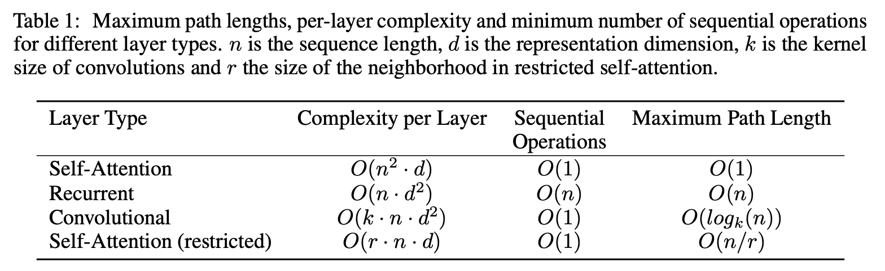
>
> [Transformer论文逐段精读【论文精读】1:06:26 - 1:12:50 部分](https://www.bilibili.com/video/BV1pu411o7BE/?share_source=copy_web&vd_source=e46571d631061853c8f9eead71bdb390&t=3986)

先来解读一下 Table 1：

| 网络层类型                                | 每层计算复杂度           | 顺序操作次数 | 最大路径长度   |
| ----------------------------------------- | ------------------------ | ------------ | -------------- |
| 自注意力（Self-Attention）                | $O(n^2 \cdot d)$         | $O(1)$       | $O(1)$         |
| 循环网络（Recurrent Layer）               | $O(n \cdot d^2)$         | $O(n)$       | $O(n)$         |
| 卷积网络（Convolution）                   | $O(k \cdot n \cdot d^2)$ | $O(1)$       | $O(\log_k(n))$ |
| 受限自注意力（Restricted Self-Attention） | $O(r \cdot n \cdot d)$   | $O(1)$       | $O(n/r)$       |

**符号说明**：

- **$n$**：输入序列的长度（seq_len)，即模型需要处理的序列中包含的元素个数（如文本序列中的词汇数量）。
- **$d$**：表示的维度 (embed_size, d_model)，每个输入元素被映射到的特征空间的维度。
- **$k$**：卷积核（kernal）的大小，在卷积神经网络（CNN）中决定感受野的大小。
- **$r$**：受限注意力机制中“窗口大小”，即每个元素只能与它周围 $r$ 个邻近元素进行计算，不能算全部的。

#### Q1: 自注意力中每层的计算复杂度怎么计算？

自注意力层的计算复杂度主要来源于以下两个部分：

1. **计算注意力权重**：
   - **查询-键点积计算**：
     - 查询矩阵 $Q \in \mathbb{R}^{n \times d}$ 与键矩阵 $K \in \mathbb{R}^{n \times d}$ 的转置 $K^\top \in \mathbb{R}^{d \times n}$ 进行矩阵乘法，得到注意力分数（scores）矩阵 $S = QK^\top \in \mathbb{R}^{n \times n}$。
     - **计算复杂度**: $O(n^2 \cdot d)$, 因为需要计算 $n^2$ 个点积（总共有 $n^2$ 个元素），每个点积涉及 $d$ 次乘加。
   - **计算 Softmax**：
     - 对注意力分数矩阵 $S$ 的每一行进行 Softmax 操作，总共 $n$ 行，每行有 $n$ 个元素。
     - **计算复杂度**: $O(n^2)$。
2. **应用注意力权重到值矩阵**：
   - **权重矩阵与值矩阵相乘**：
     - 注意力权重（attention_weights）矩阵 $A \in \mathbb{R}^{n \times n}$ 与值矩阵 $V \in \mathbb{R}^{n \times d}$ 进行矩阵相乘，得到输出矩阵 $O = AV \in \mathbb{R}^{n \times d}$。
     - **计算复杂度**: $O(n^2 \cdot d)$, 因为需要计算 $n \times d$ 个点积（总共有 $n \times d$ 个元素），每个点积涉及 $n$ 次乘加。

**总的计算复杂度**：

$$
O(n^2 \cdot d) + O(n^2) + O(n^2 \cdot d) = O(n^2 \cdot d)
$$

这意味着当序列长度 $n$ 增大时，计算量会呈平方级增长，因此增加大模型的上下文并不是一个简单的事情。

#### Q2: 什么是顺序操作次数（Sequential Operations）？

**顺序操作次数**是指在处理输入序列时，**必须**按顺序执行的计算步骤数量，这些步骤无法被并行化，必须一个接一个地完成。

- **自注意力（Self-Attention）**：所有位置的计算可以并行进行，顺序操作次数为 $O(1)$。
- **循环网络（Recurrent Layer）**：注意到只有 RNN 是 $O(n)$, 因为 RNN 中每个时间步的计算依赖于前一个时间步的隐藏状态，无法并行化。
- **卷积网络（Convolution）**和**受限自注意力（Restricted Self-Attention）**：卷积和局部注意力操作同样可以并行在所有位置上执行，顺序操作次数为 $O(1)$。

#### Q3: 什么是最大路径长度（Maximum Path Length）？

**最大路径长度**指的是在网络中，从序列的一个位置到另一个位置传递信息所需经过的最大步骤数，这一指标反映了模型捕获长距离依赖关系的效率。

- **自注意力（Self-Attention）**：一个 query 是和所有的 key 去做运算的，而且输出是所有 value 的加权和，所以任何两个位置之间都可以通过一次注意力操作直接交互，最大路径长度为 $O(1)$。
- **循环网络（Recurrent Layer）**：信息需要通过所有中间时间步传递，最大路径长度为 $O(n)$。
- **卷积网络（Convolution）**：可以通过堆叠多层卷积来扩大感受野，最大路径长度为 $O(\log_k(n))$, 其中 $k$ 是卷积核大小。
- **受限自注意力（Restricted Self-Attention）**：每个位置只与其相邻的 $r$ 个位置交互，所以最大路径长度为 $O(n/r)$。

### 训练细节

> 位于论文中的第 5 节，下面将逐节分点方便速览。

- **数据集**： 

  - **英语-德语**：使用 WMT 2014 英德翻译（WMT 2014 English-German）数据集，包含大约 450 万对句子。
    - 字节对编码（Byte-Pair Encoding, BPE），大约 37,000 个词元 tokens，英德数据集的词汇表是共享的，这样处理的好处在于编码器和解码器的 Embedding 可以相同（共享权重，可以跳转查看 [Embeddings 模块](#嵌入embeddings) 的介绍）
    
      > [!note]
      >
      > 有些代码的实现中并没有体现共享，下面给出 TensorFlow 的官方代码来演示：
      >
      > ```python
      > # 初始化
      > self.embedding_softmax_layer = embedding_layer.EmbeddingSharedWeights(
      >         params["vocab_size"], params["hidden_size"])
      > 
      > # 编码器输入
      > embedded_inputs = self.embedding_softmax_layer(inputs)
      > 
      > # 解码器输入
      > decoder_input = self.embedding_softmax_layer(decoder_input)
      > 
      > ```
      >
      > 对应跳转：
      >
      > - [初始化 L86](https://github.com/tensorflow/models/blob/78c533129bd522afcec73acbb3861df70c084b59/official/legacy/transformer/transformer.py#L86)
      > - [编码器输入 L166](https://github.com/tensorflow/models/blob/78c533129bd522afcec73acbb3861df70c084b59/official/legacy/transformer/transformer.py#L166)
      > - [解码器输入 L203](https://github.com/tensorflow/models/blob/78c533129bd522afcec73acbb3861df70c084b59/official/legacy/transformer/transformer.py#L203)
    
  - **英语-法语**：使用规模更大的 WMT 2014 英法数据（WMT 2014 English-French）集，包含 3600 万句子，约 32,000 个，这里提到了 word-piece。

- **批次（batch）大小**： 

  - 句子对大致按照序列长度进行分组，每个批次大约包含 25,000 个源语言词元（source tokens）和 25,000 个目标语言词元（target tokens）。

- **硬件和训练**：

  在 8 块 NVIDIA P100 GPU 上进行训练。

  - 基础模型（base model）的每步训练时间为 0.4 秒，共训练 10 万步，耗时 12 小时。

  - 大模型（big model）的每步训练时间 1 秒，共训练 30 万步，耗时 3.5 天。

    这两个模型在后续的 Table 3 中会进行对比。

- **优化器**：

  - 使用 Adam 优化器，参数设置为 $\beta_1 = 0.9, \beta_2 = 0.98, \epsilon = 10^{-9}$。
  - 学习率随训练步骤变化，具体公式为：

  $`
  lrate = d_{model}^{-0.5} \cdot \min(\text{step\_num}^{-0.5}, \text{step\_num} \cdot \text{warmup\_steps}^{-1.5})
  `$

  $d_{model}$ 是嵌入维度，也就是一个 token 变成 embedding 后的维度，或者说模型的宽度（model size），$`\text{step\_num}`$ 是当前训练步数，$`\text{warmup\_steps}`$ 是 “热身”步数，论文中 $`\text{warmup\_steps}=4000`$, 表示在前 4000 步线性增加学习率，之后按步数平方根倒数（$`\text{step\_num}^{-0.5}`$）逐渐减少学习率。结合下图进行理解。

  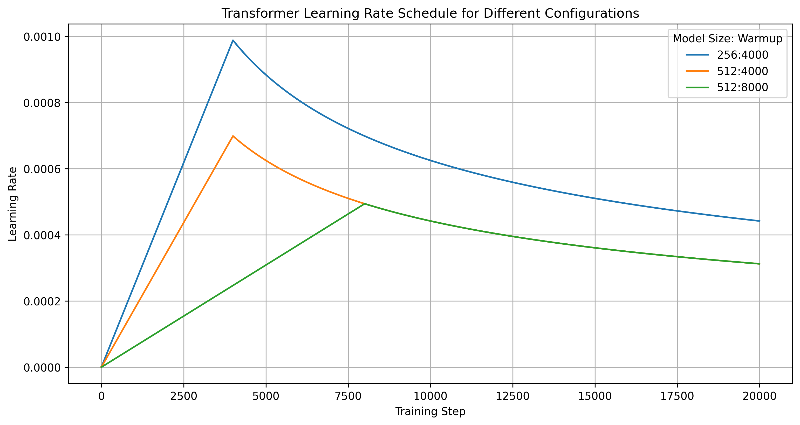

  #### Q1: 为什么学习率热身的时候可以刚好线性增加到 warmup_steps？

  注意公式中只有 $`\text{step\_num}`$ 是变量，其余为固定的常数，因此可以分三种情况来讨论：

  - 当 $`\text{step\_num} < \text{warmup\_steps}`$ 时，公式第二项 $`\text{step\_num} \cdot \text{warmup\_steps}^{-1.5}`$ 的值小于第一项 $`\text{step\_num}^{-0.5}`$，此时学习率等于 $`d_{model}^{-0.5} \cdot \text{step\_num} \cdot \text{warmup\_steps}^{-1.5}`$ ，随训练步数线性增加，直到 $`\text{step\_num}`$ 达到 $`\text{warmup\_steps}`$。
  - 当 $`\text{step\_num} = \text{warmup\_steps}`$ 时，$`\text{step\_num} \cdot \text{warmup\_steps}^{-1.5} = \text{step\_num} \cdot \text{step\_num}^{-1.5} = \text{step\_num}^{-0.5}`$，此时，学习率刚好达到峰值 $`d_{model}^{-0.5} \cdot \text{warmup\_steps}^{-0.5}`$。
  - 当 $`\text{step\_num} > \text{warmup\_steps}`$ 时，公式第一项 $`\text{step\_num}^{-0.5}`$ 的值小于第二项 $`\text{step\_num} \cdot \text{warmup\_steps}^{-1.5}`$，学习率等于 $`d_{model}^{-0.5} \cdot \text{step\_nums}^{-0.5}`$，按步数平方根倒数逐渐减小。

**正则化方法**：

- **残差 Dropout**：对每个子层（sublayer）将 dropout 应用于每个子层的输出，经过残差连接后再进行归一化（LayerNorm），见 Add & Norm 的[代码实现](#代码实现-7)。
  
  - 另外，对 embedding 和位置编码相加的地方也使用 Dropout，见位置编码的[代码实现](#代码实现-10)。
  - 基础模型的 Dropout 概率 $P_{drop}$ 为 0.1。
  
- **标签平滑（Label Smoothing）**: $\epsilon_{ls} = 0.1$, 这会增加 PPL（困惑度 perplexity），因为模型会变得更加不确定，但会提高准确性和 BLEU 分数。

  #### Q2: 什么是标签平滑（Label Smoothing）？

  > 修改自拓展阅读《[f. 交叉熵损失函数 nn.CrossEntropyLoss() 详解和要点提醒（PyTorch）](../Guide/f.%20交叉熵损失函数%20nn.CrossEntropyLoss()%20详解和要点提醒（PyTorch）.md#标签平滑label_smoothing)》。

  标签平滑（Label Smoothing）是一种与“硬标签”（hard label）相对的概念，我们通常使用的标签都是硬标签，即正确类别的概率为1，其他类别的概率为0。这种方式直观且常用，但在语言模型训练时可能会过于“极端”：在 softmax 中，只有当 logit 值无限大时，概率才能逼近 1。
  
  标签平滑的作用就是将 one-hot 转换为“软标签”，即正确类别的概率稍微小于 1，其余类别的概率稍微大于 0，形成一个更平滑的目标标签分布。具体来说，对于一个多分类问题，标签平滑后，正确类别的概率由 1 变为 $1 - \epsilon_{ls}$，所有类别（包括正确）再均分 $\epsilon_{ls}$ 的概率。
  
  下面我们通过**公式**和**代码**来理解。
  
  对于一个具有 $C$ 个类别的分类任务，假设 $\mathbf{y}$ 是真实标签的 one-hot 编码，正确类别的概率为 1，其余类别的概率为 0：
  
  $`
  \mathbf{y} = [0, 0, \ldots, 1, \ldots, 0]
  `$
  
  
  应用标签平滑后，目标标签的分布 $\mathbf{y}'$ 变为：
  
  $`
  \mathbf{y}' = (1 - \epsilon_{ls}) \cdot \mathbf{y} + \frac{\epsilon_{ls}}{C}
  `$
  
  也就是说，对于正确类别 $i$，标签平滑后的概率为：
  
  $`
  \mathbf{y}_i = 1 - \epsilon_{ls} + \frac{\epsilon_{ls}}{C}
  `$
  
  对于其他类别 $j \neq i$，标签平滑后的概率为：
  
  $`
  \mathbf{y}'_j = \frac{\epsilon_{ls}}{C}
  `$
  
  标签平滑后的标签向量 $\mathbf{y}'$ 的形式为：
  
  $`
  \mathbf{y}' = [\frac{\epsilon_{ls}}{C}, \frac{\epsilon_{ls}}{C}, \ldots, 1 - \epsilon_{ls} + \frac{\epsilon_{ls}}{C}, \ldots, \frac{\epsilon_{ls}}{C}]
  `$
  
  **代码实现**：
  
  ```python
  smooth = (1 - epsilon) * one_hot + epsilon / C
  ```

#### Q3: 什么是 PPL?

> 《[18. 模型量化技术概述及 GGUF:GGML 文件格式解析](../Guide/18.%20模型量化技术概述及%20GGUF%3AGGML%20文件格式解析.md#什么是-ppl)》

#### Q4: 什么是 BLEU？

> 参考链接：
>
> - [BLEU: a Method for Automatic Evaluation of Machine Translation](https://aclanthology.org/P02-1040.pdf)
> - [Foundations of NLP Explained — Bleu Score and WER Metrics](https://towardsdatascience.com/foundations-of-nlp-explained-bleu-score-and-wer-metrics-1a5ba06d812b)

**BLEU（Bilingual Evaluation Understudy）**  双语评估替换

公式：

$$
\text{BLEU} = BP \cdot \exp\left( \sum_{n=1}^{N} w_n log\ p_n\right)^{\frac{1}{N}}
$$

首先要明确两个概念

1. **N-gram** 
   用来描述句子中的一组 n 个连续的单词。比如，"Thank you so much" 中的 n-grams:
   - 1-gram: "Thank", "you", "so", "much"
   - 2-gram: "Thank you", "you so", "so much"
   - 3-gram: "Thank you so", "you so much"
   - 4-gram: "Thank you so much"
     需要注意的一点是，n-gram 中的单词是按顺序排列的，所以 "so much Thank you" 不是一个有效的 4-gram。
2. **精确度（Precision）**
   精确度是 Candidate text 中与 Reference text 相同的单词数占总单词数的比例。 具体公式如下：
   
   $\text{Precision} = \frac{\text{Number of overlapping words}}{\text{Total number of words in candidate text}}$
   
   比如：
   
   Candidate: <u>Thank you so much</u>, Chris
   
   Reference: <u>Thank you so much</u>, my brother
   
   这里相同的单词数为4，总单词数为5，所以 $\text{Precision} = \frac{{4}}{{5}}$
   
   但存在一个问题：
   
   - **Repetition** 重复

     Candidate: <u>Thank Thank Thank</u>

     Reference: <u>Thank</u> you so much, my brother
     
     此时的 $\text{Precision} = \frac{{3}}{{3}}$

**解决方法：Modified Precision**

很简单的思想，就是匹配过的不再进行匹配。

Candidate: <u>Thank</u> Thank Thank

Reference: <u>Thank</u> you so much, my brother

$\text{Precision}_1 = \frac{{1}}{{3}}$

- 具体计算如下：

  $`Count_{clip} = \min(Count,\ Max\_Ref\_Count)=\min(3,\ 1)=1`$
  
  $`p_n = \frac{\sum_{\text{n-gram}} Count_{clip}}{\sum_{\text{n-gram}} Count} = \frac{1}{3}`$
  
  现在还存在一个问题：**译文过短**

Candidate: <u>Thank you</u>

Reference: <u>Thank you</u> so much, my brother

$p_1 = \frac{{2}}{{2}} = 1$

这里引出了 **brevity penalty**，这是一个惩罚因子，公式如下：

$$
BP = \begin{cases} 1& \text{if}\ c>r\\ e^{1-\frac{r}{c}}& \text{if}\ c \leq r  \end{cases}
$$

其中 c 是 candidate 的长度，r 是 reference 的长度。

当候选译文的长度 c 等于参考译文的长度 r 的时候，BP = 1，当候选翻译的文本长度较短的时候，用 $e^{1-\frac{r}{c}}$ 作为 BP 值。

回到原来的公式: $\text{BLEU} = BP \cdot \exp\left( \sum_{n=1}^{N} w_n log\ p_n\right)^{\frac{1}{N}}$, 汇总一下符号定义：

- $BP$ 文本长度的惩罚因子
- $N$ n-gram 中 n 的最大值
- $w_n$ 权重
- $p_n$ n-gram 的精度 (precision)

### 表 3

> 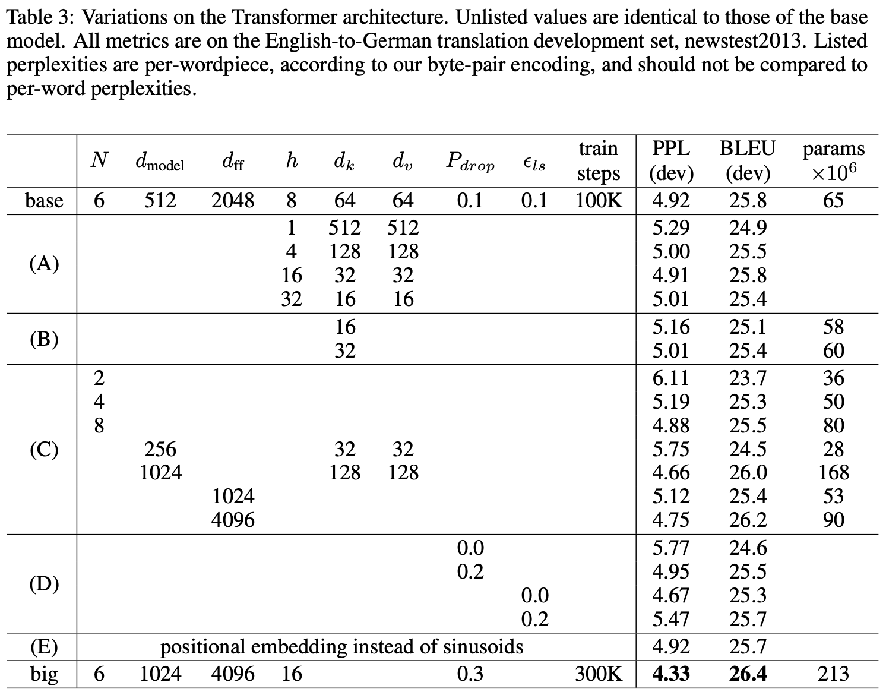

表 3 在英语到德语翻译开发集（newstest2013）上评估了不同参数配置对性能的影响。如果先阅读子模块部分，对其中的参数会非常眼熟，这里将对符号和指标进行重复解释，默认对应的是 base 的设置：

- **参数**

  - $N$：编码器和解码器的层数（默认为 6）。
  - $d_{model}$：嵌入维度（默认为 512）。
  - $d_{ff}$：前馈网络（FFN）的隐藏层维度（默认为 2048）。
  - $h$：多头注意力中的头数（默认为 8）。
  - $d_k, d_v$：注意力中键和值的维度（默认为 64），需要注意到 $h \times d_k = d_{model}$ 。
  - $P_{drop}$：Dropout 概率（默认为 0.1）。
  - $ϵ_{ls}$：标签平滑参数（默认为 0.1）。
  - $\text{train steps}$：训练步数（默认为 100,000 步）

- **指标**

  dev 指的是开发集（development set）。

  - **PPL**（Perplexity）：困惑度，衡量模型对测试数据的预测能力，数值越低表示模型性能越好。
  - **BLEU**（Bilingual Evaluation Understudy）Score：双语评估替换分数，用于评估机器翻译结果与参考译文的相似度，数值越高表示翻译质量越好。
  - **参数数量**（$`\text{params} \times10^6`$）：模型中可训练参数的总数量，以百万为单位。

解释完横轴，接下来解释纵轴：

- **base**：基础模型（base model）配置，以下(字母)变体基于 base 进行修改。
- **(A)**：模型参数不变的情况下修改 $h$, $d_k$, $d_v$, 这里可以看到单头注意力的的指标比多头差（相同参数下），但注意力头数并不是越多越好（参见 $h=16$ 和 $h=32$）。
- **(B)**：减少 key 的维度查看性能影响。
- **(C)**：逐行增加参数量，可以看到对比结果：一般而言，模型越大越好。
- **(D)**：评判正则化的效果，修改 Dropout 概率 $P_{drop}$ （0.1 好于 0 和 0.2）和标签平滑参数 $ϵ_{ls}$。
- **(E)**：使用可学习的位置嵌入（positional embedding）替换掉正弦位置编码，结果基本相同。
- **big**：大模型（big model）配置，拥有更多的参数，训练更长的时间，效果最好。

## 注意力机制详解

Transformer 的核心是**多头注意力机制（Multi-Head Attention）**，它能够捕捉输入序列中不同位置之间的依赖关系，并从多个角度对信息进行建模。模块将自底向上的进行讲解：在深入理解注意力机制前，首先需要理解论文使用的**缩放点积注意力机制（Scaled Dot-Product Attention）**。

### 缩放点积注意力机制

> 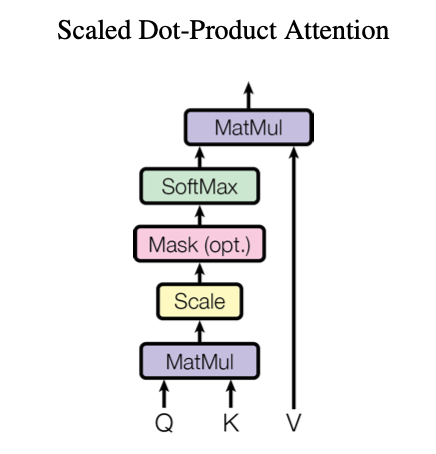

给定查询矩阵 $Q$、键矩阵 $K$ 和值矩阵 $V$, 其注意力输出的数学表达式如下：

$$
\text{Attention}(Q, K, V) = \text{Softmax}\left(\frac{Q K^\top}{\sqrt{d_k}}\right) V
$$

- **$Q$（Query）**: 用于查询的向量矩阵。
- **$K$（Key）**: 表示键的向量矩阵，用于与查询匹配。
- **$V$（Value）**: 值矩阵，注意力权重最终会作用在该矩阵上。
- **$d_k$**: 键或查询向量的维度。

> 理解 Q、K、V 的关键在于代码，它们实际上是通过线性变换从输入序列生成的，“故事”的延伸更多是锦上添花。

#### 公式解释

1. **点积计算（Dot Produce）**
   
   将查询矩阵 $Q$ 与键矩阵的转置 $K^\top$ 做点积，计算每个查询向量与所有键向量之间的相似度：
   
   $`\text{Scores} = Q K^\top`$
   
   - **每一行**表示某个查询与所有键之间的相似度（匹配分数）。
   - **每一列**表示某个键与所有查询之间的相似度（匹配分数）。
   
2. **缩放（Scaling）**
   
   > We suspect that for large values of $d_k$, the dot products grow large in magnitude, pushing the softmax function into regions where it has extremely small gradients. To counteract this effect, we scale the dot products by $\sqrt{d_k}$ .
   
   当 $d_k$ 较大时，点积的数值可能会过大，导致 Softmax 过后的梯度变得极小，因此除以 $\sqrt{d_k}$ 缩放点积结果的数值范围：
   
   $`\text{Scaled Scores} = \frac{Q K^\top}{\sqrt{d_k}}`$
   
   缩放后（Scaled Dot-Product）也称为注意力分数（**attention scores**）。
   
3. **Softmax 归一化**
   
   使用 Softmax 函数将缩放后的分数转换为概率分布：
   
   $`\text{Attention Weights} = \text{Softmax}\left(\frac{Q K^\top}{\sqrt{d_k}}\right)`$
   
   > **注意**：Softmax 是在每一行上进行的，这意味着每个查询的匹配分数将归一化为概率，总和为 1。
   
4. **加权求和（Weighted Sum）**
   
   最后，使用归一化后的注意力权重对值矩阵 $V$ 进行加权求和，得到每个查询位置的最终输出：
   $`\text{Output} = \text{Attention Weights} \times V`$

#### 代码实现

```python
import torch
import torch.nn.functional as F
import math

def scaled_dot_product_attention(Q, K, V, mask=None):
    """
    缩放点积注意力计算。
    
    参数:
        Q: 查询矩阵 (batch_size, seq_len_q, embed_size)
        K: 键矩阵 (batch_size, seq_len_k, embed_size)
        V: 值矩阵 (batch_size, seq_len_v, embed_size)
        mask: 掩码矩阵，用于屏蔽不应该关注的位置 (可选)

    返回:
        output: 注意力加权后的输出矩阵
        attention_weights: 注意力权重矩阵
    """
    embed_size = Q.size(-1)  # embed_size
    
    # 计算点积并进行缩放
    scores = torch.matmul(Q, K.transpose(-2, -1)) / math.sqrt(embed_size)

    # 如果提供了掩码矩阵，则将掩码对应位置的分数设为 -inf
    if mask is not None:
        scores = scores.masked_fill(mask == 0, float('-inf'))

    # 对缩放后的分数应用 Softmax 函数，得到注意力权重
    attention_weights = F.softmax(scores, dim=-1)

    # 加权求和，计算输出
    output = torch.matmul(attention_weights, V)
    
    return output, attention_weights
```

**解释**

1. **缩放点积计算**

   使用 `torch.matmul(Q, K.transpose(-2, -1))` 计算查询与键之间的点积相似度，然后结果除以 $\sqrt{d_k}$ 进行缩放。

2. **掩码处理（Masked Attention）**

   如果提供了掩码矩阵（`mask`），则将掩码为 0 的位置的分数设为 $-\infty$（-inf）。这样在 Softmax 归一化时，这些位置的概率会变为 0，不参与输出计算：

   ```python
   if mask is not None:
       scores = scores.masked_fill(mask == 0, float('-inf'))
   ```

   > Softmax 函数的数学定义为：
   > 
   > $`\text{Softmax}(x_i) = \frac{e^{x_i}}{\sum_j e^{x_j}}`$
   > 
   > 当某个分数为 $-\infty$ 时, $e^{-\infty} = 0$, 因此该位置的权重为 0。
   
3. **Softmax 归一化**

   Softmax 将缩放后的分数转换为概率分布（对行），表示每个查询向量与键向量之间的匹配程度：

   ```python
   attention_weights = F.softmax(scores, dim=-1)
   ```

4. **加权求和（Weighted Sum）**

   使用注意力权重对值矩阵 $V$ 进行加权求和，生成最终的输出：

   ```python
   output = torch.matmul(attention_weights, V)
   ```

#### Q: 为什么需要 Mask 机制？

- **填充掩码（Padding Mask）**

  在处理不等长的输入序列时，需要使用填充符（padding）补齐短序列。在计算注意力时，填充部分不应对结果产生影响（q 与填充部分的 k 匹配程度应该为 0），因此需要使用填充掩码忽略这些位置。

- **未来掩码（Look-ahead Mask）**

  > 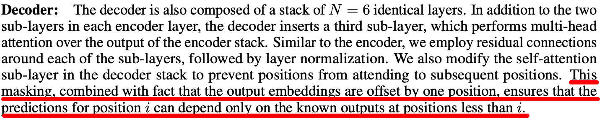
  
  在训练自回归模型（如 Transformer 中的解码器）时，为了防止模型“偷看”未来的词，需要用掩码屏蔽未来的位置，确保模型只能利用已知的上下文进行预测。

> [!note]
>
> 常见注意力机制除了缩放点积注意力，还有**加性注意力**（Additive Attention）注意力机制。

“那么 Q、K、V 到底是怎么来的？论文架构图中的三种 Attention 是完全不同的架构吗？”

让我们**带着疑惑往下阅读**，先不谈多头，理清楚 Masked，Self 和 Cross 注意力到底是什么。

### 单头注意力机制（Single-Head Attention）

将输入序列（Inputs）通过线性变换生成**查询矩阵**（Query, $Q$）、**键矩阵**（Key, $K$）和**值矩阵**（Value, $V$），随后执行**缩放点积注意力**（Scaled Dot-Product Attention）。

是的，实际就这么简单，让我们直接查看处理的代码：

```python
class Attention(nn.Module):
    def __init__(self, embed_size):
        """
        单头注意力机制。
        
        参数:
            embed_size: 输入序列（Inputs）的嵌入（Input Embedding）维度，也是论文中所提到的d_model。
        """
        super(Attention, self).__init__()
        self.embed_size = embed_size

        # 定义线性层，用于生成查询、键和值矩阵
        self.w_q = nn.Linear(embed_size, embed_size)
        self.w_k = nn.Linear(embed_size, embed_size)
        self.w_v = nn.Linear(embed_size, embed_size)

    def forward(self, q, k, v, mask=None):
        """
        前向传播函数。
        
        参数:
            q: 查询矩阵 (batch_size, seq_len_q, embed_size)
            k: 键矩阵 (batch_size, seq_len_k, embed_size)
            v: 值矩阵 (batch_size, seq_len_v, embed_size)
            mask: 掩码矩阵，用于屏蔽不应关注的位置 (batch_size, seq_len_q, seq_len_k)

        返回:
            out: 注意力加权后的输出
            attention_weights: 注意力权重矩阵
        """
        # 将输入序列通过线性变换生成 Q, K, V
        Q = self.w_q(q)  # (batch_size, seq_len_q, embed_size)
        K = self.w_k(k)  # (batch_size, seq_len_k, embed_size)
        V = self.w_v(v)  # (batch_size, seq_len_v, embed_size)

        # 使用缩放点积注意力函数计算输出和权重
        out, attention_weights = scaled_dot_product_attention(Q, K, V, mask)

        return out, attention_weights
```

#### 掩码机制（Masked Attention）

> 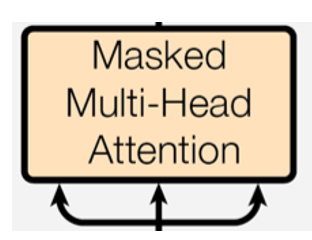

如果使用 mask 掩盖将要预测的词汇，那么 Attention 就延伸为 Masked Attention，这里的实现非常简洁，追溯 scaled_dot_product_attention() 的代码：

```python
# 计算分数
scores = torch.matmul(Q, K.transpose(-2, -1)) / math.sqrt(embed_size)
    
# 如果提供了掩码矩阵，则将掩码对应位置的分数设为 -inf
if mask is not None:
    scores = scores.masked_fill(mask == 0, float('-inf'))

# 对缩放后的分数应用 Softmax 函数，得到注意力权重
attention_weights = F.softmax(scores, dim=-1)
```

在这段代码中，`mask` 矩阵用于指定哪些位置应该被遮蔽（即填充为 -∞），从而保证这些位置的注意力权重在 softmax 输出中接近于零。注意，掩码机制并不是直接在截断输入序列，也不是在算分数的时候就排除不应该看到的位置，因为看到也没有关系，不会影响与其他位置的分数，所以在传入 Softmax（计算注意力权重）之前排除就可以了。

下图展示了掩码机制的工作原理。对于**自回归生成任务**（训练时的解码器），掩码会覆盖未来的时间步，确保模型只能基于已有的部分生成当前的 token，掩码矩阵：

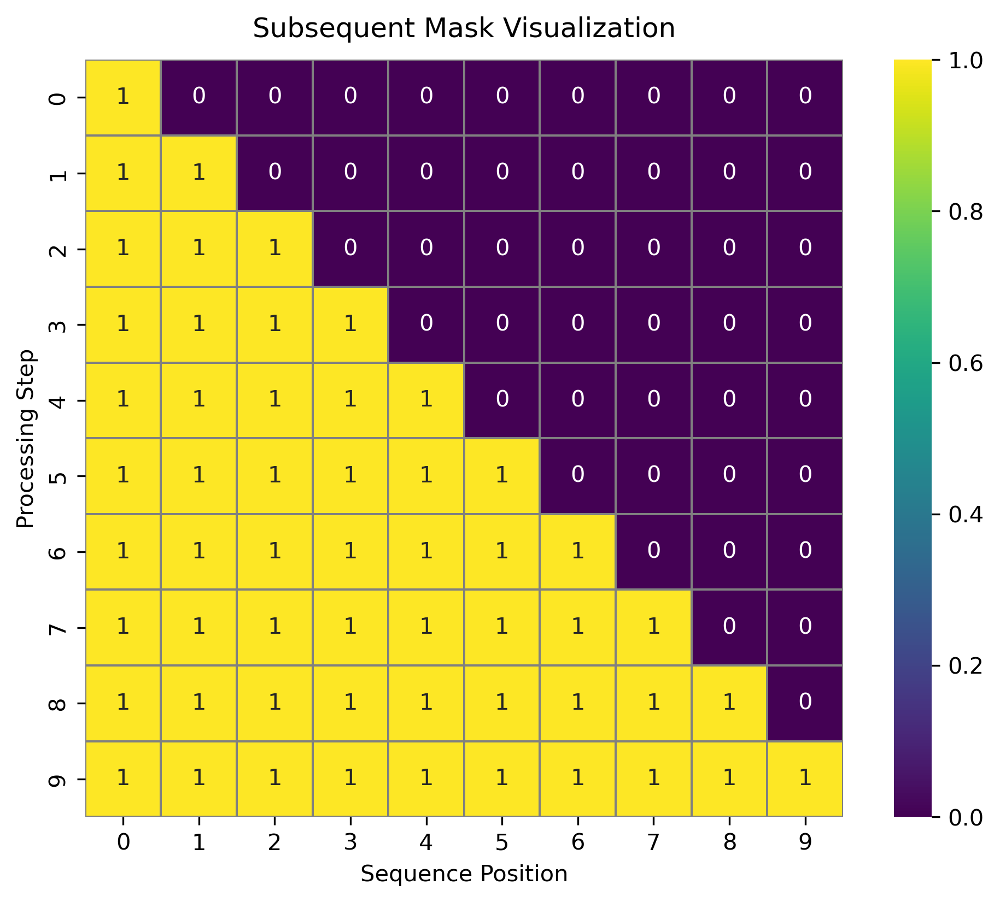

> [TRANSFORMER EXPLAINER](https://poloclub.github.io/transformer-explainer/) 可视化

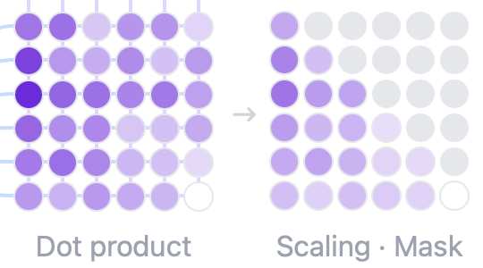

需要注意的是，填充（Padding）掩码会被同时用于编码器和解码器的输入，论文中的 Masked-Attention 特指使用了未来掩码的情况（如果使用了任一掩码就叫 Masked 的话，其他两个注意力模块都得增加 Masked 前缀）。

另外，根据输入数据的来源，还可以将注意力分为**自注意力（Self-Attention）**和**交叉注意力（Cross-Attention)**。

#### 自注意力机制（Self-attention）

> 

Transformer 模型架构使用到了三个看起来不同的注意力机制，我们继续忽视共有的 Multi-Head。观察输入，线条一分为三传入 Attention 模块，这意味着查询（query）、键（key）和值（value）实际上都来自**同一输入序列 $\mathbf{X}$**，数学表达如下：

$$
Q = XW^Q, \quad K = XW^K, \quad V = XW^V
$$

- **$W^Q, W^K, W^V$**：可训练的线性变换权重，实际上就是简单的线性层，对应的代码：

  ```python
  # 定义线性层，用于生成查询、键和值矩阵
  self.w_q = nn.Linear(embed_size, embed_size)
  self.w_k = nn.Linear(embed_size, embed_size)
  self.w_v = nn.Linear(embed_size, embed_size)
  ```

这就是**自**注意力机制。

##### 代码实现

```python
import torch
import torch.nn as nn
import torch.nn.functional as F

class SelfAttention(nn.Module):
    def __init__(self, embed_size):
        """
        自注意力（Self-Attention）机制。
        
        参数:
            embed_size: 输入序列的嵌入维度（每个向量的特征维度）。
        """
        super(SelfAttention, self).__init__()
        self.attention = Attention(embed_size)  # 使用通用Attention模块

    def forward(self, x, mask=None):
        """
        前向传播函数。
        
        参数:
            x: 输入序列 (batch_size, seq_len, embed_size)
            mask: 掩码矩阵 (batch_size, seq_len, seq_len)

        返回:
            out: 自注意力加权后的输出 (batch_size, seq_len, embed_size)
            attention_weights: 注意力权重矩阵 (batch_size, seq_len, seq_len)
        """
        # 在自注意力机制中，q, k, v 都来自同一输入序列
        # q = k = v = x
        out, attention_weights = self.attention(x, x, x, mask)

        return out, attention_weights

```

那交叉注意力呢？

#### 交叉注意力机制（Cross-Attention）

> 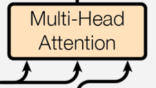

在 Transformer 解码器中，除了自注意力外，还使用了 **交叉注意力（Cross-Attention）**。

如下图所示，解码器（右）在自底向上的处理过程中，先执行自注意力机制，然后通过交叉注意力从编码器的输出中获取上下文信息。

> 

数学表达如下：

$$
Q = X_{\text{decoder}} W^Q, \quad K = X_{\text{encoder}} W^K, \quad V = X_{\text{encoder}} W^V
$$


##### 代码实现

```python
import torch
import torch.nn as nn

class CrossAttention(nn.Module):
    def __init__(self, embed_size):
        """
        交叉注意力（Cross-Attention）机制。
        
        参数:
            embed_size: 输入序列的嵌入维度。
        """
        super(CrossAttention, self).__init__()
        self.attention = Attention(embed_size)  # 使用通用 Attention 模块

    def forward(self, q, kv, mask=None):
        """
        前向传播函数。
        
        参数:
            query: 查询矩阵的输入 (batch_size, seq_len_q, embed_size)
            kv: 键和值矩阵的输入 (batch_size, seq_len_kv, embed_size)
            mask: 掩码矩阵 (batch_size, seq_len_q, seq_len_kv)

        返回:
            out: 注意力加权后的输出 (batch_size, seq_len_q, embed_size)
            attention_weights: 注意力权重矩阵 (batch_size, seq_len_kv, seq_len_kv)
        """
        # 在交叉注意力机制中，q 和 k, v 不同
        # q 来自解码器，k 和 v 来自编码器（观察模型架构图）
        out, attention_weights = self.attention(q, kv, kv, mask)

        return out, attention_weights
```

与自注意力不同的是，这里的**查询（q）和键值（k, v）来自不同的源**，即 $q \neq k = v$。

#### 总结

> 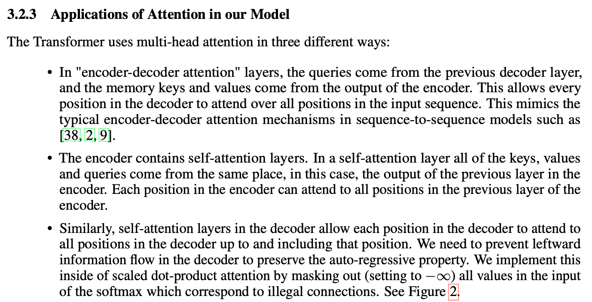

**Masked Attention**、**Self-Attention** 和 **Cross-Attention** 的本质是一致的，这一点从代码调用可以看出来，三者的区别在于未来掩码的使用和输入数据的来源：

- **Masked Attention**：用于解码过程，通过掩码屏蔽未来的时间步，确保模型只能基于已生成的部分进行预测，论文中解码器部分的第一个 Attention 使用的是 Masked Self-Attention。

- **Self-Attention**：查询、键和值矩阵来自同一输入序列，模型通过自注意力机制学习输入序列的全局依赖关系。

- **Cross-Attention**：查询矩阵来自解码器的输入，而键和值矩阵来自编码器的输出，解码器的第二个 Attention 模块就是 Cross-Attention，用于从编码器输出中获取相关的上下文信息。

  - 以**机器翻译**中的**中译英任务**为例：对于中文句子“**中国的首都是北京**”，假设模型已经生成了部分译文“The capital of China is”，此时需要预测下一个单词。

    在这一阶段，**解码器中的交叉注意力机制**会使用**当前已生成的译文“The capital of China is”**的编码表示作为**查询**，并将**编码器对输入句子“中国的首都是北京”编码表示**作为**键**和**值**，通过计算**查询与键之间的匹配程度**，生成相应的注意力权重，以此从值中提取上下文信息，基于这些信息生成下一个可能的单词（token），比如：“Beijing”。

### 多头注意力机制（Multi-Head Attention）

多头注意力机制在 Transformer 中发挥着与卷积神经网络（CNN）中的**卷积核**（Kernel）类似的作用。CNN 使用多个不同的卷积核在空间域上捕捉不同的局部特征，而 Transformer 的多头注意力通过**多个头**（Head）并行地关注输入数据在不同维度上的依赖关系。

#### 数学表达

假设我们有 $h$ 个头，每个头拥有独立的线性变换矩阵 $W_i^Q, W_i^K, W_i^V$（分别作用于查询、键和值的映射），每个头的计算如下：

$$
\text{head}_i = \text{Attention}(Q W_i^Q, K W_i^K, V W_i^V)
$$

这些头的输出将沿最后一维拼接（**Concat**），并通过线性变换矩阵 $W^O$ 映射回原始嵌入维度（`embed_size`）：

$$
\text{MultiHead}(Q, K, V) = \text{Concat}(\text{head}_1, \dots, \text{head}_h) W^O
$$

- **$h$**：注意力头的数量。
- **$W^O$**：拼接后所通过的线性变换矩阵，用于将多头的输出映射回原始维度。  

> [!note]
>
> 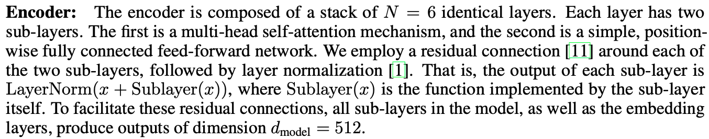
>
> 映射回原始维度的主要目的是为了实现残差连接（Residual Connection），即：
>
> $x + \text{SubLayer}(x)$
>
> 你将发现其他模块（如自注意力模块、多头注意力机制和前馈网络）的输出层大多都是一样的维度，这是因为只有当输入 $x$ 的形状与经过层变换后的输出 $\text{SubLayer}(x)$ 的形状一致时，才能按预期的进行逐元素相加（element-wise addition），否则会导致张量维度不匹配，需要额外的变换操作。
>
> 演示代码暂时保持 embed_size 的使用，知晓是一致的即可。

先从符合直觉的角度构造多头。

```python
import torch
import torch.nn as nn
import torch.nn.functional as F

class MultiHeadAttention(nn.Module):
    def __init__(self, embed_size, num_heads):
        """
        多头注意力机制。（暂时使用更复杂的变量名来减少理解难度，在最后将统一映射到论文的表达）
        参数:
            embed_size: 输入序列的嵌入维度。
            num_heads: 注意力头的数量，对应于数学公式中的 h。
        """
        super(MultiHeadAttention, self).__init__()
        self.embed_size = embed_size
        self.num_heads = num_heads

        # 为每个头单独定义 Q, K, V 的线性层，输出维度同为 embed_size
        self.w_q = nn.ModuleList([nn.Linear(embed_size, embed_size) for _ in range(num_heads)])
        self.w_k = nn.ModuleList([nn.Linear(embed_size, embed_size) for _ in range(num_heads)])
        self.w_v = nn.ModuleList([nn.Linear(embed_size, embed_size) for _ in range(num_heads)])

        # 输出线性层，用于将多头拼接后的输出映射回 embed_size
        self.fc_out = nn.Linear(num_heads * embed_size, embed_size)

    def forward(self, q, k, v, mask=None):
        """
        前向传播函数。
        
        参数:
            q: 查询矩阵 (batch_size, seq_len_q, embed_size)
            k: 键矩阵 (batch_size, seq_len_k, embed_size)
            v: 值矩阵 (batch_size, seq_len_v, embed_size)
            mask: 掩码矩阵 (batch_size, seq_len_q, seq_len_k)

        返回:
            out: 注意力加权后的输出
            attention_weights: 注意力权重矩阵
        """
        batch_size = q.shape[0]
        multi_head_outputs = []

        # 对每个头分别计算 Q, K, V，并执行缩放点积注意力
        for i in range(self.num_heads):
            Q = self.w_q[i](q)  # (batch_size, seq_len_q, embed_size)
            K = self.w_k[i](k)  # (batch_size, seq_len_k, embed_size)
            V = self.w_v[i](v)  # (batch_size, seq_len_v, embed_size)

            # 缩放点积注意力
            scaled_attention, _ = scaled_dot_product_attention(Q, K, V, mask)
            multi_head_outputs.append(scaled_attention)

        # 将所有头的输出拼接起来
        concat_out = torch.cat(multi_head_outputs, dim=-1)  # (batch_size, seq_len_q, num_heads * embed_size)

        # 通过输出线性层
        out = self.fc_out(concat_out)  # (batch_size, seq_len_q, embed_size)

        return out
    

def scaled_dot_product_attention(Q, K, V, mask=None):
    """
    缩放点积注意力计算。
    参数:
        Q: 查询矩阵 (batch_size, seq_len_q, embed_size)
        K: 键矩阵 (batch_size, seq_len_k, embed_size)
        V: 值矩阵 (batch_size, seq_len_v, embed_size)
        mask: 掩码矩阵，用于屏蔽不应该关注的位置 (可选)

    返回:
        output: 注意力加权后的输出矩阵
        attention_weights: 注意力权重矩阵
    """
    ...（使用之前的缩放点积注意力函数）
    
    return output, attention_weights
```

**解释**：

- 每个头的 $W_i^Q, W_i^K, W_i^V$ 是独立的线性变换矩阵，不同头捕捉不同的关系。
- 所有头的输出在最后一维拼接，再通过线性层 $W^O$ 将其映射回原始维度。

我们成功实现了一个多头注意力机制，多头相比于单头通常能带来性能上的提升，但停下来思考一下：

#### Q: 现在所说的性能“提升”真的是由多头造成的吗？

不一定。如果**每个头都独立使用线性层且维度等于 `embed_size`**，模型的参数量会比单头模型大很多，此时性能提升可能是因为**参数量的增加**。为了更准确地评估多头机制的实际贡献，我们可以使用以下两种方法进行公平的对比：

1. **方法 1：单头模型增加参数量（与多头模型参数量一致）**

   使用**一个头**，但将其参数矩阵 $W^Q, W^K, W^V$ 扩展为：

   $`
   W \in \mathbb{R}^{d_{\text{model}} \times (d_{\text{model}} \cdot h)}
   `$

   在这种情况下，虽然还是单头模型，但增加了参数量，参数规模将与多头模型保持一致，可以评估性能提升是否真的来自于多头机制本身。

2. **方法 2：降低每个头的维度（与单头模型参数量一致）**

   降低**每**个头的维度，使得：

   $`
   h \times \text{head\_dim} = \text{embed\_size}
   `$

   也就是说，每个头的线性变换矩阵 $W_i^Q, W_i^K, W_i^V$ 的尺寸应为：

   $`
   W_i \in \mathbb{R}^{d_{\text{model}} \times \text{head\_dim}}
   `$

   其中：

   $`
   \text{head\_dim} = \frac{\text{embed\_size}}{h}
   `$

   在这种情况下，多头模型的参数规模与单头模型保持一致。

接下来使用方法 2 修改（方便之后过渡到 Transformer 的真正实现）：

```python
import torch
import torch.nn as nn
import torch.nn.functional as F

class MultiHeadAttention(nn.Module):
    def __init__(self, embed_size, num_heads):
        """
        多头注意力机制：每个头单独定义线性层。
        
        参数:
            embed_size: 输入序列的嵌入维度。
            num_heads: 注意力头的数量。
        """
        super(MultiHeadAttention, self).__init__()
        assert embed_size % num_heads == 0, "embed_size 必须能被 num_heads 整除。"

        self.embed_size = embed_size
        self.num_heads = num_heads
        self.head_dim = embed_size // num_heads  # 每个头的维度

        # 为每个头单独定义 Q, K, V 的线性层
        self.w_q = nn.ModuleList([nn.Linear(embed_size, self.head_dim) for _ in range(num_heads)])
        self.w_k = nn.ModuleList([nn.Linear(embed_size, self.head_dim) for _ in range(num_heads)])
        self.w_v = nn.ModuleList([nn.Linear(embed_size, self.head_dim) for _ in range(num_heads)])

        # 输出线性层，将多头拼接后的输出映射回 embed_size
        self.fc_out = nn.Linear(embed_size, embed_size)

    def forward(self, q, k, v, mask=None):
        """
        前向传播函数。
        
        参数:
            q: 查询矩阵 (batch_size, seq_len_q, embed_size)
            k: 键矩阵 (batch_size, seq_len_k, embed_size)
            v: 值矩阵 (batch_size, seq_len_v, embed_size)
            mask: 掩码矩阵 (batch_size, seq_len_q, seq_len_k)

        返回:
            out: 注意力加权后的输出
            attention_weights: 注意力权重矩阵
        """
        batch_size = q.shape[0]
        multi_head_outputs = []

        # 针对每个头独立计算 Q, K, V，并执行缩放点积注意力
        for i in range(self.num_heads):
            Q = self.w_q[i](q)  # (batch_size, seq_len_q, head_dim)
            K = self.w_k[i](k)  # (batch_size, seq_len_k, head_dim)
            V = self.w_v[i](v)  # (batch_size, seq_len_v, head_dim)

            # 执行缩放点积注意力
            scaled_attention, _ = scaled_dot_product_attention(Q, K, V, mask)
            multi_head_outputs.append(scaled_attention)

        # 将所有头的输出拼接起来
        concat_out = torch.cat(multi_head_outputs, dim=-1)  # (batch_size, seq_len_q, embed_size)

        # 通过输出线性层
        out = self.fc_out(concat_out)  # (batch_size, seq_len_q, embed_size)

        return out

def scaled_dot_product_attention(Q, K, V, mask=None):
    """
    缩放点积注意力计算。
    
    参数:
        Q: 查询矩阵 (batch_size, seq_len_q, head_dim)
        K: 键矩阵 (batch_size, seq_len_k, head_dim)
        V: 值矩阵 (batch_size, seq_len_v, head_dim)
        mask: 掩码矩阵 (batch_size, seq_len_q, seq_len_k)

    返回:
        output: 注意力加权后的输出矩阵
        attention_weights: 注意力权重矩阵
    """
    ...（使用之前的缩放点积注意力函数，区别在于修改了注释里面的 shape）

    return output, attention_weights
```

至此就已经真正实现了多头注意力机制，但需要注意到当前代码使用了 **`for` 循环**逐一计算每个头的查询、键和值，虽然逻辑上更直观，但计算起来极慢，只适合去理解而非使用。接下来，我们将优化这些循环，将代码转换为经典的 **Transformer** 源码形式。

#### 优化循环

- **\_\_init\_\_()部分**

  我们不再为每个头单独创建线性层，而是定义一个看起来“共享”（\_\_init\_\_() 中），实际上却“泾渭分明”（forward() 中）的线性层。

  **原代码：**

  ```python
  self.w_q = nn.ModuleList([nn.Linear(embed_size, self.head_dim) for _ in range(num_heads)])
  self.w_k = nn.ModuleList([nn.Linear(embed_size, self.head_dim) for _ in range(num_heads)])
  self.w_v = nn.ModuleList([nn.Linear(embed_size, self.head_dim) for _ in range(num_heads)])
  ```

  **优化后：**

  ```python
  # “共享”的 Q, K, V 线性层
  self.w_q = nn.Linear(embed_size, embed_size)
  self.w_k = nn.Linear(embed_size, embed_size)
  self.w_v = nn.Linear(embed_size, embed_size)
  ```


- **forward()**

  不再循环遍历每个头来单独计算查询、键和值，而是**一次性计算 Q、K 和 V**，然后使用**重塑**（`reshape`）和**转置**（`transpose`）将这些矩阵拆分为多头的格式，有些代码实现将这些操作统一称为**拆分**（`split`）。

  我们还可以选择使用 `view()` 替代 `reshape()`，因为它们在功能上类似，但 `view()` 需要保证张量在内存中是连续的。

  本质上，这些操作都是为了确保计算后的形状与多头机制的需求一致。

  **原代码：**

  ```python
  multi_head_outputs = []
  for i in range(self.num_heads):
      Q = self.w_q[i](q)  # (batch_size, seq_len_q, head_dim)
      K = self.w_k[i](k)  # (batch_size, seq_len_k, head_dim)
      V = self.w_v[i](v)  # (batch_size, seq_len_v, head_dim)
  
      # 执行缩放点积注意力
      scaled_attention, _ = scaled_dot_product_attention(Q, K, V, mask)
      multi_head_outputs.append(scaled_attention)
  
  # 将所有头的输出拼接起来
  concat_out = torch.cat(multi_head_outputs, dim=-1)  # (batch_size, seq_len_q, embed_size)
  ```

  **优化后：**

  ```python
  # 通过“共享”线性层计算 Q, K, V
  Q = self.w_q(q)  # (batch_size, seq_len, embed_size)
  K = self.w_k(k)  # (batch_size, seq_len, embed_size)
  V = self.w_v(v)  # (batch_size, seq_len, embed_size)
  
  # 拆分为多头，调整维度为 (batch_size, num_heads, seq_len, head_dim)
  Q = Q.reshape(batch_size, seq_len_q, self.num_heads, self.head_dim).transpose(1, 2)  # transpose(1, 2) 操作之前的 shape 为 (batch_size, seq_len, num_heads, head_dim)
  K = K.reshape(batch_size, seq_len_k, self.num_heads, self.head_dim).transpose(1, 2)
  V = V.reshape(batch_size, seq_len_v, self.num_heads, self.head_dim).transpose(1, 2)
  
  # 执行缩放点积注意力
  scaled_attention, _ = scaled_dot_product_attention(Q, K, V, mask)
  
  # 拼接多头输出并恢复原始维度
  concat_out = scaled_attention.transpose(1, 2).reshape(batch_size, -1, self.embed_size)
  ```

  **详细说明：多头拆分与维度转换**

  1. **`reshape` 操作**：

  ```python
  Q = Q.reshape(batch_size, seq_len, self.num_heads, self.head_dim)
  ```

  - 该操作将原始的 `embed_size` 拆分为 `num_heads` 个 `head_dim`。
    - 如果 `embed_size=512` 且 `num_heads=8`，则每个头的 `head_dim=64`。

  2. **`transpose` 操作**：

  ```python
  Q = Q.transpose(1, 2)  # 和 Q.transpose(2, 1) 一样
  ```

  - `transpose` 就是转置，不过这里指定第 1 维和第 2 维互换，即将形状（shape）从 `(batch_size, seq_len, num_heads, head_dim)` 转换为 `(batch_size, num_heads, seq_len, head_dim)`。
  - 这种变换确保了每个头的数据在后续的注意力计算中是相互独立的。

  **替代实现：`view` 方法的使用**

  我们也可以使用 `view` 方法实现相同的效果，为了简洁，这里将线性变换的代码结合进行展示：

  ```python
  # 将线性变换后的“共享”矩阵拆分为多头，调整维度为 (batch_size, num_heads, seq_len, head_dim)
  Q = self.w_q(q).view(batch_size, seq_len_q, self.num_heads, -1).transpose(1, 2)
  K = self.w_k(k).view(batch_size, seq_len_k, self.num_heads, -1).transpose(1, 2)
  V = self.w_v(v).view(batch_size, seq_len_v, self.num_heads, -1).transpose(1, 2)
  
  # 执行缩放点积注意力
  scaled_attention, _ = scaled_dot_product_attention(Q, K, V, mask)
  
  # 合并多头并还原为 (batch_size, seq_len_q, d_model)
  concat_out = scaled_attention.transpose(1, 2).contiguous().view(batch_size, -1, self.embed_size)
  ```

  - `-1` 会自动推断头的维度（`head_dim`），与显式使用 `self.head_dim` 等效（reshape 一样可以这么写，结果一样，此处的不同是刻意造成的）。
  - `view` 要求输入张量在内存上连续，所以在“拼接”的时候先使用 `contiguous()`。

  

**scaled_dot_product_attention()**

缩放点积注意力函数也需要稍做修改。

**原代码：**

```python
def scaled_dot_product_attention(Q, K, V, mask=None):
    """
    缩放点积注意力计算。
    参数:
        Q: 查询矩阵 (batch_size, seq_len_q, head_dim)
        K: 键矩阵 (batch_size, seq_len_k, head_dim)
        V: 值矩阵 (batch_size, seq_len_v, head_dim)
        mask: 掩码矩阵 (batch_size, seq_len_q, seq_len_k)

    返回:
        output: 注意力加权后的输出矩阵
        attention_weights: 注意力权重矩阵
    """
    ...
    return output, attention_weights    
```

**修改**：

```python
def scaled_dot_product_attention(Q, K, V, mask=None):
	"""
    缩放点积注意力计算。
    参数:
        Q: 查询矩阵 (batch_size, num_heads, seq_len_q, head_dim)
        K: 键矩阵 (batch_size, num_heads, seq_len_k, head_dim)
        V: 值矩阵 (batch_size, num_heads, seq_len_v, head_dim)
        mask: 掩码矩阵 (1, 1, seq_len_q, seq_len_k) 或 (batch_size, 1, seq_len_q, seq_len_k) 或 (batch_size, num_heads, seq_len_q, seq_len_k)

    返回:
        output: 注意力加权后的输出矩阵
        attention_weights: 注意力权重矩阵
    """
    ...（操作依旧不变，只需要改注释）
    return output, attention_weights    
```

scaled_dot_product_attention() 唯一的改动是注释，因为一直是对最后的两个维度进行操作，而我们之前已经正确处理了维度的顺序。

这里值得一提的是，因为广播机制 mask 矩阵的 shape 甚至可以是 (1, 1, seq_len_q, seq_len_k)  或 (batch_size, 1, seq_len_q, seq_len_k) ，下面用一个简单的代码示例进行演示：

```python
import torch
import torch.nn.functional as F
import math

def scaled_dot_product_attention(Q, K, V, mask=None):
    """
    缩放点积注意力计算。
    
    参数:
        Q: 查询矩阵 (batch_size, num_heads, seq_len_q, head_dim)
        K: 键矩阵 (batch_size, num_heads, seq_len_k, head_dim)
        V: 值矩阵 (batch_size, num_heads, seq_len_v, head_dim)
        mask: 掩码矩阵 (1, 1, seq_len_q, seq_len_k) 或 (batch_size, 1, seq_len_q, seq_len_k) 或 (batch_size, num_heads, seq_len_q, seq_len_k)

    返回:
        output: 注意力加权后的输出矩阵
        attention_weights: 注意力权重矩阵
    """
    head_dim = Q.size(-1)  # head_dim
    
    # 计算点积并进行缩放
    scores = torch.matmul(Q, K.transpose(-2, -1)) / math.sqrt(head_dim)

    # 如果提供了掩码矩阵，则将掩码对应位置的分数设为 -inf
    if mask is not None:
        scores = scores.masked_fill(mask == 0, float('-inf'))

    # 对缩放后的分数应用 Softmax 函数，得到注意力权重
    attention_weights = F.softmax(scores, dim=-1)

    # 加权求和，计算输出
    output = torch.matmul(attention_weights, V)
    
    return output, attention_weights


# 示例参数
batch_size = 2
num_heads = 2
seq_len_q = 3  # 查询序列长度
seq_len_k = 3  # 键序列长度
head_dim = 4

# 模拟查询矩阵 Q 和键值矩阵 K, V
Q = torch.randn(batch_size, num_heads, seq_len_q, head_dim)
K = torch.randn(batch_size, num_heads, seq_len_k, head_dim)
V = torch.randn(batch_size, num_heads, seq_len_k, head_dim)

# 生成下三角掩码矩阵 (1, 1, seq_len_q, seq_len_k)，通过广播应用到所有头
mask = torch.tril(torch.ones(seq_len_q, seq_len_k)).unsqueeze(0).unsqueeze(0)  # mask.shape (seq_len_q, seq_len_k) -> (1, 1, seq_len_q, seq_len_k)

# 执行缩放点积注意力，并应用下三角掩码
output, attn_weights = scaled_dot_product_attention(Q, K, V, mask)

# 打印结果
print("掩码矩阵 (下三角):")
print(mask[0, 0])

print("\n注意力权重矩阵:")
print(attn_weights)

```

**输出**：

```sql
掩码矩阵 (下三角):
tensor([[1., 0., 0.],
        [1., 1., 0.],
        [1., 1., 1.]])

注意力权重矩阵:
tensor([[[[1.0000, 0.0000, 0.0000],
          [0.1560, 0.8440, 0.0000],
          [0.1730, 0.8085, 0.0185]],

         [[1.0000, 0.0000, 0.0000],
          [0.6482, 0.3518, 0.0000],
          [0.2068, 0.2115, 0.5817]]],


        [[[1.0000, 0.0000, 0.0000],
          [0.3249, 0.6751, 0.0000],
          [0.0279, 0.0680, 0.9041]],

         [[1.0000, 0.0000, 0.0000],
          [0.4522, 0.5478, 0.0000],
          [0.4550, 0.2689, 0.2761]]]])
```


#### 代码实现

让我们将变量名称映射为符合论文中的符号表述，以便于与论文对应：

>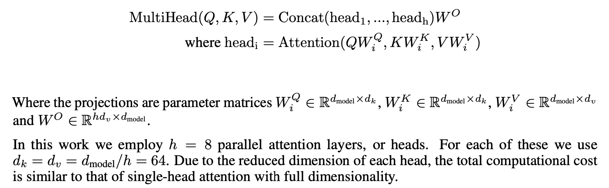

- **`embed_size` → $d_{\text{model}}$**：输入序列的嵌入维度，即 Transformer 中每个位置的特征向量维度。
- **`num_heads` → $h$**：注意力头的数量，即将输入序列拆分为多少个并行的注意力头。
- **`head_dim` → $d_k$**：每个注意力头的维度，由 $d_k = \frac{d_{\text{model}}}{h}$ 计算得到，确保所有头的总维度与嵌入维度一致。

```python
import torch
import torch.nn as nn
import torch.nn.functional as F
import math

class MultiHeadAttention(nn.Module):
    def __init__(self, d_model, h):
        """
        多头注意力机制：每个头单独定义线性层。
        
        参数:
            d_model: 输入序列的嵌入维度。
            h: 注意力头的数量。
        """
        super(MultiHeadAttention, self).__init__()
        assert d_model % h == 0, "d_model 必须能被 h 整除。"

        self.d_model = d_model
        self.h = h

        # “共享”的 Q, K, V 线性层
        self.w_q = nn.Linear(d_model, d_model)
        self.w_k = nn.Linear(d_model, d_model)
        self.w_v = nn.Linear(d_model, d_model)

        # 输出线性层，将多头拼接后的输出映射回 d_model
        self.fc_out = nn.Linear(d_model, d_model)

    def forward(self, q, k, v, mask=None):
        """
        前向传播函数。
        
        参数:
            q: 查询矩阵 (batch_size, seq_len_q, d_model)
            k: 键矩阵 (batch_size, seq_len_k, d_model)
            v: 值矩阵 (batch_size, seq_len_v, d_model)
            mask: 掩码矩阵 (batch_size, 1, seq_len_q, seq_len_k)

        返回:
            out: 注意力加权后的输出
            attention_weights: 注意力权重矩阵
        """
        batch_size = q.size(0)
        
        # 获取查询和键值的序列长度
        seq_len_q = q.size(1)
        seq_len_k = k.size(1)

        # 将线性变换后的“共享”矩阵拆分为多头，调整维度为 (batch_size, h, seq_len, d_k)
        # d_k 就是每个注意力头的维度
        Q = self.w_q(q).view(batch_size, seq_len_q, self.h, -1).transpose(1, 2)
        K = self.w_k(k).view(batch_size, seq_len_k, self.h, -1).transpose(1, 2)
        V = self.w_v(v).view(batch_size, seq_len_k, self.h, -1).transpose(1, 2)

        # 执行缩放点积注意力
        scaled_attention, _ = scaled_dot_product_attention(Q, K, V, mask)

        # 合并多头并还原为 (batch_size, seq_len_q, d_model)
        concat_out = scaled_attention.transpose(1, 2).contiguous().view(batch_size, -1, self.d_model)

        # 通过输出线性层
        out = self.fc_out(concat_out)  # (batch_size, seq_len_q, d_model)

        return out

def scaled_dot_product_attention(Q, K, V, mask=None):
    """
    缩放点积注意力计算。
    
    参数:
        Q: 查询矩阵 (batch_size, num_heads, seq_len_q, d_k)
        K: 键矩阵 (batch_size, num_heads, seq_len_k, d_k)
        V: 值矩阵 (batch_size, num_heads, seq_len_v, d_v)
        mask: 掩码矩阵 (batch_size, 1, seq_len_q, seq_len_k) 或 (1, 1, seq_len_q, seq_len_k) 或 (batch_size, h, seq_len_q, seq_len_k)

    返回:
        output: 注意力加权后的输出矩阵
        attention_weights: 注意力权重矩阵
    """
    d_k = Q.size(-1)  # d_k
    
    # 计算点积并进行缩放
    scores = torch.matmul(Q, K.transpose(-2, -1)) / math.sqrt(d_k)

    # 如果提供了掩码矩阵，则将掩码对应位置的分数设为 -inf
    if mask is not None:
        scores = scores.masked_fill(mask == 0, float('-inf'))

    # 对缩放后的分数应用 Softmax 函数，得到注意力权重
    attention_weights = F.softmax(scores, dim=-1)

    # 加权求和，计算输出
    output = torch.matmul(attention_weights, V)
    
    return output, attention_weights
```

## Position-wise Feed-Forward Networks（FFN）

> 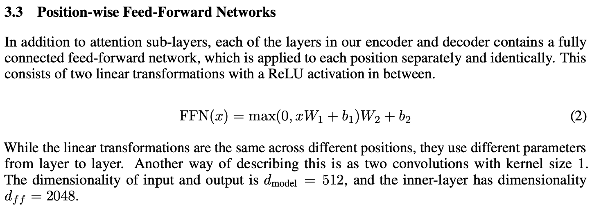

### 数学表达

> 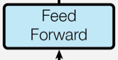

在编码器-解码器架构中，另一个看起来“大一点”的模块就是 Feed Forward，它在每个位置 $i$ 上的计算可以表示为：

$$
\text{FFN}(x_i) = \text{max}(0, x_i W_1 + b_1) W_2 + b_2
$$

其中：

- $x_i \in \mathbb{R}^{d_{\text{model}}}$ 表示第 $i$ 个位置的输入向量。 
- $W_1 \in \mathbb{R}^{d_{\text{model}} \times d_{\text{ff}}}$ 和 $W_2 \in \mathbb{R}^{d_{\text{ff}} \times d_{\text{model}}}$ 是两个线性变换的权重矩阵。
- $b_1 \in \mathbb{R}^{d_{\text{ff}}}$ 和 $b_2 \in \mathbb{R}^{d_{\text{model}}}$ 是对应的偏置向量。
- $\text{max}(0, \cdot)$ 是 **ReLU 激活函数**，用于引入非线性。

Position-wise 实际是线性层本身的一个特性，在线性层中，每个输入向量（对应于序列中的一个位置，比如一个词向量）都会通过相同的权重矩阵进行线性变换，这意味着每个位置的处理是相互独立的，逐元素这一点可以看成 kernal_size=1 的卷积核扫过一遍序列。

> 更进一步地了解概念 Position-wise 推荐观看：[Transformer论文逐段精读【论文精读】 56:53 - 58:50 部分](https://www.bilibili.com/video/BV1pu411o7BE/?share_source=copy_web&vd_source=e46571d631061853c8f9eead71bdb390&t=3413)。

### 代码实现

```python
import torch
import torch.nn as nn

class PositionwiseFeedForward(nn.Module):
    def __init__(self, d_model, d_ff, dropout=0.1):
        """
        位置前馈网络。
        
        参数:
            d_model: 输入和输出向量的维度
            d_ff: FFN 隐藏层的维度，或者说中间层
            dropout: 随机失活率（Dropout），即随机屏蔽部分神经元的输出，用于防止过拟合
        
        （实际上论文并没有确切地提到在这个模块使用 dropout，所以注释）
        """
        super(PositionwiseFeedForward, self).__init__()
        self.w_1 = nn.Linear(d_model, d_ff)  # 第一个线性层
        self.w_2 = nn.Linear(d_ff, d_model)  # 第二个线性层
        #self.dropout = nn.Dropout(dropout)   # Dropout 层

    def forward(self, x):
        # 先经过第一个线性层和 ReLU，然后经过第二个线性层
        return self.w_2(self.w_1(x).relu())  #self.w_2(self.dropout(self.w_1(x).relu()))

```

所以 FFN 本质就是两个线性变换之间嵌入了一个 **ReLU** 激活函数，实现起来非常简单。

## 残差连接（Residual Connection）和层归一化（Layer Normalization, LayerNorm）

> 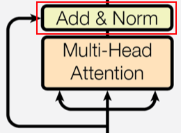

在 Transformer 架构中，**残差连接**（Residual Connection）与**层归一化**（LayerNorm）结合使用，统称为 **Add & Norm** 操作。

### Add（残差连接，Residual Connection）

> **ResNet**
> Deep Residual Learning for Image Recognition | [arXiv 1512.03385](https://arxiv.org/pdf/1512.03385)
>
> **简单，但有效。**

残差连接是一种跳跃连接（Skip Connection），它将层的输入直接加到输出上（观察架构图中的箭头），对应的公式如下：

$$
\text{Output} = \text{SubLayer}(x) + x
$$

这种连接方式有效缓解了**深层神经网络的梯度消失**问题。

#### Q: 为什么可以缓解梯度消失？

首先，我们需要了解什么是梯度消失。

在深度神经网络中，参数的梯度通过反向传播计算，其公式为：

$$
\frac{\partial \mathcal{L}}{\partial W} = \frac{\partial \mathcal{L}}{\partial h_n} \cdot \frac{\partial h_n}{\partial h_{n-1}} \cdot \ldots \cdot \frac{\partial h_1}{\partial W}
$$

当网络层数增加时，**链式法则**中的梯度相乘可能导致梯度值越来越小（梯度消失）或越来越大（梯度爆炸），使得模型难以训练和收敛。

假设输出层的损失为 $\mathcal{L}$, 且 $\text{SubLayer}(x)$ 表示为 $F(x)$。在没有残差连接的情况下，梯度通过链式法则计算为：

$$
\frac{\partial \mathcal{L}}{\partial x} = \frac{\partial \mathcal{L}}{\partial F(x)} \cdot \frac{\partial F(x)}{\partial x}
$$

如果 $\frac{\partial F(x)}{\partial x}$ 的绝对值小于 1，那么随着层数的增加，梯度会呈快速缩小，导致梯度消失。

引入残差连接后，输出变为 $F(x) + x$, 其梯度为：

$$
\frac{\partial \mathcal{L}}{\partial x} = \frac{\partial \mathcal{L}}{\partial (x + F(x))} \cdot (1 + \frac{\partial F(x)}{\partial x})
$$

这里，包含了一个常数项 1，这意味着即使 $\frac{\partial F(x)}{\partial x}$ 很小，梯度仍然可以有效地反向传播，缓解梯度消失问题。

#### 代码实现

```python
import torch
import torch.nn as nn

class ResidualConnection(nn.Module):
    def __init__(self, dropout=0.1):
        """
        残差连接，用于在每个子层后添加残差连接和 Dropout。
        
        参数:
            dropout: Dropout 概率，用于在残差连接前应用于子层输出，防止过拟合。
        """
        super(ResidualConnection, self).__init__()
        self.dropout = nn.Dropout(p=dropout)

    def forward(self, x, sublayer):
        """
        前向传播函数。
        
        参数:
            x: 残差连接的输入张量，形状为 (batch_size, seq_len, d_model)。
            sublayer: 子层模块的函数，多头注意力或前馈网络。

        返回:
            经过残差连接和 Dropout 处理后的张量，形状为 (batch_size, seq_len, d_model)。
        """
        # 将子层输出应用 dropout，然后与输入相加（参见论文 5.4 的表述或者本文「呈现」部分）
        return x + self.dropout(sublayer(x))
```

### Norm（层归一化，Layer Normalization）

> Layer Normalization | [arXiv 1607.06450](https://arxiv.org/pdf/1607.06450)

**层归一化**（LayerNorm）是一种归一化技术，用于提升训练的稳定性和模型的泛化能力。

#### Q: BatchNorm 和 LayerNorm 的区别

如果你听说过 **Batch Normalization (BatchNorm)**，或许会疑惑于二者的区别。

假设输入张量的形状为 **(batch_size, feature_size)**，其中 `batch_size=32`，`feature_size=512`。

- **batch_size**：表示批次中的样本数量。  
- **feature_size**：表示每个样本的特征维度，即每个样本包含 512 个特征。

这里的一行对应于一个样本，一列对应于一种特征属性。

- BatchNorm 基于一个**批次**（batch）内的所有样本，针对**特征维度**（列）进行归一化，即在每一列（相同特征或嵌入维度上的 batch_size 个样本）上计算均值和方差。

  - 对第 $j$ 列（特征）计算均值和方差：

    $`
    \mu_j = \frac{1}{\text{batch\_size}} \sum_{i=1}^{\text{batch\_size}} x_{i,j}, \quad 
    \sigma^2_j = \frac{1}{\text{batch\_size}} \sum_{i=1}^{\text{batch\_size}} (x_{i,j} - \mu_j)^2
    `$

- LayerNorm 基于**每个样本的所有特征**，针对**样本自身**（行内所有特征）进行归一化，即在每一行（一个样本的 embed_size 个特征）上计算均值和方差。

  - 对第 $i$ 行（样本）计算均值和方差：

    $`
    \mu_i = \frac{1}{\text{feature\_size}} \sum_{j=1}^{\text{feature\_size}} x_{i,j}, \quad 
    \sigma^2_i = \frac{1}{\text{feature\_size}} \sum_{j=1}^{\text{feature\_size}} (x_{i,j} - \mu_i)^2
    `$

用表格说明：

| 操作          | 处理维度                       | 解释                         |
| ------------- | ------------------------------ | ---------------------------- |
| **BatchNorm** | 对列（特征维度）归一化         | 每个特征在所有样本中的归一化 |
| **LayerNorm** | 对行（样本内的特征维度）归一化 | 每个样本的所有特征一起归一化 |

> BatchNorm 和 LayerNorm 在视频中也有讲解：[Transformer论文逐段精读【论文精读】25:40 - 32:04 部分](https://www.bilibili.com/video/BV1pu411o7BE/?share_source=copy_web&vd_source=e46571d631061853c8f9eead71bdb390&t=1540)，不过需要注意的是在 26:25 处应该除以的是标准差而非方差。
>
> 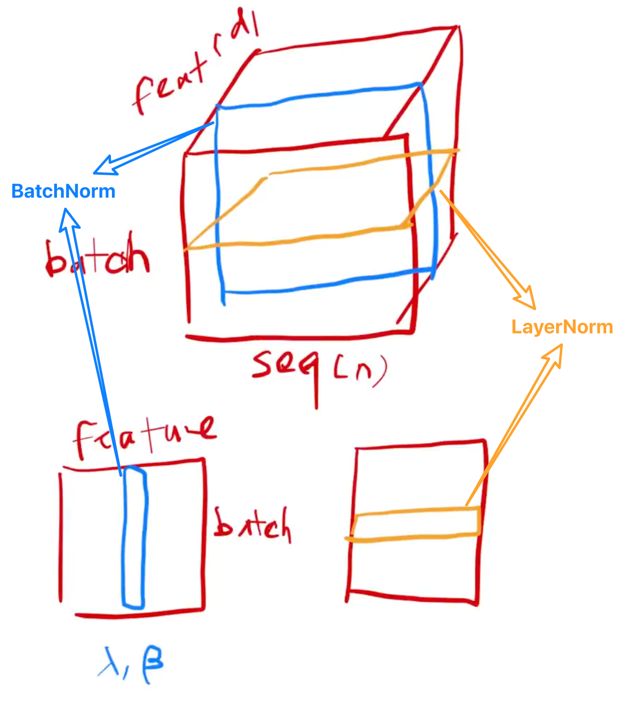
>
> 对于三维张量，比如图示的 (batch_size, seq_len, feature_size)，可以从立方体的左侧(batch_size, feature_size) 去看成二维张量进行切片。

#### LayerNorm 的计算过程

假设输入向量为 $x = (x_1, x_2, \dots, x_d)$, LayerNorm 的计算步骤如下：

1. **计算均值和方差**：
   对输入的所有特征求均值 $\mu$ 和方差 $\sigma^2$：
   
   $`
   \mu = \frac{1}{d} \sum_{j=1}^{d} x_j, \quad 
   \sigma^2 = \frac{1}{d} \sum_{j=1}^{d} (x_j - \mu)^2
   `$

2. **归一化公式**：
   将输入特征 $\hat{x}_i$ 进行归一化：
   
   $`
   \hat{x}_i = \frac{x_i - \mu}{\sqrt{\sigma^2 + \epsilon}}
   `$
   
   其中, $\epsilon$ 是一个很小的常数（比如 1e-9），用于防止除以零的情况。

3. **引入可学习参数**：
   归一化后的输出乘以 $\gamma$ 并加上 $\beta$, 公式如下：
   
   $`
   \text{Output} = \gamma \hat{x} + \beta
   `$
   
   其中 $\gamma$ 和 $\beta$ 是可学习的参数，用于进一步调整归一化后的输出。

#### 代码实现

```python
class LayerNorm(nn.Module):
    def __init__(self, feature_size, epsilon=1e-9):
        """
        层归一化，用于对最后一个维度进行归一化。
        
        参数:
            feature_size: 输入特征的维度大小，即归一化的特征维度。
            epsilon: 防止除零的小常数。
        """
        super(LayerNorm, self).__init__()
        self.gamma = nn.Parameter(torch.ones(feature_size))  # 可学习缩放参数，初始值为 1
        self.beta = nn.Parameter(torch.zeros(feature_size))  # 可学习偏移参数，初始值为 0
        self.epsilon = epsilon

    def forward(self, x):
        mean = x.mean(dim=-1, keepdim=True)
        std = x.std(dim=-1, keepdim=True)
        return self.gamma * (x - mean) / (std + self.epsilon) + self.beta
```

> [!note]
>
> #### 澄清：LayerNorm 最后的缩放与线性层 (nn.Linear) 的区别
>
> 见过线性层源码但不熟悉乘法运算符的同学可能会有一个错误的困惑：
>
> **最后不就是线性层的实现吗，为什么不直接用 `nn.Linear((x - mean) / (std + self.epsilon))` 实现呢？**
>
> 乍一看，LayerNorm 的计算过程确实与 `nn.Linear` 有些相似：LayerNorm 对归一化后的输出进行了缩放（乘以 $\gamma$）和偏移（加上 $\beta$），但这两者的核心作用和参数运算方式存在**本质的不同**，接下来逐一澄清：
>
> 1. `self.gamma * x` 实际上是逐元素缩放操作而非对输入做线性组合。
>
> 2. self.gamma 的 shape 为 `(feature_size,)` 而非 `(feature_size, feature_size)`。
>
> 3. 线性层的公式为: $\text{Output} = x W^T + b$, 代码实现为：
>
>    ```python
>    # 初始化的 shape 是二维的
>    self.weight = nn.Parameter(torch.randn(out_features, in_features))  # 权重矩阵
>    self.bias = nn.Parameter(torch.zeros(out_features))  # 偏置向量
>                                                                                                                                                                                           
>    # 计算
>    def forward(self, x):
>    	return torch.matmul(x, self.weight.T) + self.bias
>    ```
>
> LayerNorm 是 `* `逐元素乘积，nn.Linear 是 `torch.matmul()` 矩阵乘法，运行代码：
>
> ```python
> import torch
> 
> # 创建两个张量 A 和 B
> A = torch.tensor([[1, 2], [3, 4]])  # 形状 (2, 2)
> B = torch.tensor([[5, 6], [7, 8]])  # 形状 (2, 2)
> 
> ### 1. 逐元素乘法
> elementwise_product = A * B  # 对应位置元素相乘
> print("逐元素乘法 (A * B) 的结果：\n", elementwise_product)
> 
> ### 2. 矩阵乘法
> matrix_product = torch.matmul(A, B)  # 矩阵乘法
> print("矩阵乘法 (torch.matmul(A, B)) 的结果：\n", matrix_product)
> 
> ```
>
> **输出**：
>
> ```sql
> 逐元素乘法 (A * B) 的结果：
>  tensor([[ 5, 12],
>         [21, 32]])
> 矩阵乘法 (torch.matmul(A, B)) 的结果：
>  tensor([[19, 22],
>         [43, 50]])
> ```
>
> 可以看到二者并不是一个操作。

### Add & Norm

**操作步骤**：

1. **残差连接**：将输入直接与子层的输出相加。
2. **层归一化**：对相加后的结果进行归一化。

公式如下：

$$
\text{Output} = \text{LayerNorm}(x + \text{SubLayer}(x))
$$

其中, $\text{SubLayer}(x)$ 表示 Transformer 中的某个子层（如自注意力层或前馈网络层）的输出，因此，Add & Norm 操作也被称为“子层连接”，它在每个子层的输出上应用残差和归一化。

#### 代码实现

```python
class SublayerConnection(nn.Module):
    def __init__(self, feature_size, dropout=0.1, epsilon=1e-9):
        """
        子层连接，包括残差连接和层归一化，应用于 Transformer 的每个子层。

        参数:
            feature_size: 输入特征的维度大小，即归一化的特征维度。
            dropout: 残差连接中的 Dropout 概率。
            epsilon: 防止除零的小常数。
        """
        super(SublayerConnection, self).__init__()
        self.residual = ResidualConnection(dropout)  # 使用 ResidualConnection 进行残差连接
        self.norm = LayerNorm(feature_size, epsilon)  # 层归一化

    def forward(self, x, sublayer):
        # 将子层输出应用 dropout 后经过残差连接后再进行归一化，可见本文「呈现」部分
        return self.norm(self.residual(x, sublayer))

# 或者直接在 AddNorm 里面实现残差连接
class SublayerConnection(nn.Module):
    """
        子层连接的另一种实现方式，残差连接直接在该模块中实现。

        参数:
            feature_size: 输入特征的维度大小，即归一化的特征维度。
            dropout: 残差连接中的 Dropout 概率。
            epsilon: 防止除零的小常数。
        """
    def __init__(self, feature_size, dropout=0.1, epsilon=1e-9):
        super(SublayerConnection, self).__init__()
        self.norm = LayerNorm(feature_size, epsilon)
        self.dropout = nn.Dropout(p=dropout)

    def forward(self, x, sublayer):
        # 将子层输出应用 dropout 后经过残差连接后再进行归一化，可见本文「呈现」部分
        return self.norm(x + self.dropout(sublayer(x)))
```

这里是 Post-Norm，即残差连接后进行 LayerNorm，和 Transformer 论文的表述一致。另一种实现是 Pre-Norm，即在进入子层计算之前先进行 LayerNorm： ` return x + self.dropout(sublayer(self.norm(x)))`。

## 嵌入（Embeddings）

> 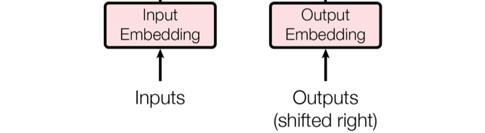

在 Transformer 模型中，**嵌入层**（Embedding Layer） 是处理输入和输出数据的关键步骤，因为模型实际操作的是**张量**（tensor），而非**字符串**（string）。在将输入文本传递给模型之前，首先需要进行**分词**（tokenization），即将文本拆解为多个 **token**，随后这些 token 会被映射为对应的 **token ID**，从而转换为模型可理解的数值形式。此时，数据的形状为 `(seq_len,)`，其中 `seq_len` 表示输入序列的长度。

### Q: 为什么需要嵌入层？

因为 token ID 只是整数标识符，彼此之间没有内在联系。如果直接使用这些整数，模型可能在训练过程中学习到一些模式，但无法充分捕捉词汇之间的语义关系，这显然不足以支撑起现在的大模型。

举个简单的例子来理解“语义”关系：像“猫”和“狗”在向量空间中的表示应该非常接近，因为它们都是宠物；“男人”和“女人”之间的向量差异可能代表性别的区别。此外，不同语言的词汇，如“男人”（中文）和“man”（英文），如果在相同的嵌入空间中，它们的向量也会非常接近，反映出跨语言的语义相似性。同时，【“女人”和“woman”（中文-英文）】与【“男人”和“man”（中文-英文）】之间的差异也可能非常相似。

对于模型而言，没有语义信息就像我们小时候刚开始读英语阅读报：“这些字母拼起来是什么？不知道。这些单词在说什么？不知道。”囫囵吞枣看完后去做题：“嗯，昨天对答案的时候，A 好像多一点，其他的差不多，那多选一点 A，其他平均分 :)。”

所以，为了让模型捕捉到 token 背后复杂的语义（Semantic meaning）关系，我们需要将离散的 token ID 映射到一个高维的连续向量空间（Continuous, dense）。这意味着每个 token ID 会被转换为一个**嵌入向量**（embedding vector），期望通过这种方式让语义相近的词汇在向量空间中距离更近，使模型能更好地捕捉词汇之间的关系。当然，简单的映射无法做到这一点，因此需要“炼丹”——是的，嵌入层是可以训练的。

### 代码实现

```python
import torch
import torch.nn as nn
import math

class Embeddings(nn.Module):
    """
    嵌入，将 token ID 转换为固定维度的嵌入向量，并进行缩放。

    参数:
        vocab_size: 词汇表大小。
        d_model: 嵌入向量的维度。
    """
    def __init__(self, vocab_size, d_model):
        super(Embeddings, self).__init__()
        self.embed = nn.Embedding(vocab_size, d_model)
        self.scale_factor = math.sqrt(d_model)

    def forward(self, x):
        """
        前向传播函数。

        参数:
            x: 输入张量，形状为 (batch_size, seq_len)，其中每个元素是 token ID。

        返回:
            缩放后的嵌入向量，形状为 (batch_size, seq_len, d_model)。
        """
        return self.embed(x) * self.scale_factor
```

**解释**：

- **`nn.Embedding`**：创建嵌入层，将词汇表中的每个 token ID 映射为对应的嵌入向量。

- **`vocab_size`**：词汇表的大小。

- **`d_model`**：嵌入向量的维度大小。

**特殊设计**

> 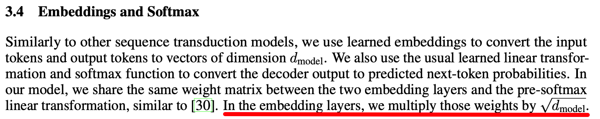

- **缩放嵌入（Scaled Embedding）**：将嵌入层的输出（参数）乘以 $\sqrt{d_{\text{model}}}$。

> [!note]
>
> Tokenization 的操作其实就是常用的 tokenizer，对 vocab 感兴趣的话可以进一步阅读这篇文章：《[21. BPE vs WordPiece：理解 Tokenizer 的工作原理与子词分割方法](../Guide/21.%20BPE%20vs%20WordPiece：理解%20Tokenizer%20的工作原理与子词分割方法.md)》。
>
> ### Q: 什么是 nn.Embedding()？和 nn.Linear() 的区别是什么？
>
> 其实非常简单，`nn.Embedding()` 就是从权重矩阵中查找与输入索引对应的行，类似于查找表操作，而 `nn.Linear()` 进行线性变换。直接对比二者的 `forward()` 方法：
>
> ```python
> # Embedding
> def forward(self, input):
> 	return self.weight[input]  # 没错，就是返回对应的行
> 
> # Linear
> def forward(self, input):
> 	torch.matmul(input, self.weight.T) + self.bias
> ```
>
> 运行下面的代码来验证：
>
> ```python
> import torch
> import torch.nn as nn
> 
> # 设置随机种子
> torch.manual_seed(42)
> 
> # nn.Embedding() 权重矩阵形状为 (num_embeddings, embedding_dim)
> num_embeddings = 5  # 假设有 5 个 token
> embedding_dim = 3   # 每个 token 对应 3 维嵌入
> 
> # 初始化嵌入层
> embedding = nn.Embedding(5, 3)
> 
> # 整数索引
> input_indices = torch.tensor([0, 2, 4])
> 
> # 查找嵌入
> output = embedding(input_indices)
> 
> # 打印结果
> print("权重矩阵：")
> print(embedding.weight.data)
> print("\nEmbedding 输出：")
> print(output)
> ```
>
> **输出**：
>
> ```sql
> 权重矩阵：
> tensor([[ 0.3367,  0.1288,  0.2345],
>   [ 0.2303, -1.1229, -0.1863],
>   [ 2.2082, -0.6380,  0.4617],
>   [ 0.2674,  0.5349,  0.8094],
>   [ 1.1103, -1.6898, -0.9890]])
> 
> Embedding 输出：
> tensor([[ 0.3367,  0.1288,  0.2345],
>   [ 2.2082, -0.6380,  0.4617],
>   [ 1.1103, -1.6898, -0.9890]], grad_fn=<EmbeddingBackward0>)
> ```
>
> **要点**：
>
> - **权重矩阵**：嵌入层的权重矩阵，其形状为 `(num_embeddings, embedding_dim)`，熟悉线性层的同学可以理解为 `(in_features, out_features)`。
> - **Embedding 输出**：根据输入索引，从权重矩阵中提取对应的嵌入向量（行）。
>   - 在例子中，输入索引 `[0, 2, 4]`，因此输出了权重矩阵中第 0、2、4 行对应的嵌入向量。
>
> 

## Softmax

> 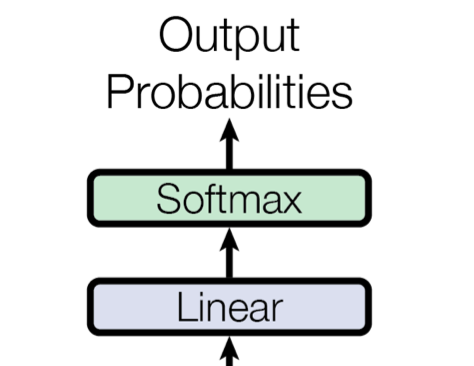

在 Transformer 模型中，**Softmax** 函数不仅在计算**注意力权重**时用到，在预测阶段的输出处理环节也会用到，因为预测 token 的过程可以看成是**多分类问题**。

**Softmax** 函数是一种常用的激活函数，能够将任意实数向量转换为**概率分布**，确保每个元素的取值范围在 [0, 1] 之间，并且所有元素的和为 1。其数学定义如下：

$$
\text{Softmax}(x_i) = \frac{e^{x_i}}{\sum_{j} e^{x_j}}
$$

其中：

- $x_i$ 表示输入向量中的第 $i$ 个元素。
- $\text{Softmax}(x_i)$ 表示输入 $x_i$ 转换后的概率。

我们可以把 Softmax 看作一种**归一化的指数变换**。相比于简单的比例归一化 $\frac{x_i}{\sum_j x_j}$, Softmax 通过指数变换放大数值间的差异，让较大的值对应更高的概率，同时避免了负值和数值过小的问题。

### 代码实现

实际使用时可以直接调用 `nn.Softmax()`，这里手动实现一个简单的 Softmax 函数，并与 `nn.Softmax()` 的结果进行对比，以加深公式的印象：

```python
import torch
import torch.nn as nn

def softmax(x):
    exp_x = torch.exp(x)
    sum_exp_x = torch.sum(exp_x, dim=-1, keepdim=True)
    return exp_x / sum_exp_x

# 测试向量
x = torch.tensor([1.0, 2.0, 3.0])

# 根据公式实现的 Softmax
result = softmax(x)

# 使用 nn.Softmax
softmax = nn.Softmax(dim=-1)
nn_result = softmax(x)

print("根据公式实现的 Softmax 结果：", result)
print("nn.Softmax 的结果：", nn_result)
```

**输出**：

```sql
根据公式实现的 Softmax 结果： tensor([0.0900, 0.2447, 0.6652])
nn.Softmax 的结果： tensor([0.0900, 0.2447, 0.6652])
```

### 交叉熵（Cross-Entropy）损失

在多分类任务中，Softmax 通常与**交叉熵损失**（Cross-Entropy Loss）配合使用（Transformer 同样如此）。交叉熵损失用于衡量模型预测的概率分布与真实分布之间的差异，其数学公式如下：

$$
\mathcal{L} = -\sum_{i} y_i \log(\hat{y}_i)
$$

其中：

- $y_i$ 是真实标签（ground-truth）的 one-hot 编码。
- $\hat{y}_i$ 是模型的预测概率（即 Softmax 的输出）。

### Q: Transformer 模型的输出是概率还是 logits？

> 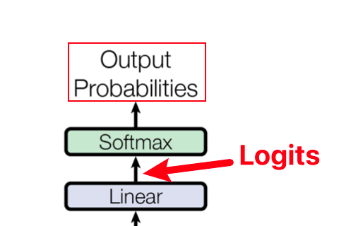

都可以，这一点并不重要，取决于选择哪种损失函数，如果使用的是交叉熵损失，那么Transformer 的输出是 **logits**，即未经过 Softmax 的原始输出，或者说最后一层线性层的输出（如图示）。这是因为在计算交叉熵损失时，使用的是带有 `log_softmax` 的 **`nn.CrossEntropyLoss()`**，该损失函数内部会自动对 logits 进行 Softmax 处理，并计算对数概率（详细可阅读《[f. 交叉熵损失函数 nn.CrossEntropyLoss() 详解和要点提醒（PyTorch）](../Guide/f.%20交叉熵损失函数%20nn.CrossEntropyLoss()%20详解和要点提醒（PyTorch）.md)》。

模型输出**概率**（即经过 Softmax 后）同样可以做交叉熵损失，这时需要用 **`nn.NLLLoss()`**（负对数似然损失）来计算。与 `nn.CrossEntropyLoss()` 不同的是，`nn.NLLLoss()` 直接接收对数概率，因此在使用之前，需要先对概率输出调用 `torch.log()` ，示例：

```python
import torch
import torch.nn as nn
import torch.nn.functional as F

# 定义输入和目标标签
logits = torch.tensor([[2.0, 0.5], [0.5, 2.0]])  # 未经过 softmax 的 logits
target = torch.tensor([0, 1])  # 目标标签

# 使用 nn.CrossEntropyLoss 计算损失（接受 logits）
criterion_ce = nn.CrossEntropyLoss()
loss_ce = criterion_ce(logits, target)

# 使用 softmax 后再使用 nn.NLLLoss 计算损失
log_probs = F.log_softmax(logits, dim=1)
criterion_nll = nn.NLLLoss()
loss_nll = criterion_nll(log_probs, target)

print(f"Loss using nn.CrossEntropyLoss: {loss_ce.item()}")
print(f"Loss using softmax + nn.NLLLoss: {loss_nll.item()}")
```

**输出**：

```sql
Loss using nn.CrossEntropyLoss: 0.2014133334159851
Loss using softmax + nn.NLLLoss: 0.2014133334159851
```


## 位置编码（Positional Encoding）

> 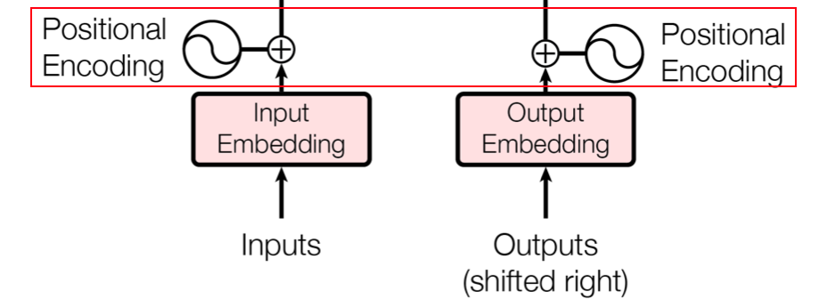

在 Transformer 模型中，由于不是循环（RNN）结构，模型本身无法捕捉输入序列中元素的位置信息。回顾一下注意力机制的计算过程，**得分**（score）是通过查询向量（query）和键向量（key）之间的内积得到的，生成的注意力权重（attention weights）也只是基于这些内积结果，这个操作不会捕捉到位置信息。

举个例子，把序列 `["A", "B", "C"]` 改成 `["B", "A", "C"]`，得到的输出也会是原来的结果按同样顺序打乱后的形式，假设原输出为 `[Z_A, Z_B, Z_C]`，打乱后的输出将变为 `[Z_B, Z_A, Z_C]`。

所以如果嵌入向量本身不包含位置信息，就意味着**输入元素的顺序不会影响输出的权重计算，模型无法从中捕捉到序列的顺序信息**，换句话说，只是输出的位置跟着对应变化，但对应的计算结果不会改变，可以用一句诗概括当前的现象：「天涯若比邻」。

为了解决这个问题，Transformer 引入了**位置编码（Positional Encoding）**：为每个位置生成一个向量，这个向量与对应的嵌入向量相加，从而在输入中嵌入位置信息。

在原始论文中，Transformer 使用的是固定位置编码（Positional Encoding），其公式如下：

$$
\begin{aligned}
PE_{(pos, 2i)} &= \sin\left(\frac{pos}{10000^{2i/d_{\text{model}}}}\right), \\
PE_{(pos, 2i+1)} &= \cos\left(\frac{pos}{10000^{2i/d_{\text{model}}}}\right).
\end{aligned}
$$

其中：

- $pos$ 表示位置索引（Position）。
- $i$ 表示维度索引。
- $d_{\text{model}}$ 是嵌入向量的维度。

位置编码在维度 4、5、6 和 7 上的变化：

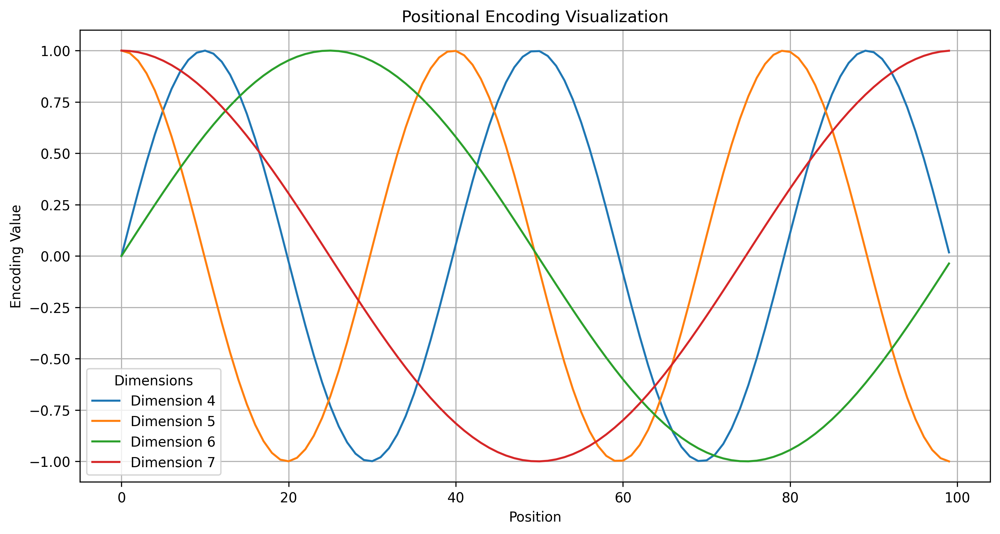

### 代码实现

```python
import torch
import torch.nn as nn
import math

class PositionalEncoding(nn.Module):
    def __init__(self, d_model, dropout=0.1, max_len=5000):
        """
        位置编码，为输入序列中的每个位置添加唯一的位置表示，以引入位置信息。

        参数:
            d_model: 嵌入维度，即每个位置的编码向量的维度。
            dropout: 位置编码后应用的 Dropout 概率。
            max_len: 位置编码的最大长度，适应不同长度的输入序列。
        """
        super(PositionalEncoding, self).__init__()
        self.dropout = nn.Dropout(p=dropout)  # 正如论文 5.4 节所提到的，需要将 Dropout 应用在 embedding 和 positional encoding 相加的时候
        
        # 创建位置编码矩阵，形状为 (max_len, d_model)
        pe = torch.zeros(max_len, d_model)
        position = torch.arange(0, max_len).unsqueeze(1)  # 位置索引 (max_len, 1)
        
        # 计算每个维度对应的频率
        div_term = torch.exp(
            torch.arange(0, d_model, 2) * (-math.log(10000.0) / d_model)
        )
        
        # 将位置和频率结合，计算 sin 和 cos
        pe[:, 0::2] = torch.sin(position * div_term)  # 偶数维度
        pe[:, 1::2] = torch.cos(position * div_term)  # 奇数维度
        
        # 增加一个维度，方便后续与输入相加，形状变为 (1, max_len, d_model)
        pe = pe.unsqueeze(0)
        
        # 将位置编码注册为模型的缓冲区，不作为参数更新
        self.register_buffer('pe', pe)
    
    def forward(self, x):
        """
        前向传播函数。

        参数:
            x: 输入序列的嵌入向量，形状为 (batch_size, seq_len, d_model)。

        返回:
            加入位置编码和 Dropout 后的嵌入向量，形状为 (batch_size, seq_len, d_model)。
        """
        # 取出与输入序列长度相同的部分位置编码，并与输入相加
        x = x + self.pe[:, :x.size(1), :]
        
        # 应用 dropout
        return self.dropout(x)
```

## 输入处理

> 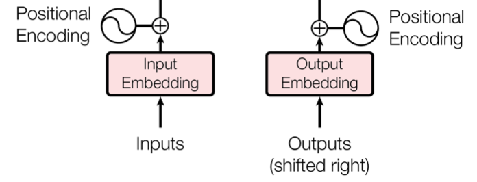

在完成嵌入和位置编码的代码后，就可以实现编码器和解码器的输入处理。二者处理代码的主体完全一致，只是 `vocab_size` 根据实际情况可能会有所不同。

### 编码器输入处理

> 

编码器的输入由输入嵌入（Input Embedding）和位置编码（Positional Encoding）组成，在机器翻译任务中，还可以称为源语言嵌入（Source Embedding）。

```python
class SourceEmbedding(nn.Module):
    def __init__(self, src_vocab_size, d_model, dropout=0.1):
        """
        源序列嵌入，将输入的 token 序列转换为嵌入向量并添加位置编码。

        参数:
            src_vocab_size: 源语言词汇表的大小
            d_model: 嵌入向量的维度
            dropout: 在位置编码后应用的 Dropout 概率
        """
        super(SourceEmbedding, self).__init__()
        self.embed = Embeddings(src_vocab_size, d_model)  # 词嵌入层
        self.positional_encoding = PositionalEncoding(d_model, dropout)  # 位置编码层

    def forward(self, x):
        """
        前向传播函数。

        参数:
            x: 源语言序列的输入张量，形状为 (batch_size, seq_len_src)，其中每个元素是 token ID。

        返回:
            添加位置编码后的嵌入向量，形状为 (batch_size, seq_len_src, d_model)。
        """
        x = self.embed(x)  # 生成词嵌入 (batch_size, seq_len_src, d_model)
        return self.positional_encoding(x)  # 加入位置编码

```

### 解码器输入处理

> 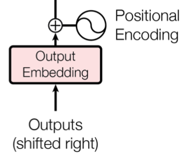

解码器的输入由输出嵌入（Output Embedding）和位置编码（Positional Encoding）组成，在机器翻译这个任务中也可以称为目标语言嵌入（Target Embedding），为了避免与最终输出混淆，使用 `TargetEmbedding` 进行实现。

```python
class TargetEmbedding(nn.Module):
    def __init__(self, tgt_vocab_size, d_model, dropout=0.1):
        """
        目标序列嵌入，将目标序列的 token ID 转换为嵌入向量并添加位置编码。

        参数:
            tgt_vocab_size: 目标语言词汇表的大小
            d_model: 嵌入向量的维度
            dropout: 在位置编码后应用的 Dropout 概率
        """
        super(TargetEmbedding, self).__init__()
        self.embed = Embeddings(tgt_vocab_size, d_model)  # 词嵌入层
        self.positional_encoding = PositionalEncoding(d_model, dropout)  # 位置编码层

    def forward(self, x):
        """
        前向传播函数。

        参数:
            x: 目标序列的输入张量，形状为 (batch_size, seq_len_tgt)，其中每个元素是 token ID。

        返回:
            添加位置编码后的嵌入向量，形状为 (batch_size, seq_len_tgt, d_model)。
        """
        x = self.embed(x)  # 生成词嵌入 (batch_size, seq_len_tgt, d_model)
        return self.positional_encoding(x)  # 加入位置编码
```

注意到架构图中解码器的输入 Outputs 实际上做了额外的处理：shifted right。

#### Q: 什么是右移（shifted right）？

> 

“在预测序列的第一个位置时，当前的掩码只允许模型看到第一个位置。那么，此时解码器的输入应该是什么呢？”

“等下，为什么预测第一个还能看第一个，这不就直接看到「答案」了吗？”

“是的，如果没有提前处理的话会出现这个问题。所以，该怎么处理才能既看到第一个位置又不看到答案呢？”

“那就...让第一个位置不是答案！右移一位，左边补「0」”

“没错，计算机专业的同学应该很熟悉这种移位操作，也可以使用特殊的开始标记（`<sos>`）进行补位。“

##### 数学表述

目标输出序列 $Y = (y_1, y_2, ..., y_T)$ 向右移动一位，生成一个新的序列 $Y' = (0, y_1, y_2, ..., y_{T-1})$，其中第一个位置用填充标记（假设为 0 或特定的开始标记 `<sos>`）占位。

需要注意的是，这个操作位于嵌入（Embedding）之前，可以将公式 $Y$ 中的元素当作 token id。

##### 举例

假设目标序列是 “I love NLP”，在右移之后得到输入序列：

```python
<sos> I love NLP
```

这样在训练时就能避免“偷看”当前位置，具体预测过程如下：

- 输入 `<sos>` 预测 “I”
- 输入 `<sos> I` 预测 “love”
- 输入 `<sos> I love` 预测 “NLP”

这是一个非常优雅的解决方案，与掩码协同工作，防止模型在训练时泄露未来信息。

> [!tip]
>
> `<SOS>` 是 “Start of Sequence”的缩写，用于指示一个序列的开始，有时也使用另一个标记：`<BOS>`（“Beginning of Sequence”）。这些标记本身并没有什么意义，都是人为赋予的一个名字，使用自定义的标记作为序列开始是完全允许的。

另外，右移操作通常不是在 Transformer 模型内部处理的，而是在数据传入模型之前的预处理阶段。例如，假设目标序列已经经过分词并添加了特殊标记：

```python
tgt = "<sos> I love NLP <eos>"
```

我们需要从这个序列获取输入和输出：

```python

tgt_input = tgt[:-1]  # "<sos> I love NLP"
tgt_output = tgt[1:]  # "I love NLP <eos>"
```

在训练过程中，解码器将使用 `tgt_input` 来预测 `tgt_output`。具体过程如下：

- 输入 `<sos>` 预测 “I”
- 输入 `<sos> I` 预测 “love”
- 输入 `<sos> I love` 预测 “NLP”
- 输入 `<sos> I love NLP` 预测 `<eos>`

> [!note]
>
> 当前的 `tgt` 是一维的字符串。如果要处理一个**批次（batch）**中的数据，需要对张量的每一维进行切片。例如，对于形状为 `(batch_size, seq_len)` 的张量 `tgt`：
>
> ```python
> tgt_input = tgt[:, :-1]  # 去除每个序列的最后一个token
> tgt_output = tgt[:, 1:]  # 去除每个序列的第一个token
> ```
> 
> 这样，`tgt_input` 和 `tgt_output` 分别对应批次序列的输入和目标输出，用于模型训练。

## 掩码

在 Transformer 模型中，掩码用于控制注意力机制中哪些位置需要被忽略，本文在[之前](#q-为什么需要-mask-机制)讲解过为什么需要掩码机制，在这里我们将分别实现它们。

### 填充掩码（Padding Mask）

填充掩码用于在注意力计算时屏蔽填充 `<PAD>` 位置，防止模型计算注意力权重的时候考虑这些无意义的位置，在编码器的自注意力中使用。

```python
def create_padding_mask(seq, pad_token_id=0):
    # seq 的形状为 (batch_size, seq_len)
    mask = (seq != pad_token_id).unsqueeze(1).unsqueeze(2)  # (batch_size, 1, 1, seq_len)
    return mask  # 在注意力计算时，填充值为 0 的位置会被屏蔽
```

**注意**：这里接受的参数为 pad_token_id，这意味着掩码操作在嵌入操作前，也就是分词（tokenize）然后映射为 Token IDs 后进行。

#### 示例

假设我们有以下两个序列，经过分词和映射后：

```python
seq = torch.tensor([[5, 7, 9, 0, 0], [8, 6, 0, 0, 0]])  # 0 表示 <PAD>
print(create_padding_mask(seq))
```

**输出**：

```python
tensor([[[[ True,  True,  True, False, False]]],
        [[[ True,  True, False, False, False]]]])
```

这表示在注意力计算时，填充位置将被屏蔽。

### 未来信息掩码（Look-ahead Mask）

未来信息掩码用于在解码器中屏蔽未来的位置，防止模型在预测下一个词时“偷看”答案（训练时），在解码器中使用。

```python
def create_look_ahead_mask(size):
    mask = torch.tril(torch.ones(size, size)).type(torch.bool)  # 下三角矩阵
    return mask  # (seq_len, seq_len)
```

#### 示例

对于序列长度 5：

```python
print(create_look_ahead_mask(5))
```

**输出**：

```
tensor([[False,  True,  True,  True,  True],
        [False, False,  True,  True,  True],
        [False, False, False,  True,  True],
        [False, False, False, False,  True],
        [False, False, False, False, False]])
```

这表示在第 `i` 个位置，模型只能看到位置 `0` 到 `i`，而屏蔽位置 `i+1` 及之后的信息。

### 组合掩码

在实际应用中，我们需要将填充掩码和未来信息掩码进行组合，以同时实现两种掩码的效果。

```python
def create_decoder_mask(tgt_seq, pad_token_id=0):
    padding_mask = create_padding_mask(tgt_seq, pad_token_id)  # (batch_size, 1, 1, seq_len_tgt)
    look_ahead_mask = create_look_ahead_mask(tgt_seq.size(1)).to(tgt_seq.device)  # (seq_len_tgt, seq_len_tgt)

    combined_mask = look_ahead_mask.unsqueeze(0) & padding_mask  # (batch_size, 1, seq_len_tgt, seq_len_tgt)
    return combined_mask
```

#### 示例

假设目标序列 `tgt_seq` 为 `[1, 2, 3, 4, <PAD>]`：

```python
tgt_seq = torch.tensor([[1, 2, 3, 4, 0]])  # 0 表示 <PAD>
print(create_decoder_mask(tgt_seq))
```

**输出**：

```python
tensor([[[[ True, False, False, False, False],
          [ True,  True, False, False, False],
          [ True,  True,  True, False, False],
          [ True,  True,  True,  True, False],
          [ True,  True,  True,  True, False]]]])
```

观察最后一行。

### 总结

假设目标序列 `tgt_seq = [A, B, C, D, <PAD>]`。

- **填充掩码**：会屏蔽 `<PAD>` 位置。
- **未来信息掩码**：在位置 `C`，模型只能看到 `A`、`B` 和 `C`，但在最后一个位置上，会看到全部（包括 `<PAD>`）。
- **组合掩码**：在位置 `C`，模型只能看到 `A`、`B` 和 `C`，在最后一个位置上，模型也只能看到 `A`、`B`、`C` 和 `D`。

---

🎉 至此我们完成了模型架构中的所有子模块，是时候构建它们了。

## 子层模块

### 编码器层 （Encoder Layer）

> 

**组件**：

- 多头自注意力（Multi-Head Self-Attention）
- 前馈神经网络（Feed Forward）
- 残差连接和层归一化（Add & Norm），或称之为子层连接（SublayerConnection）

#### 代码实现

```python
class EncoderLayer(nn.Module):
    def __init__(self, d_model, h, d_ff, dropout):
        """
        编码器层。
        
        参数:
            d_model: 嵌入维度
            h: 多头注意力的头数
            d_ff: 前馈神经网络的隐藏层维度
            dropout: Dropout 概率
        """
        super(EncoderLayer, self).__init__()
        self.self_attn = MultiHeadAttention(d_model, h)  # 多头自注意力（Multi-Head Self-Attention）
        self.feed_forward = PositionwiseFeedForward(d_model, d_ff, dropout)  # 前馈神经网络
        
        # 定义两个子层连接，分别用于多头自注意力和前馈神经网络（对应模型架构图中的两个残差连接）
        self.sublayers = nn.ModuleList([SublayerConnection(d_model, dropout) for _ in range(2)])
        self.d_model = d_model

    def forward(self, x, src_mask):
        """
        前向传播函数。

        参数:
            x: 输入张量，形状为 (batch_size, seq_len, d_model)。
            src_mask: 源序列掩码，用于自注意力。

        返回:
            编码器层的输出，形状为 (batch_size, seq_len, d_model)。
        """
        x = self.sublayers[0](x, lambda x: self.self_attn(x, x, x, src_mask))  # 自注意力子层
        x = self.sublayers[1](x, self.feed_forward)  # 前馈子层
        return x
```

### 解码器层（Decoder Layer）

> 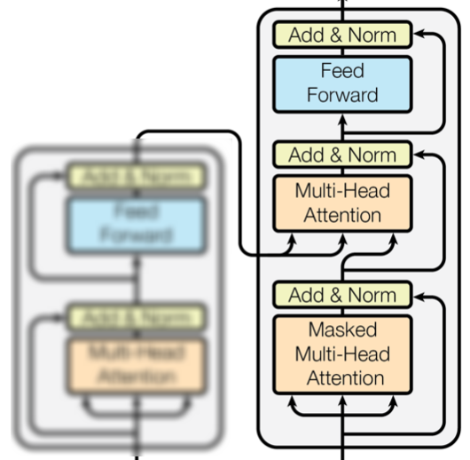

**组件**：

- 掩码多头自注意力（Masked Multi-Head Self-Attention）
- 多头交叉注意力（Multi-Head Cross-Attention）
- 前馈神经网络（Feed Forward）
- 残差连接和归一化（Add & Norm），或称之为子层连接（SublayerConnection）

#### 代码实现

```python
class DecoderLayer(nn.Module):
    def __init__(self, d_model, h, d_ff, dropout):
        """
        解码器层。
        
        参数:
            d_model: 嵌入维度
            h: 多头注意力的头数
            d_ff: 前馈神经网络的隐藏层维度
            dropout: Dropout 概率
        """
        super(DecoderLayer, self).__init__()
        self.self_attn = MultiHeadAttention(d_model, h)  # 掩码多头自注意力（Masked Multi-Head Self-Attention）
        self.cross_attn = MultiHeadAttention(d_model, h)  # 多头交叉注意力（Multi-Head Cross-Attention）
        self.feed_forward = PositionwiseFeedForward(d_model, d_ff, dropout)  # 前馈神经网络
        
        # 定义三个子层连接，分别用于掩码多头自注意力、多头交叉注意力和前馈神经网络（对应模型架构图中的三个残差连接）
        self.sublayers = nn.ModuleList([SublayerConnection(d_model, dropout) for _ in range(3)])
        self.d_model = d_model

    def forward(self, x, memory, src_mask, tgt_mask):
        """
        前向传播函数。
        参数:
            x: 解码器输入 (batch_size, seq_len_tgt, d_model)
            memory: 编码器输出 (batch_size, seq_len_src, d_model)
            src_mask: 源序列掩码，用于交叉注意力
            tgt_mask: 目标序列掩码，用于自注意力
        返回:
            x: 解码器层的输出
        """
        # 第一个子层：掩码多头自注意力（Masked Multi-Head Self-Attention）
        x = self.sublayers[0](x, lambda x: self.self_attn(x, x, x, tgt_mask))
        
        # 第二个子层：交叉多头注意力（Multi-Head Cross-Attention），使用编码器的输出 memory
        x = self.sublayers[1](x, lambda x: self.cross_attn(x, memory, memory, src_mask))
        
        # 第三个子层：前馈神经网络
        x = self.sublayers[2](x, self.feed_forward)
        
        return x
```

## 编码器（Encoder）

```python
class Encoder(nn.Module):
    def __init__(self, d_model, N, h, d_ff, dropout=0.1):
        """
        编码器，由 N 个 EncoderLayer 堆叠而成。
        
        参数:
            d_model: 嵌入维度
            N: 编码器层的数量
            h: 多头注意力的头数
            d_ff: 前馈神经网络的隐藏层维度
            dropout: Dropout 概率
        """
        super(Encoder, self).__init__()
        self.layers = nn.ModuleList([
            EncoderLayer(d_model, h, d_ff, dropout) for _ in range(N)
        ])
        self.norm = LayerNorm(d_model)  # 最后层归一化

    def forward(self, x, mask):
        """
        前向传播函数。
        
        参数:
            x: 输入张量 (batch_size, seq_len, d_model)
            mask: 输入掩码
        
        返回:
            编码器的输出
        """
        for layer in self.layers:
            x = layer(x, mask)
        return self.norm(x)  # 最后层归一化

```

## 解码器（Decoder）

```python
class Decoder(nn.Module):
    def __init__(self, d_model, N, h, d_ff, dropout=0.1):
        """
        解码器，由 N 个 DecoderLayer 堆叠而成。
        
        参数:
            d_model: 嵌入维度
            N: 解码器层的数量
            h: 多头注意力的头数
            d_ff: 前馈神经网络的隐藏层维度
            dropout: Dropout 概率
        """
        super(Decoder, self).__init__()
        self.layers = nn.ModuleList([
            DecoderLayer(d_model, h, d_ff, dropout) for _ in range(N)
        ])
        self.norm = LayerNorm(d_model)  # 最后层归一化

    def forward(self, x, memory, src_mask, tgt_mask):
        """
        前向传播函数。
        
        参数:
            x: 解码器输入 (batch_size, seq_len_tgt, d_model)
            memory: 编码器的输出 (batch_size, seq_len_src, d_model)
            src_mask: 用于交叉注意力的源序列掩码
            tgt_mask: 用于自注意力的目标序列掩码
            
        返回:
            解码器的输出
        """
        for layer in self.layers:
            x = layer(x, memory, src_mask, tgt_mask)
        return self.norm(x)  # 最后层归一化

```

## 完整模型

> 

**完整组件**：

- **输入嵌入和位置编码**：
  - `SourceEmbedding`：对源序列进行嵌入并添加位置编码。
  - `TargetEmbedding`：对目标序列进行嵌入并添加位置编码。

- **多头注意力和前馈网络**：

  - `MultiHeadAttention`：多头注意力机制。
  - `PositionwiseFeedForward`：位置前馈网络。

- **编码器和解码器**：

  - `Encoder`：由多个 `EncoderLayer` 堆叠而成。
  - `Decoder`：由多个 `DecoderLayer` 堆叠而成。

- **输出层**：

  - `fc_out`：线性层，将解码器的输出映射到目标词汇表维度。

```python
class Transformer(nn.Module):
    def __init__(self, src_vocab_size, tgt_vocab_size, d_model, N, h, d_ff, dropout=0.1):
        """
        Transformer 模型，由编码器和解码器组成。

        参数:
            src_vocab_size: 源语言词汇表大小
            tgt_vocab_size: 目标语言词汇表大小
            d_model: 嵌入维度
            N: 编码器和解码器的层数
            h: 多头注意力的头数
            d_ff: 前馈神经网络的隐藏层维度
            dropout: Dropout 概率
        """
        super(Transformer, self).__init__()

        # 输入嵌入和位置编码，src 对应于编码器输入，tgt 对应于解码器输入
        self.src_embedding = SourceEmbedding(src_vocab_size, d_model, dropout)
        self.tgt_embedding = TargetEmbedding(tgt_vocab_size, d_model, dropout)  # 共享：self.tgt_embedding = self.src_embedding

        # 编码器和解码器
        self.encoder = Encoder(d_model, N, h, d_ff, dropout)
        self.decoder = Decoder(d_model, N, h, d_ff, dropout)

        # 输出线性层
        self.fc_out = nn.Linear(d_model, tgt_vocab_size)

    def forward(self, src, tgt):
        """
        前向传播函数。

        参数:
            src: 源序列输入 (batch_size, seq_len_src)
            tgt: 目标序列输入 (batch_size, seq_len_tgt)

        返回:
            Transformer 的输出（未经过 Softmax）
        """
        # 生成掩码
        src_mask = create_padding_mask(src)
        tgt_mask = create_decoder_mask(tgt)

        # 编码器
        enc_output = self.encoder(self.src_embedding(src), src_mask)

        # 解码器
        dec_output = self.decoder(self.tgt_embedding(tgt), enc_output, src_mask, tgt_mask)

        # 输出层
        output = self.fc_out(dec_output)

        return output
```

### 实例化

使用 Transformer base 的参数配置来实例化模型并打印模型架构：

```python
# 定义词汇表大小（根据数据集）
src_vocab_size = 5000  # 源语言词汇表大小
tgt_vocab_size = 5000  # 目标语言词汇表大小

# 使用 Transformer base 参数
d_model = 512      # 嵌入维度
N = 6              # 编码器和解码器的层数
h = 8              # 多头注意力的头数
d_ff = 2048        # 前馈神经网络的隐藏层维度
dropout = 0.1      # Dropout 概率

# 实例化模型
model = Transformer(
    src_vocab_size=src_vocab_size,
    tgt_vocab_size=tgt_vocab_size,
    d_model=d_model,
    N=N,
    h=h,
    d_ff=d_ff,
    dropout=dropout
)

# 打印模型架构
print(model)
```

**输出**：

```sql
Transformer(
  (src_embedding): SourceEmbedding(
    (embed): Embeddings(
      (embed): Embedding(5000, 512)
    )
    (positional_encoding): PositionalEncoding(
      (dropout): Dropout(p=0.1, inplace=False)
    )
  )
  (tgt_embedding): TargetEmbedding(
    (embed): Embeddings(
      (embed): Embedding(5000, 512)
    )
    (positional_encoding): PositionalEncoding(
      (dropout): Dropout(p=0.1, inplace=False)
    )
  )
  (encoder): Encoder(
    (layers): ModuleList(
      (0-5): 6 x EncoderLayer(
        (self_attn): MultiHeadAttention(
          (w_q): Linear(in_features=512, out_features=512, bias=True)
          (w_k): Linear(in_features=512, out_features=512, bias=True)
          (w_v): Linear(in_features=512, out_features=512, bias=True)
          (fc_out): Linear(in_features=512, out_features=512, bias=True)
        )
        (feed_forward): PositionwiseFeedForward(
          (w_1): Linear(in_features=512, out_features=2048, bias=True)
          (w_2): Linear(in_features=2048, out_features=512, bias=True)
          (dropout): Dropout(p=0.1, inplace=False)
        )
        (sublayers): ModuleList(
          (0-1): 2 x SublayerConnection(
            (norm): LayerNorm()
            (dropout): Dropout(p=0.1, inplace=False)
          )
        )
      )
    )
    (norm): LayerNorm()
  )
  (decoder): Decoder(
    (layers): ModuleList(
      (0-5): 6 x DecoderLayer(
        (self_attn): MultiHeadAttention(
          (w_q): Linear(in_features=512, out_features=512, bias=True)
          (w_k): Linear(in_features=512, out_features=512, bias=True)
          (w_v): Linear(in_features=512, out_features=512, bias=True)
          (fc_out): Linear(in_features=512, out_features=512, bias=True)
        )
        (cross_attn): MultiHeadAttention(
          (w_q): Linear(in_features=512, out_features=512, bias=True)
          (w_k): Linear(in_features=512, out_features=512, bias=True)
          (w_v): Linear(in_features=512, out_features=512, bias=True)
          (fc_out): Linear(in_features=512, out_features=512, bias=True)
        )
        (feed_forward): PositionwiseFeedForward(
          (w_1): Linear(in_features=512, out_features=2048, bias=True)
          (w_2): Linear(in_features=2048, out_features=512, bias=True)
          (dropout): Dropout(p=0.1, inplace=False)
        )
        (sublayers): ModuleList(
          (0-2): 3 x SublayerConnection(
            (norm): LayerNorm()
            (dropout): Dropout(p=0.1, inplace=False)
          )
        )
      )
    )
    (norm): LayerNorm()
  )
  (fc_out): Linear(in_features=512, out_features=5000, bias=True)
)
```

### 示例

假设：

- **批次大小（batch_size）**：32
- **源序列长度（seq_len_src）**：10
- **目标序列长度（seq_len_tgt）**：15
- **嵌入维度（d_model）**：512

#### 各模块的预期输出形状

| 模块                | 输入形状      | 输出形状                     |
| ------------------- | ------------- | ---------------------------- |
| 输入序列 `src`      | (32, 10)      | (32, 10, 512) （经过嵌入后） |
| 输入序列 `tgt`      | (32, 15)      | (32, 15, 512) （经过嵌入后） |
| 编码器输出          | (32, 10, 512) | (32, 10, 512)                |
| 解码器输出          | (32, 15, 512) | (32, 15, 512)                |
| 最终线性层 `fc_out` | (32, 15, 512) | (32, 15, tgt_vocab_size)     |

#### 代码

```python
import torch
import torch.nn as nn

# 假设
batch_size = 32
seq_len_src = 10
seq_len_tgt = 15

# 构造输入
src = torch.randint(0, 100, (batch_size, seq_len_src))  # (batch_size, seq_len_src)
tgt = torch.randint(0, 100, (batch_size, seq_len_tgt))  # (batch_size, seq_len_tgt)

# 获取掩码用于打印编码器和解码器的输出
src_mask = create_padding_mask(src)
tgt_mask = create_decoder_mask(tgt)

# 模型最终输出
output = model(src, tgt)

# 打印各部分的输出形状
print("Source embedding shape:", model.src_embedding(src).shape)  # (batch_size, seq_len_src, d_model)
print("Encoder output shape:", model.encoder(model.src_embedding(src), src_mask).shape)  # (batch_size, seq_len_src, d_model)
print("Target embedding shape:", model.tgt_embedding(tgt).shape)  # (batch_size, seq_len_tgt, d_model)
print("Decoder output shape:", model.decoder(model.tgt_embedding(tgt), model.encoder(model.src_embedding(src), src_mask), src_mask, tgt_mask).shape)  # (batch_size, seq_len_tgt, d_model)
print("Final output shape:", output.shape)  # (batch_size, seq_len_tgt, tgt_vocab_size)
```

**输出**：

```sql
Source embedding shape: torch.Size([32, 10, 512])
Encoder output shape: torch.Size([32, 10, 512])
Target embedding shape: torch.Size([32, 15, 512])
Decoder output shape: torch.Size([32, 15, 512])
Final output shape: torch.Size([32, 15, 5000])
```

### PyTorch 官方实现

以下代码展示了 PyTorch 官方提供的 Transformer 架构的定义和打印，感兴趣的同学可以参考此代码的输出（结果放在[附录](#附录)），与本文实现的 Transformer 进行对比。

```python
import torch.nn as nn

# 使用 Transformer base 参数
d_model = 512      # 嵌入维度
N = 6              # 编码器和解码器的层数
h = 8              # 多头注意力的头数
d_ff = 2048        # 前馈神经网络的隐藏层维度
dropout = 0.1      # Dropout 概率

model = nn.Transformer(
    d_model=d_model,
    nhead=h,
    num_encoder_layers=N,
    num_decoder_layers=N,
    dim_feedforward=d_ff,
    dropout=dropout,
    batch_first=True
)

print(model)
```

## QA

### Q1: 什么是编码器-解码器架构？

将**输入序列**编码为高维特征表示，再将这些表示解码为**输出序列**，具体数学表述如下：

- **编码器**将输入序列 $X = (x_1, ..., x_n)$ 映射为特征表示 $Z = (z_1, ..., z_n)$, 这些表示实际上代表了输入的高维语义信息。

- **解码器**基于编码器生成的表示 $Z$, 逐步生成输出序列 $Y = (y_1, ..., y_m)$。在每一步解码时，解码器是**自回归**（auto-regressive）的，即依赖于先前生成的符号作为输入，以生成当前符号。
  
  - 在第 $t$ 步时，解码器会将上一步生成的 $y_{t-1}$ 作为额外输入，以预测当前时间步的 $y_t$。 
  
  > 结合下面的 GIF 进行理解：
  >
  > 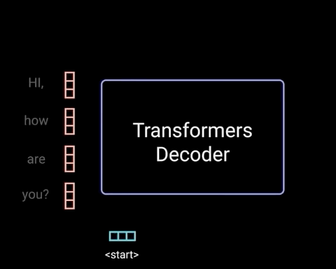
  >
  > —— [Illustrated Guide to Transformers- Step by Step Explanation](https://towardsdatascience.com/illustrated-guide-to-transformers-step-by-step-explanation-f74876522bc0) 中解码器部分的配图。

### Q2: 什么是自回归与非自回归？

> 图源自[生成式人工智能导论第 15 讲的PDF](https://speech.ee.ntu.edu.tw/~hylee/genai/2024-spring-course-data/0517/0517_strategy.pdf)。


#### 自回归（Auto-Regressive）

**自回归生成**是指序列生成过程中，**每个新生成的 token 依赖于之前生成的 token**。这意味着生成过程是**串行的**，每一步的输入由**前面已生成的 token 组成的上下文序列**构成。例如：

- 假设要生成一个长度为 $T$ 的句子 $y = (y_1, y_2, \dots, y_T)$，在生成句子 $y$ 的过程中，首先生成 $y_1$，然后在生成 $y_2$ 时需要考虑 $y_1$；在生成 $y_3$ 时，需要考虑 $(y_1, y_2)$，以此类推，直到生成结束符号（`<end>`）。

这种设计确保了生成过程中的连贯性和逻辑一致性，当前大多数语言模型（如 GPT 系列）都采用自回归生成的方式。

#### 非自回归（Non-Autoregressive）

**非自回归生成**是一种**并行生成**的方式，**一次性生成多个甚至全部的 token**，从而显著提高生成速度，但也会**牺牲一定的生成质量**。

> **拓展**
>
> 现在也有工作使用非自回归模型作为“预言家”来指导自回归模型并行生成，从而在生成质量不变的情况下大幅度提高生成速度，以“空间”换时间。
>
> 
>
> **相关论文**：
>
> - Fast Inference from Transformers via Speculative Decoding: [arXiv 2211.17192](https://arxiv.org/pdf/2211.17192)
> - Accelerating Large Language Model Decoding with Speculative Sampling: [arXiv 2302.01318](https://arxiv.org/pdf/2302.01318)

### Q3: 既然输出 $h_t$ 同样依赖于 $h_{t-1}$, 那并行体现在哪？

虽然在**推理阶段（inference）**，生成过程看起来必须是顺序的（实际也是如此），因为每一步的输出都依赖于前一步的结果（即 $h_t$ 依赖于 $h_{t-1}$）。但在**训练阶段**，模型可以实现并行处理（稍微停顿一会，猜猜是如何去做的）：

#### 训练阶段的并行化

在**训练阶段**，我们无需像推理时那样依赖解码器的先前输出来预测当前时间步的结果，而是使用**已知的目标序列**（Teacher Forcing）作为解码器**每个**时间步的输入，这意味着解码器的所有时间步（所有 token）可以**同时**进行预测：

- **Teacher Forcing** 是指在训练过程中，使用真实的目标输出（ground truth）作为解码器每一步的输入，而不是依赖模型自己生成的预测结果，对于 Transformer 来说，这个目标输出就是对应的翻译文本。

  > 跟先前提到的“预言家”异曲同工（或者说预言家的 IDEA 在诞生之初极有可能是受到了 Teacher Forcing 的启发，为了在推理阶段也可以并行），只是在这里模型不需要“预言”，直接对着答案“抄”就好了。

- 这样一来，模型可以在所有时间步上**同时计算损失函数**。

> 结合之前的 Mask 矩阵，非自回归中的预言家以及下图进行理解。
>
> 

### Q4: 词嵌入 Word Embedding（输入处理）和句子嵌入 Sentence Embedding（e.g., in RAG）是同一回事吗？

> **推荐阅读**：
>
> - [Sentence Embeddings. Introduction to Sentence Embeddings](https://osanseviero.github.io/hackerllama/blog/posts/sentence_embeddings/)
> - [The Art of Pooling Embeddings 🎨](https://blog.ml6.eu/the-art-of-pooling-embeddings-c56575114cf8)

不是。尽管二者都将文本转换为向量表示，但它们在概念和用途上有明显不同。

- **词嵌入**（Word Embedding）

  - 以 Transformer 的输入处理中的 [Embeddings](#嵌入embeddings) 为例，用于表示单独的词或 token，将每个词映射到一个连续的向量空间。

  - **形状**：`(batch_size, seq_len, d_model)`

    ```python
    # 输入 token ID 序列，形状为 (batch_size, seq_len)
    input_tokens = [token1_id, token2_id, token3_id, ...]
    
    # 经过嵌入层，转换为嵌入向量，形状为 (batch_size, seq_len, d_model)
    input_embeddings = embedding_layer(input_tokens)
    ```

- **句子嵌入**（Sentence Embedding）

  - 表示整个句子或文本的语义，捕获序列的整体含义，可用于下游任务（如检索增强生成 RAG、语义搜索、文本分类等）

  - **获取方式**：

    - **使用编码器生成上下文相关的嵌入**：输入序列经过编码器，生成每个 token 的上下文嵌入，形状为 `(batch_size, seq_len, d_model)`。

    - **池化策略**：将 token 的上下文嵌入聚合为一个固定大小的向量，常见方法包括：

      - **[CLS] 池化**：以 BERT 为例，可以使用 `[CLS]` token 的嵌入向量作为句子表示。
      - **平均池化**：对所有 token 的嵌入取平均值。
      - **最大池化**：取所有 token 嵌入的最大值。

    - **形状**：`(batch_size, d_model)`

      ```python
      # 输入查询文本或文档文本
      query_text = "What is RAG?"
      
      # 对文本进行分词和编码，得到 token ID 序列
      input_ids = tokenizer.encode(query_text, return_tensors='pt')
      
      # 使用编码器将文本转换为上下文嵌入，形状为 (batch_size, seq_len, d_model)
      token_embeddings = encoder(input_ids)
      
      # 提取句子嵌入，形状为 (batch_size, d_model)
      # 方法一：使用 [CLS] token 的嵌入（适用于以 [CLS] 开头的模型，如 BERT）
      sentence_embedding = token_embeddings[:, 0, :]
      
      # 方法二：平均池化
      sentence_embedding = torch.mean(token_embeddings, dim=1)
      
      # 方法三：最大池化
      sentence_embedding, _ = torch.max(token_embeddings, dim=1)
      ```

## 结语

恭喜你完成了 Transformer 的学习！在这篇文章中，我们大致遵循自底向上的顺序，探索了 Transformer 的基本概念、架构及其核心机制，并解答了一些可能存在的疑惑。考虑到已有许多优秀的 PyTorch 项目可供参考，本文的代码将保留在 [Notebook 文件](../PaperNotes/Demos/动手实现%20Transformer.ipynb)，方便读者快速查看和实践，而不拆分为独立的 Python 文件。

希望本文对你有所帮助！

## 附录

`nn.Transformer()`：

```sql
transformer(
  (encoder): TransformerEncoder(
    (layers): ModuleList(
      (0-5): 6 x TransformerEncoderLayer(
        (self_attn): MultiheadAttention(
          (out_proj): NonDynamicallyQuantizableLinear(in_features=512, out_features=512, bias=True)
        )
        (linear1): Linear(in_features=512, out_features=2048, bias=True)
        (dropout): Dropout(p=0.1, inplace=False)
        (linear2): Linear(in_features=2048, out_features=512, bias=True)
        (norm1): LayerNorm((512,), eps=1e-05, elementwise_affine=True)
        (norm2): LayerNorm((512,), eps=1e-05, elementwise_affine=True)
        (dropout1): Dropout(p=0.1, inplace=False)
        (dropout2): Dropout(p=0.1, inplace=False)
      )
    )
    (norm): LayerNorm((512,), eps=1e-05, elementwise_affine=True)
  )
  (decoder): TransformerDecoder(
    (layers): ModuleList(
      (0-5): 6 x TransformerDecoderLayer(
        (self_attn): MultiheadAttention(
          (out_proj): NonDynamicallyQuantizableLinear(in_features=512, out_features=512, bias=True)
        )
        (multihead_attn): MultiheadAttention(
          (out_proj): NonDynamicallyQuantizableLinear(in_features=512, out_features=512, bias=True)
        )
        (linear1): Linear(in_features=512, out_features=2048, bias=True)
        (dropout): Dropout(p=0.1, inplace=False)
        (linear2): Linear(in_features=2048, out_features=512, bias=True)
        (norm1): LayerNorm((512,), eps=1e-05, elementwise_affine=True)
        (norm2): LayerNorm((512,), eps=1e-05, elementwise_affine=True)
        (norm3): LayerNorm((512,), eps=1e-05, elementwise_affine=True)
        (dropout1): Dropout(p=0.1, inplace=False)
        (dropout2): Dropout(p=0.1, inplace=False)
        (dropout3): Dropout(p=0.1, inplace=False)
      )
    )
    (norm): LayerNorm((512,), eps=1e-05, elementwise_affine=True)
  )
)
```

