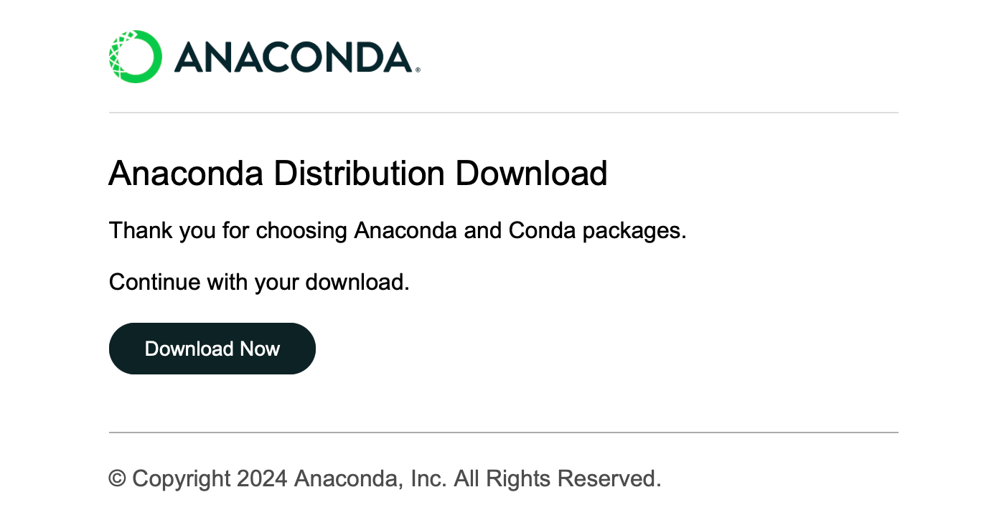
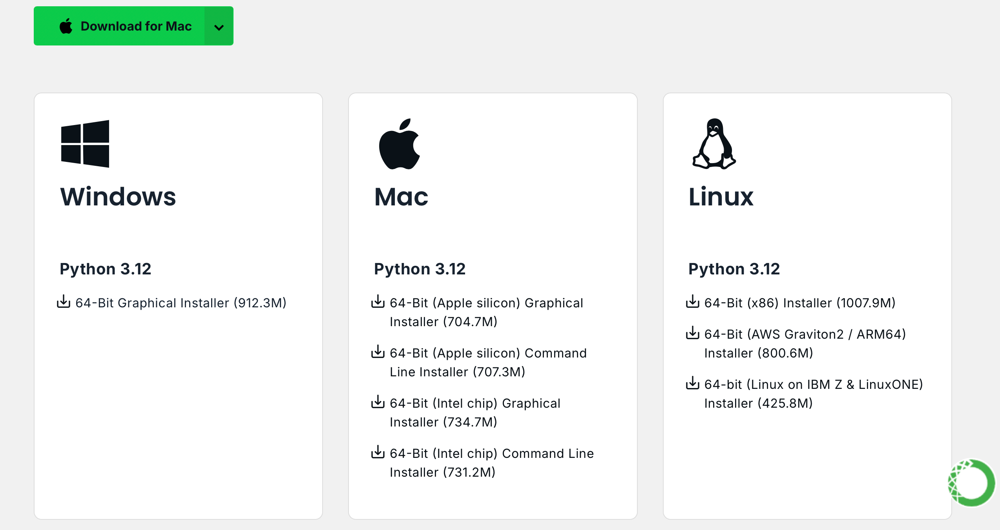
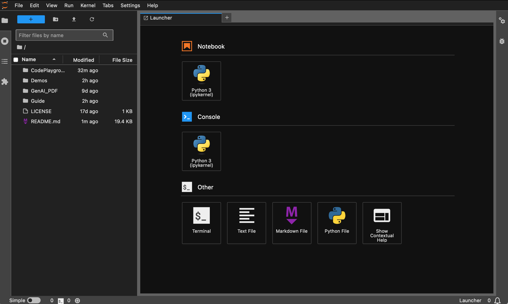
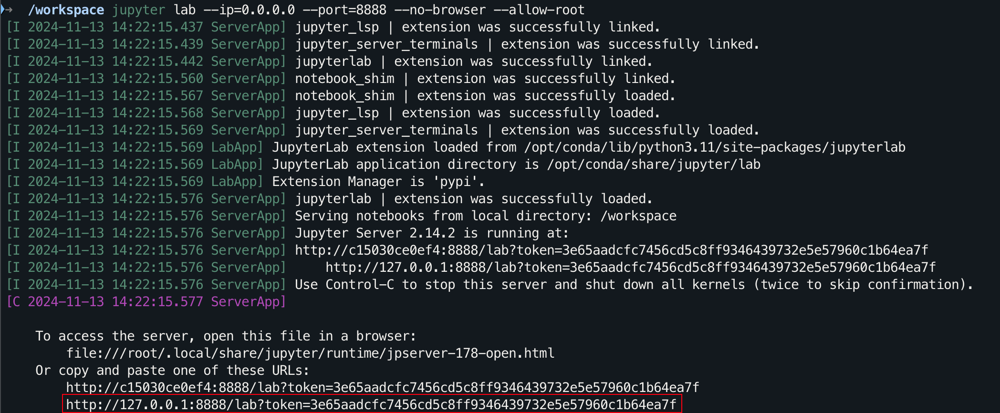

# 这是一个中文的 AI/LLM 大模型入门项目

> 回顾过去的学习历程，吴恩达和李宏毅老师的视频为我的深度学习之路提供了极大的帮助。他们幽默风趣的讲解方式和简单直观的阐述，让枯燥的理论学习变得生动有趣。
>
> 然而，在实践的时候，许多学弟学妹们最初会烦恼于怎么去获取国外大模型的 API ，尽管最终都能找到解决方法，但第一次的畏难情绪总是会拖延学习进度，逐渐转变为“看视频就够了”的状态。我时常在评论区看到类似的讨论，于是决定利用闲暇时间帮学子们跨过这道门槛，这也是项目的初衷。
>
> 本项目不会提供🪜科学上网的教程，也不会依赖平台自定义的接口，而是使用更兼容的 OpenAI SDK，帮助大家学习更通用的知识。
>
> 项目将从简单的 API 调用入手，带你逐步深入大模型的世界。在此过程中，你将掌握 **AI 视频摘要**、**LLM 微调**和 **AI 图像生成**等技能。
>
> 强烈建议观看李宏毅老师的课程「生成式人工智能导论」同步学习：[课程相关链接快速访问](#快速访问)
>
> 现在，项目还开设了[🎡CodePlayground](./CodePlayground)，你可以按照文档配置好环境，使用一行代码运行脚本，体验 AI 的魅力。
>
> 📑论文随笔位于 [PaperNotes](./PaperNotes)，将逐步上传大模型相关的基础论文。
>
> 🚀 [基础镜像](#-docker-快速部署-)已经准备好，如果你还没有配置好属于自己的深度学习环境，不妨尝试一下 Docker。
>
> 祝你旅途愉快！ 
>

## 目录

- **Tag 说明**:
  - `---`: 基础知识，根据需要进行观看，也可以暂时跳过。其中的代码文件结果都会在文章中示出，但仍建议动手运行代码。可能会有显存要求。
  - `API`: 文章仅使用大模型的 API，不受设备限制，无 GPU 也可运行。
    - Kaggle 目前不允许使用 Gradio，故部分交互文件不提供相关链接（这一类文件可以本地运行）。
  - `LLM`: 大型语言模型相关的实践，代码文件可能有显存要求。
  - `SD`: Stable Diffusion，文生图相关的实践，代码文件有显存要求。
- **Online 在线链接说明**：
  - 与 Code 内容一致，如果提供了 Kaggle 和 Colab，则三选一运行。
    - 前置文章《[Kaggle：免费 GPU 使用指南，Colab 的理想替代方案](./Guide/Kaggle：免费%20GPU%20使用指南，Colab%20的理想替代方案.md)》
  - 如果仅提供了 Colab，说明不受显卡限制可以本地运行，此时不能科学上网的同学可以下载 `File` 的代码，学习效果一致。
  - 运行时请不要忘记打开对应在线平台的 GPU。
    - Kaggle：`Setting` -> `Accelerator` -> `选择 GPU`。
    - Colab：`代码执行程序` -> `更改运行时类型` -> `选择 GPU`。

### DeepSeek 使用手册【DOING】

> 当前模块置顶，以方便大家索引更新。部分内容将直接由之前的文章（[导论部分](#导论)）重组得来，故存在重复，此模块将暂时专注于 DeepSeek API 的使用，是 OpenAI SDK 相关的通用知识，也可以作为导论 API 部分的拓展。
>
> [DeepSeek API【共享】](https://github.com/Hoper-J/AI-Guide-and-Demos-zh_CN/discussions/6) 

| Guide                                                        | Tag  | Describe                                                     | File                                       | Online                                                       |
| ------------------------------------------------------------ | ---- | ------------------------------------------------------------ | ------------------------------------------ | ------------------------------------------------------------ |
| [DeepSeek API 的获取与对话示例](./Guide/DeepSeek%20API%20的获取与对话示例.md) | API  | 获取 DeepSeek API 的 N 种方法及其单轮对话样例：<br />- DeepSeek 官方<br />- 硅基流动<br />- 阿里云百炼<br />- 百度智能云<br />- 字节火山引擎 | [Code](./Demos/deepseek-api-guide-1.ipynb) | [Kaggle](https://www.kaggle.com/code/aidemos/deepseek-api-guide-1)<br />[Colab](https://colab.research.google.com/drive/1rdBEJT_oOxaScm3_10epoHX_TdbSm1Ty?usp=sharing) |
| [DeepSeek 联网满血版使用指南](./Guide/DeepSeek%20联网满血版使用指南.md) | API  | 通过 API 绕开 DeepSeek 网页对话的卡顿，提供两种配置方案：<br />- Cherry Studio【推荐】<br />- Chatbox |                                            |                                                              |
| [DeepSeek API 输出解析 - OpenAI SDK](./Guide/DeepSeek%20API%20输出解析%20-%20OpenAI%20SDK.md) | API  | 关于 OpenAI SDK 的通用知识，以 DeepSeek 聊天/推理模型为例进行演示：<br />- 认识 API 的返回字段<br />- 打印模型回复和每次对话的用量信息<br /> | [Code](./Demos/deepseek-api-guide-2.ipynb) | [Kaggle](https://www.kaggle.com/code/aidemos/deepseek-api-guide-2)<br />[Colab](https://colab.research.google.com/drive/1WT0jpeIzWewoN5cT12Uwi92d5_tNff2J?usp=sharing) |
| └─[流式输出解析](./Guide/DeepSeek%20API%20流式输出解析%20-%20OpenAI%20SDK.md) | API  | API 解析 - 流式输出篇<br />- 认识 chunk 的结构<br />- 处理各平台聊天/推理模型的流式输出<br /> | [Code](./Demos/deepseek-api-guide-3.ipynb) | [Kaggle](https://www.kaggle.com/code/aidemos/deepseek-api-guide-3)<br />[Colab](https://colab.research.google.com/drive/1Hfm7qU75GSvU8cO6RL108ZcmwaugXemo?usp=sharing) |
| [DeepSeek API 多轮对话 - OpenAI SDK](./Guide/DeepSeek%20API%20多轮对话%20-%20OpenAI%20SDK.md) | API  | DeepSeek API 的多轮对话示例 - 非流式输出篇：<br />- 认识单轮对话和多轮对话时 `messages` 的差异<br />- 尝试封装对话类 | [Code](./Demos/deepseek-api-guide-4.ipynb) | [Kaggle](https://www.kaggle.com/code/aidemos/deepseek-api-guide-4)<br />[Colab](https://colab.research.google.com/drive/11REpPevN4bSL8yeJzQs7LAiV2cm9lUmh?usp=sharing) |
| └─[统一模型对话逻辑与流式输出](./Guide/DeepSeek%20API%20统一模型对话逻辑与流式输出.md) | API  | - 统一聊天模型和推理模型对话类<br />- 引入流式输出处理<br /><br />【代码文件】<br />- 使用 `APIConfigManager` 进行各平台配置，不再分散逻辑 | [Code](./Demos/deepseek-api-guide-5.ipynb) | [Kaggle](https://www.kaggle.com/code/aidemos/deepseek-api-guide-5)<br />[Colab](https://colab.research.google.com/drive/14u47q-lGfH7l1ehkBuTU0kgIsNarap9J?usp=sharing) |

---

### 导论


| Guide                                                        | Tag       | Describe                                                     | File                                                         | Online |
| ------------------------------------------------------------ | --------- | ------------------------------------------------------------ | ------------------------------------------------------------ | ---- |
| [00. 大模型 API 获取步骤](./Guide/00.%20大模型%20API%20获取步骤.md) | API       | 带你一步步的获取 API：<br />- 阿里（通义千问）。<br />- 智谱。<br />- DeepSeek。 |                                                              |      |
| [01. 初识 LLM API：环境配置与多轮对话演示](./Guide/01.%20初识%20LLM%20API：环境配置与多轮对话演示.md) | API       | 这是一段入门的配置和演示，对话代码修改自开发文档。       | [Code](./Demos/01.%20LLM%20API%20使用演示——从环境配置到多轮对话.ipynb) | [Kaggle](https://www.kaggle.com/code/aidemos/01-llm-api) <br />[Colab](https://colab.research.google.com/drive/1i3Oemsu-mdHgB-uhhJBAgzjnr0woVeiW?usp=sharing) |
| [02. 简单入门：通过 API 与 Gradio 构建 AI 应用](./Guide/02.%20简单入门：通过%20API%20与%20Gradio%20构建%20AI%20应用.md) | API       | 指导如何去使用 Gradio 搭建一个简单的 AI 应用。               | [Code](./Demos/02.%20使用%20API%20快速搭建你的第一个%20AI%20应用.ipynb) | [Colab](https://colab.research.google.com/drive/1nz89ATcl5l900bso6-xErEo1laT-rmPE?usp=share_link) |
| [03. 进阶指南：自定义 Prompt 提升大模型解题能力](./Guide/03.%20进阶指南：自定义%20Prompt%20提升大模型解题能力.md) | API       | 你将学习自定义一个 Prompt 来提升大模型解数学题的能力，其中一样会提供 Gradio 和非 Gradio 两个版本，并展示代码细节。 | [Code](./Demos/03.%20自定义%20Prompt%20提升大模型解题能力——Gradio%20与%20ipywidgets%20版.ipynb) | [Kaggle](https://www.kaggle.com/code/aidemos/03-prompt-ipywidgets)<br />[Colab](https://colab.research.google.com/drive/1c5WH62n8P1fKWaVrqXRV5pfRWKqV_3Zs?usp=sharing) |
| [04. 认识 LoRA：从线性层到注意力机制](./Guide/04.%20认识%20LoRA：从线性层到注意力机制.md) | ---       | 在正式进入实践之前，你需要知道 LoRA 的基础概念，这篇文章会带你从线性层的 LoRA 实现到注意力机制。 |                                                              |      |
| [05. 理解 Hugging Face 的 `AutoModel` 系列：不同任务的自动模型加载类](./Guide/05.%20理解%20Hugging%20Face%20的%20%60AutoModel%60%20系列：不同任务的自动模型加载类.md) | ---       | 我们即将用到的模块是 Hugging Face 中的 AutoModel，这篇文章一样是一个前置知识，你将了解到如何查看模型的参数和配置信息，以及如何使用 `inspect` 库进一步查看对应的源码。 | [Code](./Demos/04.%20Hugging%20Face%20AutoModel%20示例合集.ipynb) | [Kaggle](https://www.kaggle.com/code/aidemos/04-hugging-face-automodel)<br />[Colab](https://colab.research.google.com/drive/1gLTXcvG-tEDOqnR7qM-3-S812qnBUGlh?usp=sharing) |
| [06. 开始实践：部署你的第一个语言模型](./Guide/06.%20开始实践：部署你的第一个语言模型.md) | LLM       | 实现非常入门的语言模型部署，项目到现在为止都不会有 GPU 的硬性要求，你可以继续学习。 | [Code](./Demos/05.%20尝试部署你的第一个语言模型.ipynb)<br />[app_fastapi.py](./Demos/app_fastapi.py)<br /> [app_flask.py](./Demos/app_flask.py) |      |
| [07. 探究模型参数与显存的关系以及不同精度造成的影响](./Guide/07.%20探究模型参数与显存的关系以及不同精度造成的影响.md) | ---       | 了解模型参数和显存的对应关系并掌握不同精度的导入方式会使得你对模型的选择更加称手。 |                                                              |      |
| [08. 尝试微调 LLM：让它会写唐诗](./Guide/08.%20尝试微调%20LLM：让它会写唐诗.md) | LLM       | 这篇文章与 [03. 进阶指南：自定义 Prompt 提升大模型解题能力](./Guide/03.%20进阶指南：自定义%20Prompt%20提升大模型解题能力.md)一样，本质上是专注于“用”而非“写”，你可以像之前一样，对整体的流程有了一个了解，尝试调整超参数部分来查看对微调的影响。 | [Code](./Demos/06.%20尝试微调%20LLM：让它会写唐诗.ipynb) | [Kaggle](https://www.kaggle.com/code/aidemos/06-llm)<br />[Colab](https://colab.research.google.com/drive/1u2xgN5gWnZCwPlH2R-0gz_CpI9gzLdiy?usp=sharing) |
| [09. 深入理解 Beam Search：原理, 示例与代码实现](./Guide/09.%20深入理解%20Beam%20Search：原理%2C%20示例与代码实现.md) | ---       | 从示例到代码演示，讲解 Beam Search 的数学原理，这应该能解决一些之前阅读的困惑，最终提供一个简单的使用 Hugging Face Transformers 库的示例（如果跳过了之前的文章的话可以尝试它）。 | [Code](./Demos/07.%20Beam%20Search%20示例代码.ipynb) | [Kaggle](https://www.kaggle.com/code/aidemos/07-beam-search)<br />[Colab](https://colab.research.google.com/drive/1apYBAQ6HNlo4xJDBT0RtUCgmNo_mQVXF?usp=sharing) |
| [10. Top-K vs Top-P：生成式模型中的采样策略与 Temperature 的影响 ](./Guide/10.%20Top-K%20vs%20Top-P：生成式模型中的采样策略与%20Temperature%20的影响.md) | ---       | 进一步向你展示其他的生成策略。                               | [Code](./Demos/08.%20Top-K%20vs%20Top-P%20采样与%20Temperature%20示例代码.ipynb) | [Kaggle](https://www.kaggle.com/code/aidemos/08-top-k-vs-top-p-temperature)<br />[Colab](https://colab.research.google.com/drive/1XrmSwQmDPg7v44ZMi4P0glNKiqjzZWbo?usp=sharing) |
| [11. DPO 微调示例：根据人类偏好优化 LLM 大语言模型](./Guide/11.%20DPO%20微调示例：根据人类偏好优化%20LLM%20大语言模型.md) | LLM       | 一个使用 DPO 微调的示例。                                    | [Code](./Demos/09.%20DPO%20微调：根据偏好引导%20LLM%20的输出.ipynb) | [Kaggle](https://www.kaggle.com/code/aidemos/09-dpo-llm)<br />[Colab](https://colab.research.google.com/drive/1TxL9MrIXDY3HjWgQ4B3IcEeMj-lsbNAZ?usp=sharing) |
| [12. Inseq 特征归因：可视化解释 LLM 的输出](./Guide/12.%20Inseq%20特征归因：可视化解释%20LLM%20的输出.md) | LLM       | 翻译和文本生成（填空）任务的可视化示例。                     | [Code](./Demos/10.%20Inseq：可视化解释%20LLM%20的输出.ipynb) | [Kaggle](https://www.kaggle.com/code/aidemos/10-inseq-llm)<br />[Colab](https://colab.research.google.com/drive/1bWqGtRaG3aO7Vo149wIPHaz_XKnbJqlE?usp=sharing) |
| [13. 了解人工智能可能存在的偏见](./Guide/13.%20了解人工智能可能存在的偏见.md) | LLM       | 不需要理解代码，可以当作休闲时的一次有趣探索。               | [Code](./Demos/11.%20了解人工智能可能存在的偏见.ipynb) | [Kaggle](https://www.kaggle.com/code/aidemos/11-bias)<br />[Colab](https://colab.research.google.com/drive/10nHzBO9uiQWdGLnp551n_MYjnK3n-R0D?usp=sharing) |
| [14. PEFT：在大模型中快速应用 LoRA](./Guide/14.%20PEFT：在大模型中快速应用%20LoRA.md) | ---       | 学习如何在导入模型后增加 LoRA 层。                         | [Code](./Demos/12.%20应用%20LoRA%20到大模型的简单示例（PEFT）.ipynb) | [Kaggle](https://www.kaggle.com/code/aidemos/12-lora-peft)<br />[Colab](https://colab.research.google.com/drive/1-gWfn9xslSq6WlYDS9cinnyDEhBhjte4?usp=sharing) |
| [15. 用 API 实现 AI 视频摘要：动手制作属于你的 AI 视频助手](./Guide/15.%20用%20API%20实现%20AI%20视频摘要：动手制作属于你的%20AI%20视频助手.md) | API & LLM | 你将了解到常见的 AI 视频总结小助手背后的原理，并动手实现 AI 视频摘要。 | [Code - 完整版](./Demos/13a.%20轻松开始你的第一次%20AI%20视频总结（API%20版）%20-%20完整版.ipynb)<br />[Code - 精简版](./Demos/13b.%20轻松开始你的第一次%20AI%20视频总结（API%20版）-%20精简版.ipynb)<br />[🎡脚本]( ./CodePlayground/summarizer.py) | [Kaggle](https://www.kaggle.com/code/aidemos/13b-ai-api)<br />[Colab](https://colab.research.google.com/drive/1yh2J4_Cy45fqvydH34LLtDpw10kuWutO?usp=sharing) |
| [16. 用 LoRA 微调 Stable Diffusion：拆开炼丹炉，动手实现你的第一次 AI 绘画](./Guide/16.%20用%20LoRA%20微调%20Stable%20Diffusion：拆开炼丹炉，动手实现你的第一次%20AI%20绘画.md) | SD        | 使用 LoRA 进行文生图模型的微调，现在你也能够为别人提供属于你的 LoRA 文件。 | [Code](./Demos/14a.%20尝试使用%20LoRA%20微调%20Stable%20Diffusion%20模型.ipynb)<br />[Code - 精简版](./Demos/14b.%20尝试使用%20LoRA%20微调%20Stable%20Diffusion%20模型%20-%20精简版.ipynb)<br />[🎡 脚本](./CodePlayground/sd_lora.py) | [Kaggle](https://www.kaggle.com/code/aidemos/14b-lora-stable-diffusion)<br />[Colab](https://colab.research.google.com/drive/1idmnaQZwRhjUPw7ToEXlVo82Mihfl_aA?usp=sharing) |
| [17. 浅谈 RTN 模型量化：非对称 vs 对称.md](./Guide/17.%20浅谈%20RTN%20模型量化：非对称%20vs%20对称.md) | ---       | 更进一步地了解 RTN 模型量化的行为，文章以 INT8 为例进行讲解。 | [Code](./Demos/15.%20探究非对称量化和对称量化%20-%20INT8.ipynb) | [Kaggle](https://www.kaggle.com/code/aidemos/15-int8)<br />[Colab](https://colab.research.google.com/drive/1aFlUL8jQZEAO2ZsMXJxbUqlIXGb0m0hC?usp=sharing) |
| [18. 模型量化技术概述及 GGUF & GGML 文件格式解析](./Guide/18.%20模型量化技术概述及%20GGUF%20%26%20GGML%20文件格式解析.md) | ---       | 这是一个概述文章，或许可以解决一些你在使用 GGUF/GGML 时的疑惑。 |                                                              |      |
| [19a. 从加载到对话：使用 Transformers 本地运行量化 LLM 大模型（GPTQ & AWQ）](./Guide/19a.%20从加载到对话：使用%20Transformers%20本地运行量化%20LLM%20大模型（GPTQ%20%26%20AWQ）.md)<br />[19b. 从加载到对话：使用 Llama-cpp-python 本地运行量化 LLM 大模型（GGUF）](./Guide/19b.%20从加载到对话：使用%20Llama-cpp-python%20本地运行量化%20LLM%20大模型（GGUF）.md) | LLM       | 你将在自己的电脑上部署一个拥有 70 亿（7B）参数的量化模型，注意，这篇文章没有显卡要求。<br />[19 a](./Guide/19a.%20从加载到对话：使用%20Transformers%20本地运行量化%20LLM%20大模型（GPTQ%20%26%20AWQ）.md) 使用 Transformers，涉及 GPTQ 和 AWQ 格式的模型加载。<br />[19 b](./Guide/19b.%20从加载到对话：使用%20Llama-cpp-python%20本地运行量化%20LLM%20大模型（GGUF）.md) 使用 Llama-cpp-python，涉及 GGUF 格式的模型加载。<br />另外，你还将完成本地的大模型对话交互功能。 | [Code - a](./Demos/16a.%20使用%20Transformers%20加载量化后的%20LLM%20大模型（GPTQ%20%26%20AWQ）.ipynb)<br />[Code - b](./Demos/16b.%20使用%20Llama-cpp-python%20加载量化后的%20LLM%20大模型（GGUF）.ipynb)<br />[🎡脚本]( ./CodePlayground/chat.py) | [Kaggle - a](https://www.kaggle.com/code/aidemos/16a-transformers-llm-gptq)<br />[Colab - a](https://colab.research.google.com/drive/1cmIDjHriW8aQ5mIsV6ZeTqdnqYe6PoOv?usp=sharing)<br />[Kaggle - b](https://www.kaggle.com/code/aidemos/16b-llama-cpp-python-llm-gguf)<br />[Colab - b](https://colab.research.google.com/drive/1AhgC0qDaqWBXAI9eSbwTStGgvgFfLOpf?usp=sharing) |
| [20. RAG 入门实践：从文档拆分到向量数据库与问答构建](./Guide/20.%20RAG%20入门实践：从文档拆分到向量数据库与问答构建.md) | LLM       | RAG 的相关实践。<br />了解文本分块的递归工作原理。           | [Code](./Demos/17.%20使用%20LangChain%20实现%20RAG.ipynb) | [Kaggle](https://www.kaggle.com/code/aidemos/17-langchain-rag)<br />[Colab](https://colab.research.google.com/drive/1260befv1nLiEzV7SvzPPb0n-u3IXlp6E?usp=sharing) |
| [21. BPE vs WordPiece：理解 Tokenizer 的工作原理与子词分割方法](./Guide/21.%20BPE%20vs%20WordPiece：理解%20Tokenizer%20的工作原理与子词分割方法.md) | ---       | Tokenizer 的基本操作。<br />了解常见的子词分割方法：BPE 和 WordPiece。<br />了解注意力掩码（Attention Mask）和词元类型 ID （Token Type IDs）。 | [Code](./Demos/19.%20BPE%20vs%20WordPiece：理解%20Tokenizer%20的工作原理与子词分割方法.ipynb) | [Kaggle](https://www.kaggle.com/code/aidemos/19-bpe-vs-wordpiece-tokenizer)<br />[Colab](https://colab.research.google.com/drive/1J6QN0QbuoWBDIIrBe-TJ6Hi5rnzTSovM?usp=sharing) |
| [22a. 微调 LLM：实现抽取式问答](./Guide/22a.%20微调%20LLM：实现抽取式问答.md)<br />[22b. 作业 - Bert 微调抽取式问答](./Guide/22b.%20作业%20-%20Bert%20微调抽取式问答.md) | LLM | 微调预训练模型以实现下游任务：抽取式问答。<br />可以先尝试作业 [22b](./Guide/22b.%20作业%20-%20Bert%20微调抽取式问答.md) 再阅读 [22a](./Guide/22a.%20微调%20LLM：实现抽取式问答.md)，但并不强制要求。 | [BERT 论文精读](./PaperNotes/BERT%20论文精读.md)<br />[Code - 完整](./Demos/21a.%20微调%20LLM：实现抽取式问答.ipynb)<br />[Code - 作业](./Demos/21b.%20Bert%20微调抽取式问答任务%20-%20作业样例代码.ipynb) | [Kaggle - 完整](https://www.kaggle.com/code/aidemos/21a-llm)<br />[Colab - 完整](https://colab.research.google.com/drive/1jgdoO7fKk7Tsn2yi28ytsDQ8VXdthnIm?usp=sharing)<br />[Kaggle - 作业](https://www.kaggle.com/code/aidemos/21-bert)<br />[Colab - 作业](https://colab.research.google.com/drive/1zHR2Cztmo49j3yrdT3GgkzNcAcHd7M0M?usp=sharing) |

> [!TIP]
>
> 如果你更喜欢拉取仓库到本地进行阅读 `.md`，那么在出现公式报错的时候，请使用 `Ctrl+F` 或者 `Command+F`，搜索`\\_`并全部替换为`\_`。

### 拓展阅读

| Guide                                                        | Describe                                                     |
| ------------------------------------------------------------ | ------------------------------------------------------------ |
| [a. 使用 HFD 加快 Hugging Face 模型和数据集的下载](./Guide/a.%20使用%20HFD%20加快%20Hugging%20Face%20模型和数据集的下载.md) | 如果你觉得模型下载实在是太慢了，可以参考这篇文章进行配置。<br />遇到代理相关的 443 错误，也可以试着查看这篇文章。 |
| [b. 命令行基础指令速查（Linux & Mac适用）](./Guide/b.%20命令行基础指令速查（Linux%20%26%20Mac适用）.md) | 一份命令行的指令速查，基本包含当前仓库的涉及的所有指令，在感到疑惑时去查看它。 |
| [c. 一些问题的解决方法](./Guide/c.%20一些问题的解决方法.md)  | 这里会解决一些项目运行过程中可能遇到的问题。<br />- 如何拉取远程仓库覆盖本地的一切修改？<br />- 怎么查看和删除 Hugging Face 下载的文件，怎么修改保存路径？<br />- 在线平台 Kaggle/Colab 怎么开启 GPU？ |
| [d. 如何加载 GGUF 模型（分片 & Shared & Split & 00001-of-0000...的解决方法）](./Guide/d.%20如何加载%20GGUF%20模型（分片%20%26%20Shared%20%26%20Split%20%26%2000001-of-0000...的解决方法）.md) | - 了解 Transformers 关于 GGUF 的新特性。<br />- 使用 Transformers/Llama-cpp-python/Ollama 加载 GGUF 格式的模型文件。<br />- 学会合并分片的 GGUF 文件。<br />- 解决 LLama-cpp-python 无法 offload 的问题。 |
| [e. 数据增强：torchvision.transforms 常用方法解析](./Guide/e.%20数据增强：torchvision.transforms%20常用方法解析.md) | - 了解常用的图像数据增强方法。<br />[Code](./Demos/18.%20数据增强：torchvision.transforms%20常用方法演示.ipynb) \| [Kaggle](https://www.kaggle.com/code/aidemos/18-torchvision-transforms) \| [Colab](https://colab.research.google.com/drive/1cOy8LFMUVfDaBe7iV-YWxcZ1W2bFgg4w?usp=sharing) |
| [f. 交叉熵损失函数 nn.CrossEntropyLoss() 详解和要点提醒（PyTorch）](./Guide/f.%20交叉熵损失函数%20nn.CrossEntropyLoss()%20详解和要点提醒（PyTorch）.md) | - 了解交叉熵损失的数学原理及 PyTorch 实现。<br />- 了解初次使用时需要注意的地方。 |
| [g. 嵌入层 nn.Embedding() 详解和要点提醒（PyTorch）](./Guide/g.%20嵌入层%20nn.Embedding()%20详解和要点提醒（PyTorch）.md) | - 了解嵌入层和词嵌入的概念。<br />- 使用预训练模型可视化 Embedding。<br />[Code](./Demos/20.%20嵌入层%20nn.Embedding()%20代码示例.ipynb) \| [Kaggle](https://www.kaggle.com/code/aidemos/20-nn-embedding) \| [Colab](https://colab.research.google.com/drive/1BLgmxasxOD1HQGrI0L1sPlYG40iba9SY?usp=sharing) |
| [h. 使用 Docker 快速配置深度学习环境（Linux）](./Guide/使用%20Docker%20快速配置深度学习环境（Linux）.md)<br />[h. Docker 基础命令介绍和常见报错解决](./Guide/Docker%20基础命令介绍和常见报错解决.md) | - 使用两行命令配置好深度学习环境<br />- Docker 基础命令介绍<br />- 解决使用时的三个常见报错 |
| [i. Epoch、Batch 和 Step 之间的关系以及梯度累积](./Guide/Epoch、Batch%20和%20Step%20之间的关系以及梯度累积.md) | 基础文章，可以在任意时候进行阅读<br />- Epoch、Batch、Step 三者之间的关系<br />- SGD、BGD、MBGD 方法的区别<br />- 梯度累积的使用 |

---

**文件夹解释：**

- **Demos**

  所有的代码文件都将存放在其中。

  - **data**

    存放代码中可能用到的小型数据，不需要关注这个文件夹。

- **GenAI_PDF**

  这里是【生成式人工智能导论】课程的作业PDF文件，我上传了它们，因为其最初保存在 Google Drive 中。

- **Guide**

  所有的指导文件都将存放在其中。

  - **assets**

    这里是 .md 文件用到的图片，不需要关注这个文件夹。
  
- **PaperNotes**

  论文随笔。

  - [**README.md**](./PaperNotes)
    - 目录索引。
  - [对比学习论文随笔 1：正负样本](./PaperNotes/对比学习论文随笔%201：正负样本.md)
    - 涉及使用正负样本思想且优化目标一致的基础论文
  - [Transformer 论文精读](./PaperNotes/Transformer%20论文精读.md)
    - 从零开始复现 Transformer（PyTorch），并对各组件进行解读。
    - [Code](./PaperNotes/Demos/动手实现%20Transformer.ipynb) | [Kaggle](https://www.kaggle.com/code/aidemos/transformer) | [Colab](https://colab.research.google.com/drive/1BtYPNjEHw3dudw5KKFe9dBEsUsgkm1Vt?usp=sharing)
  - [BERT 论文精读](./PaperNotes/BERT%20论文精读.md)
    - 预训练任务 MLM 和 NSP
    - BERT 模型的输入和输出，以及一些与 Transformer 不同的地方
    - 以 $\text{BERT}_\text{BASE}$ 为例，计算模型的总参数量
    - [作业 - BERT 微调抽取式问答](./Guide/22b.%20作业%20-%20Bert%20微调抽取式问答.md)
  - [GPT 论文精读](./PaperNotes/GPT%20论文精读.md)
    - GPT 数字系列论文：[GPT-1](./PaperNotes/GPT%20论文精读.md#gpt-1) / [GPT-2](./PaperNotes/GPT%20论文精读.md#gpt-2) / [GPT-3](./PaperNotes/GPT%20论文精读.md#gpt-3) / [GPT-4](./PaperNotes/GPT%20论文精读.md#gpt-4)

- [**CodePlayground**](./CodePlayground)

  - 一些有趣的代码脚本示例（Toy 版）。

    - **README.md**

      - 你需要先阅读这份说明。
    
    - **summarizer.py** [🎡脚本](./CodePlayground/summarizer.py)
    
      AI 视频/音频/字幕摘要。
      
    - **sd_lora.py** [🎡 脚本](./CodePlayground/sd_lora.py)
    
      AI 绘画。
      
    - **chat.py** [🎡脚本]( ./CodePlayground/chat.py)
    
      AI 对话。

## 快速访问

> **生成式人工智能导论学习资源**
>
> - [课程主页](https://speech.ee.ntu.edu.tw/~hylee/genai/2024-spring.php)
>
> - 官方 | 授权视频: [YouTube](https://www.youtube.com/playlist?list=PLJV_el3uVTsPz6CTopeRp2L2t4aL_KgiI) | [Bilibili](https://www.bilibili.com/video/BV1BJ4m1e7g8/?p=1)

中文镜像版的制作与分享已经获得李宏毅老师的授权，感谢老师对于知识的无私分享！

- HW1，2不涉及代码相关知识，你可以通过访问对应的作业PDF来了解其中的内容：[HW1](./GenAI_PDF/HW1.pdf) | [HW2](./GenAI_PDF/HW2.pdf)。
- HW3: [引导文章](./Guide/02.%20简单入门：通过%20API%20与%20Gradio%20构建%20AI%20应用.md) | [代码中文镜像](./Demos/02.%20使用%20API%20快速搭建你的第一个%20AI%20应用.ipynb) | [中文 Colab](https://colab.research.google.com/drive/1nz89ATcl5l900bso6-xErEo1laT-rmPE?usp=share_link) | [英文 Colab](https://colab.research.google.com/drive/15jh4v_TBPsTyIBhi0Fz46gEkjvhzGaBR?usp=sharing) | [作业PDF](./GenAI_PDF/HW3.pdf)
- HW4: [引导文章](./Guide/03.%20进阶指南：自定义%20Prompt%20提升大模型解题能力.md) | [代码中文镜像](./Demos/03.%20自定义%20Prompt%20提升大模型解题能力——Gradio%20与%20ipywidgets%20版.ipynb) | [中文 Colab](https://colab.research.google.com/drive/1c5WH62n8P1fKWaVrqXRV5pfRWKqV_3Zs?usp=sharing) | [英文 Colab](https://colab.research.google.com/drive/16JzVN_Mu4mJfyHQpQEuDx1q6jI-cAnEl?hl=zh-tw#scrollTo=RI0hC7SFT3Sr&uniqifier=1) | [Kaggle](https://www.kaggle.com/code/aidemos/03-prompt-ipywidgets) | [作业PDF](./GenAI_PDF/HW4.pdf)
- HW5: [引导文章](./Guide/08.%20尝试微调%20LLM：让它会写唐诗.md) | [代码中文镜像](./Demos/06.%20尝试微调%20LLM：让它会写唐诗.ipynb) | [中文 Colab](https://colab.research.google.com/drive/1u2xgN5gWnZCwPlH2R-0gz_CpI9gzLdiy?usp=sharing) | [英文 Colab](https://colab.research.google.com/drive/1nB3jwRJVKXSDDNO-pbURrao0N2MpqHl8?usp=sharing#scrollTo=uh5rwbr4q5Nw) | [Kaggle](https://www.kaggle.com/code/aidemos/06-llm) | [作业PDF](./GenAI_PDF/HW5.pdf)
- HW6: [引导文章](./Guide/11.%20DPO%20微调示例：根据人类偏好优化%20LLM%20大语言模型.md) | [代码中文镜像](./Demos/09.%20DPO%20微调：根据偏好引导%20LLM%20的输出.ipynb) | [中文 Colab](https://colab.research.google.com/drive/1TxL9MrIXDY3HjWgQ4B3IcEeMj-lsbNAZ?usp=sharing) | [英文 Colab](https://colab.research.google.com/drive/1d3zmkqo-ZmxrIOYWSe3vDD0za8tUPguu?usp=sharing#scrollTo=owGIuqdnRI8I) | [Kaggle](https://www.kaggle.com/code/aidemos/09-dpo-llm) | [作业PDF](./GenAI_PDF/HW6.pdf)
- HW7: [引导文章](./Guide/12.%20Inseq%20特征归因：可视化解释%20LLM%20的输出.md) | [代码中文镜像](./Demos/10.%20Inseq：可视化解释%20LLM%20的输出.ipynb) | [中文 Colab](https://colab.research.google.com/drive/1bWqGtRaG3aO7Vo149wIPHaz_XKnbJqlE?usp=sharing) | [英文 Colab](https://colab.research.google.com/drive/1Xnz0GHC0yWO2Do0aAYBCq9zL45lbiRjM?usp=sharing#scrollTo=UFOUfh2k1jFNI) | [Kaggle](https://www.kaggle.com/code/aidemos/10-inseq-llm) | [作业PDF](./GenAI_PDF/HW7.pdf)
- HW8: [引导文章](./Guide/13.%20了解人工智能可能存在的偏见.md) | [代码中文镜像](./Demos/11.%20了解人工智能可能存在的偏见.ipynb) | [中文 Colab](https://colab.research.google.com/drive/10nHzBO9uiQWdGLnp551n_MYjnK3n-R0D?usp=sharing) | [英文 Colab](https://colab.research.google.com/drive/1DkK2Mb0cuEtdEN5QnhmjGE3Xe7xeMuKN?usp=sharing#scrollTo=LP3tSLGGZ-TG) | [Kaggle](https://www.kaggle.com/code/aidemos/11-bias) | [作业PDF](./GenAI_PDF/HW8.pdf)
- HW9: [引导文章](./Guide/15.%20用%20API%20实现%20AI%20视频摘要：动手制作属于你的%20AI%20视频助手.md) | [代码中文镜像](./Demos/13a.%20轻松开始你的第一次%20AI%20视频总结（API%20版）%20-%20完整版.ipynb) | [中文 Colab](https://colab.research.google.com/drive/1yh2J4_Cy45fqvydH34LLtDpw10kuWutO?usp=sharing) | [英文 Colab](https://colab.research.google.com/drive/1Ysr25kz6lP7gR8DNTkJMAqOuMp2bhXes?usp=sharing#scrollTo=YCara20SW8AN) | [Kaggle](https://www.kaggle.com/code/aidemos/13b-ai-api) | [作业PDF](./GenAI_PDF/HW9.pdf)
- HW10: [引导文章](./Guide/16.%20用%20LoRA%20微调%20Stable%20Diffusion：拆开炼丹炉，动手实现你的第一次%20AI%20绘画.md) | [代码中文镜像](./Demos/14a.%20尝试使用%20LoRA%20微调%20Stable%20Diffusion%20模型.ipynb) | [中文 Colab](https://colab.research.google.com/drive/1idmnaQZwRhjUPw7ToEXlVo82Mihfl_aA?usp=sharing) | [英文 Colab](https://colab.research.google.com/drive/1dI_-HVggxyIwDVoreymviwg6ZOvEHiLS?usp=sharing#scrollTo=CnJtiRaRuTFX) | [Kaggle](https://www.kaggle.com/code/aidemos/14b-lora-stable-diffusion) | [作业PDF](./GenAI_PDF/HW10.pdf)

**P.S. 中文镜像将完全实现作业代码的所有功能（本地运行），Kaggle 是国内可直连的在线平台，中文 Colab 和 Kaggle 内容一致，英文 Colab 链接对应于原作业，选择其中一个完成学习即可。**

---

根据实际需求，从下方选择一种方式来准备学习环境，**点击 `►` 或文字展开**。
<details>
    <summary> <h2> 在线平台学习 </h2> </summary>
如果倾向于使用在线平台学习，或者受到显卡性能的限制，可以选择以下平台：

- **Kaggle**（国内直连，推荐）：阅读文章《[Kaggle：免费 GPU 使用指南，Colab 的理想替代方案](./Guide/Kaggle：免费%20GPU%20使用指南，Colab%20的理想替代方案.md)》进行了解。

- **Colab**（需要🪜科学上网）

项目中的代码文件在两个平台是同步的。

</details>

<details>
    <summary> <h2> 本地环境配置 </h2> </summary>

<details>
    <summary> <strong> 安装基础软件 </strong> </summary>

- **Git**：用于克隆代码仓库。
- **Wget 和 Curl**：用于下载脚本和文件。
- **Conda**：用于创建和管理虚拟环境。
- **pip**：用于安装 Python 依赖包。

### 安装 Git

- **Linux (Ubuntu)**：

  ```bash
  sudo apt-get update
  sudo apt-get install git
  ```

- **macOS**：

  - 先安装 Homebrew：

    ```bash
    /bin/bash -c "$(curl -fsSL https://raw.githubusercontent.com/Homebrew/install/HEAD/install.sh)"
    ```

  然后运行：

  ```bash
  brew install git
  ```

- **Windows**：

  从 [Git for Windows](https://gitforwindows.org/) 下载并安装。

### 安装 Wget 和 Curl

- **Linux (Ubuntu)**：

  ```bash
  sudo apt-get update
  sudo apt-get install wget curl
  ```

- **macOS**：

  ```bash
  brew install wget curl
  ```

- **Windows**：

  从 [Wget for Windows](https://eternallybored.org/misc/wget/) 和 [Curl 官方网站](https://curl.se/windows/) 下载并安装。

### 安装 Conda

#### 图形化界面

访问 [Anaconda 官方网站](https://www.anaconda.com/products/distribution#Downloads)，输入邮箱地址后检查邮箱，你应该能看到：



点击 `Download Now`，选择合适的版本并下载（Anaconda 和 Miniconda 都可以）：



#### 命令行安装

- **Linux (Ubuntu)**：

  - **安装 Anaconda**

    访问 [repo.anaconda.com](https://repo.anaconda.com/archive/) 进行版本选择。

    ```bash
    # 下载 Anaconda 安装脚本（以最新版本为例）
    wget https://repo.anaconda.com/archive/Anaconda3-2024.10-1-Linux-x86_64.sh
    
    # 运行安装脚本
    bash Anaconda3-2024.10-1-Linux-x86_64.sh
    
    # 按照提示完成安装（先回车，空格一直翻页，翻到最后输入 yes，回车）
    
    # 安装完成后，刷新环境变量或者重新打开终端
    source ~/.bashrc
    ```

  - **安装 Miniconda**（推荐）

    访问 [repo.anaconda.com/miniconda](https://repo.anaconda.com/miniconda/) 进行版本选择。Miniconda 是一个精简版的 Anaconda，只包含 Conda 和 Python。

    ```bash
    # 下载 Miniconda 安装脚本
    wget https://repo.anaconda.com/miniconda/Miniconda3-latest-Linux-x86_64.sh
    
    # 运行安装脚本
    bash Miniconda3-latest-Linux-x86_64.sh
    
    # 按照提示完成安装（先回车，空格一直翻页，翻到最后输入 yes，回车）
    
    # 安装完成后，刷新环境变量或者重新打开终端
    source ~/.bashrc
    ```

- **macOS**：

  对应替换 Linux 命令中的网址。

  - **安装 Anaconda**

    访问 [repo.anaconda.com](https://repo.anaconda.com/archive/) 进行版本选择。

  - **安装 Miniconda**（推荐）

    访问 [repo.anaconda.com/miniconda](https://repo.anaconda.com/miniconda/) 进行版本选择。

#### 验证安装

在终端中输入以下命令，如果显示版本信息，则说明安装成功。

```bash
conda --version
```

#### 配置国内镜像源（可选，建议）

```bash
cat <<'EOF' > ~/.condarc
channels:
  - defaults
show_channel_urls: true
default_channels:
  - https://mirror.nju.edu.cn/anaconda/pkgs/main
  - https://mirror.nju.edu.cn/anaconda/pkgs/r
  - https://mirror.nju.edu.cn/anaconda/pkgs/msys2
custom_channels:
  conda-forge: https://mirror.nju.edu.cn/anaconda/cloud
  pytorch: https://mirror.nju.edu.cn/anaconda/cloud
EOF
```

> [!note]
>
> 很多去年可用的镜像源已经不可用，目前其余镜像站配置可以参考南大这个非常 nice 的文档：[镜像使用帮助](https://mirror.nju.edu.cn/mirrorz-help/anaconda/?mirror=NJU)。

### 安装 pip

**注意**：如果已经安装了 Anaconda 或 Miniconda，系统中会包含 `pip`，无需额外安装。

- **Linux (Ubuntu)**：

  ```bash
  sudo apt-get update
  sudo apt-get install python3-pip
  ```

- **macOS**：

  ```bash
  brew install python3
  ```

- **Windows**：

  1. 下载并安装 [Python](https://www.python.org/downloads/windows/)，确保勾选“Add Python to PATH”选项。

  2. 打开命令提示符，输入：

     ```bash
     python -m ensurepip --upgrade
     ```

#### 验证安装

在终端中输入以下命令，如果显示版本信息，则说明安装成功。

```bash
pip --version
```

#### 配置国内镜像源（可选，建议）

```bash
pip config set global.index-url https://mirrors.aliyun.com/pypi/simple
```

</details>

### 克隆仓库项目

通过以下命令拉取项目:

```bash
git clone https://github.com/Hoper-J/AI-Guide-and-Demos-zh_CN.git
cd AI-Guide-and-Demos-zh_CN
```

### 虚拟环境（可选，推荐）

版本不限制，可以更高:

```bash
conda create -n aigc python=3.9
```

按`y`回车以继续，等创建完成后，激活虚拟环境:

```bash
conda activate aigc
```

### 依赖安装

接下来需要进行基础的依赖安装，参考 [PyTorch 官网](https://pytorch.org/get-started/locally/)，以 CUDA 11.8 为例（如果显卡不支持11.8，需要更换命令），二选一进行安装：

```bash
# pip
pip3 install torch torchvision torchaudio --index-url https://download.pytorch.org/whl/cu118

# conda
conda install pytorch torchvision torchaudio pytorch-cuda=11.8 -c pytorch -c nvidia
```

现在我们成功配置好了所有需要的环境，准备开始学习 :) 其余依赖在每个文章中会单独列出。

> [!note]
>
> Docker 镜像已经预装了依赖，不用重新安装。

### 安装并启动 Jupyter Lab

先安装 `jupyter-lab`，这比 `jupyter notebook` 好用很多。

```bash
pip install jupyterlab
```

安装完成后，执行下面的命令：

```bash
jupyter-lab
```


现在你将可以通过弹出的链接进行访问，一般位于 8888 端口。对于图形化界面，Windows/Linux 摁住 `Ctrl`，mac 按住 `Command`，然后点击链接可以直接跳转。至此，你将获得项目的全貌：



</details>

<details>
    <summary> <h2> Docker 快速部署 </h2> </summary>

> 没有安装 Docker 的同学可以阅读文章《[使用 Docker 快速配置深度学习环境（Linux）](./Guide/使用%20Docker%20快速配置深度学习环境（Linux）.md)》，建议初学者阅读《[Docker 基础命令介绍和常见报错解决](./Guide/Docker%20基础命令介绍和常见报错解决.md)》。

### 镜像介绍

[所有版本](https://hub.docker.com/repository/docker/hoperj/quickstart/tags)都预装了 `sudo`、`pip`、`conda`、`wget`、`curl` 和 `vim` 等常用工具，且已经配置好 `pip` 和 `conda` 的国内镜像源。同时，集成了 `zsh` 和一些实用的命令行插件（命令自动补全、语法高亮、以及目录跳转工具 `z`）。此外，已预装 `jupyter notebook` 和 `jupyter lab`，设置了其中的默认终端为 `zsh`，方便进行深度学习开发，并优化了容器内的中文显示，避免出现乱码问题。其中还预配置了 Hugging Face 的国内镜像地址。

#### 版本说明

- **base** 版本：占用约 16GB 存储空间，基于 `pytorch/pytorch:2.5.1-cuda11.8-cudnn9-devel`，默认 `python` 版本为 3.11.10，可以通过 `conda install python==版本号` 直接修改版本。
- **dl** 版本：占用约 20GB 存储空间，在 **base** 基础上，额外安装了深度学习框架和常用工具，具体查看安装清单。

### 安装清单

<details> <summary> <strong>base</strong> </summary>

**基础环境**：

- python 3.11.10
- torch 2.5.1 + cuda 11.8 + cudnn 9

**Apt 安装**：

- `wget`、`curl`：命令行下载工具
- `vim`、`nano`：文本编辑器
- `git`：版本控制工具
- `git-lfs`：Git LFS（大文件存储）
- `zip`、`unzip`：文件压缩和解压工具
- `htop`：系统监控工具
- `tmux`、`screen`：会话管理工具
- `build-essential`：编译工具（如 `gcc`、`g++`）
- `iputils-ping`、`iproute2`、`net-tools`：网络工具（提供 `ping`、`ip`、`ifconfig`、`netstat` 等命令）
- `ssh`：远程连接工具
- `rsync`：文件同步工具
- `tree`：显示文件和目录树
- `lsof`：查看当前系统打开的文件
- `aria2`：多线程下载工具
- `libssl-dev`：OpenSSL 开发库

**pip 安装**：

- `jupyter notebook`、`jupyter lab`：交互式开发环境
- `virtualenv`：Python 虚拟环境管理工具，可以直接用 conda
- `tensorboard`：深度学习训练可视化工具
- `ipywidgets`：Jupyter 小部件库，用以正确显示进度条

**插件**：

- `zsh-autosuggestions`：命令自动补全
- `zsh-syntax-highlighting`：语法高亮
- `z`：快速跳转目录

</details>

<details> <summary> <strong>dl</strong> </summary>


**dl**（Deep Learning）版本在 **base** 基础上，额外安装了深度学习可能用到的基础工具和库：

**Apt 安装**：

- `ffmpeg`：音视频处理工具
- `libgl1-mesa-glx`：图形库依赖（解决一些深度学习框架图形相关问题）

**pip 安装**：

- **数据科学库**：
  - `numpy`、`scipy`：数值计算和科学计算
  - `pandas`：数据分析
  - `matplotlib`、`seaborn`：数据可视化
  - `scikit-learn`：机器学习工具
- **深度学习框架**：
  - `tensorflow`、`tensorflow-addons`：另一种流行的深度学习框架
  - `tf-keras`：Keras 接口的 TensorFlow 实现
- **NLP 相关库**：
  - `transformers`、`datasets`：Hugging Face 提供的 NLP 工具
  - `nltk`、`spacy`：自然语言处理工具

如果需要额外的库，可以通过以下命令手动安装：

```bash
pip install --timeout 120 <替换成库名>
```

这里 `--timeout 120` 设置了 120 秒的超时时间，确保在网络不佳的情况下仍然有足够的时间进行安装。如果不进行设置，在国内的环境下可能会遇到安装包因下载超时而失败的情况。

</details>

注意，所有镜像都不会提前拉取仓库。

### 获取镜像（三选一）

假设你已经安装并配置好了 Docker，那么只需两行命令即可完成深度学习的环境配置，对于当前项目，你可以查看完[版本说明](#版本说明)后进行选择，二者对应的 `image_name:tag` 如下：

- **base**: `hoperj/quickstart:base-torch2.5.1-cuda11.8-cudnn9-devel`
- **dl**: `hoperj/quickstart:dl-torch2.5.1-cuda11.8-cudnn9-devel`

拉取命令为：

```bash
docker pull <image_name:tag>
```

下面以 **dl** 版为例进行命令演示，选择其中一种方式完成。

#### 国内镜像版

```bash
docker pull dockerpull.org/hoperj/quickstart:dl-torch2.5.1-cuda11.8-cudnn9-devel
```

#### 🪜科学上网版

```bash
docker pull hoperj/quickstart:dl-torch2.5.1-cuda11.8-cudnn9-devel
```

#### 本地（网盘下载）

> 可以通过[百度云盘](https://pan.baidu.com/s/1RJDfc5ouTDeBFhOdbIAHNg?pwd=bdka)下载文件（阿里云盘不支持分享大的压缩文件）。
>
> 同名文件内容相同，`.tar.gz` 为压缩版本，下载后通过以下命令解压：
>
> ```bash
> gzip -d dl.tar.gz
> ```

假设 `dl.tar` 被下载到了 `~/Downloads` 中，那么切换至对应目录：

```bash
cd ~/Downloads
```

然后加载镜像：

```bash
docker load -i dl.tar
```

### 创建并运行容器（使用主机网络）

> 此模式下，容器会直接使用主机的网络配置，所有端口都等同于主机的端口，无需单独映射。如果只需映射指定端口，将 `--network host` 替换为 `-p port:port`。

```bash
docker run --gpus all -it --name ai --network host hoperj/quickstart:dl-torch2.5.1-cuda11.8-cudnn9-devel /bin/zsh
```

#### 设置代理

对于需要使用代理的同学，增加 `-e` 来设置环境变量，也可以参考[拓展文章a](./Guide/a.%20使用%20HFD%20加快%20Hugging%20Face%20模型和数据集的下载.md#重新设置代理)：

假设代理的 HTTP/HTTPS 端口号为 7890， SOCKS5 为 7891：

- `-e http_proxy=http://127.0.0.1:7890`
- `-e https_proxy=http://127.0.0.1:7890`
- `-e all_proxy=socks5://127.0.0.1:7891`

融入到之前的命令中：

```bash
docker run --gpus all -it \
  --name ai \
  --network host \
  -e http_proxy=http://127.0.0.1:7890 \
  -e https_proxy=http://127.0.0.1:7890 \
  -e all_proxy=socks5://127.0.0.1:7891 \
  hoperj/quickstart:dl-torch2.5.1-cuda11.8-cudnn9-devel \
  /bin/zsh
```

> [!tip]
>
> **常用操作提前看**：
>
> - **启动容器**：`docker start <容器名>`
> - **运行容器**：`docker exec -it <容器名> /bin/zsh`
>   - **容器内退出**：`Ctrl + D` 或 `exit`。
> - **停止容器**：`docker stop <容器名>`
> - **删除容器**：`docker rm <容器名>`

### 克隆仓库

```bash
git clone https://github.com/Hoper-J/AI-Guide-and-Demos-zh_CN.git
cd AI-Guide-and-Demos-zh_CN
```

### 安装并启动 Jupyter Lab

```bash
jupyter lab --ip=0.0.0.0 --port=8888 --no-browser --allow-root
```



对于图形化界面，Windows/Linux 摁住 `Ctrl`，mac 按住 `Command`，然后点击链接可以直接跳转。

</details>

---

**感谢你的STAR🌟，希望这一切对你有所帮助。**